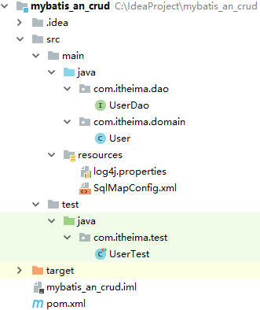
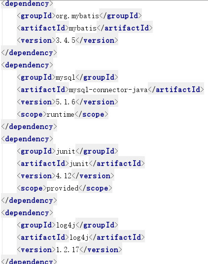
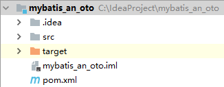
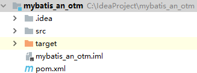
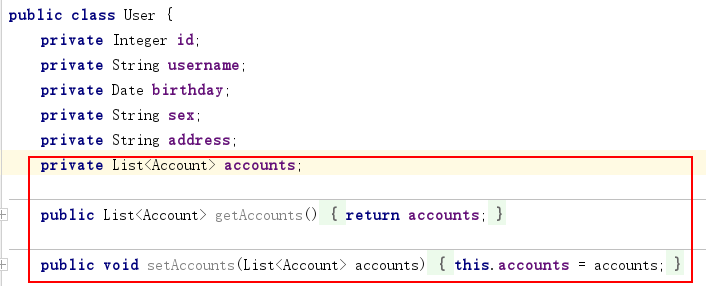

# 第一章：数据库环境准备

这里我们使用mysql数据库。

用SQLyog执行资料中mybatisdb.sql文件直接完成数据库以及表的创建。

# 第二章：mybatis注解实现CRUD

## ①创建maven工程



## ②导入所需jar包坐标



## ③提供mybatis主配置文件SqlMapConfig.xml

```xml
<?xml version="1.0" encoding="UTF-8" ?>
<!DOCTYPE configuration
        PUBLIC "-//mybatis.org//DTD Config 3.0//EN"
        "http://mybatis.org/dtd/mybatis-3-config.dtd">
<configuration>
    <typeAliases>
        <package name="com.itheima.domain"/>
    </typeAliases>
    <environments default="development">
        <environment id="development">
            <transactionManager type="JDBC"/>
            <dataSource type="POOLED">
                <property name="driver" value="com.mysql.jdbc.Driver"/>
                <property name="url" value="jdbc:mysql://localhost:3306/mybatisdb"/>
                <property name="username" value="root"/>
                <property name="password" value="root"/>
            </dataSource>
        </environment>
    </environments>
    <mappers>
        <package name="com.itheima.dao"/>
    </mappers>
</configuration>
```


## ④编写User实体类

```java
package com.itheima.domain;

import java.util.Date;

public class User {
    private Integer id;
    private String username;
    private Date birthday;
    private String sex;
    private String address;

    public Integer getId() {
        return id;
    }

    public void setId(Integer id) {
        this.id = id;
    }

    public String getUsername() {
        return username;
    }

    public void setUsername(String username) {
        this.username = username;
    }

    public Date getBirthday() {
        return birthday;
    }

    public void setBirthday(Date birthday) {
        this.birthday = birthday;
    }

    public String getSex() {
        return sex;
    }

    public void setSex(String sex) {
        this.sex = sex;
    }

    public String getAddress() {
        return address;
    }

    public void setAddress(String address) {
        this.address = address;
    }
}

```


## ⑤编写编写UserDao接口

```java
package com.itheima.dao;

import com.itheima.domain.User;
import org.apache.ibatis.annotations.Delete;
import org.apache.ibatis.annotations.Insert;
import org.apache.ibatis.annotations.Select;
import org.apache.ibatis.annotations.Update;

import java.util.List;

public interface UserDao {
    /**
     * 查询所有用户
     */
    @Select("select * from user")
    public List<User> findAll();

    /**
     * 添加用户
     * @param user
     */
    @Insert("insert into user (username, birthday, sex, address) " +
            "values " +
            "(#{username}, #{birthday}, #{sex}, #{address})")
    public void saveUser(User user);

    /**
     * 修改用户
     * @param user
     */
    @Update("update user set username = #{username}," +
            "birthday = #{birthday}," +
            "sex = #{sex}," +
            "address = #{address}" +
            "where id = #{id}")
    public void updateUser(User user);

    /**
     * 根据id删除用户
     * @param id
     */
    @Delete("delete from user where id = #{id}")
    public void deleteUserById(Integer id);
}

```


## ⑥通过测试类UserTest测试效果

```java
package com.itheima.test;

import com.itheima.dao.UserDao;
import com.itheima.domain.User;
import org.apache.ibatis.io.Resources;
import org.apache.ibatis.session.SqlSession;
import org.apache.ibatis.session.SqlSessionFactory;
import org.apache.ibatis.session.SqlSessionFactoryBuilder;
import org.junit.Before;
import org.junit.Test;

import java.io.IOException;
import java.io.InputStream;
import java.util.Date;
import java.util.List;

public class UserTest {

    /**
     * 全局SqlSessionFactory工厂对象
     */
    private SqlSessionFactory sqlSessionFactory;

    /**
     * 构建SqlSessionFactory工厂
     */
    @Before
    public void buildSqlSessionFactory(){
        //获得mybatis主配置文件流
        InputStream is = null;
        try {
            is = Resources.getResourceAsStream("SqlMapConfig.xml");
            //得到SqlSessionFactory对象
            sqlSessionFactory = new SqlSessionFactoryBuilder().build(is);
        } catch (IOException e) {
            e.printStackTrace();
        }
    }
    /**
     * 查询所有用户测试
     */
    @Test
    public void findAll() throws Exception {
        //通过SqlSessionFactory对象生产出SqlSession对象
        SqlSession sqlSession = sqlSessionFactory.openSession();
        //得到接口代理对象
        UserDao userDao = sqlSession.getMapper(UserDao.class);
        //调用代理方法
        List<User> list = userDao.findAll();
        //输出结果
        for (User user : list) {
            System.out.println(user.getUsername());
        }
        //关闭SqlSession
        sqlSession.close();
    }

    /**
     * 添加用户测试
     */
    @Test
    public void saveUser() throws Exception {
        //通过SqlSessionFactory对象生产出SqlSession对象
        SqlSession sqlSession = sqlSessionFactory.openSession();
        //得到接口代理对象
        UserDao userDao = sqlSession.getMapper(UserDao.class);
        //封装添加的用户对象
        User user = new User();
        user.setUsername("小明");
        user.setBirthday(new Date());
        user.setSex("男");
        user.setAddress("黑马程序员");
        //调用代理方法
        userDao.saveUser(user);
        //提交事务
        sqlSession.commit();
        //关闭SqlSession
        sqlSession.close();
    }

    /**
     * 修改用户测试
     */
    @Test
    public void updateUser() throws Exception {
        //通过SqlSessionFactory对象生产出SqlSession对象
        SqlSession sqlSession = sqlSessionFactory.openSession();
        //得到接口代理对象
        UserDao userDao = sqlSession.getMapper(UserDao.class);
        //封装添加的用户对象
        User user = new User();
        user.setId(82);
        user.setUsername("小红");
        user.setBirthday(new Date());
        user.setSex("男");
        user.setAddress("黑马程序员");
        //调用代理方法
        userDao.updateUser(user);
        //提交事务
        sqlSession.commit();
        //关闭SqlSession
        sqlSession.close();
    }

    /**
     * 删除用户测试
     */
    @Test
    public void deleteUser() throws Exception {
        //通过SqlSessionFactory对象生产出SqlSession对象
        SqlSession sqlSession = sqlSessionFactory.openSession();
        //得到接口代理对象
        UserDao userDao = sqlSession.getMapper(UserDao.class);
        //调用代理方法
        userDao.deleteUserById(82);
        //提交事务
        sqlSession.commit();
        //关闭SqlSession
        sqlSession.close();
    }
}

```

# 第三章：mybatis注解实现一对一关联查询

## ①复制一份mybatis_an_crud项目改名为mybatis_an_oto



## ②打开mybatis_an_oto工程删除UserDao中所有接口和UserTest中所有测试方法

UserDao.java

```java
package com.itheima.dao;

public interface UserDao {

}

```

UserTest.java

```java
 package com.itheima.test;

import org.apache.ibatis.io.Resources;
import org.apache.ibatis.session.SqlSessionFactory;
import org.apache.ibatis.session.SqlSessionFactoryBuilder;
import org.junit.Before;

import java.io.IOException;
import java.io.InputStream;

public class UserTest {
    /**
     * 全局SqlSessionFactory工厂对象
     */
    private SqlSessionFactory sqlSessionFactory;

    /**
     * 构建SqlSessionFactory工厂
     */
    @Before
    public void buildSqlSessionFactory(){
        //获得mybatis主配置文件流
        InputStream is = null;
        try {
            is = Resources.getResourceAsStream("SqlMapConfig.xml");
            //得到SqlSessionFactory对象
            sqlSessionFactory = new SqlSessionFactoryBuilder().build(is);
        } catch (IOException e) {
            e.printStackTrace();
        }
    }

} 
```

## ③新增Account对象，并在其中加入User对象属性。

```java
package com.itheima.domain;

public class Account {
    private Integer id;
    private Integer uid;
    private Double money;
    private User user;

    public Integer getId() {
        return id;
    }

    public void setId(Integer id) {
        this.id = id;
    }

    public Integer getUid() {
        return uid;
    }

    public void setUid(Integer uid) {
        this.uid = uid;
    }

    public Double getMoney() {
        return money;
    }

    public void setMoney(Double money) {
        this.money = money;
    }

    public User getUser() {
        return user;
    }

    public void setUser(User user) {
        this.user = user;
    }
}
```

## ④新增AccountDao接口

```java
package com.itheima.dao;

import com.itheima.domain.Account;
import com.itheima.domain.User;
import org.apache.ibatis.annotations.One;
import org.apache.ibatis.annotations.Result;
import org.apache.ibatis.annotations.Results;
import org.apache.ibatis.annotations.Select;
import org.apache.ibatis.mapping.FetchType;

import java.util.List;

public interface AccountDao {
    /**
     * 查询所有账户以及用户信息
     */
    @Select("select * from account")
    @Results({
            @Result(id = true, property = "id", column = "id"),
            @Result(property = "uid", column = "uid"),
            @Result(property = "money", column = "money"),
            @Result(property = "user", column = "uid", javaType = User.class,
                    one = @One(select = "com.itheima.dao.UserDao.findById", fetchType = FetchType.LAZY))
    })
    public List<Account> findAllWithUser();
}

```

## ⑤在UserDao接口中增加接口

```java
package com.itheima.dao;

import com.itheima.domain.User;
import org.apache.ibatis.annotations.Select;

public interface UserDao {

    /**
     * 根据用户id查询用户
     * @param id
     * @return
     */
    @Select("select * from user where id = #{id}")
    public User findById(Integer id);
}
```

## ⑥编写AccountTest测试结果

```java
package com.itheima.test;

import com.itheima.dao.AccountDao;
import com.itheima.domain.Account;
import com.itheima.domain.User;
import org.apache.ibatis.io.Resources;
import org.apache.ibatis.session.SqlSession;
import org.apache.ibatis.session.SqlSessionFactory;
import org.apache.ibatis.session.SqlSessionFactoryBuilder;
import org.junit.Before;
import org.junit.Test;

import java.io.IOException;
import java.io.InputStream;
import java.util.List;

public class AccountTest {
    /**
     * 全局SqlSessionFactory工厂对象
     */
    private SqlSessionFactory sqlSessionFactory;

    /**
     * 构建SqlSessionFactory工厂
     */
    @Before
    public void buildSqlSessionFactory(){
        //获得mybatis主配置文件流
        InputStream is = null;
        try {
            is = Resources.getResourceAsStream("SqlMapConfig.xml");
            //得到SqlSessionFactory对象
            sqlSessionFactory = new SqlSessionFactoryBuilder().build(is);
        } catch (IOException e) {
            e.printStackTrace();
        }
    }

    /**
     * 查询所有账户以及所属客户信息
     */
    @Test
    public void findAllWithUserTest(){
        //获得SqlSession对象
        SqlSession sqlSession = sqlSessionFactory.openSession();
        //生成接口代理对象
        AccountDao accountDao = sqlSession.getMapper(AccountDao.class);
        //调用代理方法
        List<Account> list = accountDao.findAllWithUser();
        //打印结果
        for (Account account : list) {
            System.out.println(account.getMoney());
            User user = account.getUser();
            System.out.println(user.getUsername());
            System.out.println();
        }
    }

}
```

# 第四章：mybatis注解实现一对多关联查询

## ①复制一份mybatis_an_oto项目改名为mybatis_an_otm



## ②在User对象中添加Account集合属性



## ③在UserDao中添加查询所有用户以及账户接口

```java
    /**
     * 查询所有用户及其账户信息
     */
    @Select("select * from user")
    @Results({
            @Result(id = true, property = "id", column = "id"),
            @Result(property = "username", column = "username"),
            @Result(property = "birthday", column = "birthday"),
            @Result(property = "sex", column = "sex"),
            @Result(property = "address", column = "address"),
            @Result(property = "accounts", column = "id", javaType = List.class,
                    one = @One(select = "com.itheima.dao.AccountDao.findAccountsByUid", 						  fetchType = FetchType.LAZY))
    })
    public List<User> findAllWithAccount();
```

## ④在AccountDao中添加根据用户id查询账户信息的接口

```java
   /**
     * 根据用户id查询账户
     * @param uid
     * @return
     */
    @Select("select * from account where uid = #{uid}")
    public List<Account> findAccountsByUid(Integer uid);
```

## ⑤在UserTest中添加测试方法测试效果

```java
    /**
     * 查询所有用户以及客户信息
     */
    @Test
    public void findAllWithAccountTest(){
        //获得SqlSession对象
        SqlSession sqlSession = sqlSessionFactory.openSession();
        //生成接口代理对象
        UserDao userDao = sqlSession.getMapper(UserDao.class);
        //调用代理方法
        List<User> list = userDao.findAllWithAccount();
        //打印结果
        for (User user : list) {
            System.out.println(user.getUsername());
            List<Account> accounts = user.getAccounts();
            for (Account account : accounts) {
                System.out.println(account.getMoney());
            }
            System.out.println();
        }
    }
```

