# MybatisPlus

## 1、了解Mybatis-Plus

### 1.1、Mybatis-Plus介绍

> MyBatis-Plus（简称 MP）是一个 MyBatis 的增强工具，在 MyBatis 的基础上只做增强不做改变，为简化开发、提高 效率而生。 官网：https://mybatis.plus/ 或 https://mp.baomidou.com/


### 1.2、代码以及文档

> 文档地址：https://mybatis.plus/guide/
>
> 源码地址：https://github.com/baomidou/mybatis-plus

### 1.3、特性

- 无侵入：只做增强不做改变，引入它不会对现有工程产生影响，如丝般顺滑
- 损耗小：启动即会自动注入基本 CURD，性能基本无损耗，直接面向对象操作 强大的 CRUD 
- 操作：内置通用 Mapper、通用 Service，仅仅通过少量配置即可实现单表大部分 CRUD 操作， 更有强大的条件构造器，满足各类使用需求
- 支持 Lambda 形式调用：通过 Lambda 表达式，方便的编写各类查询条件，无需再担心字段写错 
- 支持多种数据库：支持 MySQL、MariaDB、Oracle、DB2、H2、HSQL、SQLite、Postgre、 SQLServer2005、SQLServer 等多种数据库 
- 支持主键自动生成：支持多达 4 种主键策略（内含分布式唯一 ID 生成器 - Sequence），可自由配置，完美解 决主键问题 
- 支持 XML 热加载：Mapper 对应的 XML 支持热加载，对于简单的 CRUD 操作，甚至可以无 XML 启动 
- 支持 ActiveRecord 模式：支持 ActiveRecord 形式调用，实体类只需继承 Model 类即可进行强大的 CRUD 操 作 
- 支持自定义全局通用操作：支持全局通用方法注入（ Write once, use anywhere ） 
- 支持关键词自动转义：支持数据库关键词（order、key......）自动转义，还可自定义关键词 
- 内置代码生成器：采用代码或者 Maven 插件可快速生成 Mapper 、 Model 、 Service 、 Controller 层代码， 支持模板引擎，更有超多自定义配置等您来使用
- 内置分页插件：基于 MyBatis 物理分页，开发者无需关心具体操作，配置好插件之后，写分页等同于普通 List 查询
- 内置性能分析插件：可输出 Sql 语句以及其执行时间，建议开发测试时启用该功能，能快速揪出慢查询
- 内置全局拦截插件：提供全表 delete 、 update 操作智能分析阻断，也可自定义拦截规则，预防误操作 内置 Sql 注入剥离器：支持 Sql 注入剥离，有效预防 Sql 注入攻击

### 1.4、架构

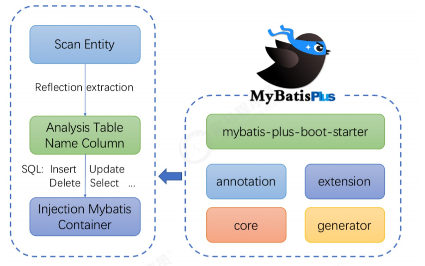

## 2、快速开始

>对于Mybatis整合MP有常常有三种用法，分别是Mybatis+MP、Spring+Mybatis+MP、Spring Boot+Mybatis+MP。

### 2.1、创建数据库以及表  

```sql
-- 创建测试表
CREATE TABLE `tb_user` (
`id` bigint(20) NOT NULL AUTO_INCREMENT COMMENT '主键ID',
`user_name` varchar(20) NOT NULL COMMENT '用户名',
`password` varchar(20) NOT NULL COMMENT '密码',
`name` varchar(30) DEFAULT NULL COMMENT '姓名',
`age` int(11) DEFAULT NULL COMMENT '年龄',
`email` varchar(50) DEFAULT NULL COMMENT '邮箱',
PRIMARY KEY (`id`)
) ENGINE=InnoDB AUTO_INCREMENT=1 DEFAULT CHARSET=utf8;
-- 插入测试数据
INSERT INTO `tb_user` (`id`, `user_name`, `password`, `name`, `age`, `email`) VALUES
('1', 'zhangsan', '123456', '张三', '18', 'test1@itcast.cn');
INSERT INTO `tb_user` (`id`, `user_name`, `password`, `name`, `age`, `email`) VALUES
('2', 'lisi', '123456', '李四', '20', 'test2@itcast.cn');
INSERT INTO `tb_user` (`id`, `user_name`, `password`, `name`, `age`, `email`) VALUES
('3', 'wangwu', '123456', '王五', '28', 'test3@itcast.cn');
INSERT INTO `tb_user` (`id`, `user_name`, `password`, `name`, `age`, `email`) VALUES
('4', 'zhaoliu', '123456', '赵六', '21', 'test4@itcast.cn');
INSERT INTO `tb_user` (`id`, `user_name`, `password`, `name`, `age`, `email`) VALUES
('5', 'sunqi', '123456', '孙七', '24', 'test5@itcast.cn');
```


### 2.2、创建工程  

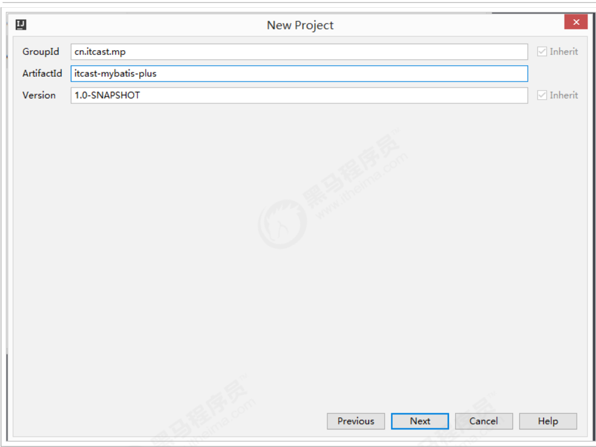

导入依赖:

```xml
<?xml version="1.0" encoding="UTF-8"?>
<project xmlns="http://maven.apache.org/POM/4.0.0"
xmlns:xsi="http://www.w3.org/2001/XMLSchema-instance"
xsi:schemaLocation="http://maven.apache.org/POM/4.0.0
http://maven.apache.org/xsd/maven-4.0.0.xsd">
<modelVersion>4.0.0</modelVersion>
<groupId>cn.itcast.mp</groupId>
<artifactId>itcast-mybatis-plus</artifactId>
<version>1.0-SNAPSHOT</version>
<modules>
<module>itcast-mybatis-plus-simple</module>
</modules>
<packaging>pom</packaging>
<dependencies>
<!-- mybatis-plus插件依赖 -->
<dependency>
<groupId>com.baomidou</groupId>
<artifactId>mybatis-plus</artifactId>
<version>3.1.1</version>
</dependency>
<!-- MySql -->
    <dependency>
<groupId>mysql</groupId>
<artifactId>mysql-connector-java</artifactId>
<version>5.1.47</version>
</dependency>
<!-- 连接池 -->
<dependency>
<groupId>com.alibaba</groupId>
<artifactId>druid</artifactId>
<version>1.0.11</version>
</dependency>
<!--简化bean代码的工具包-->
<dependency>
<groupId>org.projectlombok</groupId>
<artifactId>lombok</artifactId>
<optional>true</optional>
<version>1.18.4</version>
</dependency>
<dependency>
<groupId>junit</groupId>
<artifactId>junit</artifactId>
<version>4.12</version>
</dependency>
<dependency>
<groupId>org.slf4j</groupId>
<artifactId>slf4j-log4j12</artifactId>
<version>1.6.4</version>
</dependency>
</dependencies>
<build>
<plugins>
<plugin>
<groupId>org.apache.maven.plugins</groupId>
<artifactId>maven-compiler-plugin</artifactId>
<configuration>
<source>1.8</source>
<target>1.8</target>
</configuration>
</plugin>
</plugins>
</build>
</project>
```

### 2.3、Mybatis + MP  

> 下面演示，通过纯Mybatis和Mybatis-Plus两种方式查询  

#### 2.3.1、创建子Module  

引入依赖

```xml
<?xml version="1.0" encoding="UTF-8"?>
<project xmlns="http://maven.apache.org/POM/4.0.0"
xmlns:xsi="http://www.w3.org/2001/XMLSchema-instance"
xsi:schemaLocation="http://maven.apache.org/POM/4.0.0
http://maven.apache.org/xsd/maven-4.0.0.xsd">
<parent>
<artifactId>itcast-mybatis-plus</artifactId>
<groupId>cn.itcast.mp</groupId>
<version>1.0-SNAPSHOT</version>
</parent>
<modelVersion>4.0.0</modelVersion>
<packaging>jar</packaging>
<artifactId>itcast-mybatis-plus-simple</artifactId>
</project>
```

log4j.properties：  

```properties
log4j.rootLogger=DEBUG,A1
log4j.appender.A1=org.apache.log4j.ConsoleAppender
log4j.appender.A1.layout=org.apache.log4j.PatternLayout
log4j.appender.A1.layout.ConversionPattern=[%t] [%c]-[%p] %m%n
```

#### 2.3.2、纯Mybatis实现查询User  

- 第一步，编写mybatis-config.xml文件:

  ```xml
  <?xml version="1.0" encoding="UTF-8" ?>
  <!DOCTYPE configuration
  PUBLIC "-//mybatis.org//DTD Config 3.0//EN"
  "http://mybatis.org/dtd/mybatis-3-config.dtd">
  <configuration>
  <environments default="development">
  <environment id="development">
  <transactionManager type="JDBC"/>
  <dataSource type="POOLED">
  <property name="driver" value="com.mysql.jdbc.Driver"/>
  <property name="url" value="jdbc:mysql://127.0.0.1:3306/mp?
  useUnicode=true&amp;characterEncoding=utf8&amp;autoReconnect=true&amp;allowMultiQuerie
  s=true&amp;useSSL=false"/>
  <property name="username" value="root"/>
  <property name="password" value="root"/>
  </dataSource>
  </environment>
  </environments>
  <mappers>
  <mapper resource="UserMapper.xml"/>
  </mappers>
  </configuration>
  ```

- 第二步，编写User实体对象：（这里使用lombok进行了进化bean操作） 

  ```java
  package cn.itcast.mp.simple.pojo;
  import lombok.AllArgsConstructor;
  import lombok.Data;
  import lombok.NoArgsConstructor;
  @Data
  @NoArgsConstructor
  @AllArgsConstructor
  public class User {
      private Long id;
      private String userName;
      private String password;
      private String name;
      private Integer age;
      private String email;
  }
  ```

  

- 第三步，编写UserMapper接口：  

  ```java
  package cn.itcast.mp.simple.mapper;
  import cn.itcast.mp.simple.pojo.User;
  import java.util.List;
  public interface UserMapper {
  List<User> findAll();
  }
  ```

  

- 第四步，编写UserMapper.xml文件：  

  ```xml
  <?xml version="1.0" encoding="UTF-8" ?>
  <!DOCTYPE mapper
  PUBLIC "-//mybatis.org//DTD Mapper 3.0//EN"
  "http://mybatis.org/dtd/mybatis-3-mapper.dtd">
  <mapper namespace="cn.itcast.mp.simple.mapper.UserMapper">
  <select id="findAll" resultType="cn.itcast.mp.simple.pojo.User">
  select * from tb_user
  </select>
  </mapper>
  ```

  

- 第五步，编写TestMybatis测试用例：  

  ```java
  package cn.itcast.mp.simple;
  import cn.itcast.mp.simple.mapper.UserMapper;
  import cn.itcast.mp.simple.pojo.User;
  import org.apache.ibatis.io.Resources;
  import org.apache.ibatis.session.SqlSession;
  import org.apache.ibatis.session.SqlSessionFactory;
  import org.apache.ibatis.session.SqlSessionFactoryBuilder;
  import org.junit.Test;
  import java.io.InputStream;
  import java.util.List;
  public class TestMybatis {
  @Test
  public void testUserList() throws Exception{
  String resource = "mybatis-config.xml";
  InputStream inputStream = Resources.getResourceAsStream(resource);
  SqlSessionFactory sqlSessionFactory = new
  SqlSessionFactoryBuilder().build(inputStream);
  SqlSession sqlSession = sqlSessionFactory.openSession();
  UserMapper userMapper = sqlSession.getMapper(UserMapper.class);
  List<User> list = userMapper.findAll();
  for (User user : list) {
  System.out.println(user);
  }
  }
  }
  ```

  测试结果:

  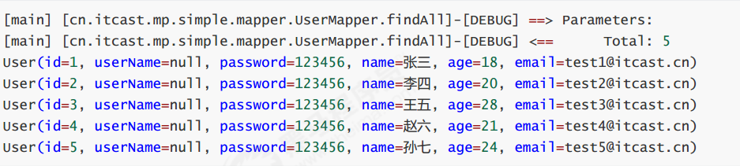

  

#### 2.3.3、Mybatis+MP实现查询User  

- 第一步，将UserMapper继承BaseMapper，将拥有了BaseMapper中的所有方法：  

  ```java
  package cn.itcast.mp.simple.mapper;
  import cn.itcast.mp.simple.pojo.User;
  import com.baomidou.mybatisplus.core.mapper.BaseMapper;
  import java.util.List;
  public interface UserMapper extends BaseMapper<User> {
  List<User> findAll();
  }
  ```

  

- 第二步，使用MP中的MybatisSqlSessionFactoryBuilder进程构建：  

  ```java
  package cn.itcast.mp.simple;
  import cn.itcast.mp.simple.mapper.UserMapper;
  import cn.itcast.mp.simple.pojo.User;
  import com.baomidou.mybatisplus.core.MybatisSqlSessionFactoryBuilder;
  import org.apache.ibatis.io.Resources;
  import org.apache.ibatis.session.SqlSession;
  import org.apache.ibatis.session.SqlSessionFactory;
  import org.apache.ibatis.session.SqlSessionFactoryBuilder;
  import org.junit.Test;
  import java.io.InputStream;
  import java.util.List;
  public class TestMybatisPlus {
  @Test
  public void testUserList() throws Exception{
  String resource = "mybatis-config.xml";
  InputStream inputStream = Resources.getResourceAsStream(resource);
  //这里使用的是MP中的MybatisSqlSessionFactoryBuilder
  SqlSessionFactory sqlSessionFactory = new
  MybatisSqlSessionFactoryBuilder().build(inputStream);
  SqlSession sqlSession = sqlSessionFactory.openSession();
  UserMapper userMapper = sqlSession.getMapper(UserMapper.class);
  // 可以调用BaseMapper中定义的方法
  List<User> list = userMapper.selectList(null);
  for (User user : list) {
  System.out.println(user);
  }
  }
  }
  ```

  > 运行报错：  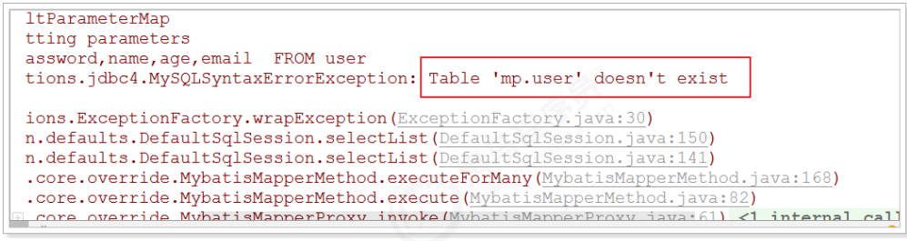

  > 解决:在User对象中添加@TableName，指定数据库表名  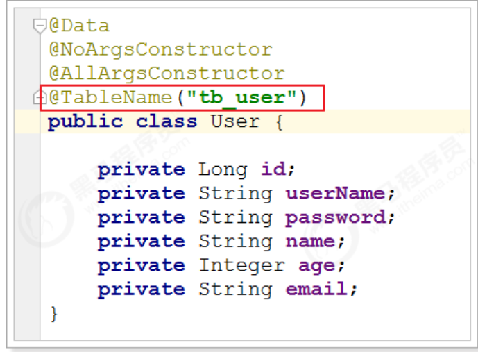
  >
  > 测试:
  >
  > 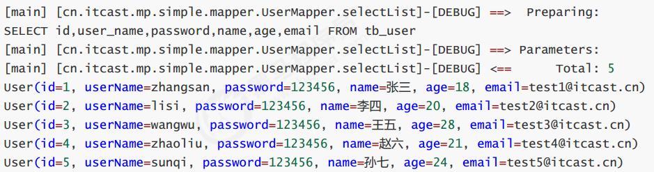
  >
  > 说明:
  >
  > 1. 由于使用了MybatisSqlSessionFactoryBuilder进行了构建，继承的BaseMapper中的方法就载入到了
  >    SqlSession中，所以就可以直接使用相关的方法；  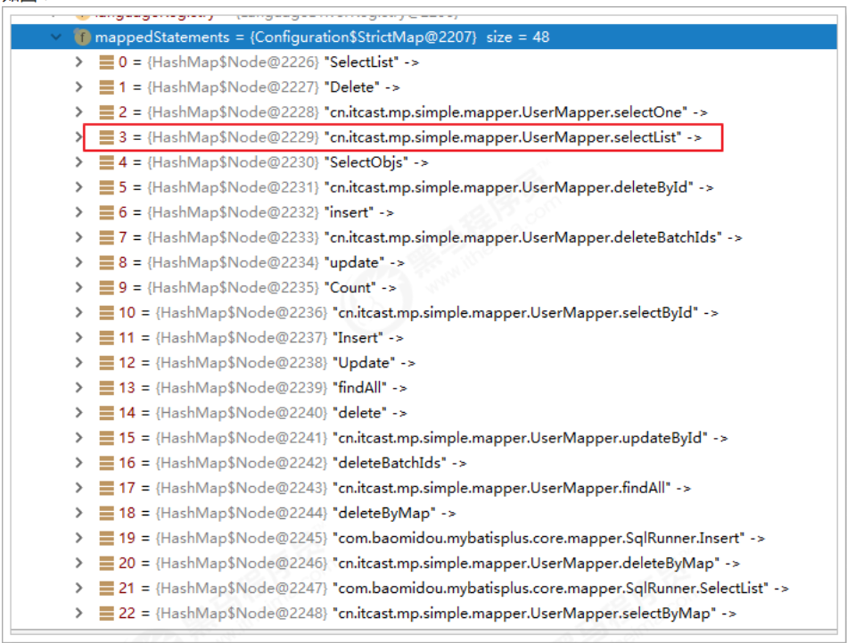

  

### 2.4、Spring + Mybatis + MP  

> 引入了Spring框架，数据源、构建等工作就交给了Spring管理。  Spring下的mybatis 和MybatisPlus

#### 2.4.1、创建子Module  

```xml
<?xml version="1.0" encoding="UTF-8"?>
<project xmlns="http://maven.apache.org/POM/4.0.0"
xmlns:xsi="http://www.w3.org/2001/XMLSchema-instance"
xsi:schemaLocation="http://maven.apache.org/POM/4.0.0
http://maven.apache.org/xsd/maven-4.0.0.xsd">
<parent>
<artifactId>itcast-mybatis-plus</artifactId>
<groupId>cn.itcast.mp</groupId>
<version>1.0-SNAPSHOT</version>
</parent>
<modelVersion>4.0.0</modelVersion>
<artifactId>itcast-mybatis-plus-spring</artifactId>
<properties>
<spring.version>5.1.6.RELEASE</spring.version>
</properties>
<dependencies>
<dependency>
<groupId>org.springframework</groupId>
<artifactId>spring-webmvc</artifactId>
<version>${spring.version}</version>
</dependency>
<dependency>
<groupId>org.springframework</groupId>
<artifactId>spring-jdbc</artifactId>
<version>${spring.version}</version>
</dependency>
<dependency>
<groupId>org.springframework</groupId>
<artifactId>spring-test</artifactId>
<version>${spring.version}</version>
</dependency>
</dependencies>
</project>
```


#### 2.4.2、实现查询User  

- 第一步，编写jdbc.properties  

  ```properties
  jdbc.driver=com.mysql.jdbc.Driver
  jdbc.url=jdbc:mysql://127.0.0.1:3306/mp?
  useUnicode=true&characterEncoding=utf8&autoReconnect=true&allowMultiQueries=true&useSSL=false
  jdbc.username=root
  jdbc.password=root
  ```

  

- 第二步，编写applicationContext.xml  

  ```xml
  <?xml version="1.0" encoding="UTF-8"?>
  <beans xmlns="http://www.springframework.org/schema/beans"
  xmlns:xsi="http://www.w3.org/2001/XMLSchema-instance"
  xmlns:context="http://www.springframework.org/schema/context"
  xsi:schemaLocation="http://www.springframework.org/schema/beans
  http://www.springframework.org/schema/beans/spring-beans.xsd
  http://www.springframework.org/schema/context
  http://www.springframework.org/schema/context/spring-context.xsd">
  <context:property-placeholder location="classpath:*.properties"/>
  <!-- 定义数据源 -->
  <bean id="dataSource" class="com.alibaba.druid.pool.DruidDataSource"
  destroy-method="close">
  <property name="url" value="${jdbc.url}"/>
  <property name="username" value="${jdbc.username}"/>
  <property name="password" value="${jdbc.password}"/>
  <property name="driverClassName" value="${jdbc.driver}"/>
  <property name="maxActive" value="10"/>
  <property name="minIdle" value="5"/>
  </bean>
  <!--这里使用MP提供的sqlSessionFactory，完成了Spring与MP的整合-->
  <bean id="sqlSessionFactory"
  class="com.baomidou.mybatisplus.extension.spring.MybatisSqlSessionFactoryBean">
  <property name="dataSource" ref="dataSource"/>
  </bean>
  <!--扫描mapper接口，使用的依然是Mybatis原生的扫描器-->
  <bean class="org.mybatis.spring.mapper.MapperScannerConfigurer">
  <property name="basePackage" value="cn.itcast.mp.simple.mapper"/>
  </bean>
  </beans>
  ```

  

- 第三步，编写User对象以及UserMapper接口：  

  ```java
  package cn.itcast.mp.simple.pojo;
  import com.baomidou.mybatisplus.annotation.TableName;
  import lombok.AllArgsConstructor;
  import lombok.Data;
  import lombok.NoArgsConstructor;
  @Data
  @NoArgsConstructor
  @AllArgsConstructor
  @TableName("tb_user")
  public class User {
  private Long id;
  private String userName;
  private String password;
  private String name;
  private Integer age;
  private String email;
  }
  
  ```

  ```java
  package cn.itcast.mp.simple.mapper;
  import cn.itcast.mp.simple.pojo.User;
  import com.baomidou.mybatisplus.core.mapper.BaseMapper;
  public interface UserMapper extends BaseMapper<User> {
  }
  ```

  

- 第四步，编写测试用例： 

  ```java
  package cn.itcast.mp.simple;
  import cn.itcast.mp.simple.mapper.UserMapper;
  import cn.itcast.mp.simple.pojo.User;
  import org.junit.Test;
  import org.junit.runner.RunWith;
  import org.springframework.beans.factory.annotation.Autowired;
  import org.springframework.test.context.ContextConfiguration;
  import org.springframework.test.context.junit4.SpringJUnit4ClassRunner;
  import java.util.List;
  @RunWith(SpringJUnit4ClassRunner.class)
  @ContextConfiguration(locations = "classpath:applicationContext.xml")
  public class TestSpringMP {
  @Autowired
  private UserMapper userMapper;
  @Test
  public void testSelectList(){
  List<User> users = this.userMapper.selectList(null);
  for (User user : users) {
  System.out.println(user);
  }
  }
  }
  ```

   测试:

  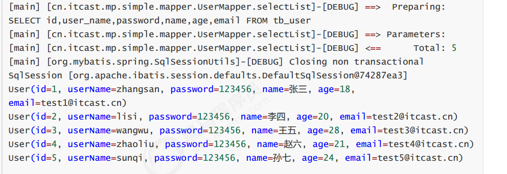

### 2.5、SpringBoot + Mybatis + MP

>使用SpringBoot将进一步的简化MP的整合，需要注意的是，由于使用SpringBoot需要继承parent，所以需要重新创
>建工程，并不是创建子Module。

#### 2.5.1、创建工程

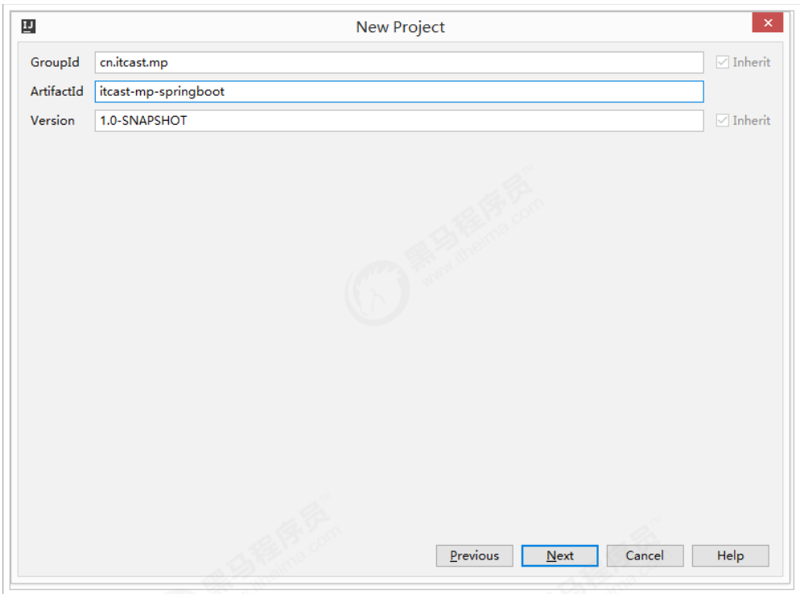

#### 2.5.2、导入依赖  

```xml
<?xml version="1.0" encoding="UTF-8"?>
<project xmlns="http://maven.apache.org/POM/4.0.0"
xmlns:xsi="http://www.w3.org/2001/XMLSchema-instance"
xsi:schemaLocation="http://maven.apache.org/POM/4.0.0
http://maven.apache.org/xsd/maven-4.0.0.xsd">
<modelVersion>4.0.0</modelVersion>
<parent>
<groupId>org.springframework.boot</groupId>
<artifactId>spring-boot-starter-parent</artifactId>
<version>2.1.4.RELEASE</version>
</parent>
<groupId>cn.itcast.mp</groupId>
<artifactId>itcast-mp-springboot</artifactId>
<version>1.0-SNAPSHOT</version>
<dependencies>
<dependency>
<groupId>org.springframework.boot</groupId>
<artifactId>spring-boot-starter</artifactId>
<exclusions>
<exclusion>
<groupId>org.springframework.boot</groupId>
<artifactId>spring-boot-starter-logging</artifactId>
</exclusion>
</exclusions>
</dependency>
<dependency>
<groupId>org.springframework.boot</groupId>
<artifactId>spring-boot-starter-test</artifactId>
<scope>test</scope>
</dependency>
<!--简化代码的工具包-->
<dependency>
<groupId>org.projectlombok</groupId>
<artifactId>lombok</artifactId>
<optional>true</optional>
</dependency>
<!--mybatis-plus的springboot支持-->
<dependency>
<groupId>com.baomidou</groupId>
<artifactId>mybatis-plus-boot-starter</artifactId>
<version>3.1.1</version>
</dependency>
<!--mysql驱动-->
<dependency>
<groupId>mysql</groupId>
<artifactId>mysql-connector-java</artifactId>
<version>5.1.47</version>
</dependency>
<dependency>
<groupId>org.slf4j</groupId>
<artifactId>slf4j-log4j12</artifactId>
</dependency>
</dependencies>
<build>
<plugins>
<plugin>
<groupId>org.springframework.boot</groupId>
<artifactId>spring-boot-maven-plugin</artifactId>
</plugin>
</plugins>
</build>
</project>
```

log4j.properties：

```protobuf
log4j.rootLogger=DEBUG,A1
log4j.appender.A1=org.apache.log4j.ConsoleAppender
log4j.appender.A1.layout=org.apache.log4j.PatternLayout
log4j.appender.A1.layout.ConversionPattern=[%t] [%c]-[%p] %m%n
```


#### 2.5.3、编写application.properties  

```properties
spring.application.name = itcast-mp-springboot
spring.datasource.driver-class-name=com.mysql.jdbc.Driver
spring.datasource.url=jdbc:mysql://127.0.0.1:3306/mp?
useUnicode=true&characterEncoding=utf8&autoReconnect=true&allowMultiQueries=true&useSSL
=false
spring.datasource.username=root
spring.datasource.password=root
```


#### 2.5.4、编写pojo  

```java
package cn.itcast.mp.pojo;
import com.baomidou.mybatisplus.annotation.TableName;
import lombok.AllArgsConstructor;
import lombok.Data;
import lombok.NoArgsConstructor;
@Data
@NoArgsConstructor
@AllArgsConstructor
@TableName("tb_user")
public class User {
private Long id;
private String userName;
private String password;
private String name;
private Integer age;
private String email;
}
```


#### 2.5.5、编写mapper 

```java
package cn.itcast.mp.mapper;
import cn.itcast.mp.pojo.User;
import com.baomidou.mybatisplus.core.mapper.BaseMapper;
public interface UserMapper extends BaseMapper<User> {
}
```


#### 2.5.6、编写启动类

```java
package cn.itcast.mp;
import org.mybatis.spring.annotation.MapperScan;
import org.springframework.boot.SpringApplication;
import org.springframework.boot.WebApplicationType;
import org.springframework.boot.autoconfigure.SpringBootApplication;
import org.springframework.boot.builder.SpringApplicationBuilder;
@MapperScan("cn.itcast.mp.mapper") //设置mapper接口的扫描包
@SpringBootApplication
public class MyApplication {
public static void main(String[] args) {
SpringApplication.run(MyApplication.class, args);
}
}
```


#### 2.5.7、编写测试用例

```java
package cn.itcast.mp;
import cn.itcast.mp.mapper.UserMapper;
import cn.itcast.mp.pojo.User;
import org.junit.Test;
import org.junit.runner.RunWith;
import org.springframework.beans.factory.annotation.Autowired;
import org.springframework.boot.test.context.SpringBootTest;
import org.springframework.test.context.junit4.SpringRunner;
import java.util.List;
@RunWith(SpringRunner.class)
@SpringBootTest
public class UserMapperTest {
@Autowired
private UserMapper userMapper;
@Test
public void testSelect() {
List<User> userList = userMapper.selectList(null);
for (User user : userList) {
System.out.println(user);
}
}
}
```

测试:

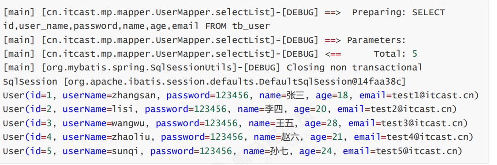


## 3、通用CRUD

>通过前面的学习，我们了解到通过继承BaseMapper就可以获取到各种各样的单表操作，接下来我们将详细讲解这些
>操作。
>
>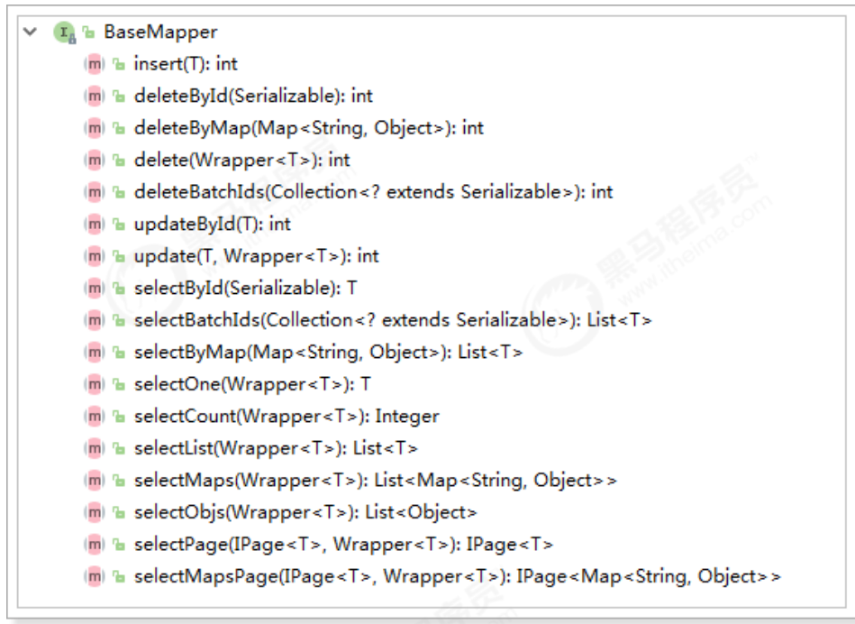

### 3.1、插入操作

#### 3.1.1、方法定义

```java
/**
* 插入一条记录
*
* @param entity 实体对象
*/
int insert(T entity);

```

#### 3.1.2、测试用例

```java
package cn.itcast.mp;
import cn.itcast.mp.mapper.UserMapper;
import cn.itcast.mp.pojo.User;
import org.junit.Test;
import org.junit.runner.RunWith;
import org.springframework.beans.factory.annotation.Autowired;
import org.springframework.boot.test.context.SpringBootTest;
import org.springframework.test.context.junit4.SpringRunner;
import java.util.List;
@RunWith(SpringRunner.class)
@SpringBootTest
public class UserMapperTest {
@Autowired
private UserMapper userMapper;
@Test
public void testInsert(){
User user = new User();
user.setAge(20);
user.setEmail("test@itcast.cn");
user.setName("曹操");
user.setUserName("caocao");
user.setPassword("123456");
int result = this.userMapper.insert(user); //返回的result是受影响的行数，并不是自增
后的id
System.out.println("result = " + result);
System.out.println(user.getId()); //自增后的id会回填到对象中
}
}
```

#### 3.1.3、测试

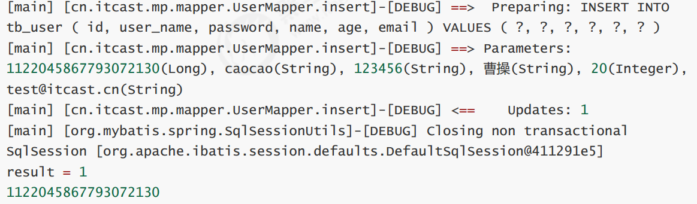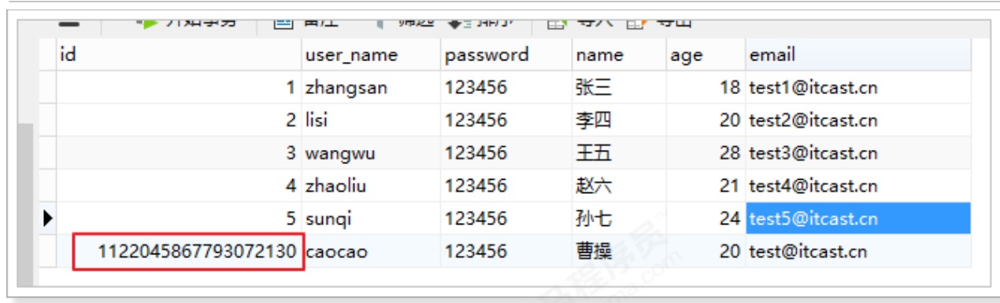

>可以看到，数据已经写入到了数据库，但是，id的值不正确，我们期望的是数据库自增长，实际是MP生成了id的值
>写入到了数据库。  

MP支持的id策略：  

```java
package com.baomidou.mybatisplus.annotation;
import lombok.Getter;
/**
* 生成ID类型枚举类
* *
@author hubin
* @since 2015-11-10
*/
@Getter
public enum IdType {
/**
* 数据库ID自增
*/
AUTO(0),
/**
* 该类型为未设置主键类型
*/
NONE(1),
/**
* 用户输入ID
* <p>该类型可以通过自己注册自动填充插件进行填充</p>
*/
INPUT(2),
/* 以下3种类型、只有当插入对象ID 为空，才自动填充。 */
/**
* 全局唯一ID (idWorker)
*/
ID_WORKER(3),
/**
* 全局唯一ID (UUID)
*/
UUID(4),
/**
* 字符串全局唯一ID (idWorker 的字符串表示)
*/
ID_WORKER_STR(5);
private final int key;
IdType(int key) {
this.key = key;
}
}
```

修改User对象:

```java
@Data
@NoArgsConstructor
@AllArgsConstructor
@TableName("tb_user")
public class User {
@TableId(type = IdType.AUTO) //指定id类型为自增长
private Long id;
private String userName;
private String password;
private String name;
private Integer age;
private String email;
}
```

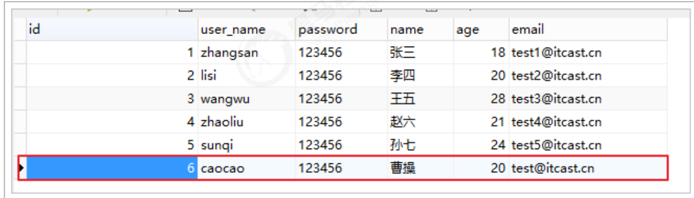

#### 3.1.4、@TableField

>在MP中通过@TableField注解可以指定字段的一些属性，常常解决的问题有2个：
>1、对象中的属性名和字段名不一致的问题（非驼峰）
>2、对象中的属性字段在表中不存在的问题  

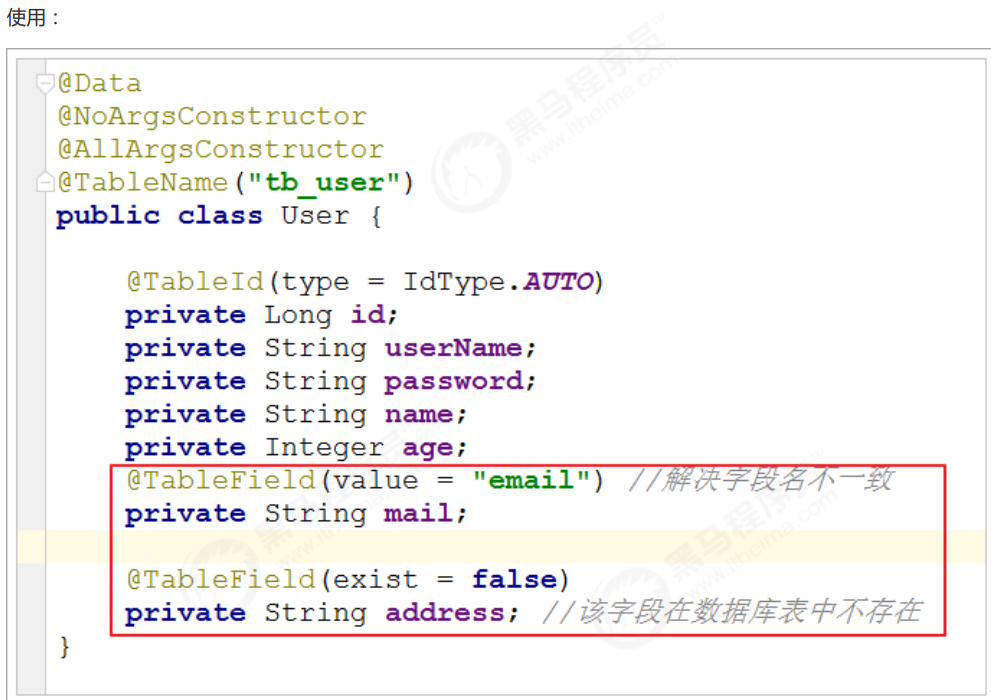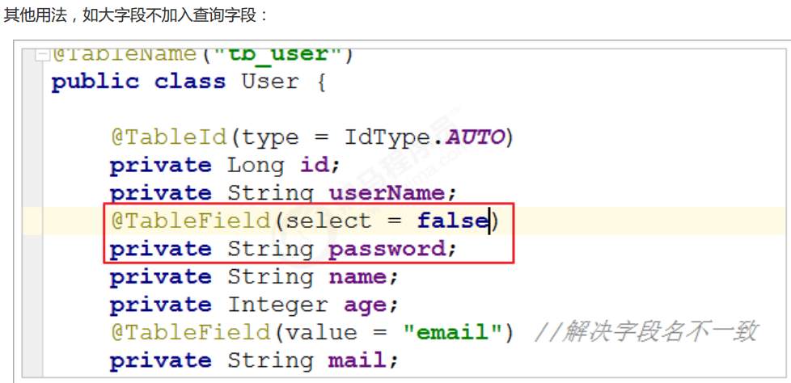

### 3.2、更新操作

>在MP中，更新操作有2种，一种是根据id更新，另一种是根据条件更新。  

#### 3.2.1、根据id更新  

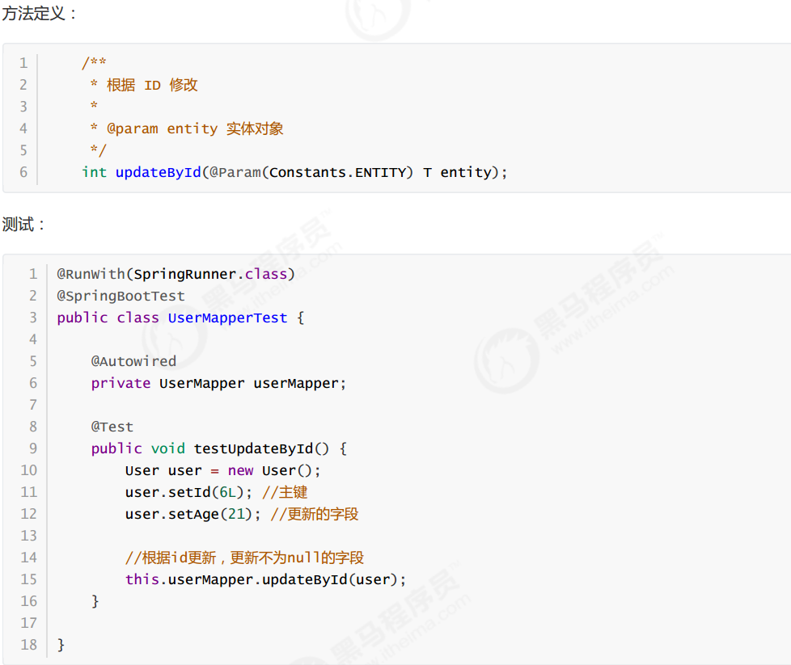

#### 3.2.2、根据条件更新  

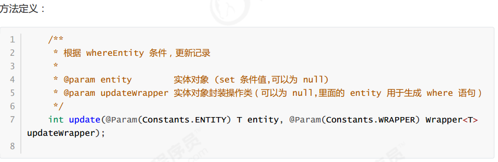

```java
@RunWith(SpringRunner.class)
@SpringBootTest
public class UserMapperTest {
@Autowired
private UserMapper userMapper;
@Test
public void testUpdate() {
User user = new User();
user.setAge(22); //更新的字段
//更新的条件
QueryWrapper<User> wrapper = new QueryWrapper<>();
wrapper.eq("id", 6);
//执行更新操作
int result = this.userMapper.update(user, wrapper);
System.out.println("result = " + result);
}
}
```

或者，通过UpdateWrapper进行更新：  

```java
@Test
public void testUpdate() {
//更新的条件以及字段
UpdateWrapper<User> wrapper = new UpdateWrapper<>();
wrapper.eq("id", 6).set("age", 23);
//执行更新操作
int result = this.userMapper.update(null, wrapper);
System.out.println("result = " + result);
}
```

### 3.3、删除操作  

#### 3.3.1、deleteById  

```java
**
* 根据 ID 删除
* *
@param id 主键ID
*/
int deleteById(Serializable id);
```

```java
@RunWith(SpringRunner.class)
@SpringBootTest
public class UserMapperTest {
@Autowired
private UserMapper userMapper;
@Test
public void testDeleteById() {
//执行删除操作
int result = this.userMapper.deleteById(6L);
System.out.println("result = " + result);
}
}
```

#### 3.3.2、deleteByMap 

```java
/**
* 根据 columnMap 条件，删除记录
* *
@param columnMap 表字段 map 对象
*/
int deleteByMap(@Param(Constants.COLUMN_MAP) Map<String, Object> columnMap);

```


```java
@RunWith(SpringRunner.class)
@SpringBootTest
public class UserMapperTest {
@Autowired
private UserMapper userMapper;
@Test
public void testDeleteByMap() {
Map<String, Object> columnMap = new HashMap<>();
columnMap.put("age",20);
columnMap.put("name","张三");
//将columnMap中的元素设置为删除的条件，多个之间为and关系
int result = this.userMapper.deleteByMap(columnMap);
System.out.println("result = " + result);
}
}
```

#### 3.3.3、delete  

```java
/**
* 根据 entity 条件，删除记录
* *
@param wrapper 实体对象封装操作类（可以为 null）
*/
int delete(@Param(Constants.WRAPPER) Wrapper<T> wrapper);
```

```java
@RunWith(SpringRunner.class)
@SpringBootTest
public class UserMapperTest {
@Autowired
private UserMapper userMapper;
@Test
public void testDeleteByMap() {
User user = new User();
user.setAge(20);
user.setName("张三");
//将实体对象进行包装，包装为操作条件
QueryWrapper<User> wrapper = new QueryWrapper<>(user);
int result = this.userMapper.delete(wrapper);
System.out.println("result = " + result);
}
}
```


#### 3.3.4、deleteBatchIds  

```java
/**
* 删除（根据ID 批量删除）
* *
@param idList 主键ID列表(不能为 null 以及 empty)
*/
int deleteBatchIds(@Param(Constants.COLLECTION) Collection<? extends Serializable>
idList);
```

```java
@RunWith(SpringRunner.class)
@SpringBootTest
public class UserMapperTest {
@Autowired
private UserMapper userMapper;
@Test
public void testDeleteByMap() {
//根据id集合批量删除
int result = this.userMapper.deleteBatchIds(Arrays.asList(1L,10L,20L));
System.out.println("result = " + result);
}
}
```

### 3.4、查询操作  

> MP提供了多种查询操作，包括根据id查询、批量查询、查询单条数据、查询列表、分页查询等操作。  

#### 3.4.1、selectById  

```java
/**
* 根据 ID 查询
* *
@param id 主键ID
*/
T selectById(Serializable id);
```

```java
@RunWith(SpringRunner.class)
@SpringBootTest
public class UserMapperTest {
@Autowired
private UserMapper userMapper;
@Test
public void testSelectById() {
//根据id查询数据
User user = this.userMapper.selectById(2L);
System.out.println("result = " + user);
}
}
```

#### 3.4.2、selectBatchIds  

```java
/**
* 查询（根据ID 批量查询）
* *
@param idList 主键ID列表(不能为 null 以及 empty)
*/
List<T> selectBatchIds(@Param(Constants.COLLECTION) Collection<? extends Serializable>
idList);
```

```java
@RunWith(SpringRunner.class)
@SpringBootTest
public class UserMapperTest {
@Autowired
private UserMapper userMapper;
@Test
public void testSelectBatchIds() {
//根据id集合批量查询
List<User> users = this.userMapper.selectBatchIds(Arrays.asList(2L, 3L, 10L));
for (User user : users) {
System.out.println(user);
}
}
}
```

#### 3.4.3、selectOne  

```java
/**
* 根据 entity 条件，查询一条记录
* *
@param queryWrapper 实体对象封装操作类（可以为 null）
*/
T selectOne(@Param(Constants.WRAPPER) Wrapper<T> queryWrapper);
```

```java
@RunWith(SpringRunner.class)
@SpringBootTest
public class UserMapperTest {
@Autowired
private UserMapper userMapper;
@Test
public void testSelectOne() {
QueryWrapper<User> wrapper = new QueryWrapper<User>();
wrapper.eq("name", "李四");
//根据条件查询一条数据，如果结果超过一条会报错
User user = this.userMapper.selectOne(wrapper);
    System.out.println(user);
}
}
```

#### 3.4.4、selectCount  

```java
/**
* 根据 Wrapper 条件，查询总记录数
* *
@param queryWrapper 实体对象封装操作类（可以为 null）
*/
Integer selectCount(@Param(Constants.WRAPPER) Wrapper<T> queryWrapper);
```

```java
@RunWith(SpringRunner.class)
@SpringBootTest
public class UserMapperTest {
@Autowired
private UserMapper userMapper;
@Test
public void testSelectCount() {
QueryWrapper<User> wrapper = new QueryWrapper<User>();
wrapper.gt("age", 23); //年龄大于23岁
//根据条件查询数据条数
Integer count = this.userMapper.selectCount(wrapper);
System.out.println("count = " + count);
}
}
```

#### 3.4.5、selectList  

```java
/**
* 根据 entity 条件，查询全部记录
* *
@param queryWrapper 实体对象封装操作类（可以为 null）
*/
List<T> selectList(@Param(Constants.WRAPPER) Wrapper<T> queryWrapper);
```

```java
@RunWith(SpringRunner.class)
@SpringBootTest
public class UserMapperTest {
@Autowired
private UserMapper userMapper;
@Test
public void testSelectList() {
QueryWrapper<User> wrapper = new QueryWrapper<User>();
wrapper.gt("age", 23); //年龄大于23岁
//根据条件查询数据
List<User> users = this.userMapper.selectList(wrapper);
for (User user : users) {
System.out.println("user = " + user);
}
}
}
```

#### 3.4.6、selectPage  

```java 
/**
* 根据 entity 条件，查询全部记录（并翻页）
* *
@param page 分页查询条件（可以为 RowBounds.DEFAULT）
* @param queryWrapper 实体对象封装操作类（可以为 null）
*/
IPage<T> selectPage(IPage<T> page, @Param(Constants.WRAPPER) Wrapper<T> queryWrapper);
```

配置分页插件：  

```java
@Configuration
@MapperScan("cn.itcast.mp.mapper") //设置mapper接口的扫描包
public class MybatisPlusConfig {
/**
* 分页插件
*/
@Bean
public PaginationInterceptor paginationInterceptor() {
    return new PaginationInterceptor();
}
}
```

```java
@RunWith(SpringRunner.class)
@SpringBootTest
public class UserMapperTest {
@Autowired
private UserMapper userMapper;
@Test
public void testSelectPage() {
QueryWrapper<User> wrapper = new QueryWrapper<User>();
wrapper.gt("age", 20); //年龄大于20岁
Page<User> page = new Page<>(1,1);
//根据条件查询数据
IPage<User> iPage = this.userMapper.selectPage(page, wrapper);
System.out.println("数据总条数：" + iPage.getTotal());
System.out.println("总页数：" + iPage.getPages());
List<User> users = iPage.getRecords();
for (User user : users) {
System.out.println("user = " + user);
}
}
}
```

### 3.5、SQL注入的原理

> 前面我们已经知道，MP在启动后会将BaseMapper中的一系列的方法注册到meppedStatements中，那么究竟是如
> 何注入的呢？流程又是怎么样的？下面我们将一起来分析下。
> 在MP中，ISqlInjector负责SQL的注入工作，它是一个接口，AbstractSqlInjector是它的实现类，实现关系如下：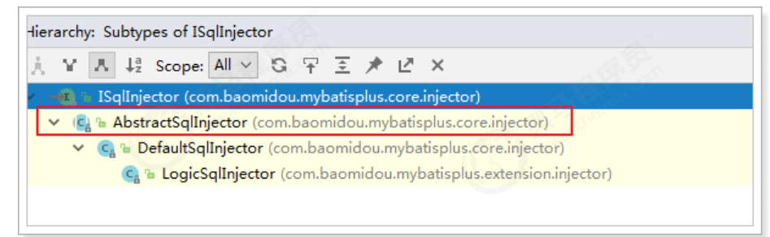
> 在AbstractSqlInjector中，主要是由inspectInject()方法进行注入的，如下：
>
> ```java
> @Override
> public void inspectInject(MapperBuilderAssistant builderAssistant, Class<?>
> mapperClass) {
> Class<?> modelClass = extractModelClass(mapperClass);
> if (modelClass != null) {
> String className = mapperClass.toString();
> Set<String> mapperRegistryCache =
> GlobalConfigUtils.getMapperRegistryCache(builderAssistant.getConfiguration());
> if (!mapperRegistryCache.contains(className)) {
> List<AbstractMethod> methodList = this.getMethodList();
> if (CollectionUtils.isNotEmpty(methodList)) {
> TableInfo tableInfo = TableInfoHelper.initTableInfo(builderAssistant,
> modelClass);
> // 循环注入自定义方法
> methodList.forEach(m -> m.inject(builderAssistant, mapperClass,
> modelClass, tableInfo));
> } else {
>     logger.debug(mapperClass.toString() + ", No effective injection method
> was found.");
> } m
> apperRegistryCache.add(className);
> }
> }
> }
> ```
>
> 在实现方法中， methodList.forEach(m -> m.inject(builderAssistant, mapperClass, modelClass,
> tableInfo)); 是关键，循环遍历方法，进行注入。
> 最终调用抽象方法injectMappedStatement进行真正的注入：  
>
> ```java
> /**
> * 注入自定义 MappedStatement
> * *
> @param mapperClass mapper 接口
> * @param modelClass mapper 泛型
> * @param tableInfo 数据库表反射信息
> * @return MappedStatement
> */
> public abstract MappedStatement injectMappedStatement(Class<?> mapperClass, Class<?
> > modelClass, TableInfo tableInfo);
> ```
>
> 查看该方法的实现：  
>
> 
>
> 以SelectById为例查看：  
>
> ```java
> public class SelectById extends AbstractMethod {
> @Override
> public MappedStatement injectMappedStatement(Class<?> mapperClass, Class<?>
> modelClass, TableInfo tableInfo) {
> SqlMethod sqlMethod = SqlMethod.LOGIC_SELECT_BY_ID;
> SqlSource sqlSource = new RawSqlSource(configuration,
> String.format(sqlMethod.getSql(),
> sqlSelectColumns(tableInfo, false),
> tableInfo.getTableName(), tableInfo.getKeyColumn(),
> tableInfo.getKeyProperty(),
> tableInfo.getLogicDeleteSql(true, false)), Object.class);
> return this.addSelectMappedStatement(mapperClass, sqlMethod.getMethod(),
> sqlSource, modelClass, tableInfo);
> }
> }
> ```
>
> 可以看到，生成了SqlSource对象，再将SQL通过addSelectMappedStatement方法添加到meppedStatements中。  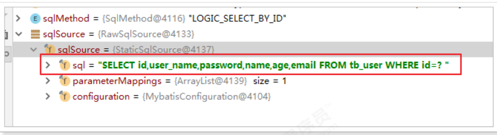

## 4、配置  

### 4.1、基本配置

#### 4.1.1、configLocation

> MyBatis 配置文件位置，如果您有单独的 MyBatis 配置，请将其路径配置到 configLocation 中。 MyBatis
> Configuration 的具体内容请参考MyBatis 官方文档
> Spring Boot：
>
> ```properties
> mybatis-plus.config-location = classpath:mybatis-config.xml
> ```
>
> Spring MVC：
>
> ```xml
> <bean id="sqlSessionFactory"
> class="com.baomidou.mybatisplus.extension.spring.MybatisSqlSessionFactoryBean">
> <property name="configLocation" value="classpath:mybatis-config.xml"/>
> </bean>
> ```
>
> 

#### 4.1.2、mapperLocations

> MyBatis Mapper 所对应的 XML 文件位置，如果您在 Mapper 中有自定义方法（XML 中有自定义实现），需要进行
> 该配置，告诉 Mapper 所对应的 XML 文件位置。
> Spring Boot：  
>
> ```properties
> mybatis-plus.mapper-locations = classpath*:mybatis/*.xml
> ```
>
> Spring MVC：
>
> ```xml
> <bean id="sqlSessionFactory"
> class="com.baomidou.mybatisplus.extension.spring.MybatisSqlSessionFactoryBean">
> <property name="configLocation" value="classpath:mybatis-config.xml"/>
> </bean>
> ```
>
> **Maven 多模块项目的扫描路径需以 classpath*: 开头 （即加载多个 jar 包下的 XML 文件）**

#### 4.1.3、typeAliasesPackage  


>MyBaits 别名包扫描路径，通过该属性可以给包中的类注册别名，注册后在 Mapper 对应的 XML 文件中可以直接使
>用类名，而不用使用全限定的类名（即 XML 中调用的时候不用包含包名）。
>Spring Boot：  
>
>```properties
>mybatis-plus.type-aliases-package = cn.itcast.mp.pojo
>```
>
>Spring MVC：  
>
>```xml
><bean id="sqlSessionFactory"
>class="com.baomidou.mybatisplus.extension.spring.MybatisSqlSessionFactoryBean">
><property name="typeAliasesPackage"
>value="com.baomidou.mybatisplus.samples.quickstart.entity"/>
></bean>
>```
>
>

### 4.2、进阶配置  

> 本部分（Configuration）的配置大都为 MyBatis 原生支持的配置，这意味着您可以通过 MyBatis XML 配置文件的形
> 式进行配置。  

#### 4.2.1、mapUnderscoreToCamelCase  

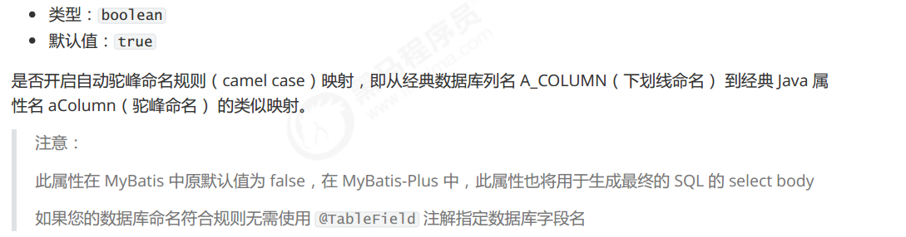

```properties
#关闭自动驼峰映射，该参数不能和mybatis-plus.config-location同时存在
mybatis-plus.configuration.map-underscore-to-camel-case=false
```

#### 4.2.2、cacheEnabled  

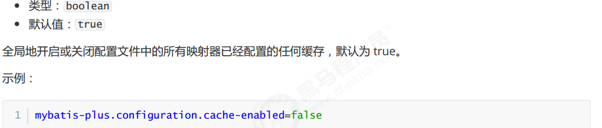

### 4.3、DB 策略配置  

#### 4.3.1、idType  


SpringBoot：

```properties
mybatis-plus.global-config.db-config.id-type=auto
```

SpringMVC：

```xml
<!--这里使用MP提供的sqlSessionFactory，完成了Spring与MP的整合-->
<bean id="sqlSessionFactory"
class="com.baomidou.mybatisplus.extension.spring.MybatisSqlSessionFactoryBean">
<property name="dataSource" ref="dataSource"/>
<property name="globalConfig">
<bean class="com.baomidou.mybatisplus.core.config.GlobalConfig">
<property name="dbConfig">
<bean
class="com.baomidou.mybatisplus.core.config.GlobalConfig$DbConfig">
<property name="idType" value="AUTO"/>
</bean>
</property>
</bean>
</property>
</bean>  
```

#### 4.3.2、tablePrefix  

类型： String
默认值： null  

SpringBoot：

```properties
mybatis-plus.global-config.db-config.table-prefix=tb_
```

SpringMVC：

```xml
<bean id="sqlSessionFactory"
class="com.baomidou.mybatisplus.extension.spring.MybatisSqlSessionFactoryBean">
<property name="dataSource" ref="dataSource"/>
<property name="globalConfig">
<bean class="com.baomidou.mybatisplus.core.config.GlobalConfig">
<property name="dbConfig">
<bean
class="com.baomidou.mybatisplus.core.config.GlobalConfig$DbConfig">
<property name="idType" value="AUTO"/>
<property name="tablePrefix" value="tb_"/>
</bean>
</property>
</bean>
</property>
</bean>
```

## 5、条件构造器

在MP中，Wrapper接口的实现类关系如下：

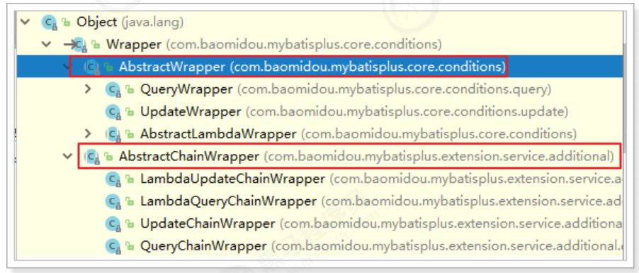

可以看到，AbstractWrapper和AbstractChainWrapper是重点实现，接下来我们重点学习AbstractWrapper以及其
子类。

> 说明:
> QueryWrapper(LambdaQueryWrapper) 和 UpdateWrapper(LambdaUpdateWrapper) 的父类 用于生成 sql
> 的 where 条件, entity 属性也用于生成 sql 的 where 条件 注意: entity 生成的 where 条件与 使用各个 api 生成
> 的 where 条件没有任何关联行为  

### 5.1、allEq  

#### 5.1.1、说明  

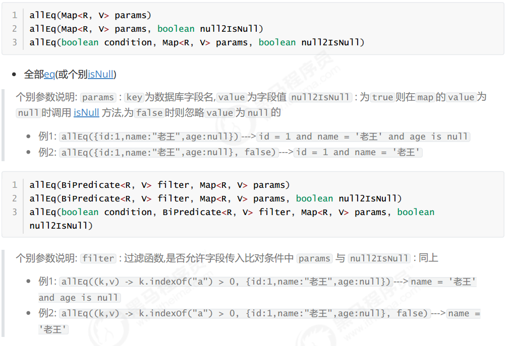

```java
@RunWith(SpringRunner.class)
@SpringBootTest
public class UserMapperTest {
@Autowired
private UserMapper userMapper;
@Test
public void testWrapper() {
QueryWrapper<User> wrapper = new QueryWrapper<>();
//设置条件
Map<String,Object> params = new HashMap<>();
params.put("name", "曹操");
params.put("age", "20");
params.put("password", null);
// wrapper.allEq(params);//SELECT * FROM tb_user WHERE password IS NULL AND
name = ? AND age = ?
// wrapper.allEq(params,false); //SELECT * FROM tb_user WHERE name = ? AND age
= ?
// wrapper.allEq((k, v) -> (k.equals("name") || k.equals("age"))
,params);//SELECT * FROM tb_user WHERE name = ? AND age = ?
List<User> users = this.userMapper.selectList(wrapper);
for (User user : users) {
System.out.println(user);
}
}
}
```

### 5.2、基本比较操作  

- eq

  等于 =

- ne
  不等于 <>

- gt
  大于 >

- ge
  大于等于 >=

- lt
  小于 <

- le
  小于等于 <=

- between
  BETWEEN 值1 AND 值2

- notBetween
  NOT BETWEEN 值1 AND 值2

- in
  字段 IN (value.get(0), value.get(1), ...)  

- notIn字段 

  NOT IN (v0, v1, ...)  

  ```java
  @RunWith(SpringRunner.class)
  @SpringBootTest
  public class UserMapperTest {
  @Autowired
  private UserMapper userMapper;
  @Test
  public void testEq() {
  QueryWrapper<User> wrapper = new QueryWrapper<>();
  //SELECT id,user_name,password,name,age,email FROM tb_user WHERE password = ?
  AND age >= ? AND name IN (?,?,?)
  wrapper.eq("password", "123456")
  .ge("age", 20)
  .in("name", "李四", "王五", "赵六");
  List<User> users = this.userMapper.selectList(wrapper);
  for (User user : users) {
  System.out.println(user);
  }
  }
  }
  ```

  

### 5.3、模糊查询  

- like
  LIKE '%值%'例: like("name", "王") ---> name like '%王%'

- notLike
  NOT LIKE '%值%'  例: notLike("name", "王") ---> name not like '%王%'

- likeLeft
  LIKE '%值'例: likeLeft("name", "王") ---> name like '%王'

- likeRight
  LIKE '值%'例: likeRight("name", "王") ---> name like '王%  模糊查询  

  ```java
  @RunWith(SpringRunner.class)
  @SpringBootTest
  public class UserMapperTest {
  @Autowired
  private UserMapper userMapper;
  @Test
  public void testWrapper() {
  QueryWrapper<User> wrapper = new QueryWrapper<>();
  //SELECT id,user_name,password,name,age,email FROM tb_user WHERE name LIKE ?
  //Parameters: %曹%(String)
  wrapper.like("name", "曹");
  List<User> users = this.userMapper.selectList(wrapper);
  for (User user : users) {
  System.out.println(user);
  }
  }
  }
  ```

  

### 5.4、排序  

- orderBy
  排序：ORDER BY 字段, ...例: orderBy(true, true, "id", "name") ---> order by id ASC,name ASC

- orderByAsc
  排序：ORDER BY 字段, ... ASC例: orderByAsc("id", "name") ---> order by id ASC,name ASC

- orderByDesc
  排序：ORDER BY 字段, ... DESC例: orderByDesc("id", "name") ---> order by id DESC,name DESC  

  ```java
  package cn.itcast.mp;
  import cn.itcast.mp.mapper.UserMapper;
  import cn.itcast.mp.pojo.User;
  import com.baomidou.mybatisplus.core.conditions.query.QueryWrapper;
  import org.junit.Test;
  import org.junit.runner.RunWith;
  import org.springframework.beans.factory.annotation.Autowired;
  import org.springframework.boot.test.context.SpringBootTest;
  import org.springframework.test.context.junit4.SpringRunner;
  import java.util.List;
  @RunWith(SpringRunner.class)
  @SpringBootTest
  public class UserMapperTest {
  @Autowired
  private UserMapper userMapper;
  @Test
  public void testWrapper() {
  QueryWrapper<User> wrapper = new QueryWrapper<>();
  //SELECT id,user_name,password,name,age,email FROM tb_user WHERE name LIKE ?
  //Parameters: %曹%(String)
  wrapper.like("name", "曹");
  List<User> users = this.userMapper.selectList(wrapper);
  for (User user : users) {
  System.out.println(user);
  }
  }
  }
  
  ```

  

### 5.5、逻辑查询  

- or拼接 OR
  主动调用 or 表示紧接着下一个方法不是用 and 连接!(不调用 or 则默认为使用 and 连接)  
- and
  AND 嵌套
  例: and(i -> i.eq("name", "李白").ne("status", "活着")) ---> and (name = '李白' and status
  <> '活着')  

  


```java
package cn.itcast.mp;
import cn.itcast.mp.mapper.UserMapper;
import cn.itcast.mp.pojo.User;
import com.baomidou.mybatisplus.core.conditions.query.QueryWrapper;
import org.junit.Test;
import org.junit.runner.RunWith;
import org.springframework.beans.factory.annotation.Autowired;
import org.springframework.boot.test.context.SpringBootTest;
import org.springframework.test.context.junit4.SpringRunner;
import java.util.List;
@RunWith(SpringRunner.class)
@SpringBootTest
public class UserMapperTest {
@Autowired
private UserMapper userMapper;
@Test
public void testWrapper() {
QueryWrapper<User> wrapper = new QueryWrapper<>();
//SELECT id,user_name,password,name,age,email FROM tb_user ORDER BY age DESC
wrapper.orderByDesc("age");
List<User> users = this.userMapper.selectList(wrapper);
for (User user : users) {
System.out.println(user);
}
}
}

```

### 5.6、select

>在MP查询中，默认查询所有的字段，如果有需要也可以通过select方法进行指定字段。  

```java
@RunWith(SpringRunner.class)
@SpringBootTest
public class UserMapperTest {
@Autowired
private UserMapper userMapper;
@Test
public void testWrapper() {
QueryWrapper<User> wrapper = new QueryWrapper<>();
//SELECT id,name,age FROM tb_user WHERE name = ? OR age = ?
wrapper.eq("name", "李四")
.or()
.eq("age", 24)
.select("id", "name", "age");
List<User> users = this.userMapper.selectList(wrapper);
for (User user : users) {
System.out.println(user);
}
}
}
```