# MybatisPlus

## 1、ActiveRecord

>ActiveRecord（简称AR）一直广受动态语言（ PHP 、 Ruby 等）的喜爱，而 Java 作为准静态语言，对于
>ActiveRecord 往往只能感叹其优雅，所以我们也在 AR 道路上进行了一定的探索，喜欢大家能够喜欢。  

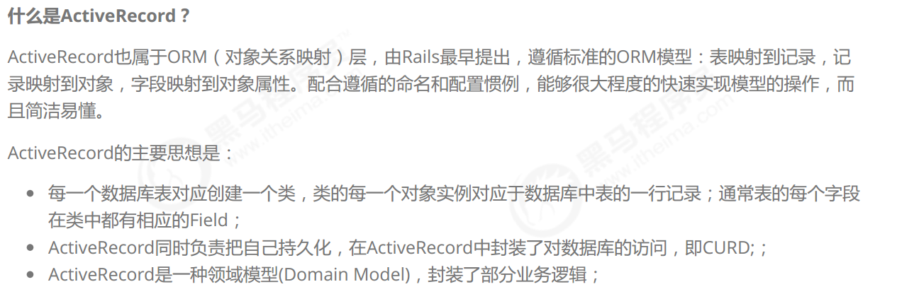

### 1.1、开启AR之旅 

>在MP中，开启AR非常简单，只需要将实体对象继承Model即可。  

```java
@Data
@NoArgsConstructor
@AllArgsConstructor
public class User extends Model<User> {
private Long id;
private String userName;
private String password;
private String name;
private Integer age;
private String email;
}
```

### 1.2、根据主键查询  

```java
@RunWith(SpringRunner.class)
@SpringBootTest
public class UserMapperTest {
@Autowired
private UserMapper userMapper;
@Test
public void testAR() {
User user = new User();
user.setId(2L);
User user2 = user.selectById();
System.out.println(user2);
}
}
```

### 1.3、新增数据  

```java
@RunWith(SpringRunner.class)
@SpringBootTest
public class UserMapperTest {
@Autowired
private UserMapper userMapper;
@Test
public void testAR() {
User user = new User();
user.setName("刘备");
user.setAge(30);
user.setPassword("123456");
user.setUserName("liubei");
user.setEmail("liubei@itcast.cn");
boolean insert = user.insert();
System.out.println(insert);
}
}
```


### 1.5、更新操作  

```java
@RunWith(SpringRunner.class)
@SpringBootTest
public class UserMapperTest {
@Autowired
private UserMapper userMapper;
@Test
public void testAR() {
User user = new User();
user.setId(8L);
user.setAge(35);
boolean update = user.updateById();
System.out.println(update);
}
}
```


### 1.6、删除操作  

```java
@RunWith(SpringRunner.class)
@SpringBootTest
public class UserMapperTest {
@Autowired
private UserMapper userMapper;
@Test
public void testAR() {
User user = new User();
user.setId(7L);
boolean delete = user.deleteById();
System.out.println(delete);
}
}
```


### 1.7、根据条件查询  

```java
@RunWith(SpringRunner.class)
@SpringBootTest
public class UserMapperTest {
 @Autowired
private UserMapper userMapper;
@Test
public void testAR() {
User user = new User();
QueryWrapper<User> userQueryWrapper = new QueryWrapper<>();
userQueryWrapper.le("age","20");
List<User> users = user.selectList(userQueryWrapper);
for (User user1 : users) {
System.out.println(user1);
}
}
}
```

## 2、Oracle 主键Sequence  

>在mysql中，主键往往是自增长的，这样使用起来是比较方便的，如果使用的是Oracle数据库，那么就不能使用自增
>长了，就得使用Sequence 序列生成id值了。  

### 2.1、部署Oracle环境  

>为了简化环境部署，这里使用Docker环境进行部署安装Oracle。  
>
>```
>#拉取镜像
>docker pull sath89/oracle-12c
>#创建容器
>docker create --name oracle -p 1521:1521 sath89/oracle-12c
>#启动
>docker start oracle && docker logs -f oracle
>#通过用户名密码即可登录
>用户名和密码为： system/oracle
>```
>
>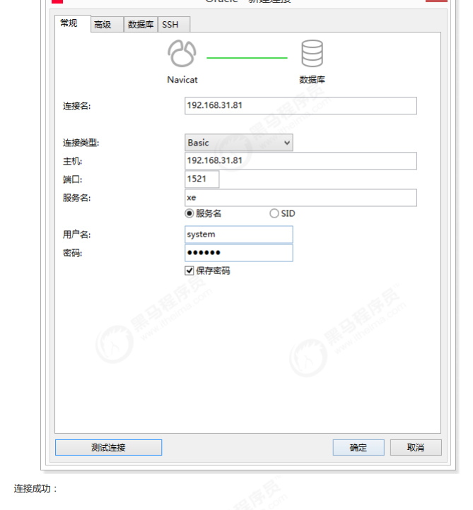

### 2.2、创建表以及序列  

```sql
--创建表，表名以及字段名都要大写
CREATE TABLE "TB_USER" (
"ID" NUMBER(20) VISIBLE NOT NULL ,
"USER_NAME" VARCHAR2(255 BYTE) VISIBLE ,
"PASSWORD" VARCHAR2(255 BYTE) VISIBLE ,
"NAME" VARCHAR2(255 BYTE) VISIBLE ,
"AGE" NUMBER(10) VISIBLE ,
"EMAIL" VARCHAR2(255 BYTE) VISIBLE
) -
-创建序列
CREATE SEQUENCE SEQ_USER START WITH 1 INCREMENT BY 1
```

### 2.3、jdbc驱动包  

> 由于版权原因，我们不能直接通过maven的中央仓库下载oracle数据库的jdbc驱动包，所以我们需要将驱动包安装到
> 本地仓库。
>
> ```
> #ojdbc8.jar文件在资料中可以找到
> mvn install:install-file -DgroupId=com.oracle -DartifactId=ojdbc8 -Dversion=12.1.0.1 -
> Dpackaging=jar -Dfile=ojdbc8.jar
> ```
>
> 安装完成后的坐标：  
>
> ```xml
> <dependency>
> <groupId>com.oracle</groupId>
> <artifactId>ojdbc8</artifactId>
> <version>12.1.0.1</version>
> </dependency>
> ```
>
> 

### 2.4、修改application.properties  

```properties
#数据库连接配置
spring.datasource.driver-class-name=oracle.jdbc.OracleDriver
spring.datasource.url=jdbc:oracle:thin:@192.168.31.81:1521:xe
spring.datasource.username=system
spring.datasource.password=oracle
#id生成策略
mybatis-plus.global-config.db-config.id-type=input
```

### 2.5、配置序列 

- 第一，需要配置MP的序列生成器到Spring容器：  

  ```java
  @Configuration
  @MapperScan("cn.itcast.mp.mapper") //设置mapper接口的扫描包
  public class MybatisPlusConfig {
  /**
  * 分页插件
  */
  @Bean
  public PaginationInterceptor paginationInterceptor() {
  return new PaginationInterceptor();
  } /
  **
  * 序列生成器
  */
  @Bean
  public OracleKeyGenerator oracleKeyGenerator(){
  return new OracleKeyGenerator();
  }}
  ```

  

- 第二，在实体对象中指定序列的名称：  

  ```java
  @KeySequence(value = "SEQ_USER", clazz = Long.class)
  public class User{
  ......
  }
  ```

  

## 3、插件  

### 3.1、mybatis的插件机制  

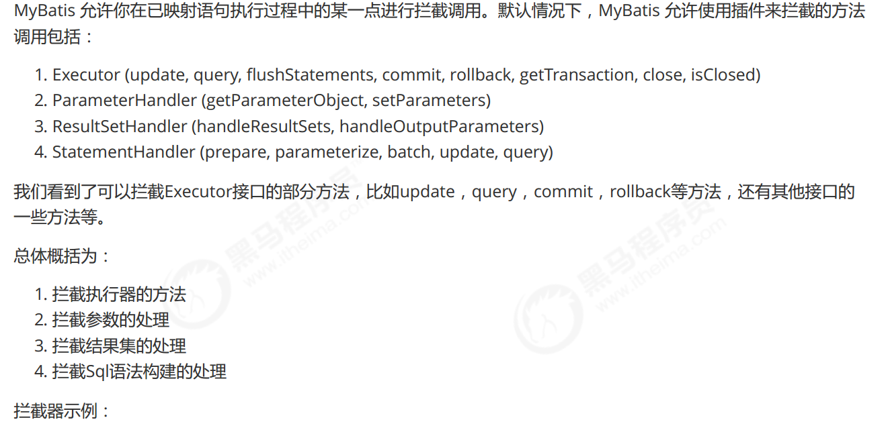


### 3.2、执行分析插件  

>在MP中提供了对SQL执行的分析的插件，可用作阻断全表更新、删除的操作，注意：该插件仅适用于开发环境，不
>适用于生产环境。  

SpringBoot配置：  

```java
@Bean
public SqlExplainInterceptor sqlExplainInterceptor(){
SqlExplainInterceptor sqlExplainInterceptor = new SqlExplainInterceptor();
List<ISqlParser> sqlParserList = new ArrayList<>();
// 攻击 SQL 阻断解析器、加入解析链
sqlParserList.add(new BlockAttackSqlParser());
sqlExplainInterceptor.setSqlParserList(sqlParserList);
return sqlExplainInterceptor;
}
```

### 3.3、性能分析插件  


```xml
<?xml version="1.0" encoding="UTF-8" ?>
<!DOCTYPE configuration
PUBLIC "-//mybatis.org//DTD Config 3.0//EN"
"http://mybatis.org/dtd/mybatis-3-config.dtd">
<configuration>
<plugins>
<!-- SQL 执行性能分析，开发环境使用，线上不推荐。 maxTime 指的是 sql 最大执行时长 -->
<plugin
interceptor="com.baomidou.mybatisplus.extension.plugins.PerformanceInterceptor">
<property name="maxTime" value="100" />
<!--SQL是否格式化 默认false-->
<property name="format" value="true" />
</plugin>
</plugins>
</configuration>
```

### 3.4、乐观锁插件  

#### 3.4.1、主要适用场景  

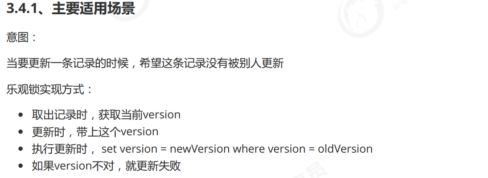

#### 3.4.2、插件配置  

spring xml:  

```xml
<bean class="com.baomidou.mybatisplus.extension.plugins.OptimisticLockerInterceptor"/>
```

spring boot:  

```java
@Bean
public OptimisticLockerInterceptor optimisticLockerInterceptor() {
return new OptimisticLockerInterceptor();
}
```

### 3.4.3、注解实体字段  

> 需要为实体字段添加@Version注解  

- 第一步，为表添加version字段，并且设置初始值为1：  

  ```sql
  ALTER TABLE `tb_user`
  ADD COLUMN `version` int(10) NULL AFTER `email`;
  UPDATE `tb_user` SET `version`='1';
  ```

- 第二步，为User实体对象添加version字段，并且添加@Version注解：  

  ```java
  @Version
  private Integer version;
  ```

### 3.4.4、测试  

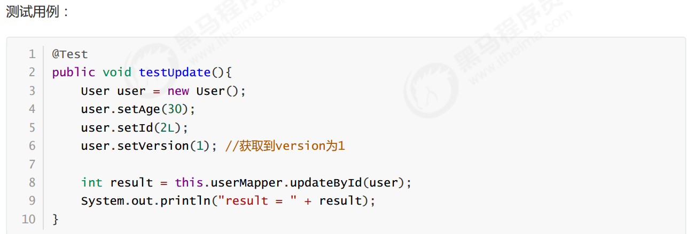

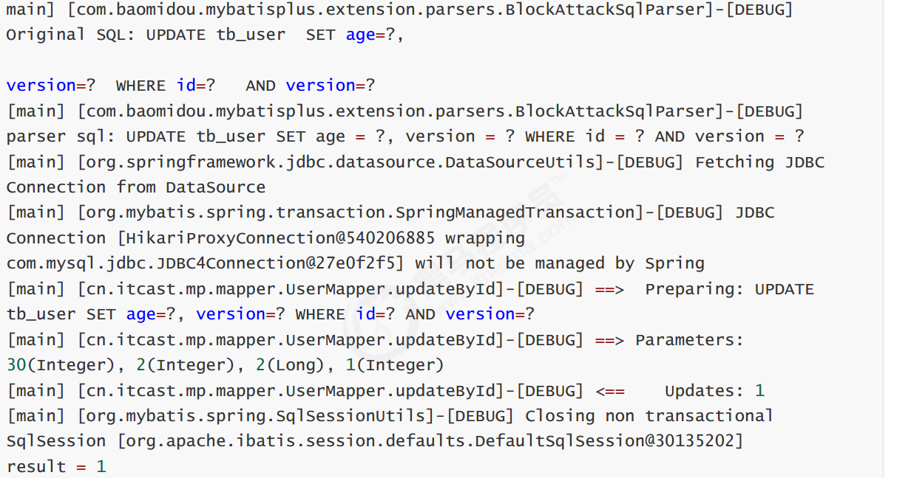

>可以看到，更新的条件中有version条件，并且更新的version为2。
>如果再次执行，更新则不成功。这样就避免了多人同时更新时导致数据的不一致  

## 4、Sql 注入器  

>我们已经知道，在MP中，通过AbstractSqlInjector将BaseMapper中的方法注入到了Mybatis容器，这样这些方法才
>可以正常执行。
>那么，如果我们需要扩充BaseMapper中的方法，又该如何实现呢？

下面我们以扩展findAll方法为例进行学习  

### 4.1、编写MyBaseMapper  

```java
public interface MyBaseMapper<T> extends BaseMapper<T> {
List<T> findAll();
}
```

> 其他的Mapper都可以继承该Mapper，这样实现了统一的扩展。  

### 4.2、编写MySqlInjector  

>如果直接继承AbstractSqlInjector的话，原有的BaseMapper中的方法将失效，所以我们选择继承DefaultSqlInjector
>进行扩展。  

```java
public class MySqlInjector extends DefaultSqlInjector {
@Override
public List<AbstractMethod> getMethodList() {
List<AbstractMethod> methodList = super.getMethodList();
methodList.add(new FindAll());
// 再扩充自定义的方法
list.add(new FindAll());
return methodList;
}
}
```

### 4.3、编写FindAll  

```java
public class FindAll extends AbstractMethod {
@Override
public MappedStatement injectMappedStatement(Class<?> mapperClass, Class<?>
modelClass, TableInfo tableInfo) {
String sqlMethod = "findAll";
String sql = "select * from " + tableInfo.getTableName();
SqlSource sqlSource = languageDriver.createSqlSource(configuration, sql,
modelClass);
return this.addSelectMappedStatement(mapperClass, sqlMethod, sqlSource,
modelClass, tableInfo);
}
}
```

### 4.4、注册到Spring容器  

```java
/**
* 自定义SQL注入器
*/
@Bean
public MySqlInjector mySqlInjector(){
return new MySqlInjector();
}
```

### 4.5、测试  

```java
@Test
public void testFindAll(){
List<User> users = this.userMapper.findAll();
for (User user : users) {
System.out.println(user);
}
}
```

输出的SQL：  

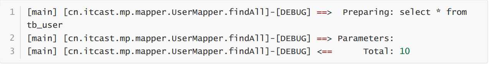

## 5、自动填充功能 

>有些时候我们可能会有这样的需求，插入或者更新数据时，希望有些字段可以自动填充数据，比如密码、version
>等。在MP中提供了这样的功能，可以实现自动填充。  

### 5.1、添加@TableField注解  

```java
@TableField(fill = FieldFill.INSERT) //插入数据时进行填充
private String password;
```

为password添加自动填充功能，在新增数据时有效。
FieldFill提供了多种模式选择：  

```java
public enum FieldFill {
/**
* 默认不处理
*/
DEFAULT,
/**
* 插入时填充字段
*/
INSERT,
/**
* 更新时填充字段
*/
UPDATE,
/**
* 插入和更新时填充字段
*/
INSERT_UPDATE
}
```

### 5.2、编写MyMetaObjectHandler  

```java
@Component
public class MyMetaObjectHandler implements MetaObjectHandler {
   @Override
public void insertFill(MetaObject metaObject) {
Object password = getFieldValByName("password", metaObject);
if(null == password){
//字段为空，可以进行填充
setFieldValByName("password", "123456", metaObject);
}
} @
Override
public void updateFill(MetaObject metaObject) {
}
}
```

### 5.3、测试  

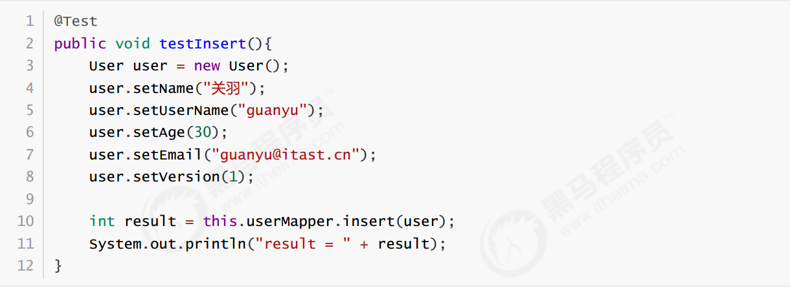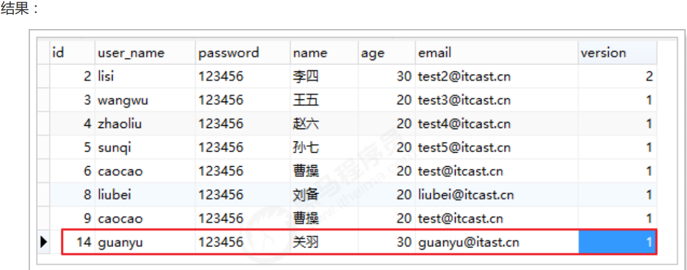

## 6、 逻辑删除  

>开发系统时，有时候在实现功能时，删除操作需要实现逻辑删除，所谓逻辑删除就是将数据标记为删除，而并非真正
>的物理删除（非DELETE操作），查询时需要携带状态条件，确保被标记的数据不被查询到。这样做的目的就是避免
>数据被真正的删除。  

### 6.1、修改表结构  

为tb_user表增加deleted字段，用于表示数据是否被删除，1代表删除，0代表未删除  

```sql
ALTER TABLE `tb_user`
ADD COLUMN `deleted` int(1) NULL DEFAULT 0 COMMENT '1代表删除，0代表未删除' AFTER
`version`;
```

同时，也修改User实体，增加deleted属性并且添加@TableLogic注解：  

```java
@TableLogic
private Integer deleted;

```

### 6.2、配置  

application.properties：  

```protobuf
# 逻辑已删除值(默认为 1)
mybatis-plus.global-config.db-config.logic-delete-value=1
# 逻辑未删除值(默认为 0)
mybatis-plus.global-config.db-config.logic-not-delete-value=0
```

### 6.3、测试  

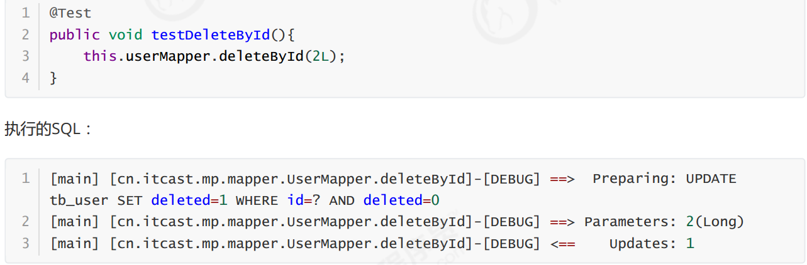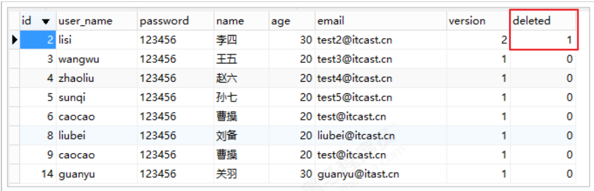

## 7、 通用枚举  

> 解决了繁琐的配置，让 mybatis 优雅的使用枚举属性！  

### 7.1、修改表结构  

```sql
ALTER TABLE `tb_user`
ADD COLUMN `sex` int(1) NULL DEFAULT 1 COMMENT '1-男，2-女' AFTER `deleted`;

```

### 7.2、定义枚举  

```sql
public enum SexEnum implements IEnum<Integer> {
MAN(1,"男"),
WOMAN(2,"女");
private int value;
private String desc;
SexEnum(int value, String desc) {
this.value = value;
this.desc = desc;
} @
Override
public Integer getValue() {
return this.value;
} @
Override
public String toString() {
return this.desc;
}
}
```

### 7.3、配置  

```protobuf
# 枚举包扫描
mybatis-plus.type-enums-package=cn.itcast.mp.enums
```

### 7.4、修改实体  

```java
private SexEnum sex;
```

### 7.5、测试  

测试插入数据：  

```java
@Test
public void testInsert(){
User user = new User();
user.setName("貂蝉");
user.setUserName("diaochan");
user.setAge(20);
user.setEmail("diaochan@itast.cn");
user.setVersion(1);
user.setSex(SexEnum.WOMAN);
int result = this.userMapper.insert(user);
System.out.println("result = " + result);
}
```

SQL

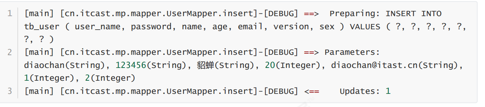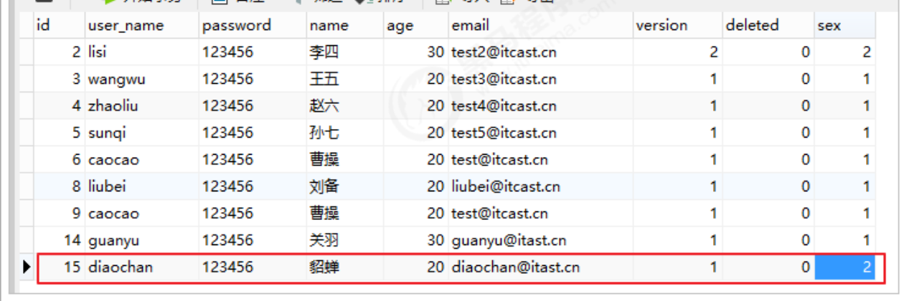

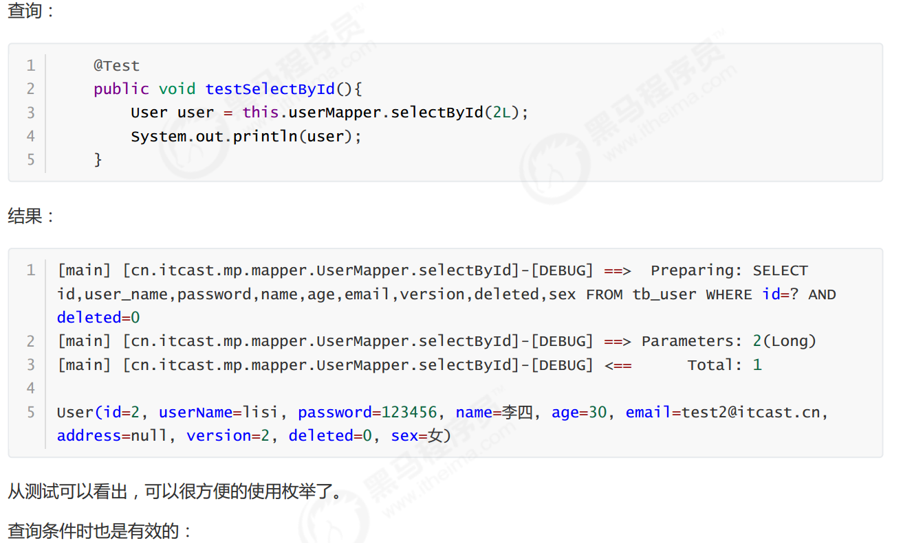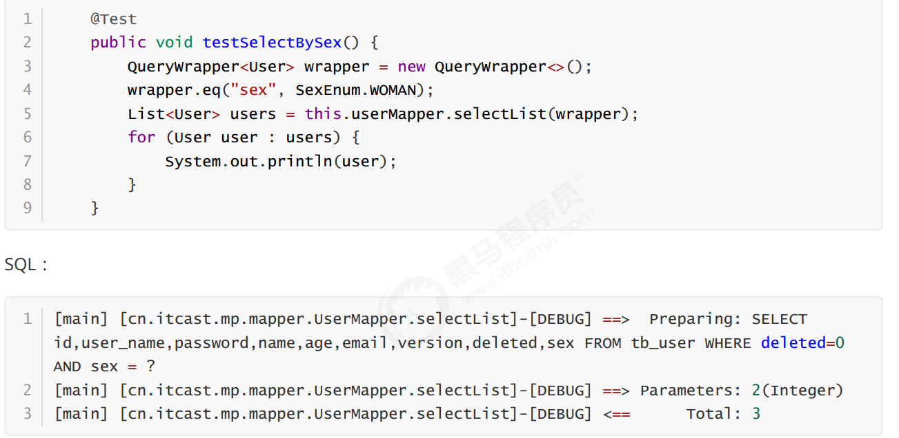

## 8、代码生成器  

>AutoGenerator 是 MyBatis-Plus 的代码生成器，通过 AutoGenerator 可以快速生成 Entity、Mapper、Mapper
>XML、Service、Controller 等各个模块的代码，极大的提升了开发效率。  

效果：  

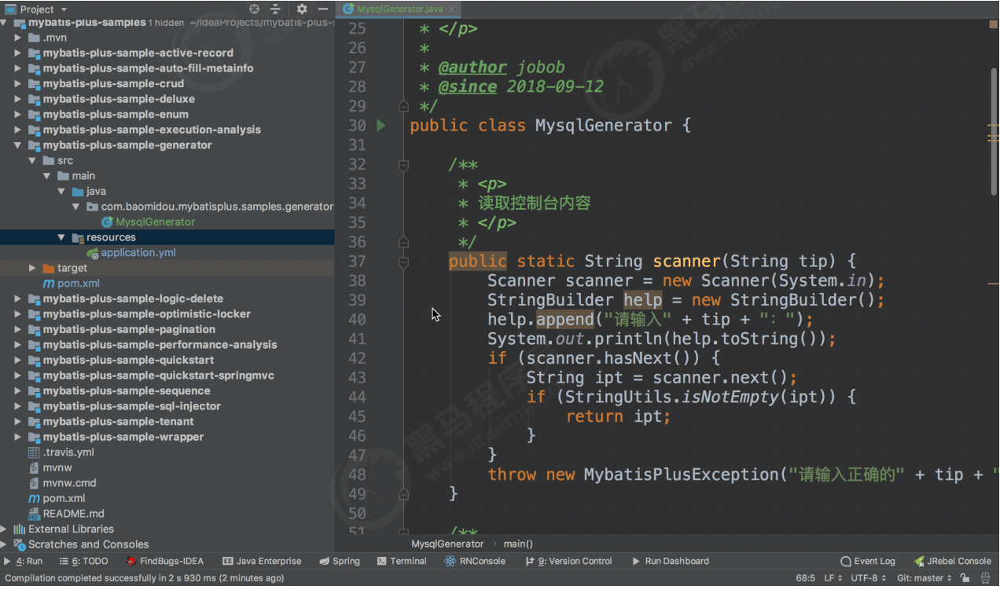

### 8.1、创建工程  

pom.xml：  

```xml
<?xml version="1.0" encoding="UTF-8"?>
<project xmlns="http://maven.apache.org/POM/4.0.0"
xmlns:xsi="http://www.w3.org/2001/XMLSchema-instance"
xsi:schemaLocation="http://maven.apache.org/POM/4.0.0
http://maven.apache.org/xsd/maven-4.0.0.xsd">
<modelVersion>4.0.0</modelVersion>
<parent>
<groupId>org.springframework.boot</groupId>
<artifactId>spring-boot-starter-parent</artifactId>
<version>2.1.4.RELEASE</version>
</parent>
<groupId>cn.itcast.mp</groupId>
<artifactId>itcast-mp-generator</artifactId>
<version>1.0-SNAPSHOT</version>
<dependencies>
<dependency>
<groupId>org.springframework.boot</groupId>
<artifactId>spring-boot-starter-test</artifactId>
<scope>test</scope>
</dependency>
<!--mybatis-plus的springboot支持-->
<dependency>
<groupId>com.baomidou</groupId>
<artifactId>mybatis-plus-boot-starter</artifactId>
<version>3.1.1</version>
</dependency>
<dependency>
<groupId>com.baomidou</groupId>
<artifactId>mybatis-plus-generator</artifactId>
<version>3.1.1</version>
</dependency>
<dependency>
<groupId>org.springframework.boot</groupId>
<artifactId>spring-boot-starter-freemarker</artifactId>
</dependency>
<!--mysql驱动-->
<dependency>
<groupId>mysql</groupId>
<artifactId>mysql-connector-java</artifactId>
<version>5.1.47</version>
</dependency>
<dependency>
<groupId>org.slf4j</groupId>
<artifactId>slf4j-log4j12</artifactId>
</dependency>
</dependencies>
<build>
<plugins>
<plugin>
<groupId>org.springframework.boot</groupId>
<artifactId>spring-boot-maven-plugin</artifactId>
</plugin>
</plugins>
</build>
</project>
```

### 8.2、代码  

```
/**
* <p>
* mysql 代码生成器演示例子
* </p>
*/
public class MysqlGenerator {
/**
* <p>
* 读取控制台内容
* </p>
*/
public static String scanner(String tip) {
Scanner scanner = new Scanner(System.in);
StringBuilder help = new StringBuilder();
help.append("请输入" + tip + "：");
System.out.println(help.toString());
if (scanner.hasNext()) {
String ipt = scanner.next();
if (StringUtils.isNotEmpty(ipt)) {
return ipt;
}
} t
hrow new MybatisPlusException("请输入正确的" + tip + "！");
} /
**
* RUN THIS
*/
public static void main(String[] args) {
// 代码生成器
AutoGenerator mpg = new AutoGenerator();
// 全局配置
GlobalConfig gc = new GlobalConfig();
String projectPath = System.getProperty("user.dir");
gc.setOutputDir(projectPath + "/src/main/java");
gc.setAuthor("itcast");
gc.setOpen(false);
mpg.setGlobalConfig(gc);
// 数据源配置
DataSourceConfig dsc = new DataSourceConfig();
dsc.setUrl("jdbc:mysql://127.0.0.1:3306/mp?
useUnicode=true&useSSL=false&characterEncoding=utf8");
// dsc.setSchemaName("public");
dsc.setDriverName("com.mysql.jdbc.Driver");
dsc.setUsername("root");
dsc.setPassword("root");
mpg.setDataSource(dsc);
// 包配置
PackageConfig pc = new PackageConfig();
pc.setModuleName(scanner("模块名"));
pc.setParent("cn.itcast.mp.generator");
mpg.setPackageInfo(pc);
// 自定义配置
InjectionConfig cfg = new InjectionConfig() {
@Override
public void initMap() {
// to do nothing
}
};
List<FileOutConfig> focList = new ArrayList<>();
focList.add(new FileOutConfig("/templates/mapper.xml.ftl") {
@Override
public String outputFile(TableInfo tableInfo) {
// 自定义输入文件名称
return projectPath + "/itcast-mpgenerator/src/main/resources/mapper/" + pc.getModuleName()
+ "/" + tableInfo.getEntityName() + "Mapper" +
StringPool.DOT_XML;
}
});
cfg.setFileOutConfigList(focList);
mpg.setCfg(cfg);
mpg.setTemplate(new TemplateConfig().setXml(null));
// 策略配置
StrategyConfig strategy = new StrategyConfig();
strategy.setNaming(NamingStrategy.underline_to_camel);
strategy.setColumnNaming(NamingStrategy.underline_to_camel);
//
strategy.setSuperEntityClass("com.baomidou.mybatisplus.samples.generator.common.BaseE
ntity");
strategy.setEntityLombokModel(true);
//
strategy.setSuperControllerClass("com.baomidou.mybatisplus.samples.generator.common.B
aseController");
strategy.setInclude(scanner("表名"));
strategy.setSuperEntityColumns("id");
strategy.setControllerMappingHyphenStyle(true);
strategy.setTablePrefix(pc.getModuleName() + "_");
mpg.setStrategy(strategy);
// 选择 freemarker 引擎需要指定如下加，注意 pom 依赖必须有！
mpg.setTemplateEngine(new FreemarkerTemplateEngine());
mpg.execute();
}
}
```

### 8.3、测试  

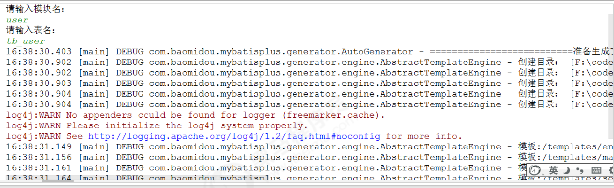

代码已生成：  

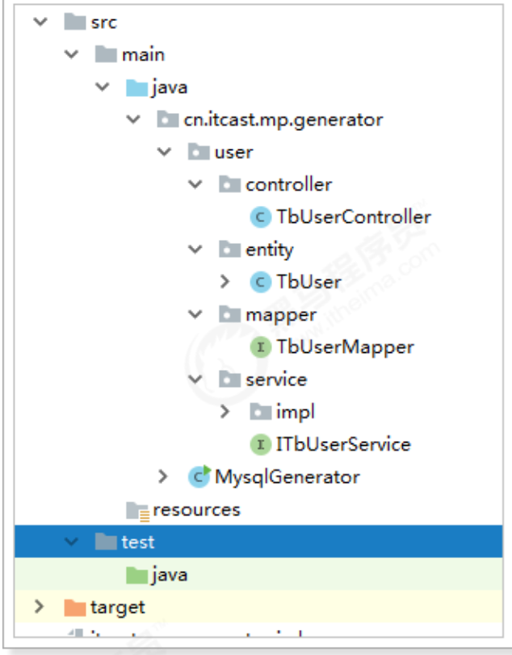

## 9、MybatisX 快速开发插件  

> MybatisX 是一款基于 IDEA 的快速开发插件，为效率而生。  

安装方法：打开 IDEA，进入 File -> Settings -> Plugins -> Browse Repositories，输入 mybatisx 搜索并安装。
功能：

- Java 与 XML 调回跳转
- Mapper 方法自动生成 XML  

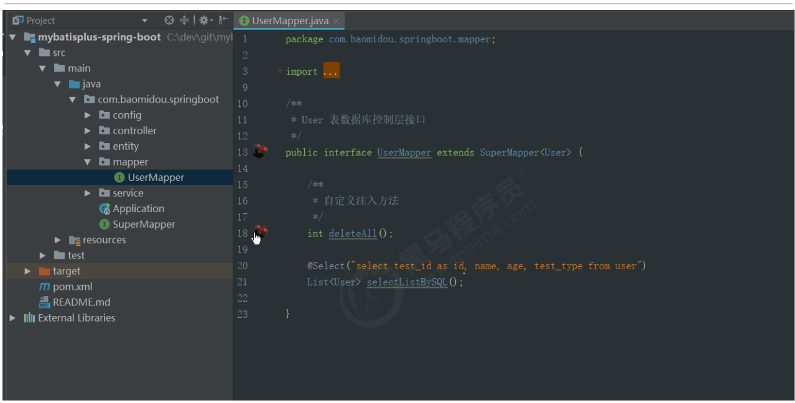