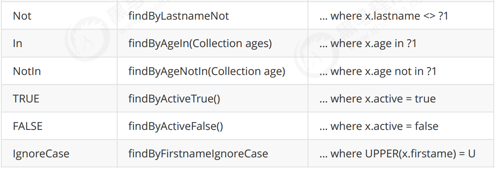
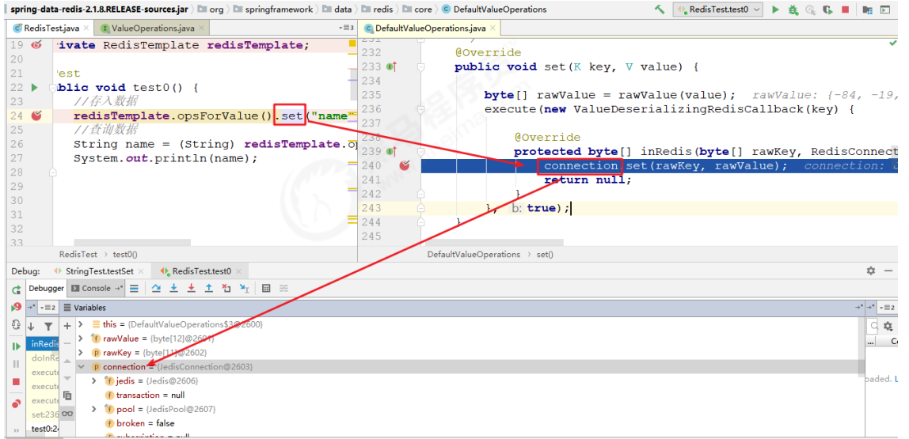
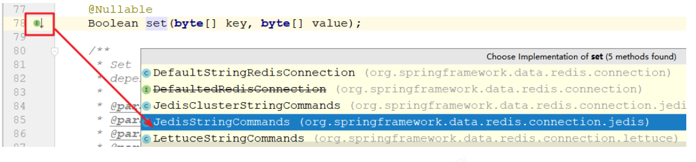
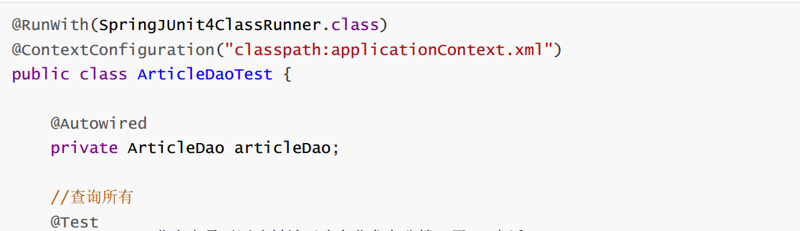
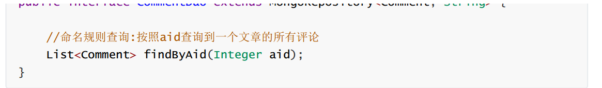

第一章 SpringData概述  

持久层开发的问题  


>现在的企业开发中用到的用于数据存储的产品，不再仅仅是关系型数据
>库，而是要根据场景需要选择不同的存储技术，比如用于缓存热点数据的redis，用于存储文档数据的
>mongodb，用于支持强大搜索功能的elasticsearch等等  


### SpringData简介  

#### 什么是SpringData  

>SpringData是一个用来简化dao层开发的框架。它在保证了各个底层存储特性的同时，提供了一套
>统一的数据访问API。它可以很好的支持常用的关系型数据库和非关系型数据库。
>使用SpringData作为dao层开发技术，将大大简化代码量，而且其API比各个技术的原生API更加简
>单易用。  

#### SpringData的主要模块  

> - | Spring Data common        | SpringData的核心模块，定义了SpringData的核心功能 |
>   | ------------------------- | ------------------------------------------------ |
>   | Spring Data JDBC          | 对JDBC的Spring Data存储库支持                    |
>   | Spring Data JPA           | 对JPA的Spring Data存储库支持                     |
>   | Spring Data MongoDB       | 对MongoDB的基于Spring对象文档的存储库支持        |
>   | Spring Data Redis         | 封装Jedis技术，对redis实现访问操作               |
>   | Spring Data Elasticsearch | 对Elasticsearch实现访问操作                      |

## 第二章 JPA回顾  

### JPA基础  


### JPA实战  

#### 准备数据库环境  

```sql
--准备数据库，创建一张文章表备用
CREATE TABLE `article` (
`aid` int(11) NOT NULL auto_increment COMMENT '主键',
`author` varchar(255) default NULL COMMENT '作者',
`createTime` datetime default NULL COMMENT '创建时间',
`title` varchar(255) default NULL COMMENT '标题',
PRIMARY KEY (`aid`)
);
```

#### 创建java工程，导入坐标  

```xml
<dependencies>
<!--Jpa的支撑框架hibernate-->
<dependency>
<groupId>org.hibernate</groupId>
<artifactId>hibernate-entitymanager</artifactId>
<version>5.0.7.Final</version>
</dependency>
<!--mysql-->
<dependency>
<groupId>mysql</groupId>
<artifactId>mysql-connector-java</artifactId>
<!-- 日志 -->
<dependency>
<groupId>log4j</groupId>
<artifactId>log4j</artifactId>
<version>1.2.12</version>
</dependency>
<!-- 单元测试 -->
<dependency>
<groupId>junit</groupId>
<artifactId>junit</artifactId>
<version>4.12</version>
</dependency>
</dependencies>
```

#### 创建实体类  

```java
public class Article implements Serializable {
private Integer aid;
private String title;
private String author;
private Date createTime;
//省略set和get方法。。。
//省略toString方法。。。
}
```

#### 在实体类中配置映射关系  

```java
@
Entity//表示这是一个实体类
@Table(name = "article") //建立实体类和表的映射关系
public class Article implements Serializable {
@Id//声明当前私有属性为主键
@GeneratedValue(strategy = GenerationType.IDENTITY) //配置主键的生成策略
private Integer aid;
//声明类的属性跟数据表字段的对应关系，如果属性名称和字段名称一致，可省略
@Column(name = "title")
private String title;
private String author;
private Date createTime;
}
```

#### 加入 JPA 的核心配置文件  

>在maven工程的resources路径下创建一个名为META-INF的文件夹，在文件夹下创建一个名为
>persistence.xml的配置文件。注意： META-INF文件夹名称不能修改,persistence.xml文件名称不能
>改。

```xml

<?xml version="1.0" encoding="UTF-8"?>
<persistence xmlns="http://java.sun.com/xml/ns/persistence"
xmlns:xsi="http://www.w3.org/2001/XMLSchema-instance"
xsi:schemaLocation="http://java.sun.com/xml/ns/persistence
http://java.sun.com/xml/ns/persistence/persistence_2_0.xsd"
<!--持久化单元-->
<persistence-unit name="springdata" transaction-type="RESOURCE_LOCAL">
<!--配置 JPA 规范的服务提供商 -->
<provider>org.hibernate.jpa.HibernatePersistenceProvider</provider>
<properties>
<!-- 数据库驱动 -->
<property name="javax.persistence.jdbc.driver"
value="com.mysql.jdbc.Driver"/>
<!-- 数据库地址 -->
<property name="javax.persistence.jdbc.url"
value="jdbc:mysql:///springdata"/>
<!-- 数据库用户名 -->
<property name="javax.persistence.jdbc.user" value="root"/>
<!-- 数据库密码 -->
<property name="javax.persistence.jdbc.password"
value="adminadmin"/>
<!--jpa的核心配置中兼容hibernate的配置-->
<property name="hibernate.show_sql" value="true"/>
<property name="hibernate.format_sql" value="true"/>
<property name="hibernate.hbm2ddl.auto" value="update"/>
</properties>
</persistence-unit>
</persistence>
```

#### 测试  

##### 实现保存操作  

```java
@Test
public void testSave() {
//1 创建持久化管理器工厂
EntityManagerFactory factory =
Persistence.createEntityManagerFactory("springdata");
//2 创建持久化管理器
EntityManager entityManager = factory.createEntityManager();
//3 获取事务，并开启
EntityTransaction transaction = entityManager.getTransaction();
transaction.begin();
//4 操作
Article article = new Article();
article.setTitle("测试文章");
article.setAuthor("黑马");
article.setCreateTime(new Date());
entityManager.persist(article);
//5 事务提交
transaction.commit();
//6 关闭资源
entityManager.close();
}
```

##### 实现查询操作

```java
@Test
public void testFindByAid() {
EntityManagerFactory factory =
Persistence.createEntityManagerFactory("springdata");
EntityManager entityManager = factory.createEntityManager();
EntityTransaction transaction = entityManager.getTransaction();
transaction.begin();
Article article = entityManager.find(Article.class, 1);
System.out.println(article);
transaction.commit();
entityManager.close();
}
```

##### 实现修改操作  

```java
@Test
public void testUpdate() {
EntityManagerFactory factory =
Persistence.createEntityManagerFactory("springdata");
EntityManager entityManager = factory.createEntityManager();
EntityTransaction transaction = entityManager.getTransaction();
transaction.begin();
Article article = entityManager.find(Article.class, 1);
//修改
article.setAuthor("黑马程序员");
transaction.commit();
entityManager.close();
}
```

##### 实现删除操作  

```java
@Test
public void testDelete() {
EntityManagerFactory factory =
Persistence.createEntityManagerFactory("springdata");
EntityManager entityManager = factory.createEntityManager();
EntityTransaction transaction = entityManager.getTransaction();
transaction.begin();
Article article = entityManager.find(Article.class, 1);
//删除
entityManager.remove(article);
transaction.commit();
entityManager.close();
}
```

### JPA的重要API介绍  

EntityManagerFactory  

>EntityManagerFactory接口主要用来创建EntityManager实例
>EntityManagerFactory是一个线程安全的对象，并且其创建极其浪费资源，所以编程的时候要保持它是单
>例的  

EntityManager  

>在JPA规范中,EntityManager是操作数据库的重要API，他是线程不安全的，需要保持线程独有。
>重要方法说明：
>getTransaction: 获取事务对象
>persist：保存操作
>merge：更新操作
>remove：删除操作
>find/getReference：根据id查询  

## 第三章 SpringData JPA基础  

### SpringData JPA简介

> SpringData JPA是Spring Data家族的一个成员，是Spring Data对JPA封装之后的产物，目的在于简化基于JPA的数据访问技术。使用SpringData JPA技术之后，开发者只需要声明Dao层的接口，不必再写实现类或其它代码，剩下的一切交给SpringData JPA来搞定 。

### SpringData JPA快速入门

#### 目标

> 本章节我们是实现的功能是搭建SpringData JPA环境，并实现一条数据的增删改查。

#### 准备数据环境

>--下面的操作让JPA自动生成表结构  

创建java工程，导入坐标

```xml
<dependencies><!-- 日志 --><dependency><groupId>log4j</groupId><artifactId>log4j</artifactId><version>1.2.12</version></dependency><!-- 单元测试 --><dependency><groupId>junit</groupId><artifactId>junit</artifactId><version>4.12</version></dependency> 
    <dependency>
<groupId>org.springframework</groupId>
<artifactId>spring-context</artifactId>
<version>5.1.6.RELEASE</version>
</dependency>
<dependency>
<groupId>org.springframework</groupId>
<artifactId>spring-test</artifactId>
<version>5.1.6.RELEASE</version>
</dependency>
<dependency>
<groupId>org.springframework</groupId>
<artifactId>spring-orm</artifactId>
<version>5.1.6.RELEASE</version>
</dependency>
<dependency>
<groupId>org.aspectj</groupId>
<artifactId>aspectjweaver</artifactId>
<version>1.8.7</version>
</dependency>
<!--jpa-->
<dependency>
<groupId>org.springframework.data</groupId>
<artifactId>spring-data-jpa</artifactId>
<version>2.1.8.RELEASE</version>
</dependency>
<dependency>
<groupId>org.hibernate</groupId>
<artifactId>hibernate-entitymanager</artifactId>
<version>5.0.7.Final</version>
</dependency>
<dependency>
<groupId>mysql</groupId>
<artifactId>mysql-connector-java</artifactId>
<version>5.1.6</version>
</dependency>
</dependencies>
```

#### 创建实体类  

```java
public class Article implements Serializable {
private Integer aid;
private String title;
private String author;
private Date createTime;
//省略set和get方法。。。
//省略toString方法。。。
}
```

#### 在实体类中配置映射关系  

```java
@Entity//表示这是一个实体类
@Table(name = " article") //建立实体类和表的映射关
    @Id//声明当前私有属性为主键
@GeneratedValue(strategy = GenerationType.IDENTITY) //配置主键的生成策略
private Integer aid;
//声明类的属性跟数据表字段的对应关系，如果属性名称和字段名称一致，可省略
@Column(name = "title")
private String title;
private String author;
private Date createTime;
//省略set和get方法。。。
//省略toString方法。。。
}
```


#### 编写dao接口  

>使用 Spring Data JPA操作数据库，只需要按照框架的规范提供 dao 接口，不需要提供在接口中定
>义方法，也不需要为接口提供实现类就能完成基本的数据库的增删改查等功能。  

> 1.创建一个 Dao 层接口，并实现 JpaRepository 和 JpaSpecificationExecutor
>
> 2.提供相应的泛型  


```javascript
/
**
* JpaRepository<实体类类型，主键类型>：用来完成基本 CRUD 操作
* JpaSpecificationExecutor<实体类类型>：用于复杂查询（分页等查询操作）
*/
public interface ArticleDao extends JpaRepository<Article, Integer>,
JpaSpecificationExecutor<Article> {
}
```

#### 添加Spring整合Jpa的配置文件  

```xml
<
?xml version="1.0" encoding="UTF-8"?>
<beans xmlns="http://www.springframework.org/schema/beans"
xmlns:xsi="http://www.w3.org/2001/XMLSchema-instance"
xmlns:aop="http://www.springframework.org/schema/aop"
xmlns:context="http://www.springframework.org/schema/context"
xmlns:jdbc="http://www.springframework.org/schema/jdbc"
xmlns:tx="http://www.springframework.org/schema/tx"
xmlns:jpa="http://www.springframework.org/schema/data/jpa"
xsi:schemaLocation="http://www.springframework.org/schema/beans
http://www.springframework.org/schema/beans/spring-beans.xsd
http://www.springframework.org/schema/aop
http://www.springframework.org/schema/aop/spring-aop.xsd
http://www.springframework.org/schema/context
http://www.springframework.org/schema/context/spring-context.xsd
http://www.springframework.org/schema/jdbc
http://www.springframework.org/schema/jdbc/spring-jdbc.xsd
http://www.springframework.org/schema/tx
http://www.springframework.org/schema/tx/spring-tx.xsd
http://www.springframework.org/schema/data/jpa
http://www.springframework.org/schema/data/jpa/spring-jpa.xsd">
<!-- 1.dataSource -->
<bean id="dataSource"
class="org.springframework.jdbc.datasource.DriverManagerDataSource">
<property name="driverClassName" value="com.mysql.jdbc.Driver" />
<property name="url" value="jdbc:mysql:///springdata" />
<property name="username" value="root" />
<property name="password" value="adminadmin" />
</bean>
<!-- 2.EntityManagerFactory -->
<bean id="entityManagerFactory"
class="org.springframework.orm.jpa.LocalContainerEntityManagerFactoryBean">
<!-- 注入数据源 -->
<property name="dataSource" ref="dataSource" />
<!-- 指定实体类所在的包 -->
<property name="packagesToScan" value="com.itheima.domain" />
<!-- 指定jpa的实现提供者 -->
<property name="persistenceProvider">
<bean class="org.hibernate.jpa.HibernatePersistenceProvider" />
</property>
<!--JPA供应商适配器 -->
<property name="jpaVendorAdapter">
<bean
class="org.springframework.orm.jpa.vendor.HibernateJpaVendorAdapter">
<!-- 是否生成DDL语句 是否自动建表 -->
<property name="generateDdl" value="true" />
<!-- 数据库厂商名称 -->
<property name="database" value="MYSQL" />
<!-- 数据库方言 -->
<property name="databasePlatform"
value="org.hibernate.dialect.MySQLDialect" />
<!-- 是否显示SQL -->
<property name="showSql" value="true" />
</bean>
</property>
</bean>
<!-- 3.事务管理器 -->
<bean id="transactionManager"
class="org.springframework.orm.jpa.JpaTransactionManager">
<property name="entityManagerFactory" ref="entityManagerFactory" />
</bean>
<!-- 整合spring data jpa -->
<!--spring 通过代理的方式为dao接口提供实现类，需要指明为哪些接口去产生代理类-->
<jpa:repositories base-package="com.itheima.dao"
transaction-manager-ref="transactionManager"
entity-manager-factory-ref="entityManagerFactory" />
</beans>
```

#### 测试  

```java
@RunWith(SpringJUnit4ClassRunner.class)
@Autowired
private ArticleDao articleDao;
//新增
@Test
public void testSave() {
Article article = new Article();
article.setTitle("测试文章");
article.setAuthor("黑马");
article.setCreateTime(new Date());
articleDao.save(article);
} /
/修改
@Test
public void testUpdate() {
Article article = new Article();
article.setTitle("测试文章1");
article.setContent("测试内容");
article.setAuthor("黑马");
article.setCreateTime(new Date());
article.setAid(1);
articleDao.save(article);
} /
/根据Id查询
@Test
public void testFindByAid() {
Optional<Article> optional = articleDao.findById(1);
System.out.println(optional.get());
} /
/查询所有
@Test
public void testFindAll() {
List<Article> list = articleDao.findAll();
for (Article article : list) {
System.out.println(article);
}
} /
/删除
@Test
public void testdelete() {
articleDao.deleteById(1);
}
}
```

### SpringData Jpa运行原理分析  

#### SpringData中的几个重要接口  


#### SpringData Jpa底层运行原理  

> 1.在运行时，Spring会使用JdkDynamicAopProxy为dao接口生成一个代理对象  
>
> 
>
> 2.那么这个代理对象是根据那个类代理出来的呢？点击进入JdkDynamicAopProxy源码查看invoke方
> 法，发现targetSource代理的是SimpleJpaRepository类  
>
> 3.\3. 通过对SimpleJpaRepository中代码的分析，我们看到最终执行保存的是EntityManager对象  
>
> 
>
> 

#### SpringData Jpa 与 Jpa 及 Hibernate的关系  


## 第四章 SpringData JPA的多种查询方式

### 父接口方法查询  


```java
@RunWith(SpringJUnit4ClassRunner.class)
@ContextConfiguration("classpath:applicationContext-jpa.xml")
public class SpringDataJpaQueryTest {
@Autowired
private ArticleDao articleDao;
//主键查询
@Test
public void testFindById() {
Optional<Article> optional = articleDao.findById(21);
System.out.println(optional.get());
} 
/查询所有
List<Article> articles = articleDao.findAll();
for (Article article : articles) {
System.out.println(article);
}
} 
/查询所有---排序
@Test
public void testFindAllWithSort() {
Sort sort = Sort.by(Sort.Order.desc("aid"));
List<Article> articles = articleDao.findAll(sort);
for (Article article : articles) {
System.out.println(article);
}
} 
/查询所有---分页
@Test
public void testFindAllWithPage() {
//从第几页(页数从0开始)开始查,每页多少条
Pageable pageable = PageRequest.of(2,3);
Page<Article> page = articleDao.findAll(pageable);
for (Article article : page.getContent()) {
System.out.println(article);
}
} 
/查询所有---分页和排序
@Test
public void testFindAllWithPageAndSort() {
Sort sort = Sort.by(Sort.Order.desc("aid"));
//从第几页(页数从0开始)开始查,每页多少条
Pageable pageable = PageRequest.of(2,3,sort);
Page<Article> page = articleDao.findAll(pageable);
for (Article article : page.getContent()) {
System.out.println(article);
}
}}
```

### 方法命名规则查询  

>顾名思义，方法命名规则查询就是根据方法的名字，就能创建查询。只需要按照SpringData JPA提供的
>方 法
>命名规则定义方法的名称，就可以完成查询工作。
>SpringData JPA在程序执行的时候会根据方法名称进行解析，并自动生成查询语句进行查询.
>按照SpringData JPA定义的规则，查询方法以findBy开头，涉及条件查询时，条件的属性用条件关键
>字连接，要注意的是：条件属性首字母需大写。框架在进行方法名解析时，会先把方法名多余的前缀截取掉，
>然后对剩下部分进行解析  

```java
public interface ArticleDao extends JpaRepository<Article, Integer>,
JpaSpecificationExecutor<Article> {
 	List<Article> findByTitle(String title);
//根据标题模糊查询
List<Article> findByTitleLike(String title);
//根据标题和作者查询
List<Article> findByTitleAndAuthor(String title, String author);
//根据ID范围查询
List<Article> findByAidBetween(Integer starAid, Integer endAid);
List<Article> findByAidLessThan(Integer endAid);
List<Article> findByAidIn(List<Integer> aids);
//根据创建时间之后查询
List<Article> findByCreateTimeAfter(Date createTime);
｝
```




### JPQL查询  

>使用SpringData JPA提供的查询方法已经可以解决大部分的应用场景，但是对于某些业务来说，我们还
>需要灵活的构造查询条件，这时就可以使用@Query注解，结合JPQL的语句方式完成查询。
>JPQL，全称是Java Persistence Query Language。JPQL语句是JPA中定义的一种查询语言，此种
>语言的用意是让开发者忽略数据库表和表中的字段，而关注实体类及实体类中的属性。
>它的写法十分类似于SQL语句的写法，但是要把查询的表名换成实体类名称，把表中的字段名换成实体类
>的属性名称  

```java
public interface ArticleDao extends JpaRepository<Article, Integer>,
JpaSpecificationExecutor<Article> {
    @Query("from Article a where a.author=:author and a.title=:title")
List<Article> findByCondition2(@Param("author") String author,
@Param("title") String title);
//展示like模糊查询
@Query("from Article a where a.title like %:title%")
List<Article> findByCondition3(@Param("title") String title);
//展示排序查询
@Query("from Article a where a.title like %:title% order by aid desc")
List<Article> findByCondition4(@Param("title") String title);
//展示分页查询
@Query("from Article a where a.title like %:title%")
Page<Article> findByCondition5(Pageable pageable, @Param("title") String
title);
//展示传入集合参数查询
@Query("from Article a where a.aid in :aids")
List<Article> findByCondition6(@Param("aids") Collection<String> aids);
//展示传入Bean进行查询（SPEL表达式查询）
@Query("from Article a where a.author=:#{#article.author} and a.title=:#
{#article.title}")
Article findByCondition67(@Param("article") Article article);
}
```

### 本地SQL查询  

```java
/
/nativeQuery=true表示使用本地SQL查询
//基本不会使用，除非是出现非常复杂的业务情况导致SQL非常复杂，JPQL搞不定的时候
@Query("select * from article where title like ?1 and author = ?
2",nativeQuery=true)
List<User> findAllByTitleAndAuthor(String title,String author);
```

> 如果是更新 删除操作 还需要加上@modify注解

### Specifications动态查询  

>有时我们在查询某个实体的时候，给定的条件是不固定的，这时就需要动态构建相应的查询语句，
>在 Spring Data JPA 中可以通过 JpaSpecificationExecutor 接口查询。相比 JPQL,其优势是类型安全,更
>加的面向对象，缺点是书写比较麻烦。  

```java
@RunWith(SpringJUnit4ClassRunner.class)
@ContextConfiguration(locations = "classpath:applicationContext.xml")
public class ArticleDao4Test {
@Autowired
private ArticleDao articleDao;
@Test
public void test1() {
List<Article> articles = articleDao.findAll(new Specification<Article>()
{/**
* *
@param root 用于获取属性
* @param cq 用于生成SQL
* @param cb 用于追加添加
* @return
*/
@Override
public Predicate toPredicate(Root<Article> root, CriteriaQuery<?>
cq,
CriteriaBuilder cb) {
List<Predicate> predicates = new ArrayList<>();
if (myTitle != null && !"".equals(myTitle)) {
Predicate predicate =
cb.like(root.get("title").as(String.class), "%" +
myTitle + "%");
predicates.add(predicate);
} i
f (myAid != null) {
Predicate predicate =
cb.greaterThan(root.get("aid").as(Integer.class),
myAid);
predicates.add(predicate);
} r
eturn cb.and(predicates.toArray(new Predicate[]{}));
}
});
for (Article article : articles) {
System.out.println(article);
}
} /
/分页查询
@Test
public void test2() {
int pageStart = 0;//起始页码
int pageSize = 2;//每页条数
Pageable pageable = PageRequest.of(pageStart, pageSize);
Page<Article> pages = articleDao.findAll(new Specification<Article>() {
@Override
public Predicate toPredicate(Root<Article> root, CriteriaQuery<?>
cq,
CriteriaBuilder cb) {
//代表查询全部
return null;
}
}, pageable);
System.out.println("总记录数:" + pages.getTotalElements());
System.out.println("总页数:" + pages.getTotalPages());
System.out.println("当前页:" + pages.getNumber());
for (Article article : pages.getContent()) {
System.out.println(article);
}
}
```

```java
@Test
public void test3() {
int pageStart = 0;//起始页码
int pageSize = 2;//每页条数
//Sort.by(Sort.Order.desc("属性"))
Pageable pageable = PageRequest.of(pageStart, pageSize,
Sort.by(Sort.Order.desc("aid")));
Page<Article> pages = articleDao.findAll(new Specification<Article>() {
@Override
public Predicate toPredicate(Root<Article> root, CriteriaQuery<?>
cq,
CriteriaBuilder cb) {
//代表查询全部
return null;
}
}, pageable);
System.out.println("总记录数:" + pages.getTotalElements());
System.out.println("总页数:" + pages.getTotalPages());
System.out.println("当前页:" + pages.getNumber());
for (Article article : pages.getContent()) {
System.out.println(article);
}
}
}
```

## 第五章 SpringData JPA实现多表操作  

### 多表关系分析  


>在实际开发中，我们数据库的表难免会有相互的关联关系，在操作表的时候就有可能会涉及到多张表的操作。
>而在这种实现了ORM思想的框架中（如 JPA），可以让我们通过操作实体类就实现对数据库表的操作。
>所以今天我们的学习重点是：掌握配置实体之间的关联关系
>第一步：首先确定两张表之间的关系
>第二步：在实体类中描述出两个实体的关系
>第三步：配置出实体类和数据库表的关系映射（重点）  

### 案例表间关系  


### 一对一关系  

#### 数据环境（article和article_data的一对一关系）  


#### 创建实体类，并在类中配置表间关系  

##### 创建文章类  

```java
@Entity
@Table(name = "article")
public class Article implements Serializable {
@Id
@GeneratedValue(strategy = GenerationType.IDENTITY)
private Integer aid;
@Column(name = "title")
private String title;
//建立从文章内容到文章的一对一关系
//设置级联操作，当操作article的时候，同时级联操作article_data的信息
@OneToOne(mappedBy = "article",cascade = CascadeType.ALL)
private ArticleData articleData;
//省略set和get方法。。。
//省略toString方法。。。
}
```

##### 创建文章详情类  

```java
@Entity
@Table(name = "article_data")
public class ArticleData {
@Id
@GeneratedValue(strategy = GenerationType.IDENTITY)
private Integer id;
private String content;
//建立从文章到文章内容的一对一关系
//使用@JoinColumn声明维护外键关系，当前表中的外键articleId指向对方表的主键aid
@OneToOne
@JoinColumn(name = "articleId", referencedColumnName = "aid", unique = true)
private Article article;
//省略set和get方法。。。
//省略toString方法。。。
}
```

#### 添加ArticleDao接口  

```java
public interface CommentDao extends JpaRepository<Comment, Integer>,
JpaSpecificationExecutor<Comment> {
}
```

#### 测试  

```java
@RunWith(SpringJUnit4ClassRunner.class)
@ContextConfiguration(locations = "classpath:applicationContext.xml")
public class ArticleDaoTest {
@Autowired
private ArticleDao articleDao;
@Autowired
private CommentDao commentDao;
//新增
@Test
public void testSave() {
//添加文章信息
Article article = new Article();
article.setTitle("测试文章");
article.setAuthor("黑马");
article.setCreateTime(new Date());
//添加评论信息
Comment comment1 = new Comment();
comment1.setComment("好文章");
Comment comment2 = new Comment();
comment2.setComment("不错不错");
//建立两者关系
comment1.setArticle(article);
article.getComments().add(comment2);
//保存
articleDao.save(article);
commentDao.save(comment1);
commentDao.save(comment2);
}
}
```

### 多对多关系  

#### 数据环境(article跟type之间的多对多关系)  


#### 创建实体类，并在类中配置表间关系  

##### 修改文章类，添加文章跟评论用户的多对多关系  

```java
@Entity
@Table(name = "article")
public class Article implements Serializable {
@Id
@GeneratedValue(strategy = GenerationType.IDENTITY)
private Integer aid;
@Column(name = "title")
private String title;
private String author;
private Date createTime;
//建立从文章到类型的多对多关系
@ManyToMany(mappedBy = "articles")
private Set<Type> types = new HashSet<>(0);
//建立文章对评论的一对多关系
//在一的一方声明放弃维护关系
@OneToMany(mappedBy = "article")
private Set<Comment> comments = new HashSet<>(0);
@OneToOne(mappedBy = "article", cascade = CascadeType.ALL)
private ArticleData articleData;
}
```

##### 添加用户类，并在类中配置表间关系  

```java
@Entity
@Table(name = "type")
public class Type {
@Id
@GeneratedValue(strategy = GenerationType.IDENTITY)
private Integer tid;
private String name;
//建立从类型到文章的多对多关系
@ManyToMany
@JoinTable(
//中间表名称
name = "article_type",
//中间表的外键字段关联当前实体类所对应表的主键字段
joinColumns = {@JoinColumn(name = "tid", referencedColumnName = "tid")},
//中间表的外键字段关联对方类所对应表的主键字段
inverseJoinColumns = {@JoinColumn(name = "aid", referencedColumnName =
"aid")}
) p
rivate Set<Article> articles = new HashSet<>(0);
}
```

#### 添加TypeDao接口  

```java
public interface TypeDao extends JpaRepository<Type, Integer>,
JpaSpecificationExecutor<Type> {
}
```

#### 测试  

```java
@RunWith(SpringJUnit4ClassRunner.class)
@ContextConfiguration(locations = "classpath:applicationContext.xml")
public class ArticleDaoTest {
@Autowired
private ArticleDao articleDao;
@Autowired
private CommentDao commentDao;
//新增
@Test
public void testSave() {
//添加文章信息
Article article1 = new Article();
article1.setTitle("测试文章1");
Article article2 = new Article();
article2.setTitle("测试文章2");
Type type1 = new Type();
type1.setName("军事");
Type type2 = new Type();
type2.setName("民生");
//建立两者关系
article1.getTypes().add(type1);
article1.getTypes().add(type2);
article2.getTypes().add(type1);
article2.getTypes().add(type2);
type1.getArticles().add(article1);
type1.getArticles().add(article2);
type2.getArticles().add(article1);
type2.getArticles().add(article2);
//保存
articleDao.save(article1);
articleDao.save(article2);
typeDao.save(type1);
typeDao.save(type2);
}
}
```

## 第六章 SpringData Redis  

### SpringData Redis简介  

>1.Redis是一个基于内存的数据结构存储系统，它可以用作数据库或者缓存。它支持多种类型的数据
>结构，这些数据结构类型分别为String（字符串）、List（列表）、Set（集合）、Hash（散列）和
>Zset（有序集合）。
>2.SpringData Redis的作用是通过一段简单的配置即可访问redis服务，它的底层是对java提供的
>redis开发包(比如jedis等)进行了高度封装，
>
>主要提供了如下功能：
>
>​		连接池自动管理，提供了一个高度封装的RedisTemplate类,基于这个类的对象可以对redis进行各种操作针对jedis客户端中大量api进行了归类封装,将同一类型操作封装为operation接口
>
>- ValueOperations：简单字符串类型数据操作
>  SetOperations：set类型数据操作
>  ZSetOperations：zset类型数据操作
>  HashOperations：map类型的数据操作
>  ListOperations：list类型的数据操作  

### Redis环境搭建  

#### 安装redis的依赖环境  


#### 上传安装包  


#### 解压  


#### 编译  


#### 安装  


#### 复制配置文件  


#### 修改redis的配置文件  


#### 启动redis服务  


### SpringData Redis入门案例  

#### 创建工程，引入坐标  

```xml
<dependencies>
<dependency>
<groupId>redis.clients</groupId>
<artifactId>jedis</artifactId>
<version>2.9.3</version>
</dependency>
<dependency>
<groupId>org.springframework.data</groupId>
<artifactId>spring-data-redis</artifactId>
<version>2.1.8.RELEASE</version>
</dependency>
<dependency>
<groupId>junit</groupId>
<artifactId>junit</artifactId>
<version>4.12</version>
</dependency>
<dependency>
<groupId>org.springframework</groupId>
<artifactId>spring-test</artifactId>
<version>5.1.6.RELEASE</version>
</dependency>
<dependency>
<groupId>com.fasterxml.jackson.core</groupId>
 </dependency>
</dependencies>
```

#### 创建配置文件  

```xml
<?xml version="1.0" encoding="UTF-8"?>
<beans xmlns="http://www.springframework.org/schema/beans"
xmlns:xsi="http://www.w3.org/2001/XMLSchema-instance"
xmlns:p="http://www.springframework.org/schema/p"
xsi:schemaLocation="http://www.springframework.org/schema/beans
http://www.springframework.org/schema/beans/spring-beans.xsd">
<!-- redis 相关配置 -->
<bean id="poolConfig" class="redis.clients.jedis.JedisPoolConfig">
<!--最大空闲数-->
<property name="maxIdle" value="300"/>
<!--连接时的最大等待毫秒数-->
<property name="maxWaitMillis" value="3000"/>
<!--在提取一个jedis实例时，是否提前进行验证操作；如果为true，则得到的jedis实例均是
可用的-->
<property name="testOnBorrow" value="false"/>
</bean>
<!--连接工厂-->
<bean id="jedisConnectionFactory"
class="org.springframework.data.redis.connection.jedis.JedisConnectionFactory"
p:host-name="192.168.106.128" p:port="6379" p:pool-configref="poolConfig"/>
<!--redisTemplate-->
<bean id="redisTemplate"
class="org.springframework.data.redis.core.RedisTemplate">
<property name="connectionFactory" ref="jedisConnectionFactory"/>
</bean>
</beans>
```

#### 创建测试类，完成一条简单数据的存取  

```java
@RunWith(SpringJUnit4ClassRunner.class)
@ContextConfiguration("classpath:applicationContext.xml")
public class RedisTest {
@Autowired
private RedisTemplate redisTemplate;
@Test
public void test0() {
//存入数据
redisTemplate.opsForValue().set("name", "heima");
//查询数据
String name = (String) redisTemplate.opsForValue().get("name");
System.out.println(name);
}

```

### SpringData Redis的序列化器  

通过Redis提供的客户端查看入门案例中存入redis的数据  


这时候会发现，存入的数据并不是简单的字符串，而是一些类似于二进制的数据，这是怎么回事呢？  


那么如何选择自己想要的序列化器呢？SpringData提供了两种方式：  

1.通过配置文件配置  

```xml
<!--redisTemplate-->
<bean id="redisTemplate"
class="org.springframework.data.redis.core.RedisTemplate">
<property name="connectionFactory" ref="jedisConnectionFactory"/>
<!--指定非hash类型的数据序列化器-->
<property name="keySerializer">
<bean
class="org.springframework.data.redis.serializer.StringRedisSerializer"/>
</property>
<property name="valueSerializer">
<bean
class="org.springframework.data.redis.serializer.StringRedisSerializer"/>
</property>
</bean>
```

2.\2. 通过RedisTemplate设定  


### SpringData Redis运行原理分析  

>我们从入门案例中已经知道SpringData Redis操作Redis服务器只要是通过RestTemplate实现的，
>那么RestTemplate底层到底是如何操作redis的呢，下面我们通过源码追踪的形式看一看。  

1、首先看配置文件中关于RestTemplate的bean的配置，可以看到在RedisTemplate的bean声明中注
入了一个JedisConnectionFactory实例，顾名思义，这个连接工厂是用来获取Jedis连接的，那么通过这
种方式RedisTemplate就可以拿到操作Redis服务器的句柄了。  


2、使用debug运行入门案例，观察创建好的RestTemplate实例，可以看到里面主要有序列化器和redis
的连接信息，基于这些，我们就可以对redis进行操作了  


3、跟踪进入set方法，我们可以看到set方法中使用了一个connection来进行操作，这个connection的
类型是JedisConnetion，而这个connection肯定是通过配置文件配置的JedisConnectionFactory产生
的，也就是底层开始调用jedis的api了。  



4、继续追踪set方法，选择JedisStringCommands实现  



5、继续之宗set方法，可以看到底层已经获取到了jedis的实例，再调用set方法已经在调jedis的set了  


6、再追踪一步，就会发现，底层最终调用的是jedis的原生API，setCommand方法，这个方法就是
jedis提供的对redis的各种操作命令了。  


>至此，我们的分析完毕。得到的结论就是：
>SpringData提供redisTemplate就是在原生的Jedis或者其他操作redis的技术上做的一层封装，它屏
>蔽掉了这些原生技术的实现细节，统一了调用接口，使得我们的操作更加简单明了。  

### SpringData Redis常见操作  

在Redis中有五种常见类型,SpringData Redis对每一种数据类型都提供了一个xxxOperations的API,他们
分别是:  

- ValueOperations :用来操作字符串类型数据
- HashOperations:用来操作hash类型数据
- ListOperations: list类型数据  

#### String类型  

```java
@RunWith(SpringJUnit4ClassRunner.class)
@ContextConfiguration("classpath:applicationContext-redis.xml")
public class RedisStringTest {
@Autowired
private RedisTemplate redisTemplate;
ValueOperations<String, String> operations = null;
@Before
public void init() {
redisTemplate.setKeySerializer(new StringRedisSerializer());
redisTemplate.setValueSerializer(new StringRedisSerializer());
operations = redisTemplate.opsForValue();
} @
Test
public void testSet() {
//向数据库中保存name--heima
operations.set("name","heima");
//相关数据库保存name1--heima1 有效时间为10s
operations.set("name1", "heima1", 10, TimeUnit.SECONDS);
//替换 heima ---> heXXa offset 索引位置是从0开始
operations.set("name", "XX", 2);
//当key不存在的时候,执行保存操作;当key存在的时候,什么都不做
operations.setIfAbsent("name1","heima");
//批量保存
Map map = new HashMap();
map.put("name2", "heima2");
map.put("name3", "heima3");
map.put("name4", "heima4");
operations.multiSet(map);
//追加 当key存在时,会执行追加操作;当key不存在时,会执行保存操作
operations.append("name5", "Heima");
} @
Test
public void testGet() {
//根据key获取value
String value = operations.get("name");
System.out.println(value);//heXXaHeima
//首先根据key获取value,然后再根据value进行截取,从start位置截取到end位置[包含
start和end]
//批量获取
List<String> keys = new ArrayList<>();
keys.add("name2");
keys.add("name3");
keys.add("name4");
List<String> values = operations.multiGet(keys);
for (String s : values) {
System.out.println(s);
} /
/根据key获取value的长度
Long size = operations.size("name");
System.out.println(size);
} /
/自增
@Test
public void testIncrement() {
operations.set("age", "18");
operations.increment("age");//自增1--->19
System.out.println(operations.get("age"));
operations.increment("age", 5);//自增5
System.out.println(operations.get("age"));//---->24
//自减
operations.decrement("age")
} /
/删除
@Test
public void testDelete() {
//单个删除
redisTemplate.delete("name");
List<String> keys = new ArrayList<>();
keys.add("name2");
keys.add("name3");
keys.add("name4");
//批量删除
redisTemplate.delete(keys);
}
}
```

#### Hash类型  

```java
@RunWith(SpringJUnit4ClassRunner.class)
@ContextConfiguration("classpath:applicationContext-redis.xml")
public class RedisHashTest {
@Autowired
private RedisTemplate redisTemplate;
HashOperations<String, String, Article> operations = null;
    public void init() {
redisTemplate.setKeySerializer(new StringRedisSerializer());
redisTemplate.setHashKeySerializer(new StringRedisSerializer());
redisTemplate.setHashValueSerializer(new
JdkSerializationRedisSerializer());
operations = redisTemplate.opsForHash();
} /
/保存
@Test
public void testPut() {
Article article = new Article();
article.setTitle("黑马");
article.setAuthor("黑马程序员");
article.setCreateTime(new Date());
operations.put("article", "3", article);
} /
/获取
@Test
public void testGet() {
//判断hashkey是否存在
Boolean flag = operations.hasKey("article", "3");
System.out.println(flag);
//根据key和hashkay获取操作
Article article = operations.get("article", "2");
System.out.println(article);
//根据key获取所有的hashkey
Set<String> set = operations.keys("article");
for (String s : set) {
System.out.println(s);
} L
ist<Article> articles = operations.values("article");
for (Article art : articles) {
System.out.println(art);
} M
ap<String, Article> map = operations.entries("article");
for (Map.Entry<String, Article> entry : map.entrySet()) {
System.out.println(entry.getKey() + ":" + entry.getValue());
}
} /
/删除
@Test
public void testDelete() {
//当hash中的数据全部被删除后,整个hash就没了
operations.delete("article", "2", "3");
}
}
@RunWith(SpringJUnit4ClassRunner.class)
@ContextConfiguration("classpath:applicationContext.xml")
public class ListTest {
@Autowired
private RedisTemplate<String, String> redisTemplate;
private ListOperations<String, String> operations;
@Before
public void before() {
redisTemplate.setKeySerializer(new StringRedisSerializer());
redisTemplate.setValueSerializer(new StringRedisSerializer());
operations = redisTemplate.opsForList();
} /
/增加
@Test
public void testAdd() {
// 将所有指定的值插入存储在键的列表的头部（或尾部）。
// 如果键不存在，则在执行推送操作之前将其创建为空列表。
operations.leftPush("names", "zhangsan");
operations.leftPushAll("names", "lisi","wangwu","zhaoliu");
operations.rightPush("names", "sunqi");
operations.rightPushAll("names", "lisi","wangwu","zhaoliu");
} /
/根据索引查询元素
@Test
public void testFind() {
//0代表左边开始第一个元素
String name1 = operations.index("names", 0);
System.out.println(name1);
//-1代表右边开始第一个元素
String name2 = operations.index("names", -1);
System.out.println(name2);
//range代表一个范围(包含开始索引,结束索引)
List<String> names = operations.range("names", 0, 1);
for (String name : names) {
System.out.println(name);
}
} /
/移除某个元素的值
@Test
public void testRemove() {
//从坐标或者右边弹出第一个元素
operations.rightPop("names");
//弹出指定的元素
// count > 0：删除左边起第几个等于指定值的元素
// count < 0：删除右边起第几个等于指定值的元素
}
}
```

#### List类型

```java
@RunWith(SpringJUnit4ClassRunner.class)
@ContextConfiguration("classpath:applicationContext.xml")
public class ListTest {
@Autowired
private RedisTemplate<String, String> redisTemplate;
private ListOperations<String, String> operations;
@Before
public void before() {
redisTemplate.setKeySerializer(new StringRedisSerializer());
redisTemplate.setValueSerializer(new StringRedisSerializer());
operations = redisTemplate.opsForList();
} /
/增加
@Test
public void testAdd() {
// 将所有指定的值插入存储在键的列表的头部（或尾部）。
// 如果键不存在，则在执行推送操作之前将其创建为空列表。
operations.leftPush("names", "zhangsan");
operations.leftPushAll("names", "lisi","wangwu","zhaoliu");
operations.rightPush("names", "sunqi");
operations.rightPushAll("names", "lisi","wangwu","zhaoliu");
} /
/根据索引查询元素
@Test
public void testFind() {
//0代表左边开始第一个元素
String name1 = operations.index("names", 0);
System.out.println(name1);
//-1代表右边开始第一个元素
String name2 = operations.index("names", -1);
System.out.println(name2);
//range代表一个范围(包含开始索引,结束索引)
List<String> names = operations.range("names", 0, 1);
for (String name : names) {
System.out.println(name);
}
} /
/移除某个元素的值
@Test
public void testRemove() {
//从坐标或者右边弹出第一个元素
operations.rightPop("names");
//弹出指定的元素
// count > 0：删除左边起第几个等于指定值的元素
// count < 0：删除右边起第几个等于指定值的元素
}
}
```


#### Set类型  

```java
@
RunWith(SpringJUnit4ClassRunner.class)
@ContextConfiguration("classpath:applicationContext.xml")
public class SetTest {
@Autowired
private RedisTemplate<String, String> redisTemplate;
private SetOperations<String, String> operations;
@Before
public void before() {
redisTemplate.setKeySerializer(new StringRedisSerializer());
redisTemplate.setValueSerializer(new StringRedisSerializer());
operations = redisTemplate.opsForSet();
} /
/添加
@Test
public void testAdd() {
operations.add("names", "zhangsan", "li", "wangwu");
} /
/查看集合中元素
@Test
public void testFind() {
//查询集合中的所有元素
operations.members("names");
//随机获取集合中的一个元素
String name = operations.randomMember("names");
System.out.println(name);
//随机获取集合中的多个元素
operations.randomMembers("names",2).stream().forEach(System.out::println);
} /
/移除元素
@Test
public void testRemove() {
//根据指定的key--value进行移除
operations.remove("names", "zhangsan", "li");
//根据key随机移除并返回value
String name = operations.pop("names");
System.out.println(name);
} /
/多集合的操作
@Test
    operations.add("names2", "zhangsan", "li", "zhaoliu");
//取交集
operations.intersect("names1","names2").stream().forEach(System.out::println);
//取并集
operations.union("names1",
"names2").stream().forEach(System.out::println);
//取差集
operations.difference("names1","names2").stream().forEach(System.out::println);
}
}
```

#### ZSet类型  

```java
@
RunWith(SpringJUnit4ClassRunner.class)
@ContextConfiguration("classpath:applicationContext-redis.xml")
public class ZSetTest {
@Autowired
private RedisTemplate<String, String> redisTemplate;
private ZSetOperations<String, String> operations;
@Before
public void before() {
redisTemplate.setKeySerializer(new StringRedisSerializer());
redisTemplate.setValueSerializer(new StringRedisSerializer());
operations = redisTemplate.opsForZSet();
} /
/添加
@Test
public void testAdd() {
operations.add("students", "zhangsan", 100);
operations.add("students", "lisi", 80);
operations.add("students", "wangwu", 90);
} /
/增减分数
@Test
public void testScore() {
//根据key-value来增减分数
operations.incrementScore("students", "lisi", -50);
} /
/查询一个元素的信息
@Test
public void testFindOne() {
//查询个人分数
Double score = operations.score("students", "lisi");
System.out.println(score);
    Long rank = operations.rank("students", "lisi");
System.out.println(rank);
} /
/列表查询:分为两大类，正序和逆序。以下只列表正序的，逆序的只需在方法前加上reverse即可
@Test
public void testFindList() {
//通过排名区间获取集合元素
Set<String> students1 = operations.range("students", 1, 2);
for (String stu : students1) {
System.out.println(stu);
} /
/通过排名区间获取集合元素和分数
Set<ZSetOperations.TypedTuple<String>> students2 =
operations.rangeWithScores("students", 1, 2);
for (ZSetOperations.TypedTuple<String> tuple : students2) {
String value = tuple.getValue();
Double score = tuple.getScore();
System.out.println("value-->" + value + ",score-->" + score);
} /
/通过分数区间获取集合元素
Set<String> students3 = operations.rangeByScore("students", 80, 90);
for (String stu : students3) {
System.out.println(stu);
} /
/通过分数区间获取集合元素和分数
Set<ZSetOperations.TypedTuple<String>> students4 =
operations.rangeByScoreWithScores("students", 80, 90);
for (ZSetOperations.TypedTuple<String> tuple : students4) {
String value = tuple.getValue();
Double score = tuple.getScore();
System.out.println("value-->" + value + ",score-->" + score);
}
} /
/统计元素
@Test
public void testCount() {
//统计集合大小
Long zCard = operations.zCard("students");
System.out.println(zCard);
//统计分数区间的元素数量
Long count = operations.count("students", 85, 95);
System.out.println(count);
} /
/移除元素
@Test
public void testRemove() {
//通过key--value删除
operations.remove("students", "zhangsan");
 operations.removeRange("students", 0, 1);
//通过分数区间删除
operations.removeRangeByScore("students", 80, 90);
}
}
```

## 第七章 Repository和Template的选用  

>经过前面的章节，我们学习了SpringData家族中jpa和redis的使用，在感受到SpringData技术使用
>方便的同时，也隐隐约约感觉有点问题，那就是jpa和redis的使用思路好像不是很一致。
>我们使用SpringDataJpa的时候，采用了继承SpringData提供的一个接口的形式，即 public
>interface ArticleDao extends JpaRepository<Article,
>Integer>,JpaSpecificationExecutor<Article> ，但是使用SpingData Redis的时候，却是使用了
>在实现类中注入一个 redisTemplate 的方式，那么这两种方式到底有什么关系，用哪个更好呢？

>其实这两种方式都可以完成我们对持久层的操作，但是对比两种方式的使用，就会发现：
>
>第一种方式，直接继承xxxRepository接口，可以不必自己去写实现类，而轻松实现简单的增删改
>查、分页、排序操作，但是对于非常复杂的查询，用起来就比较的费力了；
>
>第二种方式，直接使用xxxTemplate，就需要自己写实现类，但是这样增删改查可以自己控制，对
>于复杂查询来说，用起来更加得心应手。
>
>所以，两种方式在企业开发中都可能用到，甚至有的项目开发中会同时使用两种方式:对于简单的操
>作，直接继承Repository接口，对于复杂操作，使用Template完成。所以我们用的时候也要根据实际场
>景进行灵活选用。  

## 第八章 SpringData ElasticSearch  

### SpringData ElasticSearch简介  

>Elasticsearch是一个实时的分布式搜索和分析引擎。它底层封装了Lucene框架,可以提供分布式多
>用户的全文搜索服务。
>Spring Data ElasticSearch是SpringData技术对ElasticSearch原生API封装之后的产物,它通过对原
>生API的封装,使得程序员可以简单的对ElasticSearch进行各种操作  

### ElasticSearch环境搭建  

#### 安装ElasticSearch  

##### 准备工作  

> 1) 修改进程限制,编辑/etc/security/limits.conf,添加下面的代码  
>
> 
>
> 2) 修改系统变量的最大值,编辑/etc/sysctl.conf,添加下面的配置  
>
> 

##### 文件上传  


##### 文件解压  


##### 添加用户  

> 新增加一个es用户,并将elasticsearch-5.6.8目录的所属用户和用户组改成es  
>
> 

##### 修改配置  

编辑配置文件,修改数据文件和日志文件的存储位置以及es的绑定地址  


##### 启动elasticSearch  


##### 访问测试  

通过服务器的9200端口访问,得到下面的结果,证明安装成功.  


#### 安装Head插件  

##### 安装nodeJS  


#### 安装IK分词器

##### 说明

> 

##### 安装  

第一步:下载得到ik分词器的安装包,将其解压得到有一个文件夹,并将文件夹重命名为ik  


第二步:将elastaicsearch文件夹拷贝到elastaicsearch-5.6.8下的plugins目录下,并重命名为ik  

第三步:重新启动elasticsearch即可加载IK分词器
第四部:测试  


### ElasticSearch基础知识回顾  


### 常见操作  

#### 创建工程，引入坐标  

```xml
<dependencies>
<dependency>
<groupId>org.elasticsearch</groupId>
<artifactId>elasticsearch</artifactId>
<version>5.6.8</version>
</dependency>
<dependency>
<groupId>org.elasticsearch.client</groupId>
<artifactId>transport</artifactId>
<version>5.6.8</version>
</dependency>
<dependency>
<groupId>junit</groupId>
<artifactId>junit</artifactId>
<version>4.12</version>
</dependency>
<dependency>
<groupId>log4j</groupId>
<artifactId>log4j</artifactId>
<version>1.2.12</version>
</dependency>
<dependency>
<groupId>org.apache.logging.log4j</groupId>
<artifactId>log4j-to-slf4j</artifactId>
<version>2.9.1</version>
</dependency>
<dependency>
<groupId>org.slf4j</groupId>
<artifactId>slf4j-api</artifactId>
<version>1.7.24</version>
</dependency>
</dependencies>
```

#### 索引操作  

```java
public class EsTest {
//创建连接
@Before
public void initClient() {
try {
//创建连接
client = new PreBuiltTransportClient(Settings.EMPTY).
addTransportAddress(
new InetSocketTransportAddress(
InetAddress.getByName("192.168.106.128"),
9300));
} catch (UnknownHostException e) {
System.out.println("创建client失败");
e.printStackTrace();
}
} /
/关闭连接
@After
public void closeClient() {
client.close();
} /
/创建索引
@Test
public void testCreateIndex() {
client.admin().indices().prepareCreate("heima").get();
} /
/删除索引
@Test
public void testDeleteIndex() {
client.admin().indices().prepareDelete("heima").get();
}
}
```

#### 映射操作  

```java
p
ublic class EsTest {
//创建映射
@Test
public void testCreateMappping() throws Exception {
XContentBuilder builder = XContentFactory.jsonBuilder()
.startObject()
.startObject("article")
.startObject("properties")
.startObject("title")
.field("type", "string")
.field("store", "yes")
.field("analyzer", "ik_smart")
.endObject()
.startObject("content")
.field("type", "string")
.field("store", "yes")
.field("analyzer", "ik_smart")
    .field("type", "long")
.field("store", "yes")
.endObject()
.endObject()
.endObject()
.endObject();
// 创建映射(表结构)
PutMappingRequest mapping = Requests.putMappingRequest("heima")//指定索引
(库)
.type("article")//指定类型(表)
.source(builder);
client.admin().indices().putMapping(mapping).get();
}
}
```

#### 文档增删改操作  

```java
p
ublic class EsTest {
//创建文档
@Test
public void testCreateDocuments() {
//封装数据
Map<String, Object> map = new HashMap<>();
map.put("title", "黑马程序员");
map.put("content", "黑马程序员很低调");
map.put("hits", 10);
client.prepareIndex("heima", "article", "1").setSource(map).get();
} /
/修改文档
@Test
public void testUpdateDocuments() {
//封装Map
Map<String, Object> map = new HashMap<>();
map.put("title", "传智播客");
map.put("content", "传智播客很低调");
map.put("hits", 12);
client.prepareUpdate("heima", "article", "1").setDoc(map).get();
} /
/删除文档
@Test
public void testDeleteDocuments() {
//删除文档
client.prepareDelete("heima", "article", "1").get();
}
}
```

#### 文档查询操作  

```java
public class EsTest {
    public void testFindAll() throws Exception {
//设置搜索条件
SearchResponse searchResponse = client.prepareSearch("heima")
.setTypes("article")
.setQuery(QueryBuilders.matchAllQuery())//查询所有
.get();
//获取命中次数，查询结果有多少对象
SearchHits hits = searchResponse.getHits();
System.out.println("查询结果有：" + hits.getTotalHits() + "条");
//遍历搜索结果数据
Iterator<SearchHit> iterator = hits.iterator();
while (iterator.hasNext()) {
SearchHit searchHit = iterator.next();
System.out.println(searchHit.getSourceAsString());
}
} /
/条件查询
@Test
public void testFindByTitle() throws Exception {
//设置搜索条件
SearchResponse searchResponse = client.prepareSearch("heima")
.setTypes("article")
.setQuery(QueryBuilders.termQuery("title", "程序员"))//具体条件
.get();
//获取命中次数，查询结果有多少对象
SearchHits hits = searchResponse.getHits();
System.out.println("查询结果有：" + hits.getTotalHits() + "条");
//遍历搜索结果数据
Iterator<SearchHit> iterator = hits.iterator();
while (iterator.hasNext()) {
SearchHit searchHit = iterator.next();
System.out.println(searchHit.getSourceAsString());
}
} /
/分页排序查询
@Test
public void testSortAndPage() throws Exception {
//搜索数据
SearchResponse searchResponse = client.prepareSearch("heima")
.setTypes("article")
.setQuery(QueryBuilders.matchAllQuery())
.setFrom(0).setSize(2)//分页条件
.addSort("hits", SortOrder.DESC)//排序
.get();
//获取命中次数，查询结果有多少对象
SearchHits hits = searchResponse.getHits();
System.out.println("查询结果有：" + hits.getTotalHits() + "条");
        Iterator<SearchHit> iterator = hits.iterator();
while (iterator.hasNext()) {
SearchHit searchHit = iterator.next();
System.out.println(searchHit.getSourceAsString()); // 获取字符串格式打
印
}
}
}
```

### SpringData ElasticSearch入门案例  

#### 创建工程，引入坐标  

```xml
<dependencies>
<dependency>
<groupId>org.elasticsearch</groupId>
<artifactId>elasticsearch</artifactId>
<version>5.6.8</version>
</dependency>
<dependency>
<groupId>org.elasticsearch.client</groupId>
<artifactId>transport</artifactId>
<version>5.6.8</version>
</dependency>
<dependency>
<groupId>org.springframework.data</groupId>
<artifactId>spring-data-elasticsearch</artifactId>
<version>3.0.5.RELEASE</version>
</dependency>
<dependency>
<groupId>org.apache.logging.log4j</groupId>
<artifactId>log4j-to-slf4j</artifactId>
<version>2.9.1</version>
</dependency>
<dependency>
<groupId>org.slf4j</groupId>
<artifactId>slf4j-api</artifactId>
<version>1.7.24</version>
</dependency>
<dependency>
<groupId>log4j</groupId>
<artifactId>log4j</artifactId>
<version>1.2.12</version>
</dependency>
<dependency>
<groupId>junit</groupId>
<artifactId>junit</artifactId>
<version>4.12</version>
    <groupId>org.springframework</groupId>
<artifactId>spring-test</artifactId>
<version>5.1.6.RELEASE</version>
</dependency>
</dependencies>
```

#### 添加配置文件  

```xml
<?xml version="1.0" encoding="UTF-8"?>
<beans xmlns="http://www.springframework.org/schema/beans"
xmlns:xsi="http://www.w3.org/2001/XMLSchema-instance"
xmlns:elasticsearch="http://www.springframework.org/schema/data/elasticsearch"
xsi:schemaLocation="http://www.springframework.org/schema/data/elasticsearch
http://www.springframework.org/schema/data/elasticsearch/springelasticsearch.xsd
http://www.springframework.org/schema/beans
http://www.springframework.org/schema/beans/spring-beans.xsd">
<!-- 扫描dao包 -->
<elasticsearch:repositories base-package="com.itheima"/>
<!-- 配置Client -->
<elasticsearch:transport-client id="client" clusternodes="192.168.106.128:9300"/>
<!-- 配置搜索模板 -->
<bean id="elasticsearchTemplate"
class="org.springframework.data.elasticsearch.core.ElasticsearchTemplate">
<constructor-arg name="client" ref="client"/>
</bean>
</beans>
```

#### 创建实体类  

```java
//indexName: 索引名称 type: 类型
@Document(indexName = "heima-sd", type = "article")
public class Article {
@Id
@Field(type = FieldType.Long)
private Integer id;
/**
* index：是否设置分词
* analyzer：存储时使用的分词器
* searchAnalyze：搜索时使用的分词器
* store：是否存储
* type: 数据类型
*/
@Field(index = true, analyzer = "ik_smart", searchAnalyzer = "ik_smart",
store = true, type = FieldType.text)
private String title;
    store = true, type = FieldType.text)
private String content;
//省略set get toString方法
}
```

#### 自定义dao接口  


#### 测试

```java
@RunWith(SpringJUnit4ClassRunner.class)
@ContextConfiguration(locations = "classpath:applicationContext.xml")
public class ArticleDaoTest {
@Autowired
ElasticsearchTemplate esTemplate;
@Autowired
private ArticleDao articleDao;
@Test
public void testSave() {
//创建索引
esTemplate.createIndex(Article.class);
//创建映射
esTemplate.putMapping(Article.class);
//保存数据
Article article = new Article();
article.setId(10);
article.setTitle("黑马程序员10");
article.setContent("黑马程序员很低调10");
articleDao.save(article);
}
}
```

### SpringData ElasticSearch实现CRUD操作  

#### 增删改  


#### 接口方法查询  

```java
@
RunWith(SpringJUnit4ClassRunner.class)
@ContextConfiguration(locations = "classpath:applicationContext.xml")
public class ArticleDaoTest {
@Autowired
private ArticleDao articleDao;
//查询所有
@Test
public void testFindAll(){
Iterable<Article> articles = articleDao.findAll();
for (Article article : articles) {
System.out.println(article);
}
} /
/根据主键查询
@Test
public void testFindByid() {
Optional<Article> optional = articleDao.findById(16);
System.out.println(optional.get());
} /
/分页查询
@Test
public void testFindAllWithPage() {
//从0开始查询，查10条
Pageable pageable = PageRequest.of(0,10)
    System.out.println(article);
}
} /
/排序查询
@Test
public void testFindAllWithSort() {
//从0开始查询，查10条
Sort sort = Sort.by(Sort.Order.asc("id"));
Iterable<Article> articles = articleDao.findAll(sort);
for (Article article : articles) {
System.out.println(article);
}
} /
/分页排序查询
@Test
public void testFindAllWithPageAndSort() {
//从0开始查询，查10条
Sort sort = Sort.by(Sort.Order.desc("id"));
Pageable pageable = PageRequest.of(0, 10, sort);
Iterable<Article> articles = articleDao.findAll(pageable);
for (Article article : articles) {
System.out.println(article);
}
}
}
```

#### 命名规则查询  


## 第九章 SpringData MongoDB  

### SpringData MongoDB简介  


>SpringData MongoDB是SpringData技术封装了mongodb-driver技术之后的产物,它可以用更加简
>单的方式操作MongoDB。  

### MongoDB环境搭建  


### SpringData MongoDB入门案例  

#### 创建工程，引入坐标  

```xml
<dependencies>
<dependency>
<groupId>org.springframework.data</groupId>
<artifactId>spring-data-mongodb</artifactId>
<version>2.1.8.RELEASE</version>
</dependency>
<dependency>
<groupId>junit</groupId>
<artifactId>junit</artifactId>
<version>4.12</version>
</dependency>
<dependency>
<groupId>org.springframework</groupId>
<artifactId>spring-test</artifactId>
<version>5.1.6.RELEASE</version>
</dependency>
</dependencies>
```

#### 创建配置文件  

```xml
<?xml version="1.0" encoding="UTF-8"?>
<beans xmlns="http://www.springframework.org/schema/beans"
xmlns:xsi="http://www.w3.org/2001/XMLSchema-instance"
xmlns:p="http://www.springframework.org/schema/p"
xmlns:mongo="http://www.springframework.org/schema/data/mongo"
xsi:schemaLocation="http://www.springframework.org/schema/beans
http://www.springframework.org/schema/beans/spring-beans-3.0.xsd
http://www.springframework.org/schema/data/mongo
http://www.springframework.org/schema/data/mongo/springmongo.xsd">
    <mongo:repositories base-package="com.itheima"></mongo:repositories>
<!-- spring连接mongodb数据库的配置 -->
<mongo:mongo-client host="192.168.106.128" port="27017" id="mongo">
<mongo:client-options write-concern="SAFE" />
</mongo:mongo-client>
<mongo:db-factory id="mongoDbFactory" dbname="heima" mongo-ref="mongo" />
<!--mongoTemplate-->
<bean id="mongoTemplate"
class="org.springframework.data.mongodb.core.MongoTemplate">
<constructor-arg name="mongoDbFactory" ref="mongoDbFactory" />
</bean>
</beans>
```

#### 创建实体类  


#### 自定义dao接口  


#### 测试  


### SpringData MongoDB实现CRUD操作  

#### 增删改  


#### 简单查询  




#### 命名规则查询  


## 第十章 综合案例  

### 案例目标  

>通过一个【文章】案例来综合使用SpringData技术，案例中将涉及到jpa、redis、es、mongo的使
>用，可以很好的将前面章节所学知识点加以练习巩固。  

### 涉及技术分析  

>案例以常见网站中的文章管理和查询为背景，涉及到文章内容、最新文章列表、文章评论、文章检
>索等功能，下面具体分析：  
>
>- 文章内容分为文章基础和文章详情两部分，分别存储在mysql的文章表和文章详情表中
>- 最新文章列表展示的是热点数据，访问量比较大，采用redis存储
>- 文章评论数据量大，数据价值较低，存放在mongodb中
>- 全文检索使用ES实现，本次直接向ES中插入测试数据测试，后期可以考虑使用logstash从数据库
>  同步  


### 功能分析  

#### 数据后台管理  


#### 数据查询功能  


### 代码实现

#### 项目结构说明

>本次案例采用Spring为核心骨架，使用SpringData实现持久层操作，采用junit进行功能测试，完整
>项目结构如下图所示  


#### 创建工程，引入坐标  

```xml
<dependencies>
<!-- 日志 -->
<dependency>
<groupId>log4j</groupId>
<artifactId>log4j</artifactId>
<version>1.2.12</version>
</dependency>
<!-- 单元测试 -->
<dependency>
<groupId>junit</groupId>
<artifactId>junit</artifactId>
<version>4.12</version>
</dependency>
<!-- Spring框架相关jar包 -->
<dependency>
<groupId>org.springframework</groupId>
<artifactId>spring-context</artifactId>
<version>5.1.6.RELEASE</version>
</dependency>
<dependency>
 <version>5.1.6.RELEASE</version>
</dependency>
<dependency>
<groupId>org.springframework</groupId>
<artifactId>spring-orm</artifactId>
<version>5.1.6.RELEASE</version>
</dependency>
<dependency>
<groupId>org.aspectj</groupId>
<artifactId>aspectjweaver</artifactId>
<version>1.8.7</version>
</dependency>
<!--mvc-->
<dependency>
<groupId>org.springframework</groupId>
<artifactId>spring-webmvc</artifactId>
<version>5.1.6.RELEASE</version>
</dependency>
<dependency>
<groupId>javax.servlet</groupId>
<artifactId>servlet-api</artifactId>
<version>2.4</version>
</dependency>
<dependency>
<groupId>javax.servlet</groupId>
<artifactId>jsp-api</artifactId>
<version>2.0</version>
</dependency>
<!--jpa-->
<dependency>
<groupId>org.springframework.data</groupId>
<artifactId>spring-data-jpa</artifactId>
<version>2.0.5.RELEASE</version>
</dependency>
<dependency>
<groupId>org.hibernate</groupId>
<artifactId>hibernate-entitymanager</artifactId>
<version>5.0.7.Final</version>
</dependency>
<dependency>
<groupId>mysql</groupId>
<artifactId>mysql-connector-java</artifactId>
<version>5.1.6</version>
</dependency>
<!--redis-->
<dependency>
<groupId>redis.clients</groupId>
<artifactId>jedis</artifactId>
<version>2.9.3</version>
</dependency>
<dependency>
<groupId>org.springframework.data</groupId>
<artifactId>spring-data-redis</artifactId>
    <dependency>
<groupId>com.fasterxml.jackson.core</groupId>
<artifactId>jackson-databind</artifactId>
<version>2.9.8</version>
</dependency>
<!--es-->
<dependency>
<groupId>org.elasticsearch</groupId>
<artifactId>elasticsearch</artifactId>
<version>5.6.8</version>
</dependency>
<dependency>
<groupId>org.elasticsearch.client</groupId>
<artifactId>transport</artifactId>
<version>5.6.8</version>
</dependency>
<dependency>
<groupId>org.springframework.data</groupId>
<artifactId>spring-data-elasticsearch</artifactId>
<version>3.0.5.RELEASE</version>
</dependency>
<dependency>
<groupId>org.apache.logging.log4j</groupId>
<artifactId>log4j-to-slf4j</artifactId>
<version>2.9.1</version>
</dependency>
<dependency>
<groupId>org.slf4j</groupId>
<artifactId>slf4j-api</artifactId>
<version>1.7.24</version>
</dependency>
<!--mongo-->
<dependency>
<groupId>org.springframework.data</groupId>
<artifactId>spring-data-mongodb</artifactId>
<version>2.0.5.RELEASE</version>
</dependency>
<!--工具-->
<dependency>
<groupId>org.apache.commons</groupId>
<artifactId>commons-lang3</artifactId>
<version>3.1</version>
</dependency>
<dependency>
<groupId>com.alibaba</groupId>
<artifactId>fastjson</artifactId>
<version>1.2.55</version>
</dependency>
</dependencies>
```

#### 加入配置文件  

```xml
<?xml version="1.0" encoding="UTF-8"?>
<beans xmlns="http://www.springframework.org/schema/beans"
xmlns:xsi="http://www.w3.org/2001/XMLSchema-instance"
xmlns:aop="http://www.springframework.org/schema/aop"
xmlns:context="http://www.springframework.org/schema/context"
xmlns:jdbc="http://www.springframework.org/schema/jdbc"
xmlns:tx="http://www.springframework.org/schema/tx"
xmlns:jpa="http://www.springframework.org/schema/data/jpa"
xsi:schemaLocation="http://www.springframework.org/schema/beans
http://www.springframework.org/schema/beans/spring-beans.xsd
http://www.springframework.org/schema/aop
http://www.springframework.org/schema/aop/spring-aop.xsd
http://www.springframework.org/schema/context
http://www.springframework.org/schema/context/spring-context.xsd
http://www.springframework.org/schema/jdbc
http://www.springframework.org/schema/jdbc/spring-jdbc.xsd
http://www.springframework.org/schema/tx
http://www.springframework.org/schema/tx/spring-tx.xsd
http://www.springframework.org/schema/data/jpa
http://www.springframework.org/schema/data/jpa/spring-jpa.xsd">
<!-- 配置要扫描的包 -->
<context:component-scan base-package="com.itheima" />
<!-- 1.dataSource -->
<bean id="dataSource"
class="org.springframework.jdbc.datasource.DriverManagerDataSource">
<property name="driverClassName" value="com.mysql.jdbc.Driver" />
<property name="url" value="jdbc:mysql:///case" />
<property name="username" value="root" />
<property name="password" value="adminadmin" />
</bean>
<!-- 2.EntityManagerFactory -->
<bean id="entityManagerFactory"
class="org.springframework.orm.jpa.LocalContainerEntityManagerFactoryBean">
<!-- 注入数据源 -->
<property name="dataSource" ref="dataSource" />
<!-- 指定实体类所在的包 -->
<property name="packagesToScan" value="com.itheima.domain" />
<!-- 指定jpa的实现提供者 -->
<property name="persistenceProvider">
<bean class="org.hibernate.jpa.HibernatePersistenceProvider" />
</property>
<!--JPA供应商适配器 -->
<property name="jpaVendorAdapter">
<bean
class="org.springframework.orm.jpa.vendor.HibernateJpaVendorAdapter">
<!-- 是否生成DDL语句 是否自动建表 -->
<property name="generateDdl" value="true" />
<!-- 数据库厂商名称 -->
<property name="database" value="MYSQL" />
<!-- 数据库方言 -->
<property name="databasePlatform"
          <property name="showSql" value="true" />
</bean>
</property>
</bean>
<!-- 3.事务管理器 -->
<bean id="transactionManager"
class="org.springframework.orm.jpa.JpaTransactionManager">
<property name="entityManagerFactory" ref="entityManagerFactory" />
</bean>
<!-- 整合spring data jpa -->
<!--spring 通过代理的方式为dao接口提供实现类，需要指明为哪些接口去产生代理类-->
<jpa:repositories base-package="com.itheima.dao"
transaction-manager-ref="transactionManager"
entity-manager-factory-ref="entityManagerFactory" />
<!-- 4.txAdvice -->
<tx:advice id="txAdvice" transaction-manager="transactionManager">
<tx:attributes>
<tx:method name="get*" read-only="true" propagation="SUPPORTS" />
<tx:method name="find*" read-only="true" propagation="SUPPORTS" />
<tx:method name="*" propagation="REQUIRED" read-only="false" />
</tx:attributes>
</tx:advice>
<!-- 5.aop -->
<aop:config>
<aop:pointcut id="pointcut"
expression="execution(* com.itheima.service.impl.*.*(..))" />
<aop:advisor advice-ref="txAdvice" pointcut-ref="pointcut" />
</aop:config>
</beans>
```

#### redis配置文件  

```xml
<?xml version="1.0" encoding="UTF-8"?>
<beans xmlns="http://www.springframework.org/schema/beans"
xmlns:xsi="http://www.w3.org/2001/XMLSchema-instance"
xmlns:p="http://www.springframework.org/schema/p"
xsi:schemaLocation="http://www.springframework.org/schema/beans
http://www.springframework.org/schema/beans/spring-beans.xsd">
<!-- redis 相关配置 -->
<bean id="poolConfig" class="redis.clients.jedis.JedisPoolConfig">
<property name="maxIdle" value="300"/>
<property name="maxWaitMillis" value="3000"/>
<property name="testOnBorrow" value="false"/>
</bean>
<!--连接工厂-->
<bean id="jedisConnectionFactory"
class="org.springframework.data.redis.connection.jedis.JedisConnectionFactory"
      </bean>
<!--定义一个json转换的序列换器-->
<bean id="jsonRedisSerializer"
class="org.springframework.data.redis.serializer.Jackson2JsonRedisSerializer">
<constructor-arg name="type" value="com.itheima.domain.Article"/>
</bean>
<!--redisTemplate-->
<bean id="redisTemplate"
class="org.springframework.data.redis.core.RedisTemplate">
<property name="connectionFactory" ref="jedisConnectionFactory"/>
<!--指定hash类型的数据序列化器-->
<property name="hashKeySerializer">
<bean
class="org.springframework.data.redis.serializer.StringRedisSerializer"/>
</property>
<property name="hashValueSerializer" ref="jsonRedisSerializer"/>
</bean>
</beans>
```

#### es配置文件  

```xml
<?xml version="1.0" encoding="UTF-8"?>
<beans xmlns="http://www.springframework.org/schema/beans"
xmlns:xsi="http://www.w3.org/2001/XMLSchema-instance"
xmlns:elasticsearch="http://www.springframework.org/schema/data/elasticsearch"
xsi:schemaLocation="http://www.springframework.org/schema/data/elasticsearch
http://www.springframework.org/schema/data/elasticsearch/springelasticsearch.xsd
http://www.springframework.org/schema/beans
http://www.springframework.org/schema/beans/spring-beans.xsd">
<!-- 扫描dao包 -->
<elasticsearch:repositories base-package="com.itheima.es"/>
<!-- 配置Client -->
<elasticsearch:transport-client id="client" clusternodes="192.168.106.128:9300"/>
<!-- 配置搜索模板 -->
<bean id="elasticsearchTemplate"
class="org.springframework.data.elasticsearch.core.ElasticsearchTemplate">
<constructor-arg name="client" ref="client"/>
</bean>
</beans>
```

#### mongo配置文件  

```xml
xmlns:xsi="http://www.w3.org/2001/XMLSchema-instance"
xmlns:p="http://www.springframework.org/schema/p"
xmlns:mongo="http://www.springframework.org/schema/data/mongo"
xsi:schemaLocation="http://www.springframework.org/schema/beans
http://www.springframework.org/schema/beans/spring-beans-3.0.xsd
http://www.springframework.org/schema/data/mongo
http://www.springframework.org/schema/data/mongo/spring-mongo.xsd">
<!--包扫描-->
<mongo:repositories base-package="com.itheima.mongo" />
<!-- spring连接mongodb数据库的配置 -->
<mongo:mongo-client host="192.168.106.128" port="27017" id="mongo">
<mongo:client-options write-concern="SAFE" />
</mongo:mongo-client>
<mongo:db-factory id="mongoDbFactory" dbname="case" mongo-ref="mongo" />
<!--mongoTemplate-->
<bean id="mongoTemplate"
class="org.springframework.data.mongodb.core.MongoTemplate">
<constructor-arg name="mongoDbFactory" ref="mongoDbFactory" />
</bean>
</beans>
```

#### 汇总配置文件  

```xml
<?xml version="1.0" encoding="UTF-8"?>
<beans xmlns="http://www.springframework.org/schema/beans"
xmlns:xsi="http://www.w3.org/2001/XMLSchema-instance"
xsi:schemaLocation="http://www.springframework.org/schema/beans
http://www.springframework.org/schema/beans/spring-beans.xsd">
<import resource="applicationContext-jpa.xml"/>
<import resource="applicationContext-redis.xml"/>
<import resource="applicationContext-es.xml"/>
<import resource="applicationContext-mongo.xml"/>
</beans>
```

#### 创建实体类  

##### Article（对应数据库文章表）  

```java
//com.itheima.domain.Article
@Entity
public class Article implements Serializable {
@Id
@GeneratedValue(strategy = GenerationType.IDENTITY)
private Integer aid;//主键
private String title;//文章标题
private String author;//作者
private Date createTime;//创建时间
@OneToOne(mappedBy = "article")
private ArticleData articleData;
//省略get set
}
```

##### ArticleData（对应数据库文章表）  

```java
/
/com.itheima.domain.ArticleData
@Entity
@Table(name = "article_data")
public class ArticleData implements Serializable {
@Id
@GeneratedValue(strategy = GenerationType.IDENTITY)
private Integer id;//主键
private String content;//文章内容
//建立从文章到文章内容的一对一关系
//使用@JoinColumn声明维护外键关系，当前表中的外键articleId指向对方表的主键aid
@OneToOne
@JoinColumn(name = "articleId", referencedColumnName = "aid", unique = true)
private Article article;
//省略get set
}
```

##### EsArticle (对应ES中的文章)  

```java
/
/com.itheima.es.domain.EsArticle
@Document(indexName = "case", type = "article")
public class EsArticle {
@Id
@Field(type = FieldType.Integer)
private Integer id;//标识
@Field(type = FieldType.text, analyzer = "ik_max_word", searchAnalyzer =
"ik_smart", store = true)
private String title;//标题
@Field(type = FieldType.text, analyzer = "ik_max_word", searchAnalyzer =
"ik_smart", store = true)
private String content;//内容
@Field(type = FieldType.text)
private String author;//作者
@Field(type = FieldType.Date)
private Date createTime;//创建时间
//省略get set
}
```

##### Comment (对应mongodb中的评论)  

```java
public class Comment {
@Id
private String cid;//主键
private Integer aid;//文章标识
private String comment;//评论内容
private String nickname;//评论者名称
//省略get set
}
```

#### 创建dao层接口  




#### 创建service层  


#### 测试


