# 一、SpringBoot入门

------

> SpringBoot是Spring团队在2014年伴随Spring4.0版本开发出的一个框架。J2EE笨重的开发、繁多的配置、低下的开发效率、复杂的部署流程、第三方技术集成难度大，使得SpringBoot的诞生。SpringBoot是为了简化Spring应用开发，约定大于配置，去繁化简。
> 简化Spring应用开发的框架、整个Spring的大整合、J2EE开发的一站式解决方案。


## SpringBoot的优点


## 微服务

微服务是一种架构风格（服务微化），在2014年由martin fowler提出，他认为一个应用应该是一组小型服务，可以通过HTTP的方式进行互通，并且每个功能元素最终都是一个可独立替换和独立升级的软件单元。

"微服务"文档：https://martinfowler.com/articles/microservices.html
"微服务"文档中文版：https://mp.weixin.qq.com/s?__biz=MjM5MjEwNTEzOQ==&mid=401500724&idx=1&sn=4e42fa2ffcd5732ae044fe6a387a1cc3#rd


## HelloWorld

浏览器发送hello请求，服务器接收请求并处理，响应HelloWorld字符串。

1. 创建一个maven项目
   
   
   
2. 导入springboot依赖

```xml
	<!--父项目-->
    <parent>
        <groupId>org.springframework.boot</groupId>
        <artifactId>spring-boot-starter-parent</artifactId>
        <version>2.3.0.RELEASE</version>
        <relativePath/> <!-- lookup parent from repository -->
    </parent>
    <dependencies>
        <dependency>
            <groupId>org.springframework.boot</groupId>
            <artifactId>spring-boot-starter-web</artifactId>
        </dependency>
    </dependencies>
    
    <!--  导入插件，此插件可以将应用打包成一个可执行的jar包  -->
    <build>
        <plugins>
            <plugin>
                <groupId>org.springframework.boot</groupId>
                <artifactId>spring-boot-maven-plugin</artifactId>
            </plugin>
        </plugins>
    </build>
1234567891011121314151617181920212223
```

1. 编写一个主程序，启动springboot应用
   

```java
package com.angenin;

import org.springframework.boot.SpringApplication;
import org.springframework.boot.autoconfigure.SpringBootApplication;

@SpringBootApplication  //标注一个主程序类，说明这是一个SpringBoot应用
public class HelloWorldMainApplication {

    public static void main(String[] args) {
        
        //spring应用启动（第一个参数为主程序类，第二个参数为main方法的参数）
        SpringApplication.run(HelloWorldMainApplication.class, args);
    }

}
123456789101112131415
```

1. 编写相关的Controller、Service
   

```java
package com.angenin.controller;

import org.springframework.stereotype.Controller;
import org.springframework.web.bind.annotation.RequestMapping;
import org.springframework.web.bind.annotation.ResponseBody;

@Controller
public class HelloController {

    @ResponseBody
    @RequestMapping("/hello")
    public String hello(){
        return "HelloWorld";
    }

}
12345678910111213141516
```

1. 运行主程序
   
   
2. 在浏览器输入：`http://localhost:8080`（成功访问页面）
   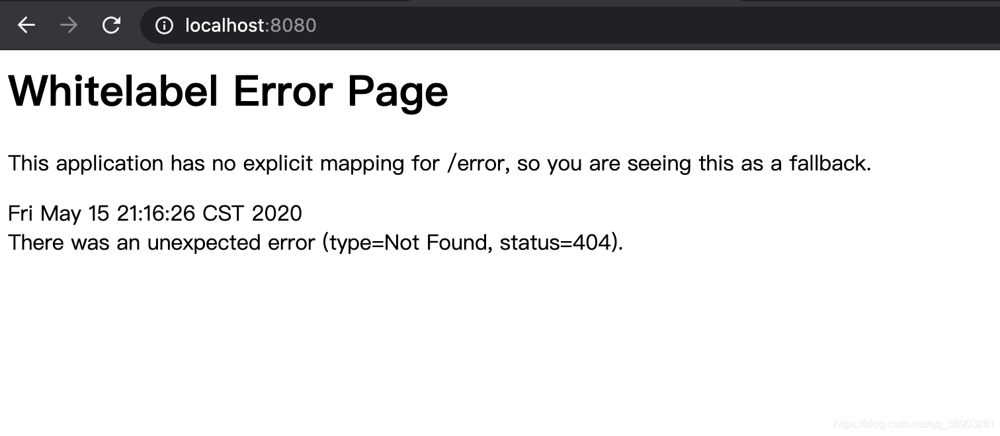
3. 输入`http://localhost:8080/hello`（成功访问并返回HelloWorld）
   
4. 停止项目，打包项目
   
   
   
5. 使用终端进入jar所在的目录，`java -jar 包名`运行项目。
   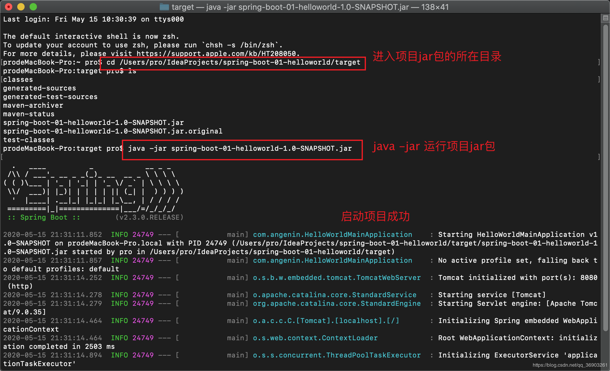
6. 重新在浏览器输入`http://localhost:8080/hello`
   

## 探究HelloWorld

### 1. pom.xml

#### 父项目

```xml
	<!--父项目-->
    <parent>
        <groupId>org.springframework.boot</groupId>
        <artifactId>spring-boot-starter-parent</artifactId>
        <version>2.3.0.RELEASE</version>
        <relativePath/> <!-- lookup parent from repository -->
    </parent>
1234567
```

按住ctrl键点击spring-boot-starter-parent，发现这个父项目里还依赖着个父项目。
按住ctrl键点击spring-boot-dependencies，发现这个父项目里写着依赖的版本。（真正管理SpringBoot应用里的所有依赖版本，SpringBoot的版本仲裁中心）

所以，以后到入依赖不需要写版本号，因为使用的版本已经提前指定了。（而没有在dependencies里面管理的依赖，还是需要写版本号）

#### 导入的依赖

```xml
	<dependency>
        <groupId>org.springframework.boot</groupId>
        <artifactId>spring-boot-starter-web</artifactId>
    </dependency>
1234
```

**spring-boot-starter**-web：

- **spring-boot-starter**：SpringBoot场景启动器（帮我们导入了Web模块正常运行所依赖的组件）
  SpringBoot将所有的功能场景都抽取出来，做成一个个的starter（启动器），只需要在项目里引入这些starter，相关场景的所有依赖都会导入进来。要用什么功能就导入什么场景的启动器。

### 2. 主程序类（主入口类）

```java
@SpringBootApplication  //标注一个主程序类，说明这是一个SpringBoot应用
public class HelloWorldMainApplication {
    public static void main(String[] args) {        
        //spring应用启动（第一个参数为主程序类，第二个参数为main方法的参数）
        SpringApplication.run(HelloWorldMainApplication.class, args);
    }
}
1234567
```

`@SpringBootApplication`：SpringBoot应用标注在某个类上说明这个类是SpringBoot的主配置类，SpringBoot就应该运行这个类的main方法来启动SpringBoot应用。
查看@SpringBootApplication注解发现组合注解。
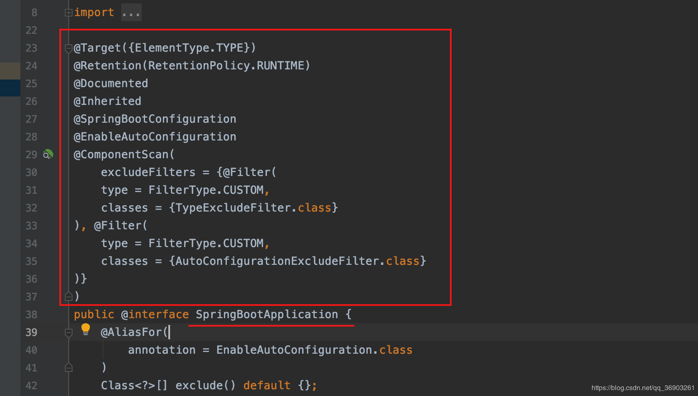

- ```
  @SpringBootConfiguration
  ```

  ：SpringBoot的配置类

  标注在某个类上表示这是一个SpringBoot的配置类

  - ```
    @Configuration
    ```

    ：@SpringBootConfiguration注解上标注着@Configuration表示这是一个配置类。

    - `@Component`：@Configuration上也标注着@Component表示是一个组件。

- ```
  @EnableAutoConfiguration
  ```

  ：开启自动配置功能

  以前我们需要配置的东西，SpringBoot帮我们自动配置，@EnableAutoConfiguration告诉SpringBoot开启自动配置功能，这样自动配置才能生效。

  - ```
    @AutoConfigurationPackage
    ```

    ：自动配置包

    - `@Import({Registrar.class})`：Spring的底层注解@Import，给容器中导入一个组件，导入的组件由Registrar.class，将主配置类（@SpringBootApplication标注的类）的所在包及下面所有子包里面的所有组件扫描到spring容器中。

  - ```
    @Import({AutoConfigurationImportSelector.class})
    ```

    ：给容器中导入AutoConfigurationImportSelector类，这个类为导入哪些组件的选择器。

    将所有需要导入的组件以全类名的方式返回，这些组件就会被添加到容器中。

    会给容器中导入非常多的自动配置类（XXXAutoConfiguration），就是给容器中导入这个场景需要的所有组件，并配置好这些组件。

    

    有了自动配置类，免去我们手动写配置注入功能组件等的工作。

    - `SpringFactoriesLoader.loadFactoryNames(this.getSpringFactoriesLoaderFactoryClass(), this.getBeanClassLoader());`
      SpringBoot在启动的时候从类路径下的META-INF/spring.factories中获取EnableAutoConfiguration指定的值，将这些值作为自动配置类导入到容器中，自动配置类就生效，帮我们进行自动配置工作；以前我们需要自己配置的东西，自动配置类帮我们做了。
      J2EE的整体整合解决方案和自动配置都在spring-boot-autoconfigure-2.3.0.RELEASE.jar里。

## 使用SpringInitializer快速创建SpringBoot应用

1. 新建项目
   
   
   
   继续下一步，创建，然后SpringBoot就会联网为我们快速创建一个SpringBoot应用。
   生成的这些文件目前没什么用，可以先删除。
   
   
   默认生成的SpringBoot项目

- 主程序已经生成好了，我们只需要写我们的业务逻辑
- resources目录
  - static：保存所有的静态资源（js、css、images）
  - templates：保存所有的模板页面（SpringBoot默认jar包使用嵌入式的tomcat，默认不支持jsp页面），但可以使用模板引擎（freemarker、thymeleaf）
  - application.properties：SpringBoot应用的配置文件，可以修改一些默认配置

1. 新建一个HelloController。
   

```java
package com.angenin.springboot.controller;

import org.springframework.stereotype.Controller;
import org.springframework.web.bind.annotation.RequestMapping;
import org.springframework.web.bind.annotation.ResponseBody;

@RestController //效果和@Controller+@ResponseBody一样（Controller下的所有方法都是@ResponseBody，如果是对象转为json数据）
public class HelloController {

    @RequestMapping("/hello")
    public String hello(){
        return "HelloWorldQuick";
    }

}
123456789101112131415
```

在主配置类里启动SpringBoot应用。
然后在浏览器里输入`http://localhost:8080/hello`


# 二、SpringBoot配置

------

## 1. 配置文件

在类路径下有`application.properties`或`application.yml`，SpringBoot都会把它当成全局的配置文件，配置文件名是固定的。
配置文件的作用：修改SpringBoot自动配置的默认值，SpringBoot在底层都给我们自动配置好了。

### YAML

- YAML（YAML Ain’t a Markup Language）：
  YAML A Markup Language：是一种标记语言
  YAML isn’t Markup Language：不是一种标记语言
- 标记语言：
  以前的配置文件；大多都使用的是xxx.xml文件
  YAML：以数据为中心，比json、xml等更适合做配置文件
- 配置例子：
  YAML：

```yml
server:
  port: 8081
12
```

XML：

```xml
<server>
	<port>8081</port>
</server>
123
```

#### YAML的语法

##### 1. 基本语法

k: (空格) v 表示一对键值对（空格必须有）
以**空格**的缩进来控制层级关系，只要是左对齐的一列数据，都是同一个层级的。

```yml
server:
  port: 8081
  path: /hello
123
```

属性和值也是大小写敏感。

##### 2. 值的写法

- 字面量：普通的值（数字、字符串、布尔）
  k: (空格) v 字面值直接写
  字符串默认不用加单引号或双引号
  “”（双引号）：不会转义字符串里面的特殊字符，特殊字符会作为本身想表示的意思。
  例：name: “zhangsan \n lisi” 输出zhangsan (换行) lisi
  ‘’（单引号）：会转义特殊字符，特殊字符最终只是一个普通的字符串数据。
  例：name: ‘zhangsan \n lisi’ 输出zhangsan \n lisi
- 对象、Map（属性和值）（键值对）
  k: (空格) v 对象还是k: v的方式，在下一行来写对象的属性和值的关系（注意缩进）
  例：

```yml
friends: 
  lastname: zhangsan
  age: 22
123
```

行内写法：

```yml
friends: {lastname: zhangsan,age: 22}
1
```

- 数组（List、Set）
  用 - (空格) 值表示数组中的一个元素
  例：

```yml
pets: 
  - cat
  - dog
  - pig
1234
```

行内写法

```yml
pets: [cat,dog,pig]
1
```

## 2. @ConfigurationProperties配置文件值注入

### yml配置文件数据注入

快速新建一个名为spring-boot-02-config的SpringBoot项目
在resources里添加一个名为application.yml文件

```yml
server:
  port: 8081

person:
  lastName: zhangsan
  age: 18
  boss: true
  birth: 2020/01/01
  maps: {k1: v1,k2: v2}
  lists:
    - lisi
    - zhaoliu
  dog:
    name: xiaohuang
    age: 2
123456789101112131415
```

在java/com/angenin/springboot下新建一个bean包，在包下新建两个类Dog和Person。

```java
package com.angenin.springboot.bean;

public class Dog {

    private String name;
    private Integer age;

    @Override
    public String toString() {
        return "Dog{" +
                "name='" + name + '\'' +
                ", age=" + age +
                '}';
    }

    public String getName() {
        return name;
    }

    public void setName(String name) {
        this.name = name;
    }

    public Integer getAge() {
        return age;
    }

    public void setAge(Integer age) {
        this.age = age;
    }
}
12345678910111213141516171819202122232425262728293031
package com.angenin.springboot.bean;

import org.springframework.boot.context.properties.ConfigurationProperties;
import org.springframework.stereotype.Component;

import java.util.Date;
import java.util.List;
import java.util.Map;

//将配置文件中配置的每一个属性的值，映射到这个组件中
//@ConfigurationProperties  告诉SpringBoot将本类的所有属性和配置文件中相关的配置进行绑定（默认从全局配置文件中获取数据）
// prefix = "person"    配置文件中哪个下面的所有属性进行一一映射
@ConfigurationProperties(prefix = "person")
@Component	//如果不加上@Component，@ConfigurationProperties会标红，这是因为@ConfigurationProperties注解是容器提供的功能，没有添加到容器的组件不能使用
public class Person {

    private String lastName;
    private Integer age;
    private Boolean boss;
    private Date birth;

    private Map<String, Object> maps;
    private List<Object> lists;
    private Dog dog;


    @Override
    public String toString() {
        return "Person{" +
                "lastName='" + lastName + '\'' +
                ", age=" + age +
                ", boss=" + boss +
                ", birth=" + birth +
                ", maps=" + maps +
                ", lists=" + lists +
                ", dog=" + dog +
                '}';
    }

    public String getLastName() {
        return lastName;
    }

    public void setLastName(String lastName) {
        this.lastName = lastName;
    }

    public Integer getAge() {
        return age;
    }

    public void setAge(Integer age) {
        this.age = age;
    }

    public Boolean getBoss() {
        return boss;
    }

    public void setBoss(Boolean boss) {
        this.boss = boss;
    }

    public Date getBirth() {
        return birth;
    }

    public void setBirth(Date birth) {
        this.birth = birth;
    }

    public Map<String, Object> getMaps() {
        return maps;
    }

    public void setMaps(Map<String, Object> maps) {
        this.maps = maps;
    }

    public List<Object> getLists() {
        return lists;
    }

    public void setLists(List<Object> lists) {
        this.lists = lists;
    }

    public Dog getDog() {
        return dog;
    }

    public void setDog(Dog dog) {
        this.dog = dog;
    }
}
1234567891011121314151617181920212223242526272829303132333435363738394041424344454647484950515253545556575859606162636465666768697071727374757677787980818283848586878889909192939495
```

这时候会出现“Spring Boot配置注解执行器没有配置”。

需要引入依赖

```xml
<!--    导入配置文件处理器，配置文件进行绑定就会有提示    -->
<dependency>
    <groupId>org.springframework.boot</groupId>
    <artifactId>spring-boot-configuration-processor</artifactId>
    <optional>true</optional>
</dependency>
123456
```

在test/java/com/angenin/springboot下的SpringBoot02ConfigApplicationTests进行测试。

```java
/**
 * SpringBoot单元测试
 * 可以在测试期间很方便的类似编码一样进行自动注入等容器的功能
 */
@SpringBootTest
class SpringBoot02ConfigApplicationTests {

    @Autowired
    Person person;

    @Test
    void contextLoads() {
        System.out.println(person);
    }

}
12345678910111213141516
```

运行期间如果卡在这

请强制退出idea，重新进入并添加依赖：

```xml
 <dependency>
    <groupId>org.junit.platform</groupId>
    <artifactId>junit-platform-launcher</artifactId>
    <scope>test</scope>
</dependency>
12345
```

成功把application.yml中person数据注入


### properties配置文件数据注入

注释掉yml文件中的person数据，在properties文件中写入

```xml
person.last-name=张三
person.age=19
person.birth=2020/01/01
person.boss=true
person.maps.k1=v1
person.maps.k2=v2
person.lists=a,b,c
person.dog.name=小黄
person.dog.age=2
123456789
```

运行测试类发现，虽然成功注入，但是输入的中文出现乱码的情况。

解决方法：

如果重新运行后，还是乱码，可以试试先把properties文件的person数据注释掉，然后运行yml中的数据，然后再运行properties文件的数据，还是不行的话重新启动idea，多试几次就可以了 。

## 3. 使用@Value注入数据

@Value支持字面量、${key}从环境变量或配置文件中获取值、#{SpEL}
例：
注释掉Person类上的@ConfigurationProperties，在Person类的属性上加上@Value。

```java
	//测试三种写法
    @Value("${person.last-name}")
    private String lastName;
    @Value("#{10*2}")
    private Integer age;
    @Value("true")
    private Boolean boss;
1234567
```


@Value与@ConfigurationProperties的区别

|                            | @ConfigurationProperties | @Value     |
| -------------------------- | ------------------------ | ---------- |
| 功能                       | 批量注入配置文件中的属性 | 一个个指定 |
| 松散绑定(松散语法)         | 支持                     | 不支持     |
| SpEL                       | 不支持                   | 支持       |
| JSR303数据校验(@Validated) | 支持                     | 不支持     |
| 复杂类型封装               | 支持                     | 不支持     |

*松散语法：lastName与last-name、last_name相同*
使用选择：
如果只是在某个业务逻辑中需要获取一下配置文件中的某项值，使用@Value。
如果专门编写一个javabean和配置文件进行映射，使用@ConfigurationProperties。

## 4. @PropertySource和@ImportResource

`@PropertySource`：加载指定的配置文件
例：
在resources下新建一个person.properties配置文件。

```java
@PropertySource(value = {"classpath:person.properties"})	//指定加载的配置文件
@ConfigurationProperties(prefix = "person")	//默认从全局配置文件中获取值
@Component  
public class Person {...}
1234
```

`@ImportResource`：导入SpringBoot的配置文件，让配置文件中的内容生效。
例：
在com/angenin/springboot/service新建一个HelloService类。
在resources下新建一个beans.xml的spring配置文件。

```xml
<?xml version="1.0" encoding="UTF-8"?>
<beans xmlns="http://www.springframework.org/schema/beans"
       xmlns:xsi="http://www.w3.org/2001/XMLSchema-instance"
       xsi:schemaLocation="http://www.springframework.org/schema/beans http://www.springframework.org/schema/beans/spring-beans.xsd">

    <bean id="helloService" class="com.angenin.springboot.service.HelloService"></bean>

</beans>
12345678
```

在测试类中添加

```java
    @Autowired
    ApplicationContext ioc;

    @Test
    public void testHelloService(){
    	//判断容器中是否包含指定的组件
        boolean b = ioc.containsBean("helloService");
        System.out.println(b);
    }
123456789
```

运行结果为：false
说明创建配置文件并在里面注册，但是配置文件却没运行，如果想要配置文件运行，需要在主配置类上加上@ImportResource注解。

```java
@ImportResource(value = {"classpath:beans.xml"})	//导入配置文件使其生效
@SpringBootApplication
public class SpringBoot02ConfigApplication {...}
123
```

重新运行的结果为：true

### SpringBoot推荐使用全注解的方式添加组件

例：
注释掉主配置类的@ImportResource
在com/angenin/springboot/config中添加，名为MyAppConfig.java类

```java
package com.angenin.springboot.config;

import com.angenin.springboot.service.HelloService;
import org.springframework.context.annotation.Bean;
import org.springframework.context.annotation.Configuration;


@Configuration  //指明当前类是一个配置类（代替spring的xml配置文件）
public class MyAppConfig {

    @Bean   //将方法的返回值添加到容器中，默认id为方法名（代替xml配置文件中的<bean>）
    public HelloService helloService(){
        System.out.println("配置类往容器中添加HelloService组件...");
        return new HelloService();
    }

}
1234567891011121314151617
```

重新运行测试类的testHelloService方法，结果为true
不需要在主配置类上加注解，只要在类上加@Configuration注解表明是配置类即可。

## 5. 配置文件占位符

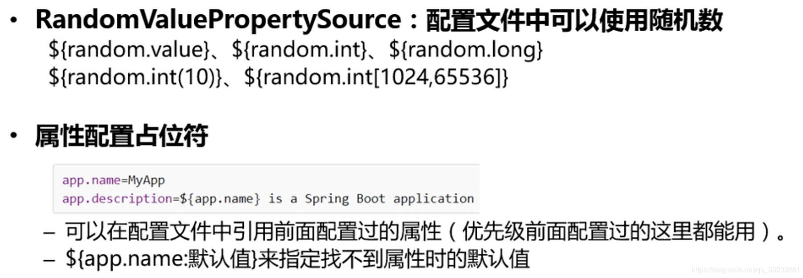
例：

```xml
person.last-name=张三${random.uuid}	#随机数uuid
person.age=${random.int}	#随机整数
person.birth=2020/01/01
person.boss=true
person.maps.k1=v1
person.maps.k2=v2
person.lists=a,b,c
person.dog.name=${person.last-name}的小黄
person.dog.age=${person.hello:3}	#如果没有person.hello，取默认值3
123456789
```

运行结果：

```
Person{lastName='张三9d6d3b11-98ac-4752-87d6-fce3ed6f0171', age=-1814115186, boss=true, birth=Wed Jan 01 00:00:00 CST 2020, maps={k1=v1, k2=v2}, lists=[a, b, c], dog=Dog{name='张三b79bd0fc-35a9-4c8e-89a0-1da2fedd6b36的小黄', age=3}}
1
```

## 6. Profile

Profile是Spring对不同环境提供不同配置功能的支持，可以通过激活、指定参数等方式快速切换环境。

1. 多Profile文件形式(properties文件)：
   编写不同环境的主配置文件时，文件名可以是application-{profile}.properties。{profile}为环境名
   默认使用application.properties的配置文件。
2. 多Profile文档块模式(yml文件)：
   `---`为分隔文档块，下面是三个文档块，对应不同的端口

```yml
server:
  port: 8081
spring:
  profiles:
    active: dev	#指定激活的环境
---
server:
  port: 8082

spring:
  profiles: dev
---
server:
  port: 8083

spring:
  profiles: prod
1234567891011121314151617
```

1. 激活方式：

   在resources下新建application-dev.properties和application-prod.properties配置文件

   - 在主配置文件application.properties中指定要激活的环境`spring.profiles.active=dev`
   - 命令行`--spring.profiles.active=dev`
     配置命令行参数
     
     
     项目打包后，也可以用`java -jar xxx.jar --spring.profiles.active=dev`指定运行环境。
   - 虚拟机参数
     
     如果三种同时存在，命令行参数>虚拟机参数>properties/yml设置。

## 7. 配置文件加载位置

SpringBoot会扫描以下位置的application.properties或application.yml文件作为SpringBoot的默认配置文件。

```
高	file: ./config/		即整个项目的根目录下的config目录
	file: ./				即整个项目的根目录下
	classpath: /config/	即resources/config目录下
低	classpath: /		即文件创建后生成的application.properties，resources目录下优先级最低
1234
```

以上是按照优先级从高到低的顺序，所有位置的文件都会被加载，高优先级配置内容覆盖低优先级配置内容，如果4个位置都有application.properties，SpringBoot都会加载，同种配置高优先级覆盖低优先级，不同种配置不覆盖，形成互补配置。
打包成jar包后，可以用`java -jar xxx.jar spring.config.location=硬盘下的application.properties文件路径`来用jar包外的配置文件覆盖jar包里的配置文件，互补配置，只覆盖同种配置，多个application.properties文件共同生效。

## 8. 外部配置加载顺序


## 9. 自动配置的原理

> 官方列举的配置文件能配置的属性：https://docs.spring.io/spring-boot/docs/2.3.0.RELEASE/reference/html/appendix-application-properties.html#common-application-properties

1. SpringBoot启动的时候加载主配置类，开启自动配置功能`@EnableAutoConfiguration`

2. @EnableAutoConfiguration的作用：利用AutoConfigurationImportSelector类给容器中导入一些组件？查看selectImports()方法，StringUtils.toStringArray(autoConfigurationEntry.getConfigurations())获取候选的配置，扫描所有jar包类路径下META-INF/spring.factories，把扫描到的这些文件的内容包装成一个properties对象，从properties中获取到EnableAutoConfiguration.class类（类名）对应的值，然后把他们添加到容器中。

   ```
   SpringBoot2.3.0寻找路径：@EnableAutoConfiguration->AutoConfigurationImportSelector.class->selectImports方法->getAutoConfigurationEntry方法->getAutoConfigurationEntry方法->loadFactoryNames方法->loadSpringFactories的getResources("META-INF/spring.factories")
   ```

   将类路径下META-INF/spring.factories里配置的所有EnableAutoConfiguration的值添加到容器中。

   ```xml
   # Auto Configure
   org.springframework.boot.autoconfigure.EnableAutoConfiguration=\
   org.springframework.boot.autoconfigure.admin.SpringApplicationAdminJmxAutoConfiguration,\
   org.springframework.boot.autoconfigure.aop.AopAutoConfiguration,\
   org.springframework.boot.autoconfigure.amqp.RabbitAutoConfiguration,\
   org.springframework.boot.autoconfigure.batch.BatchAutoConfiguration,\
   org.springframework.boot.autoconfigure.cache.CacheAutoConfiguration,\
   org.springframework.boot.autoconfigure.cassandra.CassandraAutoConfiguration,\
   org.springframework.boot.autoconfigure.context.ConfigurationPropertiesAutoConfiguration,\
   org.springframework.boot.autoconfigure.context.LifecycleAutoConfiguration,\
   org.springframework.boot.autoconfigure.context.MessageSourceAutoConfiguration,\
   org.springframework.boot.autoconfigure.context.PropertyPlaceholderAutoConfiguration,\
   org.springframework.boot.autoconfigure.couchbase.CouchbaseAutoConfiguration,\
   org.springframework.boot.autoconfigure.dao.PersistenceExceptionTranslationAutoConfiguration,\
   org.springframework.boot.autoconfigure.data.cassandra.CassandraDataAutoConfiguration,\
   org.springframework.boot.autoconfigure.data.cassandra.CassandraReactiveDataAutoConfiguration,\
   org.springframework.boot.autoconfigure.data.cassandra.CassandraReactiveRepositoriesAutoConfiguration,\
   org.springframework.boot.autoconfigure.data.cassandra.CassandraRepositoriesAutoConfiguration,\
   org.springframework.boot.autoconfigure.data.couchbase.CouchbaseDataAutoConfiguration,\
   org.springframework.boot.autoconfigure.data.couchbase.CouchbaseReactiveDataAutoConfiguration,\
   org.springframework.boot.autoconfigure.data.couchbase.CouchbaseReactiveRepositoriesAutoConfiguration,\
   org.springframework.boot.autoconfigure.data.couchbase.CouchbaseRepositoriesAutoConfiguration,\
   org.springframework.boot.autoconfigure.data.elasticsearch.ElasticsearchDataAutoConfiguration,\
   org.springframework.boot.autoconfigure.data.elasticsearch.ElasticsearchRepositoriesAutoConfiguration,\
   org.springframework.boot.autoconfigure.data.elasticsearch.ReactiveElasticsearchRepositoriesAutoConfiguration,\
   org.springframework.boot.autoconfigure.data.elasticsearch.ReactiveElasticsearchRestClientAutoConfiguration,\
   org.springframework.boot.autoconfigure.data.jdbc.JdbcRepositoriesAutoConfiguration,\
   org.springframework.boot.autoconfigure.data.jpa.JpaRepositoriesAutoConfiguration,\
   org.springframework.boot.autoconfigure.data.ldap.LdapRepositoriesAutoConfiguration,\
   org.springframework.boot.autoconfigure.data.mongo.MongoDataAutoConfiguration,\
   org.springframework.boot.autoconfigure.data.mongo.MongoReactiveDataAutoConfiguration,\
   org.springframework.boot.autoconfigure.data.mongo.MongoReactiveRepositoriesAutoConfiguration,\
   org.springframework.boot.autoconfigure.data.mongo.MongoRepositoriesAutoConfiguration,\
   org.springframework.boot.autoconfigure.data.neo4j.Neo4jDataAutoConfiguration,\
   org.springframework.boot.autoconfigure.data.neo4j.Neo4jRepositoriesAutoConfiguration,\
   org.springframework.boot.autoconfigure.data.solr.SolrRepositoriesAutoConfiguration,\
   org.springframework.boot.autoconfigure.data.r2dbc.R2dbcDataAutoConfiguration,\
   org.springframework.boot.autoconfigure.data.r2dbc.R2dbcRepositoriesAutoConfiguration,\
   org.springframework.boot.autoconfigure.data.r2dbc.R2dbcTransactionManagerAutoConfiguration,\
   org.springframework.boot.autoconfigure.data.redis.RedisAutoConfiguration,\
   org.springframework.boot.autoconfigure.data.redis.RedisReactiveAutoConfiguration,\
   org.springframework.boot.autoconfigure.data.redis.RedisRepositoriesAutoConfiguration,\
   org.springframework.boot.autoconfigure.data.rest.RepositoryRestMvcAutoConfiguration,\
   org.springframework.boot.autoconfigure.data.web.SpringDataWebAutoConfiguration,\
   org.springframework.boot.autoconfigure.elasticsearch.ElasticsearchRestClientAutoConfiguration,\
   org.springframework.boot.autoconfigure.flyway.FlywayAutoConfiguration,\
   org.springframework.boot.autoconfigure.freemarker.FreeMarkerAutoConfiguration,\
   org.springframework.boot.autoconfigure.groovy.template.GroovyTemplateAutoConfiguration,\
   org.springframework.boot.autoconfigure.gson.GsonAutoConfiguration,\
   org.springframework.boot.autoconfigure.h2.H2ConsoleAutoConfiguration,\
   org.springframework.boot.autoconfigure.hateoas.HypermediaAutoConfiguration,\
   org.springframework.boot.autoconfigure.hazelcast.HazelcastAutoConfiguration,\
   org.springframework.boot.autoconfigure.hazelcast.HazelcastJpaDependencyAutoConfiguration,\
   org.springframework.boot.autoconfigure.http.HttpMessageConvertersAutoConfiguration,\
   org.springframework.boot.autoconfigure.http.codec.CodecsAutoConfiguration,\
   org.springframework.boot.autoconfigure.influx.InfluxDbAutoConfiguration,\
   org.springframework.boot.autoconfigure.info.ProjectInfoAutoConfiguration,\
   org.springframework.boot.autoconfigure.integration.IntegrationAutoConfiguration,\
   org.springframework.boot.autoconfigure.jackson.JacksonAutoConfiguration,\
   org.springframework.boot.autoconfigure.jdbc.DataSourceAutoConfiguration,\
   org.springframework.boot.autoconfigure.jdbc.JdbcTemplateAutoConfiguration,\
   org.springframework.boot.autoconfigure.jdbc.JndiDataSourceAutoConfiguration,\
   org.springframework.boot.autoconfigure.jdbc.XADataSourceAutoConfiguration,\
   org.springframework.boot.autoconfigure.jdbc.DataSourceTransactionManagerAutoConfiguration,\
   org.springframework.boot.autoconfigure.jms.JmsAutoConfiguration,\
   org.springframework.boot.autoconfigure.jmx.JmxAutoConfiguration,\
   org.springframework.boot.autoconfigure.jms.JndiConnectionFactoryAutoConfiguration,\
   org.springframework.boot.autoconfigure.jms.activemq.ActiveMQAutoConfiguration,\
   org.springframework.boot.autoconfigure.jms.artemis.ArtemisAutoConfiguration,\
   org.springframework.boot.autoconfigure.jersey.JerseyAutoConfiguration,\
   org.springframework.boot.autoconfigure.jooq.JooqAutoConfiguration,\
   org.springframework.boot.autoconfigure.jsonb.JsonbAutoConfiguration,\
   org.springframework.boot.autoconfigure.kafka.KafkaAutoConfiguration,\
   org.springframework.boot.autoconfigure.availability.ApplicationAvailabilityAutoConfiguration,\
   org.springframework.boot.autoconfigure.ldap.embedded.EmbeddedLdapAutoConfiguration,\
   org.springframework.boot.autoconfigure.ldap.LdapAutoConfiguration,\
   org.springframework.boot.autoconfigure.liquibase.LiquibaseAutoConfiguration,\
   org.springframework.boot.autoconfigure.mail.MailSenderAutoConfiguration,\
   org.springframework.boot.autoconfigure.mail.MailSenderValidatorAutoConfiguration,\
   org.springframework.boot.autoconfigure.mongo.embedded.EmbeddedMongoAutoConfiguration,\
   org.springframework.boot.autoconfigure.mongo.MongoAutoConfiguration,\
   org.springframework.boot.autoconfigure.mongo.MongoReactiveAutoConfiguration,\
   org.springframework.boot.autoconfigure.mustache.MustacheAutoConfiguration,\
   org.springframework.boot.autoconfigure.orm.jpa.HibernateJpaAutoConfiguration,\
   org.springframework.boot.autoconfigure.quartz.QuartzAutoConfiguration,\
   org.springframework.boot.autoconfigure.r2dbc.R2dbcAutoConfiguration,\
   org.springframework.boot.autoconfigure.rsocket.RSocketMessagingAutoConfiguration,\
   org.springframework.boot.autoconfigure.rsocket.RSocketRequesterAutoConfiguration,\
   org.springframework.boot.autoconfigure.rsocket.RSocketServerAutoConfiguration,\
   org.springframework.boot.autoconfigure.rsocket.RSocketStrategiesAutoConfiguration,\
   org.springframework.boot.autoconfigure.security.servlet.SecurityAutoConfiguration,\
   org.springframework.boot.autoconfigure.security.servlet.UserDetailsServiceAutoConfiguration,\
   org.springframework.boot.autoconfigure.security.servlet.SecurityFilterAutoConfiguration,\
   org.springframework.boot.autoconfigure.security.reactive.ReactiveSecurityAutoConfiguration,\
   org.springframework.boot.autoconfigure.security.reactive.ReactiveUserDetailsServiceAutoConfiguration,\
   org.springframework.boot.autoconfigure.security.rsocket.RSocketSecurityAutoConfiguration,\
   org.springframework.boot.autoconfigure.security.saml2.Saml2RelyingPartyAutoConfiguration,\
   org.springframework.boot.autoconfigure.sendgrid.SendGridAutoConfiguration,\
   org.springframework.boot.autoconfigure.session.SessionAutoConfiguration,\
   org.springframework.boot.autoconfigure.security.oauth2.client.servlet.OAuth2ClientAutoConfiguration,\
   org.springframework.boot.autoconfigure.security.oauth2.client.reactive.ReactiveOAuth2ClientAutoConfiguration,\
   org.springframework.boot.autoconfigure.security.oauth2.resource.servlet.OAuth2ResourceServerAutoConfiguration,\
   org.springframework.boot.autoconfigure.security.oauth2.resource.reactive.ReactiveOAuth2ResourceServerAutoConfiguration,\
   org.springframework.boot.autoconfigure.solr.SolrAutoConfiguration,\
   org.springframework.boot.autoconfigure.task.TaskExecutionAutoConfiguration,\
   org.springframework.boot.autoconfigure.task.TaskSchedulingAutoConfiguration,\
   org.springframework.boot.autoconfigure.thymeleaf.ThymeleafAutoConfiguration,\
   org.springframework.boot.autoconfigure.transaction.TransactionAutoConfiguration,\
   org.springframework.boot.autoconfigure.transaction.jta.JtaAutoConfiguration,\
   org.springframework.boot.autoconfigure.validation.ValidationAutoConfiguration,\
   org.springframework.boot.autoconfigure.web.client.RestTemplateAutoConfiguration,\
   org.springframework.boot.autoconfigure.web.embedded.EmbeddedWebServerFactoryCustomizerAutoConfiguration,\
   org.springframework.boot.autoconfigure.web.reactive.HttpHandlerAutoConfiguration,\
   org.springframework.boot.autoconfigure.web.reactive.ReactiveWebServerFactoryAutoConfiguration,\
   org.springframework.boot.autoconfigure.web.reactive.WebFluxAutoConfiguration,\
   org.springframework.boot.autoconfigure.web.reactive.error.ErrorWebFluxAutoConfiguration,\
   org.springframework.boot.autoconfigure.web.reactive.function.client.ClientHttpConnectorAutoConfiguration,\
   org.springframework.boot.autoconfigure.web.reactive.function.client.WebClientAutoConfiguration,\
   org.springframework.boot.autoconfigure.web.servlet.DispatcherServletAutoConfiguration,\
   org.springframework.boot.autoconfigure.web.servlet.ServletWebServerFactoryAutoConfiguration,\
   org.springframework.boot.autoconfigure.web.servlet.error.ErrorMvcAutoConfiguration,\
   org.springframework.boot.autoconfigure.web.servlet.HttpEncodingAutoConfiguration,\
   org.springframework.boot.autoconfigure.web.servlet.MultipartAutoConfiguration,\
   org.springframework.boot.autoconfigure.web.servlet.WebMvcAutoConfiguration,\
   org.springframework.boot.autoconfigure.websocket.reactive.WebSocketReactiveAutoConfiguration,\
   org.springframework.boot.autoconfigure.websocket.servlet.WebSocketServletAutoConfiguration,\
   org.springframework.boot.autoconfigure.websocket.servlet.WebSocketMessagingAutoConfiguration,\
   org.springframework.boot.autoconfigure.webservices.WebServicesAutoConfiguration,\
   org.springframework.boot.autoconfigure.webservices.client.WebServiceTemplateAutoConfiguration
   123456789101112131415161718192021222324252627282930313233343536373839404142434445464748495051525354555657585960616263646566676869707172737475767778798081828384858687888990919293949596979899100101102103104105106107108109110111112113114115116117118119120121122123124125126127128129
   ```

   每一个这样的xxxAutoConfiguration类都是容器中的一个组件，都加入到容器中，用他们来做自动配置。

3. 每一个自动配置类进行自动配置功能。

4. 以HttpEncodingAutoConfiguration（Http编码自动配置）为例解释自动配置原理。

```java
//HttpEncodingAutoConfiguration类上的注解
@Configuration(	//表示这是一个配置类
    proxyBeanMethods = false	//不想通过调用方法来获取bean
)	
@EnableConfigurationProperties({ServerProperties.class})	//启动指定类的ConfigurationProperties功能，将配置文件中对应的值和ServerProperties绑定起来，并把ServerProperties添加到容器中
@ConditionalOnWebApplication(	//Spring底层@Conditional注解，根据不同的条件，只有满足指定条件，整个配置类里面的配置才会生效（判断当前应用是否是web应用，如果是，当前配置类生效）
    type = Type.SERVLET	//属性为servlet
)
@ConditionalOnClass({CharacterEncodingFilter.class})	//判断当前项目有没有这个类（CharacterEncodingFilter：SpringMVC中解决乱码的过滤器）
@ConditionalOnProperty(	//判断配置文件中是否存在某个配置（server.servlet.encoding.enabled）；如果不存在，判断也是成立的server.servlet.encoding.enabled=true，也是默认生效的
//即使配置文件中不配置
    prefix = "server.servlet.encoding",
    value = {"enabled"},
    matchIfMissing = true
)
public class HttpEncodingAutoConfiguration {
	//它已经和SpringBoot的配置文件映射了
    private final Encoding properties;

	//如果只有一个有参构造器，那么参数的值会从容器中拿
	public HttpEncodingAutoConfiguration(ServerProperties properties) {
        this.properties = properties.getServlet().getEncoding();
    }

	@Bean	//给容器中添加一个组件，这个组件的某些值需要从properties中获取
    @ConditionalOnMissingBean
    public CharacterEncodingFilter characterEncodingFilter() {
        CharacterEncodingFilter filter = new OrderedCharacterEncodingFilter();
        filter.setEncoding(this.properties.getCharset().name());
        filter.setForceRequestEncoding(this.properties.shouldForce(org.springframework.boot.web.servlet.server.Encoding.Type.REQUEST));
        filter.setForceResponseEncoding(this.properties.shouldForce(org.springframework.boot.web.servlet.server.Encoding.Type.RESPONSE));
        return filter;
    }
	...
}
1234567891011121314151617181920212223242526272829303132333435
```

根据当前不同的条件判断，决定这个配置类是否生效。一但这个配置类生效，这个配置类就会给容器中添加各种组件。这些组件的属性是从对应的properties类中获取的，这些类里面的每一个属性又是和配置文件绑定的。

1. 所有在配置文件中能配置的属性都是在XXXProperties类中封装着，配置文件能配置什么就可以参照某个功能对应的这个属性类。

```java
@ConfigurationProperties(	//从配置文件中获取指定的值和bean的属性进行绑定
    prefix = "server",
    ignoreUnknownFields = true	//忽略未知字段
)
public class ServerProperties {...}
12345
```


### @Conditional派生注解

加了@Conditional派生注解的类，必须在@Conditional派生注解指定的条件成立，才会给容器添加组件，配置类里面的所有内容才生效。
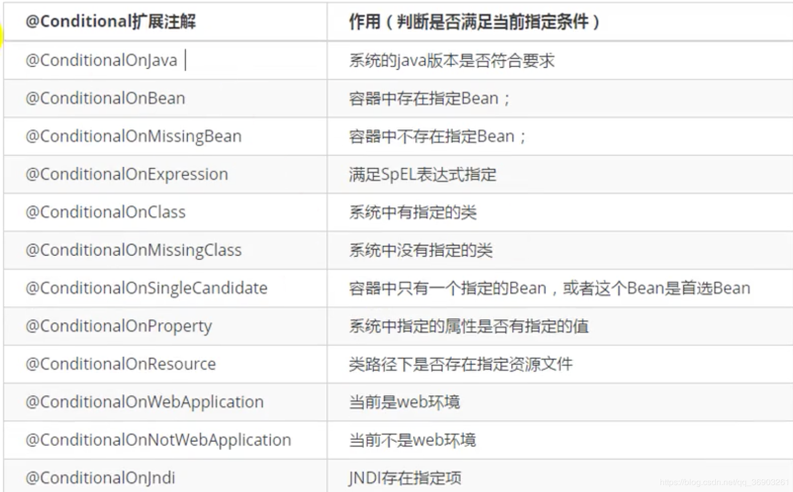
自动配置类必须在一定的条件下才能生效。

开启SpringBoot的debug模式：在application.properties中加入`debug=true`属性，可以在启动项目的时候，让控制台打印自动配置报告，可以很方便的知道哪些自动配置类生效。

*Positive matches：启用的自动配置类
Negative matches：没启用和没匹配成功的自动配置类*

# 三、SpringBoot与日志


开发时，不应该直接调用日志的实现类，而是应该调用日志抽象层里面的方法。
导入slf4j的jar包和logback的实现jar包

```java
//slf4j官方示例
import org.slf4j.Logger;
import org.slf4j.LoggerFactory;

public class HelloWorld {
  public static void main(String[] args) {
    Logger logger = LoggerFactory.getLogger(HelloWorld.class);
    logger.info("Hello World");
  }
}
12345678910
```


每一个日志的实现框架都有自己的配置文件。使用slf4j以后，**配置文件还是做成日志实现框架自己本身的配置文件**。
当不同框架使用了不同的日志框架后，统一日志记录，可以使用slf4j提供的jar替换框架里的日志框架，实现所有框架共同使用slf4j。


#### 将日志框架统一成slf4j的步骤：

1. 将系统中的其他日志框架先排除出去
2. 用中间包来替换原有的日志框架
3. 导入slf4j其他的实现

## 1. SpringBoot的日志关系

SpringBoot使用它来做日志功能：

```xml
    <dependency>
      <groupId>org.springframework.boot</groupId>
      <artifactId>spring-boot-starter-logging</artifactId>
      <version>2.3.0.RELEASE</version>
      <scope>compile</scope>
    </dependency>
123456
```


可以看到SpringBoot的日志jar包在底层的依赖关系

SpringBoot能自动适配所有的日志，而且底层使用slf4j+logback的方式记录日志，引入其他框架时，只需要把引入的框架依赖的日志框架去除掉。

## 2. 日志的关系

1. 默认配置
   SpringBoot默认配置好了日志。
   测试log，测试类

```java
package com.angenin.springboot;

import org.junit.jupiter.api.Test;
import org.slf4j.Logger;
import org.slf4j.LoggerFactory;
import org.springframework.boot.test.context.SpringBootTest;

@SpringBootTest
class SpringBoot03LoggingApplicationTests {

    //记录器
    Logger logger = LoggerFactory.getLogger(getClass());

    @Test
    void contextLoads() {
        //日志的级别：
        //由低到高  trace < debug < info < warn < error
        //可以调整输出(打印)的日志级别，低级别的日志就不会输出

        //跟踪
        logger.trace("trace日志。。");
        //debug
        logger.debug("debug日志。。");
        //自定义，SpringBoot默认使用info级别（root级别），即上面两个即使写在方法里也不会输出打印
        //可以在application.properties加入 logging.level.包名=trace 属性指定包下使用的日志输出级别
        logger.info("info日志。。");
        //警告
        logger.warn("warn日志。。");
        //错误
        logger.error("error日志。。");
    }
}
1234567891011121314151617181920212223242526272829303132
```

在application.properties中

```shell
#指定包下使用的日志输出级别
logging.level.com.angenin=trace
#在指定的路径下生成日志文件（在当前项目的根目录下生成spring/log/spring.log日志文件）
logging.file.path=spring/log
#在控制台输入的日志格式
logging.pattern.console=
#指定生成的日志文件中的输出格式
logging.pattern.file=
12345678
```

日志输出格式：


1. 指定配置
   logback指定配置文件：在resources下新建logback.xml或logback-spring.xml文件，SpringBoot就不会用底层的默认配置，而是使用resources下的配置文件。
   
   SpringBoot推荐我们配置文件名写为logback-spring.xml。
   logback.xml：会直接被日志框架识别
   logback-spring.xml：不会被日志框架直接加载，而是由SpringBoot解析日志配置，所以在配置文件中可使用SpringBoot提供的< springProfile >标签（< springProfile >标签可以指定某段配置文件只在某个环境下生效）。

```xml
<!--官方的示例-->
<springProfile name="staging">
	<!--在staging环境下生效-->
    <!-- configuration to be enabled when the "staging" profile is active -->
</springProfile>

<springProfile name="dev | staging">
	<!--在dev和staging环境下生效-->
    <!-- configuration to be enabled when the "dev" or "staging" profiles are active -->
</springProfile>

<springProfile name="!production">
	<!--在不是production环境下生效，production环境下不生效-->
    <!-- configuration to be enabled when the "production" profile is not active -->
</springProfile>
123456789101112131415
```

# 四、SpringBoot与Web开发

## 1. SpringBoot对静态资源的映射规则

WebMvcAutoConfiguration.class：

```java
        public void addResourceHandlers(ResourceHandlerRegistry registry) {
            if (!this.resourceProperties.isAddMappings()) {
                logger.debug("Default resource handling disabled");
            } else {
                Duration cachePeriod = this.resourceProperties.getCache().getPeriod();
                CacheControl cacheControl = this.resourceProperties.getCache().getCachecontrol().toHttpCacheControl();
                if (!registry.hasMappingForPattern("/webjars/**")) {
                    this.customizeResourceHandlerRegistration(registry.addResourceHandler(new String[]{"/webjars/**"}).addResourceLocations(new String[]{"classpath:/META-INF/resources/webjars/"}).setCachePeriod(this.getSeconds(cachePeriod)).setCacheControl(cacheControl));
                }

                String staticPathPattern = this.mvcProperties.getStaticPathPattern();
                if (!registry.hasMappingForPattern(staticPathPattern)) {
                    this.customizeResourceHandlerRegistration(registry.addResourceHandler(new String[]{staticPathPattern}).addResourceLocations(WebMvcAutoConfiguration.getResourceLocations(this.resourceProperties.getStaticLocations())).setCachePeriod(this.getSeconds(cachePeriod)).setCacheControl(cacheControl));
                }

            }
        }
1234567891011121314151617
@ConfigurationProperties(
    prefix = "spring.resources",
    ignoreUnknownFields = false
)
public class ResourceProperties {...}
12345
```

1. 所有访问/webjars/**，都去classpath:/META-INF/resources/webjars/下找资源
   webjars：以jar包的方式引入静态资源

   ```xml
      <!--   引入jquery-webjar     -->
      <!--  在访问的时候只需要写webjars下面资源的名称即可   -->
      <dependency>
          <groupId>org.webjars</groupId>
          <artifactId>jquery</artifactId>
          <version>3.4.1</version>
      </dependency>
   1234567
   ```

   
   访问JQuery的路径：http://localhost:8080/webjars/jquery/3.4.1/jquery.js
   

2. /**访问当前项目的任何资源，会到下面5个目录（静态资源目录）找资源：

   ```
   classpath:/		为resources目录下
   "classpath:/META-INF/resources/"	优先级最高
   "classpath:/resources/"
   "classpath:/static/"
   "classpath:/public/"
   "/"				当前项目的根目录		优先级最低
   123456
   ```

   如果在resources/static下有a.html页面，访问的路径：http://localhost:8080/a.html
   

3. 欢迎页，5个静态资源目录下的所有index.html，被/**路径映射。
   下面是欢迎页的SpringBoot源码
   WebMvcAutoConfiguration.class

   ```java
       @Bean
       public WelcomePageHandlerMapping welcomePageHandlerMapping(ApplicationContext applicationContext, FormattingConversionService mvcConversionService, ResourceUrlProvider mvcResourceUrlProvider) {
           WelcomePageHandlerMapping welcomePageHandlerMapping = new WelcomePageHandlerMapping(new TemplateAvailabilityProviders(applicationContext), applicationContext, this.getWelcomePage(), this.mvcProperties.getStaticPathPattern());
           welcomePageHandlerMapping.setInterceptors(this.getInterceptors(mvcConversionService, mvcResourceUrlProvider));
           welcomePageHandlerMapping.setCorsConfigurations(this.getCorsConfigurations());
           return welcomePageHandlerMapping;
       }
   
           private Optional<Resource> getWelcomePage() {
           String[] locations = WebMvcAutoConfiguration.getResourceLocations(this.resourceProperties.getStaticLocations());
           return Arrays.stream(locations).map(this::getIndexHtml).filter(this::isReadable).findFirst();
       }
   
       private Resource getIndexHtml(String location) {
           return this.resourceLoader.getResource(location + "index.html");
       }
   12345678910111213141516
   ```

   WelcomePageHandlerMapping.class

   ```java
   	WelcomePageHandlerMapping(TemplateAvailabilityProviders templateAvailabilityProviders, ApplicationContext applicationContext, Optional<Resource> welcomePage, String staticPathPattern) {
   	        if (welcomePage.isPresent() && "/**".equals(staticPathPattern)) {
   	            logger.info("Adding welcome page: " + welcomePage.get());
   	            this.setRootViewName("forward:index.html");
   	        } else if (this.welcomeTemplateExists(templateAvailabilityProviders, applicationContext)) {
   	            logger.info("Adding welcome page template: index");
   	            this.setRootViewName("index");
   	        }
   	
   	    }
   12345678910
   ```

   *如果5个路径静态资源路径都有index.html，会使用resources/META-INF/resources/index.html*
   

4. 页面图标
   在静态资源下放置名为favicon.ico的图标图片，打开项目后就会在页面标签上显示。
   制作ico图标：https://tool.lu/favicon/
   
   

## 2. 模板引擎

> JSP、Velocity、Freemarker、Thymeleaf，…
> 
> SpringBoot推荐Thymeleaf，语法简单，功能强大。

##### 1. 引入thymeleaf

```xml
<!--    引入thymeleaf模板引擎    -->
<dependency>
    <groupId>org.springframework.boot</groupId>
    <artifactId>spring-boot-starter-thymeleaf</artifactId>
</dependency>
12345
```

##### 2. Thymeleaf的使用

```java
@ConfigurationProperties(
    prefix = "spring.thymeleaf"
)
public class ThymeleafProperties {
    private static final Charset DEFAULT_ENCODING;
    public static final String DEFAULT_PREFIX = "classpath:/templates/";
    public static final String DEFAULT_SUFFIX = ".html";
    private boolean checkTemplate = true;
    private boolean checkTemplateLocation = true;
    private String prefix = "classpath:/templates/";
    private String suffix = ".html";
    private String mode = "HTML";
    ...
12345678910111213
只要把html页面放在classpath:/templates/（即resources/templates/）目录下，thymeleaf就能自动渲染。
1
```

例：
@Controller
Controller里添加：

```java
  @RequestMapping("/success")
  public String success(){
      return "success";
  }
1234
然后在resources/templates目录下新建一个success.html，当页面访问/success时，就会去resources/templates找返回的字符串加.html页面。
1
```


Thymeleaf官网：https://www.thymeleaf.org/index.html
右键PDF，点击链接存储为，下载pdf文档。

在html页面的html标签中导入thymeleaf的名称空间：

```html
<html lang="en" xmlns:th="http://www.thymeleaf.org">
1
```

*导入后，在使用的时候会有语法提示*

修改Controller中的方法，保存数据

```java
    //查出数据，在页面显示
   @RequestMapping("/success")
   public String success(Map<String, Object> map){
       map.put("hello", "<h1>你好</h1>");
       map.put("users", Arrays.asList("zhangsan", "lisi", "wangwu"));
       return "success";
   }
1234567
```

在页面中取值

```html
    <div id="div01" class="myDiv" th:id="${hello}" th:class="${hello}" th:text="${hello}"></div>
    <hr/>
    <!--  转义特殊字符（即照原样的字符串显示）  -->
    <div th:text="${hello}"></div>
    <!--  不转义特殊字符  -->
    <div th:utext="${hello}"></div>
    <hr/>
    <!--  th:each每次遍历都会生成当前标签  -->
    <!--  写法一  -->
    <h4 th:each="user:${users}" th:text="${user}"></h4>
    <hr/>
    <!--  写法二  -->
    <h4>
        <span th:each="user:${users}">[[${user}]] </span>
    </h4>
123456789101112131415
```


##### 3. Thymeleaf的语法

内容过多，单独写在另一篇了，详情查看：https://blog.csdn.net/qq_36903261/article/details/106190445

thymeleaf标签的优先级：

使用Thymeleaf的一个练习：https://blog.csdn.net/qq_36903261/article/details/106217848

## 3. 错误处理机制

#### SpringBoot默认的错误处理机制

###### 默认效果：

1. 如果是用浏览器进行访问的，SpringBoot会返回一个默认的错误页面
   
   浏览器发送请求的请求头：
   
2. 如果是其他客户端，默认响应一个json数据的错误信息
   
   发送请求的请求头：
   

###### 原理：

参照ErrorMvcAutoConfiguration（错误处理的自动配置）
给容器中添加了以下组件：

1. DefaultErrorAttributes：帮我们在页面共享信息

   ```java
   @Deprecated
   public Map<String, Object> getErrorAttributes(WebRequest webRequest, boolean includeStackTrace) {
       Map<String, Object> errorAttributes = new LinkedHashMap();
       errorAttributes.put("timestamp", new Date());
       this.addStatus(errorAttributes, webRequest);
       this.addErrorDetails(errorAttributes, webRequest, includeStackTrace);
       this.addPath(errorAttributes, webRequest);
       return errorAttributes;
   }
   123456789
   ```

2. BasicErrorController：处理默认/error请求

   ```java
   @Controller
   @RequestMapping({"${server.error.path:${error.path:/error}}"})
   public class BasicErrorController extends AbstractErrorController {
   
   //产生html类型的数据，即浏览器发送的请求来到这个方法处理
   @RequestMapping(produces = {"text/html"})
   public ModelAndView errorHtml(HttpServletRequest request, HttpServletResponse response) {
       HttpStatus status = this.getStatus(request);
       Map<String, Object> model = Collections.unmodifiableMap(this.getErrorAttributes(request, this.getErrorAttributeOptions(request, MediaType.TEXT_HTML)));
       response.setStatus(status.value());
       //去哪个页面作为错误页面，包含页面地址和页面内容
       ModelAndView modelAndView = this.resolveErrorView(request, response, status, model);
       return modelAndView != null ? modelAndView : new ModelAndView("error", model);
   }
   
   //产生json数据，其他客户端来到这个方法处理
   @RequestMapping
   public ResponseEntity<Map<String, Object>> error(HttpServletRequest request) {
       HttpStatus status = this.getStatus(request);
       if (status == HttpStatus.NO_CONTENT) {
           return new ResponseEntity(status);
       } else {
           Map<String, Object> body = this.getErrorAttributes(request, this.getErrorAttributeOptions(request, MediaType.ALL));
           return new ResponseEntity(body, status);
       }
   }
   1234567891011121314151617181920212223242526
   ```

3. ErrorPageCustomizer

   ```java
   @Value("${error.path:/error}")
   private String path = "/error";	//系统出现错误以后来到error请求进行处理（类似于web.xml注册的错误页面规则）
   12
   ```

4. DefaultErrorViewResolver

   ```java
       public ModelAndView resolveErrorView(HttpServletRequest request, HttpStatus status, Map<String, Object> model) {
           ModelAndView modelAndView = this.resolve(String.valueOf(status.value()), model);
           if (modelAndView == null && SERIES_VIEWS.containsKey(status.series())) {
               modelAndView = this.resolve((String)SERIES_VIEWS.get(status.series()), model);
           }
   
           return modelAndView;
       }
   
       private ModelAndView resolve(String viewName, Map<String, Object> model) {
       	//默认SpringBoot可以去找到一个页面（error/404）
           String errorViewName = "error/" + viewName;
           //如果模板引擎可以解析这个页面地址就用模板引擎进行解析
           TemplateAvailabilityProvider provider = this.templateAvailabilityProviders.getProvider(errorViewName, this.applicationContext);
           //模板引擎可用就返回errorViewName指定的视图地址，如果不可用，就在静态资源目录下找errorViewName对应的页面（error/404.html）
           return provider != null ? new ModelAndView(errorViewName, model) : this.resolveResource(errorViewName, model);
       }
   1234567891011121314151617
   ```

###### 步骤：

一旦系统出现4xx或者5xx之类的错误，ErrorPageCustomizer就会生效（定制错误的响应规则），就会来到/error请求，然后被BasicErrorController处理。
响应页面：去哪个页面由DefaultErrorViewResolver解析得到的。

```java
    protected ModelAndView resolveErrorView(HttpServletRequest request, HttpServletResponse response, HttpStatus status, Map<String, Object> model) {
       Iterator var5 = this.errorViewResolvers.iterator();

	//所有的errorViewResolvers得到modelAndView
       ModelAndView modelAndView;
       do {
           if (!var5.hasNext()) {
               return null;
           }

           ErrorViewResolver resolver = (ErrorViewResolver)var5.next();
           modelAndView = resolver.resolveErrorView(request, status, model);
       } while(modelAndView == null);

       return modelAndView;
   }
12345678910111213141516
```

#### 定制错误响应

##### 1. 定制错误页面

1. **有模板引擎的情况下**：error/状态码页面（templates/error）
   将错误页面命名为错误状态码.html放在模板引擎目录里的error目录下，发生错误就会找此目录下找相对应的错误页面。
   我们也可以用4xx和5xx页面作为错误页面的文件名来匹配这种类型的所有错误，精确优先（优先寻找相对应的错误页面，没有才找xx页面）

页面能获取的信息：

- timestamp：时间戳
- status：状态码
- error：错误提示
- exception：异常对象
- message：异常消息
- errors：JSR303数据校验的所有错误

1. 没有模板引擎的情况下：模板引擎找不到这个错误页面，就会在静态资源目录下找（templates目录下没有error），但是在静态资源目录下的页面就不能使用模板引擎语法。
2. 以上都没有错误页面，使用默认的错误提示页面。

##### 2. 定制错误的json数据

1. 自定义异常处理和返回定制json数据（没有自适应效果）

   ```java
   package com.angenin.springboot.controller;
   
   import com.angenin.springboot.exception.UserNotExistException;
   import org.springframework.web.bind.annotation.ControllerAdvice;
   import org.springframework.web.bind.annotation.ExceptionHandler;
   import org.springframework.web.bind.annotation.ResponseBody;
   
   import java.util.HashMap;
   import java.util.Map;
   
   @ControllerAdvice   //异常处理器
   public class MyExceptionHandler {
   
   //1. 浏览器和其他客户端都返回json数据
   //只要出现异常SpringMVC就会调用这个方法
   @ResponseBody
   @ExceptionHandler(UserNotExistException.class)
   public Map<String, Object> handleExcption(Exception e){
       Map<String, Object> map = new HashMap<>();
       map.put("code", "user.notexist");
       map.put("message", e.getMessage());
       return map;
   }
   1234567891011121314151617181920212223
   ```

   

2. **转发到error进行自适应效果处理**

   ```java
   //2. 转发到/error让BasicErrorController帮我们自适应
   @ExceptionHandler(UserNotExistException.class)
   public String handleExcption(Exception e, HttpServletRequest request){
       Map<String, Object> map = new HashMap<>();
   
       //传入我们自己的错误状态码 4xx 5xx（如果状态码不设置，转发后状态码为200）
   //        BasicErrorController中获取状态码的语句：Integer statusCode = (Integer)request.getAttribute("javax.servlet.error.status_code");
       request.setAttribute("javax.servlet.error.status_code", 400);
   
       map.put("code", "user.notexist");
       //但是把e.getMessage()改为自定义错误信息（如用户不存在），数据却没携带出去，具体看第三点
       map.put("message", e.getMessage());
       //因为BasicErrorController是处理/error的，并且区分了浏览器和其他客户端
       //因此，只要处理完后转发到/error后，BasicErrorController就会帮我们处理
       return "forward:/error";
   }
   12345678910111213141516
   ```

   

3. **将我们定制的数据携带出去**（第二点的扩展，重点）
   出现错误以后，会来到/error请求，会被BasicErrorController处理，响应出去可以获取的数据是由getErrorAttributes（是AbstractErrorController（ErrorController）规定的方法）得到的，而注册BasicErrorController时，有@ConditionalOnMissingBean(value = {ErrorController.class},search = SearchStrategy.CURRENT)注解（即如果有ErrorController或其子类，就不注册BasicErrorController）。

   1. 我们可以完全编写一个ErrorController的实现类（或者编写AbstractErrorController的子类），重写需要的方法，放到容器中来代替BasicErrorController。
   2. 页面上能用的数据，或者json返回能用的数据都是通过errorAttributes.getErrorAttributes得到的。
      容器中DefaultErrorAttributes.getErrorAttributes()默认进行数据处理的。

   新建一个继承DefaultErrorAttributes的子类（新建ErrorAttributes的实现类也可以，不过需要直接写方法，比较麻烦）

   ```java
   package com.angenin.springboot.component;
   
   import org.springframework.boot.web.error.ErrorAttributeOptions;
   import org.springframework.boot.web.servlet.error.DefaultErrorAttributes;
   import org.springframework.stereotype.Component;
   import org.springframework.web.context.request.WebRequest;
   import java.util.Map;
   
   @Component  //给容器中加入我们自己定义的MyErrorAttributes
   public class MyErrorAttributes extends DefaultErrorAttributes {
   
       @Override
       public Map<String, Object> getErrorAttributes(WebRequest webRequest, ErrorAttributeOptions options) {
           //调用父类的方法，获取map
           Map<String, Object> errorAttributes = super.getErrorAttributes(webRequest, options);
           //往map中添加数据
           errorAttributes.put("k1", "v1");
           //返回值的map就是页面和json能获取的所有字段
           return errorAttributes;
       }
   }
   123456789101112131415161718192021
   ```

   我们就可以MyExceptionHandler设置完map后保存到request域中

   ```java
     //保存到request域中
     request.setAttribute("ext", map);
   12
   ```

   然后在MyErrorAttributes中获取request域中的map，进行保存

   ```java
       @Override
   public Map<String, Object> getErrorAttributes(WebRequest webRequest, ErrorAttributeOptions options) {
       //调用父类的方法
       Map<String, Object> errorAttributes = super.getErrorAttributes(webRequest, options);
       errorAttributes.put("k1", "v1");
       //webRequest 继承了RequestAttributes（RequestAttributes包装了request和session）
       //getAttribute第一个参数为保存的数据的key，第二个是从哪个域中拿数据（0为request，1为session）
       //异常处理器携带的数据，因为是异常处理器是转发到/error，所以保存到request也可以拿到，如果是重定向，那么异常处理器的数据就要保存到sesssion中
       Map<String, Object> ext = (Map<String, Object>) webRequest.getAttribute("ext", 0);
       //把获取的数据放入
       errorAttributes.put("ext", ext);
       //返回浏览器和其他客户端能读取的数据
       return errorAttributes;
   }
   1234567891011121314
   ```

   在页面就可以用${ext.xxx}取出自己设置的信息。

   ```html
   <h2>exception: [[${ext.exception}]]</h2>
   <h2>message: [[${ext.message}]]</h2>
   12
   ```

   
   最终效果：响应是自适应的，可以通过定制ErrorAttributes改变需要返回的内容。

## 4. SpringMVC自动配置

#### 1.SpringMVC auto-configuration

SpringBoot对SpringMVC的默认配置：

1. 自动注册了`ContentNegotiatingViewResolver`和`BeanNameViewResolver`组件
   自动配置了ViewResolver（视图解析器：根据方法的返回值得到视图对象（View），视图对象决定如何渲染（转发/重定向/…））
   ContentNegotiatingViewResolver：组合了所有的视图解析器。
   我们可以往容器添加一个自己配置的视图解析器（实现了ViewResolver的类），SpringBoot会自动将其组合进来。
2. 自动注册了`Converter`、`GenericConverter`、`Formatter`组件
   Converter：转换器（类型转换）
   Formatter：格式化器（例：字符串转为日期类型（日期格式化的规则））
   我们添加格式化器和转换器，只需要放到容器中即可使用。
3. 自动注册了`HttpMessageConverters`组件
   HttpMessageConverters：SpringMVC用来转换Http请求和响应的（User对象–>JSON
   ）
   HttpMessageConverters：是从容器中确定的，获取所有的HttpMessageConverter。
   给容器中添加HttpMessageConverter，即可使用。
4. 自动注册了`MessageCodesResolver`组件。
   定义错误代码生成规则。
5. 自动注册了`ConfigurableWebBindingInitializer`组件
   初始化WebDataBinder（web数据绑定器）（请求数据–>JavaBean）
   我们可以配置一个ConfigurableWebBindingInitializer来替换默认的，只需要添加到容器中。
6. org.springframework.boot.autoconfigure.web：web的所有自动场景。

#### 2. 扩展SpringMVC

即可以保留所有的自动配置，也能用我们扩展的配置。
编写一个配置类（@Configuration），实现WebMvcConfigurer，并且不能标注@EnableWebMvc。

```java
package com.angenin.springboot.config;

import org.springframework.context.annotation.Configuration;
import org.springframework.web.servlet.config.annotation.ViewControllerRegistry;
import org.springframework.web.servlet.config.annotation.WebMvcConfigurer;


@Configuration
public class MyMvcConfig implements WebMvcConfigurer {

    @Override
    public void addViewControllers(ViewControllerRegistry registry) {
        registry.addViewController("/angenin").setViewName("success");
    }
}
123456789101112131415
```


原理：

1. WebMvcAutoConfiguration是SpringMVC的自动配置类

2. 在做其他自动配置时会导入@Import({WebMvcAutoConfiguration.

   EnableWebMvcConfiguration

   .class})

   ```java
    @Configuration(proxyBeanMethods = false)
   public static class EnableWebMvcConfiguration extends DelegatingWebMvcConfiguration implements ResourceLoaderAware {...}
   12
   ```

   其父类的setConfigurers方法：

   ```java
   private final WebMvcConfigurerComposite configurers = new WebMvcConfigurerComposite();
   //从容器中获取所有的WebMvcConfigurer
   @Autowired(required = false)
   public void setConfigurers(List<WebMvcConfigurer> configurers) {
       if (!CollectionUtils.isEmpty(configurers)) {
           this.configurers.addWebMvcConfigurers(configurers);
       }
   }
   12345678
   ```

3. 容器中的所有WebMvcConfigurer都会一起起作用

4. 我们的配置类也会被调用
   效果：SpringMVC 的自动配置和我们的扩展配置都会起作用。

#### 3. 全面接管SpringMVC

SpringBoot对SpringMVC的自动配置不需要了，所有SpringMVC的自动配置都失效了，需要我们自己配置。
在配置类上添加@EnableWebMvc即可。

为什么加了@EnableWebMvc自动配置就全部失效了？
原理：

1. @EnableWebMvc的核心

   ```java
   @Import({DelegatingWebMvcConfiguration.class})
   public @interface EnableWebMvc {}
   12
   ```

2. DelegatingWebMvcConfiguration.class

   ```java
   @Configuration(proxyBeanMethods = false)
   public class DelegatingWebMvcConfiguration extends WebMvcConfigurationSupport {...}
   12
   ```

3. WebMvcAutoConfiguration.class

   ```java
   @Configuration(proxyBeanMethods = false)
   @ConditionalOnWebApplication(type = Type.SERVLET)
   @ConditionalOnClass({Servlet.class, DispatcherServlet.class, WebMvcConfigurer.class})
   //容器中没有这个组件的时候，这个自动配置类才生效
   @ConditionalOnMissingBean({WebMvcConfigurationSupport.class})
   @AutoConfigureOrder(-2147483638)
   @AutoConfigureAfter({DispatcherServletAutoConfiguration.class, TaskExecutionAutoConfiguration.class, ValidationAutoConfiguration.class})
   public class WebMvcAutoConfiguration {
   12345678
   ```

4. @EnableWebMvc将WebMvcConfigurationSupport组件添加到容器中。

5. 添加的WebMvcConfigurationSupport组件只是SpringMVC最基本的功能。

## 5. 如何修改SpringBoot的默认配置

模式：

1. SpringBoot在自动配置很多组件的时候，会先查看容器中是否有用户自己配置的组件（@Bean/@Component/…），如果有，就使用用户配置的组件，如果没有，才自动配置。如果有些组件可以有多个（如ViewResolver），SpringBoot会将用户配置的和默认配置的组合起来。
2. 在SpringBoot中会有非常多的xxxConfigurer帮助我们进行扩展配置。
3. 在SpringBoot中会有很多的xxxCustomizer帮助我们进行定制配置。

## 6. 配置嵌入式Servlet容器

SpringBoot默认使用Tomcat作为嵌入的Servlet容器。


#### 定制和修改Servlet容器相关的配置

1. 修改和server有关的配置（ServerProperties）

   ```xml
   #通用的servlet容器设置 server.xxx
   server.port=8081
   server.servlet.context-path=/crud
   
   #tomcat的设置 server.tomcat.xxx
   server.tomcat.uri-encoding=utf-8
   123456
   ```

2. 在@Configuration配置类中编写一个返回WebServerFactoryCustomizer的类（嵌入式的servlet容器的定制器，用于修改servlet容器的配置）

   ```java
       //定制嵌入式的Servlet容器相关的规则
   @Bean
   public WebServerFactoryCustomizer<ConfigurableWebServerFactory> webServerFactoryCustomizer(){
       return new WebServerFactoryCustomizer<ConfigurableWebServerFactory>() {
           @Override
           public void customize(ConfigurableWebServerFactory factory) {
           	//修改端口
               factory.setPort(8090);
           }
       };
   }
   1234567891011
   ```

两种方法同时写，第二种方法生效。

#### 注册Servlet三大组件「Servlet、Filter、Listener」

由于SpringBoot默认是以jar包的方式启动嵌入式的Servlet容器来启动SpringBoot的web应用，没有web.xml文件。
所以，注册三大组件的需要用以下的方式：

- ServletRegistrationBean
- FilterRegistrationBean
- ServletListenerRegistrationBean

##### 注册Servlet（ServletRegistrationBean）

新建一个Servlet

```java
package com.angenin.springboot.servlet;

import javax.servlet.ServletException;
import javax.servlet.http.HttpServlet;
import javax.servlet.http.HttpServletRequest;
import javax.servlet.http.HttpServletResponse;
import java.io.IOException;

public class MyServlet extends HttpServlet {

    @Override
    protected void doGet(HttpServletRequest req, HttpServletResponse resp) throws ServletException, IOException {
        doPost(req, resp);
    }

    @Override
    protected void doPost(HttpServletRequest req, HttpServletResponse resp) throws ServletException, IOException {
        resp.getWriter().write("hello myserlvet");
    }
}
1234567891011121314151617181920
```

在@Configuration配置类中

```java
   @Bean   //注册servlet
    public ServletRegistrationBean myServlet(){
		//有参构造器，第一个参数为servlet，第二个为拦截的路径
        ServletRegistrationBean servletRegistrationBean = new ServletRegistrationBean(new MyServlet(), "/myServlet");
        return servletRegistrationBean;
    }
123456
```


##### 注册Filter（FilterRegistrationBean）

新建一个Filter

```java
package com.angenin.springboot.filter;

import javax.servlet.*;
import java.io.IOException;

public class MyFilter implements Filter {
    @Override   //filter的初始化
    public void init(FilterConfig filterConfig) throws ServletException {

    }

    @Override   //filter的过滤
    public void doFilter(ServletRequest servletRequest, ServletResponse servletResponse, FilterChain filterChain) throws IOException, ServletException {
        servletResponse.getWriter().write("hello filter\n");
        filterChain.doFilter(servletRequest, servletResponse);
    }

    @Override   //filter的销毁
    public void destroy() {

    }
}
12345678910111213141516171819202122
```

在@Configuration配置类中

```java
    @Bean   //注册filter
    public FilterRegistrationBean myFilter(){
        //有参构造器，第一个参数为filter，第二个为拦截的servlet（多个）
        FilterRegistrationBean filterRegistrationBean = new FilterRegistrationBean();
        //设置filter
        filterRegistrationBean.setFilter(new MyFilter());
        //设置拦截路径（多个）
        filterRegistrationBean.setUrlPatterns(Arrays.asList("/hello", "/myServlet"));
        return filterRegistrationBean;
    }
12345678910
```


##### 注册Listener（ServletListenerRegistrationBean）

新建一个Listener

```java
package com.angenin.springboot.listener;

import javax.servlet.ServletContextEvent;
import javax.servlet.ServletContextListener;

public class MyListener implements ServletContextListener {

    @Override   //初始化，代表web应用启动
    public void contextInitialized(ServletContextEvent sce) {
        System.out.println("contextInitialized。。。web应用启动");
    }

    @Override   //销毁，代表web应用停止
    public void contextDestroyed(ServletContextEvent sce) {
        System.out.println("contextDestroyed。。。web应用停止");
    }
}

123456789101112131415161718
```

在@Configuration配置类中

```java
    @Bean   //注册listener
    public ServletListenerRegistrationBean myListener(){
        ServletListenerRegistrationBean servletListenerRegistrationBean = new ServletListenerRegistrationBean(new MyListener());
        return servletListenerRegistrationBean;
    }
12345
```


SpringBoot帮我们自动配置SpringMVC的时候，自动注册SpringMVC的前端控制器（DispatcherServlet）
在DispatcherServletAutoConfiguration.class中

```java
        @Bean(name = {"dispatcherServletRegistration"})
        @ConditionalOnBean(value = {DispatcherServlet.class}, name = {"dispatcherServlet"})
        public DispatcherServletRegistrationBean dispatcherServletRegistration(DispatcherServlet dispatcherServlet, WebMvcProperties webMvcProperties, ObjectProvider<MultipartConfigElement> multipartConfig) {
        	//点进去DispatcherServletRegistrationBean可以发现是继承于ServletRegistrationBean
        	//dispatcherServlet为SpringMVC的前端控制器，xx.getPath()点进去发现是为path="/"（即拦截静态资源但不会拦截jsp，"/*"拦截静态资源和jsp）
        	//可以通过spring.mvc.servlet.path来修改SpringMVC前端控制器默认拦截的请求路径
            DispatcherServletRegistrationBean registration = new DispatcherServletRegistrationBean(dispatcherServlet, webMvcProperties.getServlet().getPath());
            registration.setName("dispatcherServlet");
            registration.setLoadOnStartup(webMvcProperties.getServlet().getLoadOnStartup());
            multipartConfig.ifAvailable(registration::setMultipartConfig);
            return registration;
        }
123456789101112
```

我们可以通过spring.mvc.servlet.path来修改SpringMVC前端控制器默认拦截的请求路径。

#### 切换Serlvet容器

SpringBoot还支持Jetty(适合长连接(如聊天))、Undertow(不支持jsp，高性能非阻塞，并发好)这两个servlet容器。

默认使用Tomcat


切换成Jetty

```xml
        <dependency>
            <groupId>org.springframework.boot</groupId>
            <artifactId>spring-boot-starter-web</artifactId>
            <!--排除tomcat-->
            <exclusions>
                <exclusion>
                    <artifactId>spring-boot-starter-tomcat</artifactId>
                    <groupId>org.springframework.boot</groupId>
                </exclusion>
            </exclusions>
        </dependency>
		<!--引入jetty-->
        <dependency>
            <artifactId>spring-boot-starter-jetty</artifactId>
            <groupId>org.springframework.boot</groupId>
        </dependency>
12345678910111213141516
```

运行程序

同理，切换成Undertow也一样

```xml
		<!--排除tomcat-->
        <!--引入undertow-->
        <dependency>
            <artifactId>spring-boot-starter-undertow</artifactId>
            <groupId>org.springframework.boot</groupId>
        </dependency>
123456
```

运行程序


#### 嵌入式Servlet容器自动配置原理

EmbeddedWebServerFactoryCustomizerAutoConfiguration：ServletWeb服务器工厂自动配置

```java
@Configuration(
    proxyBeanMethods = false
)
@AutoConfigureOrder(-2147483648)
@ConditionalOnClass({ServletRequest.class})
@ConditionalOnWebApplication(
    type = Type.SERVLET
)
@EnableConfigurationProperties({ServerProperties.class})
@Import({ServletWebServerFactoryAutoConfiguration.BeanPostProcessorsRegistrar.class, EmbeddedTomcat.class, EmbeddedJetty.class, EmbeddedUndertow.class})
public class ServletWebServerFactoryAutoConfiguration {

    @Bean
    @ConditionalOnClass(
        name = {"org.apache.catalina.startup.Tomcat"}
    )
    public TomcatServletWebServerFactoryCustomizer tomcatServletWebServerFactoryCustomizer(ServerProperties serverProperties) {
        return new TomcatServletWebServerFactoryCustomizer(serverProperties);
    }
12345678910111213141516171819
```

ServletWebServerFactoryConfiguration：ServletWeb服务器工厂配置

```java
    @Configuration(
    proxyBeanMethods = false
    )
    @ConditionalOnClass({Servlet.class, Undertow.class, SslClientAuthMode.class})
    @ConditionalOnMissingBean(
        value = {ServletWebServerFactory.class},
        search = SearchStrategy.CURRENT
    )
    static class EmbeddedUndertow {
        EmbeddedUndertow() {
        }

        @Bean
        UndertowServletWebServerFactory undertowServletWebServerFactory(ObjectProvider<UndertowDeploymentInfoCustomizer> deploymentInfoCustomizers, ObjectProvider<UndertowBuilderCustomizer> builderCustomizers) {
            UndertowServletWebServerFactory factory = new UndertowServletWebServerFactory();
            factory.getDeploymentInfoCustomizers().addAll((Collection)deploymentInfoCustomizers.orderedStream().collect(Collectors.toList()));
            factory.getBuilderCustomizers().addAll((Collection)builderCustomizers.orderedStream().collect(Collectors.toList()));
            return factory;
        }
    }

    @Configuration(
        proxyBeanMethods = false
    )
    @ConditionalOnClass({Servlet.class, Server.class, Loader.class, WebAppContext.class})
    @ConditionalOnMissingBean(
        value = {ServletWebServerFactory.class},
        search = SearchStrategy.CURRENT
    )
    static class EmbeddedJetty {
        EmbeddedJetty() {
        }

        @Bean
        JettyServletWebServerFactory JettyServletWebServerFactory(ObjectProvider<JettyServerCustomizer> serverCustomizers) {
            JettyServletWebServerFactory factory = new JettyServletWebServerFactory();
            factory.getServerCustomizers().addAll((Collection)serverCustomizers.orderedStream().collect(Collectors.toList()));
            return factory;
        }
    }

    @Configuration(
        proxyBeanMethods = false
    )
    @ConditionalOnClass({Servlet.class, Tomcat.class, UpgradeProtocol.class})//判断当前是否引入了Tomcat依赖
    @ConditionalOnMissingBean(
        value = {ServletWebServerFactory.class},
        search = SearchStrategy.CURRENT
    )//判断当前容器是否有用户自己定义的ServletWebServerFactory（ServletWeb服务器工厂）
    static class EmbeddedTomcat {
        EmbeddedTomcat() {
        }

        @Bean
        TomcatServletWebServerFactory tomcatServletWebServerFactory(ObjectProvider<TomcatConnectorCustomizer> connectorCustomizers, ObjectProvider<TomcatContextCustomizer> contextCustomizers, ObjectProvider<TomcatProtocolHandlerCustomizer<?>> protocolHandlerCustomizers) {
            TomcatServletWebServerFactory factory = new TomcatServletWebServerFactory();
            factory.getTomcatConnectorCustomizers().addAll((Collection)connectorCustomizers.orderedStream().collect(Collectors.toList()));
            factory.getTomcatContextCustomizers().addAll((Collection)contextCustomizers.orderedStream().collect(Collectors.toList()));
            factory.getTomcatProtocolHandlerCustomizers().addAll((Collection)protocolHandlerCustomizers.orderedStream().collect(Collectors.toList()));
            return factory;
        }
    }
1234567891011121314151617181920212223242526272829303132333435363738394041424344454647484950515253545556575859606162
```

ServletWebServerFactory（ServletWeb服务器工厂）

```java
@FunctionalInterface
public interface ServletWebServerFactory {
	//获取web服务器
    WebServer getWebServer(ServletContextInitializer... initializers);
}
12345
```

以TomcatServletWebServerFactory为例：

```java
    public WebServer getWebServer(ServletContextInitializer... initializers) {
        if (this.disableMBeanRegistry) {
            Registry.disableRegistry();
        }
		//创建一个tomcat
        Tomcat tomcat = new Tomcat();
        //配置tomcat的基本环境
        File baseDir = this.baseDirectory != null ? this.baseDirectory : this.createTempDir("tomcat");
        tomcat.setBaseDir(baseDir.getAbsolutePath());
        Connector connector = new Connector(this.protocol);
        connector.setThrowOnFailure(true);
        tomcat.getService().addConnector(connector);
        this.customizeConnector(connector);
        tomcat.setConnector(connector);
        tomcat.getHost().setAutoDeploy(false);
        this.configureEngine(tomcat.getEngine());
        Iterator var5 = this.additionalTomcatConnectors.iterator();

        while(var5.hasNext()) {
            Connector additionalConnector = (Connector)var5.next();
            tomcat.getService().addConnector(additionalConnector);
        }

        this.prepareContext(tomcat.getHost(), initializers);
        //返回配置好的tomcat
        return this.getTomcatWebServer(tomcat);
    }
123456789101112131415161718192021222324252627
```

#### 嵌入式servlet容器启动原理

1. SpringBoot应用启动运行run方法
2. `refreshContext(context);`SpringBoot刷新IOC容器（创建IOC容器对象并初始化容器，创建容器中的每一个组件（如果是servlet就创建AnnotationConfigServletWebServerApplicationContext，否则如果是reactive就创建AnnotationConfigReactiveWebServerApplicationContext，如果都不是创建AnnotationConfigApplicationContext））
3. `refresh((ApplicationContext) context);`刷新刚才创建好的IOC容器

```java
    //刷新IOC容器
    public void refresh() throws BeansException, IllegalStateException {
        synchronized(this.startupShutdownMonitor) {
            this.prepareRefresh();
            ConfigurableListableBeanFactory beanFactory = this.obtainFreshBeanFactory();
            this.prepareBeanFactory(beanFactory);

            try {
                this.postProcessBeanFactory(beanFactory);
                this.invokeBeanFactoryPostProcessors(beanFactory);
                this.registerBeanPostProcessors(beanFactory);
                this.initMessageSource();
                this.initApplicationEventMulticaster();
                this.onRefresh();
                this.registerListeners();
                this.finishBeanFactoryInitialization(beanFactory);
                this.finishRefresh();
            } catch (BeansException var9) {
                if (this.logger.isWarnEnabled()) {
                    this.logger.warn("Exception encountered during context initialization - cancelling refresh attempt: " + var9);
                }

                this.destroyBeans();
                this.cancelRefresh(var9);
                throw var9;
            } finally {
                this.resetCommonCaches();
            }

        }
    }
12345678910111213141516171819202122232425262728293031
```

1. `onRefresh();`servlet的IOC容器重写了onRefresh()方法
2. servletIOC容器会创建Web服务器`createWebServer();`
3. 获取ServletWeb服务器工厂`ServletWebServerFactory factory = getWebServerFactory();`
   从IOC容器中获取ServletWebServerFactory.class组件（即TomcatServletWebServerFactory）`String[] beanNames = getBeanFactory().getBeanNamesForType(ServletWebServerFactory.class);`
4. 使用容器工厂获取web服务器`this.webServer = factory.getWebServer(getSelfInitializer());`
5. webServer创建对象并启动servlet容器`this.tomcat.start();`
   先启动嵌入式的servlet容器，再将ioc容器中剩下没创建出的对象获取出来`this.finishBeanFactoryInitialization(beanFactory);`

在IOC容器启动时创建嵌入式servlet容器。

#### 使用外置的servlet容器

嵌入式servlet容器
使用：jar
优点：简单、快捷
缺点：默认不支持jsp、优化定制比较复杂

使用外置的servlet容器步骤：
新建项目，选择war包

只选个springweb模块，创建项目
选择war包，tomcat的依赖默认是provided

而新建的war包项目多了两个类（必须的），而且ServletInitializer必须继承SpringBootServletInitializer，并调用configure方法。


新建的项目是没有webapp包的

可以手动建，也可以自动生成

点击yes创建

然后生成web.xml文件

创建服务器
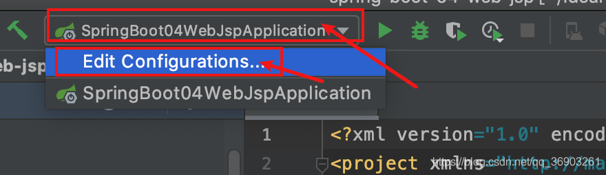


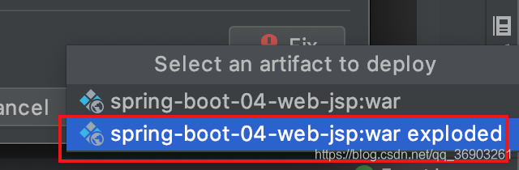

然后点击应用确定，完成创建服务器
在webapp目录下新建一个hello.jsp页面，启动服务器

浏览器输入：`http://localhost:8080/jsp/hello.jsp`访问hello页面

和SpringMVC结合起来使用

- 在hello.jsp中加入一个a标签`<a href="abc">abc</a>`
- 在WEB-INF下新建一个success.jsp

```html
<h1>success</h1>
<h3>${msg}</h3>
12
```

- main/java/com/angenin/springboot下新建controller/HelloController.java

```java
@Controller
public class HelloController {
    @GetMapping("/abc")
    public String hello(){
        model.addAttribute("msg", "你好");
        return "success";
    }
}
12345678
```

然后在application.properties配置文件中添加

```shell
#配置视图解析器
spring.mvc.view.prefix=/WEB-INF/
spring.mvc.view.suffix=.jsp
123
```

启动项目，从hello页面点击abc跳转到success页面


##### 原理：

jar包：执行SpringBoot主类的main方法，启动ioc容器，创建嵌入式的servlet容器。
war包：启动服务器，服务器启动SpringBoot应用（关键在于SpringBootServletInitializer），启动ioc容器。

###### 规则：

1. 服务器启动（web应用启动）会创建当前web应用里面每一个jar包里面ServletContainerInitializer实例。
2. ServletContainerInitializer的实现放在jar包的META-INF/services目录下，有一个名为javax.servlet.ServletContainerInitializer的文件，内容就是ServletContainerInitializer的实现类的全类名。
3. 还可以使用@HandlesTypes，在应用启动的时候加载我们感兴趣的类。

###### 规则：

1. 启动Tomcat

2. 找org/springframework/spring-web/5.2.6RELEASE.jar/META-INF/services/javax.servlet.ServletContainerInitializer文件
   此文件的内容：`org.springframework.web.SpringServletContainerInitializer`

3. SpringServletContainerInitializer将@HandlesTypes(WebApplicationInitializer.class)标注的所有这个类型的类都传入到onStartup方法的Set<Class<?>>里，为这些WebApplicationInitializer类型的类创建实例。

4. 每一个WebApplicationInitializer都调用自己的onStartup。

5. 相当于我们的SpringBootServletInitializer的类会被创建对象，并执行onStartup方法。
   

6. SpringBootServletInitializer实例在执行onStartup的时候会createRootApplicationContext创建容器。

   ```java
   	protected WebApplicationContext createRootApplicationContext(ServletContext servletContext) {
   		//1.创建SpringApplicationBuilder
   		SpringApplicationBuilder builder = createSpringApplicationBuilder();
   		builder.main(getClass());
   		ApplicationContext parent = getExistingRootWebApplicationContext(servletContext);
   		if (parent != null) {
   			this.logger.info("Root context already created (using as parent).");
   			servletContext.setAttribute(WebApplicationContext.ROOT_WEB_APPLICATION_CONTEXT_ATTRIBUTE, null);
   			builder.initializers(new ParentContextApplicationContextInitializer(parent));
   		}
   		builder.initializers(new ServletContextApplicationContextInitializer(servletContext));
   		builder.contextClass(AnnotationConfigServletWebServerApplicationContext.class);
   
   		//调用configure方法，子类重写了这个方法
   		builder = configure(builder);
   		//使用builder创建一个Spring应用
   		builder.listeners(new WebEnvironmentPropertySourceInitializer(servletContext));
   		SpringApplication application = builder.build();
   		if (application.getAllSources().isEmpty()
   				&& MergedAnnotations.from(getClass(), SearchStrategy.TYPE_HIERARCHY).isPresent(Configuration.class)) {
   			application.addPrimarySources(Collections.singleton(getClass()));
   		}
   		Assert.state(!application.getAllSources().isEmpty(),
   				"No SpringApplication sources have been defined. Either override the "
   						+ "configure method or add an @Configuration annotation");
   		// Ensure error pages are registered
   		if (this.registerErrorPageFilter) {
   			application.addPrimarySources(Collections.singleton(ErrorPageFilterConfiguration.class));
   		}
   		application.setRegisterShutdownHook(false);
   		
   		//启动Spring应用
   		return run(application);
   	}
   12345678910111213141516171819202122232425262728293031323334
   ```

7. Spring的应用就启动并且创建IOC容器。

   ```java
   	public ConfigurableApplicationContext run(String... args) {
   		StopWatch stopWatch = new StopWatch();
   		stopWatch.start();
   		ConfigurableApplicationContext context = null;
   		Collection<SpringBootExceptionReporter> exceptionReporters = new ArrayList<>();
   		configureHeadlessProperty();
   		SpringApplicationRunListeners listeners = getRunListeners(args);
   		listeners.starting();
   		try {
   			ApplicationArguments applicationArguments = new DefaultApplicationArguments(args);
   			ConfigurableEnvironment environment = prepareEnvironment(listeners, applicationArguments);
   			configureIgnoreBeanInfo(environment);
   			Banner printedBanner = printBanner(environment);
   			context = createApplicationContext();
   			exceptionReporters = getSpringFactoriesInstances(SpringBootExceptionReporter.class,
   					new Class[] { ConfigurableApplicationContext.class }, context);
   			prepareContext(context, environment, listeners, applicationArguments, printedBanner);
   			refreshContext(context);
   			afterRefresh(context, applicationArguments);
   			stopWatch.stop();
   			if (this.logStartupInfo) {
   				new StartupInfoLogger(this.mainApplicationClass).logStarted(getApplicationLog(), stopWatch);
   			}
   			listeners.started(context);
   			callRunners(context, applicationArguments);
   		}
   		catch (Throwable ex) {
   			handleRunFailure(context, ex, exceptionReporters, listeners);
   			throw new IllegalStateException(ex);
   		}
   
   		try {
   			listeners.running(context);
   		}
   		catch (Throwable ex) {
   			handleRunFailure(context, ex, exceptionReporters, null);
   			throw new IllegalStateException(ex);
   		}
   		return context;
   	}
   12345678910111213141516171819202122232425262728293031323334353637383940
   ```

启动servlet容器，在启动SpringBoot应用。

# 五、Docker

> Docker可以看我之前跟周阳老师视频学习时记的笔记：https://blog.csdn.net/qq_36903261/article/details/105870268（打开网站Crtl+F直接查询命令）

Docker官网：https://www.docker.com/
DockerHub官网：https://hub.docker.com/

这里需要先安装4个容器，为后续教学做准备：

1. 安装mysql
   dockerhub的mysql：https://hub.docker.com/_/mysql

   ```shell
   #拉取最新镜像（可以在mysql后面加上冒号加版本号指定下载（如：mysql:5.6  mysql:8.0.18））
   docker pull mysql
   
   #启动mysql
   #--name some-mysql：为启动的mysql容器起名（some-mysql）
   #-v /my/custom:/etc/mysql/conf.d：设置容器中目录和容器外目录进行共享连接（冒号前为linux路径，冒号后为容器路径，linux下的/my/custom目录和mysql容器的/etc/mysql/conf.d进行共享）
   #-p 3306:3306：容器对外暴露的端口（冒号前为对外暴露的端口号，冒号后为容器要暴露的端口号）
   #-e MYSQL_ROOT_PASSWORD=123456：设置root密码（123456）
   #-d：后台运行
   #mysql：运行mysql（如果不是最新版需要在mysql加上冒号和版本号）
   docker run --name myMysql -v /my/custom:/etc/mysql/conf.d -p 3306:3306 -e MYSQL_ROOT_PASSWORD=123456 -d mysql
   1234567891011
   ```

2. 安装redis（缓存数据库）
   dockerhub的redis：https://hub.docker.com/_/redis

   ```shell
   #拉取最新镜像
   docker pull redis
   
   #运行redis（redis-server启动路径可以会有偏差，具体参照dockerhub官网上关于redis的具体操作）
   docker run -p 6379:6379 --name myRedis -v /angenin/myredis/data:/data -v /angenin/myredis/conf:/usr/local/redis/conf -d redis:5.0.5 redis-server /usr/local/redis/conf/redis.conf --appendonly yes
   12345
   ```

3. 安装rabbitmq（消息中间件）
   dockerhub的rabbitmq：https://hub.docker.com/_/rabbitmq

   ```shell
   #拉取镜像（management是有带web的管理界面）
   docker pull rabbitmq:3.8.3-management
   12
   ```

4. 安装elasticsearch（全文检索）
   dockerhub的elasticsearch：https://hub.docker.com/_/elasticsearch

   ```shell
   #拉取最新镜像
   docker pull elasticsearch
   12
   ```

# 六、SpringBoot与数据访问


## 1. JDBC

新建项目

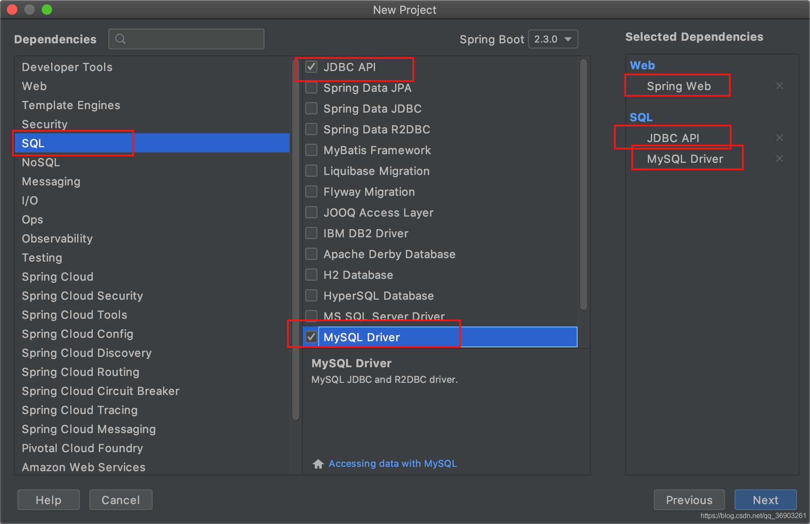

```xml
 <dependency>
     <groupId>org.springframework.boot</groupId>
     <artifactId>spring-boot-starter-jdbc</artifactId>
 </dependency>
 <dependency>
     <groupId>org.springframework.boot</groupId>
     <artifactId>spring-boot-starter-web</artifactId>
 </dependency>

 <dependency>
     <groupId>mysql</groupId>
     <artifactId>mysql-connector-java</artifactId>
     <scope>runtime</scope>
 </dependency>
1234567891011121314
```

启动linux中docker的mysql容器（我使用的是8.0.18版本）。
`docker run -p 3306:3306 --name myMysql -e MYSQL_ROOT_PASSWORD=123456 -d mysql:8.0.18`
使用Navicat Premium连接上mysql（使用其他数据库工具都可以）。


并创建一个名为jdbc的数据库。
在resources目录下新建application.yml文件，配置数据库信息

```yml
#url使用linux的ip地址
#如果数据库使用的是5.x版本的driver-class-name为com.mysql.jdbc.Driver
#?serverTimezone=GMT是设置时区，8以上版本不设置可能会报错，5版本的可以不加
spring:
  datasource:
    username: root
    password: 123456
    url: jdbc:mysql://10.211.55.17:3306/jdbc?serverTimezone=GMT
    driver-class-name: com.mysql.cj.jdbc.Driver
123456789
```

在test目录下的测试类SpringBoot06DataJdbcApplicationTests中测试：

```java
@SpringBootTest
class SpringBoot06DataJdbcApplicationTests {
    @Autowired
    DataSource dataSource;

    @Test
    void contextLoads()throws Exception {
    	//class com.zaxxer.hikari.HikariDataSource
        System.out.println(dataSource.getClass());
        Connection connection = dataSource.getConnection();
        //HikariProxyConnection@1905420854 wrapping com.mysql.cj.jdbc.ConnectionImpl@216e9ca3
        System.out.println(connection);
        connection.close();
    }
}
123456789101112131415
```

默认使用com.zaxxer.hikari.HikariDataSource数据源，数据源的相关配置都在DataSourceProperties里面。

#### 自动配置原理

org.springframework.boot.autoconfigure.jdbc：

1. 参考DataSourceConfiguration，根据配置创建数据源，默认使用hikari连接池，可以使用spring.datasource.type指定自定义的数据源类型。

2. SpringBoot默认支持：jdbc、hikari、dbcp2

3. 自定义数据源

   ```java
   	/**
    * Generic DataSource configuration.
    */
   @Configuration(proxyBeanMethods = false)
   @ConditionalOnMissingBean(DataSource.class)
   @ConditionalOnProperty(name = "spring.datasource.type")
   static class Generic {
   
   	@Bean
   	DataSource dataSource(DataSourceProperties properties) {
   		//使用DataSourceBuilder创建数据源，利用反射创建响应type的数据源，并且绑定相关属性
   		return properties.initializeDataSourceBuilder().build();
   	}
   
   }
   123456789101112131415
   ```

#### 使用sql文件自动建表

在resources目录下新建schema-all.sql文件

```sql
SET FOREIGN_KEY_CHECKS=0;

DROP TABLE IF EXISTS `department`;
CREATE TABLE `department` (
  `id` int(11) NOT NULL AUTO_INCREMENT,
  `departmentName` varchar(255) DEFAULT NULL,
  PRIMARY KEY (`id`)
) ENGINE=InnoDB AUTO_INCREMENT=1 DEFAULT CHARSET=utf8;

12345678910
```

在application.yml中加入`initialization-mode: always`（和username同级）始终初始化数据源。


然后运行SpringBoot项目后，数据库里多了张表

默认只识别schema.sql或schema-all.sql文件，如果想自定义sql文件名（department.sql），可以使用下面这种方法：
在application.yml文件中加入

```yml
	#schema接受集合，所以使用 - 代表一个集合元素，一个 - 代表一个元素
	schema:
		- classpath:department.sql
#		- classpath:xxx.sql
#		- ...
12345
```


#### 测试JdbcTemplate

操作数据库：SpringBoot自动配置了JdbcTemplate和增强版NamedParameterJdbcTemplate来操作数据库。

1. 在数据库表中插入一条数据
2. 在springboot目录下新建controller/Hellocontroller

```java
@Controller
public class HelloController {

    @Autowired
    JdbcTemplate jdbcTemplate;

    @ResponseBody
    @GetMapping("/query")
    public Map<String, Object> map() {
        List<Map<String, Object>> list = jdbcTemplate.queryForList("select * from department");
        return list.get(0);
    }
}
12345678910111213
```

*注意：每次启动项目时，SpringBoot都会自动建表（如果有sql文件的话，重新建表会覆盖原来的数据），所以如果配置文件中加了schema: - classpath:department.sql，需要注释掉（如果没加但是sql文件名是schema.sql或schema-all.sql，需要将文件改名或移除）*
启动项目，在浏览器中输入`http://localhost:8080/query`


## 2. Druid

pom.xml中导入druid的依赖

```xml
<dependency>
    <groupId>com.alibaba</groupId>
    <artifactId>druid</artifactId>
    <version>1.1.20</version>
</dependency>
12345
```

然后在application.yml中加入`type: com.alibaba.druid.pool.DruidDataSource`（和username同级别）

运行测试类，打印的结果为：class com.alibaba.druid.pool.DruidDataSource（切换成功）

在application.yml设置数据源的其他配置：

```yml
#url使用linux的ip地址
#如果数据库使用的是5.x版本的driver-class-name为com.mysql.jdbc.Driver
spring:
  datasource:
    #基本配置
    username: root
    password: 123456
    url: jdbc:mysql://10.211.55.17:3306/jdbc?serverTimezone=GMT
    driver-class-name: com.mysql.cj.jdbc.Driver
    initialization-mode: always
    type: com.alibaba.druid.pool.DruidDataSource
#    schema:
#      - classpath:department.sql

    #其他配置
    initialSize: 5
    minIdle: 5
    maxActive: 20
    maxWait: 60000
    timeBetweenEvictionRunsMillis: 60000
    minEvictableIdleTimeMillis: 300000
    validationQuery: SELECT 1 FROM DUAL
    testWhileIdle: true
    testOnBorrow: false
    testOnReturn: false
    poolPreparedStatements: true
    #   配置监控统计拦截的filters，去掉后监控界面sql无法统计，'wall'用于防火墙  
    filters: stat,wall,log4j2
    maxPoolPreparedStatementPerConnectionSize: 20
    useGlobalDataSourceStat: true
    connectionProperties: druid.stat.mergeSql=true;druid.stat.slowSqlMillis=500
12345678910111213141516171819202122232425262728293031
```

这里设置的其他配置是黄颜色的，这是因为上面的基本属性和DataSourceProperties类里的属性相对应，而其他配置DataSourceProperties类里没有相对应的属性，所以是不生效的。

debug测试类发现配置文件中设置的属性没生效


所以我们要自己写一个配置类进行配置，在springboot目录下新建config/DruidConfig

```java
@Configuration
public class DruidConfig {

    //自己创建一个数据源
    @ConfigurationProperties(prefix = "spring.datasource")  //引入配置
    @Bean   //添加到容器中
    public DataSource druid(){
        return new DruidDataSource();
    }
}
12345678910
```

重新debug测试类，设置的属性生效了


#### 配置druid的监控

在DruidConfig配置类里添加：

```java
    //配置druid的监控
    //1. 配置一个管理后台的servlet   ServletRegistrationBean为注册servlet
    @Bean
    public ServletRegistrationBean statViewServlet(){
        //第一个参数是StatViewServlet为管理后台的servlet，第二个参数为管理的路径
        ServletRegistrationBean bean = new ServletRegistrationBean(new StatViewServlet(), "/druid/*");

        Map<String, String> initParams = new HashMap<>();
        //登录后台时用的用户名
        initParams.put("loginUsername", "admin");
        //登录使用的密码
        initParams.put("loginPassword", "123456");
        //允许什么登录（访问）
        initParams.put("allow", "");    //默认允许使用
        //拒绝指定访问
        initParams.put("deny", "192.168.0.107");    //192.168.0.107是我电脑的ip
        //设置初始化参数
        bean.setInitParameters(initParams);
        return bean;


    }

    //2. 配置一个监控的filter  FilterRegistrationBean为注册filter
    @Bean
    public FilterRegistrationBean webStatFilter(){
        //WebStatFilter为监控的filter
        FilterRegistrationBean bean = new FilterRegistrationBean(new WebStatFilter());

        Map<String, String> initParams = new HashMap<>();
        //设置不拦截的资源
        initParams.put("exclusions", "*.js,*.css,/druid/*");
        //设置初始化参数
        bean.setInitParameters(initParams);
        //设置拦截请求
        bean.setUrlPatterns(Arrays.asList("/*"));
        return bean;
    }
1234567891011121314151617181920212223242526272829303132333435363738
```

如果启动项目，在浏览器输入`http://localhost:8080/druid`

输入我们刚才在servlet中设置的用户名和密码，进入后台：


## 3. MyBatis

新建项目


mybatis的依赖：

```xml
 <dependency>
     <groupId>org.mybatis.spring.boot</groupId>
     <artifactId>mybatis-spring-boot-starter</artifactId>
     <version>2.1.2</version>
 </dependency>
12345
```

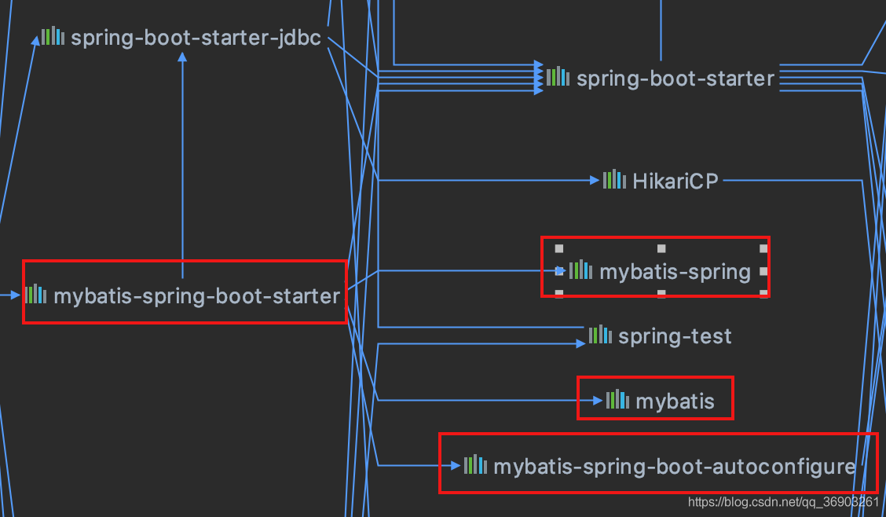

### 准备工作

1. 引入druid

   ```xml
   <dependency>
       <groupId>com.alibaba</groupId>
       <artifactId>druid</artifactId>
       <version>1.1.20</version>
   </dependency>
   12345
   ```

2. 新建一个名为mybatis的数据库
   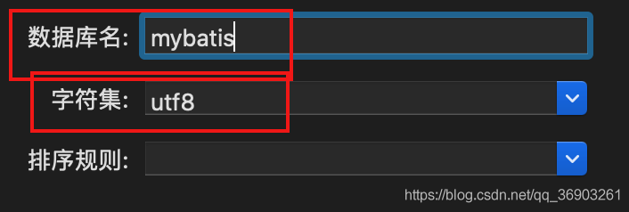

3. 在resources目录下新建application.yml文件

   ```java
   spring:
     datasource:
       #   数据源基本配置
       username: root
       password: 123456
       driver-class-name: com.mysql.cj.jdbc.Driver
       url: jdbc:mysql://10.211.55.17:3306/mybatis?serverTimezone=GMT
       type: com.alibaba.druid.pool.DruidDataSource
       #   数据源其他配置
       initialSize: 5
       minIdle: 5
       maxActive: 20
       maxWait: 60000
       timeBetweenEvictionRunsMillis: 60000
       minEvictableIdleTimeMillis: 300000
       validationQuery: SELECT 1 FROM DUAL
       testWhileIdle: true
       testOnBorrow: false
       testOnReturn: false
       poolPreparedStatements: true
       #   配置监控统计拦截的filters，去掉后监控界面sql无法统计，'wall'用于防火墙
       filters: stat,wall,log4j2
       maxPoolPreparedStatementPerConnectionSize: 20
       useGlobalDataSourceStat: true
       connectionProperties: druid.stat.mergeSql=true;druid.stat.slowSqlMillis=500
   12345678910111213141516171819202122232425
   ```

4. 在springboot目录下新建config/DruidConfig配置类

   ```java
   package com.angenin.springboot.config;
   
   import com.alibaba.druid.pool.DruidDataSource;
   import com.alibaba.druid.support.http.StatViewServlet;
   import com.alibaba.druid.support.http.WebStatFilter;
   import org.springframework.boot.context.properties.ConfigurationProperties;
   import org.springframework.boot.web.servlet.FilterRegistrationBean;
   import org.springframework.boot.web.servlet.ServletRegistrationBean;
   import org.springframework.context.annotation.Bean;
   import org.springframework.context.annotation.Configuration;
   
   import javax.sql.DataSource;
   import java.util.Arrays;
   import java.util.HashMap;
   import java.util.Map;
   
   @Configuration
   public class DruidConfig {
   
       @ConfigurationProperties(prefix = "spring.datasource")
       @Bean
       public DataSource druid(){
           return new DruidDataSource();
       }
   
       @Bean
       public ServletRegistrationBean statViewServlet(){
           ServletRegistrationBean bean = new ServletRegistrationBean(new StatViewServlet(), "/druid/*");
   
           Map<String, String> initParams = new HashMap<>();
           initParams.put("loginUsername", "admin");
           initParams.put("loginPassword", "123456");
           initParams.put("allow", ""); //默认允许使用
           initParams.put("deny", "192.168.0.107");
           bean.setInitParameters(initParams);
           return bean;
       }
   
       @Bean
       public FilterRegistrationBean webStatFilter(){
           FilterRegistrationBean bean = new FilterRegistrationBean(new WebStatFilter());
   
           Map<String, String> initParams = new HashMap<>();
           initParams.put("exclusions", "*.js,*.css,/druid/*");
           bean.setInitParameters(initParams);
           bean.setUrlPatterns(Arrays.asList("/*"));
           return bean;
       }
   }
   12345678910111213141516171819202122232425262728293031323334353637383940414243444546474849
   ```

5. 启动项目，在浏览器输入`http://localhost:8080/druid/`，测试登录
   

6. 停止项目，在resources目录下新建sql目录，并在里面创建department.sql和employee.sql文件

   department.sql

   ```sql
   SET FOREIGN_KEY_CHECKS=0;
   
   DROP TABLE IF EXISTS `department`;
   CREATE TABLE `department` (
     `id` int(11) NOT NULL AUTO_INCREMENT,
     `departmentName` varchar(255) DEFAULT NULL,
     PRIMARY KEY (`id`)
   ) ENGINE=InnoDB AUTO_INCREMENT=1 DEFAULT CHARSET=utf8;
   12345678
   ```

   employee.sql

   ```sql
   SET FOREIGN_KEY_CHECKS=0;
   
   DROP TABLE IF EXISTS `employee`;
   CREATE TABLE `employee` (
     `id` int(11) NOT NULL AUTO_INCREMENT,
     `lastName` varchar(255) DEFAULT NULL,
     `email` varchar(255) DEFAULT NULL,
     `gender` int(2) DEFAULT NULL,
     `d_id` int(11) DEFAULT NULL,
     PRIMARY KEY (`id`)
   ) ENGINE=InnoDB AUTO_INCREMENT=1 DEFAULT CHARSET=utf8;
   1234567891011
   ```

7. 在application.yml配置文件里添加

   ```yml
   #与connectionProperties同级
   initialization-mode: always
   schema:
     - classpath:sql/department.sql
     - classpath:sql/employee.sql
   12345
   ```

   

8. 重新启动项目，创建数据表
   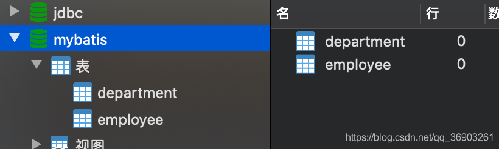

9. 停止项目，注释掉刚刚在application.yml添加的配置（不注释的话，每次启动项目都会运行指定文件在sql文件，覆盖原来的数据）
   

10. 创建两个数据表对应的bean，在建bean之前，推荐一下lombok（它可以让我们的bean变得看起来不臃肿，虽然它的功能不仅仅只有如此）

    引入相关的依赖

    ```xml
     <dependency>
        <groupId>org.projectlombok</groupId>
        <artifactId>lombok</artifactId>
        <version>1.18.10</version>
        <!--只在编译阶段生效-->
        <scope>provided</scope>
    </dependency>
    1234567
    ```

    添加IDE工具对Lombok的支持：

    安装Lombok插件：

    

    

11. 设置完后在springboot目录下新建bean包，在包下新建Employee和Department两个实体类

    Employee

    ```java
    @Data   //set/get方法
    @AllArgsConstructor //有参构造器
    @NoArgsConstructor  //无参构造器
    public class Employee {
    	private Integer id;
    	private String lastName;
    	private Integer gender;
    	private String email;
    	private Integer dId;
    }
    12345678910
    ```

    Department

    ```java
    @Data   //set/get方法
    @AllArgsConstructor //有参构造器
    @NoArgsConstructor  //无参构造器
    public class Department {
        private Integer id;
        private String departmentName;
    }
    1234567
    ```

    这里只用了lombok的一个注解，想使用

    的其他注解可以自行百度学习，当然，如果不喜欢lombok也可以创建set和get方法，这里只是安利一个好用的插件。

### 注解

1. 在springboot目录下新建mapper.DepartmentMapper接口（这里注解和xml都会使用，这里先用注解来实现，然后再用xml来实现）

   ```java
   @Mapper //指定这是一个操作数据库的mapper
   public interface DepartmentMapper {
   
       @Select("select * from department where id=#{id}")
       Department getDeptById(Integer id);
   
       @Delete("delete from department where id=#{id}")
       int deleteDeptById(Integer id);
   
       //插入后主键会重新封装进Department中
   	//useGeneratedKeys = true表示使用自动生成的主键，keyProperty = "id"代表department里的id属性是主键
   	@Options(useGeneratedKeys = true, keyProperty = "id")
       @Insert("insert into department(departmentName)values(#{departmentName})")
       int insertDept();
   
       @Update("update department set departmentName=#{departmentName} where id=#{id}")
       int updateDept(Department department);
   }
   123456789101112131415161718
   ```

2. 在springboot目录下新建controller/DeptController类

   ```java
   @Controller
   public class DeptController {
   
       @Autowired
       DepartmentMapper departmentMapper;
   
       @GetMapping("/dept/{id}")
       public Department getDepartment(@PathVariable("id") Integer id){
    	    //返回查询到的数据
           return departmentMapper.getDeptById(id);
       }
   
       @GetMapping("/dept")
       public Department insertDept(Department department){
           departmentMapper.insertDept(department);
           //返回我们插入的数据
           return department;
       }
   
   }
   1234567891011121314151617181920
   ```

3. 启动项目，在浏览器输入`http://localhost:8080/dept?departmentName=AA`插入一条数据，`http://localhost:8080/dept/1`然后查询。
   
   
   

4. 问题一：如果插入的时间表里属性名和对应的bean属性名不一致时

   1. 在写sql语句为数据表里的属性起别名。

   2. 这里我把departmentName改为department_name，查询结果：

      

      自定义Mybatis的配置规则，开启驼峰命名法映射规则，在config包里新建MyBatisConfig配置类

      ```java
      import org.apache.ibatis.session.Configuration;
      
      @org.springframework.context.annotation.Configuration
      public class MyBatisConfig {
      
          @Bean
          public ConfigurationCustomizer configurationCustomizer(){
              //setMapUnderscoreToCamelCase(true)开启驼峰命名法映射规则
              //Lambda表达式写法
              return (Configuration configuration) -> configuration.setMapUnderscoreToCamelCase(true);
      
              //普通写法
      //        return new ConfigurationCustomizer(){
      //            @Override
      //            public void customize(Configuration configuration) {
      //                configuration.setMapUnderscoreToCamelCase(true);
      //            }
      //        };
          }
      }	
      1234567891011121314151617181920
      ```

      重新查询的结果：

      

5. 问题二：如果有多有很多mapper，每个都加@Mapper注解太麻烦了，我们可以在MyBatisConfig配置类（或者SpringBoot06DataMybatisApplication主配置类）上加上@MapperScan(value = “com.angenin.springboot.mapper”)注解，把mapper包下的所有接口作为mapper，批量扫描所有的mapper接口。
   

### xml

1. 在springboot/mapper下新建EmployeeMapper

   ```java
   //已经在MyBatisConfig配置类里加了@MapperScan注解，所以不需要加@Mapper
   public interface EmployeeMapper {
   
       Employee getEmpById(Integer id);
   
       void insertEmp(Employee employee);
   
   }
   12345678
   ```

2. 在resources目录下新建mybatis目录，在里面新建mybatis-config.xml全局配置文件

   ```xml
   <?xml version="1.0" encoding="UTF-8"?>
   <!DOCTYPE configuration
           PUBLIC "-//mybatis.org//DTD Mapper 3.0//EN"
           "http://mybatis.org/dtd/mybatis-3-config.dtd">
   <configuration>
       <settings>
           <!--  开启驼峰命名法映射规则  -->
           <setting name="mapUnderscoreToCamelCase" value="true"/>
       </settings>
   </configuration>
   12345678910
   ```

3. 在resources/mybatis目录下mapper目录，在里面新建EmployeeMapper.xml文件

   ```xml
   <?xml version="1.0" encoding="UTF-8"?>
   <!DOCTYPE mapper
       PUBLIC "-//mybatis.org//DTD Mapper 3.0//EN"
       "http://mybatis.org/dtd/mybatis-3-mapper.dtd">
   <mapper namespace="com.angenin.springboot.mapper.EmployeeMapper">
   
       <select id="getEmpById" resultType="com.angenin.springboot.bean.Employee">
           select * from employee where id=#{id}
       </select>
   
       <insert id="insertEmp">
           insert into employee(lastName,email,gender,d_id)values(#{lastName},#{email},#{gender},#{dId})
       </insert>
   
   </mapper>
   123456789101112131415
   ```

4. 在application.yml中添加

   ```yml
   mybatis:
     config-location: classpath:mybatis/mybatis-config.xml
     mapper-locations: classpath:mybatis/mapper/*.xml
   123
   ```

5. 在DeptController中添加：

   ```java
   @Autowired
   EmployeeMapper employeeMapper;
   
   
   1234
   ```

6. 往employee数据表中添加数据：

   ```sql
   insert into employee(lastName,email,gender,d_id)values('zhangsan','zhangsan@qq.com',1,1);
   insert into employee(lastName,email,gender,d_id)values('lisi','lisi@qq.com',0,2);
   12
   ```

7. 启动项目，浏览器输入`http://localhost:8080/emp/1`
   

## 4. JPA

> JPA：基于ORM(Object Relational Mapping)思想，所以需要编写实体类（bean）和数据表进行映射，并且配置好映射关系。


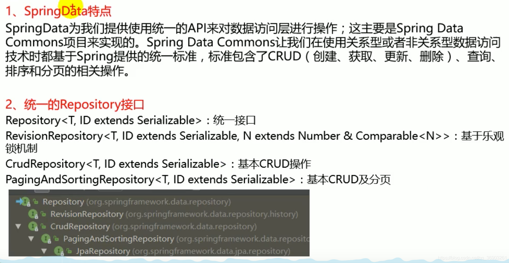


新建项目


1. 新建数据库
   

2. 在resources目录下新建application.yml，配置数据源

   ```yml
   spring:
     datasource:
       username: root
       password: 123456
       url: jdbc:mysql://10.211.55.17:3306/jpa?serverTimezone=GMT
       driver-class-name: com.mysql.cj.jdbc.Driver
   123456
   ```

3. 在springboot目录下entity/User实体类（这里不使用lombok，常用普通写法，和lombok做对比）

   ```java
   //使用JPA注解配置映射关系
   @Entity //告诉JPA这是一个实体类（和数据表映射的类）
   @Table(name = "tbl_user")   //指定和哪个数据表对应，如果省略name不写，默认是对应的数据表名是类名首字母小写即user
   public class User {
   
       @Id //这是一个主键
       @GeneratedValue(strategy = GenerationType.IDENTITY) //设置主键自增
       private Integer id;
   
       @Column(name = "last_name", length = 50) //设置和数据表对应的列名
       private String lastName;
   
       @Column //省略默认属性名就是列名
       private String email;
   
       public Integer getId() {
           return id;
       }
   
       public void setId(Integer id) {
           this.id = id;
       }
   
       public String getLastName() {
           return lastName;
       }
   
       public void setLastName(String lastName) {
           this.lastName = lastName;
       }
   
       public String getEmail() {
           return email;
       }
   
       public void setEmail(String email) {
           this.email = email;
       }
   }
   123456789101112131415161718192021222324252627282930313233343536373839
   ```

4. 在springboot下新建repository/UserRepository，来操作实体类对应的数据表（即dao层）

   ```java
   @Repository //继承JpaRepository即可操作数据库（第一个参数为要操作的类，第二个参数为主键的类型）
   public interface UserRepository extends JpaRepository<User, Integer> {
   }
   123
   ```

5. 对应的数据表可以自己创建，也可以配置后自动创建，在application.yml中添加配置，具体可查看JpaProperties（jpa与datasource同级别）

   ```yml
     jpa:
       hibernate:
         ddl-auto: update  #更新或创建数据表结构
       show-sql: true  #控制台显示sql
   1234
   ```

   

6. 启动项目后查看数据库
   

7. 对数据的增删查改，在springboot包里新建controller/UserController

   ```java
   @RestController
   public class UserController {
   
       @Autowired
       UserRepository userRepository;
   
   
       @GetMapping("/user/{id}")
       public User getUser(@PathVariable("id") Integer id){
           return userRepository.findById(id).get();
       }
   
       @GetMapping("/user")
       public User insertUser(User user){
           return userRepository.save(user);   //save方法返回的user对象有自增的主键
       }
   
   }
   123456789101112131415161718
   ```

8. 启动项目，浏览器输入`http://localhost:8080/user?lastName=zhangsan&email=zhangsan@qq.com`插入一条数据，然后输入`http://localhost:8080/user/2`（因为我先插了一条，忘截图了，所以这里id是2）
   
   

# 七、SpringBoot启动配置原理


## 启动流程

1. 创建SpringApplication对象

   ```java
   	public SpringApplication(ResourceLoader resourceLoader, Class<?>... primarySources) {
   		this.resourceLoader = resourceLoader;
   		//判断primarySources是否为空，如果为空就抛出异常throw new IllegalArgumentException(msg)，代码如果不捕捉处理这个异常，代码不往下执行，不为空代码继续向下执行。
   		Assert.notNull(primarySources, "PrimarySources must not be null");
   		//保存主配置类
   		this.primarySources = new LinkedHashSet<>(Arrays.asList(primarySources));
   		//保存当前应用的类型SERVLET（有三种类型：REACTIVE、SERVLET、NONE）
   		this.webApplicationType = WebApplicationType.deduceFromClasspath();
   		//从类路径下找到META-INF/spring.factories配置的所有ApplicationContextInitializer，然后保存起来（详情看下图）
   		setInitializers((Collection) getSpringFactoriesInstances(ApplicationContextInitializer.class));
   		//从类路径下找到META-INF/spring.factories配置的所有ApplicationListener，然后保存起来（详情看下图）
   		setListeners((Collection) getSpringFactoriesInstances(ApplicationListener.class));
   		//从多个配置类中找到有main方法的主配置类
   		this.mainApplicationClass = deduceMainApplicationClass();
   }
   123456789101112131415
   ```

   保存起来的META-INF/spring.factories配置的所有ApplicationContextInitializer，共7个。
   
   保存起来的META-INF/spring.factories配置的所有ApplicationListener，共11个。
   

2. 运行run方法

   ```java
   public ConfigurableApplicationContext run(String... args) {
   	StopWatch stopWatch = new StopWatch();
   	//开启停止监听
   	stopWatch.start();
   	//声明一个IOC容器
   	ConfigurableApplicationContext context = null;
   	Collection<SpringBootExceptionReporter> exceptionReporters = new ArrayList<>();
   	//与awt相关（图形界面）
   	configureHeadlessProperty();
   	//获取SpringApplicationRunListeners（点进去发现也是从类路径META-INF/spring.factories中获取（详情看下图））
   	SpringApplicationRunListeners listeners = getRunListeners(args);
   	//回调（运行）获取到的所有SpringApplicationRunListeners的starting()方法（因为只有一个，所以在里面只循环了一次）
   	listeners.starting();
   	try {
   		//封装命令行参数
   		ApplicationArguments applicationArguments = new DefaultApplicationArguments(args);
   		//准备环境
   		//	1. 创建并配置环境
   		//	2. 回调（运行）获取到的所有SpringApplicationRunListeners的environmentPrepared方法（表示环境准备完成）
   		ConfigurableEnvironment environment = prepareEnvironment(listeners, applicationArguments);
   		//得到系统属性spring.beaninfo.ignore，如果为空设置为true
   		configureIgnoreBeanInfo(environment);
   		//打印Banner图标（详情看下图）
   		Banner printedBanner = printBanner(environment);
   		//创建ApplicationContext（根据应用的类型创建IOC容器（当前为应用类型为servlet））
   		context = createApplicationContext();
   		exceptionReporters = getSpringFactoriesInstances(SpringBootExceptionReporter.class,
   				new Class[] { ConfigurableApplicationContext.class }, context);
   		//准备上下文环境
   		//	1. 将environment保存到ioc容器中
   		//	2. applyInitializers(context)：回调（运行）之前获取到的所有ApplicationContextInitializer的initialize方法
   		//	3. listeners.contextPrepared(context)：回调（运行）之前获取到的所有ApplicationListener的contextPrepared方法
   		//	...
   		//	4. 最后listeners.contextLoaded(context)：回调（运行）之前获取到的所有ApplicationListener的contextLoaded方法
   		prepareContext(context, environment, listeners, applicationArguments, printedBanner);
   		//刷新容器（IOC容器初始化完成，此时所有的组件bean都创建了）
   		//扫描、创建、加载所有组件的地方（）
   		refreshContext(context);
   		//点进去发现是个空方法
   		afterRefresh(context, applicationArguments);
   		stopWatch.stop();
   		if (this.logStartupInfo) {
   			new StartupInfoLogger(this.mainApplicationClass).logStarted(getApplicationLog(), stopWatch);
   		}
   		//回调（运行）之前获取到的所有ApplicationListener的started方法
   		listeners.started(context);
   		callRunners(context, applicationArguments);
   	}
   	catch (Throwable ex) {
   		handleRunFailure(context, ex, exceptionReporters, listeners);
   		throw new IllegalStateException(ex);
   	}
   
   	try {
   		listeners.running(context);
   	}
   	catch (Throwable ex) {
   		handleRunFailure(context, ex, exceptionReporters, null);
   		throw new IllegalStateException(ex);
   	}
   	//整个springboot应用启动完成以后返回启动的IOC容器
   	return context;
   }
   123456789101112131415161718192021222324252627282930313233343536373839404142434445464748495051525354555657585960616263
   ```

   从类路径META-INF/spring.factories中获取的SpringApplicationRunListeners
   
   

## 事件监听机制

几个主要的事件回调机制：

配置在META-INF/spring.factories中

- ApplicationContextInitializer
- SpringApplicationRunListener

只需要放在IOC容器中

- ApplicationRunner
- CommandLineRunner

创建实现了上面4个接口的类
ApplicationContextInitializer

```java
package com.angenin.springboot07.listener;

import org.springframework.context.ApplicationContextInitializer;
import org.springframework.context.ConfigurableApplicationContext;

//泛型是监听的对象（ConfigurableApplicationContext是IOC容器对象）
public class HelloApplicationContextInitializer implements ApplicationContextInitializer<ConfigurableApplicationContext> {
    @Override
    public void initialize(ConfigurableApplicationContext configurableApplicationContext) {
        System.out.println("HelloApplicationContextInitializer...initialize..." + configurableApplicationContext);
    }
}
123456789101112
```

SpringApplicationRunListener

```java
package com.angenin.springboot07.listener;

import org.springframework.boot.SpringApplicationRunListener;
import org.springframework.context.ConfigurableApplicationContext;
import org.springframework.core.env.ConfigurableEnvironment;

public class HelloSpringApplicationRunListener implements SpringApplicationRunListener {


    //需要配置有参构造器，不然会报错
    public HelloSpringApplicationRunListener(SpringApplication application, String[] args) {
        
    }

    @Override
    public void starting() {
        System.out.println("SpringApplicationRunListener...starting...监听容器的开始");
    }

    @Override
    public void environmentPrepared(ConfigurableEnvironment environment) {
        //environment为环境信息
        //获取系统的属性，os.name是系统的名字
        Object o = environment.getSystemEnvironment().get("os.name");
        System.out.println("SpringApplicationRunListener...environmentPrepared...环境准备好了 " + o);
    }

    @Override
    public void contextPrepared(ConfigurableApplicationContext context) {
        //context为IOC容器
        System.out.println("SpringApplicationRunListener...contextPrepared...IOC容器准备好了");
    }

    @Override
    public void contextLoaded(ConfigurableApplicationContext context) {
        System.out.println("SpringApplicationRunListener...contextLoaded...服务器环境加载完成");
    }

    @Override
    public void started(ConfigurableApplicationContext context) {
        System.out.println("SpringApplicationRunListener...started...");
    }

    @Override
    public void running(ConfigurableApplicationContext context) {
        System.out.println("SpringApplicationRunListener...running...");
    }

    @Override
    public void failed(ConfigurableApplicationContext context, Throwable exception) {
        System.out.println("SpringApplicationRunListener...failed...");
    }
}
1234567891011121314151617181920212223242526272829303132333435363738394041424344454647484950515253
```

ApplicationRunner

```java
package com.angenin.springboot07.listener;

import org.springframework.boot.ApplicationArguments;
import org.springframework.boot.ApplicationRunner;

@Component
public class HelloApplicationRunner implements ApplicationRunner {
    @Override
    public void run(ApplicationArguments args) throws Exception {
        System.out.println("ApplicationRunner...run...");
    }
}
123456789101112
```

CommandLineRunner

```java
package com.angenin.springboot07.listener;

import org.springframework.boot.CommandLineRunner;

import java.util.Arrays;

@Component
public class HelloCommandLineRunner implements CommandLineRunner {
    @Override
    public void run(String... args) throws Exception {
        System.out.println("CommandLineRunner...run..." + Arrays.asList(args));
    }
}
12345678910111213
```

ApplicationRunner和CommandLineRunner只需要加上@Component添加到容器中即可使用。
ApplicationContextInitializer和SpringApplicationRunListener需要在resources目录下新建META-INF目录，并在里面新建一个名为spring.factories的文件。

```xml
org.springframework.context.ApplicationContextInitializer=\
com.angenin.springboot07.listener.HelloApplicationContextInitializer

org.springframework.boot.SpringApplicationRunListener=\
com.angenin.springboot07.listener.HelloSpringApplicationRunListener
12345
```

启动后控制台输出的信息

```
SpringApplicationRunListener...starting...监听容器的开始
SpringApplicationRunListener...environmentPrepared...环境准备好了 null

  .   ____          _            __ _ _
 /\\ / ___'_ __ _ _(_)_ __  __ _ \ \ \ \
( ( )\___ | '_ | '_| | '_ \/ _` | \ \ \ \
 \\/  ___)| |_)| | | | | || (_| |  ) ) ) )
  '  |____| .__|_| |_|_| |_\__, | / / / /
 =========|_|==============|___/=/_/_/_/
 :: Spring Boot ::        (v2.3.0.RELEASE)

HelloApplicationContextInitializer...initialize...org.springframework.boot.web.servlet.context.AnnotationConfigServletWebServerApplicationContext@23f7d05d, started on Thu Jan 01 08:00:00 CST 1970
SpringApplicationRunListener...contextPrepared...IOC容器准备好了
2020-05-24 21:53:25.458  INFO 41926 --- [           main] c.a.s.SpringBoot07Application            : Starting SpringBoot07Application on prodeMacBook-Pro.local with PID 41926 (/Users/pro/IdeaProjects/spring-boot-07/target/classes started by pro in /Users/pro/IdeaProjects/spring-boot-07)
2020-05-24 21:53:25.465  INFO 41926 --- [           main] c.a.s.SpringBoot07Application            : No active profile set, falling back to default profiles: default
SpringApplicationRunListener...contextLoaded...服务器环境加载完成
2020-05-24 21:53:27.954  INFO 41926 --- [           main] o.s.b.w.embedded.tomcat.TomcatWebServer  : Tomcat initialized with port(s): 8080 (http)
2020-05-24 21:53:27.972  INFO 41926 --- [           main] o.apache.catalina.core.StandardService   : Starting service [Tomcat]
2020-05-24 21:53:27.973  INFO 41926 --- [           main] org.apache.catalina.core.StandardEngine  : Starting Servlet engine: [Apache Tomcat/9.0.35]
2020-05-24 21:53:28.099  INFO 41926 --- [           main] o.a.c.c.C.[Tomcat].[localhost].[/]       : Initializing Spring embedded WebApplicationContext
2020-05-24 21:53:28.099  INFO 41926 --- [           main] o.s.web.context.ContextLoader            : Root WebApplicationContext: initialization completed in 2548 ms
2020-05-24 21:53:28.467  INFO 41926 --- [           main] o.s.s.concurrent.ThreadPoolTaskExecutor  : Initializing ExecutorService 'applicationTaskExecutor'
2020-05-24 21:53:28.782  INFO 41926 --- [           main] o.s.b.w.embedded.tomcat.TomcatWebServer  : Tomcat started on port(s): 8080 (http) with context path ''
2020-05-24 21:53:28.794  INFO 41926 --- [           main] c.a.s.SpringBoot07Application            : Started SpringBoot07Application in 3.978 seconds (JVM running for 5.535)
SpringApplicationRunListener...started...
ApplicationRunner...run...
CommandLineRunner...run...[]
SpringApplicationRunListener...running...
12345678910111213141516171819202122232425262728
```

*如果需要在项目特定位置运行相应的代码，可以使用上面的实现类来完成。*

# 八、SpringBoot自定义starters

starter：场景启动器

1. 这个场景需要使用到什么依赖？

2. 如何编写自动配置

   ```java
   @Configuration	//指定这个类是配置类
   @ConditionalOnXXX	//在指定条件成立的情况下自动配置类生效
   @AutoConfigureAfter	//指定自动配置类的顺序
   @Bean	//给容器中添加组件
   
   @ConfigurationPropertie	//结合相关xxxProperties类来绑定相关的配置
   @EnableConfigurationProperties	//让xxxProperties加入到容器中生效
   
   //让自动配置类能加载：需要将需要启动就加载的自动配置类，配置到META-INF/spring.factories。
   //例如：
   //org.springframework.context.ApplicationContextInitializer=\
   //org.springframework.boot.autoconfigure.SharedMetadataReaderFactoryContextInitializer,\
   //org.springframework.boot.autoconfigure.logging.ConditionEvaluationReportLoggingListener
   12345678910111213
   ```

3. 模式：
   
   启动器只用来做依赖导入，专门写一个自动配置模块，然后启动器依赖自动配置模块，而别人只需要引入启动器（starter），自动配置也会被引入。
   官方命名为：spring-boot-starter-模块名
   我们自定义命名：模块名-spring-boot-starter

#### 创建自定义驱动器


添加模块：

选择Maven


在创建一个模块，选择Spring Initializr


不引入模块


Maven创建的用来做启动器，Spring Initializr创建的用来做自动配置。
复制自定义的自动配置模块的坐标

在启动器的pom.xml中引入

删除自动配置模块的主程序和主配置。

删除自动配置pom.xml中的test依赖，和插件（spring-boot-starter是所有starter的基本配置，所以需要留着）
并且把根目录下的test目录也删掉

写业务

HelloProperties

```java
package com.angenin.starter;

import org.springframework.boot.context.properties.ConfigurationProperties;

@ConfigurationProperties(prefix = "angenin.hello")
public class HelloProperties {

    //前缀
    private String prefix;
    //后缀
    private String suffix;

    public String getPrefix() {
        return prefix;
    }

    public void setPrefix(String prefix) {
        this.prefix = prefix;
    }

    public String getSuffix() {
        return suffix;
    }

    public void setSuffix(String suffix) {
        this.suffix = suffix;
    }
}
12345678910111213141516171819202122232425262728
```

HelloService

```java
package com.angenin.starter;

public class HelloService {

    HelloProperties helloProperties;

    public HelloProperties getHelloProperties() {
        return helloProperties;
    }

    public void setHelloProperties(HelloProperties helloProperties) {
        this.helloProperties = helloProperties;
    }

    public String sayHello(String name){
        return helloProperties.getPrefix() + name + helloProperties.getSuffix();
    }

}
12345678910111213141516171819
```

HelloServiceAutoConfiguration

```java
package com.angenin.starter;

public class HelloService {

    HelloProperties helloProperties;

    public HelloProperties getHelloProperties() {
        return helloProperties;
    }

    public void setHelloProperties(HelloProperties helloProperties) {
        this.helloProperties = helloProperties;
    }

    public String sayHello(String name){
        return helloProperties.getPrefix() + name + helloProperties.getSuffix();
    }

}
12345678910111213141516171819
```

而要让这个自动配置类能生效，需要在resources目录下新建META-INF目录，在里面新建一个名为spring.factories的文件。

```xml
org.springframework.boot.autoconfigure.EnableAutoConfiguration=\
com.angenin.starter.HelloServiceAutoConfiguration
12
```

把设置好的自动配置模块安装到maven仓库中
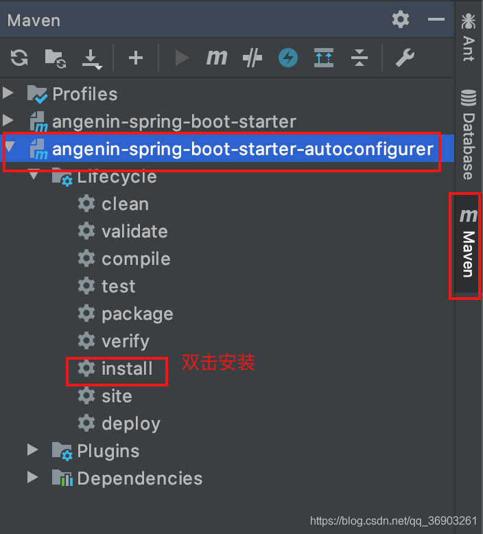
然后再把启动器也安装到maven仓库中

新建项目，用于测试自定义的starter


复制自定义starter的坐标

在新建的项目里引入


在新建的项目springboot目录下新建controller/Hellocontroller，自动注入自定义的starter中的HelloService

```java
@RestController
public class Hellocontroller {

    @Autowired
    HelloService helloService;

    @GetMapping("/hello")
    public String hello(){
        return helloService.sayHello("haha");
    }

}
123456789101112
```

自动配置HelloProperties的前后缀可以在application.properties配置文件设置

```shell
angenin.hello.prefix=ANGENIN
angenin.hello.suffix=HELLOWORLD
12
```

启动项目，在浏览器中输入`http://localhost:8080/hello`


# 九、SpringBoot与缓存

## 1. JSR-107


用得少，主要用的是Spring缓存抽象和缓存中间件（如redis）。

## 2. Spring缓存抽象


### 搭建基本环境

1. 新建项目
   
   

2. 新建数据库
   

3. 新建数据表

   ```sql
   SET FOREIGN_KEY_CHECKS=0;
   
   DROP TABLE IF EXISTS `department`;
   CREATE TABLE `department` (
     `id` int(11) NOT NULL AUTO_INCREMENT,
     `departmentName` varchar(255) DEFAULT NULL,
     PRIMARY KEY (`id`)
   ) ENGINE=InnoDB DEFAULT CHARSET=utf8;
   
   DROP TABLE IF EXISTS `employee`;
   CREATE TABLE `employee` (
     `id` int(11) NOT NULL AUTO_INCREMENT,
     `lastName` varchar(255) DEFAULT NULL,
     `email` varchar(255) DEFAULT NULL,
     `gender` int(2) DEFAULT NULL,
     `d_id` int(11) DEFAULT NULL,
     PRIMARY KEY (`id`)
   ) ENGINE=InnoDB DEFAULT CHARSET=utf8;
   
   INSERT INTO employee(lastName,email,gender,d_id)VALUES('zhangsan','zhangsan@qq.com',1,1);
   INSERT INTO employee(lastName,email,gender,d_id)VALUES('lisi','lisi@qq.com',0,2);
   123456789101112131415161718192021
   ```

   

4. 创建JavaBean，在com/angenin/cache下新建一个bean包，然后新建和数据表对应的两个bean

   Department

   ```java
   package com.angenin.cache.bean;
   
   public class Department {
   	
   	private Integer id;
   	private String departmentName;
   	
   	
   	public Department() {
   		super();
   		// TODO Auto-generated constructor stub
   	}
   	public Department(Integer id, String departmentName) {
   		super();
   		this.id = id;
   		this.departmentName = departmentName;
   	}
   	public Integer getId() {
   		return id;
   	}
   	public void setId(Integer id) {
   		this.id = id;
   	}
   	public String getDepartmentName() {
   		return departmentName;
   	}
   	public void setDepartmentName(String departmentName) {
   		this.departmentName = departmentName;
   	}
   	@Override
   	public String toString() {
   		return "Department [id=" + id + ", departmentName=" + departmentName + "]";
   	}
   }
   12345678910111213141516171819202122232425262728293031323334
   ```

   Employee

   ```java
   package com.angenin.cache.bean;
   
   public class Employee {
   	
   	private Integer id;
   	private String lastName;
   	private String email;
   	private Integer gender; //性别 1男  0女
   	private Integer dId;
   	
   	
   	public Employee() {
   		super();
   	}
   
   	
   	public Employee(Integer id, String lastName, String email, Integer gender, Integer dId) {
   		super();
   		this.id = id;
   		this.lastName = lastName;
   		this.email = email;
   		this.gender = gender;
   		this.dId = dId;
   	}
   	
   	public Integer getId() {
   		return id;
   	}
   	public void setId(Integer id) {
   		this.id = id;
   	}
   	public String getLastName() {
   		return lastName;
   	}
   	public void setLastName(String lastName) {
   		this.lastName = lastName;
   	}
   	public String getEmail() {
   		return email;
   	}
   	public void setEmail(String email) {
   		this.email = email;
   	}
   	public Integer getGender() {
   		return gender;
   	}
   	public void setGender(Integer gender) {
   		this.gender = gender;
   	}
   	public Integer getdId() {
   		return dId;
   	}
   	public void setdId(Integer dId) {
   		this.dId = dId;
   	}
   	@Override
   	public String toString() {
   		return "Employee [id=" + id + ", lastName=" + lastName + ", email=" + email + ", gender=" + gender + ", dId="
   				+ dId + "]";
   	}
   }
   12345678910111213141516171819202122232425262728293031323334353637383940414243444546474849505152535455565758596061
   ```

5. 整合Mybatis操作数据库，配置数据源信息，在resources/application.properties中添加：

   ```shell
   spring.datasource.url=jdbc:mysql://localhost:3306/spring_cache?serverTimezone=GMT
   spring.datasource.username=root
   spring.datasource.password=123456
   #Driver可不写，会根据连接自动添加
   #spring.datasource.driver-class-name=com.mysql.cj.jdbc.Driver
   
   #开启驼峰命名规则
   mybatis.configuration.map-underscore-to-camel-case=true
   12345678
   ```

6. 在cache包下新建一个mapper包，用于存放mapper接口，并写上对应mapper接口。

   EmployeeMapper

   ```java
   public interface EmployeeMapper {
   
       @Select("SELECT * FROM employee WHERE id=#{id}")
       Employee getEmpById(Integer id);
   
       @Insert("INSERT INTO employee(lastName,email,gender,d_id)VALUES(#{lastName},#{email},#{gender},#{dId})")
       void insertEmployee(Employee employee);
   
       @Update("UPDATE employee SET lastName=#{lastName},email=#{email},gender=#{gender},d_id=#{dId} WHERE id=#{id}")
       void updateEmp(Employee employee);
   
       @Delete("DELETE FROM employee WHERE id=#{id}")
       void deleteEmpById(Integer id);
   
   }
   123456789101112131415
   ```

7. 在Springboot01CacheApplication主配置类上加上`@MapperScan("com.angenin.cache.mapper")`

8. 在test目录下的Springboot01CacheApplicationTests测试类中测试

   ```java
   @SpringBootTest
   class Springboot01CacheApplicationTests {
   
       @Autowired
       EmployeeMapper employeeMapper;
   
       @Test
       void contextLoads() {
           Employee employee = employeeMapper.getEmpById(1);
           System.out.println(employee);
       }
   
   }
   12345678910111213
   ```

9. 在cache包下新建service/EmployeeService

   ```java
   @Service
   public class EmployeeService {
   
       @Autowired
       EmployeeMapper employeeMapper;
   
       public Employee getEmp(Integer id){
           System.out.println("查询" + id + "号员工");
           Employee emp = employeeMapper.getEmpById(id);
           return emp;
       }
   
   }
   12345678910111213
   ```

10. 在cache包下新建controller/EmployeeController

    ```java
    @RestController
    public class EmployeeController {
    
        @Autowired
        EmployeeService employeeService;
    
        @GetMapping("/emp/{id}")
        public Employee getEmployee(@PathVariable("id") Integer id){
            Employee emp = employeeService.getEmp(id);
            return emp;
        }
    
    }
    12345678910111213
    ```

11. 启动项目，在浏览器输入`http://localhost:8080/emp/2`
    

### 使用缓存

##### 基本步骤：


1. 开启基于注解的缓存（@EnableCaching）
2. 标注缓存注解（@Cacheable、@CachePut、@CacheEvict）

##### @EnableCaching（开启基于注解的缓存）

在主配置类上加上@EnableCaching，开启基于注解的缓存。

##### 缓存注解

CacheManager管理多个Cache组件，对缓存的真正CRUD操作在Cache组件中，每个缓存组件都有自己唯一的名字。

###### @Cacheable

属性

1. cacheNames/value：指定缓存组件的名字，将方法的返回结果放到哪个缓存中是数组的方式，可以指定多个缓存。

2. key：缓存数据使用的key，可以用它来指定key，默认使用方法参数的值（如传过来一个1，那么1为key，value为返回值），可以编写SpEL（如参数id的值可以用#id，#a0，#p0，#root.args[0]来取出）。
   

3. keyGenerator：key的生成器，可以自己指定key的生成器的组件id（自己注册的返回KeyGenerator的组件）。（key和keyGenerator二选一）

   ```java
   import org.springframework.cache.interceptor.KeyGenerator;
   
   //自定义key的生成器
   @Configuration
   public class MyCacheConfig {
       
       @Bean("myKeyGenerator")
       public KeyGenerator keyGenerator(){
           return new KeyGenerator() {
               @Override
               public Object generate(Object o, Method method, Object... objects) {
                   return method.getName() + "[" + Arrays.asList(objects).toString() + "]";
               }
           };
       }
   }
   12345678910111213141516
   ```

4. cacheManager：指定缓存管理器

5. cacheResolver：指定获取解析器（与cacheManager二选一，作用相同）

6. condition：指定符合条件的情况下才缓存。（例：condition = “#a0>1”（当第一个参数大于1才进行缓存））

7. unless：除非（否定缓存），当unless指定的条件为true，方法的返回值就不会被缓存，可以对获取到的结果进行判断（例1：#a0==2（当第一个参数为2时不缓存））（例2：unless = “#result == null”（#result为获取的结果，对获取的结果进行非空判断，如果为空，就不缓存））。（condition与unless相反，一个满足就缓存，一个满足不缓存）

8. sync：是否使用异步模式，默认为false。（开启后(1)不支持unless了，(2)只能指定一个缓存，(3)不能合并其他与缓存相关的操作）

- 在application.properties中添加
  `logging.level.com.angenin.cache.mapper=debug`开启日志。
- 然后运行项目，多次在浏览器中输入`http://localhost:8080/emp/2`查询相同用户，从控制台输入的日志可以看出每次都对数据库进行查询。
  
- 在Springboot01CacheApplication主配置类上加上`@EnableCaching`开启基于注解的缓存。
- 在EmployeeService的getEmp方法上添加`@Cacheable(value = "emp")`，将方法的运行结果进行缓存，以后再要相同的数据，直接从缓存中获取，不用调用方法。
- 重新运行项目，多次在浏览器中输入`http://localhost:8080/emp/2`查询相同用户，控制台只在第一次查询时查询了数据库，并且之后的查询连EmployeeService的getEmp方法都没进入，数据直接从缓存中获取。
  

###### @CachePut（既调用方法，又更新缓存）

- @CachePut与@Cacheable的区别
  `@Cacheable`是先到缓存里查找有没有要查的数据，如果有就直接用缓存里的数据，不调用方法操作数据库，如果没有再调用方法操作数据库并把返回的数据保存到缓存里。（前置处理）（用于查询）
  `@CachePut`是每次都先调用方法进行数据库操作，并把返回的数据保存到缓存里，如果缓存里已经有了就覆盖原来的数据。（后置处理）（用于修改）
- 运行时机：先调用目标方法，再将目标方法的返回结果保存到缓存中。（属性比@Cacheable少了一个sync，其他相同）
- 应用场景：修改了数据库的某个数据，同时更新缓存。

例：
在EmployeeMapper中添加

```java
@CachePut(value = "emp")
   public Employee updateEmp(Employee employee){
   	System.out.println("updateEmp：" + employee);
       employeeMapper.updateEmp(employee);
       return employee;
  }
123456
```

在EmployeeController中添加

```java
  @GetMapping("/emp")
   public Employee update(Employee employee){
       Employee emp = employeeService.updateEmp(employee);
       return emp;
   }
12345
```

- 启动项目，浏览器中输入`http://localhost:8080/emp/1`查询1号员工，让1号员工数据放到缓存中。（此时放入缓存的数据：key为1，value为1号员工数据）
  
- 在浏览器中输入`http://localhost:8080/emp?id=1&lastName=zhangsan&email=zhangsan@163.com`，修改1号员工信息。（此时放入缓存的数据：key为传入的employee对象，value为更新后1号员工数据）
  
- 输入`http://localhost:8080/emp/1`再次查询1号员工信息，结果是没更新的1号员工数据。
  
- 所以需要在@CachePut中添加`key = "#employee.id"`，指定更新后的保存到缓存的key与查询的相同。
- 先修改数据库中1号员工的数据。
  
- 重复刚刚的步骤，先查询、插入再查询，结果为更新后的员工信息。
  

###### @CacheEvict（缓存清除）

（用于删除）（后置处理，可用beforeInvocation属性改为前置）
属性比@Cacheable少了sync，多了allEntries和beforeInvocation。

- allEntries：清空value指定缓存的数据，默认为false。

- beforeInvocation：缓存清除是否在目标方法之前执行，默认为false。（如果改为之前执行，那么是先删除，然后再执行目标方法，就算目标方法出现异常，数据也删除了，而默认是后置，如果目标方法出现异常，则数据没删除）

  例：
  在EmployeeMapper中添加

  ```java
  @CacheEvict(value = "emp", key = "#id")
  public void deleteEmp(Integer id){
      System.out.println("deleteEmp：" + id);
      //数据库只有两个数据，这里就不删除了，只清理缓存中的数据
      //employeeMapper.deleteEmpById(id);
  }
  123456
  ```

  在EmployeeController中添加

  ```java
  @GetMapping("/delemp")
  public String deleteEmp(Integer id){
      employeeService.deleteEmp(id);
      return "success";
  }
  12345
  ```

- 启动项目，在浏览器中输入`http://localhost:8080/emp/1`查询1号员工，把数据放到缓存中。
  

- 输入`http://localhost:8080/delemp?id=1`删除1号员工。（因为没真正调用删除，所以只是删除缓存）
  

- 再次输入`http://localhost:8080/emp/1`查询1号员工，重新进行数据库查询，删除缓存数据成功。
  

###### @Caching（三合一）

@Caching是@Cacheable、@CachePut和@CacheEvict的组合，用于多个复杂的规则。

例：
在EmployeeMapper中添加：

```java
    @Select("SELECT * FROM employee WHERE lastName=#{lastName}")
    Employee getEmpByLastName(String lastName);
12
```

在EmployeeService中添加：

```java
    @Caching(
            cacheable = {   //cacheable为@Cacheable的数组
                @Cacheable(value = "emp", key = "#lastName")    //把传入的lastName作为key，value为返回结果放入缓存中
            },
            put = { //是@CachePut的数组
            	//加了@CachePut之后，每次都会执行目标方法
                @CachePut(value = "emp", key = "#result.id"), //把返回结果的id作为key，value为返回结果放入缓存中
                @CachePut(value = "emp", key = "#result.email") //以邮箱为key，放入缓存中
            }
            //evict为@CacheEvict的数组
    )
    public Employee getEmpByLastName(String lastName){
        Employee employee = employeeMapper.getEmpByLastName(lastName);
        return employee;
    }
123456789101112131415
```

在EmployeeController中添加：

```java
    @GetMapping("/emp/lastName/{lastName}")
    public Employee getEmpByLastName(@PathVariable("lastName") String lastName){
        return employeeService.getEmpByLastName(lastName);
    }
1234
```

启动项目，在浏览器输入`http://localhost:8080/emp/lastName/zhangsan`，按照用户名查询。


##### @CacheConfig（缓存配置注解）

可以在EmployeeService类上加上@CacheConfig注解，在@CacheConfig里写上`cacheNames = "emp"`属性，那么这个缓存配置类里的缓存注解都可以不加`value = "emp"`。
即：在@CacheConfig中添加的属性，在这个配置类的所有缓存注解都有@CacheConfig里的属性。

#### 缓存的原理

缓存的自动配置类：CacheAutoConfiguration
缓存的配置类（优先级是按照从上到下顺序，上面的优先级高于下面的）：


##### 默认生效的缓存配置类

在application.properties加上

```shell
#开启自动配置报告（项目启动的时候就会打印配置报告）
debug=true
12
```

- Positive matches里只有SimpleCacheConfiguration，说明只有SimpleCacheConfiguration生效（默认生效的缓存配置类）。
  - SimpleCacheConfiguration：给容器中注册了一个ConcurrentMapCacheManager（缓存管理器）组件。
    - ConcurrentMapCacheManager：可以获取和创建ConcurrentMapCache类型的缓存组件。
      - ConcurrentMapCache：将数据保存在ConcurrentMap中。

##### @Cacheable的运行流程

1. 方法运行前，先去查询Cache（缓存组件），按照cacheNames指定的名字获取（CacheManager先获取相应的缓存），第一个获取缓存如果没有Cache组件就会自动创建，然后把创建的Cache对象放到cacheMap保存。

2. 获取到Cache后，去Cache中查找缓存的内容，使用一个key，默认是方法的参数值。key是按照某种策略生成的，默认使用keyGenerator（SimpleKeyGenerator）生成。

   SimpleKeyGenerator生成key的默认策略

   - 如果没参数：key = new SimpleKey()
   - 如果一个有参数：key = 参数的值
   - 如果有多个参数：key = new SimpleKey(params)

3. 如果没查到缓存，就调用目标方法。

4. 将目标方法返回的结果放到缓存里。

总结：@Cacheable标注的方法执行之前先检查缓存中有没有这个数据，默认按照参数值作为key去查询缓存，如果没有就运行方法并将结果放入缓存，之后再调用就可以直接使用缓存中的数据。

核心：

- 使用CacheManager（ConcurrentMapCacheManager）按照名字得到Cache（ConcurrentMapCache）组件
- key使用keyGenerator（SimpleKeyGenerator）生成的

## 3. 整合Redis

springboot默认使用的是ConcurrentMapCacheManager==>ConcurrentMapCache，将数据保存到ConcurrentMap<String, Cache>中。
一般在开发中使用缓存中间件（redis、memcached、ehcache）比使用springboot原生缓存比较多。
redis的官网：https://redis.io/
redis的中文官网：http://redis.cn/

### 搭建环境

使用之前在linux上docker拉取的redis镜像`docker pull redis`。（[Docker基础入门学习笔记](https://blog.csdn.net/qq_36903261/article/details/105870268)，[NoSQL-Redis学习笔记](https://blog.csdn.net/qq_36903261/article/details/105844267)）
需要在本地下载一个redis连接工具（例如：Redis Desktop Manager简称RDM（[下载](https://pan.baidu.com/s/1OcZQEnw7vb7JoUdlyFPTXg) 密码:vpjv））。

1. 登上linux，如果出现这个错误，用`systemctl start docker.service`启动docker。（可以用``命令设置docker开机启动）
   
   

2. `docker run -d -p 6379:6379 --name myRedis redis:5.0.5`运行redis。
   

3. 打开RDM测试redis连接。（我的是mac系统，windows版的界面可能不一样，刚开始打开是英文版的，可以在右上角设置里改成中文）
   
   测试连接后点击确定
   
   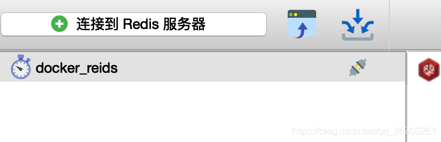

4. 在RDM上测试redis命令（redis所有的命令可以在官方http://redis.cn/commands.html查看）
   
   

5. 在项目的pom.xml中引入redis的starter。

   ```xml
    <dependency>
        <groupId>org.springframework.boot</groupId>
        <artifactId>spring-boot-starter-data-redis</artifactId>
    </dependency>
   1234
   ```

6. 在项目application.properties中配置redis。

   ```shell
   #配置redis（linux的ip）
   spring.redis.host=10.211.55.17
   12
   ```

7. 在Springboot01CacheApplicationTests测试类中测试

   ```java
   @Autowired
   StringRedisTemplate stringRedisTemplate;    //操作k-v都是字符串的
   
   @Autowired
   RedisTemplate redisTemplate;    //操作k-v都是对象的
       /**
    * Redis常见的五大数据类型
    * String（字符串）、List（列表）、Set（集合）、Hash（散列）、ZSet（有序集合）
    * stringRedisTemplate.opsForValue()    String（字符串）
    * stringRedisTemplate.opsForList()     List（列表）
    * stringRedisTemplate.opsForSet()      Set（集合）
    * stringRedisTemplate.opsForHash()     Hash（散列）
    * stringRedisTemplate.opsForZSet()     ZSet（有序集合）
    *
    * redisTemplate的方法和stringRedisTemplate，不同的是redisTemplate操作k-v都是对象的，而操作k-v都是字符串的
    */
   //测试stringRedisTemplate
   @Test
   public void test01(){
       stringRedisTemplate.opsForValue().append("msg", "hello");
          String msg = stringRedisTemplate.opsForValue().get("msg");
      	System.out.println(msg);
   
          stringRedisTemplate.opsForList().leftPush("mylist", "666");
      	stringRedisTemplate.opsForList().leftPush("mylist", "777");
      	String mylist = stringRedisTemplate.opsForList().leftPop("mylist");
      	System.out.println(mylist);
   }
   12345678910111213141516171819202122232425262728
   ```

   

   

   

   再添加一个方法来测试redisTemplate

   ```java
   @Test
   public void test02(){
       Employee employee = employeeMapper.getEmpById(1);
       //如果保存对象，默认使用jdk系列化机制，系列化后的数据保存到redis中
       redisTemplate.opsForValue().set("emp01", employee);  //append是追加字符串的，set才是添加对象的，并且每次提交相同的key时，原来的value会被新的value覆盖
   }
   123456
   ```

   运行后出现错误：

   ```
   DefaultSerializer requires a Serializable payload but received an object of type
   ```

   （需要系列化Employee）

   让Employee类实现Serializable完成系列化后，再重新运行。

   

   将数据以json的形式保存到redis：

   - 自己将对象转为json（如使用gson）

   - 修改redisTemplate默认的系列化（默认使用的是jdk的系列化器）

     新建一个MyRedisConfig配置类

     ```java
     @Configuration
     public class MyRedisConfig {
     
         @Bean
         public RedisTemplate<Object, Object> empRedisTemplate(RedisConnectionFactory redisConnectionFactory)
                 throws UnknownHostException {
             RedisTemplate<Object, Object> template = new RedisTemplate<>();
             template.setConnectionFactory(redisConnectionFactory);
             Jackson2JsonRedisSerializer<Object> serializer = new Jackson2JsonRedisSerializer<Object>(Object.class);
             //设置默认的系列化器为Jackson2JsonRedisSerializer
             template.setDefaultSerializer(serializer);
             return template;
         }
     }
     1234567891011121314
     ```

     如果在测试类中添加：

     ```java
     //自定义RedisTemplate
     @Autowired
     RedisTemplate<Object, Object> empRedisTemplate;
     
     @Test
     public void test03(){
         Employee employee = employeeMapper.getEmpById(1);
         empRedisTemplate.opsForValue().set("emp01", employee);
     }
     123456789
     ```

     

### 使用redis缓存

启动项目，浏览器输入`http://localhost:8080/emp/1`，redis多出了使用jdk系列化后的数据。

在MyRedisConfig中自定义一个cacheManager，让保存到redis的数据为json格式。（当容器中有多个RedisCacheManager时，需要用@Primary指定哪个是默认CacheManager，否则会报错）

```java
    //springboot参数需要传入一个RedisConnectionFactory
    //新建一个RedisCacheConfiguration对象可以来定制缓存的一些规则
    //如果注册了多个RedisCacheManager，如果不指定哪个是默认的RedisCacheManager就会报错，
    //@Primary  //@Primary指定默认使用的RedisCacheManager
    @Bean
    public RedisCacheManager myCacheManager(RedisConnectionFactory connectionFactory) {
        //RedisCacheConfiguration.defaultCacheConfig()会返回一个RedisCacheConfiguration对象
        //serializeValuesWith为设置系列化
        RedisCacheConfiguration cacheConfiguration = RedisCacheConfiguration.defaultCacheConfig()
                .serializeValuesWith(RedisSerializationContext.SerializationPair.fromSerializer
                    //(new Jackson2JsonRedisSerializer<Object>(Object.class)));
                    //GenericJackson2JsonRedisSerializer为通用Json序列化器，不需要传参
                    (new GenericJackson2JsonRedisSerializer()));
        
        //使用RedisCacheConfiguration创建RedisCacheManager
        RedisCacheManager cm = RedisCacheManager.builder(connectionFactory)
                .cacheDefaults(cacheConfiguration).build();
        return cm;
    }
12345678910111213141516171819
```


1. 在mapper包里新建一个DepartmentMapper

   ```java
   public interface DepartmentMapper {
       @Select("SELECT * FROM department WHERE id=#{id}")
       Department getDeptById(Integer id);
   }
   1234
   ```

2. 在service包里新建一个DepartmentService

   ```java
   @Service
   public class DepartmentService {
       @Autowired
       DepartmentMapper departmentMapper;
   
       @Cacheable(cacheNames = "dept")
       public Department getDeptById(Integer id){
           System.out.println("查询部门" + id);
           Department department = departmentMapper.getDeptById(id);
           return department;
       }
   }
   123456789101112
   ```

3. 在controller包里新建一个DepartmentController

   ```java
   @RestController
   public class DepartmentController {
       @Autowired
       DepartmentService departmentService;
   
       @GetMapping("/dept/{id}")
       public Department getDept(@PathVariable("id") Integer id){
           return departmentService.getDeptById(id);
       }
   }
   12345678910
   ```

4. 在数据库中的department插入一条数据

5. 启动项目，输入`http://localhost:8080/dept/1`查询1号部门
   
   

6. 再次查询出现错误，LinkedHashMap无法转换为Department
   
   
   *原因是因为redis返回回来的是一个LinkedHashMap*
   解决办法：在MyRedisConfig的myCacheManager中new GenericJackson2JsonRedisSerializer时传入String.valueOf(JsonTypeInfo.As.PROPERTY)即可解决类型转换问题。
   

##### 使用缓存管理器主动把数据添加到缓存里

修改DepartmentService中的getDeptById方法

```java
    @Qualifier("myCacheManager")    //指定使用myCacheManager缓存管理器
    @Autowired
    RedisCacheManager myCacheManager;

    @Cacheable(cacheNames = "dept")
    public Department getDeptById(Integer id){
        System.out.println("查询部门" + id);
        Department department = departmentMapper.getDeptById(id);

        //获取指定缓存
        Cache dept = myCacheManager.getCache("dept");
        dept.put(department.getId(), department);

        return department;
    }
123456789101112131415
```


#### 原理

- CacheManager创建Cache组件，缓存组件来实际给缓存中存取数据。

- 引入redis的starter，默认的SimpleCacheConfiguration不生效了，换成RedisCacheConfiguration生效。

- 这是因为SimpleCacheConfiguration类上有

  ```
  @ConditionalOnMissingBean(CacheManager.class)
  ```

  ，而RedisCacheConfiguration类给容器中注册了一个RedisCacheManager组件（RedisCacheConfiguration的优先级比SimpleCacheConfiguration高）。

  - RedisCacheManager帮我们创建RedisCache来作为缓存，RedisCache通过操作redis缓存数据。

- 默认保存数据k-v都是object，利用系列化保存。

  - 引入了redis的starter，cacheManager变为RedisCacheManager。
  - 默认创建的RedisCacheManager操作redis的时候使用的是RedisTemplate<Object, Object>。
  - RedisTemplate<Object, Object>是默认使用jdk的系列化机制的。
  - 转为json需要自定义cacheManager。

# 十、SpringBoot与消息

## 1. JMS与AMQP


## 2. RabbitMQ


## 3. 整合RabbitMQ

#### 安装RabbitMQ

在linux的docker里拉取RabbitMQ镜像`docker pull rabbitmq:3.8.3-management`（management是带web的管理界面）。
5672是客户端和RabbitMQ进行通信的端口。
15672是管理界面访问web页面的端口。

```shell
docker run -d -p 5672:5672 -p 15672:15672 --name myRabbitMQ 容器id
1
```

在浏览器输入`http://10.211.55.17:15672/`（10.211.55.17是我linux的ip）

账号密码都为guest


#### 使用RabbitMQ


1. 新建三个交换器（exchange.direct（点对点）、exchange.fanout（广播）、exchange.topic（模糊匹配））
   
   
2. 新建队列（atguigu、atguigu.news、atguigu.emps、gulixueyuan.news）
   
   
3. 点回Exchanges，把4个队列和交换器绑定。
   1. 点击进入exchange.direct
      
      
   2. 点击进入exchange.direct
      
   3. 点击进入exchange.topic（与前两个不同的是绑定的路由键用了#和*（#代表0个或多个单词，*代表一个单词））
      
      
4. 给每个交换器发送消息，测试队列的接收情况
   1. 点进exchange.direct
      
      
      
      点进atguigu队列，查看消息
      
   2. 点进exchange.fanout
      
      因为exchange.fanout是广播型的交换器，所以只要绑定了的队列，都会发送消息。
      
   3. 点进exchange.topic
      
      atguigu开头的都加了两次
      
      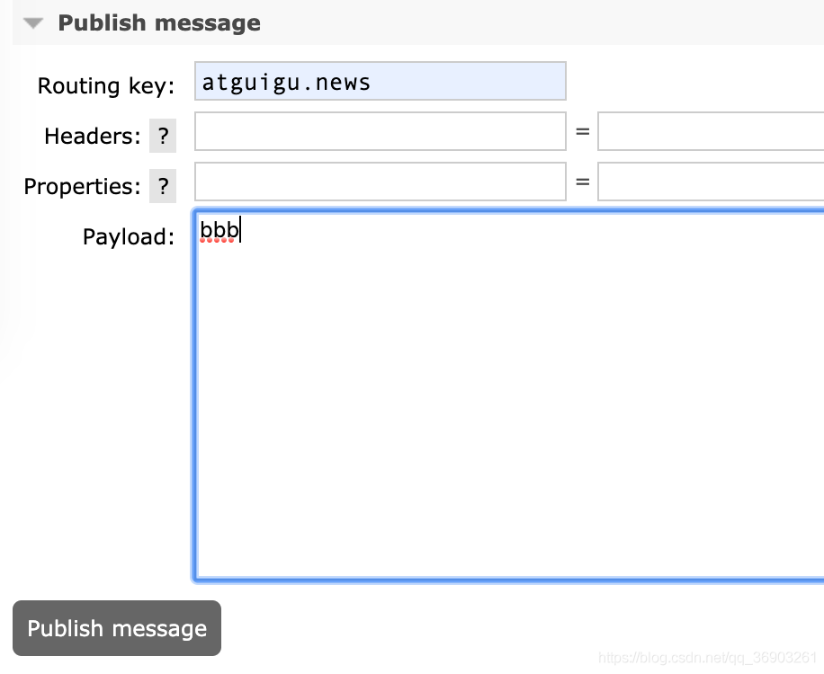
      atguigu.news符合atguigu.#和*.atguigu，所以队列都接收到消息。
      

### 创建项目


在application.properties中配置RabbitMQ的基本信息

```shell
spring.rabbitmq.host=10.211.55.17
#不写，默认端口为5672
#spring.rabbitmq.port=5672
spring.rabbitmq.username=guest
spring.rabbitmq.password=guest
#不写，默认为/
#spring.rabbitmq.virtual-host=/
1234567
```

#### 自动配置

RabbitAutoConfiguration中

1. RabbitProperties封装了RabbitMQ的配置
2. 自动配置了连接工厂ConnectionFactory
3. 自动配置了RabbitTemplate：给RabbitMQ发送和接收消息
4. 自动配置了AmqpAdmin：RabbitMQ系统管理功能组件（创建和删除Queue、Exchange、Binding）

#### 使用RabbitTemplate

在测试类中

1. 测试单播

   ```java
       @Autowired
       RabbitTemplate rabbitTemplate;
   
       //1. 单播（点对点）
       //发送数据
       @Test
       public void test01(){
           //使用send可以自定义信息体的内容和消息头（需要自定义消息头使用）
           //rabbitTemplate.send(exchang, roteKey, message);
   
           //convertAndSend只需要传入要发送的对象，自动系列化发送给RabbitMQ（object默认当成消息体）
           //rabbitTemplate.convertAndSend(exchang, roteKey, object);
           Map<String, Object> map = new HashMap<>();
           map.put("msg", "第一个消息");
           map.put("data", Arrays.asList("hello", 123, true));
           //对象被默认系列化（默认使用jdk的系列化）以后发送出去
           rabbitTemplate.convertAndSend("exchange.direct", "atguigu.news", map);
       }
   123456789101112131415161718
   ```

   在atguigu.news队列接收到的数据。
   
   在测试类中接收队列里的消息

   ```java
       @Test
       public void test02(){
           //receive返回的是message，包含消息头和消息体
           //rabbitTemplate.receiveAndConvert(queueName);
   
           //receiveAndConvert会先把消息体转为原来的数据类型再返回
           //rabbitTemplate.receiveAndConvert(queueName);
           Object o = rabbitTemplate.receiveAndConvert("atguigu.news");
           System.out.println(o.getClass());
           System.out.println(o);
       }    
   1234567891011
   ```

   
   *队列中被接收的数据就会被删除。*

   RabbitTemplate在发送消息时，由messageConverter负责系列化，messageConverter默认使用的是SimpleMessageConverter，SimpleMessageConverter里面使用的就是jdk的系列化规则。

   修改系列化规则：
   在config包下新建MyAMQPConfig配置类

   ```java
   import org.springframework.amqp.support.converter.MessageConverter;
   
   @Configuration
   public class MyAMQPConfig {
   
       //自定义MessageConverter，并添加到容器中
       @Bean
       public MessageConverter messageConverter(){
           return new Jackson2JsonMessageConverter();
       }
   
   }
   123456789101112
   ```

   重新发送数据后在exchange.direct队列中接收到的消息。
   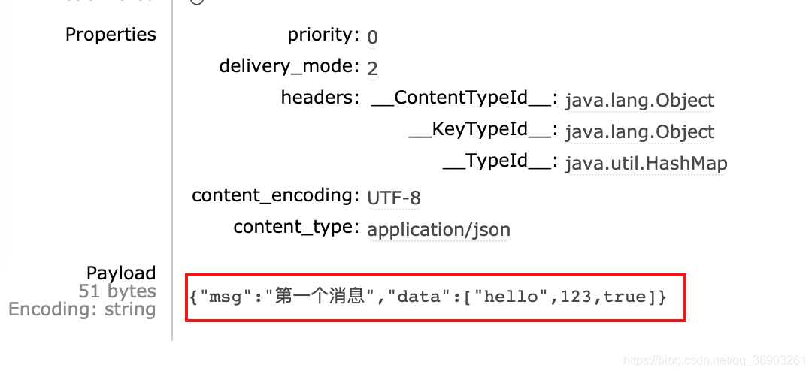
   在测试类中接收也能把json转为原来的类型。
   

2. 测试广播
   在bean包里新建一个Book类

   ```java
   public class Book {
       private String bookName;
       private String author;
       
       //有参无参构造器，get/set方法，toString方法
   }
   123456
   ```

   在测试类中添加

   ```java
   //2. 广播
   @Test
   public void test03(){
   	//因为是广播，不需要roteKey，所以第二个参数roteKey留空
       rabbitTemplate.convertAndSend("exchange.fanout", new Book("西游记", "吴承恩"));
   }
   123456
   ```

每个队列都接收到消息，并且自定义的类也可以识别转为json形式（已经提前清空了所有队列的消息（点进队列，下面有个Delete按钮，有个Purge Messages按钮可以清空队列数据））


#### 实际使用

在实际的开发中，需要监听指定的队列，一旦监听的队列更新，就需要执行相应的操作。

##### @EnableRabbit

在Springboot02AmqpApplication主配置类上添加`@EnableRabbit`注解，开启基于注解的RabbitMQ。

##### @RabbitListener

在service包下新建BookService（`@RabbitListener`注解监听指定队列）

```java
@Service
public class BookService {
    
    //@RabbitListener监听队列
    //queues属性为数组，可以监听多个队列
    @RabbitListener(queues = {"atguigu.news"})
    public void receive(Book book){
        System.out.println("收到消息" + book);
    }

}
1234567891011
```

接收到刚刚保存的book对象

如果需要接收消息头信息

```java
//是org.springframework.amqp.core的Message包
//import org.springframework.amqp.core.Message;
    @RabbitListener(queues = "atuguigu.news")
   public void receive2(Message message){
       //消息头
       System.out.println(message.getMessageProperties());
       //消息体
       System.out.println(message.getBody());
   }
123456789
```

在测试类中往队列发送消息（此时监听器生效，会在队列写入数据后触发监听器执行BookService的receive方法）
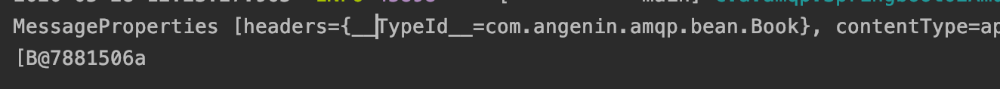
*获取到的消息体还没反系列化。*

#### 使用AmqpAdmin


```java
    @Autowired
    AmqpAdmin amqpAdmin;
    
    @Test
    public void create(){
        //创建Exchange
        //declareExchange需要传入一个Exchange对象
        //new DirectExchange时可以传入规则name, durable, autoDelete, arguments（这里只传入一个name）
        amqpAdmin.declareExchange(new DirectExchange("amqpadmin.exchange.direct"));
        System.out.println("创建完成");
    }
1234567891011
```


```java
//第一个参数为队列名，第二个为是否持久化
amqpAdmin.declareQueue(new Queue("amqpadmin.queue", true));
12
```


```java
        //创建绑定规则
        //第一个参数为目的地，第二为目的地类型（Binding.DestinationType.QUEUE和Binding.DestinationType.EXCHANGE）
        // 第三个是交换器名，第四个是路由键，第五个是参数头信息
        amqpAdmin.declareBinding(new Binding("amqpadmin.queue", Binding.DestinationType.QUEUE,
                "amqpadmin.exchange.direct", "amqp.haha", null));
12345
```

点进amqpadmin.exchange.direct交换器，绑定了amqp.queue队列，并且路由键为amqp.haha。


```java
    //删除Queue
    amqpAdmin.deleteQueue("amqpadmin.queue");
    //删除Exchange
    amqpAdmin.deleteExchange("amqpadmin.exchange.direct");
1234
```


# 十一、SpringBoot与检索


## 搭建环境

1. 使用linux中的docker拉取elasticsearch镜像（`docker pull elasticsearch`）。
2. 因为elasticsearch是java写的，开启时默认会占用2个G的内存空间，所以启动的时候需要用-e进行限制`docker run -e ES_JAVA_OPTS="-Xms256m -Xmx256m" -d -p 9200:9200 -p 9300:9300 --name ES01 elasticsearch`。(elasticsearch进行web通信时默认使用9200端口，在分布式的情况下各个节点之间的通信使用的是9300端口)
3. 在浏览器输入`http://10.211.55.17:9200/`（10.211.55.17是我linux的ip，9200是暴露的端口）
   
   elasticsearch官网：https://www.elastic.co/cn/
   官方文档：https://www.elastic.co/guide/cn/elasticsearch/guide/current/index.html
   

对于员工目录，我们将做如下操作：

- 每个员工索引一个文档，文档包含该员工的所有信息。
- 每个文档都将是 employee 类型 。
- 该类型位于 索引 megacorp 内。
- 该索引保存在我们的 Elasticsearch 集群中。
  实践中这非常简单（尽管看起来有很多步骤），我们可以通过一条命令完成所有这些动作

```js
PUT /megacorp/employee/1
{
    "first_name" : "John",
    "last_name" :  "Smith",
    "age" :        25,
    "about" :      "I love to go rock climbing",
    "interests": [ "sports", "music" ]
}
12345678
```

注意，路径 /megacorp/employee/1 包含了三部分的信息：
**megacorp**
索引名称
**employee**
类型名称
**1**
特定雇员的ID
{…}里为请求体 —— JSON 文档 —— 包含了这位员工的所有详细信息，他的名字叫 John Smith ，今年 25 岁，喜欢攀岩。

这里需要用到postman软件（官方下载：https://www.postman.com/）

### 测试elasticsearch

- 用postman

  发送put请求保存员工信息

  ：

  

  响应回来的内容：

  

  再保存2名员工：

  ```js
  PUT /megacorp/employee/2
  {
      "first_name" :  "Jane",
      "last_name" :   "Smith",
      "age" :         32,
      "about" :       "I like to collect rock albums",
      "interests":  [ "music" ]
  }
  
  PUT /megacorp/employee/3
  {
      "first_name" :  "Douglas",
      "last_name" :   "Fir",
      "age" :         35,
      "about":        "I like to build cabinets",
      "interests":  [ "forestry" ]
  }
  1234567891011121314151617
  ```

- 用postman发送get请求获取员工信息：
  

- 用postman

  发送head请求查询员工信息是否存在

  ：

  - 存在（状态码为200）
    
  - 不存在（状态码为404）
    

- 用postman发送delete请求删除员工信息：
  
  查询3号员工：
  

- 用postman发送put请求修改1号员工信息：
  

| 请求类型 | 效果                                           |
| -------- | ---------------------------------------------- |
| PUT      | 添加(或修改)数据                               |
| GET      | 获取数据                                       |
| POST     | 获取数据（可使用查询表达式）                   |
| HEAD     | 查询是否存在(存在返回状态码为200，不存在为404) |
| DELETE   | 删除数据                                       |

- 用get请求

  查询所有员工信息（_search）

  ：

  

  - url加上条件指定查询（q为查询字符串）：

  - 使用简单的查询表达式条件查询（因为get请求没有请求体，所有需要换成post请求）：

    ```js
    	{
    	    "query" : {
    	        "match" : {
    	            "last_name" : "Smith"
    	        }
    	    }
    	}
    1234567
    ```

    

  - 使用复杂的查询表达式条件查询：

    ```js
    	{
    	    "query" : {
    	        "bool": {
    	            "must": {
    	                "match" : {
    	                    "last_name" : "smith" 
    	                }
    	            },
    	            "filter": {
    	                "range" : {
    	                    "age" : { "gt" : 30 } 
    	                }
    	            }
    	        }
    	    }
    	}
    12345678910111213141516
    ```

    

  - 使用全文搜索（类似模糊搜索）：

    ```js
    	{
    	    "query" : {
    	        "match" : {
    	            "about" : "rock climbing"
    	        }
    	    }
    	}
    1234567
    ```

    

  - 短语搜索：

    ```js
    	{
    	    "query" : {
    	        "match_phrase" : {
    	            "about" : "rock climbing"
    	        }
    	    }
    	}
    1234567
    ```

    

  - 高亮搜索：

    ```js
    	{
    	    "query" : {
    	        "match_phrase" : {
    	            "about" : "rock climbing"
    	        }
    	    },
    	    "highlight": {
    	        "fields" : {
    	            "about" : {}
    	        }
    	    }
    	}
    123456789101112
    ```

    查出数据后的，把查到的对应字段放到highlight的about中，用< em >标签表示高亮。

    

    全文、短语、高亮搜索都属于查询表达式

## 整合ElasticSearch

#### 新建项目


#### 切换ElasticSearch版本


SpringBoot2.3.0对应的ElasticSearch是版本时7.6.2，而刚刚在docker直接拉取最新版的不知道为什么是5.6.12版本的，所以需要重新拉取7.6.2版本的ElasticSearch（`docker pull elasticsearch:7.6.2`）。
运行新版本的ElasticSearch，开启其他端口（也可以停了之前的版本用默认端口）。
`docker run -e ES_JAVA_OPTS="-Xms256m -Xmx256m" -d -p 9201:9200 -p 9301:9300 -e "discovery.type=single-node" --name ES02 f29a1ee41030`（这里用了新下载的镜像id（也可以用elasticsearch:7.6.2开启）`-e "discovery.type=single-node"`不加上的话一启动就直接停止）

浏览器输入`http://10.211.55.17:9201/`


我先put`10.211.55.17:9201/megacorp/employee/1`插入一条数据，然后在put`10.211.55.17:9201/megacorp/employee2/1`出现了错误，说明elasticsearch7以上一个索引只能有一个类型。


SpringBoot2.x中弃用了Jest，查看官方文档发现官方推荐我们使用高级REST客户端。（Java高级REST客户端是Elasticsearch的默认客户端，TransportClient它接受和返回完全相同的请求/响应对象，因此可以直接替换，因此取决于Elasticsearch核心项目。异步调用在客户端管理的线程池上进行，并要求在完成请求后通知回调。）
官方文档：https://docs.spring.io/spring-data/elasticsearch/docs/4.0.0.RELEASE/reference/html/#elasticsearch.clients.rest
ReactiveElasticsearchClient
DefaultReactiveElasticsearchClient
编写一个ElasticsearchRepository的子接口来操作ES

出现这个错误是因为使用了elasticsearch7之前的版本，而springboot版本为2.3，因为elasticsearch7只能有一个类型，所以springboot中关于设置类型的都弃用了，默认类型使用_doc，而elasticsearch7之前的版本类型不能使用带下划线。

```
org.springframework.data.elasticsearch.UncategorizedElasticsearchException: Elasticsearch exception [type=invalid_type_name_exception, reason=Document mapping type name can't start with '_', found: [_doc]]; nested exception is ElasticsearchStatusException[Elasticsearch exception [type=invalid_type_name_exception, reason=Document mapping type name can't start with '_', found: [_doc]]]
1
```


在bean包下新建一个Article实体类

```java
@Data   //lombok的注解，可以让我们不写set/get方法
@ToString   //自动添加toString方法
@Document(indexName = "angenin")    //设置保存的索引
public class Article {

//    @Id   在网上看了说需要加@Id设置主键，不过经过测试，不加好像也可以，不过保存时，实体类的id一定要写，不然提交不成功
    private Integer id;
//    @Field(type = FieldType.Text) //@Field设置类型的，不加好像也可以
    private String author;
//    @Field(type = FieldType.Text)
    private String title;
//    @Field(type = FieldType.Text)
    private String content;

    public Article() {
    }

    public Article(Integer id, String author, String title, String content) {
        this.id = id;
        this.author = author;
        this.title = title;
        this.content = content;
    }

}
12345678910111213141516171819202122232425
```

lombok的依赖坐标：

```xml
  <dependency>
      <groupId>org.projectlombok</groupId>
      <artifactId>lombok</artifactId>
  </dependency>
1234
```

在application.properties中设置elasticsearch的uri

```shell
spring.elasticsearch.rest.uris=http://10.211.55.17:9201
1
```

#### 使用ElasticsearchRestTemplate

> 从4.0版开始官方推荐ElasticsearchRestTemplate（不推荐使用ElasticsearchTemplate）。

在测试类中测试：

- 保存

```java
    @Autowired
    ElasticsearchRestTemplate elasticsearchRestTemplate;

    //保存
    @Test
    public void test01(){
        Article article = new Article(1, "angenin", "bbb", "helloworld");
		//修改也可以用save
        elasticsearchRestTemplate.save(article);
    }

1234567891011
```


- 获取

```java
    //获取
    @Test
    public void test02(){
        //获取aaa索引中id为1的Article对象
        Article article = elasticsearchRestTemplate.get("1", Article.class);
        System.out.println(article);
    }
1234567
```


- 删除

```java
    //删除
    @Test
    public void test03(){
        //删除angenin索引中id为1的数据
        elasticsearchRestTemplate.delete("1");
    }
123456
```


#### 继承ElasticsearchRepository接口

在bean下新建Book实体类

```java
@Data
@ToString
@Document(indexName = "book")
public class Book {

    private Integer id;
    private String bookName;
    private String author;

    public Book() {
    }

    public Book(Integer id, String bookName, String author) {
        this.id = id;
        this.bookName = bookName;
        this.author = author;
    }
}
123456789101112131415161718
```

在repository包下新建一个接口实现ElasticsearchRepository

```java
//第一个泛型是实体类类型，第二个为实体类主键类型
public interface BookRepository extends ElasticsearchRepository<Book, Integer> {
	//继承ElasticsearchRepository所有的方法
}
1234
```

在测试类中测试

```java
    @Autowired
    BookRepository bookRepository;

    @Test
    public void test05(){
        Book book = new Book(1, "西游记", "吴承恩");
        bookRepository.save(book);
    }
12345678
```


在BookRepository接口中加入

```java
	//模糊查询书名
    List<Book> findByBookNameLike(String bookName);
12
```

在测试类中加入

```java
        List<Book> bookNameLike = bookRepository.findByBookNameLike("游");
        System.out.println(bookNameLike);
12
```


springboot会根据自定义的Repository中的方法名，来实现自定义的查询，具体可以看[官方文档](https://docs.spring.io/spring-data/elasticsearch/docs/4.0.0.RELEASE/reference/html/#elasticsearch.query-methods.finders)，也可以在自定义的Repository中的自定义方法上加上`@Query`注解来自己定义查询的规则。
如：

```java
interface BookRepository extends ElasticsearchRepository<Book, String> {
    @Query("{\"match\": {\"name\": {\"query\": \"?0\"}}}")
    Page<Book> findByName(String name,Pageable pageable);
}
1234
```

# 十二、SpringBoot与任务

##### 新建项目


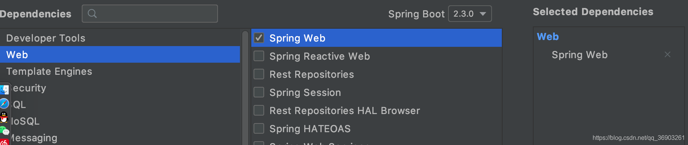

## 异步任务


模拟处理数据时发生阻塞：
在service包里新建AsyncService

```java
@Service
public class AsyncService {

    public void hello(){
        try {
            Thread.sleep(3000);
        } catch (InterruptedException e) {
            e.printStackTrace();
        }
        System.out.println("数据处理中");
    }

}
12345678910111213
```

在controller包里新建AsyncController

```java
@RestController
public class AsyncController {

    @Autowired
    AsyncService asyncService;

    @GetMapping("/hello")
    public String hello(){
        asyncService.hello();
        return "success";
    }

}
12345678910111213
```

浏览器输入`http://localhost:8080/hello`，3秒后才显示


##### 开启异步

> @EnableAsync：在主配置类上加上开启异步注解功能
> @Async：在需要异步的方法上加上使其成为异步方法

在Springboot04TaskApplication主配置类上加上`@EnableAsync`注解开启异步注解功能，并在AsyncService的hello方法上加上`@Async`注解告诉springboot这是一个异步方法，重新启动项目，访问/hello，立即响应返回success。

## 定时任务


在主配置类上加上`@EnableScheduling`开启基于注解的定时任务。
在service包下新建ScheduledService

```java
@Service
public class ScheduledService {

    //@Scheduled开启定时执行
    //cron属性为设置执行时间，可写以下参数
//    	      * <li>second</li>         秒
//            * <li>minute</li>         分
//            * <li>hour</li>           时
//            * <li>day of month</li>   日
//            * <li>month</li>          月
//            * <li>day of week</li>    周
//       (书写格式："0  *  * *  *  MON-FRI"  （周一到周五每分钟执行一次）)具体写法看上图中的表格
//                 秒 分 时 日 月    周
    @Scheduled(cron = "0 * * * * MON-FRI")
    public void hello(){
        System.out.println("hello...");
    }

}
12345678910111213141516171819
```


```java
//    @Scheduled(cron = "0 * * * * MON-FRI")        //周一到周五每分钟执行一次
//    @Scheduled(cron = "0,1,2,3 * * * * MON-FRI")  //周一到周五每0，1，2，3秒执行一次
//    @Scheduled(cron = "0-4 * * * * MON-FRI")      //周一到周五每0到4秒每秒执行一次
//    @Scheduled(cron = "0/4  * * * * MON-FRI")       //周一到周五每4秒执行一次
//    @Scheduled(cron = "0/4  * * * * MON-FRI")       //周一到周五每4秒执行一次
12345
```


## 邮件任务


引入依赖

```xml
<dependency>
   <groupId>org.springframework.boot</groupId>
   <artifactId>spring-boot-starter-mail</artifactId>
</dependency>
1234
```

邮件发送流程：


获取qq邮箱的授权码：


查看SMTP服务器地址：


在application.properties配置文件中配置用户名和授权码：

```shell
spring.mail.username=xxx@qq.com
#password不是填写qq邮箱的密码，而是填写qq邮箱生成授权码
spring.mail.password=hgtltpsqaerxebhf
#主机地址（SMTP服务器地址）
spring.mail.host=smtp.qq.com
12345
```

在测试类中测试：

- 发送简单邮件

```java
	//简单邮件发送（由qq邮箱发送到163邮箱）
    @Test
    void test01() {
        //创建一个简单邮件
        SimpleMailMessage simpleMailMessage = new SimpleMailMessage();
        //设置邮件标题
        simpleMailMessage.setSubject("通知-今晚峡谷集合");
        //设置邮件内容
        simpleMailMessage.setText("进行一项多人运动");
        //设置收件人
        simpleMailMessage.setTo("xxx@163.com");
        //设置发件人
        simpleMailMessage.setFrom("xxx@qq.com");
        //发送邮件
        mailSender.send(simpleMailMessage);
    }
12345678910111213141516
```

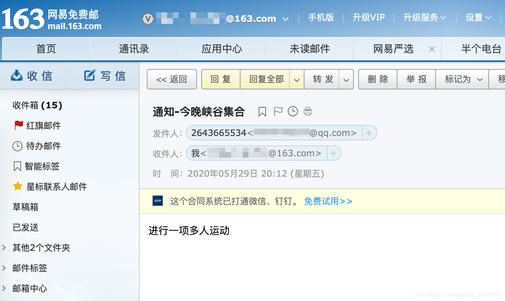

- 发送复杂邮件

```java
    //复杂邮件发送（复杂邮件可以发送html标签，文件等）
    @Test
    void test02() throws MessagingException {
        //创建一个复杂邮件（MimeMessage没有set方法，只能通过MimeMessageHelper进行设置）
        MimeMessage mimeMessage = mailSender.createMimeMessage();
        //第二个参数为是否开启上传文件功能
        MimeMessageHelper helper = new MimeMessageHelper(mimeMessage, true);
        //设置邮件标题
        helper.setSubject("通知-今晚峡谷集合");
        //设置邮件内容，第二个参数开启设置html标签，样式
        helper.setText("进行一项加强时间管理的<b style='color:yellow'>多人运动</b>", true);
        //设置收件人
        helper.setTo("xxx@163.com");
        //设置发件人
        helper.setFrom("xxx@qq.com");
        //上传文件（）
        helper.addAttachment("1.jpg", new File("/Users/pro/Documents/image/1.jpg"));
        helper.addAttachment("2.jpg", new File("/Users/pro/Documents/image/2.jpg"));
        //发送邮件
        mailSender.send(mimeMessage);
    }
123456789101112131415161718192021
```


# 十三、SpringBoot与安全


##### 文件下载

链接:https://pan.baidu.com/s/1S60CSKZioVeM6AwOmBPcTA 密码:e59m

##### 新建项目


把下载的文件java目录里的KungfuController.java放到项目中的controller包里，把templates目录里的文件放到resources/templates目录里。

启动项目，在浏览器中输入`http://localhost:8080/`


## Spring Security

1. 引入Spring Security模块

   ```xml
   <dependency>
       <groupId>org.springframework.boot</groupId>
       <artifactId>spring-boot-starter-security</artifactId>
   </dependency>
   1234
   ```

2. 编写SpringSecurity的配置类（需要有@EnableWebSecurity并且继承WebSecurityConfigurerAdapter）

3. 重写configure(HttpSecurity http)方法定义授权规则

   ```java
   @EnableWebSecurity  //@EnableWebSecurity注解里已经标注了@Configuration注解
   public class MySecurityConfig extends WebSecurityConfigurerAdapter {
   	
   	//授权规则
       @Override
       protected void configure(HttpSecurity http) throws Exception {
           //定制请求的授权规则
           //authorizeRequests授权请求     antMatchers路径匹配
           http.authorizeRequests()
                   //  / 为首页路径，permitAll所有人都可以访问
                   .antMatchers("/").permitAll()
                   //level1下的所有请求，hasAnyRole需要角色VIP1才可以访问
                   .antMatchers("/level1/**").hasAnyRole("VIP1")
                   //level2下的所有请求，需要VIP2才可以访问
                   .antMatchers("/level2/**").hasAnyRole("VIP2")
                   //level3下的所有请求，需要VIP3才可以访问
                   .antMatchers("/level3/**").hasAnyRole("VIP3");
   
       }
   }
   1234567891011121314151617181920
   ```

   启动项目，点击秘籍，访问别拒绝（需要登录并且有权限才能访问）

   

4. 在MySecurityConfig的configure方法中加入

   ```java
       //开启自动配置的登录功能
       //1. /login来到登录页面
       //2. 登录失败会重定向到/login?error表示登录失败
       //3. 更多详情规定请自行点进去研究
       http.formLogin();
   12345
   ```

   重启项目后，点击秘籍，如果没有权限，就会跳转到登录页面（此页面是自动生成的）

   

   登录失败会返回提示

   

5. 在MySecurityConfig中重写configure(AuthenticationManagerBuilder auth)，定义认证规则

   ```java
   //定义认证规则
   @Override
   protected void configure(AuthenticationManagerBuilder auth) throws Exception {
       //进行演示，正确做法应该把数据放到数据库中
   
       auth.inMemoryAuthentication()
               //设置BCryptPasswordEncoder密码编码器
               .passwordEncoder(new BCryptPasswordEncoder())
               //登录的用户名
               .withUser("zhangsan")
               //登录的密码
               .password(new BCryptPasswordEncoder().encode("123456"))
               //roles给予的权限
               .roles("VIP1", "VIP2", "VIP3")
               //再加上一个用户
               .and()
               .withUser("lisi")
               .password(new BCryptPasswordEncoder().encode("123456")).roles("VIP1");
   }
   12345678910111213141516171819
   ```

   重启项目，进行登录，成功访问（张三有全部权限，而李四只有VIP1权限，所以只能访问普通武功秘籍）

   

6. 在授权规则的configure方法里添加

   ```java
       //开启自动配置的注销功能
       //1. 访问 /logout 表示用户注销，清空session
       //2. 注销成功后会返回 /login?logout 页面
       //注销后默认到login页面，可以用logoutSuccessUrl设置注销后跳转的页面
       http.logout().logoutSuccessUrl("/");
   12345
   ```

   重启项目，登录后进行注销

   

   没加logoutSuccessUrl

   

   加了logoutSuccessUrl（在首页点击注销后还是在首页）

   

##### 实现动态显示页面

当没登录时，不显示注销按钮
当登录时，显示用户信息，注销按钮，权限相对应的秘籍

1. 引入thymeleaf对Spring Security支持的依赖

   ```xml
     <dependency>
         <groupId>org.thymeleaf</groupId>
         <artifactId>thymeleaf-spring4</artifactId>
         <version>3.0.11.RELEASE</version>
     </dependency>
   12345
   ```

2. 修改页面上部分，显示用户信息

   ```html
   <!DOCTYPE html>
   <html xmlns:th="http://www.thymeleaf.org"
   	  xmlns:sec ="http://www.thymeleaf.org/extras/spring-security">
   <head>
   <meta http-equiv="Content-Type" content="text/html; charset=UTF-8">
   <title>Insert title here</title>
   </head>
   <body>
   <h1 align="center">欢迎光临武林秘籍管理系统</h1>
   <!--sec:authorize授权	isAuthenticated是否认证（）-->
   <!--没认证的情况下-->
   <div sec:authorize="!isAuthenticated()">
   	<h2 align="center">游客您好，如果想查看武林秘籍 <a th:href="@{/login}">请登录</a></h2>
   </div>
   <!--认证了的情况下-->
   <div sec:authorize="isAuthenticated()">
   <!--   sec:authentication="name"取出用户名	-->
   <!--	显示用户信息    -->
   	<h2><span sec:authentication="name"></span>，您好，
   <!--	sec:authentication="principal.authorities"获取所有的会员等级	-->
   		您的会员等级为：<span sec:authentication="principal.authorities"></span></h2>
   <!--   显示注销按钮	-->
   	<form th:action="@{/logout}" method="post">
   		<input type="submit" value="注销">
   	</form>
   </div>
   <hr>
   123456789101112131415161718192021222324252627
   ```

   

   

3. 修改下部分页面，显示相对应的秘籍

   ```html
   <!--判断是否有VIP1权限		hasRole为判断权限-->
   <div sec:authorize="hasRole('VIP1')">
   	<h3>普通武功秘籍</h3>
   	<ul>
   		<li><a th:href="@{/level1/1}">罗汉拳</a></li>
   		<li><a th:href="@{/level1/2}">武当长拳</a></li>
   		<li><a th:href="@{/level1/3}">全真剑法</a></li>
   	</ul>
   </div>
   
   <div sec:authorize="hasRole('VIP1')">
   	<h3>高级武功秘籍</h3>
   	<ul>
   		<li><a th:href="@{/level2/1}">太极拳</a></li>
   		<li><a th:href="@{/level2/2}">七伤拳</a></li>
   		<li><a th:href="@{/level2/3}">梯云纵</a></li>
   	</ul>
   </div>
   
   <div sec:authorize="hasRole('VIP1')">
   	<h3>绝世武功秘籍</h3>
   	<ul>
   		<li><a th:href="@{/level3/1}">葵花宝典</a></li>
   		<li><a th:href="@{/level3/2}">龟派气功</a></li>
   		<li><a th:href="@{/level3/3}">独孤九剑</a></li>
   	</ul>
   </div>
   </body>
   </html>
   1234567891011121314151617181920212223242526272829
   ```

   

   

##### 开启记住我功能

MySecurityConfig定制请求的授权规则configure添加：

```java
  //开启自动配置的记住我功能
  //登录成功后，将cookie发给浏览器保存，以后访问页面带上这个cookie，只要通过检查就可以免登录
  //cookie保存时间为两周，但是点击注销会立即删除cookie
  http.rememberMe();
1234
```

登录页面就会有记住我功能
勾选后，当登录成功，springsecurity会给浏览器发送一个cookie，保存时间为两周，下次打开页面就会自动登录，点击注销后会删除cookie。


##### 修改登录页面

把登录页面换成我们自己的登录页面

1. 给

   ```
   http.formLogin()
   ```

   添加

   ```java
   //usernameParameter("user")获取提交过来的表单中名为user的值作为username
   //passwordParameter("pwd")获取提交过来的表单中名为pwd的值作为password
   //loginPage("/userlogin")修改登录的页面
   http.formLogin().usernameParameter("user").passwordParameter("pwd").loginPage("/userlogin");
   1234
   ```

2. 把首页的`<a th:href="@{/login}">请登录</a>`中的`/login`换成`/userlogin`

3. 给pages目录下的登录页面的用户名和密码的name分别加上`user`和`pwd`

4. 并把登录页面的from表单`action=""`改为`th:action="@{/userlogin}"`（因为给/login发送post请求，是用来进行认证的，给/login发送get请求，是去登录的表单（即springsecurity默认的登录页面），但是如果是自定义的登录页面，就不是/login了，而是我们请求的地址，即/userlogin（可以使用`.loginProcessingUrl("")`修改请求的地址），总结就是如果是没设置登录页面使用默认的，就给/login发送请求，如果自定义登录页面的，就给自定义的那个请求地址发送请求，如果先改变请求的地址，就用loginProcessingUrl来改）
   
   
   

5. 在自定义的登录页面，密码下添加

```html
<input type="checkbox" name="remeber">记住我<br>
1
```

1. 然后给`http.rememberMe()`增加`.rememberMeParameter("remeber")`获取提交过来表单中名为remeber的checkbox属性。
   
   

# 十四、SpringBoot与分布式

## 分布式


## Dubbo/Zookeeper

> Dubbo的视频可以看[这个视频](https://www.bilibili.com/video/BV1ns411c7jV)，也是尚硅谷的雷神讲的（分布式目前还没学，打算看完springboot的视频后就去补Dubbo和springcloud）

Dubbo的流程图：


### 安装zookeeper

在linux的docker中拉取zookeeper的镜像（`docker pull zookeeper`）

2181 跟客户端进行交互
2888 集群的端口
3888 全局的端口

运行zookeeper容器（`docker run --name zk01 -p 2181:2181 --restart always -d zookeeper`）

### 创建工程

需要创建两个工程，一个是服务的提供者，一个是服务的消费者。

创建一个空工程


创建新模块

创建一个提供者（卖票的）


创建一个消费者（用户）


### 使用步骤

##### provider-ticket项目

1. 在ticket包下新建service/TicketService接口

   ```java
   public interface TicketService {
   
       public String getTicket();
   
   }
   12345
   ```

   然后再在service包下新建一个TicketServiceImpl

   ```java
   @Component  //加到容器中
   public class TicketServiceImpl implements TicketService {
       @Override
       public String getTicket() {
           return "《HelloWorld》";
       }
   }
   1234567
   ```

2. 在provider-ticket项目中引入依赖

   ```xml
   	<!-- Dubbo Spring Boot Starter -->
   	<dependency>
   		<groupId>org.apache.dubbo</groupId>
   		<artifactId>dubbo-spring-boot-starter</artifactId>
   		<version>2.7.6</version>
   	</dependency>
   123456
   ```

3. 引入curator依赖（zookeeper客户端框架，dubbo高版本好像是用这个的）

   ```xml
       <!-- 对zookeeper的底层api的一些封装 -->
       <dependency>
           <groupId>org.apache.curator</groupId>
           <artifactId>curator-framework</artifactId>
           <version>4.2.0</version>
       </dependency>
   
       <!-- 封装了一些高级特性，如：Cache事件监听、选举、分布式锁、分布式Barrier -->
       <dependency>
           <groupId>org.apache.curator</groupId>
           <artifactId>curator-recipes</artifactId>
           <version>4.2.0</version>
       </dependency>
   12345678910111213
   ```

4. 在application.properties配置文件中配置dubbo

   ```shell
   #起名（写项目名）
   dubbo.application.name=provider-ticket
   
   #注册中心的地址
   dubbo.registry.address=zookeeper://10.211.55.17:2181
   
   #想把项目下的哪些包发布出去
   dubbo.scan.base-packages=com.angenin.ticket.service
   12345678
   ```

5. 在TicketServiceImpl类上加上dubbo的@Service注解

   ```java
   import org.apache.dubbo.config.annotation.Service;
   
   @Service	 //将服务发布出去
   123
   ```

6. 启动项目，并保持不关闭

##### consumer-user项目

1. 引入依赖

   ```xml
      <dependency>
          <groupId>org.apache.curator</groupId>
          <artifactId>curator-framework</artifactId>
          <version>4.2.0</version>
      </dependency>
   
      <dependency>
          <groupId>org.apache.curator</groupId>
          <artifactId>curator-recipes</artifactId>
          <version>4.2.0</version>
      </dependency>
   
      <dependency>
          <groupId>org.apache.dubbo</groupId>
          <artifactId>dubbo-spring-boot-starter</artifactId>
          <version>2.7.6</version>
      </dependency>
   1234567891011121314151617
   ```

2. 配置dubbo的注册中心地址

   ```shell
   dubbo.application.name=consumer-user
   dubbo.registry.address=zookeeper://10.211.55.17:2181
   12
   ```

3. 在com.angenin包下新建ticket/service两层包，然后复制provider-ticket项目的TicketService放到service包下。（想使用provider-ticket项目的TicketServiceImpl的getTicket，需要在此项目下有和provider-ticket项目中的TicketService相同的包）
   

4. 在user包下新建service/UserService

   ```java
   import com.angenin.ticket.service.TicketService;
   import org.apache.dubbo.config.annotation.Reference;
   import org.springframework.stereotype.Service;
   
   @Service    //springboot中的@Service注解，添加到容器中
   public class UserService {
   
       @Reference  //远程引用（按照全类名进行匹配，所以才需要有相同的路径）
       TicketService ticketService;
   
       public void hello(){
           String ticket = ticketService.getTicket();
           System.out.println("买到票：" + ticket);
       }
   }
   123456789101112131415
   ```

5. 在测试类中测试

   ```java
   	@Autowired
   	UserService userService;
   
   	@Test
   	void contextLoads() {
   		userService.hello();
   	}
   1234567
   ```

6. 运行测试方法（要注意的是provider-ticket项目需要一直运行着）
   

## Spring Boot/Cloud

> springcloud推荐看[这个视频](https://www.bilibili.com/video/BV18E411x7eT)，是尚硅谷的阳哥讲的，而且是2020年3月发布的，最新版的H版&alibaba。

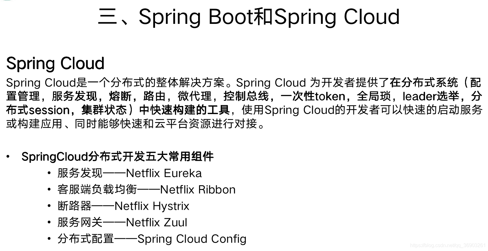


### 新建项目

创建一个空工程


新建模块（eureka-server注册中心）

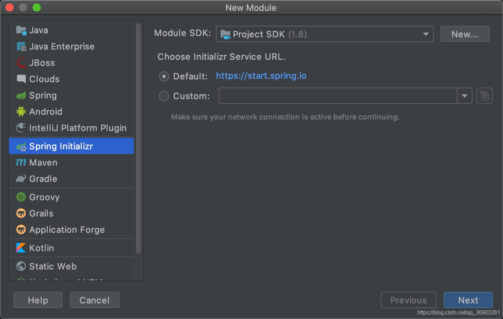


### 使用步骤

新建模块（提供者）


新建模块（消费者）


##### eureka-server注册中心

1. 在eureka-server项目的resources目录下新建application.yml配置文件，配置注册中心：

   ```yml
   server:
     port: 8761  #服务器端口
   
   eureka:
     instance:
       hostname: eureka-server #eureka实例的主机名
     client:
       register-with-eureka: false #不把自己（eureka-server）注册到eureka上（不做高可用的情况下）
       fetch-registry: false #不从eureka上来获取服务的注册信息（因为本身就是注册中心，消费者就需要获取提供者的信息）
       service-url:
         defaultZone: http://localhost:8761/eureka/  #不指定默认为http://localhost:8761/eureka.client/
   1234567891011
   ```

2. 在主配置类上加上`@EnableEurekaServer`注解，启用这个注册中心。

3. 启动eureka-server项目，访问`http://localhost:8761/`

4. 保持eureka-server运行着。

##### provider-ticket服务提供者

1. 在provider-ticket项目providerticket包下新建service/TicketService：

   ```java
   import org.springframework.stereotype.Service;
   
   @Service
   public class TicketService {
   
       public String getTicket(){
           return "《HelloWorld》";
       }
   
   }
   12345678910
   ```

   在providerticket包下新建controller/TicketController：（因为没导入web模块，所以在这样要点击红灯泡导入）

   ```java
   @RestController
   public class TicketController {
   
       @Autowired
       TicketService ticketService;
   
       @GetMapping("/ticket")
       public String getTicket(){
           return ticketService.getTicket();
       }
   
   }
   123456789101112
   ```

   

2. 在resources目录下新建application.yml配置文件

   ```yml
   server:
     port: 8001
   
   spring:
     application:
       name: provider-ticket
   
   eureka:
     instance:
       prefer-ip-address: true #注册服务的时候使用服务的ip地址
     client:
       service-url:
         defaultZone: http://localhost:8761/eureka/
   12345678910111213
   ```

3. 启动项目
   
   
   

4. 在浏览器输入`http://localhost:8001/ticket`
   
   在管理页面也可以看到注册并启动的PROVIDER-TICKET
   
   *并且我们可以把同个应用部署多个实例。*

5. 停止provider-ticket（eureka-server不要停）
   

6. 设置同个项目可多次运行
   
   

7. 启动项目，然后到application.yml中把端口修改为8002，再次启动项目
   
   
   

8. 在浏览器分别输入：`http://localhost:8001/ticket`和`http://localhost:8002/ticket`
   
   
   在管理页面可以看到同个项目的两个实例：
   

##### consumer-user服务消费者

1. 在consumer-user项目的resources目录下新建application.yml

   ```yml
   server:
     port: 8200
   
   spring:
     application:
       name: consumer-user
   
   eureka:
     instance:
       prefer-ip-address: true #注册服务的时候使用服务的ip地址
     client:
       service-url:
         defaultZone: http://localhost:8761/eureka/
   12345678910111213
   ```

2. 给主配置类上添加

   ```java
   @EnableDiscoveryClient	//开启发现服务功能
   @SpringBootApplication
   public class ConsumerUserApplication {
   
   	public static void main(String[] args) {
   		SpringApplication.run(ConsumerUserApplication.class, args);
   	}
   
   	/**
   	 * 发送http请求，调用其他服务
   	 * @return
   	 */
   	@LoadBalanced	//使用负载均衡机制（只要加了这个注解才能使用服务名的调用）
   	@Bean
   	public RestTemplate restTemplate(){
   		return new RestTemplate();
   	}
   }
   123456789101112131415161718
   ```

3. 在consumeruser包下新建controller/UserController

   ```java
   @RestController //同样，添加一下web模块
   public class UserController {
   
       @Autowired
       RestTemplate restTemplate;
   
       @GetMapping("/buy")
       public String buyTicket(String name){
           //getForEntity获取数据，第一个参数为请求的地址，第二个参数为返回值的类型
           //只有加入容器的RestTemplate上有@LoadBalanced注解，才能使用服务器名进行访问，不然只能用ip地址
           String s = restTemplate.getForObject("http://PROVIDER-TICKET/ticket", String.class);
           return name + "购买了" + s;
       }
   
   }
   123456789101112131415
   ```

4. 启动项目（启动时不要选错了），在浏览器输入`http://localhost:8200/buy?name=张三`
   
   在管理页面可以看到注册的CONSUMER-USER。
   
   *通过RestTemplate对其他服务的发起请求，获取返回值，并且由于我们加了@LoadBalanced注解，实现了负载均衡，所以我们开启的两个服务提供者会轮流接收请求。*

# 十五、SpringBoot与开发热部署


Developer Tools官方文档：https://docs.spring.io/spring-boot/docs/2.3.0.RELEASE/reference/html/using-spring-boot.html#using-boot-devtools

新建项目：


在developertools包下新建controller/HelloController

```java
@RestController
public class HelloController {

    @GetMapping("/hello")
    public String hello(){
        return "<h1>hello</h1>";
    }

}
123456789
```

启动项目，在浏览器输入`http://localhost:8080`

在不停下项目的情况下把请求地址`/`改为`/hello`，然后按Crtl+F9重新编译，再在浏览器输入`http://localhost:8080/hello`，很显然是访问不了的。

项目停止运行。

### 使用Developer Tools

想使用热部署，需要引入Developer Tools依赖：

```xml
    <dependency>
        <groupId>org.springframework.boot</groupId>
        <artifactId>spring-boot-devtools</artifactId>
        <optional>true</optional>
    </dependency>
12345
```

再次启动项目，在浏览器输入`http://localhost:8080/hello`

然后把请求地址改为`/abc`，Crtl+F9重新编译，在浏览器输入`http://localhost:8080/abc`


# 十六、SpringBoot与监控管理


新建项目


启动项目，在浏览器输入`http://localhost:8080/actuator`，可以看到，默认只暴露三个端点

在application.properties配置文件中加入

```shell
#开启所有端点
management.endpoints.web.exposure.include=*
#management.endpoints.web.exposure.exclude=env,beans  #指定关闭哪个端点
#management.endpoint.端口名.enabled=true  //开启指定端口
#management.endpoint.端口名.cache.time-to-live=10s #将指定端点的缓存的生存时间设置为10秒
12345
```

如果是在application.yml中：（*要加上""双引号，避免歧义）

```yml
management:
  endpoints:
    web:
      exposure:
        include: "*"
12345
```

重新运行项目，访问`http://localhost:8080/actuator`
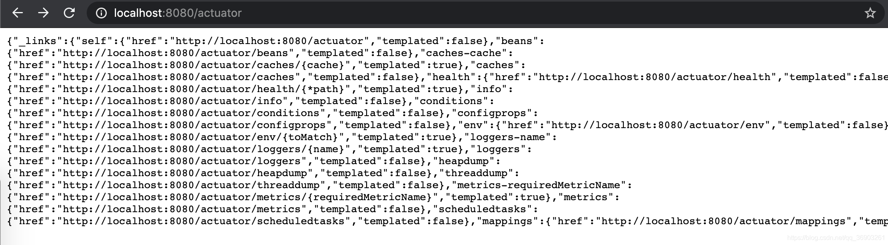

具体介绍可以看官方文档：https://docs.spring.io/spring-boot/docs/2.3.0.RELEASE/reference/htmlsingle/#production-ready-enabling


### 自定义健康状态指示器

编写一个指示器，需要实现HealthIndicator接口，并且指示器的名字必须是xxxHealthIndicator，

```java
@Component
public class MyAppHealthIndicator implements HealthIndicator {

    @Override   //返回健康状态
    public Health health() {
        //自定义的检查方法
        return Health.up().build(); //代表健康
//        return Health.down().withDetail("msg", "服务异常").build();
    }
}
12345678910
```

启动项目，在浏览器输入`http://localhost:8080/actuator/health`

看完视频后，发现还是有很多东西需要学习，继续努力。