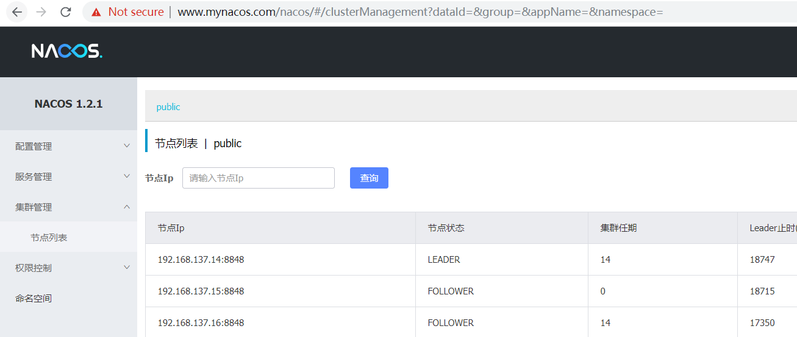
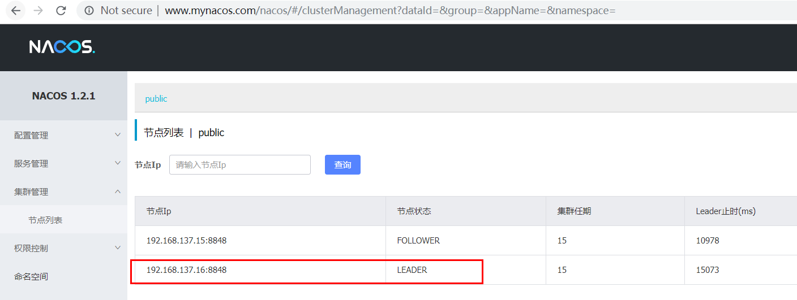
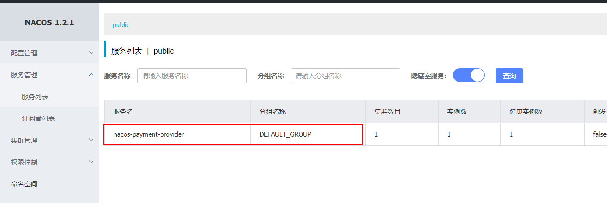

## 1. 环境准备

| IP             | 操作系统        |                   |
| -------------- | --------------- | ----------------- |
| 192.168.137.14 | CentOS 7.6.1810 | Nginx+mysql+nacos |
| 192.168.137.15 | CentOS 7.6.1810 | nacos             |
| 192.168.137.16 | CentOS 7.6.1810 | nacos             |

### 1.1 安装和配置

需要使用的mysql，如果没有安装mysql，请参考如下的方式进行安装： https://www.cnblogs.com/luohanguo/p/9045391.html

在mysql中创建数据库“nacos_config”，执行nacos安装包中的“nacos-mysql.sql”

下载[nacos-server-1.2.1](https://github.com/alibaba/nacos/releases/download/1.2.1/nacos-server-1.2.1.zip)，到/opt/software目录中：

```
[root@nacos software]# ll
-rw-r--r--. 1 root    root     56051518 Apr 18 09:11 nacos-server-1.2.1.zip
```

将137.14上的nacos安装包，传送到另外两台设备上：

```
[root@nacos software]# scp nacos-server-1.2.1.zip root@192.168.137.15:$PWD
root@192.168.137.15's password: 
nacos-server-1.2.1.zip                                                                                                   100%   53MB  26.7MB/s   00:02    
[root@nacos software]# scp nacos-server-1.2.1.zip root@192.168.137.16:$PWD
root@192.168.137.16's password: 
nacos-server-1.2.1.zip                                                                                                   100%   53MB  26.7MB/s   00:02    
[root@nacos software]# 
```

分别在三台设备上执行如下的命令：

```
unzip /opt/software/nacos-server-1.2.1.zip  -d /opt/module/nacos-cluster  && cd /opt/module/nacos-cluster/nacos  && cp conf/cluster.conf.example  conf/cluster.conf  && 

echo "192.168.137.14:8848
192.168.137.15:8848
192.168.137.16:8848" >  conf/cluster.conf  && sed -i s/server\.port=8848/server\.port=8848/  conf/application.properties  && echo "

spring.datasource.platform=mysql

db.num=1
db.url.0=jdbc:mysql://192.168.137.14:3306/nacos_config?characterEncoding=utf8&connectTimeout=1000&socketTimeout=3000&autoReconnect=true
db.user=root
db.password=Admin@123"  >> conf/application.properties  && sh bin/startup.sh
```

分别启动3台设备上的nacos。

```
[root@hadoop-104 bin]# sh startup.sh
/opt/module/jdk1.8.0_144/bin/java  -server -Xms2g -Xmx2g -Xmn1g -XX:MetaspaceSize=128m -XX:MaxMetaspaceSize=320m -XX:-OmitStackTraceInFastThrow -XX:+HeapDumpOnOutOfMemoryError -XX:HeapDumpPath=/opt/module/nacos/logs/java_heapdump.hprof -XX:-UseLargePages -Djava.ext.dirs=/opt/module/jdk1.8.0_144/jre/lib/ext:/opt/module/jdk1.8.0_144/lib/ext -Xloggc:/opt/module/nacos/logs/nacos_gc.log -verbose:gc -XX:+PrintGCDetails -XX:+PrintGCDateStamps -XX:+PrintGCTimeStamps -XX:+UseGCLogFileRotation -XX:NumberOfGCLogFiles=10 -XX:GCLogFileSize=100M -Dloader.path=/opt/module/nacos/plugins/health,/opt/module/nacos/plugins/cmdb,/opt/module/nacos/plugins/mysql -Dnacos.home=/opt/module/nacos -jar /opt/module/nacos/target/nacos-server.jar  --spring.config.location=classpath:/,classpath:/config/,file:./,file:./config/,file:/opt/module/nacos/conf/ --logging.config=/opt/module/nacos/conf/nacos-logback.xml --server.max-http-header-size=524288
nacos is starting with cluster
nacos is starting，you can check the /opt/module/nacos/logs/start.out
[root@hadoop-104 bin]# 
```

### 1.2 测试

http://192.168.137.14:8848/nacos/#/clusterManagement?dataId=&group=&appName=&namespace=

http://192.168.137.15:8848/nacos/#/clusterManagement?dataId=&group=&appName=&namespace=

http://192.168.137.16:8848/nacos/#/clusterManagement?dataId=&group=&appName=&namespace=

### 1.3 配置Nginx

```
	upstream nacosserver {
	   server 192.168.137.14:8848;
	   server 192.168.137.15:8848;
	   server 192.168.137.16:8848;
	} 
	
    server {
        listen 80;
        server_name www.mynacos.com;
   
        location / {
		     root   html;
             proxy_pass http://nacosserver;
             index index.html index.htm;
        }
    }	
```

在本地windows上修改hosts文件，添加“192.168.137.14 [www.mynacos.com”域名映射规则。](http://www.mynacos.xn--com-9o0a9951aypcu9it8iqvx5o5f./)

http://www.mynacos.com/nacos/#/clusterManagement?dataId=&group=&appName=&namespace=



停止192.168.137.14上的nacos服务，192.168.137.16选为新的Leader

http://www.mynacos.com/nacos/#/clusterManagement?dataId=&group=&appName=&namespace=



参考链接：

[Nacos 集群部署](https://www.cnblogs.com/FlyAway2013/p/11201250.html)

### 4. 将“cloudalibaba-provider-payment9002”微服务注册到nacos集群上



## 2. 基于Docker的nacos环境

| 服务器OS  | 主机IP         | Docker版本 |
| --------- | -------------- | ---------- |
| centos7.6 | 192.168.137.14 | 19.03.1    |
| centos7.6 | 192.168.137.15 | 19.03.1    |
| centos7.6 | 192.168.137.16 | 19.03.1    |

安装docker-compose（ docker 提供的一个命令行工具，用来定义和运行由多个容器组成的应用）

```
curl -L "https://github.com/docker/compose/releases/download/1.25.5/docker-compose-$(uname -s)-$(uname -m)" -o /usr/bin/docker-compose
```

赋权

```
chmod +x /usr/bin/docker-compose
```

查看版本

```
docker-compose --version
mkdir -p /opt/nacos-cluster-docker/init.d/ ;touch /opt/nacos-cluster-docker/init.d/custom.properties 
mkdir -p /opt/nacos-cluster-docker/nacos-1/;touch /opt/nacos-cluster-docker/nacos-1/docker-compose-nacos1.yml 
mkdir -p /opt/nacos-cluster-docker/nacos-2/;touch /opt/nacos-cluster-docker/nacos-2/docker-compose-nacos2.yml 
mkdir -p /opt/nacos-cluster-docker/nacos-3/;touch /opt/nacos-cluster-docker/nacos-3/docker-compose-nacos3.yml 
```

14服务器的`docker-compose-nacos1.yml`

```
version: '3' 
services:
  # nacos-server服务注册与发现，配置中心服务    
  docker-nacos-server:
    image: nacos/nacos-server:latest
    container_name: nacos-server-1
    ports:
      - "8848:8848"
      - "9555:9555"
    networks: 
      - nacos_net
    restart: on-failure
    privileged: true
    environment:
      PREFER_HOST_MODE: ip #如果支持主机名可以使用hostname,否则使用ip，默认也是ip
      SPRING_DATASOURCE_PLATFORM: mysql #数据源平台 仅支持mysql或不保存empty
      NACOS_SERVER_IP: 192.168.137.14 #多网卡情况下，指定ip或网卡
      NACOS_SERVERS: 192.168.137.14:8848 192.168.137.15:8848 192.168.137.16:8848 #集群中其它节点[ip1:port ip2:port ip3:port]
      MYSQL_MASTER_SERVICE_HOST: 192.168.137.14 #mysql配置，Master为主节点，Slave为从节点
      MYSQL_MASTER_SERVICE_PORT: 3306
      MYSQL_MASTER_SERVICE_DB_NAME: nacos_config
      MYSQL_MASTER_SERVICE_USER: root
      MYSQL_MASTER_SERVICE_PASSWORD: Admin@123
      #MYSQL_SLAVE_SERVICE_HOST: 10.2.7.29
      #MYSQL_SLAVE_SERVICE_PORT: 3341
      #JVM调优参数
      #JVM_XMS:  #-Xms default :2g
      #JVM_XMX:  #-Xmx default :2g
      #JVM_XMN:  #-Xmn default :1g
      #JVM_MS:   #-XX:MetaspaceSize default :128m
      #JVM_MMS:  #-XX:MaxMetaspaceSize default :320m
      #NACOS_DEBUG: n #是否开启远程debug，y/n，默认n
      #TOMCAT_ACCESSLOG_ENABLED: true #是否开始tomcat访问日志的记录，默认false
    volumes:
      - ./cluster-logs/nacos1:/home/nacos/logs #日志输出目录
      - ../init.d/custom.properties:/home/nacos/init.d/custom.properties #../init.d/custom.properties内包含很多自定义配置，可按需配置

networks:
  nacos_net:
    driver: bridge
```

15服务器的`docker-compose-nacos2.yml`

```
version: '3' 
services:
  # nacos-server服务注册与发现，配置中心服务    
  docker-nacos-server:
    image: nacos/nacos-server:latest
    container_name: nacos-server-2
    ports:
      - "8848:8848"
      - "9555:9555"
    networks: nacos_net
    restart: 
      - on-failure
    privileged: true
    environment:
      PREFER_HOST_MODE: ip #如果支持主机名可以使用hostname,否则使用ip，默认也是ip
      SPRING_DATASOURCE_PLATFORM: mysql #数据源平台 仅支持mysql或不保存empty
      NACOS_SERVER_IP: 192.168.137.15 #多网卡情况下，指定ip或网卡
      NACOS_SERVERS: 192.168.137.14:8848 192.168.137.15:8848 192.168.137.16:8848 #集群中其它节点[ip1:port ip2:port ip3:port]
      MYSQL_MASTER_SERVICE_HOST: 192.168.137.14 #mysql配置，Master为主节点，Slave为从节点
      MYSQL_MASTER_SERVICE_PORT: 3306
      MYSQL_MASTER_SERVICE_DB_NAME: nacos_config
      MYSQL_MASTER_SERVICE_USER: root
      MYSQL_MASTER_SERVICE_PASSWORD: Admin@123
      #MYSQL_SLAVE_SERVICE_HOST: 10.2.7.29
      #MYSQL_SLAVE_SERVICE_PORT: 3341
      #JVM调优参数
      #JVM_XMS:  #-Xms default :2g
      #JVM_XMX:  #-Xmx default :2g
      #JVM_XMN:  #-Xmn default :1g
      #JVM_MS:   #-XX:MetaspaceSize default :128m
      #JVM_MMS:  #-XX:MaxMetaspaceSize default :320m
      #NACOS_DEBUG: n #是否开启远程debug，y/n，默认n
      #TOMCAT_ACCESSLOG_ENABLED: true #是否开始tomcat访问日志的记录，默认false
    volumes:
      - ./cluster-logs/nacos2:/home/nacos/logs #日志输出目录
      - ../init.d/custom.properties:/home/nacos/init.d/custom.properties #../init.d/custom.properties内包含很多自定义配置，可按需配置

networks:
  nacos_net:
    driver: bridge
```

16服务器的`docker-compose-nacos3.yml`

```
version: '3' 
services:
  # nacos-server服务注册与发现，配置中心服务    
  docker-nacos-server:
    image: nacos/nacos-server:latest
    container_name: nacos-server-3
    ports:
      - "8848:8848"
      - "9555:9555"
    networks: 
      - nacos_net
    restart: on-failure
    privileged: true
    environment:
      PREFER_HOST_MODE: ip #如果支持主机名可以使用hostname,否则使用ip，默认也是ip
      SPRING_DATASOURCE_PLATFORM: mysql #数据源平台 仅支持mysql或不保存empty
      NACOS_SERVER_IP: 192.168.137.16 #多网卡情况下，指定ip或网卡
      NACOS_SERVERS: 192.168.137.14:8848 192.168.137.15:8848 192.168.137.16:8848 #集群中其它节点[ip1:port ip2:port ip3:port]
      MYSQL_MASTER_SERVICE_HOST: 192.168.137.14 #mysql配置，Master为主节点，Slave为从节点
      MYSQL_MASTER_SERVICE_PORT: 3306
      MYSQL_MASTER_SERVICE_DB_NAME: nacos_config
      MYSQL_MASTER_SERVICE_USER: root
      MYSQL_MASTER_SERVICE_PASSWORD: Admin@123
      #MYSQL_SLAVE_SERVICE_HOST: 10.2.7.29
      #MYSQL_SLAVE_SERVICE_PORT: 3341
      #JVM调优参数
      #JVM_XMS:  #-Xms default :2g
      #JVM_XMX:  #-Xmx default :2g
      #JVM_XMN:  #-Xmn default :1g
      #JVM_MS:   #-XX:MetaspaceSize default :128m
      #JVM_MMS:  #-XX:MaxMetaspaceSize default :320m
      #NACOS_DEBUG: n #是否开启远程debug，y/n，默认n
      #TOMCAT_ACCESSLOG_ENABLED: true #是否开始tomcat访问日志的记录，默认false
    volumes:
      - ./cluster-logs/nacos3:/home/nacos/logs #日志输出目录
      - ../init.d/custom.properties:/home/nacos/init.d/custom.properties #../init.d/custom.properties内包含很多自定义配置，可按需配置

networks:
  nacos_net:
    driver: bridge
```

Nacos共用的`init.d/custom.properties`，与官方保持一致，按需使用

```
#spring.security.enabled=false
#management.security=false
#security.basic.enabled=false
#nacos.security.ignore.urls=/**
#management.metrics.export.elastic.host=http://localhost:9200
# metrics for prometheus
management.endpoints.web.exposure.include=*

# metrics for elastic search
#management.metrics.export.elastic.enabled=false
#management.metrics.export.elastic.host=http://localhost:9200

# metrics for influx
#management.metrics.export.influx.enabled=false
#management.metrics.export.influx.db=springboot
#management.metrics.export.influx.uri=http://localhost:8086
#management.metrics.export.influx.auto-create-db=true
#management.metrics.export.influx.consistency=one
#management.metrics.export.influx.compressed=true
```

### 启动容器

分别在各主机上进入各自对应的nacos目录中，启动容器，命令如下：

14服务器

```
$ cd nacos-cluster-docker/nacos-1
$ docker-compose -f docker-compose-nacos1.yml up -d
```

15服务器

```
$ cd nacos-cluster-docker/nacos-2
$ docker-compose -f docker-compose-nacos2.yml up -d
```

16服务器

```
$ cd nacos-cluster-docker/nacos-3
$ docker-compose -f docker-compose-nacos3.yml up -d
```

参考链接：[Nacos高可用集群解决方案-Docker版本](https://www.cnblogs.com/hellxz/p/nacos-cluster-docker.html)

[Nacos Docker集群部署](https://www.cnblogs.com/xuchen0117/p/11725812.html)