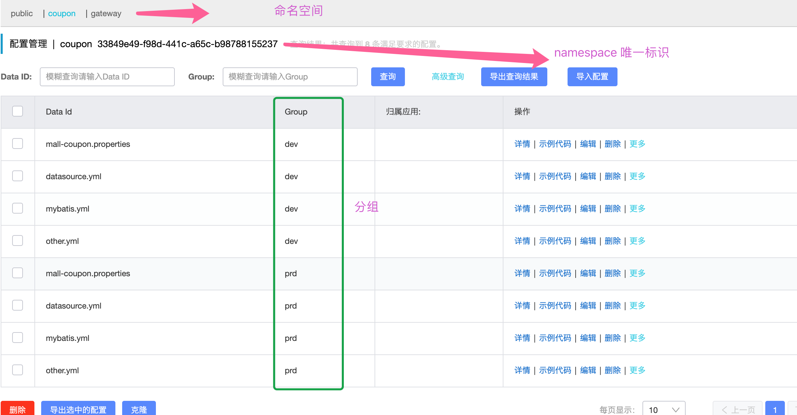
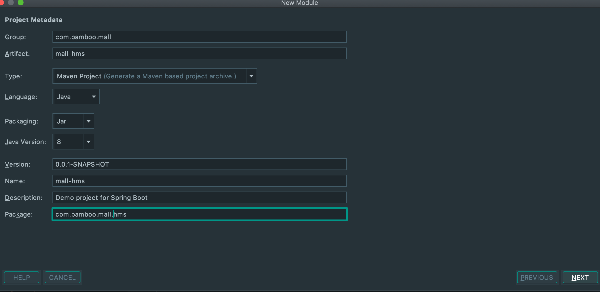
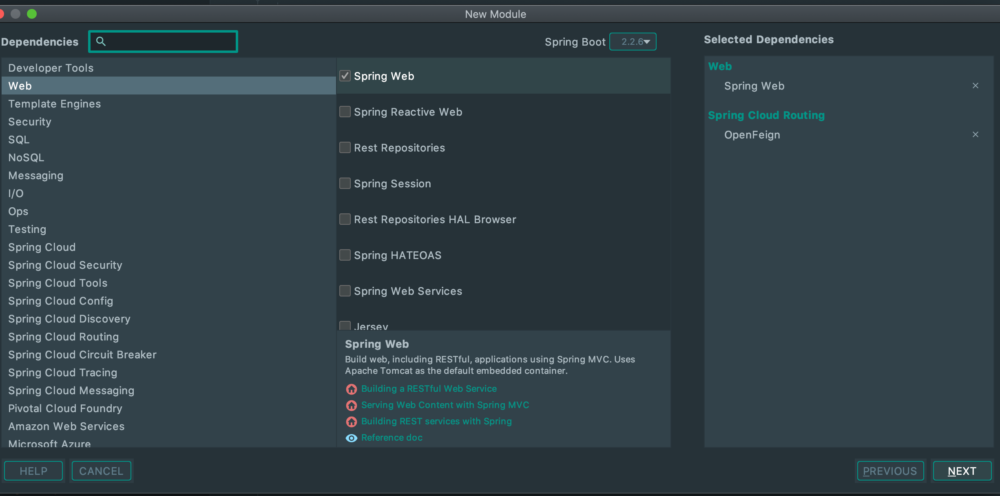

## 1、spring cloud alibaba 引入

### 1.1 项目创建流程

1、引入 openfeign(每个项目在新增的时候,选择 spring init) 1)、在根项目上点右键,然后新增 module 

2)、输入基本的信息 

3)、勾选相应的模块信息(web、openfeign) 

然后即可创建成功。

### 1.2 feign 调用

1)、common 模块引入 jar 包

```
<?xml version="1.0" encoding="UTF-8"?>
<project xmlns="http://maven.apache.org/POM/4.0.0" xmlns:xsi="http://www.w3.org/2001/XMLSchema-instance"
         xsi:schemaLocation="http://maven.apache.org/POM/4.0.0 https://maven.apache.org/xsd/maven-4.0.0.xsd">
    <modelVersion>4.0.0</modelVersion>
    <parent>
        <groupId>org.springframework.boot</groupId>
        <artifactId>spring-boot-starter-parent</artifactId>
        <version>2.2.6.RELEASE</version>
        <relativePath/> <!-- lookup parent from repository -->
    </parent>
    <groupId>com.bamboo.mall</groupId>
    <artifactId>mall-common</artifactId>
    <version>0.0.1-SNAPSHOT</version>
    <name>mall-common</name>
    <description>公共依赖信息</description>

    <properties>
        <java.version>1.8</java.version>
    </properties>

    <dependencies>
        <!--mybatis-plus-->
        <dependency>
            <groupId>com.baomidou</groupId>
            <artifactId>mybatis-plus-boot-starter</artifactId>
            <version>3.2.0</version>
        </dependency>

        <dependency>
            <groupId>org.projectlombok</groupId>
            <artifactId>lombok</artifactId>
            <version>1.18.8</version>
        </dependency>

        <dependency>
            <groupId>org.apache.httpcomponents</groupId>
            <artifactId>httpcore</artifactId>
            <version>4.4.12</version>
        </dependency>

        <dependency>
            <groupId>commons-lang</groupId>
            <artifactId>commons-lang</artifactId>
            <version>2.6</version>
        </dependency>

        <!--    导入mysql驱动    -->
        <dependency>
            <groupId>mysql</groupId>
            <artifactId>mysql-connector-java</artifactId>
            <version>8.0.17</version>
        </dependency>

        <dependency>
            <groupId>javax.servlet</groupId>
            <artifactId>servlet-api</artifactId>
            <version>2.5</version>
            <scope>provided</scope>
        </dependency>

        <dependency>
            <groupId>javax.validation</groupId>
            <artifactId>validation-api</artifactId>
            <version>2.0.1.Final</version>
        </dependency>

        <!-- 注册中心-->
        <dependency>
            <groupId>com.alibaba.cloud</groupId>
            <artifactId>spring-cloud-starter-alibaba-nacos-discovery</artifactId>
        </dependency>

        <!-- 配置中心 -->
        <dependency>
            <groupId>com.alibaba.cloud</groupId>
            <artifactId>spring-cloud-starter-alibaba-nacos-config</artifactId>
        </dependency>
    </dependencies>

    <build>
        <plugins>
            <plugin>
                <groupId>org.springframework.boot</groupId>
                <artifactId>spring-boot-maven-plugin</artifactId>
            </plugin>
        </plugins>
    </build>

    <dependencyManagement>
        <dependencies>
            <dependency>
                <groupId>com.alibaba.cloud</groupId>
                <artifactId>spring-cloud-alibaba-dependencies</artifactId>
                <version>2.2.0.RELEASE</version>
                <type>pom</type>
                <scope>import</scope>
            </dependency>
        </dependencies>
    </dependencyManagement>

</project>
```

2)、安装 nacos

3)、修改代码配置 3.1 启用应用类上添加两个注解

```
package com.bamboo.mall.member;
import org.mybatis.spring.annotation.MapperScan;
import org.springframework.boot.SpringApplication;
import org.springframework.boot.autoconfigure.SpringBootApplication;
import org.springframework.cloud.client.discovery.EnableDiscoveryClient;
import org.springframework.cloud.openfeign.EnableFeignClients;
/**
* 主要就是如下的两个注解
*1)、EnableFeignClients,扫描此包下的接口,把他变为一个需要调用的客户端
*2)、让自己成为注册中心中的一个服务
**/
@EnableFeignClients(basePackages = "com.bamboo.mall.member.client")
@EnableDiscoveryClient
@MapperScan(value = "com.bamboo.mall.member.dao")
@SpringBootApplication
public class MallMemberApplication {
    public static void main(String[] args) {
        SpringApplication.run(MallMemberApplication.class, args);
    }
}
```

3.2 然后在 feignClient 接口中定义你需要调用的服务的接口全地址

```
/** 
**如下就可以直接调用 mall-coupon 服务中的此接口了
*/
package com.bamboo.mall.member.client;

import com.bamboo.common.utils.R;
import org.springframework.cloud.openfeign.FeignClient;
import org.springframework.web.bind.annotation.GetMapping;

/**
 * @author : bamboo
 * @date : 2020-04-07
 */
@FeignClient("mall-coupon")
public interface CouponFeignService {
    /**
     * 获取会员优惠券
     *
     * @return
     */
    @GetMapping(value = "/coupon/coupon/member/list")
    R getMemberCoupons();
}
```

## 2、多配置总结

### 2.1 nacos 创建不同的命名空间,然后在不同的命名空间下,创建不同的分组

> 命名空间用于区分不同的微服务 分组用于区分不同的环境 

### 2.2 加载多个 yml 文件

在 resources 目录下创建文件：bootstrap.properties，然后文件内容如下：

```yaml
##应用名
spring.application.name=mall-coupon

##nacos服务地址
spring.cloud.nacos.config.server-addr=127.0.0.1:8848

##配置中心的命名空间、分组
spring.cloud.nacos.config.namespace=33849e49-f98d-441c-a65c-b98788155237
spring.cloud.nacos.config.group=prd

##使用不同的 yml 里的配置
spring.cloud.nacos.config.ext-config[0].data-id=datasource.yml
spring.cloud.nacos.config.ext-config[0].group=dev
spring.cloud.nacos.config.ext-config[0].refresh=true

spring.cloud.nacos.config.ext-config[1].data-id=mybatis.yml
spring.cloud.nacos.config.ext-config[1].group=dev
spring.cloud.nacos.config.ext-config[1].refresh=true

spring.cloud.nacos.config.ext-config[2].data-id=other.yml
spring.cloud.nacos.config.ext-config[2].group=dev
spring.cloud.nacos.config.ext-config[2].refresh=true
```

其他 yml 的配置

```yaml
##datasource.yml
spring:
  datasource:
    username: root
    password: "000000"
    url: jdbc:mysql://localhost:3306/mall_ums
    driver-class-name: com.mysql.jdbc.Driver

##other.yml
spring:
  cloud:
    nacos:
      discovery:
        server-addr: 127.0.0.1:8848

  application:
    name: mall-coupon
    
server:
  port: 7001
  
##mybatis.yml
mybatis-plus:
  mapper-locations: classpath:/mapper/**/*.xml
  global-config:
    db-config:
      id-type: auto
```

### 2.3 使用

添加 @Value 注解加载即可，如果想让配置即时生效则添加 @RefreshScope 注解

```java
package com.bamboo.mall.coupon.controller;
import com.bamboo.common.utils.PageUtils;
import com.bamboo.common.utils.R;
import com.bamboo.mall.coupon.entity.CouponEntity;
import com.bamboo.mall.coupon.service.CouponService;
import com.google.common.collect.Lists;
import org.springframework.beans.factory.annotation.Autowired;
import org.springframework.beans.factory.annotation.Value;
import org.springframework.cloud.context.config.annotation.RefreshScope;
import org.springframework.web.bind.annotation.*;

import java.util.Arrays;
import java.util.Map;


/**
 * 优惠券信息
 *
 * @author bamboo
 * @email yeyinzhu321@gmail.com
 * @date 2020-04-07 17:06:03
 */
@RefreshScope//用于实时刷新配置信息
@RestController
@RequestMapping("coupon/coupon")
public class CouponController {
    @Autowired
    private CouponService couponService;

    @Value("${coupon.user.name}")
    private String userName;

    @Value("${coupon.user.age}")
    private Integer age;

    @GetMapping("test")
    public R test() {
        return R.ok().put("userName", userName).put("age", age);
    }
}
```

## 3、网关路由配置总结

### 3.1 vue 前端所有请求转发到网关

```
static/config/index.js 修改 BaseUrl(localhost:88 表示网关的地址)
window.SITE_CONFIG['baseUrl'] = 'http://localhost:88/api';
```

### 3.2 网关配置

```yaml
- id: api_router
  uri: lb://renren-fast//lb 表示负载均衡
  predicates:
    - Path=/api/**
  filters:
    - RewritePath=/api/(?<segment>.*), /renren-fast/$\{segment}
    //地址重写,所有 api/* 的请求重写为 /renren-fast/*
```

### 3.3 renren-fast 项目添加配置让在 nacos 中服务发现

1)、依赖 common 包（主要是为了添加 nacos 相关的包）

```xml
<dependency>
    <groupId>com.bamboo.mall</groupId>
    <artifactId>mall-common</artifactId>
    <version>0.0.1-SNAPSHOT</version>
</dependency>
```

2)、添加 @EnableDiscoverCllient 注解

```java
@EnableDiscoveryClient
@SpringBootApplication(exclude = DataSourceAutoConfiguration.class)
public class MallGatewayApplication {

    public static void main(String[] args) {
        SpringApplication.run(MallGatewayApplication.class, args);
    }

}
```

3)、修改 yml 配置

```yaml
spring:
  cloud:
    gateway:
      routes:
        //精准配置放到前面,否则会被提前路由(因为下面也有 /api 的拦截)  
        - id: product_router
          uri: lb://mall-product
          predicates:
            - Path=/api/product/**
          filters:
            - RewritePath=/api/(?<segment>.*), /$\{segment}

        - id: api_router
          uri: lb://renren-fast
          predicates:
            - Path=/api/**
          filters:
            - RewritePath=/api/(?<segment>.*), /renren-fast/$\{segment}
    //服务发现            
    nacos:
      discovery:
        server-addr: 127.0.0.1:8848

  application:
    name: mall-gateway

server:
  port: 88
```

## 4、跨域配置

网关添加如下的类

```java
package com.bamboo.mall.gateway;

import org.springframework.context.annotation.Bean;
import org.springframework.context.annotation.Configuration;
import org.springframework.web.cors.CorsConfiguration;
import org.springframework.web.cors.reactive.CorsWebFilter;
import org.springframework.web.cors.reactive.UrlBasedCorsConfigurationSource;

/**
 * @author : bamboo
 * @date : 2020-04-08
 */
@Configuration
public class MallCorsConfiguration {
    @Bean
    public CorsWebFilter corsWebFilter() {
        UrlBasedCorsConfigurationSource source = new UrlBasedCorsConfigurationSource();
        CorsConfiguration corsConfiguration = new CorsConfiguration();
        //1、配置跨域
        corsConfiguration.addAllowedHeader("*");
        corsConfiguration.addAllowedMethod("*");
        corsConfiguration.addAllowedOrigin("*");
        corsConfiguration.setAllowCredentials(true);

        source.registerCorsConfiguration("/**", corsConfiguration);
        return new CorsWebFilter(source);
    }
}
```

## 5、OSS 配置

### 5.1 阿里云控制台开通

### 5.2 服务配置

mall-thirty-party 服务的相关配置 1)、application.yml

```java
spring:
  cloud:
    nacos:
      discovery:
        server-addr: 127.0.0.1:8848

  application:
    name: mall-third-party

server:
  port: 30000
```

2)、bootstrap.properties 配置

```java
spring.application.name=mall-third-party
spring.cloud.nacos.config.server-addr=127.0.0.1:8848
## nacos 中配置的 namespace 的地址
spring.cloud.nacos.config.namespace=5b017a2a-0531-408f-9f47-05d9e8ead718
spring.cloud.nacos.config.group=dev

spring.cloud.nacos.config.extension-configs[0].data-id=oss.yml
spring.cloud.nacos.config.extension-configs[0].group=dev
spring.cloud.nacos.config.extension-configs[0].refresh=true
```

3)、oss.yml 配置 spring: cloud: alicloud: access-key: xxx secret-key: xxx oss: endpoint: [http://oss-cn-shanghai.aliyuncs.com](http://oss-cn-shanghai.aliyuncs.com/)

4)、pom.xml 以及代码配置

```java
//引入 common 包的时候去除 mybatis 的配置,要不服务启动的时候还需要引用数据库相关信息,报错
<dependency>
    <groupId>com.bamboo.mall</groupId>
    <artifactId>mall-common</artifactId>
    <version>0.0.1-SNAPSHOT</version>
    <exclusions>
        <exclusion>
            <groupId>com.baomidou</groupId>
            <artifactId>mybatis-plus-boot-starter</artifactId>
        </exclusion>
    </exclusions>
</dependency>
//引入 oss 相关 jar
<dependency>
    <groupId>com.alibaba.cloud</groupId>
    <artifactId>spring-cloud-starter-alicloud-oss</artifactId>
</dependency>

//dependencyManagement 中增加 alibaba 的依赖配置
<dependency>
    <groupId>com.alibaba.cloud</groupId>
    <artifactId>spring-cloud-alibaba-dependencies</artifactId>
    <version>2.2.0.RELEASE</version>
    <type>pom</type>
    <scope>import</scope>
</dependency>

//启动类添加 @EnableDiscoveryClient,用于服务发现 
```

### 5.3 测试上传

```java
package com.bamboo.mall.thirdparty;
import com.aliyun.oss.OSS;
import com.aliyun.oss.model.PutObjectRequest;
import org.junit.jupiter.api.Test;
import org.springframework.boot.test.context.SpringBootTest;

import javax.annotation.Resource;
import java.io.File;
@SpringBootTest
class MallThirdPartyApplicationTests {
    @Resource
    private OSS ossClient;

    @Test
    public void upload() {
        // 创建PutObjectRequest对象。
        PutObjectRequest putObjectRequest = new PutObjectRequest("mall-gateway", "cute_cate.jpg", new File("/Users/zhuzi/Desktop/anan_Desktop/Amusent/images/life/cute_cat.jpg"));
        // 上传文件。
        ossClient.putObject(putObjectRequest);
        // 关闭OSSClient。
        ossClient.shutdown();
    }
}
```

## 6、异常处理

### 6.1、定义统一的异常编码:

```java
package com.bamboo.common.exception;

/***
 * 错误码和错误信息定义类
 * 1. 错误码定义规则为5为数字
 * 2. 前两位表示业务场景，最后三位表示错误码。例如：100001。10:通用 001:系统未知异常
 * 3. 维护错误码后需要维护错误描述，将他们定义为枚举形式
 * 错误码列表：
 *  10: 通用
 *      001：参数格式校验
 *  11: 商品
 *  12: 订单
 *  13: 购物车
 *  14: 物流
 */
public enum BizCodeEnum {
    /**
     *
     */
    UNKNOWN_EXCEPTION(10000, "系统未知异常"),
    VALID_EXCEPTION(10001, "参数格式校验失败");

    private int code;
    private String msg;

    BizCodeEnum(int code, String msg) {
        this.code = code;
        this.msg = msg;
    }
    public int getCode() {
        return code;
    }
    public String getMsg() {
        return msg;
    }
}
```

### 6.2 统一异常处理

```java
package com.bamboo.mall.product.exception;

import com.bamboo.common.exception.BizCodeEnum;
import com.bamboo.common.utils.R;
import com.google.common.collect.Maps;
import lombok.extern.slf4j.Slf4j;
import org.springframework.validation.BindingResult;
import org.springframework.web.bind.MethodArgumentNotValidException;
import org.springframework.web.bind.annotation.ExceptionHandler;
import org.springframework.web.bind.annotation.RestControllerAdvice;

import java.util.Map;

/**
 * @author : bamboo
 * @date : 2020-04-09
 */
@Slf4j
@RestControllerAdvice(basePackages = "com.bamboo.mall.product.controller")
public class MallExceptionControllerAdvice {

    @ExceptionHandler(value = MethodArgumentNotValidException.class)
    public R handlerValidException(MethodArgumentNotValidException e) {
        Map<String, String> map = Maps.newHashMap();
        BindingResult bindingResult = e.getBindingResult();
        bindingResult.getFieldErrors().forEach(objectError -> {
            String objectName = objectError.getField();
            String defaultMessage = objectError.getDefaultMessage();
            map.put(objectName, defaultMessage);
        });

        return R.error(BizCodeEnum.VALID_EXCEPTION.getCode(), BizCodeEnum.VALID_EXCEPTION.getMsg()).put("data", map);
    }
    @ExceptionHandler(value = Throwable.class)
    public R handlerValidException(Throwable e) {
        log.error("出现问题:{}, 异常类:{}", e.getMessage(), e.getClass());
        return R.error(BizCodeEnum.UNKNOWN_EXCEPTION.getCode(), BizCodeEnum.UNKNOWN_EXCEPTION.getMsg());
    }
}
```

## 7、分组校验

### 7.1 Controller 添加校验

```java
//@Validated 是 spring 的注解，{} 里添加相应的需要的注解类
/**
 * 修改
 */
@RequestMapping("/update")
public R update(@Validated({UpdateGroup.class}) @RequestBody BrandEntity brand) {
    brandService.updateById(brand);

    return R.ok();
}

/**
 * 修改状态
 */
@RequestMapping("/update/status")
public R updateStatus(@Validated(UpdateStatusGroup.class) @RequestBody BrandEntity brand) {
    brandService.updateById(brand);

    return R.ok();
}
```

### 7.2 Entity 里做不同的处理

```java
package com.bamboo.mall.product.entity;

import com.bamboo.common.valid.AddGroup;
import com.bamboo.common.valid.ListValue;
import com.bamboo.common.valid.UpdateGroup;
import com.bamboo.common.valid.UpdateStatusGroup;
import com.baomidou.mybatisplus.annotation.TableId;
import com.baomidou.mybatisplus.annotation.TableName;
import lombok.Data;
import org.hibernate.validator.constraints.URL;

import javax.validation.constraints.*;
import java.io.Serializable;

/**
 * 品牌
 *
 * @author bamboo
 * @email yeyinzhu321@gmail.com
 * @date 2020-04-07 15:50:32
 */
@Data
@TableName("pms_brand")
public class BrandEntity implements Serializable {
    private static final long serialVersionUID = 1L;

    /**
     * 品牌id
     */
    @NotNull(message = "修改必须指定品牌id", groups = {UpdateGroup.class, UpdateStatusGroup.class})
    @Null(message = "新增不能指定id", groups = {AddGroup.class})
    @TableId
    private Long brandId;
    /**
     * 品牌名
     */
    @NotBlank(message = "品牌名必须提交", groups = {AddGroup.class, UpdateGroup.class})
    private String name;
    /**
     * 品牌logo地址
     */
    @NotBlank(groups = {AddGroup.class})
    @URL(message = "logo必须是一个合法的url地址", groups = {AddGroup.class, UpdateGroup.class})
    private String logo;
    /**
     * 介绍
     */
    private String descript;
    /**
     * 显示状态[0-不显示；1-显示]
     */
    @NotNull(groups = {AddGroup.class, UpdateStatusGroup.class})
    @ListValue(vals = {0, 1}, groups = {AddGroup.class, UpdateStatusGroup.class})
    private Integer showStatus;
    /**
     * 检索首字母
     */
    @NotEmpty(groups = {AddGroup.class})
    @Pattern(regexp = "^[a-zA-Z]$", message = "检索首字母必须是一个字母", groups = {AddGroup.class, UpdateGroup.class})
    private String firstLetter;
    /**
     * 排序
     */
    @NotNull(groups = {AddGroup.class})
    @Min(value = 0, message = "排序必须大于等于0", groups = {AddGroup.class, UpdateGroup.class})
    private Integer sort;
}
```