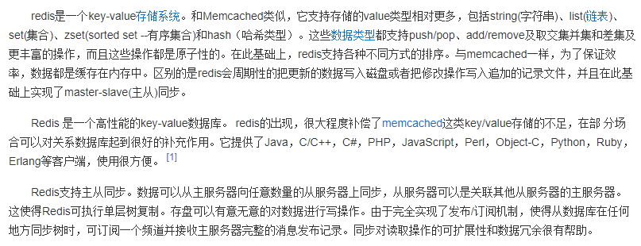
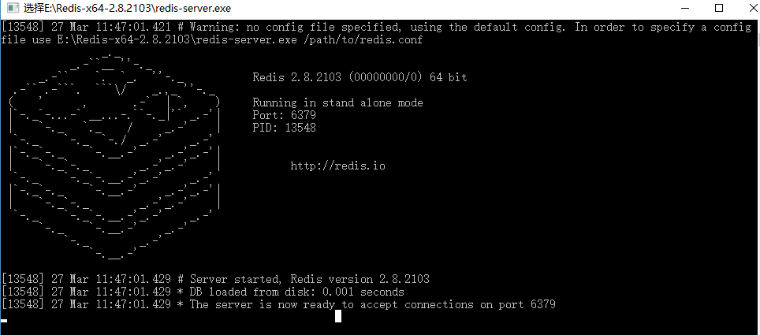
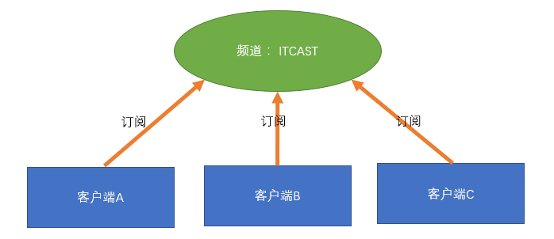
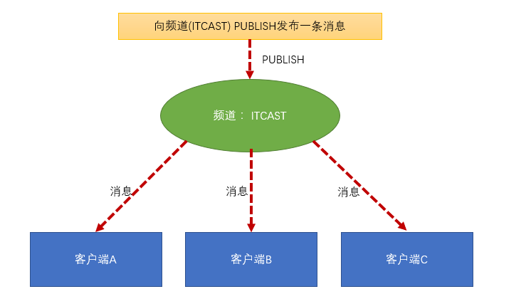
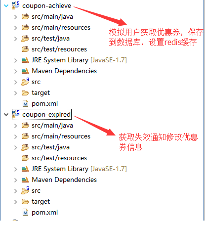
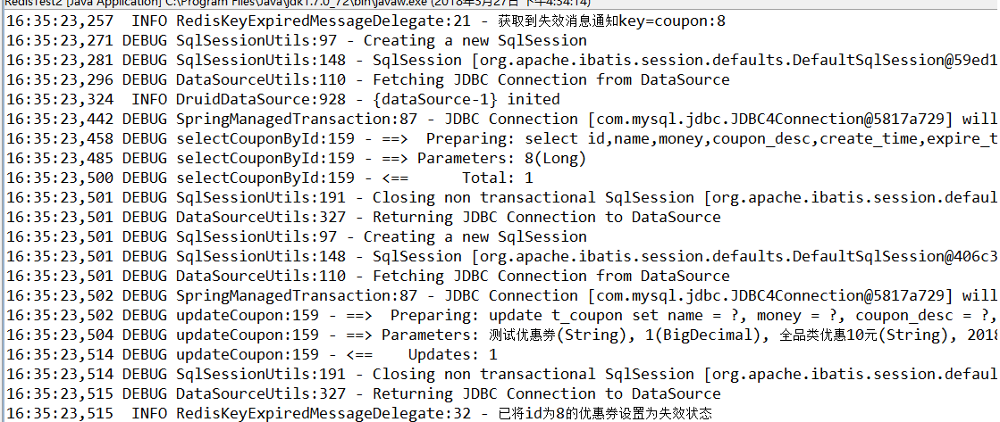

##redis消息通知处理代金券过期问题

###1.过期问题解决方案的分析

#### 1.1 过期问题描述

在电商系统中，秒杀，抢购，红包优惠卷等操作，一般都会设置时间限制，比如订单15分钟不付款自动关闭，红包有效期24小时等等

#### 1.2 常用解决方案分析

目前企业中最常见的解决方案大致分为两种：

1. 使用定时任务处理，定时扫描数据库中过期的数据，然后进行修改。但是为了更加精确的时间控制，定时任务的执行时间会设置的很短，所以会造成很大的数据库压力。
2. 使用消息通知，当数据失效时发送消息，程序接收到失效消息后对响应的数据进行状态修改。此种方式不会对数据库造成太大的压力

### 2.redis介绍及入门

#### 2.1 redis的介绍与安装

#### 2.1.1 redis介绍



#### 2.1.2 redis的安装

为了方便演示，本课程中的redis服务，我们使用的是windows版本的redis服务器。不需要复杂的安装，直接解压运行就可以了。



#### 2.2 redis的基本操作

**key操作**

- DEL：删除Key，  del key1 key2
- EXISTS：检查key是否存在， EXISTS key
- EXPIRE：设置或者更新到期时间，到期后自动清除，单位秒 设置为-1表示永不过期。 EXPIRE key
- TTL：以秒为单位，返回给定key的剩余生存时间。
- KEYS：查看所有key

**String操作**

- Get：获取
- SET：设置（新增  修改）
- SETNX：只有在KEY不存在时设置value。就是新增一个（不包含更新）。

**Hash操作**

- HMSET key field value [field value ...]：同时将多个 field-value (域-值)对设置到哈希表 key 中。
- HSET key field value：将哈希表 key 中的域 field 的值设为 value 。
- HMGET key field [field ...]：返回哈希表 key 中，一个或多个给定域的值。
- HGET key field：返回哈希表 key 中给定域 field 的值。

**List操作**

- LINDEX key index：通过索引获取列表中的元素。
- LPUSH key value1 [value2] ：将一个或多个值插入到列表头部。
- RPUSH key value1 [value2]：在列表中添加一个或多个值。
- LRANGE key start stop ：获取列表指定范围内的元素。

**Set操作**

- SADD key member [member ...]：将一个或多个 member 元素加入到集合 key 当中。
- SMEMBERS key：返回集合中的所有成员。

**Zset操作**

- ZADD key score1 member1 [score2 member2] ：向有序集合添加一个或多个成员。

#### 2.3 redis中的订阅与发布

Redis 发布订阅(pub/sub)是一种消息通信模式：发送者(pub)发送消息，订阅者(sub)接收消息。Redis 客户端可以订阅任意数量的频道。

如图展示：频道ITCAST，以及订阅了此频道的三个客户端（客户端A，客户端B，客户端C）

 

当有新消息通过 PUBLISH 命令发送给频道 ITCAST时， 这个消息就会被发送给订阅它的三个客户端 

### 3.整合SpringData Redis开发

我们使用redis解决过期优惠券和红包等问题，并且在java环境中使用redis的消息通知。目前世面比较流行的java代码操作redis的AIP有：Jedis和RedisTemplate

Jedis是Redis官方推出的一款面向Java的客户端，提供了很多接口供Java语言调用。

SpringData Redis是Spring官方推出，可以算是Spring框架集成Redis操作的一个子框架，封装了Redis的很多命令，可以很方便的使用Spring操作Redis数据库。由于现代企业开发中都使用Spring整合项目，所以在API的选择上我们使用Spring提供的SpringData Redis

#### 3.1 SpringData Redis的介绍

 

特性：

 

#### 3.2 搭建环境

maven工程坐标如下：

```xml
<project xmlns="http://maven.apache.org/POM/4.0.0" xmlns:xsi="http://www.w3.org/2001/XMLSchema-instance"
	xsi:schemaLocation="http://maven.apache.org/POM/4.0.0 http://maven.apache.org/xsd/maven-4.0.0.xsd">
	<modelVersion>4.0.0</modelVersion>
	<groupId>cn.itcast</groupId>
	<artifactId>redis_test</artifactId>
	<version>0.0.1-SNAPSHOT</version>
	<packaging>war</packaging>

	<properties>
		<spring.version>4.2.4.RELEASE</spring.version>
		<slf4j.version>1.6.6</slf4j.version>
		<log4j.version>1.2.12</log4j.version>
		<springdataredis.version>1.7.4.RELEASE</springdataredis.version>
		<mysql.version>5.1.6</mysql.version>
	</properties>

	<dependencies>
		<!-- spring data redis相关坐标 beg -->
		<dependency>
			<groupId>redis.clients</groupId>
			<artifactId>jedis</artifactId>
			<version>2.6.2</version>
		</dependency>
		<dependency>
			<groupId>org.apache.commons</groupId>
			<artifactId>commons-pool2</artifactId>
			<version>2.2</version>
		</dependency>

		<dependency>
			<groupId>org.springframework.data</groupId>
			<artifactId>spring-data-redis</artifactId>
			<version>${springdataredis.version}</version>
		</dependency>
		<!-- spring data redis相关坐标 end -->


		<!-- spring 相关坐标 beg -->
		<dependency>
			<groupId>org.aspectj</groupId>
			<artifactId>aspectjweaver</artifactId>
			<version>1.6.8</version>
		</dependency>

		<dependency>
			<groupId>org.springframework</groupId>
			<artifactId>spring-aop</artifactId>
			<version>${spring.version}</version>
		</dependency>

		<dependency>
			<groupId>org.springframework</groupId>
			<artifactId>spring-context</artifactId>
			<version>${spring.version}</version>
		</dependency>
		
		<dependency>
			<groupId>org.springframework</groupId>
			<artifactId>spring-orm</artifactId>
			<version>${spring.version}</version>
		</dependency>

		<dependency>
			<groupId>org.springframework</groupId>
			<artifactId>spring-beans</artifactId>
			<version>${spring.version}</version>
		</dependency>

		<dependency>
			<groupId>org.springframework</groupId>
			<artifactId>spring-core</artifactId>
			<version>${spring.version}</version>
		</dependency>
		<!-- spring 相关坐标 end -->

		<!-- 日志相关坐标 beg -->
		<dependency>
			<groupId>log4j</groupId>
			<artifactId>log4j</artifactId>
			<version>${log4j.version}</version>
		</dependency>

		<dependency>
			<groupId>org.slf4j</groupId>
			<artifactId>slf4j-api</artifactId>
			<version>${slf4j.version}</version>
		</dependency>

		<dependency>
			<groupId>org.slf4j</groupId>
			<artifactId>slf4j-log4j12</artifactId>
			<version>${slf4j.version}</version>
		</dependency>
		<!-- 日志相关坐标 end -->

		<!-- 单元测试相关坐标 beg -->
		<dependency>
			<groupId>org.springframework</groupId>
			<artifactId>spring-test</artifactId>
			<version>4.2.4.RELEASE</version>
		</dependency>

		<dependency>
			<groupId>junit</groupId>
			<artifactId>junit</artifactId>
			<version>4.10</version>
		</dependency>
		<!-- 单元测试相关坐标 end -->
		
		<!-- druid数据库连接池 beg -->
		<dependency>
			<groupId>com.alibaba</groupId>
			<artifactId>druid</artifactId>
			<version>1.1.9</version>
		</dependency>
		<!-- druid数据库连接池 end -->

		<!-- mysql驱动 beg -->
		<dependency>
			<groupId>mysql</groupId>
			<artifactId>mysql-connector-java</artifactId>
			<version>5.1.6</version>
		</dependency>
		<!-- mysql驱动 end -->
		
		<!-- mybatis核心包 -->
		<dependency>
			<groupId>org.mybatis</groupId>
			<artifactId>mybatis</artifactId>
			<version>3.4.5</version>
		</dependency>
		
		<!-- mybatis整合spring -->
		<dependency>
             <groupId>org.mybatis</groupId>
             <artifactId>mybatis-spring</artifactId>
             <version>1.3.1</version>
         </dependency>
	</dependencies>

	<build>
		<finalName>redis_test</finalName>
		<pluginManagement>
			<plugins>
				<plugin>
					<groupId>org.apache.maven.plugins</groupId>
					<artifactId>maven-compiler-plugin</artifactId>
					<version>3.2</version>
					<configuration>
						<source>1.7</source>
						<target>1.7</target>
						<encoding>UTF-8</encoding>
						<showWarnings>true</showWarnings>
					</configuration>
				</plugin>
			</plugins>
		</pluginManagement>
	</build>
</project>
```

整合springData redis的配置

```xml
<?xml version="1.0" encoding="UTF-8"?>
<beans xmlns="http://www.springframework.org/schema/beans"
	xmlns:xsi="http://www.w3.org/2001/XMLSchema-instance" xmlns:aop="http://www.springframework.org/schema/aop"
	xmlns:context="http://www.springframework.org/schema/context"
	xmlns:jdbc="http://www.springframework.org/schema/jdbc" xmlns:tx="http://www.springframework.org/schema/tx"
	xmlns:task="http://www.springframework.org/schema/task"
	xsi:schemaLocation="
		http://www.springframework.org/schema/beans http://www.springframework.org/schema/beans/spring-beans.xsd
		http://www.springframework.org/schema/aop http://www.springframework.org/schema/aop/spring-aop.xsd
		http://www.springframework.org/schema/context http://www.springframework.org/schema/context/spring-context.xsd
		http://www.springframework.org/schema/jdbc http://www.springframework.org/schema/jdbc/spring-jdbc.xsd
		http://www.springframework.org/schema/tx http://www.springframework.org/schema/tx/spring-tx.xsd
		">
		
	<description>spring-data整合jedis</description>
	
	<!-- springData Redis 核心api-->
	<bean id="redisTemplate" class="org.springframework.data.redis.core.RedisTemplate">
		<property name="connectionFactory" ref="connectionFactory"></property>
		<property name="keySerializer">
			<bean class="org.springframework.data.redis.serializer.StringRedisSerializer"></bean>	
		</property>
		<property name="valueSerializer">
			<bean class="org.springframework.data.redis.serializer.StringRedisSerializer"></bean>
		</property>
	</bean>
	
	<!-- jedis连接工厂 -->
	<bean id="connectionFactory" class="org.springframework.data.redis.connection.jedis.JedisConnectionFactory">
		<property name="hostName" value="127.0.0.1"></property>
		<property name="port" value="6379"></property>
		<property name="database" value="0"></property>
		<property name="poolConfig" ref="poolConfig"></property>
	</bean>
	
	<!-- jedis连接池的配置信息 -->
	<bean id="poolConfig" class="redis.clients.jedis.JedisPoolConfig">
		<property name="maxIdle" value="5"></property>
		<property name="maxTotal" value="10"></property>
		<property name="testOnBorrow" value="true"></property>
	</bean>

</beans>
```

测试环境是否搭建成功

```java
@RunWith(SpringJUnit4ClassRunner.class)
@ContextConfiguration(locations="classpath:applicationContext-data-redis.xml")
public class RedisTest {

	private static Logger log = Logger.getLogger(RedisTest.class);
	
	@Autowired
	private RedisTemplate<String, String> redisTemplate;
	
	@Test
	public void testSend() {
		redisTemplate.opsForValue().set("itcast","very good！");
		String value = redisTemplate.opsForValue().get("itcast");
		log.info("从redis中获取的数据："+value);
	}
}
```

效果：

 


 

至此已经搭建完成了SpringData Redis的操作环境，并且操作成功

### 4.在Java程序中监听redis消息

#### 4.1 配置监听redis消息

如果要在java代码中监听redis的主题消息，我们还需要自定义处理消息的监听器，代码如下

```java
/**
 * 消息监听器：需要实现MessageListener接口
 * 		实现onMessage方法
 */
public class RedisMessageListener implements MessageListener {

	/**
	 * 	处理redis消息：当从redis中获取消息后，打印主题名称和基本的消息
	 */
	public void onMessage(Message message, byte[] pattern) {
		 System.out.println("从channel为" + new String(message.getChannel())
	                + "中获取了一条新的消息,消息内容:" + new String(message.getBody()));
	}

}
```

这样我们就定义好了一个消息监听器，当订阅的频道有一条新的消息发送过来之后，通过此监听器中的onMessage方法处理

当监听器程序写好之后，我们还需要在springData redis的配置文件中添加监听器以及订阅的频道主题，

我们测试订阅的频道为ITCAST,配置如下：

```xml
	<!-- 配置处理消息的消息监听适配器 -->
	<bean class="org.springframework.data.redis.listener.adapter.MessageListenerAdapter" id="messageListener">
		<!-- 构造方法注入：自定义的消息监听 -->
	    <constructor-arg>
	        <bean class="cn.itcast.redis.listener.RedisKeyExpiredMessageDelegate"/>
	    </constructor-arg>
	</bean>
	
	<!-- 消息监听者容器：对所有的消息进行统一管理 -->
	<bean class="org.springframework.data.redis.listener.RedisMessageListenerContainer" id="redisContainer">
	    <property name="connectionFactory" ref="connectionFactory"/>
	    <property name="messageListeners">
	    	<map>
	    		<!-- 配置频道与监听器
	    			将此频道中的内容交由此监听器处理
	    			key-ref：监听，处理消息
	    			ChannelTopic：订阅的消息频道
	    		 -->
	            <entry key-ref="messageListener">
	                <list>
	                    <bean class="org.springframework.data.redis.listener.ChannelTopic">
	                        <constructor-arg value="ITCAST"></constructor-arg>
	                    </bean>
	                </list>
	            </entry>
		    </map>
		 </property>
	</bean>
```

#### 4.2 测试消息

配置好消息监听，已经订阅的主题之后就可以启动程序进行测试了。由于有监听程序在，只需要已java代码的形式启动，创建spring容器（当spring容器加载之后，会创建监听器一直监听对应的消息）。

```java
	public static void main(String[] args) {
		ApplicationContext ac = new ClassPathXmlApplicationContext("applicationContext-data-redis.xml");
	}
```

当程序启动之后，会一直保持运行状态。即订阅了ITCSAT频道的消息，这个时候通过redis的客户端程序（redis-cli）发布一条消息

 

> 命令解释：
>
> publish topic名称 消息内容 ： 向指定频道发送一条消息

发送消息之后，我们在来看java控制台输出验证是否获取到了此消息

 

> 至此我们已经完成了在java代码中获取redis的消息通知

### 5.结合redis的key失效机制和消息完成过期优惠券处理

解决过期优惠券的问题处理起来比较简单：

​	在redis的内部当一个key失效时，也会向固定的频道中发送一条消息，我们只需要监听到此消息获取数据库中的id，修改对应的优惠券状态就可以了。这也带来了一些繁琐的操作：用户获取到优惠券之后需要将优惠券存入redis服务器并设置超时时间。

由于要借助redis的key失效通知，有两个注意事项各位需要注意：

1. 事件通过 Redis 的订阅与发布功能（pub/sub）来进行分发,故需要订阅（/_/_keyevent@0/_/_:expired）频道  0表示db0 根据自己的dbindex选择合适的数字
2. 修改 redis.conf 文件

修改 notify-keyspace-events Ex 

```xml
# K    键空间通知，以__keyspace@<db>__为前缀
# E    键事件通知，以__keysevent@<db>__为前缀
# g    del , expipre , rename 等类型无关的通用命令的通知, ...
# $    String命令
# l    List命令
# s    Set命令
# h    Hash命令
# z    有序集合命令
# x    过期事件（每次key过期时生成）
# e    驱逐事件（当key在内存满了被清除时生成）
# A    g$lshzxe的别名，因此”AKE”意味着所有的事件
```

#### 5.1 模拟过期代金卷案例

前置性的内容已经和大家都介绍完毕，接下来我们就可以使用redis的消息通知结合springDataRedis完成一个过期优惠券的处理，为了更加直观的展示问题，这里准备了两个程序：

 

如图所示：第一个程序（coupon-achieve）用来模拟用户获取一张优惠券并保存到数据库，存入redis缓存。

```java
@RunWith(SpringJUnit4ClassRunner.class)
@ContextConfiguration(locations="classpath:applicationContext.xml")
public class CouponTest {

	@Autowired
	private CouponMapper couponMapper;
	
	@Autowired
	private RedisTemplate<String, String> redisTemplate;
	
	@Test
	public void testSaveCoupon() {
		
		Date now = new Date();
		int timeOut = 1;//设置优惠券的失效时间（一分钟后失效）
		
		//自定义一张优惠券，
		Coupon coupon = new Coupon();
		coupon.setName("测试优惠券");//设置名称
		coupon.setMoney(BigDecimal.ONE);//设置金额
		coupon.setCouponDesc("全品类优惠10元");//设置说明
		coupon.setCreateTime(now);//设置获取时间
		//设置超时时间：优惠券有效期1分钟后超时
		coupon.setExpireTime(DataUtils.addTime(now, timeOut));
		//设置状态：0-可用 1-已失效 2-已使用
		coupon.setState(0);
		couponMapper.saveCoupon(coupon );
		
		/**
		 * 将优惠券信息保存到redis服务器中：
		 * 	为了方便处理，由于我们处理的时候只需要获取id就可以了，
		 * 		所以保存的key设置为coupon:优惠券的主键
		 * 		value：设置为主键
		 */
		redisTemplate.opsForValue().set("coupon:"+coupon.getId(), coupon.getId()+"", (long)timeOut, TimeUnit.MINUTES);
	}
```

第二个程序（coupon-expired）配置消息通知监听redis的key失效，获取通知之后修改优惠券状态

数据库表：

```sql
CREATE TABLE `t_coupon` (
  `id` bigint(20) NOT NULL AUTO_INCREMENT COMMENT '主键',
  `name` varchar(60) DEFAULT NULL COMMENT '优惠券名称',
  `money` decimal(10,0) DEFAULT NULL COMMENT '金额',
  `coupon_desc` varchar(128) DEFAULT NULL COMMENT '优惠券说明',
  `create_time` datetime DEFAULT NULL COMMENT '获取时间',
  `expire_time` datetime DEFAULT NULL COMMENT '失效时间',
  `state` int(1) DEFAULT NULL COMMENT '状态，0-有效，1-已失效，2-已使用',
  PRIMARY KEY (`id`)
) ENGINE=InnoDB AUTO_INCREMENT=4 DEFAULT CHARSET=utf8
```

#### 5.2 配置redis中key失效的消息监听

```xml
<?xml version="1.0" encoding="UTF-8"?>
<beans xmlns="http://www.springframework.org/schema/beans"
	xmlns:xsi="http://www.w3.org/2001/XMLSchema-instance" xmlns:aop="http://www.springframework.org/schema/aop"
	xmlns:context="http://www.springframework.org/schema/context"
	xmlns:jdbc="http://www.springframework.org/schema/jdbc" xmlns:tx="http://www.springframework.org/schema/tx"
	xmlns:task="http://www.springframework.org/schema/task"
	xsi:schemaLocation="
		http://www.springframework.org/schema/beans http://www.springframework.org/schema/beans/spring-beans.xsd
		http://www.springframework.org/schema/aop http://www.springframework.org/schema/aop/spring-aop.xsd
		http://www.springframework.org/schema/context http://www.springframework.org/schema/context/spring-context.xsd
		http://www.springframework.org/schema/jdbc http://www.springframework.org/schema/jdbc/spring-jdbc.xsd
		http://www.springframework.org/schema/tx http://www.springframework.org/schema/tx/spring-tx.xsd
		">
		
	<description>spring-data整合jedis</description>
	
	<!-- springData Redis的核心API -->
	<bean id="redisTemplate" class="org.springframework.data.redis.core.RedisTemplate">
		<property name="connectionFactory" ref="connectionFactory"></property>
		<property name="keySerializer">
			<bean class="org.springframework.data.redis.serializer.StringRedisSerializer"></bean>	
		</property>
		<property name="valueSerializer">
			<bean class="org.springframework.data.redis.serializer.StringRedisSerializer"></bean>
		</property>
	</bean>
	
	<!-- 连接工厂 -->
	<bean id="connectionFactory" class="org.springframework.data.redis.connection.jedis.JedisConnectionFactory">
		<property name="hostName" value="127.0.0.1"></property>
		<property name="port" value="6379"></property>
		<property name="database" value="0"></property>
		<property name="poolConfig" ref="poolConfig"></property>
	</bean>
	
	<!-- 连接池基本配置 -->
	<bean id="poolConfig" class="redis.clients.jedis.JedisPoolConfig">
		<property name="maxIdle" value="5"></property>
		<property name="maxTotal" value="10"></property>
		<property name="testOnBorrow" value="true"></property>
	</bean>
	
	<!-- 配置监听 -->
	<bean class="org.springframework.data.redis.listener.adapter.MessageListenerAdapter" id="messageListener">
	    <constructor-arg>
	        <bean class="cn.itcast.redis.listener.RedisKeyExpiredMessageDelegate"/>
	    </constructor-arg>
	</bean>
	
	<!-- 监听容器 -->
	<bean class="org.springframework.data.redis.listener.RedisMessageListenerContainer" id="redisContainer">
	    <property name="connectionFactory" ref="connectionFactory"/>
	    <property name="messageListeners">
	    	<map>
	            <entry key-ref="messageListener">
	                <list>
	                	<!-- __keyevent@0__:expired  配置订阅的主题名称
	                	此名称时redis提供的名称，标识过期key消息通知
	                			0表示db0 根据自己的dbindex选择合适的数字
	                	 -->
	                    <bean class="org.springframework.data.redis.listener.ChannelTopic">
	                        <constructor-arg value="__keyevent@0__:expired"></constructor-arg>
	                    </bean>
	                </list>
	            </entry>
		    </map>
		 </property>
	</bean>

</beans>
```

#### 5.3 接收失效消息完成过期代金卷处理

```java
package cn.itcast.redis.listener;

import org.springframework.beans.factory.annotation.Autowired;
import org.springframework.data.redis.connection.Message;
import org.springframework.data.redis.connection.MessageListener;

import cn.itcast.entity.Coupon;
import cn.itcast.mapper.CouponMapper;

public class RedisKeyExpiredMessageDelegate implements MessageListener {

	@Autowired
	private CouponMapper couponMapper;
	
	public void onMessage(Message message, byte[] pattern) {
		//1.获取失效的key
		String key = new String(message.getBody());
		//判断是否时优惠券失效通知
		if(key.startsWith("coupon")){
			//2.从key中分离出失效优惠券id
			String redisId = key.split(":")[1];
			//3.查询优惠卷信息
			Coupon coupon = couponMapper.selectCouponById(Long.parseLong(redisId));
			//4.修改状态
			coupon.setState(1);
			//5.更新数据库
			couponMapper.updateCoupon(coupon);
		}
	}
}
```

 测试日志如下：



通过日志我们发现，当优惠券到失效时，redis立即发送一条消息告知此优惠券失效，我们可以在监听程序中获取当前的id，查询数据库修改状态