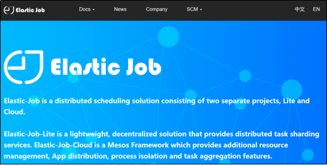
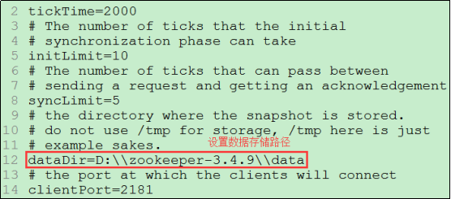
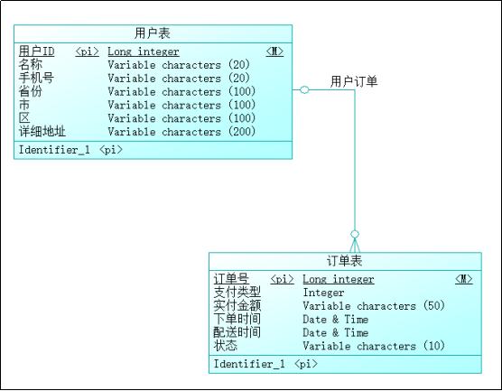
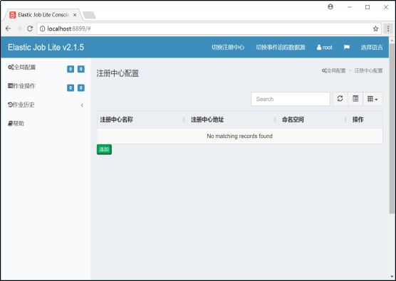
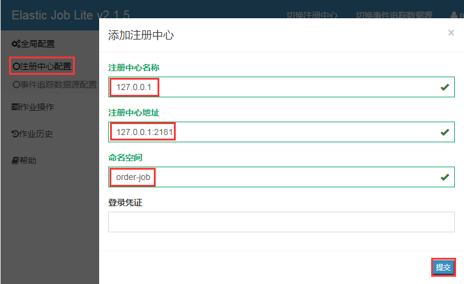

# Elastic Job分布式任务调度

## 1. Elastic Job

## 1.1 前言

我们开发定时任务一般都是使用quartz或者spring-task，无论是使用quartz还是spring-task，我们都会至少遇到两个痛点：

- 不敢轻易跟着应用服务多节点部署，可能会重复多次执行而引发系统逻辑的错误。
- quartz的集群仅仅只是用来HA，节点数量的增加并不能给我们的每次执行效率带来提升，即不能实现水平扩展。

​      说明：Elastic-job分布式任务调度，就可以帮我们解决上面两个痛点。

## 1.2 简介

Elastic-Job是当当开源的一款非常好用的分布式任务调度框架，由两个相互独立的子项目Elastic-Job-Lite和Elastic-Job-Cloud组成。Elastic-Job-Lite定位为轻量级无中心化解决方案，使用jar包的形式提供分布式任务的协调服务。Elastic-Job-Lite这也是本次所要讲解和使用的子项目。

**主要功能**：

- 分布式调度协调
- 弹性扩容缩容
- 失效转移
- 错过执行作业重触发
- 作业分片一致性，保证同一分片在分布式环境中仅一个执行实例
- 自诊断并修复分布式不稳定造成的问题
- 支持并行调度
- 支持作业生命周期操作
- 丰富的作业类型
- Spring整合以及命名空间提供
- 运维平台

 官网**：**http://elasticjob.io

 

## 1.3 基本概念

- #### 分片概念

任务的分布式执行，需要将一个任务拆分为多个独立的任务项，然后由分布式的服务器分别执行某一个或几个分片项。

例如：有一个遍历数据库某张表的作业，现有2台服务器。为了快速的执行作业，那么每台服务器应执行作业的50%。 为满足此需求，可将作业分成2片，每台服务器执行1片。

- #### 分片项与业务处理解耦

Elastic-Job并不直接提供数据处理的功能，框架只会将分片项分配至各个运行中的作业服务器，开发者需要自行处理分片项与真实数据的对应关系。

- #### 个性化参数的适用场景

个性化参数即shardingItemParameter，可以和分片项匹配对应关系，用于将分片项的数字转换为更加可读的业务代码。

例如：按照地区水平拆分数据库，数据库A是北京的数据；数据库B是上海的数据；数据库C是广州的数据。 如果仅按照分片项配置，开发者需要了解0表示北京；1表示上海；2表示广州。 合理使用个性化参数可以让代码更可读，如果配置为0=北京,1=上海,2=广州，那么代码中直接使用北京，上海，广州的枚举值即可完成分片项和业务逻辑的对应关系。

- #### 分布式调度

Elastic-Job-Lite并无作业调度中心节点，而是基于部署作业框架的程序在到达相应时间点时各自触发调度。注册中心仅用于作业注册和监控信息存储。而主作业节点仅用于处理分片和清理等功能。

- #### 作业高可用

Elastic-Job-Lite提供最安全的方式执行作业。将分片总数设置为1，并使用多于1台的服务器执行作业，作业将会以1主n从的方式执行。

一旦执行作业的服务器崩溃，等待执行的服务器将会在下次作业启动时替补执行。开启失效转移功能效果更好，可以保证在本次作业执行时崩溃，备机立即启动替补执行。

- #### 最大限度利用资源

Elastic-Job-Lite也提供最灵活的方式，最大限度的提高执行作业的吞吐量。将分片项设置为大于服务器的数量，最好是大于服务器倍数的数量，作业将会合理的利用分布式资源，动态的分配分片项。

例如：3台服务器，分成10片，则分片项分配结果为服务器A=0,1,2;服务器B=3,4,5;服务器C=6,7,8,9。 如果服务器C崩溃，则分片项分配结果为服务器A=0,1,2,3,4;服务器B=5,6,7,8,9。在不丢失分片项的情况下，最大限度的利用现有资源提高吞吐量。

# 2. Zookeeper安装与配置

第一步：Elastic-Job使用了zookeeper作为注册中心；所以可以解压“资料/zookeeper-3.4.9.tar.gz”文件。

第二步：在解压的“zookeeper-3.4.9“文件夹下创建“data”文件夹

第三步：找到“zookeeper-3.4.9/conf”路径下，复制zoo_sample.cfg 为 zoo.cfg；然后在里面修改存放zookeeper的运行数据和日志的路径dataDir（12行），将该值修改为第二步骤中创建的data文件夹的路径。如下：

 

# 3. Elastic Job入门示例

## 3.1 作业类型说明

Elastic-Job提供Simple、Dataflow和Script 3种作业类型。 方法参数shardingContext包含作业配置、片和运行时信息。可通过getShardingTotalCount(), getShardingItem()等方法分别获取分片总数，运行在本作业服务器的分片序列号等。

- #### Simple类型作业

意为简单实现，未经任何封装的类型。需实现SimpleJob接口。该接口仅提供单一方法用于覆盖，此方法将定时执行。与Quartz原生接口相似，但提供了弹性扩缩容和分片等功能。

- #### Dataflow类型作业

Dataflow类型用于处理数据流，需实现DataflowJob接口。该接口提供2个方法可供覆盖，分别用于抓取(fetchData)和处理(processData)数据。

- #### Script类型作业

意为脚本类型作业，支持shell，python，perl等所有类型脚本。只需通过控制台或代码配置scriptCommandLine即可，无需编码。执行脚本路径可包含参数，参数传递完毕后，作业框架会自动追加最后一个参数为作业运行时信息。

## 3.2 作业开发

### 3.2.1 添加依赖

```xml
<?xml version="1.0" encoding="UTF-8"?>
<project xmlns="http://maven.apache.org/POM/4.0.0"
         xmlns:xsi="http://www.w3.org/2001/XMLSchema-instance"
         xsi:schemaLocation="http://maven.apache.org/POM/4.0.0
         http://maven.apache.org/xsd/maven-4.0.0.xsd">
    <parent>
        <artifactId>elasticjob</artifactId>
        <groupId>cn.itcast</groupId>
        <version>1.0-SNAPSHOT</version>
    </parent>
    <modelVersion>4.0.0</modelVersion>
    <artifactId>elasticjob-test</artifactId>
    <name>elasticjob-test</name>
    <dependencies>
        <dependency>
            <groupId>org.springframework</groupId>
            <artifactId>spring-web</artifactId>
            <version>4.3.10.RELEASE</version>
        </dependency>
        <dependency>
            <groupId>com.dangdang</groupId>
            <artifactId>elastic-job-lite-core</artifactId>
            <version>2.1.5</version>
        </dependency>
        <dependency>
            <groupId>com.dangdang</groupId>
            <artifactId>elastic-job-lite-spring</artifactId>
            <version>2.1.5</version>
        </dependency>
    </dependencies>
    <build>
        <plugins>
            <plugin>
                <groupId>org.apache.maven.plugins</groupId>
                <artifactId>maven-compiler-plugin</artifactId>
                <version>3.3</version>
                <configuration>
                    <target>1.8</target>
                    <source>1.8</source>
                    <encoding>UTF-8</encoding>
                </configuration>
            </plugin>
        </plugins>
    </build>
</project>
```

### 3.2.2 作业类

```java
package cn.itcast.ej.job;
import com.dangdang.ddframe.job.api.ShardingContext;
import com.dangdang.ddframe.job.api.simple.SimpleJob;
/** 作业类 */
public class MyJob implements SimpleJob {
    @Override
    public void execute(ShardingContext context) {
        // 获取分片总数
        int shardingTotalCount = context.getShardingTotalCount();
        // 获取分片项
        int shardingItem = context.getShardingItem();
        // 获取分片参数
        String shardingParameter = context.getShardingParameter();
        System.out.println("作业名称：" + context.getJobName());
        System.out.println("分片总数：" + shardingTotalCount);
        System.out.println("分片项：" + shardingItem);
        System.out.println("分片参数：" + shardingParameter);
        // 对不同的分片项进行处理
        switch (shardingItem){
            case 0:
                System.out.println("第1个分片参数：" + shardingParameter);
                break;
            case 1:
                System.out.println("第2个分片参数：" + shardingParameter);
                break;
            case 2:
                System.out.println("第3个分片参数：" + shardingParameter);
                break;
            case 3:
                System.out.println("第4个分片参数：" + shardingParameter);
                break;
            default:
                System.out.println("==default==");
        }
        System.out.println("============================");
    }
}
```

### 3.2.2 配置文件

src/main/resources/applicationContext-elasticjob.xml：

```xml
<?xml version="1.0" encoding="UTF-8"?>
<beans xmlns="http://www.springframework.org/schema/beans"
       xmlns:xsi="http://www.w3.org/2001/XMLSchema-instance"
       xmlns:reg="http://www.dangdang.com/schema/ddframe/reg"
       xmlns:job="http://www.dangdang.com/schema/ddframe/job"
       xsi:schemaLocation="http://www.springframework.org/schema/beans
       http://www.springframework.org/schema/beans/spring-beans.xsd
       http://www.dangdang.com/schema/ddframe/reg
       http://www.dangdang.com/schema/ddframe/reg/reg.xsd
       http://www.dangdang.com/schema/ddframe/job
       http://www.dangdang.com/schema/ddframe/job/job.xsd">
    <!-- 
        配置作业注册中心
        id: bean的id
        server-lists: 连接zookeeper服务器地址(host1:port,host2:port)
        namespace: zookeeper的命名空间
        base-sleep-time-milliseconds: 等待重试的时间毫秒数(初始值)
        max-sleep-time-milliseconds: 等待重试的最大时间毫秒数
        max-retries: 最大重试次数
    -->
    <reg:zookeeper id="regCenter"
                   server-lists="127.0.0.1:2181"
                   namespace="elastic-job"
                   base-sleep-time-milliseconds="1000"
                   max-sleep-time-milliseconds="3000"
                   max-retries="3"/>
    <!-- 
        配置作业
        registry-center-ref: 引用注册中心
        cron: 配置触发作业时间表达式
        sharding-total-count: 配置分片总数
        class: 配置作业类
        id: 作业名称
        sharding-item-parameters: 分片项对应的参数值, 分片序列号=参数
        多个之间用逗号隔开，分片序列号从0开始，不能大于分片总数
    -->
    <job:simple registry-center-ref="regCenter"
                cron="0/10 * * * * ?"
                sharding-total-count="4"
                class="cn.itcast.ej.job.MyJob"
                id="myJob"
                sharding-item-parameters="0=北京,1=上海,2=广州,3=深圳"/>
</beans>
```

### 3.2.3作业启动

编写测试启动类：MyJobTest.java：

```java
package cn.itcast.ej.job;
import org.springframework.context.support.ClassPathXmlApplicationContext;
public class MyJobTest {
    public static void main(String[] args){
       new ClassPathXmlApplicationContext("applicationContext-elasticjob.xml");
    }
}
```

# 4. Elastic Job实际应用

## 4.1导入数据库脚本

创建elasticjob_db的mysql数据库；然后将“资料”文件夹下的elastic-job.sql数据库脚本文件导入elasticjob_db数据库中。

 

## 4.2需求说明

将已支付的订单根据订单信息模拟调用物流系统接口进行物流配送并将已处理的订单的状态修改为已配送；利用elastic job进行分布式任务调度处理，分别使用如下两种数据分片方式处理数据：

1、使用订单号的id对分片总数求余数方式实现

2、使用用户的city城市属性的不同来实现；也就是如果用户是广州的的话，那么某一台服务器只处理广州或者深圳的用户的订单数据，其它服务器类似的只处理北京或者上海等其它城市数据

## 4.3工程搭建

a. 创建order-job工程(maven打包方式jar)

b. pom.xml配置依赖

```xml
<?xml version="1.0" encoding="UTF-8"?>
<project xmlns="http://maven.apache.org/POM/4.0.0"
         xmlns:xsi="http://www.w3.org/2001/XMLSchema-instance"
         xsi:schemaLocation="http://maven.apache.org/POM/4.0.0
         http://maven.apache.org/xsd/maven-4.0.0.xsd">
    <parent>
        <artifactId>elasticjob</artifactId>
        <groupId>cn.itcast</groupId>
        <version>1.0-SNAPSHOT</version>
    </parent>
    <modelVersion>4.0.0</modelVersion>
    <artifactId>order-job</artifactId>
    <name>order-job</name>
    <dependencies>
        <dependency>
            <groupId>org.springframework</groupId>
            <artifactId>spring-web</artifactId>
            <version>4.3.10.RELEASE</version>
        </dependency>
        <dependency>
            <groupId>org.springframework</groupId>
            <artifactId>spring-jdbc</artifactId>
            <version>4.3.10.RELEASE</version>
        </dependency>
        <!-- MySql -->
        <dependency>
            <groupId>mysql</groupId>
            <artifactId>mysql-connector-java</artifactId>
            <version>5.1.38</version>
        </dependency>
        <!-- 连接池 -->
        <dependency>
            <groupId>com.alibaba</groupId>
            <artifactId>druid</artifactId>
            <version>1.0.9</version>
        </dependency>
        <!-- Mybatis -->
        <dependency>
            <groupId>org.mybatis</groupId>
            <artifactId>mybatis</artifactId>
            <version>3.4.1</version>
        </dependency>
        <dependency>
            <groupId>org.mybatis</groupId>
            <artifactId>mybatis-spring</artifactId>
            <version>1.3.1</version>
        </dependency>
        <dependency>
            <groupId>com.dangdang</groupId>
            <artifactId>elastic-job-lite-core</artifactId>
            <version>2.1.5</version>
        </dependency>
        <dependency>
            <groupId>com.dangdang</groupId>
            <artifactId>elastic-job-lite-spring</artifactId>
            <version>2.1.5</version>
        </dependency>
    </dependencies>
    <build>
        <plugins>
            <plugin>
                <groupId>org.apache.maven.plugins</groupId>
                <artifactId>maven-compiler-plugin</artifactId>
                <version>3.3</version>
                <configuration>
                    <source>1.8</source>
                    <target>1.8</target>
                    <encoding>UTF-8</encoding>
                </configuration>
            </plugin>
        </plugins>
    </build>
</project>
```

c. 提供applicationContext.xml配置整合MyBatis：

```xml
<?xml version="1.0" encoding="UTF-8"?>
<beans xmlns="http://www.springframework.org/schema/beans"
       xmlns:xsi="http://www.w3.org/2001/XMLSchema-instance"
       xmlns:tx="http://www.springframework.org/schema/tx"
       xmlns:context="http://www.springframework.org/schema/context"
       xsi:schemaLocation="http://www.springframework.org/schema/beans
       http://www.springframework.org/schema/beans/spring-beans.xsd
       http://www.springframework.org/schema/tx
       http://www.springframework.org/schema/tx/spring-tx.xsd
       http://www.springframework.org/schema/context
       http://www.springframework.org/schema/context/spring-context.xsd">

    <!-- 配置 读取properties文件 -->
    <context:property-placeholder
            location="classpath:jdbc.properties"/>

    <!-- 配置数据源 -->
    <bean id="dataSource" class="com.alibaba.druid.pool.DruidDataSource"
          destroy-method="close">
        <!-- 数据库驱动 -->
        <property name="driverClassName" value="${jdbc.driverClassName}"/>
        <!-- 连接数据库URL -->
        <property name="url" value="${jdbc.url}"/>
        <!-- 数据库的用户名 -->
        <property name="username" value="${jdbc.username}"/>
        <!-- 数据库的密码 -->
        <property name="password" value="${jdbc.password}"/>
        <!-- 初始化连接数 -->
        <property name="initialSize" value="${jdbc.initialSize}"/>
        <!-- 最大连接数 -->
        <property name="maxActive" value="${jdbc.maxActive}"/>
        <!-- 配置获取连接等待超时的时间 -->
        <property name="maxWait" value="${jdbc.maxWait}"/>
        <!-- 最小空闲连接数 -->
        <property name="minIdle" value="${jdbc.minIdle}"/>
    </bean>

    <!-- 配置SqlSessionFactory -->
    <bean class="org.mybatis.spring.SqlSessionFactoryBean">
        <!-- 设置数据源 -->
        <property name="dataSource" ref="dataSource"/>
        <!-- 设置加载MyBatis全局配置文件 -->
        <property name="configLocation" value="classpath:mybatis-config.xml"/>
        <!-- 设置加载mapper映射文件 -->
        <property name="mapperLocations" value="classpath:mappers/**/*.xml"/>
        <!-- 设置类型别名采用包扫描 -->
        <property name="typeAliasesPackage" value="cn.itcast.order.pojo"/>
    </bean>

    <!-- 配置数据访问接口采用包扫描 -->
    <bean class="org.mybatis.spring.mapper.MapperScannerConfigurer">
        <!-- 设置基础扫描包 -->
        <property name="basePackage" value="cn.itcast.order.mapper"/>
    </bean>

    <!-- 配置事务管理器 -->
    <bean id="transactionManager"
          class="org.springframework.jdbc.datasource.DataSourceTransactionManager">
        <property name="dataSource" ref="dataSource"/>
    </bean>

    <!-- 开启事务注解驱动 -->
    <tx:annotation-driven transaction-manager="transactionManager"/>
    <!-- 配置service扫描 -->
    <context:component-scan base-package="cn.itcast.order"/>
</beans>
```

d. 提供jdbc.properties：

```nginx
jdbc.driverClassName=com.mysql.jdbc.Driver
jdbc.url=jdbc:mysql://localhost:3306/elasticjob_db
jdbc.username=root
jdbc.password=root
jdbc.initialSize=5
jdbc.maxActive=150
jdbc.maxWait=60000
jdbc.minIdle=5
```

e. 提供mybatis-config.xml：

```xml
<?xml version="1.0" encoding="UTF-8" ?>
<!DOCTYPE configuration
  PUBLIC "-//mybatis.org//DTD Config 3.0//EN"
  "http://mybatis.org/dtd/mybatis-3-config.dtd">
<configuration>
	<settings>
		<!-- 开启驼峰自动映射 -->
		<setting name="mapUnderscoreToCamelCase" value="true"/>
	</settings>
</configuration>
```

f. 提供mappers/OrderMapper.xml:

```xml
<?xml version="1.0" encoding="UTF-8" ?>
<!DOCTYPE configuration
        PUBLIC "-//mybatis.org//DTD Config 3.0//EN"
        "http://mybatis.org/dtd/mybatis-3-config.dtd">
<configuration>
    <settings>
        <!-- 开启驼峰自动映射 -->
        <setting name="mapUnderscoreToCamelCase" value="true"/>
    </settings>
</configuration>
```

g. 项目分包，拷贝pojo，创建OrderMapper.java，OrderService.java，OrderServiceImpl.java

## 4.4作业类

```java
package cn.itcast.order.job;

import cn.itcast.order.pojo.Order;
import cn.itcast.order.service.OrderService;
import com.dangdang.ddframe.job.api.ShardingContext;
import com.dangdang.ddframe.job.api.simple.SimpleJob;
import org.apache.commons.lang3.StringUtils;
import org.springframework.beans.factory.annotation.Autowired;
import java.util.List;

/** 订单作业类*/
public class OrderJob implements SimpleJob {
    @Autowired
    private OrderService orderService;
    @Override
    public void execute(ShardingContext shardingContext) {
        // 获取分片总数
        int shardingTotalCount = shardingContext.getShardingTotalCount();
        // 获取当前分片项
        int shardingItem = shardingContext.getShardingItem();
        // 获取当前分片参数(城市)
        String shardingParameter = shardingContext.getShardingParameter();
        // 定义该分片需要处理的订单数据
        List<Order> orders = null;
        // 判断当前分片参数
        if (StringUtils.isNoneBlank(shardingParameter)){
            // 如果有，就代表当前分片只处理该城市的订单(根据城市查询订单)
            orders = orderService.findOrderByCity(shardingParameter);
        }else{
            // 如果没有，采用【订单号 % 分片总数 = 当前分片项】方式查询需要处理的订单
            orders = orderService.findOrderBySharding(
                    shardingTotalCount, shardingItem);
        }
        // 处理订单数据
        if (orders != null && orders.size() > 0){
            // 判断当前分片参数
            if (StringUtils.isNoneBlank(shardingParameter)){
                System.out.println("分片参数：" + shardingParameter + "订单数据处理中..");
            }else{
                System.out.println("分片项：" + shardingItem + "订单数据处理中..");
            }
            // 迭代所有需要处理的订单
            for (Order order : orders){
                // 调用物流系统接口进行物流配送
                System.out.println("订单号：" + order.getOrderId() + "正在处理中...");
                // 更新订单状态(已配送)
                orderService.updateOrderStatus("3", order.getOrderId());
                System.out.println("订单号：" + order.getOrderId() + "处理完成.");
            }
            // 判断当前分片参数
            if (StringUtils.isNoneBlank(shardingParameter)){
                System.out.println("分片参数：" + shardingParameter +"订单数据处理完成。");
            }else{
                System.out.println("分片项：" + shardingItem + "订单数据处理处理完成。");
            }
        }
    }
}
```

## 4.5业务层

OrderService.java：

```java
public interface OrderService {
    /**
     * 根据分片项参数查询该分片需要处理的订单
     * @param shardingParameter 分片参数(城市)
     * @return 需要处理的订单集合
     */
    List<Order> findOrderByCity(String shardingParameter);

    /**
     * 根据订单号 % 分片总数 = 分片项 查询需要处理的订单
     * 11312801(订单号) % 4(分片总数) = 0(分片项)
     * @param shardingTotalCount 分片总数
     * @param shardingItem 分片项
     * @return 需要处理的订单集合
     */
    List<Order> findOrderBySharding(int shardingTotalCount, int shardingItem);

    /**
     * 更新订单状态(已配送)
     * @param status 状态码
     * @param orderId 订单号
     */
    void updateOrderStatus(String status, Long orderId);
}
```

OrderServiceImpl：

```java
@Service
@Transactional
public class OrderServiceImpl implements OrderService {
    @Autowired
    private OrderMapper orderMapper;
    /**
     * 根据分片项参数查询该分片需要处理的订单
     * @param shardingParameter 分片参数(城市)
     * @return 需要处理的订单集合
     */
    public List<Order> findOrderByCity(String shardingParameter){
        return orderMapper.findOrderByCity(shardingParameter);
    }

    /**
     * 根据订单号 % 分片总数 = 分片项 查询需要处理的订单
     * 11312801(订单号) % 4(分片总数) = 0(分片项)
     * @param shardingTotalCount 分片总数
     * @param shardingItem 分片项
     * @return 需要处理的订单集合
     */
    public List<Order> findOrderBySharding(int shardingTotalCount, int shardingItem){
        return orderMapper.findOrderBySharding(shardingTotalCount, shardingItem);
    }
    /**
     * 更新订单状态(已配送)
     * @param status 状态码
     * @param orderId 订单号
     */
    public void updateOrderStatus(String status, Long orderId){
        orderMapper.updateOrderStatus(status, orderId);
    }
}
```

## 4.6 数据访问层

OrderMapper.java

```java
public interface OrderMapper {

    /** 根据城市查询需要处理的订单 */
    @Select("SELECT o.* FROM tb_order AS o, tb_user AS u WHERE " +
            "u.user_id = o.user_id AND o.state = 2 AND u.city=#{city}")
    List<Order> findOrderByCity(String city);

    /** 根据订单号 % 分片总数 = 分片项 查询需要处理的订单 */
    @Select("SELECT o.* FROM tb_order AS o, tb_user AS u WHERE " +
            "u.user_id = o.user_id AND o.state = 2 AND " +
            "MOD(order_id, #{t}) = #{s}")
    List<Order> findOrderBySharding(@Param("t") int shardingTotalCount,
                                    @Param("s") int shardingItem);

    /** 更新订单状态(已配送) */
    @Update("UPDATE tb_order SET state = #{status}, delivery_time = NOW() " +
            "WHERE order_id = #{orderId}")
    void updateOrderStatus(@Param("status") String status,
                           @Param("orderId") Long orderId);
}
```

## 4.7 配置文件

applicationContext-elasticjob.xml

```xml
<?xml version="1.0" encoding="UTF-8"?>
<beans xmlns="http://www.springframework.org/schema/beans"
       xmlns:xsi="http://www.w3.org/2001/XMLSchema-instance"
       xmlns:reg="http://www.dangdang.com/schema/ddframe/reg"
       xmlns:job="http://www.dangdang.com/schema/ddframe/job"
       xsi:schemaLocation="http://www.springframework.org/schema/beans
       http://www.springframework.org/schema/beans/spring-beans.xsd
       http://www.dangdang.com/schema/ddframe/reg
       http://www.dangdang.com/schema/ddframe/reg/reg.xsd
       http://www.dangdang.com/schema/ddframe/job
       http://www.dangdang.com/schema/ddframe/job/job.xsd">
    <!-- 配置作业注册中心
        id: bean的id
        server-lists: 连接zookeeper服务器地址(host1:port,host2:port)
        namespace: zookeeper的命名空间
        base-sleep-time-milliseconds: 等待重试的时间毫秒数(初始值)
        max-sleep-time-milliseconds: 等待重试的最大时间毫秒数
        max-retries: 最大重试次数
    -->
    <reg:zookeeper id="regCenter"
                   server-lists="127.0.0.1:2181"
                   namespace="order-job"
                   base-sleep-time-milliseconds="1000"
                   max-sleep-time-milliseconds="3000"
                   max-retries="3"/>
    <!-- 配置作业
        registry-center-ref: 引用注册中心
        cron: 配置触发作业时间表达式
        sharding-total-count: 配置分片总数
        class: 配置作业类
        id: 作业名称
        sharding-item-parameters: 分片项对应的参数值, 分片序列号=参数
        多个之间用逗号隔开，分片序列号从0开始，不能大于分片总数
    -->
    <job:simple registry-center-ref="regCenter"
                cron="0/10 * * * * ?"
                sharding-total-count="4"
                class="cn.itcast.order.job.OrderJob"
                id="orderJob"
                sharding-item-parameters="0=北京,1=上海,2=广州,3=深圳"/>
</beans>
```

## 4.8 作业启动

编写作业启动测试类：OrderJobTest.java

```java
package cn.itcast.order;
import org.springframework.context.support.ClassPathXmlApplicationContext;
public class OrderJobTest {
    public static void main(String[] args){
        new ClassPathXmlApplicationContext("applicationContext*.xml");
    }
}
```

启动上面的测试类4次（也就是执行上面的类的main方法多次），模拟多个应用服务器即可。(分布式任务调度)

# 5. Elastic Job运维平台

运维平台和elastic-job-lite并无直接关系，是通过读取作业注册中心数据展现作业状态，或更新注册中心数据修改全局配置。

## 5.1 安装&启动

解压“资料/elastic-job-lite-console-2.1.5.tar.gz”文件，然后进入解压后的文件夹“elastic-job-lite-console-2.1.5/bin”双击“start.bat”

## 5.2 登录访问

打开浏览器访问http://localhost:8899/即可访问控制台。

提供两种账户，管理员及访客，管理员拥有全部操作权限，访客仅拥有察看权限。默认管理员用户名和密码是root/root，访客用户名和密码是guest/guest，可通过conf/auth.properties修改管理员及访客用户名及密码。

 

## 5.3 添加注册中心

 

## 5.4 连接注册中心

 

## 5.5 作业操作

 

