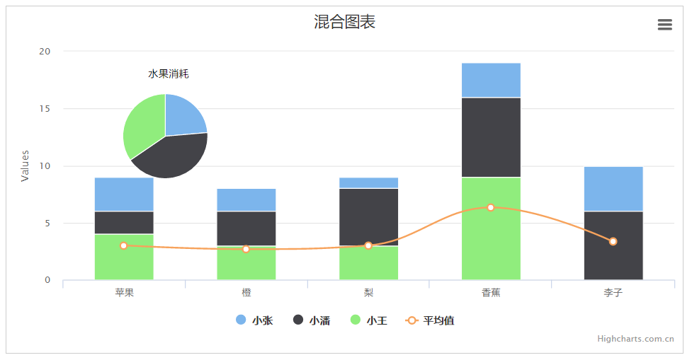
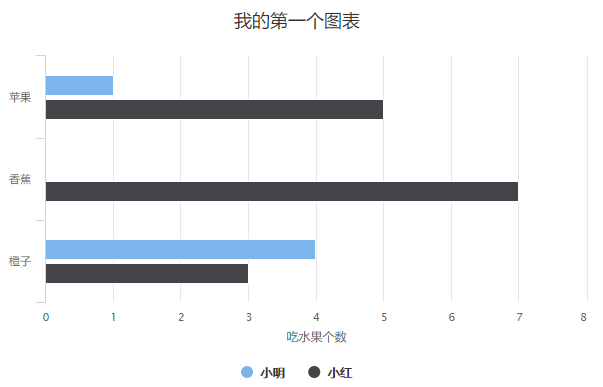
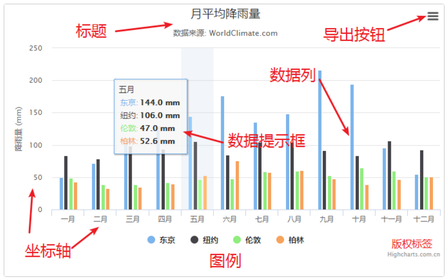
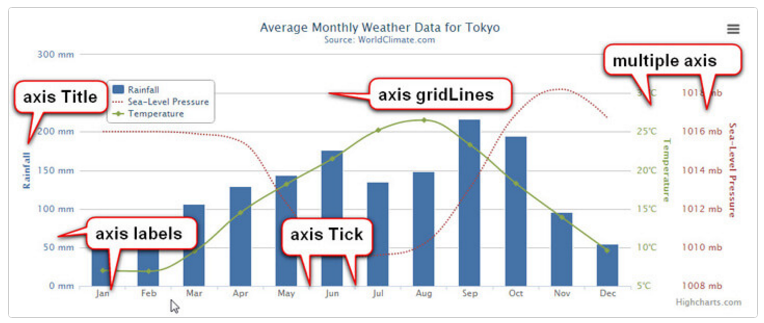
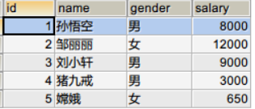
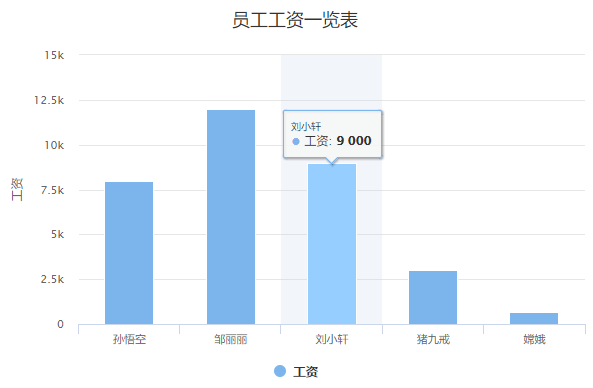
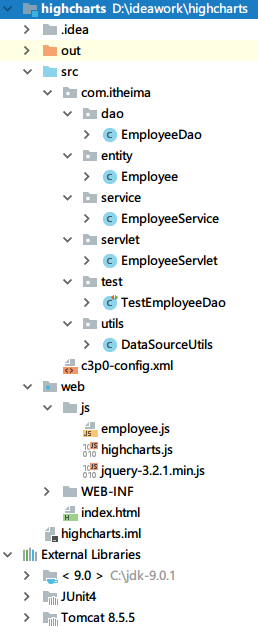

# 利用jQuery+Ajax+HighCharts打造项目图表

# 学习内容

1. HighCharts概述
2. HighCharts的快速上手
3. HighCharts基础教程
4. HighCharts综合应用案例
5. HighCharts小结

# HighCharts概述

## HighCharts的作用

​	在JavaEE企业级项目开发中，很多项目都会用到数据的统计和图表的展示功能，如：各种股票系统，银行的资金结算，公司的财务报表等等。如何快速高效的开发这些图表是一件麻烦的事。

​	

​	本次课讲解一个优秀的工具——HighCharts来帮助大家实现这类功能。	

​	HighCharts是非常棒的一个jQuery插件，简单来说highcharts和大多数的浏览器都兼容，甚至是iphone。支持很多类型的图表。并且是动态的插件，你可以轻松在创建图表后添加，删除，修改数列，轴或者点，并且可以从外部加载文件数据，同时支持提示条，甚至还支持缩放和翻转。

## HighCharts的介绍

​	Highcharts 是一个用纯 JavaScript 编写的一个图表库， 能够很简单便捷的在 Web 网站或是 Web 应用程序添加有交互性的图表，并且免费提供给个人学习、个人网站和非商业用途使用。

​	Highcharts 支持的图表类型有直线图、曲线图、区域图、柱状图、饼状图、散状点图、仪表图、气泡图、瀑布流图等多达 20 种图表，其中很多图表可以集成在同一个图形中形成混合图。

# HighCharts的快速上手

## 获取 Highcharts

​	通过官网下载页面获取资源包，资源包包含所有相关文件的源代码及压缩版本，丰富的实例及使用说明文档。官网的下载地址是：https://www.hcharts.cn/download，如下图所示，下载左边第一个即可。也可以直接使用本教程提供的包：Highcharts-6.0.7.zip


## 引入 Highcharts

​	Highcharts 最基本的运行只需要一个 JS 文件，即 highcharts.js，	将上面的压缩包解压，从code文件夹下可以找到，复制到自己项目中的js文件夹。对应的代码是：

```
<script src="js/highcharts.js"></script>
```

## 创建一个简单的图表

​	在绘图前我们需要为 Highcharts 准备一个 DOM 容器，并指定其大小

```html
<div id="container" style="width: 600px;height:400px;"></div>
```

​	然后通过 Highcharts 的初始化函数 Highcharts.chart 来创建图表，该函数接受两个参数，第一个参数是 容器的 Id，第二个参数是图表配置，代码如下：

```html
<!DOCTYPE html>
<html>
<head>
    <meta charset="utf-8">
    <title>第一个 Highcharts 图表</title>
</head>
<body>
    <!-- 图表容器 DOM -->
    <div id="container" style="width: 600px;height:400px;"></div>
    <!-- 引入 highcharts.js -->
    <script src="js/highcharts.js"></script>
    <script>
        // 图表配置
        var options = {
            chart: {
                type: 'bar'                          //指定图表的类型，默认是折线图（line）
            },
            title: {
                text: '我的第一个图表'                 // 标题
            },
            xAxis: {
                categories: ['苹果', '香蕉', '橙子']   // x 轴分类
            },
            yAxis: {
                title: {
                    text: '吃水果个数'                // y 轴标题
                }
            },
            series: [{                              // 数据列
                name: '小明',                        // 数据列名
                data: [1, 0, 4]                     // 数据
            }, {
                name: '小红',
                data: [5, 7, 3]
            }]
        };
        // 图表初始化函数
        var chart = Highcharts.chart('container', options);
    </script>
</body>
</html>
```

这样你的第一个图表就诞生了！



# HighCharts基础教程

## 图表主要组成

一般情况下，Highcharts 包含**标题**（Title）、**坐标轴**（Axis）、**数据列**（Series）、**数据提示框**（Tooltip）、**图例**（Legend）、**版权标签**（Credits）等，另外还可以包括**导出功能按钮**（Exporting）等。

Highcharts 基本组成部分如下图所示



### 1. 标题（Title）

图表标题，包含标题和副标题（subTitle），其中副标题不是必须的。

### 2. 坐标轴（Axis）

坐标轴包含x轴（xAxis）和y轴（yAxis）。通常情况下，x轴显示在图表的底部，y轴显示在图表的左侧。多个数据列可以共同使用同一个坐标轴，为了对比或区分数据，Highcharts提供了多轴的支持。

### 3. 数据列（Series）

数据列即图表上一个或多个数据系列，比如曲线图中的一条曲线，柱状图中的一个柱形。

### 4. 数据提示框（Tooltip）

当鼠标悬停在某点上时，以框的形式提示该点的数据，比如该点的值、数据单位等。数据提示框内提示的信息可以通过格式化函数动态指定。

### 5. 图例（Legend）

图例是图表中用不同形状、颜色、文字等 标示不同数据列，通过点击标示可以显示或隐藏该数据列。

### 6. 版权标签（Credits）

显示在图表右下方的包含链接的文字，默认是Highcharts官网地址。通过指定credits.enabled=false即可不显示该信息。

### 7. 导出功能（Exporting）

通过引入 exporting.js即可增加图表导出为常见文件功能。

## 图表配置

### 图表容器

Highcharts 实例化中绑定容器的方式有很多种方式

#### 1、通过构造函数

```
var charts = Highcharts.chart('container', {
  // Highcharts 配置
});
```

#### 2、如果你的页面已经引入了 jQuery，那么还可以 jQuery 插件的形式调用

```
$("#container").highcharts({
    // Highcharts 配置  
}); 
```

### 图表样式

#### 宽度、高度

Highcharts 图表的高度和宽度是根据 DIV 容器的宽高来设定的，即

```
<div id="container" style="width:400px;height:400px"></div>
```

## 标题

标题默认显示在图表的顶部，包括标题和副标题（subTitle），其中副标题是非必须的。设置标题和副标题的示例代码如下：

```
title: {
    text: '我是标题'
},
subtitle: {
    text: '我是副标题'
}
```

## 坐标轴

​	普通的二维数据图都有X轴和Y轴，默认情况下，x轴显示在图表的底部，y轴显示在左侧（多个y轴时可以是显示在左右两侧）



### 坐标轴组成部分

#### 坐标轴标题

坐标轴标题。默认情况下，x轴为`null`（也就是没有title），y轴为`'Value'`，设置坐标轴标题的代码如下：

```
xAxis:{
   title:{
       text:'x轴标题'
   }
}
yAxis:{
   title:{
       text:'y轴标题'
   }
}
```

#### 坐标轴刻度标签

坐标轴标签（分类）。Labels常用属性有`enabled`、`formatter`、`step`、`staggerLines`

##### 1）enabled

是否启用Labels。x，y轴默认值都是`true`，如果想禁用（或不显示）Labels，设置该属性为`false`即可。

##### 2）Formatter

标签格式化函数。默认实现是：

```
formatter:function(){
    return this.value;
}
```

`this.value`代码坐标轴上当前点的值（也就是x轴当前点的x值，y轴上当前点的y值）

##### 3）Step

Labels显示间隔，数据类型为number（或int）

## 数据列

### 什么是数据列

数据列是一组数据集合，例如一条线，一组柱形等。图表中所有点的数据都来自数据列对象，数据列的基本构造是：

```
series : [{
    name : '',
    data : []
}] 
```

提示：数据列配置是个数组，也就是数据配置可以包含多个数据列。一个name和data表示一组数据列

数据列中的 `name` 代表数据列的名字，并且会显示在数据提示框（Tooltip）及图例（Legend）中。

### 数据列中的数据

在数据列的 `data` 属性中，我们可以定义图表的数据数组，定义方式：

1. 数值数组。在这种情况下，配置数组中的数值代表 Y 值，X 值则根据 X 轴的配置，要么自动计算，要么从 0 起自增；在分类轴中， X 值就是 `categoies` 配置，数值数组配置实例如下：

```
data : [1, 4, 6, 9, 10] 
```

2. 包含两个值的数组集合。在这种情况下，集合中数组的第一个值代表 X， 第二个值代表 Y；如果第一个值是字符串，则代表该点的名字，并且 X 值会如 **1** 中所说的情况决定。数组集合的实例：

```
data ： [ [5, 2], [6,3], [8,2] ]
```

## 图表类型

Highcharts 支持多种图表类型，可以针对不同的数据都用合理的图表类型来展现。

Highcharts 目前支持直线图、曲线图、曲线面积图、面积图、面积范围图、柱状图、条形图、饼图、散点图、气泡图、仪表图等丰富的图表类型。

### 图表类型配置

在 Highcharts 中，可以通过 `chart.type` 来设置所有默认的图表类型

```
chart: {
    type: 'spline'
}
```

## 示例：饼型图的制作

### 案例要求：

​	制作浏览器的市场占有比例，使用饼型图来完成。

### 案例效果：


### 案例代码：

``` html
<!DOCTYPE html>
<html lang="en">
<head>
    <meta charset="UTF-8">
    <title>Title</title>
    <!-- 引入 highcharts.js -->
    <script src="js/jquery-3.2.1.min.js"></script>
    <script src="js/highcharts.js"></script>
</head>
<body>
<div id="container" style="min-width:400px;height:400px"></div>
<script type="text/javascript">
    $(function () {
        $('#container').highcharts({
            chart: {
                type: 'pie'  //图表类型
            },
            title: {
                text: '2018 某网站各浏览器浏览量占比'  //设置主标题
            },
            series: [{
                name: '浏览器访问量占比',  //数据名字
                data: [
                    ['Firefox',   45.0],  
                    ['IE',       26.8],
                    ['Chrome',   12.8],
                    ['Safari',    8.5],
                    ['Opera',     6.2],
                    ['其他',   0.7]
                ]
            }]
        });
    });
</script>
</body>
</html>
```

# HighCharts综合应用案例

### 开发环境与开发组件：

1. 开发工具Intellij IDEA 
2. jQuery 3.2.1+ Highcharts-6.0.7
3. Web容器：Tomcat8.5
4. 数据库MySQL 5.5.4
5. 数据库访问技术：C3P0连接池+DbUtils工具包
6. Web层：Servlet3.0 + HTML5
7. flexjson将数据库查询到的数据转成JSON格式
8. 使用JUnit进行单元测试

### 案例需求：

1. 下面我们利用jQuery+Ajax+HighCharts打造一个项目图表，显示所有员工的表格数据和矩形图。
2.  在mysql数据库中有如下表和数据
3. 将员工信息从数据库中读取出来以柱形图的方式显示在HTML页面上



### 案例效果：



### 开发步骤：

1. 在mysql的test数据库中创建员工表employee

   ```sql
   -- 创建员工表
   create table employee (
   	id int primary key auto_increment,
   	name varchar(20) not null,
   	gender char(1) default '男',
   	salary double
   );

   -- 插入5条数据
   insert into employee (name,gender,salary) values 
   ('孙悟空','男',8000),('邹丽丽','女',12000),('刘小轩','男',9000),('猪九戒','男',3000),('嫦娥','女',650);
   ```

2. 在idea中创建JavaEE工程，整个项目结构如下：

   

   

3. 创建数据源工具类DataSourceUtils.java

   ```java
   package com.itheima.utils;

   import com.mchange.v2.c3p0.ComboPooledDataSource;
   import javax.sql.DataSource;
   /**
    * 数据源的工具类
    */
   public class DataSourceUtils {
   	/**
   	 * 创建私有静态数据源成员变量
   	 */
   	private static ComboPooledDataSource ds = new ComboPooledDataSource();

   	/**
   	 * 创建公有的得到数据源的方法
   	 */
   	public static DataSource getDataSource() {
   		return ds;
   	}
   }
   ```

   

4. 复制C3P0的配置文件c3p0-config.xml到src目录下

   ```xml
   <?xml version="1.0" encoding="UTF-8"?>
   <c3p0-config>
   	<!-- 默认配置 -->
     <default-config>
     	<!-- 配置数据库连接信息 -->
       <property name="user">root</property>
       <property name="password">root</property>
       <property name="jdbcUrl">jdbc:mysql://localhost:3306/test</property>
       <property name="driverClass">com.mysql.jdbc.Driver</property>
     </default-config>
   </c3p0-config>
   ```

   

5. 创建实体类Employee用于封装每条记录

   ```java
   package com.itheima.entity;

   public class Employee {
       private int id;
       private String name;
       private String gender;
       private double salary;

       public int getId() {
           return id;
       }

       public void setId(int id) {
           this.id = id;
       }

       public String getName() {
           return name;
       }

       public void setName(String name) {
           this.name = name;
       }

       public String getGender() {
           return gender;
       }

       public void setGender(String gender) {
           this.gender = gender;
       }

       public double getSalary() {
           return salary;
       }

       public void setSalary(double salary) {
           this.salary = salary;
       }

       @Override
       public String toString() {
           return "Employee{" +
                   "id=" + id +
                   ", name='" + name + '\'' +
                   ", gender='" + gender + '\'' +
                   ", salary=" + salary +
                   '}';
       }
   }
   ```

   

6. 创建EmployeeDao用于查询数据中所有的记录，使用DbUtils组件来实现

   ```java
   package com.itheima.dao;

   import com.itheima.entity.Employee;
   import com.itheima.utils.DataSourceUtils;
   import org.apache.commons.dbutils.QueryRunner;
   import org.apache.commons.dbutils.handlers.BeanListHandler;

   import java.sql.SQLException;
   import java.util.List;

   public class EmployeeDao {

       private QueryRunner runner = new QueryRunner(DataSourceUtils.getDataSource());

       public List<Employee> findAllEmployees() {
           try {
               return runner.query("select * from employee", new BeanListHandler<>(Employee.class));
           } catch (SQLException e) {
               e.printStackTrace();
               throw new RuntimeException(e);
           }
       }
   }
   ```

   

7. 使用JUnit测试一下编写的Dao方法，同时测试一下JSON对象转换是否正确。这里使用flexjson组件进行转换。

   ```java
   package com.itheima.test;

   import com.itheima.dao.EmployeeDao;
   import com.itheima.entity.Employee;
   import flexjson.JSONSerializer;
   import org.junit.Test;

   import java.util.List;

   public class TestEmployeeDao {

       private EmployeeDao employeeDao = new EmployeeDao();

       @Test
       public void testFindAll() {
           List<Employee> employees = employeeDao.findAllEmployees();
           for (Employee employee : employees) {
               System.out.println(employee);
           }
       }

       @Test
       public void testToJSON() {
           List<Employee> employees = employeeDao.findAllEmployees();
           //创建JSON转换器
           JSONSerializer serializer = new JSONSerializer();
           //去除class属性
           serializer.exclude("class");
           String serialize = serializer.serialize(employees);
           System.out.println(serialize);
       }
   }
   ```

   

8. 创建业务层，这里的业务层很简单

   ```java
   package com.itheima.service;

   import com.itheima.dao.EmployeeDao;
   import com.itheima.entity.Employee;

   import java.util.List;

   /**
    * 业务层
    */
   public class EmployeeService {

       private EmployeeDao employeeDao = new EmployeeDao();

       /**
        * 查询所有的员工
        * @return
        */
       public List<Employee> findAllEmployees() {
           return employeeDao.findAllEmployees();
       }
   }
   ```

   

9. 创建EmployeeServlet，使用注解指定访问地址是：/employee。在Servlet调用业务层，将查询到的数据转换成JSON对象，打印到浏览器端。

   ```java
   package com.itheima.servlet;

   import com.itheima.entity.Employee;
   import com.itheima.service.EmployeeService;
   import flexjson.JSONSerializer;

   import javax.servlet.ServletException;
   import javax.servlet.annotation.WebServlet;
   import javax.servlet.http.HttpServlet;
   import javax.servlet.http.HttpServletRequest;
   import javax.servlet.http.HttpServletResponse;
   import java.io.IOException;
   import java.io.PrintWriter;
   import java.util.List;

   @WebServlet("/employee")
   public class EmployeeServlet extends HttpServlet {

       private EmployeeService employeeService = new EmployeeService();

       protected void doPost(HttpServletRequest request, HttpServletResponse response) throws ServletException, IOException {
           //指定响应类型为JSON
           response.setContentType("text/json;charset=utf-8");
           PrintWriter out = response.getWriter();
           //调用业务层访问数据
           List<Employee> employees = employeeService.findAllEmployees();
           //创建JSON转换对象
           JSONSerializer serializer = new JSONSerializer();
           serializer.exclude("class");  //排除class属性
           String serialize = serializer.serialize(employees);
           //输出到客户端
           out.print(serialize);
       }

       protected void doGet(HttpServletRequest request, HttpServletResponse response) throws ServletException, IOException {
           this.doPost(request,response);
       }
   }
   ```

   

10. 创建HTML5，在网页中创建一个div，指定宽和高。导入jquery，hightcharts和自己写的employee.js文件

    ```html
    <!DOCTYPE html>
    <html lang="en">
    <head>
        <meta charset="UTF-8">
        <title>显示所有的员工</title>
        <script src="js/jquery-3.2.1.min.js"></script>
        <script src="js/highcharts.js"></script>
        <script src="js/employee.js"></script>
    </head>
    <body>
        <div id="container" style="width:600px;height:400px;">
        </div>
    </body>
    </html>
    ```

11. 在js目录下创建employee.js，利用jQuery从服务器上读取数据，生成姓名和工资这2列

    ```javascript
    $(function () {
        //创建姓名和工资的数组
        var names = new Array();
        var salarys = new Array();

        //使用ajax从服务器加载数据
        $.get("employee", function (data) {
            for (var i = 0; i < data.length; i++) {
                //得到每个员工
                //创建姓名数据的数组
                names[i] = data[i].name;
                //创建工资数据的数组
                salarys[i] = data[i].salary;
            }

            //创建图表
            var options = {
                chart: {
                    type: 'column'  
                },
                title: {
                    text: '员工工资一览表'
                },
                xAxis: {
                    //x方向的名字，数据从数组中得到
                    categories: names,
                    crosshair: true
                },
                yAxis: {
                    min: 0,
                    title: {
                        text: '工资'
                    }
                },
                series: [{
                    name: '工资',
                    //垂直y方向的数字，数据从上面的数组中得到
                    data: salarys
                }]
            };
            // 图表初始化函数
            var chart = Highcharts.chart('container', options);
        });
    });
    ```


# HighCharts小结

​	HighCharts界面美观，由于使用JavaScript编写，所以不需要像Flash和Java那样需要插件才可以运行，而且运行速度快。另外HighCharts还有很好的兼容性，能够完美支持当前大多数浏览器。

​	因为时间的关系，本次课程我们只学习了HighCharts的基本使用，这个组件其实还包含了大量的参数需要设置，在实际开发过程中，同学们需要进一步详细的学习它的使用。

​	本次课程我们学习了图表的主要组成，图表的配置，图表标题，坐标轴，数据列的设置，以及图表类型的使用。其中重点是数据列的使用，我们的数据列是从服务器端的数据库中得到。

​	

​	