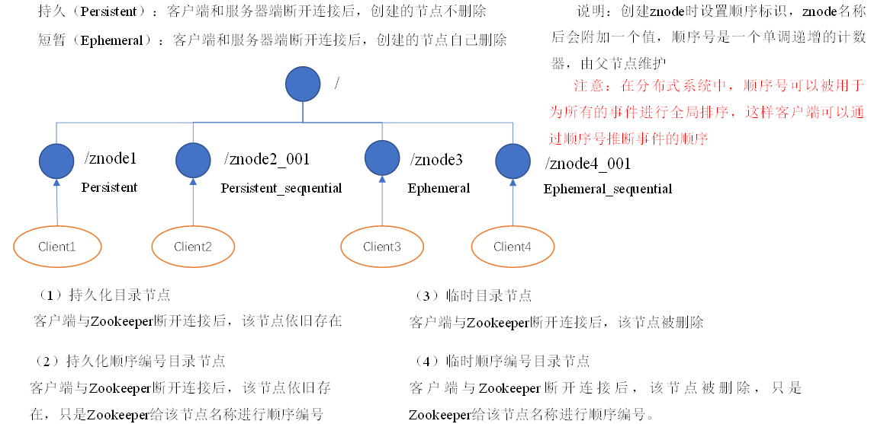

尚硅谷的zookeeper讲的太浅了。推荐黑马的http://yun.itheima.com/course/641.html

# 一 Zookeeper概念

1.1概念

大数据生态系统里的很多组件的命名都是某种动物或者昆虫， 比如hadoop就是大象，hive是蜜蜂。zookeeper即动物园管理者， 顾名思义就是管理大数据生态系统各组件的管理员

 Zookeeper从设计模式角度来理解：是一个基于观察者模式设计的分布式服务管理框架，它负责存储和管理大家都关心的数据，然后接受观察者的注册，一旦这些数据的状态发生变化，Zookeeper就将负责通知已经在Zookeeper上注册的那些观察者做出相应的反应。


**1.2特点：**

- 1）Zookeeper：一个领导者（Leader），多个跟随者（Follower）组成的集群。
- 2）集群中只要有半数以上节点存活，Zookeeper集群就能正常服务。
- 3）全局数据一致：每个Server保存一份相同的数据副本，Client无论连接到哪个Server，数据都是一致的。
- 4）更新请求顺序进行，来自同一个Client的更新请求按其发送顺序依次执行。
- 5）数据更新原子性，一次数据更新要么成功，要么失败。
- 6）实时性，在一定时间范围内，Client能读到最新数据。

### **1.3数据结构znode**

zookeeper的数据节点可以视为树状结构（或者目录） ， 树中的各节点被称为znode（即zookeeper node） ， 一个znode可以有多个子节点。 zookeeper节点在结构上表现为树状； 使用路径path来定位某个znode， 比如/grandfather/father/son， 此处grandfather、father、 son分别是
根节点、 2级节点、 3级节点； 其中grandfather是father的父节点， son是father的子
节点， 以此类推。

znode， 兼具文件和目录两种特点。 既像文件一样维护着数据、 元信息、 ACL、 时间戳等数据结构， 又像目录一样可以作为路径标识的一部分。

那么如何描述一个znode呢？ 一个znode大体上分为3各部分：

- 节点的数据： 即znode data(节点path, 节点data)的关系就像是java map中(key,value)的关系

- 节点的子节点children

- 节点的状态stat： 用来描述当前节点的创建、 修改记录， 包括cZxid、 ctime等

  - 在zookeeper shell中使用get命令查看指定路径节点的data、 stat信息：

    ```bash
    [zk: localhost:2181(CONNECTED) 6] get /grandfather/father/son
    son
    cZxid = 0x5 # 越大代表是越新的数据
    ctime = Mon Jun 29 08:19:48 PDT 2020
    mZxid = 0x5
    mtime = Mon Jun 29 08:19:48 PDT 2020
    pZxid = 0x5
    cversion = 0
    dataVersion = 0
    aclVersion = 0
    ephemeralOwner = 0x0
    dataLength = 3
    numChildren = 0
    12345678910111213
    ```

  - 1）czxid：创建节点时的事务zxid

   每次修改ZooKeeper状态都会收到一个zxid形式的时间戳，也就是ZooKeeper事务ID。

   事务ID是ZooKeeper中所有修改总的次序。每个修改都有唯一的zxid，如果zxid1小于zxid2，那么zxid1在zxid2之前发生。

  - 2）ctime：znode被创建的毫秒数(从1970年开始)
  - 3）mzxid：znode最后更新时的事务zxid
  - 4）mtime：znode最后修改时的毫秒数(从1970年开始)
  - 5）pZxid：znode最后更新的子节点zxid
  - 6）cversion：znode子节点变化号，znode子节点修改次数
  - 7）dataversion：znode数据变化号
  - 8）aclVersion：znode访问控制列表的变化号
  - 9）ephemeralOwner：如果是临时节点，这个是znode拥有者的session id。如果不是临时节点则是0。
  - 10）dataLength：znode的数据长度
  - 11）numChildren：znode子节点数量

**1.4 应用场景**

提供的服务包括：统一命名服务、统一配置管理、统一集群管理、服务器节点动态上下线、软负载均衡等。

- **统一命名服务：**


- **统一配置管理**


- **统一集群管理**


- **服务动态上下线**


- **负载均衡管理**

在Zookeeper中记录每台服务器的访问数，放访问数最少的服务器去处理最新的客户端请求


# 二 Zookeeper安装

下载：https://archive.apache.org/dist/zookeeper/

解压到/opt/module

```sh
[atguigu@hadoop102 software]$ tar -zxvf zookeeper-3.4.10.tar.gz -C /opt/module/
1
```

### 修改配置conf

```bash
#（1）将/opt/module/zookeeper-3.4.10/conf这个路径下的zoo_sample.cfg修改为zoo.cfg；
[atguigu@hadoop102 conf]$ mv zoo_sample.cfg zoo.cfg

#（2）打开zoo.cfg文件，修改dataDir路径：
[atguigu@hadoop102 zookeeper-3.4.10]$ vim zoo.cfg
修改如下内容：
dataDir=/opt/module/zookeeper-3.4.10/zkData

#（3）在/opt/module/zookeeper-3.4.10/这个目录上创建zkData文件夹
[atguigu@hadoop102 zookeeper-3.4.10]$ mkdir zkData # 默认不会给你创建
12345678910
```

Zookeeper中的配置文件zoo.cfg中参数含义解读如下：

1．tickTime =2000：通信心跳数，Zookeeper服务器与客户端心跳时间，单位毫秒

Zookeeper使用的基本时间，服务器之间或客户端与服务器之间维持心跳的时间间隔，也就是每个tickTime时间就会发送一个心跳，时间单位为毫秒。

它用于心跳机制，并且设置最小的session超时时间为两倍心跳时间。(session的最小超时时间是2*tickTime)

2．initLimit =10：LF初始通信时限

集群中的Follower跟随者服务器与Leader领导者服务器之间初始连接时能容忍的最多心跳数（tickTime的数量），用它来限定集群中的Zookeeper服务器连接到Leader的时限。

3．syncLimit =5：LF同步通信时限

集群中Leader与Follower之间的最大响应时间单位，假如响应超过syncLimit * tickTime，Leader认为Follwer死掉，从服务器列表中删除Follwer。

4．dataDir：数据文件目录+数据持久化路径

主要用于保存Zookeeper中的数据。

5．clientPort =2181：客户端连接端口

监听客户端连接的端口。

### 启动zookeeper

```bash
#（1）启动Zookeeper
[atguigu@hadoop102 zookeeper-3.4.10]$ bin/zkServer.sh start

#（2）查看进程是否启动
[atguigu@hadoop102 zookeeper-3.4.10]$ jps
4020 Jps
4001 QuorumPeerMain # 这个是

#（3）查看状态：
[atguigu@hadoop102 zookeeper-3.4.10]$ bin/zkServer.sh status
ZooKeeper JMX enabled by default
Using config: /opt/module/zookeeper-3.4.10/bin/../conf/zoo.cfg
Mode: standalone

#（4）启动客户端：
[atguigu@hadoop102 zookeeper-3.4.10]$ bin/zkCli.sh

#（5）退出客户端：
[zk: localhost:2181(CONNECTED) 0] quit

#（6）停止Zookeeper
[atguigu@hadoop102 zookeeper-3.4.10]$ bin/zkServer.sh stop
12345678910111213141516171819202122
```

### 4.1 分布式安装部署

```bash
1．集群规划
在hadoop102、hadoop103和hadoop104三个节点上部署Zookeeper。
2．解压安装
#（1）解压Zookeeper安装包到/opt/module/目录下
[atguigu@hadoop102 software]$ tar -zxvf zookeeper-3.4.10.tar.gz -C /opt/module/
#（2）同步/opt/module/zookeeper-3.4.10目录内容到hadoop103、hadoop104
[atguigu@hadoop102 module]$ xsync zookeeper-3.4.10/

3．配置服务器编号
#（1）在/opt/module/zookeeper-3.4.10/这个目录下创建zkData
[atguigu@hadoop102 zookeeper-3.4.10]$ mkdir -p zkData
#（2）在/opt/module/zookeeper-3.4.10/zkData目录下创建一个myid的文件
[atguigu@hadoop102 zkData]$ touch myid
#添加myid文件，注意一定要在linux里面创建，在notepad++里面很可能乱码

#（3）编辑myid文件
[atguigu@hadoop102 zkData]$ vi myid
	#在文件中添加与server对应的编号：
2

#（4）拷贝配置好的zookeeper到其他机器上
[atguigu@hadoop102 zkData]$ xsync myid
并分别在hadoop102、hadoop103上修改myid文件中内容为3、4

4．配置zoo.cfg文件
#（1）重命名/opt/module/zookeeper-3.4.10/conf这个目录下的zoo_sample.cfg为zoo.cfg
[atguigu@hadoop102 conf]$ mv zoo_sample.cfg zoo.cfg
#（2）打开zoo.cfg文件
[atguigu@hadoop102 conf]$ vim zoo.cfg
修改数据存储路径配置
dataDir=/opt/module/zookeeper-3.4.10/zkData
增加如下配置
#######################cluster##########################
server.2=hadoop102:2888:3888
server.3=hadoop103:2888:3888
server.4=hadoop104:2888:3888
#（3）同步zoo.cfg配置文件
[atguigu@hadoop102 conf]$ xsync zoo.cfg
#（4）配置参数解读
server.A=B:C:D。
A是一个数字，表示这个是第几号服务器；
集群模式下配置一个文件myid，这个文件在dataDir目录下，这个文件里面有一个数据就是A的值，Zookeeper启动时读取此文件，拿到里面的数据与zoo.cfg里面的配置信息比较从而判断到底是哪个server。
B是这个服务器的ip地址；
C是这个服务器与集群中的Leader服务器交换信息的端口；
D是万一集群中的Leader服务器挂了，需要一个端口来重新进行选举，选出一个新的Leader，而这个端口就是用来执行选举时服务器相互通信的端口。
123456789101112131415161718192021222324252627282930313233343536373839404142434445
```

4．集群操作

```bash
#（1）分别启动Zookeeper
[atguigu@hadoop102 zookeeper-3.4.10]$ bin/zkServer.sh start
[atguigu@hadoop103 zookeeper-3.4.10]$ bin/zkServer.sh start
[atguigu@hadoop104 zookeeper-3.4.10]$ bin/zkServer.sh start
#（2）查看状态
[atguigu@hadoop102 zookeeper-3.4.10]# bin/zkServer.sh status
JMX enabled by default
Using config: /opt/module/zookeeper-3.4.10/bin/../conf/zoo.cfg
Mode: follower

[atguigu@hadoop103 zookeeper-3.4.10]# bin/zkServer.sh status
JMX enabled by default
Using config: /opt/module/zookeeper-3.4.10/bin/../conf/zoo.cfg
Mode: leader

[atguigu@hadoop104 zookeeper-3.4.5]# bin/zkServer.sh status
JMX enabled by default
Using config: /opt/module/zookeeper-3.4.10/bin/../conf/zoo.cfg
Mode: follower

# 也可以通过以下方式假如到集群
./zkCli.sh ‐server 192.168.60.130:2181
./zkCli.sh ‐server 192.168.60.130:2182
./zkCli.sh ‐server 192.168.60.130:218
123456789101112131415161718192021222324
```

## 

# 三 zookeeper基础

### zookeeper常用shell命令

bin/zkCli.sh启动后，操作

| 命令基本语法               | 功能描述                                         |
| -------------------------- | ------------------------------------------------ |
| help                       | 显示所有操作命令                                 |
| ls path [watch]            | 使用 ls 命令来查看当前znode中所包含的内容        |
| ls2 path [watch]           | 查看当前节点数据并能看到更新次数等数据           |
| create [-s] [-e] path data | 普通创建 -s 含有序列 -e 临时（重启或者超时消失） |
| get path [watch]           | 获得节点的值                                     |
| set                        | 设置节点的具体值                                 |
| stat                       | 查看节点状态                                     |
| delete                     | 删除节点                                         |
| rmr                        | 递归删除节点                                     |

##### 创建结点

创建时必须得写数据，不能只写结点

```bash
# 创建结点
create [-s] [-e] path data #其中-s 为有序节点， -e 临时节点(默认持久化结点)
12
## 创建持久化结点
create /a "123456"

## 创建持久化【有序】节点， 此时创建的节点名为指定节点名 + 自增序号。这个自增序号是父目录下统一的。
[zk: localhost:2181(CONNECTED) 2] create -s /a "aaa"
Created /a0000000000 # 解释：前面代表结点名称，后面代表是父节点下第X个有序结点，任何结点都占用序号，只是只有有序结点以此命名
[zk: localhost:2181(CONNECTED) 3] create -s /b "bbb"
Created /b0000000001
[zk: localhost:2181(CONNECTED) 4] create -s /c "ccc"
Created /c0000000002
## 创建临时结点：会话过期后删除
[zk: localhost:2181(CONNECTED) 5] create -e /tmp "tmp"
Created /tmp

## 创建临时有序结点
[zk: localhost:2181(CONNECTED) 6] create -s -e /aa 'aaa'
Created /aa0000000004
[zk: localhost:2181(CONNECTED) 7] create -s -e /bb 'bbb'
Created /bb0000000005
[zk: localhost:2181(CONNECTED) 8] create -s -e /cc 'ccc'
Created /cc0000000006
123456789101112131415161718192021
```

##### 更新结点

```bash
#更新结点
[zk: localhost:2181(CONNECTED) 3] set /hadoop "345"
cZxid = 0x4
ctime = Thu Dec 12 14:55:53 CST 2019
mZxid = 0x5
mtime = Thu Dec 12 15:01:59 CST 2019
pZxid = 0x4
cversion = 0
dataVersion = 1
aclVersion = 0
ephemeralOwner = 0x0
dataLength = 3
numChildren = 0
12345678910111213
```

也可以基于版本号进行更改， 此时类似于乐观锁机制， 当你传入的数据版本号
(dataVersion) 和当前节点的数据版本号不符合时， zookeeper 会拒绝本次修改

```bash
[zk: localhost:2181(CONNECTED) 10] set /hadoop "3456" 1
version No is not valid : /hadoop
12
```

##### 删除节点

和更新节点数据一样， 也可以传入版本号， 当你传入的数据版本号 (dataVersion)
和当前节点的数据版本号不符合时， zookeeper 不会执行删除操作。

```bash
delete path [version]

#递归删除节点
rmr /sanguo/shuguo
1234
[zk: localhost:2181(CONNECTED) 36] delete /hadoop 0
version No is not valid : /hadoop #无效的版本号
[zk: localhost:2181(CONNECTED) 37] delete /hadoop 1
123
```

##### 查看结点

```bash
# 获取结点信息
get path

# 获取结点下所有子节点
ls path
# 获取结点下所有子节点+当前路径信息
ls2 path

#查看节点状态，不会反悔数据
stat /path
12345678910
[zk: localhost:2181(CONNECTED) 1] get /hadoop
123456
cZxid = 0x4
ctime = Thu Dec 12 14:55:53 CST 2019
mZxid = 0x4
mtime = Thu Dec 12 14:55:53 CST 2019
pZxid = 0x4
cversion = 0
dataVersion = 0
aclVersion = 0
ephemeralOwner = 0x0
dataLength = 6
numChildren = 0


#查看节点状态
[zk: localhost:2181(CONNECTED) 17] stat /sanguo
cZxid = 0x100000003
ctime = Wed Aug 29 00:03:23 CST 2018
mZxid = 0x100000011
mtime = Wed Aug 29 00:21:23 CST 2018
pZxid = 0x100000014
cversion = 9
dataVersion = 1
aclVersion = 0
ephemeralOwner = 0x0
dataLength = 4
numChildren = 1
12345678910111213141516171819202122232425262728
```

##### 监听结点

使用 get path [watch] 注册的监听器能够在节点内容发生改变的时候， 向客户端发出通知。 需要注意的是 zookeeper 的触发器是一次性的 (One-time trigger)， 即触发一次后就会立即失效。

```bash
# 设置监听
get path [watch] 

# 使用 stat path [watch] 注册的监听器能够在节点状态发生改变的时候， 向客户端发出通知
stat path [watch]

# 使用 ls path [watch] 或 ls2 path [watch] 注册的监听器能够监听该节点下所有子节点的增加和删除操作
ls path [watch]
12345678
#10．节点的值变化监听 # 监听有效次数：1次，变化后下次需要重新监听
##（1）在hadoop104主机上注册监听/sanguo节点数据变化
[zk: localhost:2181(CONNECTED) 26] [zk: localhost:2181(CONNECTED) 8] get /sanguo watch
##（2）在hadoop103主机上修改/sanguo节点的数据
[zk: localhost:2181(CONNECTED) 1] set /sanguo "xisi"
##（3）观察hadoop104主机收到数据变化的监听
WATCHER::
WatchedEvent state:SyncConnected type:NodeDataChanged path:/sanguo

#11．节点的子节点变化监听（路径变化） ## 有效次数：1次
##（1）在hadoop104主机上注册监听/sanguo节点的子节点变化
[zk: localhost:2181(CONNECTED) 1] ls /sanguo watch
[aa0000000001, server101]
##（2）在hadoop103主机/sanguo节点上创建子节点
[zk: localhost:2181(CONNECTED) 2] create /sanguo/jin "simayi"
Created /sanguo/jin
##（3）观察hadoop104主机收到子节点变化的监听
WATCHER::
WatchedEvent state:SyncConnected type:NodeChildrenChanged path:/sanguo
12345678910111213141516171819
```

## 3.2 节点类型

zookeeper中的节点有两种， 分别为临时节点和永久节点。 节点的类型在创建时即被确定， 并且不能改变。

- 临时节点： 该节点的生命周期依赖于创建它们的会话。 一旦会话(Session)结束， 临时节点将被自动删除， 当然可以也可以手动删除。 虽然每个临时的Znode都会绑定到一个客户端会话， 但他们对所有的客户端还是可见的。 另外， ZooKeeper的临时节点不允许拥有子节点。
- 持久化节点： 该节点的生命周期不依赖于会话， 并且只有在客户端显示执行删除操作的时候， 他们才能被删除



## 3.6 acl权限控制

#### 1 概述

zookeeper 类似文件系统， client 可以创建节点、 更新节点、 删除节点， 那么
如何做到节点的权限的控制呢？ zookeeper的access control list 访问控制列表可以做到这一点。
​ acl 权限控制， 使用scheme： id： permission 来标识， 主要涵盖 3 个方面：

- 权限模式（scheme） ： 授权的策略
- 授权对象（id） ： 授权的对象
- 权限（permission） ： 授予的权限

其特性如下：

- zooKeeper的权限控制是基于每个znode节点的， 需要对每个节点设置权限
- 每个znode支持设置多种权限控制方案和多个权限
- 子节点不会继承父节点的权限， 客户端无权访问某节点， 但可能可以访问它的子节点

```java
setAcl /test2 ip:192.168.60.130:crwda 
// 将节点权限设置为Ip:192.168.60.130的客户端可以对节点进行增、 删、 改、 查、 管理权限
12
```

#### 2 权限模式

采样何种方式授权

| 方案   | 描述                                                   |
| ------ | ------------------------------------------------------ |
| world  | 只有一个用户： anyone， 代表登录zokeeper所有人（默认） |
| ip     | 对客户端使用IP地址认证                                 |
| auth   | 使用已添加认证的用户认证                               |
| digest | 使用“用户名:密码”方式认证                              |

#### 5.3 授权的对象

- 授权对象：给谁授予权限
- 授权对象ID是指， 权限赋予的实体， 例如： IP 地址或用户。

#### 5.4 授予的权限

授予什么权限
create、 delete、 read、 writer、 admin也就是 增、 删、 改、 查、 管理权限，
这5种权限简写为cdrwa， 注意:这5种权限中， delete是指对子节点的删除权限， 其它4种权限指对自身节点的操作权限

| 权限   | ACL简写 | 描述                             |
| ------ | ------- | -------------------------------- |
| create | c       | 可以创建子节点                   |
| delete | d       | 可以删除子节点（仅下一级节点）   |
| read   | r       | 可以读取节点数据及显示子节点列表 |
| write  | w       | 可以设置节点数据                 |
| admin  | a       | 可以设置节点访问控制列表权限     |

#### 5.5 授权的相关命令

| 命令    | 使用方式 | 描述         |
| ------- | -------- | ------------ |
| getAcl  | getAcl   | 读取ACL权限  |
| setAcl  | setAcl   | 设置ACL权限  |
| addauth | addauth  | 添加认证用户 |

#### 5.6 案例

- world授权模式

  ```java
  语法
  setAcl <path> world:anyone:<acl>
  12
  ```

```bash
[zk: localhost:2181(CONNECTED) 1] create /node1 "node1"
Created /node1
[zk: localhost:2181(CONNECTED) 2] getAcl /node1
'world,'anyone #world方式对所有用户进行授权
: cdrwa #增、 删、 改、 查、 管理
[zk: localhost:2181(CONNECTED) 3] setAcl /node1 world:anyone:cdrwa
cZxid = 0x2
ctime = Fri Dec 13 22:25:24 CST 2019
mZxid = 0x2
mtime = Fri Dec 13 22:25:24 CST 2019
pZxid = 0x2
cversion = 0
dataVersion = 0
aclVersion = 1
ephemeralOwner = 0x0
dataLength = 5
numChildren = 0
1234567891011121314151617
```

- IP授权模式

```
setAcl <path> ip:<ip>:<acl>
1
```

案例，注意： 远程登录zookeeper命令:./zkCli.sh -server ip

```bash
[zk: localhost:2181(CONNECTED) 18] create /node2 "node2"
Created /node2
[zk: localhost:2181(CONNECTED) 23] setAcl /node2 ip:192.168.60.129:cdrwa
cZxid = 0xe
ctime = Fri Dec 13 22:30:29 CST 2019
mZxid = 0x10
mtime = Fri Dec 13 22:33:36 CST 2019
pZxid = 0xe
cversion = 0
dataVersion = 2
aclVersion = 1
ephemeralOwner = 0x0
dataLength = 20
numChildren = 0
[zk: localhost:2181(CONNECTED) 25] getAcl /node2
'ip,'192.168.60.129
: cdrwa
#使用IP非 192.168.60.129 的机器
[zk: localhost:2181(CONNECTED) 0] get /node2
Authentication is not valid : /node2 #没有权限
1234567891011121314151617181920
```

- Auth 授权模式

```
addauth digest <user>:<password> #添加认证用户
setAcl <path> auth:<user>:<acl>
12
[zk: localhost:2181(CONNECTED) 2] create /node3 "node3"
Created /node3

#添加认证用户，这里更多是登录的意思
[zk: localhost:2181(CONNECTED) 4] addauth digest itcast:123456

[zk: localhost:2181(CONNECTED) 1] setAcl /node3 auth:itcast:cdrwa
cZxid = 0x15
ctime = Fri Dec 13 22:41:04 CST 2019
mZxid = 0x15
mtime = Fri Dec 13 22:41:04 CST 2019
pZxid = 0x15
cversion = 0
dataVersion = 0
aclVersion = 1
ephemeralOwner = 0x0
dataLength = 5
numChildren = 0

[zk: localhost:2181(CONNECTED) 0] getAcl /node3
'digest,'itcast:673OfZhUE8JEFMcu0l64qI8e5ek=
: cdrwa

#添加认证用户后可以访问
[zk: localhost:2181(CONNECTED) 3] get /node3
node3
cZxid = 0x15
ctime = Fri Dec 13 22:41:04 CST 2019
mZxid = 0x15
mtime = Fri Dec 13 22:41:04 CST 2019
pZxid = 0x15
cversion = 0
dataVersion = 0
aclVersion = 1
ephemeralOwner = 0x0
dataLength = 5
numChildren = 0
12345678910111213141516171819202122232425262728293031323334353637
```

- Digest授权模式

```
setAcl <path> digest:<user>:<password>:<acl>
1
```

这里的密码是经过SHA1及BASE64处理的密文， 在SHELL中可以通过以下命令计算：

```sh
# 生成密码的密文
echo -n <user>:<password> | openssl dgst -binary -sha1 | openssl base64

# 比如
echo -n itheima:123456 | openssl dgst -binary -sha1 | openssl base64
12345
```

案例：

```bash
[zk: localhost:2181(CONNECTED) 4] create /node4 "node4"
Created /node4
#使用是上面算好的密文密码添加权限：
[zk: localhost:2181(CONNECTED) 5] setAcl /node4 digest:itheima:qlzQzCLKhBROghkooLvb+Mlwv4A=:cdrwa
cZxid = 0x1c
ctime = Fri Dec 13 22:52:21 CST 2019
mZxid = 0x1c
mtime = Fri Dec 13 22:52:21 CST 2019
pZxid = 0x1c
cversion = 0
dataVersion = 0
aclVersion = 1
ephemeralOwner = 0x0
dataLength = 5
numChildren = 0
[zk: localhost:2181(CONNECTED) 6] getAcl /node4
'digest,'itheima:qlzQzCLKhBROghkooLvb+Mlwv4A=
: cdrwa
[zk: localhost:2181(CONNECTED) 3] get /node4
Authentication is not valid : /node4 #没有权限

[zk: localhost:2181(CONNECTED) 4] addauth digest itheima:123456 #添加认证用户

[zk: localhost:2181(CONNECTED) 5] get /node4
1 #成功读取数据
cZxid = 0x1c
ctime = Fri Dec 13 22:52:21 CST 2019
mZxid = 0x1c
mtime = Fri Dec 13 22:52:21 CST 2019
pZxid = 0x1c
cversion = 0
dataVersion = 0
aclVersion = 1
ephemeralOwner = 0x0
dataLength = 5
numChildren = 0
123456789101112131415161718192021222324252627282930313233343536
```

- 多种模式授权

同一个节点可以同时使用多种模式授权

```bash
[zk: localhost:2181(CONNECTED) 0] create /node5 "node5"
Created /node5
[zk: localhost:2181(CONNECTED) 1] addauth digest itcast:123456 #添加认证用户
[zk: localhost:2181(CONNECTED) 2] setAcl /node5 ip:192.168.60.129:cdra,auth:itcast:cdrwa,digest:itheima:qlzQzCLKhBROgh kooLvb+Mlwv4A=:cdrwa
1234
```

#### 5.7 acl 超级管理员

zookeeper的权限管理模式有一种叫做super， 该模式提供一个超管可以方便的访问任何权限的节点

假设这个超管是： super:admin， 需要先为超管生成密码的密文

```sh
echo -n super:admin | openssl dgst -binary -sha1 | openssl base64
1
```

那么打开zookeeper目录下的/bin/zkServer.sh服务器脚本文件， 找到如下一行：

```sh
nohup $JAVA "-Dzookeeper.log.dir=${ZOO_LOG_DIR}" "-
Dzookeeper.root.logger=${ZOO_LOG4J_PROP}"
12
```

这就是脚本中启动zookeeper的命令， 默认只有以上两个配置项， 我们需要加一个
超管的配置项

```sh
"-Dzookeeper.DigestAuthenticationProvider.superDigest=super账号:xQJmxLMiHGwaqBvst5y6rkB6HQs=密码"
1
```

那么修改以后这条完整命令变成了

```bash
nohup $JAVA "-Dzookeeper.log.dir=${ZOO_LOG_DIR}" "-
Dzookeeper.root.logger=${ZOO_LOG4J_PROP}" 
"-Dzookeeper.DigestAuthenticationProvider.superDigest=super:xQJmxLMiHGwaqBvst5y6rkB6HQs="\
-cp "$CLASSPATH" $JVMFLAGS $ZOOMAIN "$ZOOCFG" > "$_ZOO_DAEMON_OUT"
2>&1 < /dev/null &
12345
```

之后启动zookeeper,输入如下命令添加权限

```bash
addauth digest super:admin #添加认证用户
1
```

# 四 javaAPI

4.3.1 pom依赖

```xml
<dependencies>
    <dependency>
        <groupId>junit</groupId>
        <artifactId>junit</artifactId>
        <version>RELEASE</version>
    </dependency>
    <dependency>
        <groupId>org.apache.logging.log4j</groupId>
        <artifactId>log4j-core</artifactId>
        <version>2.8.2</version>
    </dependency>
    <!-- https://mvnrepository.com/artifact/org.apache.zookeeper/zookeeper -->
    <dependency>
        <groupId>org.apache.zookeeper</groupId>
        <artifactId>zookeeper</artifactId>
        <version>3.4.10</version>
    </dependency>
</dependencies>
123456789101112131415161718
```

拷贝log4j.properties文件到项目根目录，需要在项目的src/main/resources目录下，新建一个文件，命名为“log4j.properties”，在文件中填入。

```properties
log4j.rootLogger=INFO, stdout  
log4j.appender.stdout=org.apache.log4j.ConsoleAppender  
log4j.appender.stdout.layout=org.apache.log4j.PatternLayout  
log4j.appender.stdout.layout.ConversionPattern=%d %p [%c] - %m%n  
log4j.appender.logfile=org.apache.log4j.FileAppender  
log4j.appender.logfile.File=target/spring.log  
log4j.appender.logfile.layout=org.apache.log4j.PatternLayout  
log4j.appender.logfile.layout.ConversionPattern=%d %p [%c] - %m%n 
12345678
```

客户端应该遵循以步骤， 与zookeeper服务器进行清晰和干净的交互。

- 连接到zookeeper服务器。 zookeeper服务器为客户端分配会话ID。
- 定期向服务器发送心跳。 否则， zookeeper服务器将过期会话ID， 客户端需要重新连接。
- 只要会话ID处于活动状态， 就可以获取/设置znode。
- 所有任务完成后， 断开与zookeeper服务器的连接。 如果客户端长时间不活动， 则zookeeper服务器将自动断开客户端。

### ①连接Zookeeper

```java
ZooKeeper(String connectionString, //zookeeper主机 //可以连接一个集群"192.168.60.130:2181,192.168.60.130:2182,192.168.60.130:2183"
          int sessionTimeout, //会话超时（以毫秒为单位)// 会话超时时间内会保留该会话对象
          Watcher watcher)//实现“监视器”对象。zookeeper集合通过监视器对象返回连接状态。
123
import org.apache.zookeeper.WatchedEvent;
import org.apache.zookeeper.Watcher;
import org.apache.zookeeper.ZooKeeper;
import java.util.concurrent.CountDownLatch;
public class ZookeeperConnection {
    public static void main(String[] args) {
        try {
            // 计数器对象
            CountDownLatch countDownLatch=new CountDownLatch(1);
            
            // arg1:服务器的ip和端口
            // arg2:客户端与服务器之间的会话超时时间 以毫秒为单位的
            // arg3:监视器对象
            ZooKeeper zooKeeper=
                new ZooKeeper("192.168.60.130:2181",
                              5000, 
                              new Watcher() {
                                  @Override
                                  public void process(WatchedEvent event) {
                                      if(event.getState()==Event.KeeperState.SyncConnected){
                                          System.out.println("连接创建成功!");
                                          countDownLatch.countDown();//放行
                                      }
                                  }
                              });
            
            // 主线程阻塞等待连接对象的创建成功
            countDownLatch.await();
            // 会话编号
            System.out.println(zooKeeper.getSessionId());
            zooKeeper.close();
        } catch (Exception ex) {
            ex.printStackTrace();
        }
    }
}
123456789101112131415161718192021222324252627282930313233343536
```

### ②新增结点create

```java
// 同步方式
create(String path, byte[] data, List<ACL> acl, CreateMode createMode)
// 异步方式
create(String path, byte[] data, List<ACL> acl, CreateMode createMode，
AsyncCallback.StringCallback callBack,Object ctx)
12345
```

- path：znode路径。 例如， /node1 /node1/node11
- data：要存储在指定znode路径中的数据
- acl：要创建的节点的访问控制列表。 zookeeper API提供了一个静态接口ZooDefs.Ids 来获取一些基本的acl列表。 例如， ZooDefs.Ids.OPEN_ACL_UNSAFE 返回打开znode的acl列表。
  - ZooDefs.Perms.ADMIN
  - ZooDefs.Perms.ALL
  - ZooDefs.Perms.CREATE
  - ZooDefs.Perms.DELETE
  - ZooDefs.Perms.READ
  - ZooDefs.Perms.WRITE
- createMode：节点的类型，永久还是临时，这是一个枚举。
  - CreateMode.EPHEMERAL
  - CreateMode.EPHEMERAL_SEQUENTIAL
  - CreateMode.PERSISTENT
  - CreateMode.PERSISTENT_SEQUENTIAL
- callBack：异步回调接口
- ctx：传递上下文参数

```java
import org.apache.zookeeper.*;
import org.apache.zookeeper.data.ACL;
import org.apache.zookeeper.data.Id;
import org.junit.After;
import org.junit.Before;
import org.junit.Test;
import java.util.ArrayList;
import java.util.List;
import java.util.concurrent.CountDownLatch;
public class ZKCreate {
    String IP="192.168.60.130:2181";
    ZooKeeper zooKeeper;
    @Before
    public void before()throws Exception{
        // 计数器对象
        CountDownLatch countDownLatch=new CountDownLatch(1);
        // arg1:服务器的ip和端口
        // arg2:客户端与服务器之间的会话超时时间 以毫秒为单位的
        // arg3:监视器对象
        zooKeeper=new ZooKeeper(IP, 5000, new Watcher() {
            @Override
            public void process(WatchedEvent event) {
                if(event.getState()==Event.KeeperState.SyncConnected) {
                    System.out.println("连接创建成功!");
                    countDownLatch.countDown();
                }
            }
        });
        // 主线程阻塞等待连接对象的创建成功
        countDownLatch.await();
    } 
    @After
    public void after()throws Exception{
        zooKeeper.close();
    }
    
    @Test
    public void create1()throws Exception{
        zooKeeper.create("/create/node1", // arg1:节点的路径
                         "node1".getBytes(), // arg2:节点的数据
                         ZooDefs.Ids.OPEN_ACL_UNSAFE, // arg3:权限列表 world:anyone:cdrwa
                         CreateMode.PERSISTENT); // arg4:节点类型 持久化节点
    } 
    
    @Test
    public void create2() throws Exception {
        // Ids.READ_ACL_UNSAFE world:anyone:r
        zooKeeper.create("/create/node2", "node2".getBytes(),
                         ZooDefs.Ids.READ_ACL_UNSAFE, CreateMode.PERSISTENT);
    }
    
    @Test
    public void create3() throws Exception {
        // world授权模式
        // 权限列表
        List<ACL> acls = new ArrayList<ACL>();
        // 授权模式和授权对象
        Id id = new Id("world", "anyone");
        // 权限设置
        acls.add(new ACL(ZooDefs.Perms.READ, id));
        acls.add(new ACL(ZooDefs.Perms.WRITE, id));
        
        zooKeeper.create("/create/node3", 
                         "node3".getBytes(), 
                         acls,
                         CreateMode.PERSISTENT);
    }
    
    @Test
    public void create4() throws Exception {
        // ip授权模式
        // 权限列表
        List<ACL> acls = new ArrayList<ACL>();
        // 授权模式和授权对象
        Id id = new Id("ip", "192.168.60.130");
        // 权限设置
        acls.add(new ACL(ZooDefs.Perms.ALL, id));
        zooKeeper.create("/create/node4", 
                         "node4".getBytes(),
                         acls,
                         CreateMode.PERSISTENT);
    } 
    @Test
    public void create5() throws Exception {
        // auth授权模式
        // 添加授权用户
        zooKeeper.addAuthInfo("digest", "itcast:123456".getBytes());
        zooKeeper.create("/create/node5", "node5".getBytes(),
                         ZooDefs.Ids.CREATOR_ALL_ACL, CreateMode.PERSISTENT);
    } 
    @Test
    public void create6() throws Exception {
        // auth授权模式
        // 添加授权用户
        zooKeeper.addAuthInfo("digest", "itcast:123456".getBytes());
        // 权限列表
        List<ACL> acls = new ArrayList<ACL>();
        // 授权模式和授权对象
        Id id = new Id("auth", "itcast");
        // 权限设置
        acls.add(new ACL(ZooDefs.Perms.READ, id));
        zooKeeper.create("/create/node6", "node6".getBytes(), acls,
                         CreateMode.PERSISTENT);
    } 
    @Test
    public void create7() throws Exception {
        // digest授权模式
        // 权限列表
        List<ACL> acls = new ArrayList<ACL>();
        // 授权模式和授权对象
        Id id = new Id("digest", "itheima:qlzQzCLKhBROghkooLvb+Mlwv4A=");
        // 权限设置
        acls.add(new ACL(ZooDefs.Perms.ALL, id));
        zooKeeper.create("/create/node7", "node7".getBytes(), acls,
                         CreateMode.PERSISTENT);
    }
    
    @Test
    public void create8() throws Exception {
        // 持久化顺序节点
        // Ids.OPEN_ACL_UNSAFE world:anyone:cdrwa
        String result = zooKeeper.create("/create/node8",
                                         "node8".getBytes(), ZooDefs.Ids.OPEN_ACL_UNSAFE,
                                         CreateMode.PERSISTENT_SEQUENTIAL);
        System.out.println(result);
    } 
    @Test
    public void create9() throws Exception {
        // 临时节点
        // Ids.OPEN_ACL_UNSAFE world:anyone:cdrwa
        String result = zooKeeper.create("/create/node9",
                                         "node9".getBytes(), ZooDefs.Ids.OPEN_ACL_UNSAFE, CreateMode.EPHEMERAL);
        System.out.println(result);
    }
    @Test
    public void create10() throws Exception {
        // 临时顺序节点
        // Ids.OPEN_ACL_UNSAFE world:anyone:cdrwa
        String result = zooKeeper.create("/create/node10",
                                         "node10".getBytes(), ZooDefs.Ids.OPEN_ACL_UNSAFE,
                                         CreateMode.EPHEMERAL_SEQUENTIAL);
        System.out.println(result);
    } 
    @Test
    public void create11() throws Exception {
        // 异步方式创建节点
        zooKeeper.create("/create/node11", 
                         "node11".getBytes(),
                         ZooDefs.Ids.OPEN_ACL_UNSAFE, 
                         CreateMode.PERSISTENT, 
                         new AsyncCallback.StringCallback() {
                             @Override
                             public void processResult(int rc, String path, Object ctx,
                                                       String name) {
                                 // 0 代表创建成功
                                 System.out.println(rc);
                                 // 节点的路径

                                 System.out.println(path);
                                 // 节点的路径
                                 System.out.println(name);
                                 // 上下文参数
                                 System.out.println(ctx);
                             }
                         },
                         "I am context");
        Thread.sleep(10000);
        System.out.println("结束");
    }
}
123456789101112131415161718192021222324252627282930313233343536373839404142434445464748495051525354555657585960616263646566676869707172737475767778798081828384858687888990919293949596979899100101102103104105106107108109110111112113114115116117118119120121122123124125126127128129130131132133134135136137138139140141142143144145146147148149150151152153154155156157158159160161162163164165166167168169170
```

### ③更新结点setData

```java
// 同步方式 //版本号-1代表不参与更新
Stat stat = setData(String path, byte[] data, int version)
// 异步方式
Stat stat = setData(String path, byte[] data, int version,
                    AsyncCallback.StatCallback callBack, // 实现了接口的匿名内部类对象
                    Object ctx)
123456
```

- path：znode的路径
- data：要存储在指定znode路径中的数据。
- version：znode的当前版本。 每当数据更改时， ZooKeeper会更新znode的版本号。
- callBack：异步回调接口
- ctx：传递上下文参数 ，调用匿名方法时传递的参数
- 返回值：当前结点的相关属性

```java
import org.apache.zookeeper.*;
import org.apache.zookeeper.data.Stat;
import org.junit.After;
import org.junit.Before;
import org.junit.Test;
import java.util.concurrent.CountDownLatch;
public class ZKSet {
    String IP = "192.168.60.130:2181";
    ZooKeeper zookeeper;
    @Before
    public void before() throws Exception {
        CountDownLatch countDownLatch = new CountDownLatch(1);
        // arg1:zookeeper服务器的ip地址和端口号
        // arg2:连接的超时时间 以毫秒为单位
        // arg3:监听器对象
        zookeeper = new ZooKeeper(IP, 5000, new Watcher() {
            @Override
            public void process(WatchedEvent event) {
                if (event.getState() == Event.KeeperState.SyncConnected)
                {
                    System.out.println("连接创建成功!");
                    countDownLatch.countDown();
                }
            }
        });
        // 使主线程阻塞等待
        countDownLatch.await();
    } 
    @After
    public void after() throws Exception {
        zookeeper.close();
    } 
    @Test
    public void set1() throws Exception {
        // arg1:节点的路径
        // arg2:节点修改的数据
        // arg3:版本号 -1代表版本号不作为修改条件
        Stat stat=zookeeper.setData("/set/node1","node13".getBytes(),2);
        // 节点的版本号
        System.out.println(stat.getVersion());
        // 节点的创建时间
        System.out.println(stat.getCtime());
    } 
    @Test
    public void set2() throws Exception {
        // 异步方式修改节点
        zookeeper.setData("/set/node2", "node21".getBytes(), -1, 
                          new AsyncCallback.StatCallback() {
                              @Override
                              public void processResult(int rc, String path, Object ctx,
                                                        Stat stat) {
                                  // 0 代表修改成功
                                  System.out.println(rc);
                                  // 修改节点的路径
                                  System.out.println(path);
                                  // 上线文的参数对象
                                  System.out.println(ctx);
                                  // 的属性信息
                                  System.out.println(stat.getVersion());
                              }
                          },"I am Context");
        Thread.sleep(50000);
        System.out.println("结束");
    }
}
1234567891011121314151617181920212223242526272829303132333435363738394041424344454647484950515253545556575859606162636465
```

### ④删除节点delete

```java
// 同步方式
delete(String path, int version)
// 异步方式
delete(String path, 
       int version,//znode的当前版本
       AsyncCallback.VoidCallback callBack,//异步回调接口
       Object ctx)//传递上下文参数  
1234567
import org.apache.zookeeper.AsyncCallback;
import org.apache.zookeeper.WatchedEvent;
import org.apache.zookeeper.Watcher;
import org.apache.zookeeper.ZooKeeper;
import org.apache.zookeeper.data.Stat;
import org.junit.After;
import org.junit.Before;
import org.junit.Test;
import java.util.concurrent.CountDownLatch;
public class ZKDelete {
    String IP = "192.168.60.130:2181";
    ZooKeeper zooKeeper;
    @Before
    public void before() throws Exception {
        CountDownLatch countDownLatch = new CountDownLatch(1);
        // arg1:zookeeper服务器的ip地址和端口号
        // arg2:连接的超时时间 以毫秒为单位
        // arg3:监听器对象
        zooKeeper = new ZooKeeper(IP, 5000, new Watcher() {
            @Override
            public void process(WatchedEvent event) {
                if (event.getState() == Event.KeeperState.SyncConnected)
                {
                    System.out.println("连接创建成功!");
                    countDownLatch.countDown();
                }
            }
        });
        // 使主线程阻塞等待
        countDownLatch.await();
    } 
    @After
    public void after() throws Exception {
        zooKeeper.close();
    } 
    @Test
    public void delete1() throws Exception {
        // arg1:删除节点的节点路径
        // arg2:数据版本信息 -1代表删除节点时不考虑版本信息
        zooKeeper.delete("/delete/node1",-1);
    } 
    @Test
    public void delete2() throws Exception {
        // 异步使用方式
        zooKeeper.delete("/delete/node2", -1, new
                         AsyncCallback.VoidCallback() {
                             @Override
                             public void processResult(int rc, String path, Object ctx) {
                                 // 0代表删除成功
                                 System.out.println(rc);
                                 // 节点的路径
                                 System.out.println(path);
                                 // 上下文参数对象
                                 System.out.println(ctx);
                             }
                         },"I am Context");
        Thread.sleep(10000);
        System.out.println("结束");
    }
}
123456789101112131415161718192021222324252627282930313233343536373839404142434445464748495051525354555657585960
```

### ⑤查看节点getData

```java
// 同步方式
byte[] bys = getData(String path, 
                     boolean b, 
                     Stat stat)//返回信息
// 异步方式
getData(String path, 
        boolean b, //是否使用连接对象中注册的监视器
        AsyncCallback.DataCallback callBack,//异步回调接口
        Object ctx)//传递上下文参数
123456789
import org.apache.zookeeper.AsyncCallback;
import org.apache.zookeeper.WatchedEvent;
import org.apache.zookeeper.Watcher;
import org.apache.zookeeper.ZooKeeper;
import org.apache.zookeeper.data.Stat;
import org.junit.After;
import org.junit.Before;
import org.junit.Test;
import java.util.concurrent.CountDownLatch;
public class ZKGet {
    String IP = "192.168.60.130:2181";
    ZooKeeper zooKeeper;

    @Before
    public void before() throws Exception {
        CountDownLatch countDownLatch = new CountDownLatch(1);
        // arg1:zookeeper服务器的ip地址和端口号
        // arg2:连接的超时时间 以毫秒为单位
        // arg3:监听器对象
        zooKeeper = new ZooKeeper(IP, 5000, new Watcher() {
            @Override
            public void process(WatchedEvent event) {
                if (event.getState() == Event.KeeperState.SyncConnected)
                {
                    System.out.println("连接创建成功!");
                    countDownLatch.countDown();
                }
            }
        });
        // 使主线程阻塞等待
        countDownLatch.await();
    } 
    @After
    public void after() throws Exception {
        zooKeeper.close();
    }
    @Test
    public void get1() throws Exception {
        // arg1:节点的路径
        // arg3:读取节点属性的对象
        Stat stat=new Stat();
        byte [] bys=zooKeeper.getData("/get/node1",false,stat);
        // 打印数据
        System.out.println(new String(bys));
        // 版本信息
        System.out.println(stat.getVersion());
    } 
    @Test
    public void get2() throws Exception {
        //异步方式
        zooKeeper.getData("/get/node1", false, 
                          new AsyncCallback.DataCallback() {
                              @Override
                              public void processResult(int rc, String path, Object ctx,
                                                        byte[] data, Stat stat) {
                                  // 0代表读取成功
                                  System.out.println(rc);
                                  // 节点的路径
                                  System.out.println(path);
                                  // 上下文参数对象
                                  System.out.println(ctx);
                                  // 数据
                                  System.out.println(new String(data));
                                  // 属性对象
                                  System.out.println(stat.getVersion());
                              }
                          },"I am Context");
        Thread.sleep(10000);
        System.out.println("结束");
    }
}
1234567891011121314151617181920212223242526272829303132333435363738394041424344454647484950515253545556575859606162636465666768697071
```

### ⑥查看子节点getChildren

```java
// 同步方式
getChildren(String path, boolean b)
// 异步方式
getChildren(String path, 
            boolean b,//是否使用连接对象中注册的监视器。
            AsyncCallback.ChildrenCallback callBack,//异步回调接口。
            Object ctx)//传递上下文参数  
1234567
import org.apache.zookeeper.AsyncCallback;
import org.apache.zookeeper.WatchedEvent;
import org.apache.zookeeper.Watcher;
import org.apache.zookeeper.ZooKeeper;
import org.apache.zookeeper.data.Stat;
import org.junit.After;
import org.junit.Before;
import org.junit.Test;
import java.util.List;
import java.util.concurrent.CountDownLatch;
public class ZKGetChid {
    String IP = "192.168.60.130:2181";
    ZooKeeper zooKeeper;
    @Before
    public void before() throws Exception {
        CountDownLatch countDownLatch = new CountDownLatch(1);
        // arg1:zookeeper服务器的ip地址和端口号
        // arg2:连接的超时时间 以毫秒为单位
        // arg3:监听器对象
        zooKeeper = new ZooKeeper(IP, 5000, new Watcher() {
            @Override
            public void process(WatchedEvent event) {
                if (event.getState() == Event.KeeperState.SyncConnected)//
                {
                    System.out.println("连接创建成功!");
                    countDownLatch.countDown();
                }
            }
        });
        // 使主线程阻塞等待
        countDownLatch.await();
    } 
    @After
    public void after() throws Exception {
        zooKeeper.close();
    } 
    @Test
    public void get1() throws Exception {
        // arg1:节点的路径
        List<String> list = zooKeeper.getChildren("/get", false);
        for (String str : list) {
            System.out.println(str);
        }
    } 
    @Test
    public void get2() throws Exception {
        // 异步用法
        zooKeeper.getChildren("/get", false, 
                              new AsyncCallback.ChildrenCallback() {
                                  @Override
                                  public void processResult(int rc, String path, 
                                                            Object ctx,
                                                            List<String> children) {
                                      // 0代表读取成功
                                      System.out.println(rc);
                                      // 节点的路径
                                      System.out.println(path);
                                      // 上下文参数对象
                                      System.out.println(ctx);
                                      // 子节点信息
                                      for (String str : children) {
                                          System.out.println(str);
                                      }
                                  }
                              },"I am Context");
        Thread.sleep(10000);
        System.out.println("结束");
    }
}
123456789101112131415161718192021222324252627282930313233343536373839404142434445464748495051525354555657585960616263646566676869
```

#### ⑦检查节点是否存在exists

```java
// 同步方法
exists(String path, boolean b)
// 异步方法
exists(String path, 
       boolean b,
       AsyncCallback.StatCallback callBack,
       Object ctx)
1234567
import org.apache.zookeeper.AsyncCallback;
import org.apache.zookeeper.WatchedEvent;
import org.apache.zookeeper.Watcher;
import org.apache.zookeeper.ZooKeeper;
import org.apache.zookeeper.data.Stat;
import org.junit.After;
import org.junit.Before;
import org.junit.Test;
import java.util.concurrent.CountDownLatch;
public class ZKExists {
    String IP = "192.168.60.130:2181";
    ZooKeeper zookeeper;
    @Before
    public void before() throws Exception {
        CountDownLatch countDownLatch = new CountDownLatch(1);
        // arg1:zookeeper服务器的ip地址和端口号
        // arg2:连接的超时时间 以毫秒为单位
        // arg3:监听器对象
        zookeeper = new ZooKeeper(IP, 5000, new Watcher() {
            @Override
            public void process(WatchedEvent event) {
                if (event.getState() == Event.KeeperState.SyncConnected){
                    System.out.println("连接创建成功!");
                    countDownLatch.countDown();
                }
            }
        });
        // 使主线程阻塞等待
        countDownLatch.await();
    } 
    @After
    public void after() throws Exception {
        zookeeper.close();
    }
    @Test
    public void exists1() throws Exception {
        // arg1:节点的路径
        Stat stat = zookeeper.exists("/exists1", false);
        System.out.println(stat.getVersion());
    } 
    @Test
    public void exists2() throws Exception {
        // 异步使用方式
        zookeeper.exists("/exists1", false, new
                         AsyncCallback.StatCallback() {
                             @Override
                             public void processResult(int rc, String path, 
                                                       Object ctx,
                                                       Stat stat) {
                                 // 0 判断成功
                                 System.out.println(rc);
                                 // 路径
                                 System.out.println(path);
                                 // 上下文参数
                                 System.out.println(ctx);
                                 // null 节点不存在
                                 System.out.println(stat.getVersion());
                             }
                         }, "I am Context");
        Thread.sleep(5000);
        System.out.println("结束");
    }
}
123456789101112131415161718192021222324252627282930313233343536373839404142434445464748495051525354555657585960616263
```

# 五 Zookeeper内部原理

### 1 事件监听机制

1.zookeeper 事件监听机制
1.1 watcher概念

zookeeper提供了数据的发布/订阅功能，多个订阅者可同时监听某一特定主题对象，当该主题对象的自身状态发生变化时(例如节点内容改变、节点下的子节点列表改变等)，会实时、主动通知所有订阅者

zookeeper采用了Watcher机制实现数据的发布/订阅功能。该机制在被订阅对象发生变化时会异步通知客户端，因此客户端不必在Watcher注册后轮询阻塞，从而减轻了客户端压力。

watcher机制实际上与观察者模式类似，也可看作是一种观察者模式在分布式场景下的实现方式。

1.2 watcher架构
Watcher实现由三个部分组成：

- Zookeeper服务端
- Zookeeper客户端
- 客户端的ZKWatchManager对象

客户端首先将Watcher注册到服务端，同时将Watcher对象保存到客户端的Watch管理器中。当ZooKeeper服务端监听的数据状态发生变化时，服务端会主动通知客户端，接着客户端的Watch管理器会触发相关Watcher来回调相应处理逻辑，从而完成整体的数据发布/订阅流程。

1.3 watcher特性

| 特性            | 说明                                                         |
| --------------- | ------------------------------------------------------------ |
| 一次 性         | watcher是一次性的，一旦被触发就会移除，再次使用时需要重新注册 |
| 客户端顺 序回调 | watcher回调是顺序串行化执行的，只有回调后客户端才能看到最新的数 据状态。一个watcher回调逻辑不应该太多，以免影响别的watcher执行 |
| 轻量级          | WatchEvent是最小的通信单元，结构上只包含通知状态、事件类型和节点路径，并不会告诉数据节点变化前后的具体内容； |
| 时效性          | watcher只有在当前session彻底失效时才会无效，若在session有效期内 快速重连成功，则watcher依然存在，仍可接收到通知； |

#### 1.4 watcher接口设计

Watcher是一个接口，任何实现了Watcher接口的类就是一个新的Watcher。


Watcher内部包含了两个枚举类：KeeperState、EventType

##### Watcher通知状态(KeeperState)

KeeperState是客户端与服务端连接状态发生变化时对应的通知类型。路径为org.apache.zookeeper.Watcher.Event.KeeperState，是一个枚举类，其枚举属性
如下：

| 枚举属性      | 说明                     |
| ------------- | ------------------------ |
| SyncConnected | 客户端与服务器正常连接时 |
| Disconnected  | 客户端与服务器断开连接时 |
| Expired       | 会话session失效时        |
| AuthFailed    | 身份认证失败时           |

##### Watcher事件类型(EventType)

EventType是数据节点(znode)发生变化时对应的通知类型。EventType变化时KeeperState永远处于SyncConnected通知状态下；当KeeperState发生变化时，EventType永远为None。其路径为org.apache.zookeeper.Watcher.Event.EventType，是一个枚举类，枚举属性如下：

| 枚举属性            | 说明                                                         |
| ------------------- | ------------------------------------------------------------ |
| None                | 当zookeeper客户端的连接状态发生变更时，即KeeperState.Expired、KeeperState.Disconnected、KeeperState.SyncConnected、KeeperState.AuthFailed状态切换时，描述的事件类型为EventType.None |
| NodeCreated         | Watcher监听的数据节点被创建时                                |
| NodeDeleted         | Watcher监听的数据节点被删除时                                |
| NodeDataChanged     | Watcher监听的数据节点内容发生变更时(无论内容数据 是否变化)   |
| NodeChildrenChanged | Watcher监听的数据节点的子节点列表发生变更时                  |

注：客户端接收到的相关事件通知中只包含状态及类型等信息，不包括节点变化前后的具体内容，变化前的数据需业务自身存储，变化后的数据需调用get等方法重新获取；

#### 1.5 捕获相应的事件

上面讲到zookeeper客户端连接的状态和zookeeper对znode节点监听的事件类型，下面我们来讲解如何建立zookeeper的watcher监听。

在zookeeper中采用zk.getChildren(path, watch)、zk.exists(path, watch)、zk.getData(path, watcher, stat)这样的方式为某个znode注册监听。

下表以node-x节点为例，说明调用的注册方法和可监听事件间的关系：

| 注册方式                          | Created | ChildrenChanged | Changed | Deleted |
| --------------------------------- | ------- | --------------- | ------- | ------- |
| zk.exists(“/node x”,watcher)      | 可监控  |                 | 可监控  |         |
| zk.getData(“/node x”,watcher)     |         |                 | 可监控  | 可监控  |
| zk.getChildren(“/node x”,watcher) |         | 可监控          |         | 可监控  |

#### 1.6 注册watcher的方法

1.6.1 客服端与服务器的连接状态

```
KeeperState 通知状态

SyncConnected:客户端与服务器正常连接时
Disconnected:客户端与服务器断开连接时
Expired:会话session失效时
AuthFailed:身份认证失败时

事件类型为:None  
12345678
```

案例:

```java
package com.itcast.watcher;

import org.apache.zookeeper.WatchedEvent;
import org.apache.zookeeper.Watcher;
import org.apache.zookeeper.ZooKeeper;

import java.util.concurrent.CountDownLatch;

public class ZKConnectionWatcher implements Watcher {

    // 计数器对象
    static CountDownLatch countDownLatch = new CountDownLatch(1);
    // 连接对象
    static ZooKeeper zooKeeper;

    @Override
    public void process(WatchedEvent event) {
        try {
            // 事件类型
            if (event.getType() == Event.EventType.None) {
                if (event.getState() == Event.KeeperState.SyncConnected) {
                    System.out.println("连接创建成功!");
                    countDownLatch.countDown();
                } else if (event.getState() == Event.KeeperState.Disconnected) {
                    System.out.println("断开连接！");//通知运维人员
                } else if (event.getState() == Event.KeeperState.Expired) {
                    System.out.println("会话超时!");
                    zooKeeper = new ZooKeeper("192.168.60.130:2181", 5000, 
                                              new ZKConnectionWatcher());
                } else if (event.getState() == Event.KeeperState.AuthFailed) {
                    System.out.println("认证失败！");
                }
            }
        } catch (Exception ex) {
            ex.printStackTrace();
        }

    }

    
    public static void main(String[] args) {
        try {
            zooKeeper = new ZooKeeper("192.168.60.130:2181", 5000,
                                      new ZKConnectionWatcher());//该对象实现了Watcher接口
            // 阻塞线程等待连接的创建
            countDownLatch.await();
            // 会话id
            System.out.println(zooKeeper.getSessionId());
            // 添加授权用户
            zooKeeper.addAuthInfo("digest1","itcast1:1234561".getBytes());
            byte [] bs=zooKeeper.getData("/node1",false,null);
            System.out.println(new String(bs));
            Thread.sleep(50000);
            zooKeeper.close();
            System.out.println("结束");
        } catch (Exception ex) {
            ex.printStackTrace();
        }
    }
}
123456789101112131415161718192021222324252627282930313233343536373839404142434445464748495051525354555657585960
```

##### 1.6.1 exists监听

```java
// 使用连接对象的监视器
exists(String path, boolean b)//是否使用连接对象中注册的监视器。
    
// 自定义监视器
exists(String path, Watcher w)
    //可以捕获到的事件：
// NodeCreated:节点创建
// NodeDeleted:节点删除
// NodeDataChanged:节点内容发生变化  
123456789
package com.itcast.watcher;

import org.apache.zookeeper.KeeperException;
import org.apache.zookeeper.WatchedEvent;
import org.apache.zookeeper.Watcher;
import org.apache.zookeeper.ZooKeeper;
import org.junit.After;
import org.junit.Before;
import org.junit.Test;

import java.io.IOException;
import java.util.concurrent.CountDownLatch;

public class ZKWatcherExists {

    String IP = "192.168.60.130:2181";
    ZooKeeper zooKeeper = null;

    @Before
    public void before() throws IOException, InterruptedException {
        CountDownLatch countDownLatch = new CountDownLatch(1);
        // 连接zookeeper客户端
        zooKeeper = new ZooKeeper(IP, 6000, new Watcher() {
            @Override
            public void process(WatchedEvent event) {
                System.out.println("连接对象的参数!");
                // 连接成功
                if (event.getState() == Event.KeeperState.SyncConnected) {
                    countDownLatch.countDown();
                }
                System.out.println("path=" + event.getPath());
                System.out.println("eventType=" + event.getType());
            }
        });
        countDownLatch.await();
    }

    @After
    public void after() throws InterruptedException {
        zooKeeper.close();
    }

    @Test
    public void watcherExists1() throws KeeperException, InterruptedException {
        // arg1:节点的路径
        // arg2:使用连接对象中的watcher
        zooKeeper.exists("/watcher1", true);
        Thread.sleep(50000);
        System.out.println("结束");
    }//然后去shell操作，在IDEA就能看到输出


    @Test
    public void watcherExists2() throws KeeperException, InterruptedException {
        // arg1:节点的路径
        // arg2:自定义watcher对象
        zooKeeper.exists("/watcher1", new Watcher() {
            @Override
            public void process(WatchedEvent event) {
                System.out.println("自定义watcher");
                System.out.println("path=" + event.getPath());
                System.out.println("eventType=" + event.getType());
            }
        });
        Thread.sleep(50000);
        System.out.println("结束");
    }

    @Test
    public void watcherExists3() throws KeeperException, InterruptedException {
        // 测试watcher一次性
        Watcher watcher = new Watcher() {
            @Override
            public void process(WatchedEvent event) {
                try {
                    System.out.println("自定义watcher");
                    System.out.println("path=" + event.getPath());
                    System.out.println("eventType=" + event.getType());
                    zooKeeper.exists("/watcher1", this);//实现多次监听，监听不失效，this是watcher
                } catch (Exception ex) {
                    ex.printStackTrace();
                }
            }
        };
        zooKeeper.exists("/watcher1", watcher);
        Thread.sleep(80000);
        System.out.println("结束");
    }


    @Test
    public void watcherExists4() throws KeeperException, InterruptedException {
        // 注册多个监听器对象
        zooKeeper.exists("/watcher1", new Watcher() {
            @Override
            public void process(WatchedEvent event) {
                System.out.println("1");
                System.out.println("path=" + event.getPath());
                System.out.println("eventType=" + event.getType());
            }
        });
        zooKeeper.exists("/watcher1", new Watcher() {
            @Override
            public void process(WatchedEvent event) {
                System.out.println("2");
                System.out.println("path=" + event.getPath());
                System.out.println("eventType=" + event.getType());
            }
        });
        Thread.sleep(80000);
        System.out.println("结束");
    }
}
123456789101112131415161718192021222324252627282930313233343536373839404142434445464748495051525354555657585960616263646566676869707172737475767778798081828384858687888990919293949596979899100101102103104105106107108109110111112113
```

##### 1.6.2 getData监听

```java
// 使用连接对象的监视器
getData(String path, 
        boolean b, // 是否使用连接对象中注册的监视器。
        Stat stat)//返回znode的元数据。
// 自定义监视器
getData(String path, 
        Watcher w, //自定义监视器对象。
        Stat stat)
//可以捕获到的事件类型：
// NodeDeleted:节点删除
// NodeDataChanged:节点内容发生变化
1234567891011
package com.itcast.watcher;

import org.apache.zookeeper.KeeperException;
import org.apache.zookeeper.WatchedEvent;
import org.apache.zookeeper.Watcher;
import org.apache.zookeeper.ZooKeeper;
import org.apache.zookeeper.data.Stat;
import org.junit.After;
import org.junit.Before;
import org.junit.Test;

import java.io.IOException;
import java.util.concurrent.CountDownLatch;

public class ZKWatcherGetData {

    String IP = "192.168.60.130:2181";
    ZooKeeper zooKeeper = null;

    @Before
    public void before() throws IOException, InterruptedException {
        CountDownLatch countDownLatch = new CountDownLatch(1);
        // 连接zookeeper客户端
        zooKeeper = new ZooKeeper(IP, 6000, new Watcher() {
            @Override
            public void process(WatchedEvent event) {
                System.out.println("连接对象的参数!");
                // 连接成功
                if (event.getState() == Event.KeeperState.SyncConnected) {
                    countDownLatch.countDown();
                }
                System.out.println("path=" + event.getPath());
                System.out.println("eventType=" + event.getType());
            }
        });
        countDownLatch.await();
    }

    @After
    public void after() throws InterruptedException {
        zooKeeper.close();
    }

    @Test
    public void watcherGetData1() throws KeeperException, InterruptedException {
        // arg1:节点的路径
        // arg2:使用连接对象中的watcher
        zooKeeper.getData("/watcher2", true, null);
        Thread.sleep(50000);
        System.out.println("结束");
    }

    @Test
    public void watcherGetData2() throws KeeperException, InterruptedException {
        // arg1:节点的路径
        // arg2:自定义watcher对象
        zooKeeper.getData("/watcher2", new Watcher() {
            @Override
            public void process(WatchedEvent event) {
                System.out.println("自定义watcher");
                System.out.println("path=" + event.getPath());
                System.out.println("eventType=" + event.getType());
            }
        }, null);
        Thread.sleep(50000);
        System.out.println("结束");
    }

    @Test
    public void watcherGetData3() throws KeeperException, InterruptedException {
        // 一次性
        Watcher watcher = new Watcher() {
            @Override
            public void process(WatchedEvent event) {
                try {
                    System.out.println("自定义watcher");
                    System.out.println("path=" + event.getPath());
                    System.out.println("eventType=" + event.getType());
                    if(event.getType()==Event.EventType.NodeDataChanged) {//被删除就不要监听了
                        zooKeeper.getData("/watcher2", this, null);//继续监听
                    }
                } catch (Exception ex) {
                    ex.printStackTrace();
                }
            }
        };
        zooKeeper.getData("/watcher2", watcher, null);
        Thread.sleep(50000);
        System.out.println("结束");
    }

    @Test
    public void watcherGetData4() throws KeeperException, InterruptedException {
        // 注册多个监听器对象
        zooKeeper.getData("/watcher2", new Watcher() {
            @Override
            public void process(WatchedEvent event) {
                try {
                    System.out.println("1");
                    System.out.println("path=" + event.getPath());
                    System.out.println("eventType=" + event.getType());
                    if(event.getType()==Event.EventType.NodeDataChanged) {
                        zooKeeper.getData("/watcher2", this, null);
                    }
                } catch (Exception ex) {
                    ex.printStackTrace();
                }
            }
        },null);
        zooKeeper.getData("/watcher2", new Watcher() {
            @Override
            public void process(WatchedEvent event) {
                try {
                    System.out.println("2");
                    System.out.println("path=" + event.getPath());
                    System.out.println("eventType=" + event.getType());
                    if(event.getType()==Event.EventType.NodeDataChanged) {
                        zooKeeper.getData("/watcher2", this, null);
                    }
                } catch (Exception ex) {
                    ex.printStackTrace();
                }
            }
        },null);
        Thread.sleep(50000);
        System.out.println("结束");
    }
}
123456789101112131415161718192021222324252627282930313233343536373839404142434445464748495051525354555657585960616263646566676869707172737475767778798081828384858687888990919293949596979899100101102103104105106107108109110111112113114115116117118119120121122123124125126127128
```

##### 1.6.3 getChildren监听

```java
// 使用连接对象的监视器
getChildren(String path, boolean b)//是否使用连接对象中注册的监视器。
// 自定义监视器
getChildren(String path, Watcher watcher)
//监听范围
// NodeChildrenChanged:子节点发生变化
// NodeDeleted:节点删除
1234567
package com.itcast.watcher;

import org.apache.zookeeper.KeeperException;
import org.apache.zookeeper.WatchedEvent;
import org.apache.zookeeper.Watcher;
import org.apache.zookeeper.ZooKeeper;
import org.junit.After;
import org.junit.Before;
import org.junit.Test;
import java.io.IOException;
import java.util.List;
import java.util.concurrent.CountDownLatch;

public class ZKWatcherGetChild {
    String IP = "192.168.60.130:2181";
    ZooKeeper zooKeeper = null;

    @Before
    public void before() throws IOException, InterruptedException {
        CountDownLatch connectedSemaphore = new CountDownLatch(1);
        // 连接zookeeper客户端
        zooKeeper = new ZooKeeper(IP, 6000, new Watcher() {
            @Override
            public void process(WatchedEvent event) {
                System.out.println("连接对象的参数!");
                // 连接成功
                if (event.getState() == Event.KeeperState.SyncConnected) {
                    connectedSemaphore.countDown();
                }
                System.out.println("path=" + event.getPath());
                System.out.println("eventType=" + event.getType());
            }
        });
        connectedSemaphore.await();
    }

    @After
    public void after() throws InterruptedException {
        zooKeeper.close();
    }

    @Test
    public void watcherGetChild1() throws KeeperException, InterruptedException {
        // arg1:节点的路径
        // arg2:使用连接对象中的watcher
        zooKeeper.getChildren("/watcher3", true);
        Thread.sleep(50000);
        System.out.println("结束");
    }


    @Test
    public void watcherGetChild2() throws KeeperException, InterruptedException {
        // arg1:节点的路径
        // arg2:自定义watcher
        zooKeeper.getChildren("/watcher3", new Watcher() {
            @Override
            public void process(WatchedEvent event) {
                System.out.println("自定义watcher");
                System.out.println("path=" + event.getPath());
                System.out.println("eventType=" + event.getType());
            }
        });
        Thread.sleep(50000);
        System.out.println("结束");
    }

    @Test
    public void watcherGetChild3() throws KeeperException, InterruptedException {
        // 一次性
        Watcher watcher = new Watcher() {
            @Override
            public void process(WatchedEvent event) {
                try {
                    System.out.println("自定义watcher");
                    System.out.println("path=" + event.getPath());
                    System.out.println("eventType=" + event.getType());
                    if (event.getType() == Event.EventType.NodeChildrenChanged) {
                        //子节点发送变化
                        zooKeeper.getChildren("/watcher3", this);
                    }
                } catch (Exception ex) {
                    ex.printStackTrace();
                }
            }
        };
        zooKeeper.getChildren("/watcher3", watcher);
        Thread.sleep(50000);
        System.out.println("结束");
    }

    @Test
    public void watcherGetChild4() throws KeeperException, InterruptedException {
        // 多个监视器对象
        zooKeeper.getChildren("/watcher3", new Watcher() {
            @Override
            public void process(WatchedEvent event) {
                try {
                    System.out.println("1");
                    System.out.println("path=" + event.getPath());
                    System.out.println("eventType=" + event.getType());
                    if (event.getType() == Event.EventType.NodeChildrenChanged) {
                        zooKeeper.getChildren("/watcher3", this);
                    }
                } catch (Exception ex) {
                    ex.printStackTrace();
                }
            }
        });

        zooKeeper.getChildren("/watcher3", new Watcher() {
            @Override
            public void process(WatchedEvent event) {
                try {
                    System.out.println("2");
                    System.out.println("path=" + event.getPath());
                    System.out.println("eventType=" + event.getType());
                    if (event.getType() == Event.EventType.NodeChildrenChanged) {
                        zooKeeper.getChildren("/watcher3", this);
                    }
                } catch (Exception ex) {
                    ex.printStackTrace();
                }
            }
        });
        Thread.sleep(50000);
        System.out.println("结束");
    }
}
123456789101112131415161718192021222324252627282930313233343536373839404142434445464748495051525354555657585960616263646566676869707172737475767778798081828384858687888990919293949596979899100101102103104105106107108109110111112113114115116117118119120121122123124125126127128129
```

## 1.7 配置中心案例

工作中有这样的一个场景: 数据库用户名和密码信息放在一个配置文件中，应用读取该配置文件，配置文件信息放入缓存。

若数据库的用户名和密码改变时候，还需要重新加载缓存，比较麻烦，通过ZooKeeper可以轻松完成，当数据库发生变化时自动完成缓存同步。

设计思路：

1. 连接zookeeper服务器
2. 读取zookeeper中的配置信息，注册watcher监听器，存入本地变量
3. 当zookeeper中的配置信息发生变化时，通过watcher的回调方法捕获数据变化事件
4. 重新获取配置信息
   案例:

```java
import java.util.concurrent.CountDownLatch;
import com.itcast.watcher.ZKConnectionWatcher;
import org.apache.zookeeper.WatchedEvent;
import org.apache.zookeeper.Watcher;
import org.apache.zookeeper.Watcher.Event.EventType;
import org.apache.zookeeper.ZooKeeper;
public class MyConfigCenter implements Watcher {
    // zk的连接串
    String IP = "192.168.60.130:2181";
    // 计数器对象
    CountDownLatch countDownLatch = new CountDownLatch(1);
    // 连接对象
    static ZooKeeper zooKeeper;
    // 用于本地化存储配置信息
    private String url;
    private String username;
    private String password;
    

    @Override//实现Watcher
    public void process(WatchedEvent event) {
        try {
            // 捕获事件状态
            if (event.getType() == Event.EventType.None) {
                if (event.getState() == Event.KeeperState.SyncConnected){
                    System.out.println("连接成功");
                    countDownLatch.countDown();
                } else if (event.getState() ==
                           Event.KeeperState.Disconnected) {
                    System.out.println("连接断开!");
                } else if (event.getState() == Event.KeeperState.Expired){
                    System.out.println("连接超时!");
                    // 超时后服务器端已经将连接释放，需要重新连接服务器端
                    zooKeeper = new ZooKeeper("192.168.60.130:2181",
                                              6000,
                                              new ZKConnectionWatcher());
                } else if (event.getState() == Event.KeeperState.AuthFailed) {
                    System.out.println("验证失败!");
                } 
                // 当配置信息发生变化时
            } else if (event.getType() == EventType.NodeDataChanged) {
                initValue();
            }
        } catch (Exception ex) {
            ex.printStackTrace();
        }
    } 
    // 构造方法
    public MyConfigCenter() {
        initValue();
    } 
    // 连接zookeeper服务器，读取配置信息
    public void initValue() {
        try {
            // 创建连接对象
            zooKeeper = new ZooKeeper(IP, 5000, this);
            // 阻塞线程，等待连接的创建成功
            countDownLatch.await();
            // 读取配置信息
            this.url = new String(zooKeeper.getData("/config/url", true,
                                                    null));
            this.username = new
                String(zooKeeper.getData("/config/username", true, null));
            this.password = new
                String(zooKeeper.getData("/config/password", true, null));
        } catch (Exception ex) {
            ex.printStackTrace();
        }
    } 
    public static void main(String[] args) {
        try {MyConfigCenter myConfigCenter = new MyConfigCenter();
             for (int i = 1; i <= 20; i++) {
                 Thread.sleep(5000);
                 System.out.println("url:"+myConfigCenter.getUrl());
                 System.out.println("username:"+myConfigCenter.getUsername());
                 System.out.println("password:"+myConfigCenter.getPassword());
                 System.out.println("########################################");
             }
            } catch (Exception ex) {
            ex.printStackTrace();
        }
    } 
    public String getUrl() {
        return url;
    } 
    public void setUrl(String url) {
        this.url = url;
    } 
    public String getUsername() {
        return username;
    } 
    public void setUsername(String username) {
        this.username = username;
    } 
    public String getPassword() {
        return password;
    } 
    public void setPassword(String password) {
        this.password = password;
    }
}
123456789101112131415161718192021222324252627282930313233343536373839404142434445464748495051525354555657585960616263646566676869707172737475767778798081828384858687888990919293949596979899100101
```

## 3.4 监听器原理


## 4.4 监听服务器节点动态上下线案例

1．需求

某分布式系统中，主节点可以有多台，可以动态上下线，任意一台客户端都能实时感知到主节点服务器的上下线。

2．需求分析，如图所示


对于zookeeper集群来说，右面都是客户端。对于服务器来说，下面是客户端。

nodes代表访问量。

3．具体实现
（0）先在集群上创建/servers节点

```sh
[zk: localhost:2181(CONNECTED) 10] create /servers "servers"
Created /servers
12
```

（1）服务器端向Zookeeper注册代码

```java
package com.atguigu.zkcase;
import java.io.IOException;
import org.apache.zookeeper.CreateMode;
import org.apache.zookeeper.WatchedEvent;
import org.apache.zookeeper.Watcher;
import org.apache.zookeeper.ZooKeeper;
import org.apache.zookeeper.ZooDefs.Ids;

public class DistributeServer {

    private static String connectString = "hadoop102:2181,hadoop103:2181,hadoop104:2181";
    private static int sessionTimeout = 2000;
    private ZooKeeper zk = null;
    private String parentNode = "/servers";

    // 创建到zk的客户端连接
    public void getConnect() throws IOException{

        zk = new ZooKeeper(connectString, sessionTimeout, new Watcher() {

            @Override
            public void process(WatchedEvent event) {

            }
        });
    }

    // 注册服务器
    public void registServer(String hostname) throws Exception{

        String create = zk.create(parentNode + "/server", hostname.getBytes(), Ids.OPEN_ACL_UNSAFE, CreateMode.EPHEMERAL_SEQUENTIAL);

        System.out.println(hostname +" is online "+ create);
    }

    // 业务功能
    public void business(String hostname) throws Exception{
        System.out.println(hostname+" is working ...");

        Thread.sleep(Long.MAX_VALUE);
    }

    public static void main(String[] args) throws Exception {

        // 1获取zk连接
        DistributeServer server = new DistributeServer();
        server.getConnect();

        // 2 利用zk连接注册服务器信息
        server.registServer(args[0]);

        // 3 启动业务功能
        server.business(args[0]);
    }
}
12345678910111213141516171819202122232425262728293031323334353637383940414243444546474849505152535455
```

（2）客户端代码

```java
package com.atguigu.zkcase;
import java.io.IOException;
import java.util.ArrayList;
import java.util.List;
import org.apache.zookeeper.WatchedEvent;
import org.apache.zookeeper.Watcher;
import org.apache.zookeeper.ZooKeeper;

public class DistributeClient {

    private static String connectString = "hadoop102:2181,hadoop103:2181,hadoop104:2181";
    private static int sessionTimeout = 2000;
    private ZooKeeper zk = null;
    private String parentNode = "/servers";

    // 创建到zk的客户端连接
    public void getConnect() throws IOException {
        zk = new ZooKeeper(connectString, sessionTimeout, new Watcher() {

            @Override
            public void process(WatchedEvent event) {

                // 再次启动监听
                try {
                    getServerList();
                } catch (Exception e) {
                    e.printStackTrace();
                }
            }
        });
    }

    // 获取服务器列表信息
    public void getServerList() throws Exception {

        // 1获取服务器子节点信息，并且对父节点进行监听
        List<String> children = zk.getChildren(parentNode, true);

        // 2存储服务器信息列表
        ArrayList<String> servers = new ArrayList<>();

        // 3遍历所有节点，获取节点中的主机名称信息
        for (String child : children) {
            byte[] data = zk.getData(parentNode + "/" + child, false, null);

            servers.add(new String(data));
        }

        // 4打印服务器列表信息
        System.out.println(servers);
    }

    // 业务功能
    public void business() throws Exception{

        System.out.println("client is working ...");
        Thread.sleep(Long.MAX_VALUE);
    }

    public static void main(String[] args) throws Exception {

        // 1获取zk连接
        DistributeClient client = new DistributeClient();
        client.getConnect();

        // 2获取servers的子节点信息，从中获取服务器信息列表
        client.getServerList();

        // 3业务进程启动
        client.business();
    }
}
123456789101112131415161718192021222324252627282930313233343536373839404142434445464748495051525354555657585960616263646566676869707172
```

## 1.8 生成分布式唯一ID

在过去的单库单表型系统中，通常可以使用数据库字段自带的auto_increment属性来自动为每条记录生成一个唯一的ID。但是分库分表后，就无法在依靠数据库的auto_increment属性来唯一标识一条记录了。此时我们就可以用zookeeper在分布式环境下生成全局唯一ID。

设计思路：
1.连接zookeeper服务器
2.指定路径生成临时有序节点
3.取序列号及为分布式环境下的唯一ID
案例:

```java
import java.util.concurrent.CountDownLatch;
import com.itcast.watcher.ZKConnectionWatcher;
import org.apache.zookeeper.CreateMode;
import org.apache.zookeeper.WatchedEvent;
import org.apache.zookeeper.Watcher;
import org.apache.zookeeper.Watcher.Event.KeeperState;
import org.apache.zookeeper.ZooDefs.Ids;
import org.apache.zookeeper.ZooKeeper;
public class GloballyUniqueId implements Watcher {
    // zk的连接串
    String IP = "192.168.60.130:2181";
    // 计数器对象
    CountDownLatch countDownLatch = new CountDownLatch(1);
    // 用户生成序号的节点
    String defaultPath = "/uniqueId";
    // 连接对象
    ZooKeeper zooKeeper;
    
    @Override
    public void process(WatchedEvent event) {
        try {
            // 捕获事件状态
            if (event.getType() == Watcher.Event.EventType.None) {
                if (event.getState() ==
                    Watcher.Event.KeeperState.SyncConnected) {
                    System.out.println("连接成功");
                    countDownLatch.countDown();
                } else if (event.getState() ==
                           Watcher.Event.KeeperState.Disconnected) {
                    System.out.println("连接断开!");
                } else if (event.getState() ==
                           Watcher.Event.KeeperState.Expired) {
                    System.out.println("连接超时!");
                    // 超时后服务器端已经将连接释放，需要重新连接服务器端
                    zooKeeper = new ZooKeeper(IP, 6000,
                                              new ZKConnectionWatcher());
                } else if (event.getState() ==
                           Watcher.Event.KeeperState.AuthFailed) {
                    System.out.println("验证失败!");}
            }
        } catch (Exception ex) {
            ex.printStackTrace();
        }
    } 
    // 构造方法
    public GloballyUniqueId() {
        try {
            //打开连接
            zooKeeper = new ZooKeeper(IP, 5000, this);
            // 阻塞线程，等待连接的创建成功
            countDownLatch.await();
        } catch (Exception ex) {
            ex.printStackTrace();
        }
    } 
    // 生成id的方法
    public String getUniqueId() {
        String path = "";
        try {
            //创建临时有序节点
            path = zooKeeper.create(defaultPath, new byte[0],
                                    Ids.OPEN_ACL_UNSAFE,
                                    CreateMode.EPHEMERAL_SEQUENTIAL);
        } catch (Exception ex) {
            ex.printStackTrace();
        } // /uniqueId0000000001
        return path.substring(9);//beginIndex
    } 
    public static void main(String[] args) {
        GloballyUniqueId globallyUniqueId = new GloballyUniqueId();
        for (int i = 1; i <= 5; i++) {
            String id = globallyUniqueId.getUniqueId();
            System.out.println(id);
        }
    }
}
12345678910111213141516171819202122232425262728293031323334353637383940414243444546474849505152535455565758596061626364656667686970717273747576
```

## 1.9 分布式锁

分布式锁有多种实现方式，比如通过数据库、redis都可实现。作为分布式协同工具ZooKeeper，当然也有着标准的实现方式。下面介绍在zookeeper中如何实现排他锁。

设计思路：

- 1.每个客户端往/Locks下创建临时有序节点/Locks/Lock_，创建成功后/Locks下面会有每个客户端对应的节点，如Locks_Locks_000000001
- 2.客户端取得/Locks下子节点，并进行排序，判断排在最前面的是否为自己，如果自己的锁节点在第一位，代表获取锁成功
- 3.如果自己的锁节点不在第一位，则监听自己前一位的锁节点。例如，自己锁节点Lock_00000002，那么则监听LOCK_000000001
- 4.当前一位锁节点Lock_000000001对应的客户端执行完成，释放了锁，将会触发监听客户端Lock_000000002的逻辑
- 5.监听客户端重新执行第2步逻辑，判断自己是否获得了锁

```java
package com.itcast.example;

import org.apache.zookeeper.*;
import org.apache.zookeeper.data.Stat;

import java.io.IOException;
import java.util.Collections;
import java.util.List;
import java.util.concurrent.CountDownLatch;

public class MyLock {
    //  zk的连接串
    String IP = "192.168.60.130:2181";
    //  计数器对象
    CountDownLatch countDownLatch = new CountDownLatch(1);
    //ZooKeeper配置信息
    ZooKeeper zooKeeper;
    private static final String LOCK_ROOT_PATH = "/Locks";
    private static final String LOCK_NODE_NAME = "Lock_";
    private String lockPath;

    // 打开zookeeper连接
    public MyLock() {
        try {
            zooKeeper = new ZooKeeper(IP, 5000, new Watcher() {
                @Override
                public void process(WatchedEvent event) {
                    if (event.getType() == Event.EventType.None) {
                        if (event.getState() == Event.KeeperState.SyncConnected) {
                            System.out.println("连接成功!");
                            countDownLatch.countDown();//-1
                        }
                    }
                }
            });
            countDownLatch.await();//等待连接成功
        } catch (Exception ex) {
            ex.printStackTrace();
        }
    }

    //获取锁
    public void acquireLock() throws Exception {
        //创建锁节点
        createLock();
        //尝试获取锁
        attemptLock();
    }

    //创建锁节点
    private void createLock() throws Exception {
        //判断Locks是否存在，不存在创建
        Stat stat = zooKeeper.exists(LOCK_ROOT_PATH, false);//
        if (stat == null) {//不存在就创建
            zooKeeper.create(LOCK_ROOT_PATH, new byte[0], ZooDefs.Ids.OPEN_ACL_UNSAFE, CreateMode.PERSISTENT);
        }
        // 创建临时有序节点 // 会话退出后结点就删除，删除后又结点的监视监视到了
        lockPath = zooKeeper.create(LOCK_ROOT_PATH + "/" + LOCK_NODE_NAME, new byte[0], ZooDefs.Ids.OPEN_ACL_UNSAFE, CreateMode.EPHEMERAL_SEQUENTIAL);
        System.out.println("节点创建成功:" + lockPath);
    }

    //监视器对象，监视上一个节点是否被删除
    Watcher watcher = new Watcher() {
        @Override
        public void process(WatchedEvent event) {
            if (event.getType() == Event.EventType.NodeDeleted) {
                synchronized (this) {//this是watcher
                    notifyAll();//Object的方法,即watcher.notifyAll()
                }
            }
        }
    };

    //尝试获取锁
    private void attemptLock() throws Exception {
        // 获取Locks节点下的所有子节点
        List<String> list = zooKeeper.getChildren(LOCK_ROOT_PATH, false);
        // 对子节点进行排序
        Collections.sort(list);
        // /Locks/Lock_000000001 // 从/Locks/开始获取 //获取当前结点的索引
        int index = list.indexOf(lockPath.substring(LOCK_ROOT_PATH.length() + 1));
        if (index == 0) {//当前结点排第一位，索引为0
            System.out.println("获取锁成功!");
            return;
        } else {//当前结点不是第一个
            // 上一个节点的路径
            String path = list.get(index - 1);
            //监视前一个
            Stat stat = zooKeeper.exists(LOCK_ROOT_PATH + "/" + path, watcher);//传入监听器
            if (stat == null) {//有可能已经上个结点在这刚刚又已经释放了锁了
                attemptLock();
            } else {
                synchronized (watcher) {
                    watcher.wait();//Object的方法
                }
                attemptLock();//再去尝试获取，因为都被唤醒了
            }
        }

    }

    //释放锁
    public void releaseLock() throws Exception {
            //删除临时有序节点
            zooKeeper.delete(this.lockPath,-1);
            zooKeeper.close();
            System.out.println("锁已经释放:"+this.lockPath);
    }

    public static void main(String[] args) {
        try {
            MyLock myLock = new MyLock();//创建连接
            myLock.createLock();
        } catch (Exception ex) {
            ex.printStackTrace();
        }

    }
}
123456789101112131415161718192021222324252627282930313233343536373839404142434445464748495051525354555657585960616263646566676869707172737475767778798081828384858687888990919293949596979899100101102103104105106107108109110111112113114115116117118119
```

测试同步锁代码

```java
package com.itcast.example;

public class TicketSeller {

    private void sell(){
        System.out.println("售票开始");
        // 线程随机休眠数毫秒，模拟现实中的费时操作
        int sleepMillis = 5000;
        try {
            //代表复杂逻辑执行了一段时间
            Thread.sleep(sleepMillis);
        } catch (InterruptedException e) {
            e.printStackTrace();
        }
        System.out.println("售票结束");
    }

    public void sellTicketWithLock() throws Exception {
        MyLock lock = new MyLock();
        // 获取锁
        lock.acquireLock();
        sell();
        //释放锁
        lock.releaseLock();
    }
    public static void main(String[] args) throws Exception {
        TicketSeller ticketSeller = new TicketSeller();
        for(int i=0;i<10;i++){
            ticketSeller.sellTicketWithLock();
        }
    }
}
1234567891011121314151617181920212223242526272829303132
```

## 一致性协议:zab协议

zab协议 的全称是 Zookeeper Atomic Broadcast （zookeeper原子广播）。zookeeper 是通过 zab协议来保证分布式事务的最终一致性

基于zab协议，zookeeper集群中的角色主要有以下三类，如下表所示：


```bash
./zkServer.sh status
# 查看当前服务器角色
12
```

zab广播模式工作原理，通过类似两阶段提交协议的方式解决数据一致性：


#### 写数据流程


\1. leader从客户端收到一个写请求
\2. leader生成一个新的事务并为这个事务生成一个唯一的ZXID
\3. leader将这个事务提议(propose)发送给所有的follows节点
\4. follower节点将收到的事务请求加入到历史队列(history queue)中,并发送ack给leader
\5. 当leader收到大多数follower（半数以上节点）的ack消息，leader会发送commit请求
\6. 当follower收到commit请求时，从历史队列中将事务请求commit

## 选举算法

如何选择整个集群中的leader

1）半数机制：集群中半数以上机器存活，集群可用。所以Zookeeper适合安装奇数台服务器。

2）Zookeeper虽然在配置文件中并没有指定Master和Slave。但是，Zookeeper工作时，是有一个节点为Leader，其他则为Follower，Leader是通过内部的选举机制临时产生的。

3）以一个简单的例子来说明整个选举的过程。

假设有五台服务器组成的Zookeeper集群，它们的id从1-5，同时它们都是最新启动的，也就是没有历史数据，在存放数据量这一点上，都是一样的。假设这些服务器依序启动

zookeeper提供了三种方式推选出leader：

- LeaderElection
- AuthFastLeaderElection
- FastLeaderElection （最新默认）

从3.4.0版本开始，Zookeeper使用FastLeaderElection选举算法，可以解决之前的LeaderElection算法收敛慢的问题。更为重要的是，FastLeaderElection算法解决了脑裂问题，保证leader的唯一性。也就是说，从Zookeeper3.4.0版本开始，Zookeeper可能存在的问题只有2个了：

1，客户端没有缓存。

2，没有自我保护机制。

#### 1 服务器状态

- looking：寻找leader状态。当服务器处于该状态时，服务器会认为当前集群中没有leader，因此需要进入leader选举状态。在选举过程中，所有服务器的状态都是LOOKING。
- leading： 领导者状态。表明当前服务器角色是leader。
- following： 跟随者状态。表明当前服务器角色是follower，并且知道leader是谁。此时选举已经结束。leader会与follower维持心跳检测。
- observing：观察者状态。表明当前服务器角色是observer。不参与选举。

#### 2 服务器启动时期的leader选举

在集群初始化阶段，当有一台服务器server1启动时，其单独无法进行和完成leader选举，当第二台服务server2启动时，此时两台机器可以相互通信，每台机器都试图找到leader，于是进入leader选举过程。选举过程如下:

- \1. 每个server发出一个投票。由于是初始情况，server1和server2都会将自己作为leader服务器来进行投票，每次投票会包含所推举的服务器的myid【服务器id】和zxid【该服务器最大事务id】，使用(myid, zxid)来表示，此时server1的投票为(1, 0)，server2的投票为(2, 0)，然后各自将这个投票发给集群中其他机器。
- \2. 集群中的每台服务器接收来自集群中各个服务器的投票。
- \3. 处理投票。针对每一个投票，服务器都需要将别人的投票和自己的投票进行pk，pk规则如下
  - 优先检查zxid。zxid比较大的服务器优先作为leader。
  - 如果zxid相同，那么就比较myid。myid较大的服务器作为leader服务器。
  - 对于Server1而言，它的投票是(1, 0)，接收Server2的投票为(2, 0)，首先会比较两者的zxid，均为0，再比较myid，此时server2的myid最大，于是Server1更新自己的投票为(2, 0)，然后重新投票，对于server2而言，其无须更新自己的投票，只是再次向集群中所有机器发出上一次投票信息即可。
- \4. 统计投票。每次投票后，服务器都会统计投票信息，判断是否已经有过半机器接受到相同的投票信息，对于server1、server2而言，都统计出集群中已经有两台机器接受了(2, 0)的投票信息，此时便认为已经选出了leader
- \5. 改变服务器状态。一旦确定了leader，每个服务器就会更新自己的状态，如果是follower，那么就变更为following，如果是leader，就变更为leading。
- 新服务器加入：因为Server1和Server2都投Server2。Server3先投Server3。发现Server2胜出了，于是改投Server2，于是新的集群又建立好了

#### 3 服务器运行时期的Leader选举

在zookeeper运行期间，leader与非leader服务器各司其职，即便当有非leader服务器宕机或新加入，此时也不会影响leader，但是一旦leader服务器挂了，那么整个集群将暂停对外服务，进入新一轮leader选举，其过程和启动时期的Leader选举过程基本一致。

假设正在运行的有server1、server2、server3三台服务器，当前leader是server2，若某一时刻leader挂了，此时便开始Leader选举。选举过程如下:

> 如果只有2台，结果挂了一台，那么剩余结点不大于一半了，停止工作

- \1. 变更状态。leader挂后，余下的服务器都会将自己的服务器状态变更为looking，然后开始进入leader选举过程。
- \2. 每个server会发出一个投票。在运行期间，每个服务器上的zxid可能不同，
  - 如果事务id不全相同，此时选事务id大的为leader。为什么事务id会不同：Server1接收到数据后Server2就宕机了，Server3没有接收到数据，所以Server1的事务id大，所以Server1当leader，Server1保留了最多的数据
  - 如果事务id都相同，此时假定server1的zxid为122，server3的zxid为122，在第一轮投票中，server1和server3都会投自己，产生投票(1, 122)，(3, 122)，然后各自将投票发送给集群中所有机器。
- \3. 接收来自各个服务器的投票。与启动时过程相同
- \4. 处理投票。与启动时过程相同，此时，server3将会成为leader。
- \5. 统计投票。与启动时过程相同。
- \6. 改变服务器的状态。与启动时过程相同。

> 删除结点cd data rm -r version*/ rum -r zookeeper_server.pid

#### 选票数据结构

投票信息包含如下内容。

**1、Serverid：服务器ID**

比如有三台服务器，编号分别是1,2,3。

> 编号越大在选择算法中的权重越大。

**2、Zxid：数据ID**

服务器中存放的最大数据ID.

> 值越大说明数据越新，在选举算法中数据越新权重越大。

Epoch会随着选举轮数的增加而递增。

logicalclock：投票轮次，自增的，volatile的，初始值为1，也就是第一轮选举。

state：当前服务器的状态。

self_id：当前服务器的myid。

self_zxid：当前服务器的最新的zxid。

vote_id：当前服务器推举的leader服务器的myid。

vote_zxid：当前服务器推举的leader服务器的最新的zxid。

**3、Epoch：逻辑时钟**

或者叫投票的次数，同一轮投票过程中的逻辑时钟值是相同的。每投完一次票这个数据就会增加，然后与接收到的其它服务器返回的投票信息中的数值相比，根据不同的值做出不同的判断。

1、如果服务器B接收到服务器A的数据（服务器A处于选举状态(LOOKING 状态)

1）首先，判断逻辑时钟值：

a）如果发送过来的逻辑时钟Epoch大于目前的逻辑时钟。首先，更新本逻辑时钟Epoch，同时清空本轮逻辑时钟收集到的来自其他server的选举数据。然后，判断是否需要更新当前自己的选举leader Serverid。判断规则rules judging：保存的zxid最大值和leader Serverid来进行判断的。先看数据zxid,数据zxid大者胜出;其次再判断leader Serverid,leader Serverid大者胜出；然后再将自身最新的选举结果(也就是上面提到的三种数据（leader Serverid，Zxid，Epoch）广播给其他server)

b）如果发送过来的逻辑时钟Epoch小于目前的逻辑时钟。说明对方server在一个相对较早的Epoch中，这里只需要将本机的三种数据（leader Serverid，Zxid，Epoch）发送过去就行。

c）如果发送过来的逻辑时钟Epoch等于目前的逻辑时钟。再根据上述判断规则rules judging来选举leader ，然后再将自身最新的选举结果(也就是上面提到的三种数据（leader Serverid，Zxid，Epoch）广播给其他server)。

2）其次，判断服务器是不是已经收集到了所有服务器的选举状态：若是，根据选举结果设置自己的角色(FOLLOWING还是LEADER)，退出选举过程就是了。

最后，若没有收到没有收集到所有服务器的选举状态：也可以判断一下根据以上过程之后最新的选举leader是不是得到了超过半数以上服务器的支持,如果是,那么尝试在200ms内接收一下数据,如果没有新的数据到来,说明大家都已经默认了这个结果,同样也设置角色退出选举过程。

2、 如果所接收服务器A处在其它状态（FOLLOWING或者LEADING）。

a)逻辑时钟Epoch等于目前的逻辑时钟，将该数据保存到recvset。此时Server已经处于LEADING状态，说明此时这个server已经投票选出结果。若此时这个接收服务器宣称自己是leader, 那么将判断是不是有半数以上的服务器选举它，如果是则设置选举状态退出选举过程。
　　　　b) 否则这是一条与当前逻辑时钟不符合的消息，那么说明在另一个选举过程中已经有了选举结果，于是将该选举结果加入到outofelection集合中，再根据outofelection来判断是否可以结束选举,如果可以也是保存逻辑时钟，设置选举状态，退出选举过程。

## 观察者

observer角色特点：

- \1. 不参与集群的leader选举
- \1. 不参与集群中写数据时的ack反馈
- 可以修改数据

为了使用observer角色，在任何想变成observer角色的配置文件中加入如下配置：

```sh
peerType=observe
1
```

并在所有server的配置文件中，配置成observer模式的server的那行配置追加:observer，例如：

```sh
server.3=192.168.60.130:2289:3389:observer
1
```

# curator

## 1.zookeeper 开源客户端curator介绍

1.1 curator简介
curator是Netflix公司开源的一个zookeeper客户端，后捐献给apache，curator框架在zookeeper原生API接口上进行了包装，解决了很多zooKeeper客户端非常底层的细节开发。提供zooKeeper各种应用场景(比如：分布式锁服务、集群领导选举、共享计数器、缓存机制、分布式队列等)的抽象封装，实现了Fluent风格的API接口，是最
好用，最流行的zookeeper的客户端。

原生zookeeperAPI的不足：

- 连接对象异步创建，需要开发人员自行编码等待
- 连接没有自动重连超时机制
- watcher一次注册生效一次
- 不支持递归创建树形节点

curator特点：

- 解决session会话超时重连
- watcher反复注册
- 简化开发api
- 遵循Fluent风格的API
- 提供了分布式锁服务、共享计数器、缓存机制等机制

maven依赖:

```xml
<dependency>
    <groupId>junit</groupId>
    <artifactId>junit</artifactId>
    <version>4.7</version>
    <scope>test</scope>
</dependency>
<dependency>
    <groupId>org.apache.curator</groupId>
    <artifactId>curator-framework</artifactId>
    <version>2.6.0</version>
    <type>jar</type>
    <exclusions>
        <exclusion>
            <groupId>org.apache.zookeeper</groupId>
            <artifactId>zookeeper</artifactId>
        </exclusion>
    </exclusions>
</dependency>
<dependency>
    <groupId>org.apache.zookeeper</groupId>
    <artifactId>zookeeper</artifactId>
    <version>3.4.10</version>
    <type>jar</type>
</dependency>
<dependency>
    <groupId>org.apache.curator</groupId>
    <artifactId>curator-recipes</artifactId>
    <version>2.6.0</version>
    <type>jar</type>
</dependency>
123456789101112131415161718192021222324252627282930
```

1.2 连接到ZooKeeper

```java
package com.itcast.curator;

import org.apache.curator.RetryPolicy;
import org.apache.curator.framework.CuratorFramework;
import org.apache.curator.framework.CuratorFrameworkFactory;
import org.apache.curator.retry.ExponentialBackoffRetry;
import org.apache.curator.retry.RetryOneTime;

public class CuratorConnection {
    public static void main(String[] args) {
        // session重连策略
        /*
            3秒后重连一次，只重连1次
            RetryPolicy retryPolicy = new RetryOneTime(3000);
        */
        /*
            每3秒重连一次，重连3次
            RetryPolicy retryPolicy = new RetryNTimes(3,3000);
        */
       /*
            每3秒重连一次，总等待时间超过10秒后停止重连
            RetryPolicy retryPolicy=new RetryUntilElapsed(10000,3000);
       */
        // baseSleepTimeMs * Math.max(1, random.nextInt(1 << (retryCount + 1)))
        RetryPolicy retryPolicy = new ExponentialBackoffRetry(1000, 3);

        // 创建连接对象
        CuratorFramework client= CuratorFrameworkFactory.builder()
                // IP地址端口号
                .connectString("192.168.60.130:2181,192.168.60.130:2182,192.168.60.130:2183")
                // 会话超时时间
                .sessionTimeoutMs(5000)
                // 重连机制
                .retryPolicy(retryPolicy)
                // 命名空间
                .namespace("create")
                // 构建连接对象
                .build();
        // 打开连接
        client.start();
        System.out.println(client.isStarted());
        // 关闭连接
        client.close();
    }
}

12345678910111213141516171819202122232425262728293031323334353637383940414243444546
```

#### 1.3 新增节点

```java
package com.itcast.curator;

import org.apache.curator.RetryPolicy;
import org.apache.curator.framework.CuratorFramework;
import org.apache.curator.framework.CuratorFrameworkFactory;
import org.apache.curator.framework.api.BackgroundCallback;
import org.apache.curator.framework.api.CuratorEvent;
import org.apache.curator.retry.ExponentialBackoffRetry;
import org.apache.zookeeper.CreateMode;
import org.apache.zookeeper.ZooDefs;
import org.apache.zookeeper.data.ACL;
import org.apache.zookeeper.data.Id;
import org.junit.After;
import org.junit.Before;
import org.junit.Test;
import java.util.ArrayList;
import java.util.List;


public class CuratorCreate {

    String IP = "192.168.60.130:2181,192.168.60.130:2182,192.168.60.130:2183";
    CuratorFramework client;

    @Before
    public void before() {
        RetryPolicy retryPolicy = new ExponentialBackoffRetry(1000, 3);
        client = CuratorFrameworkFactory.builder()
                .connectString(IP)
                .sessionTimeoutMs(5000)
                .retryPolicy(retryPolicy)
                .namespace("create")
                .build();
        client.start();
    }

    @After
    public void after() {
        client.close();
    }

    @Test
    public void create1() throws Exception {
        // 新增节点
        client.create()
                // 节点的类型
                .withMode(CreateMode.PERSISTENT)
                // 节点的权限列表 world:anyone:cdrwa
                .withACL(ZooDefs.Ids.OPEN_ACL_UNSAFE)
                // arg1:节点的路径
                // arg2:节点的数据
                .forPath("/node1", "node1".getBytes());
        System.out.println("结束");
    }


    @Test
    public void create2() throws Exception {
        // 自定义权限列表
        // 权限列表
        List<ACL> list = new ArrayList<ACL>();
        // 授权模式和授权对象
        Id id = new Id("ip", "192.168.60.130");
        list.add(new ACL(ZooDefs.Perms.ALL, id));
        client.create().withMode(CreateMode.PERSISTENT).withACL(list).forPath("/node2", "node2".getBytes());
        System.out.println("结束");
    }

    @Test
    public void create3() throws Exception {
        // 递归创建节点树
        client.create()
                // 递归节点的创建
                .creatingParentsIfNeeded()
                .withMode(CreateMode.PERSISTENT)
                .withACL(ZooDefs.Ids.OPEN_ACL_UNSAFE)
                .forPath("/node3/node31", "node31".getBytes());
        System.out.println("结束");
    }


    @Test
    public void create4() throws Exception {
        // 异步方式创建节点
        client.create()
                .creatingParentsIfNeeded()
                .withMode(CreateMode.PERSISTENT)
                .withACL(ZooDefs.Ids.OPEN_ACL_UNSAFE)
                // 异步回调接口
                .inBackground(new BackgroundCallback() {
                     public void processResult(CuratorFramework curatorFramework, CuratorEvent curatorEvent) throws Exception {
                         // 节点的路径
                         System.out.println(curatorEvent.getPath());
                         // 时间类型
                         System.out.println(curatorEvent.getType());
                     }
        })
                .forPath("/node4","node4".getBytes());
        Thread.sleep(5000);
        System.out.println("结束");
    }
}
123456789101112131415161718192021222324252627282930313233343536373839404142434445464748495051525354555657585960616263646566676869707172737475767778798081828384858687888990919293949596979899100101102
```

#### 1.4 更新节点

```java
package com.itcast.curator;

import org.apache.curator.RetryPolicy;
import org.apache.curator.framework.CuratorFramework;
import org.apache.curator.framework.CuratorFrameworkFactory;
import org.apache.curator.framework.api.BackgroundCallback;
import org.apache.curator.framework.api.CuratorEvent;
import org.apache.curator.retry.ExponentialBackoffRetry;
import org.junit.After;
import org.junit.Before;
import org.junit.Test;

public class CuratorSet {

    String IP = "192.168.60.130:2181,192.168.60.130:2182,192.168.60.130:2183";
    CuratorFramework client;

    @Before
    public void before() {
        RetryPolicy retryPolicy = new ExponentialBackoffRetry(1000, 3);
        client = CuratorFrameworkFactory.builder()
                .connectString(IP)
                .sessionTimeoutMs(5000)
                .retryPolicy(retryPolicy)
                .namespace("set").build();
        client.start();
    }

    @After
    public void after() {
        client.close();
    }

    @Test
    public void set1() throws Exception {
        // 更新节点
        client.setData()
                // arg1:节点的路径
                // arg2:节点的数据
                .forPath("/node1", "node11".getBytes());
        System.out.println("结束");
    }

    @Test
    public void set2() throws Exception {
        client.setData()
                // 指定版本号
                .withVersion(2)
                .forPath("/node1", "node1111".getBytes());
        System.out.println("结束");
    }

    @Test
    public void set3() throws Exception {
        // 异步方式修改节点数据
        client.setData()
                .withVersion(-1).inBackground(new BackgroundCallback() {
            public void processResult(CuratorFramework curatorFramework, CuratorEvent curatorEvent) throws Exception {
                // 节点的路径
                System.out.println(curatorEvent.getPath());
                // 事件的类型
                System.out.println(curatorEvent.getType());
            }
        }).forPath("/node1", "node1".getBytes());
        Thread.sleep(5000);
        System.out.println("结束");
    }
}
1234567891011121314151617181920212223242526272829303132333435363738394041424344454647484950515253545556575859606162636465666768
```

#### 1.5 删除节点

```java
package com.itcast.curator;

import org.apache.curator.RetryPolicy;
import org.apache.curator.framework.CuratorFramework;
import org.apache.curator.framework.CuratorFrameworkFactory;
import org.apache.curator.framework.api.BackgroundCallback;
import org.apache.curator.framework.api.CuratorEvent;
import org.apache.curator.retry.ExponentialBackoffRetry;
import org.apache.zookeeper.CreateMode;
import org.apache.zookeeper.ZooDefs;
import org.apache.zookeeper.data.ACL;
import org.apache.zookeeper.data.Id;
import org.junit.After;
import org.junit.Before;
import org.junit.Test;
import java.util.ArrayList;
import java.util.List;

public class CuratorDelete {

    String IP = "192.168.60.130:2181,192.168.60.130:2182,192.168.60.130:2183";
    CuratorFramework client;

    @Before
    public void before() {
        RetryPolicy retryPolicy = new ExponentialBackoffRetry(1000, 3);
        client = CuratorFrameworkFactory.builder()
            .connectString(IP)
                .sessionTimeoutMs(10000)
                .retryPolicy(retryPolicy)
                .namespace("delete").build();
        client.start();
}

    @After
    public void after() {
        client.close();
    }

    @Test
    public void delete1() throws Exception {
       // 删除节点
        client.delete()
                // 节点的路径
                .forPath("/node1");
        System.out.println("结束");
    }


    @Test
    public void delete2() throws Exception {
        client.delete()
                // 版本号
                .withVersion(0)
                .forPath("/node1");
        System.out.println("结束");
    }

    @Test
    public void delete3() throws Exception {
        //删除包含字节点的节点
        client.delete()
                .deletingChildrenIfNeeded()
                .withVersion(-1)
                .forPath("/node1");
        System.out.println("结束");
    }

    @Test
    public void delete4() throws Exception {
        // 异步方式删除节点
        client.delete()
                .deletingChildrenIfNeeded()
                .withVersion(-1)
                .inBackground(new BackgroundCallback() {
                    public void processResult(CuratorFramework curatorFramework, CuratorEvent curatorEvent) throws Exception {
                        // 节点路径
                        System.out.println(curatorEvent.getPath());
                        // 事件类型
                        System.out.println(curatorEvent.getType());
                    }
                })
                .forPath("/node1");
        Thread.sleep(5000);
        System.out.println("结束");
    }
}
123456789101112131415161718192021222324252627282930313233343536373839404142434445464748495051525354555657585960616263646566676869707172737475767778798081828384858687
```

#### 1.6 查看节点

```java
package com.itcast.curator;

import org.apache.curator.RetryPolicy;
import org.apache.curator.framework.CuratorFramework;
import org.apache.curator.framework.CuratorFrameworkFactory;
import org.apache.curator.framework.api.BackgroundCallback;
import org.apache.curator.framework.api.CuratorEvent;
import org.apache.curator.retry.ExponentialBackoffRetry;
import org.apache.zookeeper.data.Stat;
import org.junit.After;
import org.junit.Before;
import org.junit.Test;

public class CuratorGet {

    String IP = "192.168.60.130:2181,192.168.60.130:2182,192.168.60.130:2183";
    CuratorFramework client;

    @Before
    public void before() {
        RetryPolicy retryPolicy = new ExponentialBackoffRetry(1000, 3);
        client = CuratorFrameworkFactory.builder()
                .connectString(IP)
                .sessionTimeoutMs(10000).retryPolicy(retryPolicy)
                .namespace("get").build();
        client.start();
    }

    @After
    public void after() {
        client.close();
    }

    @Test
    public void get1() throws Exception {
        // 读取节点数据
        byte [] bys=client.getData()
                 // 节点的路径
                .forPath("/node1");
        System.out.println(new String(bys));
    }

    @Test
    public void get2() throws Exception {
        // 读取数据时读取节点的属性
        Stat stat=new Stat();
        byte [] bys=client.getData()
                // 读取属性
                .storingStatIn(stat)
                .forPath("/node1");
        System.out.println(new String(bys));
        System.out.println(stat.getVersion());
    }

    @Test
    public void get3() throws Exception {
        // 异步方式读取节点的数据
        client.getData()
                 .inBackground(new BackgroundCallback() {
                     public void processResult(CuratorFramework curatorFramework, CuratorEvent curatorEvent) throws Exception {
                         // 节点的路径
                         System.out.println(curatorEvent.getPath());
                         // 事件类型
                         System.out.println(curatorEvent.getType());
                         // 数据
                         System.out.println(new String(curatorEvent.getData()));
                     }
                 })
                .forPath("/node1");
        Thread.sleep(5000);
        System.out.println("结束");
    }
}
12345678910111213141516171819202122232425262728293031323334353637383940414243444546474849505152535455565758596061626364656667686970717273
```

#### 1.7 查看子节点

```java
package com.itcast.curator;

import org.apache.curator.RetryPolicy;
import org.apache.curator.framework.CuratorFramework;
import org.apache.curator.framework.CuratorFrameworkFactory;
import org.apache.curator.framework.api.BackgroundCallback;
import org.apache.curator.framework.api.CuratorEvent;
import org.apache.curator.retry.ExponentialBackoffRetry;
import org.apache.zookeeper.data.Stat;
import org.junit.After;
import org.junit.Before;
import org.junit.Test;

import java.util.List;

public class CuratorGetChild {


    String IP = "192.168.60.130:2181,192.168.60.130:2182,192.168.60.130:2183";
    CuratorFramework client;

    @Before
    public void before() {
        RetryPolicy retryPolicy = new ExponentialBackoffRetry(1000, 3);
        client = CuratorFrameworkFactory.builder()
                .connectString(IP)
                .sessionTimeoutMs(10000).retryPolicy(retryPolicy)
                .build();
        client.start();
    }

    @After
    public void after() {
        client.close();
    }

    @Test
    public void getChild1() throws Exception {
        // 读取子节点数据
        List<String> list = client.getChildren()
                // 节点路径
                .forPath("/get");
        for (String str : list) {
            System.out.println(str);
        }
    }

    @Test
    public void getChild2() throws Exception {
        // 异步方式读取子节点数据
        client.getChildren()
                .inBackground(new BackgroundCallback() {
                    public void processResult(CuratorFramework curatorFramework, CuratorEvent curatorEvent) throws Exception {
                        // 节点路径
                        System.out.println(curatorEvent.getPath());
                        // 事件类型
                        System.out.println(curatorEvent.getType());
                        // 读取子节点数据
                        List<String> list=curatorEvent.getChildren();
                        for (String str : list) {
                            System.out.println(str);
                        }
                    }
                })
                .forPath("/get");
        Thread.sleep(5000);
        System.out.println("结束");
    }
}
123456789101112131415161718192021222324252627282930313233343536373839404142434445464748495051525354555657585960616263646566676869
```

#### 1.8 检查节点是否存在

```java
package com.itcast.curator;

import org.apache.curator.RetryPolicy;
import org.apache.curator.framework.CuratorFramework;
import org.apache.curator.framework.CuratorFrameworkFactory;
import org.apache.curator.framework.api.BackgroundCallback;
import org.apache.curator.framework.api.CuratorEvent;
import org.apache.curator.retry.ExponentialBackoffRetry;
import org.apache.zookeeper.data.Stat;
import org.junit.After;
import org.junit.Before;
import org.junit.Test;

public class CuratorExists {

    String IP = "192.168.60.130:2181,192.168.60.130:2182,192.168.60.130:2183";
    CuratorFramework client;

    @Before
    public void before() {
        RetryPolicy retryPolicy = new ExponentialBackoffRetry(1000, 3);
        client = CuratorFrameworkFactory.builder()
                .connectString(IP)
                .sessionTimeoutMs(10000).retryPolicy(retryPolicy)
                .namespace("get").build();
        client.start();
    }

    @After
    public void after() {
        client.close();
    }

    @Test
    public void exists1() throws Exception {
        // 判断节点是否存在
       Stat stat= client.checkExists()
                 // 节点路径
                .forPath("/node2");
        System.out.println(stat.getVersion());
    }

    @Test
    public void exists2() throws Exception {
        // 异步方式判断节点是否存在
        client.checkExists()
                 .inBackground(new BackgroundCallback() {
                     public void processResult(CuratorFramework curatorFramework, CuratorEvent curatorEvent) throws Exception {
                         // 节点路径
                         System.out.println(curatorEvent.getPath());
                         // 事件类型
                         System.out.println(curatorEvent.getType());
                         System.out.println(curatorEvent.getStat().getVersion());
                     }
                 })
                .forPath("/node2");
        Thread.sleep(5000);
        System.out.println("结束");
    }
}
123456789101112131415161718192021222324252627282930313233343536373839404142434445464748495051525354555657585960
```

#### 1.9 watcherAPI

curator提供了两种Watcher(Cache)来监听结点的变化

- Node Cache : 只是监听某一个特定的节点，监听节点的新增和修改
- PathChildren Cache : 监控一个ZNode的子节点. 当一个子节点增加， 更新，删除时， Path Cache会改变它的状态， 会包含最新的子节点， 子节点的数据和状态

```java
package com.itcast.curator;

import org.apache.curator.RetryPolicy;
import org.apache.curator.framework.CuratorFramework;
import org.apache.curator.framework.CuratorFrameworkFactory;
import org.apache.curator.framework.api.BackgroundCallback;
import org.apache.curator.framework.api.CuratorEvent;
import org.apache.curator.framework.recipes.cache.*;
import org.apache.curator.retry.ExponentialBackoffRetry;
import org.junit.After;
import org.junit.Before;
import org.junit.Test;

public class CuratorWatcher {

    String IP = "192.168.60.130:2181,192.168.60.130:2182,192.168.60.130:2183";
    CuratorFramework client;

    @Before
    public void before() {
        RetryPolicy retryPolicy = new ExponentialBackoffRetry(1000, 3);
        client = CuratorFrameworkFactory
                .builder()
                .connectString(IP)
                .sessionTimeoutMs(10000)
                .retryPolicy(retryPolicy)
                .build();
        client.start();
    }

    @After
    public void after() {
        client.close();
    }


    @Test
    public void watcher1() throws Exception {
        // 监视某个节点的数据变化
        // arg1:连接对象
        // arg2:监视的节点路径
       final NodeCache nodeCache=new NodeCache(client,"/watcher1");
        // 启动监视器对象
        nodeCache.start();
        nodeCache.getListenable().addListener(new NodeCacheListener() {
            // 节点变化时回调的方法
            public void nodeChanged() throws Exception {
                System.out.println(nodeCache.getCurrentData().getPath());
                System.out.println(new String(nodeCache.getCurrentData().getData()));
            }
        });
        Thread.sleep(100000);
        System.out.println("结束");
        //关闭监视器对象
        nodeCache.close();
    }

    @Test
    public void watcher2() throws Exception {
         // 监视子节点的变化
        // arg1:连接对象
        // arg2:监视的节点路径
        // arg3:事件中是否可以获取节点的数据
        PathChildrenCache pathChildrenCache=new PathChildrenCache(client,"/watcher1",true);
        // 启动监听
        pathChildrenCache.start();
        pathChildrenCache.getListenable().addListener(new PathChildrenCacheListener() {
            // 当子节点方法变化时回调的方法
            public void childEvent(CuratorFramework curatorFramework, PathChildrenCacheEvent pathChildrenCacheEvent) throws Exception {
                // 节点的事件类型
                System.out.println(pathChildrenCacheEvent.getType());
                // 节点的路径
                System.out.println(pathChildrenCacheEvent.getData().getPath());
                // 节点数据
                System.out.println(new String(pathChildrenCacheEvent.getData().getData()));
            }
        });
        Thread.sleep(100000);
        System.out.println("结束");
        // 关闭监听
        pathChildrenCache.close();

    }
}
123456789101112131415161718192021222324252627282930313233343536373839404142434445464748495051525354555657585960616263646566676869707172737475767778798081828384
```

#### 1.10 事务

```java
package com.itcast.curator;

import org.apache.curator.RetryPolicy;
import org.apache.curator.framework.CuratorFramework;
import org.apache.curator.framework.CuratorFrameworkFactory;
import org.apache.curator.framework.api.BackgroundCallback;
import org.apache.curator.framework.api.CuratorEvent;
import org.apache.curator.retry.ExponentialBackoffRetry;
import org.junit.After;
import org.junit.Before;
import org.junit.Test;

public class CuratorTransaction {

    String IP = "192.168.60.130:2181,192.168.60.130:2182,192.168.60.130:2183";
    CuratorFramework client;

    @Before
    public void before() {
        RetryPolicy retryPolicy = new ExponentialBackoffRetry(1000, 3);
        client = CuratorFrameworkFactory.builder()
                .connectString(IP)
                .sessionTimeoutMs(10000).retryPolicy(retryPolicy)
                .namespace("create").build();
        client.start();
    }

    @After
    public void after() {
        client.close();
    }

    @Test
    public void tra1() throws Exception {
        // 开启事务
        client.inTransaction()
                .create().forPath("/node1","node1".getBytes())
                .and()
                .create().forPath("/node2","node2".getBytes())
                .and()
                //事务提交
                .commit();
    }
}
1234567891011121314151617181920212223242526272829303132333435363738394041424344
```

#### 1.11 分布式锁

InterProcessMutex：分布式可重入排它锁
InterProcessReadWriteLock：分布式读写锁

```java
package com.itcast.curator;

import org.apache.curator.RetryPolicy;
import org.apache.curator.framework.CuratorFramework;
import org.apache.curator.framework.CuratorFrameworkFactory;
import org.apache.curator.framework.recipes.cache.*;
import org.apache.curator.framework.recipes.locks.InterProcessLock;
import org.apache.curator.framework.recipes.locks.InterProcessMutex;
import org.apache.curator.framework.recipes.locks.InterProcessReadWriteLock;
import org.apache.curator.framework.recipes.locks.InterProcessSemaphoreMutex;
import org.apache.curator.retry.ExponentialBackoffRetry;
import org.junit.After;
import org.junit.Before;
import org.junit.Test;

public class CuratorLock {

    String IP = "192.168.60.130:2181,192.168.60.130:2182,192.168.60.130:2183";
    CuratorFramework client;

    @Before
    public void before() {
        RetryPolicy retryPolicy = new ExponentialBackoffRetry(1000, 3);
        client = CuratorFrameworkFactory
                .builder()
                .connectString(IP)
                .sessionTimeoutMs(10000)
                .retryPolicy(retryPolicy)
                .build();
        client.start();
    }

    @After
    public void after() {
        client.close();
    }


    @Test
    public void lock1() throws Exception {
        // 排他锁
        // arg1:连接对象
        // arg2:节点路径
        InterProcessLock interProcessLock = new InterProcessMutex(client, "/lock1");
        System.out.println("等待获取锁对象!");
        // 获取锁
        interProcessLock.acquire();
        for (int i = 1; i <= 10; i++) {
            Thread.sleep(3000);
            System.out.println(i);
        }
        // 释放锁
        interProcessLock.release();
        System.out.println("等待释放锁!");
    }

    @Test
    public void lock2() throws Exception {
        // 读写锁
        InterProcessReadWriteLock interProcessReadWriteLock=new InterProcessReadWriteLock(client, "/lock1");
        // 获取读锁对象
        InterProcessLock interProcessLock=interProcessReadWriteLock.readLock();
        System.out.println("等待获取锁对象!");
        // 获取锁
        interProcessLock.acquire();
        for (int i = 1; i <= 10; i++) {
            Thread.sleep(3000);
            System.out.println(i);
        }
        // 释放锁
        interProcessLock.release();
        System.out.println("等待释放锁!");
    }

    @Test
    public void lock3() throws Exception {
        // 读写锁
        InterProcessReadWriteLock interProcessReadWriteLock=new InterProcessReadWriteLock(client, "/lock1");
        // 获取写锁对象
        InterProcessLock interProcessLock=interProcessReadWriteLock.writeLock();
        System.out.println("等待获取锁对象!");
        // 获取锁
        interProcessLock.acquire();
        for (int i = 1; i <= 10; i++) {
            Thread.sleep(3000);
            System.out.println(i);
        }
        // 释放锁
        interProcessLock.release();
        System.out.println("等待释放锁!");
    }

}
123456789101112131415161718192021222324252627282930313233343536373839404142434445464748495051525354555657585960616263646566676869707172737475767778798081828384858687888990919293
```

## 2.zookeeper四字监控命令

zooKeeper支持某些特定的四字命令与其的交互。它们大多是查询命令，用来
获取 zooKeeper服务的当前状态及相关信息。用户在客户端可以通过 telnet 或 nc 向
zooKeeper提交相应的命令。 zooKeeper常用四字命令见下表 所示：

| 命令 | 描述                                                         |
| ---- | ------------------------------------------------------------ |
| conf | 输出相关服务配置的详细信息。 比如端口、 zk数据及日志配置路径、 最大 连接数， session超时时间、 serverId等 |
| cons | 列出所有连接到这台服务器的客户端连接/会话的详细信息。 包括“接受/发 送”的包数量、 session id 、 操作延迟、 最后的操作执行等信息 |
| crst | 重置当前这台服务器所有连接/会话的统计信息                    |
| dump | 列出未经处理的会话和临时节点                                 |
| envi | 输出关于服务器的环境详细信息                                 |
| ruok | 测试服务是否处于正确运行状态。 如果正常返回"imok"， 否则返回空 |
| stat | 输出服务器的详细信息： 接收/发送包数量、 连接数、 模式 （leader/follower） 、 节点总数、 延迟。 所有客户端的列表 |
| srst | 重置server状态                                               |
| wchs | 列出服务器watches的简洁信息： 连接总数、 watching节点总数和 watches总数 |
| wchc | 通过session分组， 列出watch的所有节点， 它的输出是一个与 watch 相关 的会话的节点列表 |
| mntr | 列出集群的健康状态。 包括“接受/发送”的包数量、 操作延迟、 当前服务模 式（leader/follower） 、 节点总数、 watch总数、 临时节点总数 |

nc命令工具安装:

```sh
#root用户安装
#下载安装包
wget http://vault.centos.org/6.6/os/x86_64/Packages/nc-1.84-
22.el6.x86_64.rpm
#rpm安装
rpm -iUv nc-1.84-22.el6.x86_64.rpm
123456
```

使用方式，在shell终端输入：echo mntr | nc localhost 2181

#### 2.1 conf命令

conf：输出相关服务配置的详细信息
shell终端输入：echo conf| nc localhost 2181

| 属性              | 含义                                                         |
| ----------------- | ------------------------------------------------------------ |
| clientPort        | 客户端端口号                                                 |
| dataDir           | 数据快照文件目录 默认情况下100000次事务操作生成一次 快照     |
| dataLogDir        | 事物日志文件目录， 生产环境中放在独立的磁盘上                |
| tickTime          | 服务器之间或客户端与服务器之间维持心跳的时间间隔(以 毫秒为单位) |
| maxClientCnxns    | 最大连接数                                                   |
| minSessionTimeout | 最小session超时 minSessionTimeout=tickTime*2                 |
| maxSessionTimeout | 最大session超时 maxSessionTimeout=tickTime*20                |
| serverId          | 服务器编号                                                   |
| initLimit         | 集群中的follower服务器(F)与leader服务器(L)之间初始连接 时能容忍的最多心跳数 |
| syncLimit         | 集群中的follower服务器(F)与leader服务器(L)之间 请求和 应答之间能容忍的最多心跳数 |
| electionAlg       | 0:基于UDP的LeaderElection 1:基于UDP的 FastLeaderElection 2:基于UDP和认证的 FastLeaderElection 3:基于TCP的FastLeaderElection 在 3.4.10版本中， 默认值为3另外三种算法已经被弃用， 并且 有计划在之后的版本中将它们彻底删除而不再支持 |
| electionPort      | 选举端口                                                     |
| quorumPort        | 数据通信端口                                                 |
| peerType          | 是否为观察者 1为观察者                                       |

#### 2.2 cons命令

cons:列出所有连接到这台服务器的客户端连接/会话的详细信息
shell终端输入：echo cons| nc localhost 2181

| 属性     | 含义                                                 |
| -------- | ---------------------------------------------------- |
| ip       | ip地址                                               |
| port     | 端口号                                               |
| queued   | 等待被处理的请求数， 请求缓存在队列中                |
| received | 收到的包数                                           |
| sent     | 发送的包数                                           |
| sid      | 会话id                                               |
| lop      | 最后的操作 GETD-读取数据 DELE-删除数据 CREA-创建数据 |
| est      | 连接时间戳                                           |
| to       | 超时时间                                             |
| lcxid    | 当前会话的操作id                                     |
| lzxid    | 最大事务id                                           |
| lresp    | 最后响应时间戳                                       |
| llat     | 最后/最新 延时                                       |
| minlat   | 最小延时                                             |
| maxlat   | 最大延时                                             |
| avglat   | 平均延时                                             |

#### 2.3 crst命令

crst:重置当前这台服务器所有连接/会话的统计信息
shell终端输入：echo crst| nc localhost 2181

#### 2.4 dump命令

dump:列出未经处理的会话和临时节点
shell终端输入：echo dump| nc localhost 2181

| 属性    | 含义                                                     |
| ------- | -------------------------------------------------------- |
| session | id znode path(1对多 , 处于队列中排队的session和临时节点) |

#### 2.5 envi命令

envi:输出关于服务器的环境配置信息
shell终端输入：echo envi| nc localhost 2181

| 属性              | 含义                                          |
| ----------------- | --------------------------------------------- |
| zookeeper.version | 版本                                          |
| host.name         | host信息                                      |
| java.version      | java版本                                      |
| java.vendor       | 供应商                                        |
| java.home         | 运行环境所在目录                              |
| java.class.path   | classpath                                     |
| java.library.path | 第三方库指定非java类包的位置（如： dll， so） |
| java.io.tmpdir    | 默认的临时文件路径                            |
| java.compiler     | JIT 编译器的名称                              |
| os.name           | Linux                                         |
| os.arch           | amd64                                         |
| os.version        | 3.10.0-514.el7.x86_64                         |
| user.name         | zookeeper                                     |
| user.home         | /home/zookeeper                               |
| user.dir          | /home/zookeeper/zookeeper2181/bin             |

#### 2.6 ruok命令

ruok:测试服务是否处于正确运行状态
shell终端输入：echo ruok| nc localhost 2181

#### 2.7 stat命令

stat:输出服务器的详细信息与srvr相似，但是多了每个连接的会话信息
shell终端输入：echo stat| nc localhost 2181

| 属性                | 含义       |
| ------------------- | ---------- |
| Zookeeper version   | 版本       |
| Latency min/avg/max | 延时       |
| Received            | 收包       |
| Sent                | 发包       |
| Connections         | 连接数     |
| Outstanding         | 堆积数     |
| Zxid                | 最大事物id |
| Mode                | 服务器角色 |
| Node count          | 节点数     |

#### 2.8 srst命令

srst:重置server状态
shell终端输入：echo srst| nc localhost 2181

#### 2.9 wchs命令

wchs:列出服务器watches的简洁信息
shell终端输入：echo wchs| nc localhost 2181

| 属性         | 含义        |
| ------------ | ----------- |
| connectsions | 连接数      |
| watch-paths  | watch节点数 |
| watchers     | watcher数量 |

#### 2.10 wchc命令

wchc:通过session分组，列出watch的所有节点，它的输出的是一个与 watch 相关
的会话的节点列表

问题

```
wchc is not executed because it is not in the whitelist
1
```

解决方法

```sh
# 修改启动指令 zkServer.sh
# 注意找到这个信息
else
echo "JMX disabled by user request" >&2
ZOOMAIN="org.apache.zookeeper.server.quorum.QuorumPeerMain"
fi
# 下面添加如下信息
ZOOMAIN="-Dzookeeper.4lw.commands.whitelist=* ${ZOOMAIN}"
12345678
```

shell终端输入：echo wchc| nc localhost 2181

#### 2.11 wchp命令

wchp:通过路径分组，列出所有的 watch 的session id信息
问题:

```
wchp is not executed because it is not in the whitelist.
1
```

解决

```sh
# 修改启动指令 zkServer.sh
# 注意找到这个信息
else
echo "JMX disabled by user request" >&2
ZOOMAIN="org.apache.zookeeper.server.quorum.QuorumPeerMain"
fi
# 下面添加如下信息
ZOOMAIN="-Dzookeeper.4lw.commands.whitelist=* ${ZOOMAIN}"
12345678
```

shell终端输入：echo wchp| nc localhost 2181

#### 2.12 mntr命令

mntr:列出服务器的健康状态

| 属性                          | 含义                 |
| ----------------------------- | -------------------- |
| zk_version                    | 版本                 |
| zk_avg_latency                | 平均延时             |
| zk_max_latency                | 最大延时             |
| zk_min_latency                | 最小延时             |
| zk_packets_received           | 收包数               |
| zk_packets_sent               | 发包数               |
| zk_num_alive_connections      | 连接数               |
| zk_outstanding_requests       | 堆积请求数           |
| zk_server_state               | leader/follower 状态 |
| zk_znode_count                | znode数量            |
| zk_watch_count                | watch数量            |
| zk_ephemerals_count           | 临时节点（znode）    |
| zk_approximate_data_size      | 数据大小             |
| zk_open_file_descriptor_count | 打开的文件描述符数量 |
| zk_max_file_descriptor_count  | 最大文件描述符数量   |

## 3.zookeeper图形化的客户端工具(ZooInspector)

ZooInspector下载地址：

```
https://issues.apache.org/jira/secure/attachment/12436620/ZooInspector.zip
1
```

解压后进入目录ZooInspector\build，运行zookeeper-dev-ZooInspector.jar

```sh
#执行命令如下
java -jar zookeeper-dev-ZooInspector.jar
12
```

点击左上角连接按钮，输入zk服务地址：ip或者主机名:2181

## 4.taokeeper监控工具的使用

基于zookeeper的监控管理工具taokeeper，由淘宝团队开源的zk管理中间件，
安装前要求服务前先配置nc 和 sshd
1.下载数据库脚本

```
wget https://github.com/downloads/alibaba/taokeeper/taokeeper.sql
1
```

2.下载主程序

```
wget https://github.com/downloads/alibaba/taokeeper/taokeeper-monitor.tar.gz
1
```

3.下载配置文件

```
wget https://github.com/downloads/alibaba/taokeeper/taokeeper-monitor-config.properties
1
```

4.配置 taokeeper-monitor-config.properties

```sh
#Daily
systemInfo.envName=DAILY
#DBCP
dbcp.driverClassName=com.mysql.jdbc.Driver
#mysql连接的ip地址端口号
dbcp.dbJDBCUrl=jdbc:mysql://192.168.60.130:3306/taokeeper
dbcp.characterEncoding=GBK
#用户名
dbcp.username=root
#密码
dbcp.password=root
dbcp.maxActive=30
dbcp.maxIdle=10
dbcp.maxWait=10000
#SystemConstant
#用户存储内部数据的文件夹
#创建/home/zookeeper/taokeeperdata/ZooKeeperClientThroughputStat
SystemConstent.dataStoreBasePath=/home/zookeeper/taokeeperdata
#ssh用户
SystemConstant.userNameOfSSH=zookeeper
#ssh密码
SystemConstant.passwordOfSSH=zookeeper
#Optional
SystemConstant.portOfSSH=22
123456789101112131415161718192021222324
```

5.安装配置 tomcat，修改catalina.sh

```sh
#指向配置文件所在的位置
JAVA_OPTS=-DconfigFilePath="/home/zookeeper/taokeeper-monitor-
tomcat/webapps/ROOT/conf/taokeeper-monitor-config.properties"
123
```

6.部署工程启动