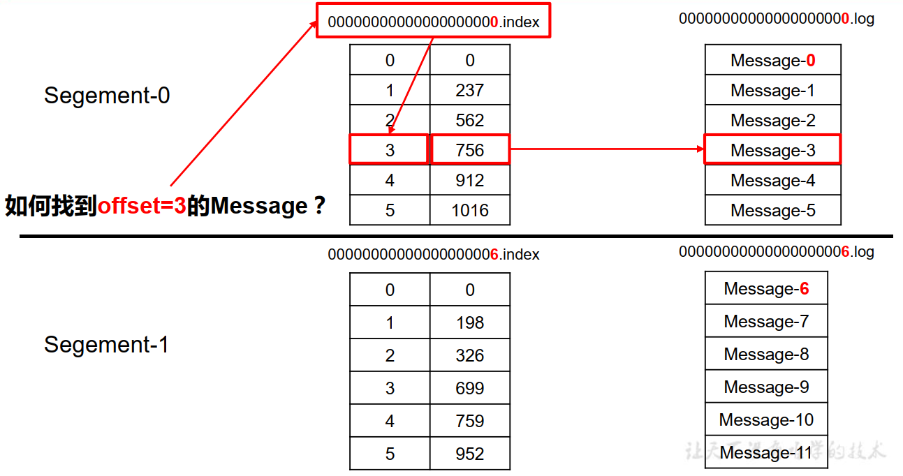
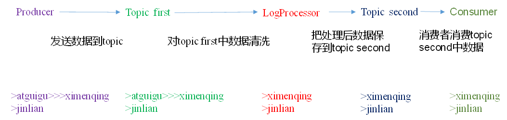

笔记来源：尚硅谷视频笔记2.0版+2.1版 黑马视频：Kafka深入探秘者来了

笔记、代码下载地址：https://me.csdn.net/download/hancoder

# 第1章 Kafka概述

### 1.1 定义

Kafka 是一个分布式的基于【发布/订阅模式】的消息队列（Message Queue），主要应用于
大数据实时处理领域。

### 1.2 消息队列

消息队列又称消息引擎，消息中间件

#### 1.2.1 传统消息队列的应用场景


#### 消息队列的好处

1）解耦：

允许你独立的扩展或修改两边的处理过程，只要确保它们遵守同样的接口约束。

2）冗余：

消息队列把数据进行持久化直到它们已经被完全处理，通过这一方式规避了数据丢失风险。许多消息队列所采用的"插入-获取-删除"范式中，在把一个消息从队列中删除之前，需要你的处理系统明确的指出该消息已经被处理完毕，从而确保你的数据被安全的保存直到你使用完毕。

3）扩展性：

因为消息队列解耦了你的处理过程，所以增大消息入队和处理的频率是很容易的，只要另外增加处理过程即可。

4）灵活性 & 峰值处理能力：

在访问量剧增的情况下，应用仍然需要继续发挥作用，但是这样的突发流量并不常见。如果为以能处理这类峰值访问为标准来投入资源随时待命无疑是巨大的浪费。使用消息队列能够使关键组件顶住突发的访问压力，而不会因为突发的超负荷的请求而完全崩溃。

5）可恢复性：

系统的一部分组件失效时，不会影响到整个系统。消息队列降低了进程间的耦合度，所以即使一个处理消息的进程挂掉，加入队列中的消息仍然可以在系统恢复后被处理。

6）顺序保证：

在大多使用场景下，数据处理的顺序都很重要。大部分消息队列本来就是排序的，并且能保证数据会按照特定的顺序来处理。（Kafka保证一个Partition内的消息的有序性）

7）缓冲：

有助于控制和优化数据流经过系统的速度，解决生产消息和消费消息的处理速度不一致的情况。

8）异步通信：

很多时候，用户不想也不需要立即处理消息。消息队列提供了异步处理机制，允许用户把一个消息放入队列，但并不立即处理它。想向队列中放入多少消息就放多少，然后在需要的时候再去处理它们。


#### 1.2.2 消息队列的两种模式

消息队列分为

- 点对点模式
- 发布/订阅模式

（1）点对点模式（一对一，消费者主动拉取数据，消息收到后消息清除）

点对点模型通常是一个基于拉取或者轮询的消息传送模型，这种模型从队列中请求信息，而不是将消息推送到客户端。这个模型的特点是发送到队列的消息被一个且只有一个接收者接收处理，即使有多个消息监听者也是如此。

- 消息被消费后就从队列移除该消息
- 每条消息由一个生产者生产，且只被一个消费者消费（即使该队列有多个消费者）。
- 生产者和消费者是一对一模式

消息生产者生产消息发送到Queue中，然后消息消费者从Queue中取出并且消费消息。
消息被消费以后，queue 中不再有存储，所以消息消费者不可能消费到已经被消费的消息。


（2）发布/订阅模式（一对多，数据生产后，推送给所有订阅者，消费者消费数据之后不会清除消息）

发布订阅模型则是一个基于推送的消息传送模型。发布订阅模型可以有多种不同的订阅者，临时订阅者只在主动监听主题时才接收消息，而持久订阅者则监听主题的所有消息，即使当前订阅者不可用，处于离线状态。

- 所有订阅了该主题的消费者都能收到同样的消息


### 1.3 什么是Kafka

在流式计算中，Kafka一般用来缓存数据，Storm通过消费Kafka的数据进行计算。

1）Apache Kafka是一个开源消息系统，由Scala写成。是由Apache软件基金会开发的一个开源消息系统项目。（是基于scala开发的）

2）Kafka最初是由LinkedIn公司开发，并于2011年初开源。2012年10月从Apache Incubator毕业。该项目的目标是为处理实时数据提供一个统一、高通量、低等待的平台。

3）Kafka是一个分布式消息队列。**Kafka对消息保存时根据Topic主题进行归类**，发送消息者称为Producer，消息接受者称为Consumer，此外kafka集群有多个kafka实例组成，每个实例(server)称为broker。

消息队列保存在一个一个的Topic主题中。类似于一个水池子。

4）无论是kafka集群，还是consumer都依赖于zookeeper集群保存一些meta信息，来保证系统可用性。

每台kafka服务器称为broker

### 1.4 Kafka架构

Kafka整体架构图


Kafka详细架构图


### 1.5 kafka名词解释

1）Producer ：消息生产者，就是向kafka broker发消息的客户端；

2）Consumer ：消息消费者，向kafka broker取消息的客户端；

3）Topic ：可以理解为一个队列， 生产者和消费者面向的都是一个 topic；

4） Consumer Group （CG）消费者组：这是kafka用来实现一个topic消息的广播（发给所有的consumer）和单播（发给任意一个consumer）的手段。一个topic可以有多个CG。topic的消息会复制（不是真的复制，是概念上的）到所有的CG，但每个partion只会把消息发给该CG中的一个consumer。如果需要实现广播，只要每个consumer有一个独立的CG就可以了。要实现单播只要所有的consumer在同一个CG。用CG还可以将consumer进行自由的分组而不需要多次发送消息到不同的topic；。 消费者组内每个消费者负责消费不同分区的数据，一个分区只能由一个 组内 消费者消费；消费者组之间互不影响。所有的消费者都属于某个消费者组，即 消费者组是逻辑上的一个订阅者

5）Broker ：一台kafka服务器就是一个broker。一个集群由多个broker组成。一个broker可以容纳多个topic；

6）Partition分区：为了实现扩展性，一个非常大的topic可以分布到多个broker（即服务器）上，一个topic可以分为多个partition，每个partition是一个有序的队列。partition中的每条消息都会被分配一个有序的id（offset）。kafka只保证按一个partition中的顺序将消息发给consumer，不保证一个topic的整体（多个partition间）的顺序；是针对主题的分区，而不是broker

7）Offset：kafka的存储文件都是按照offset.kafka来命名，用offset做名字的好处是方便查找。例如你想找位于2049的位置，只要找到2048.kafka的文件即可。当然the first offset就是00000000000.kafka。

8） Replica： ：副本，为保证集群中的某个节点发生故障时，该节点上的 partition 数据不丢失，且 kafka 仍然能够继续工作，kafka 提供了副本机制，一个 topic 的每个分区都有若干个副本，一个 leader 和若干个 follower。kafka保证同一个partition的多个replication一定不会分配在同一台broker上.如果同一个partition的多个replication在同一个broker上，那么备份就没有意义了

9 ）leader ：每个分区多个副本的“主”，生产者发送数据的对象，以及消费者消费数据的对象都是 leader。服务和消费都只找leader，follow仅仅当备份作用。

10 ）follower ：每个分区多个副本中的“从”，实时从 leader 中同步数据，保持和 leader 数据的同步。leader 发生故障时，某个 follower 会成为新的 follower。follower只用于同步数组，消费者不能从follower消费

### 1.6 消息格式

kafka的消息格式由很多字段组成。V1版本的消息完成格式为

- CRC：4B
- 版本号1B
- 属性1B：低三位保存消息的压缩类型。0无压缩，1GZIP，2Snappy，3LZ4
- 时间戳8B
- key长度4B
- key k个字节
- value长度 4B
- value v个字节

因为消息格式是确定的，每个字段都占用了固定的字节，如果我们发送一个非常小的消息的时候却花费了很多功夫在格式上。因此kafka使用紧凑二进制字节数组ByteBuffer而不是独立的对象，

# 第2章 Kafka集群部署

## 2.1 环境准备

### 2.1.1 集群规划

hadoop102 hadoop103 hadoop104

zk zk zk

kafka kafka kafka

### 2.1.2 jar包下载

http://kafka.apache.org/downloads.html

## 2.2 Kafka集群部署

1）解压安装包

```sh
[atguigu@hadoop102 software]$ tar -zxvf kafka_2.11-0.11.0.0.tgz -C /opt/module/
1
```

2）修改解压后的文件名称

```sh
[atguigu@hadoop102 module]$ mv kafka_2.11-0.11.0.0/ kafka
1
```

3）在/opt/module/kafka目录下创建logs文件夹

```sh
[atguigu@hadoop102 kafka]$ mkdir logs
1
```

4）修改配置文件

```BASH
[atguigu@hadoop102 kafka]$ cd config/
[atguigu@hadoop102 config]$ vi server.properties
12
```

输入以下内容：

```BASH
#broker的全局唯一编号，不能重复
broker.id=0

#删除topic功能使能
delete.topic.enable=true

#处理网络请求的线程数量
num.network.threads=3

#用来处理磁盘IO的现成数量
num.io.threads=8

#发送套接字的缓冲区大小
socket.send.buffer.bytes=102400

#接收套接字的缓冲区大小
socket.receive.buffer.bytes=102400

#请求套接字的缓冲区大小
socket.request.max.bytes=104857600

#kafka运行日志存放的路径  #最好写成data。他里面的00000.log是存放的数据
log.dirs=/opt/module/kafka/logs

#topic在当前broker上的分区个数
num.partitions=1

#用来恢复和清理data下数据的线程数量
num.recovery.threads.per.data.dir=1

#segment文件保留的最长时间，超时将被删除
log.retention.hours=168

#配置连接Zookeeper集群地址
zookeeper.connect=hadoop102:2181,hadoop103:2181,hadoop104:2181
1234567891011121314151617181920212223242526272829303132333435
```

5）配置环境变量

```SH
[atguigu@hadoop102 module]$ sudo vi /etc/profile

#KAFKA_HOME
export KAFKA_HOME=/opt/module/kafka
export PATH=$PATH:$KAFKA_HOME/bin

[atguigu@hadoop102 module]$ source /etc/profile
1234567
```

6）分发安装包

```SH
[atguigu@hadoop102 module]$ xsync kafka/
1
```

 注意：分发之后记得配置其他机器的环境变量

7）分别在hadoop103和hadoop104上修改配置文件`/opt/module/kafka/config/server.properties`中的`broker.id=1、broker.id=2`

 注：broker.id不得重复

8）启动集群

依次在hadoop102、hadoop103、hadoop104节点上启动kafka

```SH
# 注意命令后面有个&符号。&符号代表后台启动
[atguigu@hadoop102 kafka]$ /opt/module/kafka_2.11-0.11.0.0/bin/kafka-server-start.sh /opt/module/kafka_2.11-0.11.0.0/config/server.properties &

[atguigu@hadoop103 kafka]$ bin/kafka-server-start.sh config/server.properties &

[atguigu@hadoop104 kafka]$ bin/kafka-server-start.sh config/server.properties &
123456
```

9）关闭集群

```SH
[atguigu@hadoop102 kafka]$ bin/kafka-server-stop.sh stop

[atguigu@hadoop103 kafka]$ bin/kafka-server-stop.sh stop

[atguigu@hadoop104 kafka]$ bin/kafka-server-stop.sh stop
12345
```

10）kafka 群起脚本

```sh
for i in hadoop102 hadoop103 hadoop104
do
echo "========== $i =========="
ssh  $i  '/opt/module/kafka/bin/kafka-server-start.sh  -daemon /opt/module/kafka/config/server.properties'
done
12345
```

## 2.3 Kafka命令行操作

##### 1）查看topic

```SH
# 查看当前服务器所有topic
bin/kafka-topics.sh --zookeeper hadoop102:2181 --list

# 查看刚才创建的topic
bin/kafka-topics.sh --zookeeper hadoop102:2181  --describe --topic first
12345
```

##### 2）创建topic

```SH
bin/kafka-topics.sh --zookeeper hadoop102:2181 --create --replication-factor 2 --partitions 2 --topic first
1
```

选项说明：

- –topic 定义topic名
- –replication-factor 定义副本数
- –partitions 定义分区数

> 修改partition数目：
>
> ```SH
> # 修改成2个分区 2个副本 只能增加分区，不能减少分区
> bin/kafka-topics.sh --alter --zookeeper hadoop102:2181 --topic first --partitions 2
> 
> # 看一下修改成功没有
> bin/kafka-topics.sh --zookeeper hadoop102:2181 --describe --topic first
> 12345
> ```

##### 3）删除topic

```SH
[atguigu@hadoop102 kafka]$ bin/kafka-topics.sh --zookeeper hadoop102:2181 --delete --topic first
1
```

前提：需要server.properties中设置delete.topic.enable=true否则只是标记删除或者直接重启。

- 若delete.topic.enable=true：直接彻底删除该topic
- 若delete.topic.enable=false(默认)：
  - 若该topic没有被使用过，没有传输过信息，直接彻底删除
  - 若该topic被使用过，传输过信息，并没有真正删除topic，只是把该topic标记为删除(marked for deletion)，重启kafka server后删除

##### 4）发送消息

生产者不和zookeeper打交道

```SH
# 用生产者控制台 连接hadoop102这台服务器里的broker 获取其中的名为first主题 向这个主题中生产数据 
bin/kafka-console-producer.sh --broker-list hadoop102:9092 --topic first

#生产了2个数据hello world、atguigu
\>hello world
\>atguigu atguigu
123456
```

##### 5）消费消息

消费者跟zookeeper打交道，记录上一次消费到哪了需要给zookeeper备份

```SH
# 用消费者控制平台去 hadoop102这台zookeeper里 去消费 主题为first的主题
bin/kafka-console-consumer.sh --zookeeper hadoop102:2181 --from-beginning --topic first


#查看所有正在连接的Consumer信息
bin/kafka-consumer-groups.sh --zookeeper localhost:2181 --list

bin/kafka-consumer-groups.sh --new-consumer --bootstrap-server localhost:9092 --list

#查看单个Consumer信息
bin/kafka-consumer-groups.sh --zookeeper localhost:2181 --describe --group BrowseConsumer

bin/kafka-consumer-groups.sh --new-consumer --bootstrap-server localhost:9092 --describe --group BrowseConsumer

#重头开始消费某个Topic
bin/kafka-console-consumer.sh --zookeeper localhost:2181 --from-beginning --topic xxx

bin/kafka-console-consumer.sh --new-consumer --bootstrap-server localhost:9092 --from-beginning --topic xxx
123456789101112131415161718
```

- –from-beginning：会把first主题中以往所有的数据都读取出来。根据业务场景选择是否增加该配置。
- 订阅了但不在线，等上线之后是能读到消息的

6）查看某个Topic的详情

```SH
1
```

修改conf中的log.dirs为data

# 第3章 Kafka工作流程分析


## 3.1 kafka工作流程及文件存储机制


Kafka 中消息是以 topic 进行分类的， 生产者生产消息，消费者消费消息，都是面向 topic的。

topic 是逻辑上的概念，而 partition 是物理上的概念，每个 partition 对应于一个 log 文件，该 log 文件中存储的就是 producer 生产的数据。 Producer 生产的数据会被不断追加到该log 文件末端，且每条数据都有自己的 offset。 消费者组中的每个消费者， 都会实时记录自己消费到了哪个 offset，以便出错恢复时，从上次的位置继续消费


此外，由于生产者生产的消息会不断追加到log文件末尾，为防止log文件过大导致数据定位效率低下，kafka才去了分片和索引机制，将每个partition分为多个segments。每个segment对应两个文件：.index文件和.log文件。这些文件位于一个文件夹partition文件夹下，partition文件夹的命名规则为：top名称+分区序号。

index和log文件已当前segment的第一条消息的offset命名，他俩除了后缀名都一样，是成对出现的。index是索引文件，他有序号i和对应的第i条信息的地址位置，index用二分查找法找到第i条消息的地址，然后用地址去log文件中定位。

```
00000000000000000000.index
00000000000000000000.log
00000000000000170410.index
00000000000000170410.log
00000000000000239430.index
00000000000000239430.log
123456
```

index 和 log 文件以当前 segment 的第一条消息的 offset 命名。下图为 index 文件和 log文件的结构示意图



“.index”文件存储大量的索引信息，“.log”文件存储大量的数据，索引文件中的元
数据指向对应数据文件中 message 的物理偏移地址

- 

## 3.2 Kafka生产过程分析

### 3.2.1 写入方式

producer采用推（push）模式将消息发布到broker，每条消息都被追加（append）到分区（patition）中，属于顺序写磁盘（顺序写磁盘效率比随机写内存要高，保障kafka吞吐率）。

### 3.2.2 分区（Partition）

消息发送时都被发送到一个topic，其本质就是一个目录，而topic是由一些Partition Logs(分区日志)组成，其组织结构如下图所示：


我们可以看到，每个Partition中的消息都是有序的，生产的消息被不断追加到Partition log上，其中的每一个消息都被赋予了一个唯一的offset值。

1）分区的原因

- （1）方便在集群中扩展，每个Partition可以通过调整以适应它所在的机器，而一个topic又可以有多个Partition组成，因此整个集群就可以适应任意大小的数据了；
- （2）可以提高并发，因为可以以Partition为单位读写了。

2）分区的原则

我们需要将producer发送的数据封装成一个ProducerRecord对象。

ProducerRecord类有如下的构造函数

```java
ProducerRecord(String topic, Integer partition, Long timestamp, K key, V value, Iterable<Header> headers) ;
ProducerRecord(String topic, Integer partition, Long timestamp, K key, V value) ;
ProducerRecord(String topic, Integer partition, K key, V value, Iterable<Header> headers) ;
ProducerRecord(String topic, Integer partition, K key, V value);
ProducerRecord(String topic, K key, V value) ;
ProducerRecord(String topic, V value) ;
123456
```

DefaultPartitioner类源，我们也可以模仿他实现Partition接口实现我们自己的分区器

```java
package org.apache.kafka.clients.producer.internals;

/**
 * The default partitioning strategy:
 默认的分区策略：
 如果给定了分区，使用他
 如果没有分区但是有个key，就是就根据key的hash值取分区
 如果分区和key值都没有，就采样轮询
 * <ul>
 * <li>If a partition is specified in the record, use it
 * <li>If no partition is specified but a key is present choose a partition based on a hash of the key
 * <li>If no partition or key is present choose a partition in a round-robin fashion
 */
public class DefaultPartitioner implements Partitioner {

    private final ConcurrentMap<String, AtomicInteger> topicCounterMap = new ConcurrentHashMap<>();

    public void configure(Map<String, ?> configs) {}

    public int partition(String topic,  // 主题
                         Object key,  // 给定的key
                         byte[] keyBytes,  // key序列化后的值
                         Object value,  // 要放入的值
                         byte[] valueBytes, // 序列化后的值
                         Cluster cluster) { // 当前集群
        
        List<PartitionInfo> partitions = cluster.partitionsForTopic(topic);
        // 对应主题的分区数
        int numPartitions = partitions.size();
        // 如果key为null
        if (keyBytes == null) {
            // 获取主题轮询的下一个partition值，但还没取模
            int nextValue = nextValue(topic);
            List<PartitionInfo> availablePartitions = cluster.availablePartitionsForTopic(topic);
            if (availablePartitions.size() > 0) {
                // 把上面的partition值取模得到真正的分区值
                int part = Utils.toPositive(nextValue) % availablePartitions.size();
                // 得到对应的分区
                return availablePartitions.get(part).partition();
            } else {
                // 没有分区
                // no partitions are available, give a non-available partition
                return Utils.toPositive(nextValue) % numPartitions;
            }
        } else {
            // 输入了key值，直接对key的hash值取模就可以得到分区号了
            return Utils.toPositive(Utils.murmur2(keyBytes)) % numPartitions;
        }
    }

    private int nextValue(String topic) {
        AtomicInteger counter = topicCounterMap.get(topic);
        if (null == counter) {
            counter = new AtomicInteger(ThreadLocalRandom.current().nextInt());
            AtomicInteger currentCounter = topicCounterMap.putIfAbsent(topic, counter);
            if (currentCounter != null) {
                counter = currentCounter;
            }
        }
        // 自增
        return counter.getAndIncrement();
    }

    public void close() {}
}
1234567891011121314151617181920212223242526272829303132333435363738394041424344454647484950515253545556575859606162636465
```

### 3.2.2 数据可靠性保证(确认机制)

为保证 producer 发送的数据，能可靠的发送到指定的 topic， topic 的每个 partition 收到producer 发送的数据后， 都需要向 producer 发送ack（acknowledgement 确认收到） ，如果producer 收到 ack， 就会进行下一轮的发送，否则重新发送数据


##### 1） 副本数据同步策略

| 方案                          | 优点                                                     | 缺点                                                        |
| ----------------------------- | -------------------------------------------------------- | ----------------------------------------------------------- |
| 半数以上完成同步， 就发送 ack | 延迟低                                                   | 选举新的 leader 时， 容忍 n 台 节点的故障，需要 2n+1 个副本 |
| 全部完成同步，才发送 ack      | 选举新的 leader 时，容忍 n 台节点的故障，需要 n+1 个副本 | 延迟高                                                      |

Kafka 选择了第二种方案，原因如下：

- 1.同样为了容忍 n 台节点的故障，第一种方案需要 2n+1 个副本，而第二种方案只需要 n+1个副本，而 Kafka 的每个分区都有大量的数据， 第一种方案会造成大量数据的冗余。
- 2.虽然第二种方案的网络延迟会比较高，但网络延迟对 Kafka 的影响较小

##### 2） ISR

采用第二种方案之后，设想以下情景： leader 收到数据，所有 follower 都开始同步数据，**但有一个 follower，因为某种故障**，迟迟不能与 leader 进行同步，那 leader 就要一直等下去，直到它完成同步，才能发送 ack。这个问题怎么解决呢？

Leader 维护了一个动态的 in-sync replica set (ISR)，意为和 leader 保持同步的 follower 集合，即每个partition动态维护一个replication集合。当 ISR 中的 follower 完成数据的同步之后， leader 就会给 follower 发送 ack。如果 follower长 时 间 未 向 leader 同 步 数 据 ， 则 该 follower 将 被 踢 出 ISR ， 该 时 间 阈 值 由 replica.lag.time.max.ms 参数设定。最终目的为在 Leader 发生故障之后，就会从 ISR 中选举新的 leader，不影响使用。

- 对于一个partition，集合中每个replication都同步完后，kafka才会将该消息标记为“已提交”状态，认为该条消息发送成功
- 只要这个集合中至少存在一个replication或者，已提交的信息就不会丢失
- 当一小部分replication开始落后于leader replication的速度速度时，就提出ISR
- 被踢出去的replication还在同步，只是不算在ISR里。被踢出去的同步追上leader后，又重新计入ISR

```sh
bin/kafka-topics.sh --describe --topic first --zookeeper hadoop102:2181
# 输出
Topic:first     PartitionCount:1        ReplicationFactor:3     Configs:
        Topic: first    Partition: 0    Leader: 3       Replicas: 3,4,2 Isr: 3
# 看最后的ISR
12345
```

> 老版本中两个条件： leader与follower消息差距条数、距离上次同步的时间
>
> leader和follower发消息差距大于10条就踢出ISR，如果小于10条再加进来。为什么踢出ISR还会又加进来呢？因为ISR只是决定了什么时候返回ACK，而无论在不在ISR里，都仍在继续同步数据。我们不能因为他慢了点就直接不用他备份。
>
> 生产者以batch发送数据，比如这个batch12条，如果batch大于大于了设定的10条阻塞限制，那么所有的follower都被踢出ISR。频繁发送batch，就频繁加入ISR，踢出ISR，频繁操作ZK

##### 3） ack 应答机制

对于某些不太重要的数据，对数据的可靠性要求不是很高，能够容忍数据的少量丢失，所以没必要等 ISR 中的 follower 全部接收成功。

所以 Kafka 为用户提供了三种可靠性级别，用户根据对可靠性和延迟的要求进行权衡，在生产者段选择以下的配置参数。

acks 参数配置：

- acks=0： producer 不等待 broker 的 ack，这一操作提供了一个最低的延迟， broker一接收到还没有写入磁盘就已经返回，当 broker 故障时有可能丢失数据；
- acks=1： producer等待broker的ack，partition的==leader 落盘(写入磁盘)==成功后返回ack(只等待leader写完就发回ack)，如果在 follower同步成功之前leader故障，那么将会丢失数据；
- acks=-1（all）：producer 等待 broker 的 ack， partition的leader和follower(ISR里的follower) 全部落盘成功后才返回ack。但是如果在follower同步完成后， broker发送ack之前，leader发生故障，那么会造成数据重复。比如ISR中只有一个leader，leader写完了就发送ACK，但是还没同步就挂掉了，此时也会丢失数据。(生产者以为成功了，不会再发送了)

设置方法：

```java
//JAVA API中的
properties.put(ProducerConfig.ASKS_CONFIG,"0");//无需得到回复
12
```


都同步完了，但是还没发ACK时，leader挂掉了，选举一个follower做leader，生产者没有接受到ACK，又重发了一次，造成数据重复。


##### 4） 故障处理细节

leader故障后，follower一个同步到8，一个同步到9，结果选了8位新leader。


LEO-log end offset：指的是每个副本最大的 offset；
HW high water：指的是消费者能见到的最大的 offset， ISR 队列中最小的 LEO。即公共部分，消费者只能看到HW的部分

（1） follower 故障

follower 发生故障后会被临时踢出 ISR，待该 follower 恢复后， follower 会读取本地磁盘记录的上次的 HW，并将 log 文件高于 HW 的部分截取掉，从 HW 开始向 leader 进行同步。

等该 follower 的 LEO 大于等于该 Partition 的 HW，即 follower 追上 leader 之后，就可以重新加入 ISR 了。

（2） leader 故障

leader 发生故障之后，会从 ISR 中选出一个新的 leader，之后，为保证多个副本之间的数据一致性，其余的 follower 会先将各自的 log 文件高于 HW 的部分截掉，然后从新的 leader同步数据。

注意： 这只能保证副本之间的数据一致性，并不能保证数据不丢失或者不重复

### 3.2.3 Exactly Once 语义

精准一次性

将服务器的 ACK 级别设置为-1，可以保证 Producer 到 Server 之间不会丢失数据，即 At Least Once 语义。相对的，将服务器 ACK 级别设置为 0，可以保证生产者每条消息只会被发送一次，即 At Most Once 语义。

At Least Once 可以保证数据不丢失，但是不能保证数据不重复；相对的， At Least Once可以保证数据不重复，但是不能保证数据不丢失。 但是，对于一些非常重要的信息，比如说交易数据，下游数据消费者要求数据既不重复也不丢失，即 Exactly Once 语义。 在 0.11 版本以前的 Kafka，对此是无能为力的，只能保证数据不丢失，再在下游消费者对数据做全局去重。对于多个下游应用的情况，每个都需要单独做全局去重，这就对性能造成了很大影响。

0.11 版本的 Kafka，引入了一项重大特性：幂等性。所谓的幂等性就是指 Producer 不论向 Server 发送多少次重复数据， Server 端都只会持久化一条。幂等性结合 At Least Once 语义，就构成了 Kafka 的 Exactly Once 语义。即：

```
At Least Once + 幂等性 = Exactly Once
1
```

要启用幂等性，只需要将 Producer 的参数中 enable.idompotence 设置为 true 即可。 Kafka的幂等性实现其实就是将原来下游需要做的去重放在了数据上游。开启幂等性的 Producer 在初始化的时候会被分配一个 PID，发往同一 Partition 的消息会附带 Sequence Number。而Broker 端会对<PID, Partition, SeqNumber>做缓存，当具有相同主键的消息提交时， Broker 只会持久化一条。

但是 PID 重启就会变化，同时不同的 Partition 也具有不同主键，所以幂等性无法保证跨分区跨会话的 Exactly Once

### 3.1.3 副本（Replication）

同一个partition可能会有多个replication（对应 server.properties 配置中的 default.replication.factor=N）。没有replication的情况下，一旦broker 宕机，其上所有 patition 的数据都不可被消费，同时producer也不能再将数据存于其上的patition。引入replication之后，同一个partition可能会有多个replication，而这时需要在这些replication之间选出一个leader，producer和consumer只与这个leader交互，其它replication作为follower从leader 中复制数据。

### 3.1.4 写入流程

producer写入消息流程如下：


- 1）producer先从zookeeper的 "/brokers/…/state"节点找到该partition的leader
- 2）producer将消息发送给该leader
- 3）leader将消息写入本地log
- 4）followers从leader pull消息，写入本地log后向leader发送ACK
- 5）leader收到所有ISR中的replication的ACK后，增加HW（high watermark，最后commit 的offset）并向producer发送ACK

## 3.2 Broker 保存消息

### 3.2.1 存储方式

物理上把topic分成一个或多个patition（对应 server.properties 中的num.partitions=3配置），每个patition物理上对应一个文件夹（该文件夹存储该patition的所有消息和索引文件），如下：

```sh
[atguigu@hadoop102 logs]$ ll # 如下first这个topic有3个分区012
drwxrwxr-x. 2 atguigu atguigu 4096 8月  6 14:37 first-0
drwxrwxr-x. 2 atguigu atguigu 4096 8月  6 14:35 first-1
drwxrwxr-x. 2 atguigu atguigu 4096 8月  6 14:37 first-2

# 去0号分区里看看
[atguigu@hadoop102 logs]$ cd first-0 
[atguigu@hadoop102 first-0]$ ll
-rw-rw-r--. 1 atguigu atguigu 10485760 8月  6 14:33 00000000000000000000.index
-rw-rw-r--. 1 atguigu atguigu   219 8月  6 15:07 00000000000000000000.log
-rw-rw-r--. 1 atguigu atguigu 10485756 8月  6 14:33 00000000000000000000.timeindex
-rw-rw-r--. 1 atguigu atguigu    8 8月  6 14:37 leader-epoch-checkpoint
123456789101112
```

### 3.2.2 存储策略

无论消息是否被消费，kafka都会保留所有消息。有两种策略可以删除旧数据：

- 1）基于时间：log.retention.hours=168
- 2）基于大小：log.retention.bytes=1073741824

需要注意的是，因为Kafka读取特定消息的时间复杂度为O(1)，即与文件大小无关，所以这里删除过期文件与提高 Kafka 性能无关。

### 3.2.3 Zookeeper存储结构


注意：producer不在zk中注册，消费者在zk中注册。

## 3.3 Kafka消费过程分析

consumer 采用 pull（拉） 模式从 broker 中读取数据。

push（推）模式很难适应消费速率不同的消费者，因为消息发送速率是由 broker 决定的。它的目标是尽可能以最快速度传递消息，但是这样很容易造成 consumer 来不及处理消息， 典型的表现就是拒绝服务以及网络拥塞。而 pull 模式则可以根据 consumer 的消费能力以适当的速率消费消息。

pull 模式不足之处是，如果 kafka 没有数据，消费者可能会陷入循环中， 一直返回空数据。 针对这一点， Kafka 的消费者在消费数据时会传入一个时长参数 timeout，如果当前没有数据可供消费， consumer 会等待一段时间之后再返回，这段时长即为 timeout

### 3.3.2 分区分配策略

一个 consumer group 中有多个 consumer，一个 topic 有多个 partition，所以必然会涉及到 partition 的分配问题，即确定那个 partition 由哪个 consumer 来消费。

Kafka 有两种分配策略，一是 RoundRobin，一是 Range 。触发时机：消费者组里个数发生变化时。

##### 1） RoundRobin

1） RoundRobin ：把所有的 partition 和所有的 consumer 都列出来，然后按照 hascode 进行排序，最后通过轮询算法来分配 partition 给到各个消费者。

轮询关注的是组

假如有3个Topic ：T0（三个分区P0-0，P0-1,P0-2），T1(两个分区P1-0,P1-1)，T2(四个分区P2-0，P2-1，P2-2，P2-3)

有三个消费者：C0(订阅了T0，T1),C1（订阅了T1，T2），C2(订阅了T0,T2)

那么分区过程如下图所示


分区将会按照一定的顺序排列起来，消费者将会组成一个环状的结构，然后开始轮询。

C0: P0-0，P0-2，P1-1
C1：P1-0，P2-0，P2-2
C2：P0-1，P2-1，P2-3

##### 2）Range

2）Range：范围分区策略是对每个 topic 而言的。首先对同一个 topic 里面的分区按照序号进行排序，并对消费者（不是消费者组）按照字母顺序进行排序。通过 `partitions数/consumer数` 来决定每个消费者应该消费几个分区。如果除不尽，那么前面几个消费者将会多消费 1 个分区。

range跟组没什么关系，只给订阅了的消费者发，而不是给订阅了的消费者组发

### 3.3.3 offset

由于 consumer 在消费过程中可能会出现断电宕机等故障， consumer 恢复后，需要从故障前的位置的继续消费，所以 consumer 需要实时记录自己消费到了哪个 offset，以便故障恢复后继续消费。


当我们调用poll()时，该方法会返回我们没有消费的消息。当消息被broker返回消费者时，broker并不跟踪这些消息是否被消费者接收到。kafka消费者自身来管理消费的位移，并向消费者提供更新位移的接口，这种更新唯一的方式成为提交。

- 重复消费
- 消息丢失
- 自动提交：这种方式让消费者来管理唯一，应用本身不需要显示操作。当我们将enable.auto.commit设置为true，那么消费者会在poll方法调用后每隔5秒（由auto.commit.interval.ms指定）提交一次位移。和很多其他操作一样，自动提交也是由poll()方法来驱动的。在调用poll()时，消费者判断是否到达提交时间，如果是则提交上一次poll返回的最大位移

在zookeeper里的/brokers里有kafka信息，

```bash
1
```

#### 两种offset

Offset从语义上来看拥有两种：Current Offset和Committed Offset。

##### Current Offset

Current Offset保存在Consumer客户端中，它表示Consumer希望收到的下一条消息的序号。它仅仅在poll()方法中使用。例如，Consumer第一次调用poll()方法后收到了20条消息，那么Current Offset就被设置为20。这样Consumer下一次调用poll()方法时，Kafka就知道应该从序号为21的消息开始读取。这样就能够保证每次Consumer poll消息时，都能够收到不重复的消息。

##### Committed Offset

Committed Offset保存在Broker上，它表示Consumer已经确认消费过的消息的序号。主要通过[`commitSync`](https://links.jianshu.com/go?to=https%3A%2F%2Fkafka.apache.org%2F10%2Fjavadoc%2Forg%2Fapache%2Fkafka%2Fclients%2Fconsumer%2FKafkaConsumer.html%23commitSync--)和[`commitAsync`](https://links.jianshu.com/go?to=https%3A%2F%2Fkafka.apache.org%2F10%2Fjavadoc%2Forg%2Fapache%2Fkafka%2Fclients%2Fconsumer%2FKafkaConsumer.html%23commitAsync-org.apache.kafka.clients.consumer.OffsetCommitCallback-)
API来操作。举个例子，Consumer通过poll() 方法收到20条消息后，此时Current Offset就是20，经过一系列的逻辑处理后，并没有调用`consumer.commitAsync()`或`consumer.commitSync()`来提交Committed Offset，那么此时Committed Offset依旧是0。

Committed Offset主要用于Consumer Rebalance。在Consumer Rebalance的过程中，一个partition被分配给了一个Consumer，那么这个Consumer该从什么位置开始消费消息呢？答案就是Committed Offset。另外，如果一个Consumer消费了5条消息（poll并且成功commitSync）之后宕机了，重新启动之后它仍然能够从第6条消息开始消费，因为Committed Offset已经被Kafka记录为5。

**总结一下，Current Offset是针对Consumer的poll过程的，它可以保证每次poll都返回不重复的消息；而Committed Offset是用于Consumer Rebalance过程的，它能够保证新的Consumer能够从正确的位置开始消费一个partition，从而避免重复消费。**

#### offset保存地址

- 在Kafka 0.9前，Committed Offset信息保存在==zookeeper的[consumers/{group}/offsets/{topic}/{partition}]==目录中（zookeeper其实并不适合进行大批量的读写操作，尤其是写操作）。
- 而在0.9之后，所有的offset信息都保存在了kafka-Broker上的一个名为==__consumer_offsets的topic==中。

```sh
[zk: localhost:2181(CONNECTED) 1] ls /
[cluster, controller_epoch, brokers, zookeeper, admin, isr_change_notification, consumers, latest_producer_id_block, config]

[zk: localhost:2181(CONNECTED) 2] ls /brokers
[ids, topics, seqid]

[zk: localhost:2181(CONNECTED) 3] ls /brokers/ids
[]
[zk: localhost:2181(CONNECTED) 5] ls /brokers/seqid
[]

[zk: localhost:2181(CONNECTED) 4] ls /brokers/topics
[first]


[zk: localhost:2181(CONNECTED) 6] ls /consumers
[console-consumer-9, console-consumer-67579] # 不同机器里的结果是一样的。数字是消费者组

[zk: localhost:2181(CONNECTED) 7] ls /consumers/console-consumer-67579
[ids, owners, offsets]

[zk: localhost:2181(CONNECTED) 8] ls /consumers/console-consumer-67579/offsets
[first]

[zk: localhost:2181(CONNECTED) 9] ls /consumers/console-consumer-67579/offsets/first
[0]


[zk: localhost:2181(CONNECTED) 11] ls /consumers/console-consumer-67579/offsets/first/0
[]

# 67579号消费者组里offset信息里的 主题first 0号partition 的offset
[zk: localhost:2181(CONNECTED) 10] get /consumers/console-consumer-67579/offsets/first/0
4
cZxid = 0x100000060
ctime = Thu Jul 16 15:59:43 CST 2020
mZxid = 0x100000060
mtime = Thu Jul 16 15:59:43 CST 2020
pZxid = 0x100000060
cversion = 0
dataVersion = 0
aclVersion = 0
ephemeralOwner = 0x0
dataLength = 1
numChildren = 0


1234567891011121314151617181920212223242526272829303132333435363738394041424344454647
```

#### offset存储模型

虽然上面说是consumer消费，但实际上记录的是消费者组的offset，消费者并没有offset，如下面的图，记录的是消费者组N对于partitionN都消费到哪里了。

由于一个partition只能固定的交给一个消费者组中的一个消费者消费，因此Kafka保存offset时并不直接为每个消费者保存，而是以groupid-topic-partition -> offset的方式保存。如图所示：


Kafka在保存Offset的时候，实际上是将Consumer Group和partition对应的offset以消息的方式保存在`__consumers_offsets`这个topic中。

`__consumers_offsets`默认拥有50个partition，可以通过的方式来查询某个Consumer Group的offset信息保存在`__consumers_offsets`的哪个partition中。

```java
Math.abs(groupId.hashCode() % offsets.topic.num.partitions) 
1
```

下图展示了`__consumers_offsets`中保存的offset消息的格式：


| 属性    | 说明                           |
| ------- | ------------------------------ |
| Key     | Consumer Group,topic,partition |
| Payload | Offset,metadata,timestamp      |

如图所示，一条offset消息的格式为groupid-topic-partition -> offset。因此consumer poll消息时，已知groupid和topic，又通过Coordinator分配partition的方式获得了对应的partition，自然能够通过Coordinator查找__consumers_offsets的方式获得最新的offset了。

#### Offset查询

前面我们已经描述过offset的存储模型，它是按照**groupid-topic-partition -> offset**的方式存储的。然而Kafka只提供了根据offset读取消息的模型，并不支持根据key读取消息的方式。那么Kafka是如何支持Offset的查询呢？

**答案就是Offsets Cache！！**


如图所示，Consumer提交offset时，Kafka Offset Manager会首先追加一条条新的commit消息到__consumers_offsets topic中，然后更新对应的缓存。读取offset时从缓存中读取，而不是直接读取__consumers_offsets这个topic。

#### 指定消费位置

消息的拉取是 根据poll()方法的逻辑来处理的，但是这个方法对普通开发人员来说是个黑盒子，无法精确账务其消费的起始位置。

seek()方法正好提供了这个功能，让我们得以追踪以前的消费或者回溯消费

```java
public class SeekDemo {
    static String topic="first";


    public static void main(String[] args) {
        Properties properties = initNewConfig();
        KafkaConsumer<String, String> consumer = new KafkaConsumer<>(properties);
        consumer.subscribe(Arrays.asList(topic));
        consumer.poll(Duration.ofMillis(2000));
        Set<TopicPartition> assignment = consumer.assignment();
        System.out.println(assignment);
        Map<TopicPartition, Long> offsets = consumer.endOffsets(assignment);
        for (TopicPartition topicPartition : assignment) {
            // 指定从分区的那个offset开始消费
            consumer.seek(topicPartition,3);
            // 如果想要从分区末尾开始消费
            //            consumer.seek(topicPartition,offsets.get(topicPartition);
        }
        while (true){
            ConsumerRecords<String, String> records = consumer.poll(Duration.ofMillis(1000));
            for (ConsumerRecord<String, String> record : records) {
                System.out.println(record.offset()+":"+record.value());
            }

        }
    }
}
123456789101112131415161718192021222324252627
```

#### 再均衡消费器

再均衡是指，对于一个消费者组，分区的所属从一个消费者转移到另一个消费者的行为，他为消费者组剧本里高可用性和伸缩性提供了保障，使得我们既可以方便又安全地删除组内的消费者或者往消费者组里添加消费者。不过再均衡发生期间，消费者是无法拉取信息的。

```java
// 出现再均衡时，马上再提交一回
public class CommitSynclnRebalance {
    public static void main(String[] args) {
        Properties properties = initNewConfig();
        KafkaConsumer<String, String> consumer = new KafkaConsumer<>(properties);

        HashMap<TopicPartition, OffsetAndMetadata> currentOffsets = new HashMap<>();
        consumer.subscribe(Arrays.asList("first"), new ConsumerRebalanceListener() {
            @Override
            public void onPartitionsRevoked(Collection<TopicPartition> partitions) {
                // 尽量避免重复消费
                consumer.commitAsync(currentOffsets);
            }

            @Override
            public void onPartitionsAssigned(Collection<TopicPartition> partitions) {
                // do nothing
            }
        });

        try {
            while (isRunning.get()){
                ConsumerRecords<String, String> records = consumer.poll(Duration.ofMillis(1000));
                for (ConsumerRecord<String, String> record : records) {
                    System.out.println(record.offset()+":"+record.value());
                    currentOffsets.put(new TopicPartition(record.topic(),record.partition()),new OffsetAndMetadata(record.offset()+1))
                }
    
            }
        } finally {
            consumer.commitAsync(currentOffsets,null);
        }
    }
}

1234567891011121314151617181920212223242526272829303132333435
```

1）修改配置文件 /kafka/conf/consumer.properties

```SH
# 为了看数据
exclude.internal.topics=false
12
```

2）读取 offset

重新启动消费者控制台

0.11.0.0 之前版本:

```sh
bin/kafka-console-consumer.sh --topic __consumer_offsets --zookeeper hadoop102:2181 --formatter "kafka.coordinator.GroupMetadataManager\$OffsetsMessageFormatter" --consumer.config config/consumer.properties --from-beginning
1
```

0.11.0.0 之后版本(含):

```sh
bin/kafka-console-consumer.sh --bootstrap-server hadoop102:9092 --from-beginning --topic first
1
bin/kafka-console-consumer.sh --topic __consumer_offsets --zookeeper hadoop102:2181 --formatter "kafka.coordinator.group.GroupMetadataManager\$OffsetsMessageFormatter" --consumer.config config/consumer.properties --from-beginning
1
```

大概1s更新一次

```sh
# 解读
# [组,主题,分区] # 以这个组合来记录消费者组消费到哪里了
# 后面16代表offset
[console-consumer-16121,first,0]::[OffsetMetadata[16,NO_METADATA],CommitTime 1595055672594,ExpirationTime 1595142072594]
[console-consumer-16121,first,0]::[OffsetMetadata[16,NO_METADATA],CommitTime 1595055677590,ExpirationTime 1595142077590]
[console-consumer-16121,first,0]::[OffsetMetadata[16,NO_METADATA],CommitTime 1595055682592,ExpirationTime 1595142082592]
[console-consumer-16121,first,0]::[OffsetMetadata[16,NO_METADATA],CommitTime 1595055687595,ExpirationTime 1595142087595]
[console-consumer-16121,first,0]::[OffsetMetadata[16,NO_METADATA],CommitTime 1595055692596,ExpirationTime 1595142092596]
[console-consumer-16121,first,0]::[OffsetMetadata[16,NO_METADATA],CommitTime 1595055697597,ExpirationTime 1595142097597]
...
# 然后让生成者又生成了2条，发现从16变到17/18
[console-consumer-16121,first,0]::[OffsetMetadata[17,NO_METADATA],CommitTime 1595056012701,ExpirationTime 1595142412701]
[console-consumer-16121,first,0]::[OffsetMetadata[17,NO_METADATA],CommitTime 1595056017704,ExpirationTime 1595142417704]
[console-consumer-16121,first,0]::[OffsetMetadata[17,NO_METADATA],CommitTime 1595056022708,ExpirationTime 1595142422708]
[console-consumer-16121,first,0]::[OffsetMetadata[18,NO_METADATA],CommitTime 1595056027708,ExpirationTime 1595142427708]
[console-consumer-16121,first,0]::[OffsetMetadata[18,NO_METADATA],CommitTime 1595056032713,ExpirationTime 1595142432713]
...
1234567891011121314151617
```

- （1）指定了patition情况下，则直接使用；
- （2）未指定patition但指定key情况下，将key的hash值与topic的partition数进行取余得到partition值；
- （3）patition和key都未指定情况下，第一次调用时随便生成一个整数（后面每次调用在这个整数上自增），将这个值与topic可用的partition总数取余得到partition值。即使用round-robin算法轮询选出一个patition。

1. 当一个 consumer 加入组时，读取的是原本由其他 consumer 读取的分区。
2. 当一个 consumer 离开组时（被关闭或发生崩溃），原本由它读取的分区将由组里的其他 consumer 来读取。
3. 当 Topic 发生变化时，比如添加了新的分区，会发生分区重分配。

分区的所有权从一个消费者转移到另一个消费者，这样的行为被称为再均衡（rebalance）。再均衡非常重要，为消费者组带来了高可用性和伸缩性，可以放心的增加或移除消费者。

### 3.3.3 消费者组


消费者是以consumer group消费者组的方式工作，由一个或者多个消费者组成一个组，共同消费一个topic。每个分区在同一时间只能由group中的一个消费者读取，但是多个group可以同时消费这个partition。在图中，有一个由三个消费者组成的group，有一个消费者读取主题中的两个分区，另外两个分别读取一个分区。某个消费者读取某个分区，也可以叫做某个消费者是某个分区的拥有者。

在这种情况下，消费者可以通过水平扩展的方式同时读取大量的消息。另外，如果一个消费者失败了，那么其他的group成员会自动负载均衡读取之前失败的消费者读取的分区。

### 3.3.4 消费方式

consumer采用pull（拉）模式从broker中读取数据。

push（推）模式很难适应消费速率不同的消费者，因为消息发送速率是由broker决定的。它的目标是尽可能以最快速度传递消息，但是这样很容易造成consumer来不及处理消息，典型的表现就是拒绝服务以及网络拥塞。而pull模式则可以根据consumer的消费能力以适当的速率消费消息。

对于Kafka而言，pull模式更合适，它可简化broker的设计，consumer可自主控制消费消息的速率，同时consumer可以自己控制消费方式——即可批量消费也可逐条消费，同时还能选择不同的提交方式从而实现不同的传输语义。

pull模式不足之处是，如果kafka没有数据，消费者可能会陷入循环中，一直等待数据到达。为了避免这种情况，我们在我们的拉请求中有参数，允许消费者请求在等待数据到达的“长轮询”中进行阻塞（并且可选地等待到给定的字节数，以确保大的传输大小）。

### 3.3.5 消费者组案例

1）需求：测试同一个消费者组中的消费者，同一时刻只能有一个消费者消费。

2）案例实操

 （1）在hadoop102、hadoop103上修改/opt/module/kafka/config/consumer.properties配置文件中的group.id属性为固定组名。不指定的话，虽然那几个成员还是属于一个组的，但是组名是变化的

```sh
[atguigu@hadoop102 config]$ vim consumer.properties
group.id=atguigu

[atguigu@hadoop103 config]$ vim consumer.properties
group.id=atguigu
12345
```

 （2）在hadoop102、hadoop103上分别启动消费者

```sh
# consumer.properties配置文件里指定了组
[atguigu@hadoop102 kafka]$ bin/kafka-console-consumer.sh --zookeeper hadoop102:2181 --topic first --consumer.config config/consumer.properties

[atguigu@hadoop103 kafka]$ bin/kafka-console-consumer.sh --zookeeper hadoop102:2181 --topic first --consumer.config config/consumer.properties
1234
```

 （3）在hadoop104上启动生产者

```sh
[atguigu@hadoop104 kafka]$ bin/kafka-console-producer.sh  --broker-list hadoop102:9092 --topic first
# 输入
1
2
3
# 发现轮询第输出在了2个消费者上，而不是全输出到一个消费者上
# 增加了消费者后就是一人一个分区了，原来是一人消费2个分区

12345678
```

 （4）查看hadoop102和hadoop103的接收者。

```sh
cd 到zookeeper
bin/zkCli.sh

ls /consumers
console-consumer-9       console-consumer-84342   test-consumer-group      atguigu console-consumer-67579

ls /consumers/atguigu


123456789
```

 同一时刻只有一个消费者接收到消息。

## 3.4 Kafka高效读写数据

1）顺序写磁盘
Kafka 的 producer 生产数据，要写入到 log 文件中，写的过程是一直追加到文件末端，
为顺序写。 官网有数据表明，同样的磁盘，顺序写能到 600M/s，而随机写只有 100K/s。这
与磁盘的机械机构有关，顺序写之所以快，是因为其省去了大量磁头寻址的时间。
2）零复制技术

零拷贝


零宝贝就是直接从File–Page Cache–NIC

## 3.5 Zookeeper 在 Kafka 中的作用

Kafka 集群中有一个 broker 会被选举为 Controller，负责管理集群 broker 的上下线，所
有 topic 的分区副本分配和 leader 选举等工作。
Controller 的管理工作都是依赖于 Zookeeper 的。

以下为 partition 的 leader 选举过程 ：


## 3.6 kafka事务

Kafka 从 0.11 版本开始引入了事务支持。事务可以保证 Kafka 在 Exactly Once 语义的基础上，生产和消费可以跨分区和会话，要么全部成功，要么全部失败

### 3.6.1 Producer 事务

为了实现跨分区跨会话的事务，需要引入一个全局唯一的 Transaction ID，并将 Producer获得的PID 和Transaction ID 绑定。这样当Producer 重启后就可以通过正在进行的 Transaction ID 获得原来的 PID。

为了管理 Transaction， Kafka 引入了一个新的组件 Transaction Coordinator。 Producer 就是通过和 Transaction Coordinator 交互获得 Transaction ID 对应的任务状态。 Transaction Coordinator 还负责将事务所有写入 Kafka 的一个内部 Topic，这样即使整个服务重启，由于事务状态得到保存，进行中的事务状态可以得到恢复，从而继续进行

### 3.6.2 Consumer 事务

上述事务机制主要是从 Producer 方面考虑，对于 Consumer 而言，事务的保证就会相对较弱，尤其时无法保证 Commit 的信息被精确消费。这是由于 Consumer 可以通过 offset 访问任意信息，而且不同的 Segment File 生命周期不同，同一事务的消息可能会出现重启后被删除的情况

# 第4章 [Kafka ](http://www.cnblogs.com/huxi2b/p/7072447.html)API

- 生产者要发送消息的属性封装到Properties中，传到KafkaProducer构造器里，创建一个生产者
- 发送的消息封装成ProducerRecord对象，
- KafkaProducer调用KafkaProducer的send()方法发送到zookeeper，
- 消费者将要订阅的主题封装在Properties对象中，传入KafkaConsumer构造器中，创建一个消费者
- KafkaConsumer调用poll()从zookeeper拉取消费消息
- 发送时将数据序列化，消费时将数据反序列化

## 4.1 Producer API

### 4.1.1 消息发送流程

Kafka 的 Producer 发送消息采用的是异步发送的方式。在消息发送的过程中，涉及到了
两个线程——main 线程和 Sender 线程，以及一个线程共享变量——RecordAccumulator。
main 线程将消息发送给 RecordAccumulator， Sender 线程不断从 RecordAccumulator 中拉取
消息发送到 Kafka broker


相关参数：
batch.size： 只有数据积累到 batch.size 之后， sender 才会发送数据。
linger.ms： 如果数据迟迟未达到 batch.size， sender 等待 linger.time 之后就会发送数据。

### 4.1.2 异步发送 API

1）导入依赖

```xml
<dependency>
    <groupId>org.apache.kafka</groupId>
    <artifactId>kafka-clients</artifactId>
    <version>0.11.0.0</version>
</dependency>
12345
```

2）编写代码
需要用到的类：
KafkaProducer：需要创建一个生产者对象，用来发送数据
ProducerConfig：获取所需的一系列配置参数
ProducerRecord：每条数据都要封装成一个 ProducerRecord 对象

##### 1.不带回调函数的 API

```java
package com.atguigu.kafka;
import org.apache.kafka.clients.producer.*;
import java.util.Properties;
import java.util.concurrent.ExecutionException;
public class CustomProducer {
    public static void main(String[] args) throws ExecutionException,InterruptedException {
        Properties props = new Properties();
        //kafka 集群， broker-list
        props.put("bootstrap.servers", "hadoop102:9092");
        props.put("acks", "all");
        //重试次数
        props.put("retries", 1);
        //批次大小
        props.put("batch.size", 16384);
        //等待时间
        props.put("linger.ms", 1);
        //RecordAccumulator 缓冲区大小
        props.put("buffer.memory", 33554432);
        props.put("key.serializer",
                  "org.apache.kafka.common.serialization.StringSerializer");
        props.put("value.serializer",
                  "org.apache.kafka.common.serialization.StringSerializer");
        Producer<String, String> producer = new
            KafkaProducer<>(props);
        for (int i = 0; i < 100; i++) {
            producer.send(
                new ProducerRecord<String, String>(
                    "first",
                    Integer.toString(i), 
                    Integer.toString(i)));
        }
        producer.close();
    }
}
12345678910111213141516171819202122232425262728293031323334
```

##### 2 带回调函数的API

回调函数会在 producer 收到 ack 时调用，为异步调用， 该方法有两个参数，分别是RecordMetadata 和 Exception，如果 Exception 为 null，说明消息发送成功，如果Exception 不为 null，说明消息发送失败。
注意：消息发送失败会自动重试，不需要我们在回调函数中手动重试。

```java
package com.atguigu.kafka;
import org.apache.kafka.clients.producer.*;
import java.util.Properties;
import java.util.concurrent.ExecutionException;
public class CustomProducer {
    public static void main(String[] args) throws ExecutionException,
    InterruptedException {
        Properties props = new Properties();
        props.put("bootstrap.servers", "hadoop102:9092");//kafka 集
        群， broker-list
            props.put("acks", "all");
        props.put("retries", 1);//重试次数
        props.put("batch.size", 16384);//批次大小
        props.put("linger.ms", 1);//等待时间
        props.put("buffer.memory", 33554432);//RecordAccumulator 缓
        冲区大小
            props.put("key.serializer",
                      "org.apache.kafka.common.serialization.StringSerializer");
        props.put("value.serializer",
                  "org.apache.kafka.common.serialization.StringSerializer");
        Producer<String, String> producer = new
            KafkaProducer<>(props);
        for (int i = 0; i < 100; i++) {
            producer.send(new ProducerRecord<String, String>("first",
                                                             Integer.toString(i), Integer.toString(i)), new Callback() {
                //回调函数， 该方法会在 Producer 收到 ack 时调用，为异步调用
                @Override
                public void onCompletion(RecordMetadata metadata,
                                         Exception exception) {
                    if (exception == null) {
                        System.out.println("success->" +
                                           metadata.offset());
                    } else {
                        exception.printStackTrace();
                    }
                }
            });
        }
        producer.close();
    }
}

123456789101112131415161718192021222324252627282930313233343536373839404142
```

### 4.1.3 同步发送 API

同步发送的意思就是，一条消息发送之后，会阻塞当前线程， 直至返回 ack。
由于 send 方法返回的是一个 Future 对象，根据 Futrue 对象的特点，我们也可以实现同
步发送的效果，只需在调用 Future 对象的 get 方发即可。

```java
package com.atguigu.kafka;
import org.apache.kafka.clients.producer.KafkaProducer;
import org.apache.kafka.clients.producer.Producer;
import org.apache.kafka.clients.producer.ProducerRecord;
import java.util.Properties;
import java.util.concurrent.ExecutionException;
public class CustomProducer {
    public static void main(String[] args) throws ExecutionException,
    InterruptedException {
        Properties props = new Properties();
        props.put("bootstrap.servers", "hadoop102:9092");//kafka 集
        群， broker-list
            props.put("acks", "all");
        props.put("retries", 1);//重试次数
        props.put("batch.size", 16384);//批次大小
        props.put("linger.ms", 1);//等待时间
        props.put("buffer.memory", 33554432);//RecordAccumulator 缓
        冲区大小
            props.put("key.serializer",
                      "org.apache.kafka.common.serialization.StringSerializer");
        props.put("value.serializer",
                  "org.apache.kafka.common.serialization.StringSerializer");
        Producer<String, String> producer = new
            KafkaProducer<>(props);
        for (int i = 0; i < 100; i++) {
            producer.send(new ProducerRecord<String, String>("first",
                                                             Integer.toString(i), Integer.toString(i))).get();
        }
        producer.close();
    }
}
12345678910111213141516171819202122232425262728293031
```

### 黑马

#### 序列化器：

消息要到网络上进行传输，必须进行序列化，而序列化器的作用就是如此。

kafka提供了默认的字符串序列化器`import org.apache.kafka.common.serialization.StringSerializer;`，还有整型和字节数组序列化器，这些序列化器都实现了接口`org.apache.kafka.common.serialization.Serializer`，基本上能够满足大部分场景的需求。

#### 拦截器

Producer烂机器是个相当新的功能，他和consumer端interceptor是在kafka 0.10版本被引入的，主要用于实现clients端的定制化控制逻辑

生产者拦截器可以用在消息发送前做一些准备工作

使用场景：

- 按照某个规则过滤掉不符合要求的消息
- 修改消息的内容
- 统计类需求

```java
1
```

## 4.2 Consumer API

Consumer 消费数据时的可靠性是很容易保证的，因为数据在 Kafka 中是持久化的，故
不用担心数据丢失问题。
由于 consumer 在消费过程中可能会出现断电宕机等故障， consumer 恢复后，需要从故
障前的位置的继续消费，所以 consumer 需要实时记录自己消费到了哪个 offset，以便故障恢
复后继续消费。
所以 offset 的维护是 Consumer 消费数据是必须考虑的问题。

### 4.2.1 自动提交 offset

1）导入依赖

```xml
<dependency>
    <groupId>org.apache.kafka</groupId>
    <artifactId>kafka-clients</artifactId>
    <version>0.11.0.0</version>
</dependency>
12345
```

2）编写代码
需要用到的类：
KafkaConsumer： 需要创建一个消费者对象，用来消费数据
ConsumerConfig： 获取所需的一系列配置参数
ConsuemrRecord： 每条数据都要封装成一个 ConsumerRecord 对象
为了使我们能够专注于自己的业务逻辑， Kafka 提供了自动提交 offset 的功能。

自动提交 offset 的相关参数：
enable.auto.commit： 是否开启自动提交 offset 功能
auto.commit.interval.ms： 自动提交 offset 的时间间隔
以下为自动提交 offset 的代码

```java
package com.atguigu.kafka;
import org.apache.kafka.clients.consumer.ConsumerRecord;
import org.apache.kafka.clients.consumer.ConsumerRecords;
import org.apache.kafka.clients.consumer.KafkaConsumer;
import java.util.Arrays;
import java.util.Properties;
public class CustomConsumer {
    public static void main(String[] args) {
        Properties props = new Properties();
        props.put("bootstrap.servers", "hadoop102:9092");
        props.put("group.id", "test");
        props.put("enable.auto.commit", "true");
        props.put("auto.commit.interval.ms", "1000");
        props.put("key.deserializer",
                  "org.apache.kafka.common.serialization.StringDeserializer");
        props.put("value.deserializer",
                  "org.apache.kafka.common.serialization.StringDeserializer");
        KafkaConsumer<String, String> consumer = new KafkaConsumer<>(props);
        consumer.subscribe(Arrays.asList("first"));
        while (true) {
            ConsumerRecords<String, String> records =
                consumer.poll(100);
            for (ConsumerRecord<String, String> record : records)
                System.out.printf("offset = %d, key = %s, value
                                  = %s%n", record.offset(), record.key(), record.value());
                                  }
                                  }
                                  }
12345678910111213141516171819202122232425262728
```

### 4.2.2 手动提交 offset

虽然自动提交 offset 十分简介便利，但由于其是基于时间提交的， 开发人员难以把握
offset 提交的时机。因此 Kafka 还提供了手动提交 offset 的 API。
手动提交 offset 的方法有两种：分别是 commitSync（同步提交） 和 commitAsync（异步
提交） 。两者的相同点是，都会将本次 poll 的一批数据最高的偏移量提交；不同点是，
commitSync 阻塞当前线程，一直到提交成功，并且会自动失败重试（由不可控因素导致，
也会出现提交失败）；而 commitAsync 则没有失败重试机制，故有可能提交失败。
1） 同步提交 offset
由于同步提交 offset 有失败重试机制，故更加可靠，以下为同步提交 offset 的示例

```java
package com.atguigu.kafka.consumer;
import org.apache.kafka.clients.consumer.ConsumerRecord;
import org.apache.kafka.clients.consumer.ConsumerRecords;
import org.apache.kafka.clients.consumer.KafkaConsumer;
import java.util.Arrays;
import java.util.Properties;
public class CustomComsumer {
    public static void main(String[] args) {
        Properties props = new Properties();
        //Kafka 集群
        props.put("bootstrap.servers", "hadoop102:9092");
        //消费者组，只要 group.id 相同，就属于同一个消费者组
        props.put("group.id", "test");
        props.put("enable.auto.commit", "false");//关闭自动提交offset
        props.put("key.deserializer",
                  "org.apache.kafka.common.serialization.StringDeserializer");
        props.put("value.deserializer",
                  "org.apache.kafka.common.serialization.StringDeserializer");
        KafkaConsumer<String, String> consumer = new
            KafkaConsumer<>(props);
        consumer.subscribe(Arrays.asList("first"));//消费者订阅主题
        while (true) {
            //消费者拉取数据
            ConsumerRecords<String, String> records =
                consumer.poll(100);
            for (ConsumerRecord<String, String> record : records) {
                System.out.printf("offset = %d, key = %s, value = %s%n", record.offset(), record.key(), record.value());
            }
            //同步提交，当前线程会阻塞直到 offset 提交成功
            consumer.commitSync();
        }
    }
}
123456789101112131415161718192021222324252627282930313233
```

##### 2）异步提交 offset

虽然同步提交 offset 更可靠一些，但是由于其会阻塞当前线程，直到提交成功。因此吞
吐量会收到很大的影响。因此更多的情况下，会选用异步提交 offset 的方式。
以下为异步提交 offset 的示例：

```java
package com.atguigu.kafka.consumer;
import org.apache.kafka.clients.consumer.*;
import org.apache.kafka.common.TopicPartition;
import java.util.Arrays;
import java.util.Map;
import java.util.Properties;
public class CustomConsumer {
    public static void main(String[] args) {
        Properties props = new Properties();
        //Kafka 集群
        props.put("bootstrap.servers", "hadoop102:9092");
        //消费者组，只要 group.id 相同，就属于同一个消费者组
        props.put("group.id", "test");
        //关闭自动提交 offset
        props.put("enable.auto.commit", "false");
        props.put("key.deserializer",
                  "org.apache.kafka.common.serialization.StringDeserializer");
        props.put("value.deserializer",
                  "org.apache.kafka.common.serialization.StringDeserializer");
        KafkaConsumer<String, String> consumer = new
            KafkaConsumer<>(props);
        consumer.subscribe(Arrays.asList("first"));//消费者订阅主题
        while (true) {
            ConsumerRecords<String, String> records =
                consumer.poll(100);//消费者拉取数据
            for (ConsumerRecord<String, String> record : records) {
                System.out.printf("offset = %d, key = %s, value = %s%n", record.offset(), record.key(), record.value());
            }
            //异步提交
            consumer.commitAsync(new OffsetCommitCallback() {
                @Override
                public void onComplete(Map<TopicPartition,
                                       OffsetAndMetadata> offsets, Exception exception) {
                    if (exception != null) {
                        System.err.println("Commit failed for" + offsets);
                    }
                }
            });
        }
    }
}
1234567891011121314151617181920212223242526272829303132333435363738394041
```

3） 数据漏消费和重复消费分析
无论是同步提交还是异步提交 offset，都有可能会造成数据的漏消费或者重复消费。先
提交 offset 后消费，有可能造成数据的漏消费；而先消费后提交 offset，有可能会造成数据
的重复消费。

### 4.2.3 自定义存储 offset

Kafka 0.9 版本之前， offset 存储在 zookeeper， 0.9 版本及之后，默认将 offset 存储在 Kafka
的一个内置的 topic 中。除此之外， Kafka 还可以选择自定义存储 offset。
offset 的维护是相当繁琐的， 因为需要考虑到消费者的 Rebalace。
当有新的消费者加入消费者组、 已有的消费者推出消费者组或者所订阅的主题的分区发
生变化，就会触发到分区的重新分配，重新分配的过程叫做 Rebalance。
消费者发生 Rebalance 之后，每个消费者消费的分区就会发生变化。 因此消费者要首先 获取到自己被重新分配到的分区，并且定位到每个分区最近提交的 offset 位置继续消费。
要实现自定义存储 offset，需要借助 ConsumerRebalanceListener， 以下为示例代码，其中提交和获取 offset 的方法，需要根据所选的 offset 存储系统自行实现。

```java
package com.atguigu.kafka.consumer;
import org.apache.kafka.clients.consumer.*;
import org.apache.kafka.common.TopicPartition;
import java.util.*;
public class CustomConsumer {
    private static Map<TopicPartition, Long> currentOffset = new
        HashMap<>();
    public static void main(String[] args) {
        //创建配置信息
        Properties props = new Properties();
        //Kafka 集群
        props.put("bootstrap.servers", "hadoop102:9092");
        //消费者组，只要 group.id 相同，就属于同一个消费者组
        props.put("group.id", "test");
        //关闭自动提交 offset
        props.put("enable.auto.commit", "false");
        //Key 和 Value 的反序列化类
        props.put("key.deserializer",
                  "org.apache.kafka.common.serialization.StringDeserializer");
        props.put("value.deserializer",
                  "org.apache.kafka.common.serialization.StringDeserializer");
        //创建一个消费者
        KafkaConsumer<String, String> consumer = new
            KafkaConsumer<>(props);
        //消费者订阅主题
        consumer.subscribe(Arrays.asList("first"), new
                           ConsumerRebalanceListener() {
                               //该方法会在 Rebalance 之前调用
                               @Override
                               public void
                                   onPartitionsRevoked(Collection<TopicPartition> partitions) {
                                   commitOffset(currentOffset);
                               }
                               //该方法会在 Rebalance 之后调用
                               @Override
                               public void
                                   onPartitionsAssigned(Collection<TopicPartition> partitions) {
                                   currentOffset.clear();
                                   for (TopicPartition partition : partitions) {
                                       consumer.seek(partition, getOffset(partition));//
                                       定位到最近提交的 offset 位置继续消费
                                   }
                               }
                           });
        while (true) {
            ConsumerRecords<String, String> records =
                consumer.poll(100);//消费者拉取数据
            for (ConsumerRecord<String, String> record : records) {
                System.out.printf("offset = %d, key = %s, value = %s%n", record.offset(), record.key(), record.value());
                currentOffset.put(new TopicPartition(record.topic(),
                                                     record.partition()), record.offset());
            }
            commitOffset(currentOffset);//异步提交
        }
    }
    //获取某分区的最新 offset
    private static long getOffset(TopicPartition partition) {
        return 0;
    }
    //提交该消费者所有分区的 offset
    private static void commitOffset(Map<TopicPartition, Long>
                                     currentOffset) {
    }
}
12345678910111213141516171819202122232425262728293031323334353637383940414243444546474849505152535455565758596061626364
```

## 4.1 环境准备

1）启动zk和kafka集群，在kafka集群中打开一个消费者

```sh
[atguigu@hadoop102 kafka]$ bin/kafka-console-consumer.sh \
--zookeeper hadoop102:2181 --topic first
12
```

2）导入pom依赖

```xml
<dependencies>
    <!-- https://mvnrepository.com/artifact/org.apache.kafka/kafka-clients -->
    <dependency>
        <groupId>org.apache.kafka</groupId>
        <artifactId>kafka-clients</artifactId>
        <version>0.11.0.0</version>
    </dependency>
    <!-- https://mvnrepository.com/artifact/org.apache.kafka/kafka -->
    <dependency>
        <groupId>org.apache.kafka</groupId>
        <artifactId>kafka_2.12</artifactId>
        <version>0.11.0.0</version>
    </dependency>
</dependencies>
1234567891011121314
```

## 4.2 Kafka生产者Java API

### 4.2.1 创建生产者（过时的API）

```java
package com.atguigu.kafka;
import java.util.Properties;
import kafka.javaapi.producer.Producer;
import kafka.producer.KeyedMessage;
import kafka.producer.ProducerConfig;

public class OldProducer {

	@SuppressWarnings("deprecation")
	public static void main(String[] args) {
		
		Properties properties = new Properties();
		properties.put("metadata.broker.list", "hadoop102:9092");
		properties.put("request.required.acks", "1");
		properties.put("serializer.class", "kafka.serializer.StringEncoder");
		
		Producer<Integer, String> producer = new Producer<Integer,String>(new ProducerConfig(properties));
		
		KeyedMessage<Integer, String> message = new KeyedMessage<Integer, String>("first", "hello world");
		producer.send(message );
	}
}
12345678910111213141516171819202122
```

### 4.2.2 创建生产者（新API）

```java
package com.atguigu.kafka;
import java.util.Properties;
import org.apache.kafka.clients.producer.KafkaProducer;
import org.apache.kafka.clients.producer.Producer;
import org.apache.kafka.clients.producer.ProducerRecord;

public class NewProducer {

	public static void main(String[] args) {
		
		Properties props = new Properties();
		// Kafka服务端的主机名和端口号
		props.put("bootstrap.servers", "hadoop103:9092");
		// 等待所有副本节点的应答
		props.put("acks", "all");
		// 消息发送最大尝试次数
		props.put("retries", 0);
		// 一批消息处理大小
		props.put("batch.size", 16384);
		// 请求延时
		props.put("linger.ms", 1);
		// 发送缓存区内存大小
		props.put("buffer.memory", 33554432);
		// key序列化
		props.put("key.serializer", "org.apache.kafka.common.serialization.StringSerializer");
		// value序列化
		props.put("value.serializer", "org.apache.kafka.common.serialization.StringSerializer");

		Producer<String, String> producer = new KafkaProducer<>(props);
		for (int i = 0; i < 50; i++) {
			producer.send(new ProducerRecord<String, String>("first", Integer.toString(i), "hello world-" + i));
		}

		producer.close();
	}
}
123456789101112131415161718192021222324252627282930313233343536
```

### 4.2.3 创建生产者带回调函数（新API）

```java
package com.atguigu.kafka;
import java.util.Properties;
import org.apache.kafka.clients.producer.Callback;
import org.apache.kafka.clients.producer.KafkaProducer;
import org.apache.kafka.clients.producer.ProducerRecord;
import org.apache.kafka.clients.producer.RecordMetadata;

public class CallBackProducer {

	public static void main(String[] args) {

Properties props = new Properties();
		// Kafka服务端的主机名和端口号
		props.put("bootstrap.servers", "hadoop103:9092");
		// 等待所有副本节点的应答
		props.put("acks", "all");
		// 消息发送最大尝试次数
		props.put("retries", 0);
		// 一批消息处理大小
		props.put("batch.size", 16384);
		// 增加服务端请求延时
		props.put("linger.ms", 1);
// 发送缓存区内存大小
		props.put("buffer.memory", 33554432);
		// key序列化
		props.put("key.serializer", "org.apache.kafka.common.serialization.StringSerializer");
		// value序列化
		props.put("value.serializer", "org.apache.kafka.common.serialization.StringSerializer");

		KafkaProducer<String, String> kafkaProducer = new KafkaProducer<>(props);

		for (int i = 0; i < 50; i++) {

			kafkaProducer.send(new ProducerRecord<String, String>("first", "hello" + i), new Callback() {

				@Override
				public void onCompletion(RecordMetadata metadata, Exception exception) {

					if (metadata != null) {

						System.err.println(metadata.partition() + "---" + metadata.offset());
					}
				}
			});
		}

		kafkaProducer.close();
	}
}
12345678910111213141516171819202122232425262728293031323334353637383940414243444546474849
```

### 4.2.4 自定义分区生产者

0）需求：将所有数据存储到topic的第0号分区上

1）定义一个类实现Partitioner接口，重写里面的方法（过时API）

```java
package com.atguigu.kafka;
import java.util.Map;
import kafka.producer.Partitioner;

public class CustomPartitioner implements Partitioner {

	public CustomPartitioner() {
		super();
	}

	@Override
	public int partition(Object key, int numPartitions) {
		// 控制分区
		return 0;
	}
}
12345678910111213141516
```

2）自定义分区（新API）

```java
package com.atguigu.kafka;
import java.util.Map;
import org.apache.kafka.clients.producer.Partitioner;
import org.apache.kafka.common.Cluster;

public class CustomPartitioner implements Partitioner {

	@Override
	public void configure(Map<String, ?> configs) {
		
	}

	@Override
	public int partition(String topic, Object key, byte[] keyBytes, Object value, byte[] valueBytes, Cluster cluster) {
        // 控制分区
		return 0;
	}

	@Override
	public void close() {
		
	}
}
1234567891011121314151617181920212223
```

3）在代码中调用

```java
package com.atguigu.kafka;
import java.util.Properties;
import org.apache.kafka.clients.producer.KafkaProducer;
import org.apache.kafka.clients.producer.Producer;
import org.apache.kafka.clients.producer.ProducerRecord;

public class PartitionerProducer {

	public static void main(String[] args) {
		
		Properties props = new Properties();
		// Kafka服务端的主机名和端口号
		props.put("bootstrap.servers", "hadoop103:9092");
		// 等待所有副本节点的应答
		props.put("acks", "all");
		// 消息发送最大尝试次数
		props.put("retries", 0);
		// 一批消息处理大小
		props.put("batch.size", 16384);
		// 增加服务端请求延时
		props.put("linger.ms", 1);
		// 发送缓存区内存大小
		props.put("buffer.memory", 33554432);
		// key序列化
		props.put("key.serializer", "org.apache.kafka.common.serialization.StringSerializer");
		// value序列化
		props.put("value.serializer", "org.apache.kafka.common.serialization.StringSerializer");
		// 自定义分区
		props.put("partitioner.class", "com.atguigu.kafka.CustomPartitioner");

		Producer<String, String> producer = new KafkaProducer<>(props);
		producer.send(new ProducerRecord<String, String>("first", "1", "atguigu"));

		producer.close();
	}
}
123456789101112131415161718192021222324252627282930313233343536
```

4）测试

 （1）在hadoop102上监控/opt/module/kafka/logs/目录下first主题3个分区的log日志动态变化情况

```sh
[atguigu@hadoop102 first-0]$ tail -f 00000000000000000000.log
[atguigu@hadoop102 first-1]$ tail -f 00000000000000000000.log
[atguigu@hadoop102 first-2]$ tail -f 00000000000000000000.log
123
```

 （2）发现数据都存储到指定的分区了。

## 4.3 Kafka消费者Java API

### 4.3.1 高级API

0）在控制台创建发送者

```sh
[atguigu@hadoop104 kafka]$ bin/kafka-console-producer.sh \
--broker-list hadoop102:9092 --topic first
\>hello world
123
```

1）创建消费者（过时API）

```java
package com.atguigu.kafka.consume;
import java.util.HashMap;
import java.util.List;
import java.util.Map;
import java.util.Properties;
import kafka.consumer.Consumer;
import kafka.consumer.ConsumerConfig;
import kafka.consumer.ConsumerIterator;
import kafka.consumer.KafkaStream;
import kafka.javaapi.consumer.ConsumerConnector;

public class CustomConsumer {

	@SuppressWarnings("deprecation")
	public static void main(String[] args) {
		Properties properties = new Properties();
		
		properties.put("zookeeper.connect", "hadoop102:2181");
		properties.put("group.id", "g1");
		properties.put("zookeeper.session.timeout.ms", "500");
		properties.put("zookeeper.sync.time.ms", "250");
		properties.put("auto.commit.interval.ms", "1000");
		
		// 创建消费者连接器
		ConsumerConnector consumer = Consumer.createJavaConsumerConnector(new ConsumerConfig(properties));
		
		HashMap<String, Integer> topicCount = new HashMap<>();
		topicCount.put("first", 1);
		
		Map<String, List<KafkaStream<byte[], byte[]>>> consumerMap = consumer.createMessageStreams(topicCount);
		
		KafkaStream<byte[], byte[]> stream = consumerMap.get("first").get(0);
		
		ConsumerIterator<byte[], byte[]> it = stream.iterator();
		
		while (it.hasNext()) {
			System.out.println(new String(it.next().message()));
		}
	}
}
12345678910111213141516171819202122232425262728293031323334353637383940
```

2）官方提供案例（自动维护消费情况）（新API）

```java
package com.atguigu.kafka.consume;
import java.util.Arrays;
import java.util.Properties;
import org.apache.kafka.clients.consumer.ConsumerRecord;
import org.apache.kafka.clients.consumer.ConsumerRecords;
import org.apache.kafka.clients.consumer.KafkaConsumer;

public class CustomNewConsumer {

	public static void main(String[] args) {

		Properties props = new Properties();
		// 定义kakfa 服务的地址，不需要将所有broker指定上 
		props.put("bootstrap.servers", "hadoop102:9092");
		// 制定consumer group 
		props.put("group.id", "test");
		// 是否自动确认offset 
		props.put("enable.auto.commit", "true");
		// 自动确认offset的时间间隔 
		props.put("auto.commit.interval.ms", "1000");
		// key的序列化类
		props.put("key.deserializer", "org.apache.kafka.common.serialization.StringDeserializer");
		// value的序列化类 
		props.put("value.deserializer", "org.apache.kafka.common.serialization.StringDeserializer");
		// 定义consumer 
		KafkaConsumer<String, String> consumer = new KafkaConsumer<>(props);
		
		// 消费者订阅的topic, 可同时订阅多个 
		consumer.subscribe(Arrays.asList("first", "second","third"));

		while (true) {
			// 读取数据，读取超时时间为100ms 
			ConsumerRecords<String, String> records = consumer.poll(100);
			
			for (ConsumerRecord<String, String> record : records)
				System.out.printf("offset = %d, key = %s, value = %s%n", record.offset(), record.key(), record.value());
		}
	}
}
123456789101112131415161718192021222324252627282930313233343536373839
```

### 4.3.2 低级API

实现使用低级API读取指定topic，指定partition,指定offset的数据。

1）消费者使用低级API 的主要步骤：

| 步骤 | 主要工作                               |
| ---- | -------------------------------------- |
| 1    | 根据指定的分区从主题元数据中找到主副本 |
| 2    | 获取分区最新的消费进度                 |
| 3    | 从主副本拉取分区的消息                 |
| 4    | 识别主副本的变化，重试                 |

2）方法描述：

| findLeader()    | 客户端向种子节点发送主题元数据，将副本集加入备用节点 |
| --------------- | ---------------------------------------------------- |
| getLastOffset() | 消费者客户端发送偏移量请求，获取分区最近的偏移量     |
| run()           | 消费者低级AP I拉取消息的主要方法                     |
| findNewLeader() | 当分区的主副本节点发生故障，客户将要找出新的主副本   |

3）代码：

```java
package com.atguigu;
import java.nio.ByteBuffer;
import java.util.ArrayList;
import java.util.Collections;
import java.util.HashMap;
import java.util.List;
import java.util.Map;

import kafka.api.FetchRequest;
import kafka.api.FetchRequestBuilder;
import kafka.api.PartitionOffsetRequestInfo;
import kafka.cluster.BrokerEndPoint;
import kafka.common.ErrorMapping;
import kafka.common.TopicAndPartition;
import kafka.javaapi.FetchResponse;
import kafka.javaapi.OffsetResponse;
import kafka.javaapi.PartitionMetadata;
import kafka.javaapi.TopicMetadata;
import kafka.javaapi.TopicMetadataRequest;
import kafka.javaapi.consumer.SimpleConsumer;
import kafka.message.MessageAndOffset;

public class SimpleExample {
    private List<String> m_replicaBrokers = new ArrayList<>();

    public SimpleExample() {
        m_replicaBrokers = new ArrayList<>();
    }

    public static void main(String args[]) {
        SimpleExample example = new SimpleExample();
        // 最大读取消息数量
        long maxReads = Long.parseLong("3");
        // 要订阅的topic
        String topic = "test1";
        // 要查找的分区
        int partition = Integer.parseInt("0");
        // broker节点的ip
        List<String> seeds = new ArrayList<>();
        seeds.add("192.168.9.102");
        seeds.add("192.168.9.103");
        seeds.add("192.168.9.104");
        // 端口
        int port = Integer.parseInt("9092");
        try {
            example.run(maxReads, topic, partition, seeds, port);
        } catch (Exception e) {
            System.out.println("Oops:" + e);
            e.printStackTrace();
        }
    }

    public void run(long a_maxReads, String a_topic, int a_partition, List<String> a_seedBrokers, int a_port) throws Exception {
        // 获取指定Topic partition的元数据
        PartitionMetadata metadata = findLeader(a_seedBrokers, a_port, a_topic, a_partition);
        if (metadata == null) {
            System.out.println("Can't find metadata for Topic and Partition. Exiting");
            return;
        }
        if (metadata.leader() == null) {
            System.out.println("Can't find Leader for Topic and Partition. Exiting");
            return;
        }
        String leadBroker = metadata.leader().host();
        String clientName = "Client_" + a_topic + "_" + a_partition;

        SimpleConsumer consumer = new SimpleConsumer(leadBroker, a_port, 100000, 64 * 1024, clientName);
        long readOffset = getLastOffset(consumer, a_topic, a_partition, kafka.api.OffsetRequest.EarliestTime(), clientName);
        int numErrors = 0;
        while (a_maxReads > 0) {
            if (consumer == null) {
                consumer = new SimpleConsumer(leadBroker, a_port, 100000, 64 * 1024, clientName);
            }
            FetchRequest req = new FetchRequestBuilder().clientId(clientName).addFetch(a_topic, a_partition, readOffset, 100000).build();
            FetchResponse fetchResponse = consumer.fetch(req);

            if (fetchResponse.hasError()) {
                numErrors++;
                // Something went wrong!
                short code = fetchResponse.errorCode(a_topic, a_partition);
                System.out.println("Error fetching data from the Broker:" + leadBroker + " Reason: " + code);
                if (numErrors > 5)
                    break;
                if (code == ErrorMapping.OffsetOutOfRangeCode()) {
                    // We asked for an invalid offset. For simple case ask for
                    // the last element to reset
                    readOffset = getLastOffset(consumer, a_topic, a_partition, kafka.api.OffsetRequest.LatestTime(), clientName);
                    continue;
                }
                consumer.close();
                consumer = null;
                leadBroker = findNewLeader(leadBroker, a_topic, a_partition, a_port);
                continue;
            }
            numErrors = 0;

            long numRead = 0;
            for (MessageAndOffset messageAndOffset : fetchResponse.messageSet(a_topic, a_partition)) {
                long currentOffset = messageAndOffset.offset();
                if (currentOffset < readOffset) {
                    System.out.println("Found an old offset: " + currentOffset + " Expecting: " + readOffset);
                    continue;
                }
                readOffset = messageAndOffset.nextOffset();
                ByteBuffer payload = messageAndOffset.message().payload();

                byte[] bytes = new byte[payload.limit()];
                payload.get(bytes);
                System.out.println(String.valueOf(messageAndOffset.offset()) + ": " + new String(bytes, "UTF-8"));
                numRead++;
                a_maxReads--;
            }

            if (numRead == 0) {
                try {
                    Thread.sleep(1000);
                } catch (InterruptedException ie) {
                }
            }
        }
        if (consumer != null)
            consumer.close();
    }

    public static long getLastOffset(SimpleConsumer consumer, String topic, int partition, long whichTime, String clientName) {
        TopicAndPartition topicAndPartition = new TopicAndPartition(topic, partition);
        Map<TopicAndPartition, PartitionOffsetRequestInfo> requestInfo = new HashMap<TopicAndPartition, PartitionOffsetRequestInfo>();
        requestInfo.put(topicAndPartition, new PartitionOffsetRequestInfo(whichTime, 1));
        kafka.javaapi.OffsetRequest request = new kafka.javaapi.OffsetRequest(requestInfo, kafka.api.OffsetRequest.CurrentVersion(), clientName);
        OffsetResponse response = consumer.getOffsetsBefore(request);

        if (response.hasError()) {
            System.out.println("Error fetching data Offset Data the Broker. Reason: " + response.errorCode(topic, partition));
            return 0;
        }
        long[] offsets = response.offsets(topic, partition);
        return offsets[0];
    }


    private String findNewLeader(String a_oldLeader, String a_topic, int a_partition, int a_port) throws Exception {
        for (int i = 0; i < 3; i++) {
            boolean goToSleep = false;
            PartitionMetadata metadata = findLeader(m_replicaBrokers, a_port, a_topic, a_partition);
            if (metadata == null) {
                goToSleep = true;
            } else if (metadata.leader() == null) {
                goToSleep = true;
            } else if (a_oldLeader.equalsIgnoreCase(metadata.leader().host()) && i == 0) {
                // first time through if the leader hasn't changed give
                // ZooKeeper a second to recover
                // second time, assume the broker did recover before failover,
                // or it was a non-Broker issue
                //
                goToSleep = true;
            } else {
                return metadata.leader().host();
            }
            if (goToSleep) {
                    Thread.sleep(1000);
            }
        }
        System.out.println("Unable to find new leader after Broker failure. Exiting");
        throw new Exception("Unable to find new leader after Broker failure. Exiting");
    }

    private PartitionMetadata findLeader(List<String> a_seedBrokers, int a_port, String a_topic, int a_partition) {
        PartitionMetadata returnMetaData = null;
        loop:
        for (String seed : a_seedBrokers) {
            SimpleConsumer consumer = null;
            try {
                consumer = new SimpleConsumer(seed, a_port, 100000, 64 * 1024, "leaderLookup");
                List<String> topics = Collections.singletonList(a_topic);
                TopicMetadataRequest req = new TopicMetadataRequest(topics);
                kafka.javaapi.TopicMetadataResponse resp = consumer.send(req);

                List<TopicMetadata> metaData = resp.topicsMetadata();
                for (TopicMetadata item : metaData) {
                    for (PartitionMetadata part : item.partitionsMetadata()) {
                        if (part.partitionId() == a_partition) {
                            returnMetaData = part;
                            break loop;
                        }
                    }
                }
            } catch (Exception e) {
                System.out.println("Error communicating with Broker [" + seed + "] to find Leader for [" + a_topic + ", " + a_partition + "] Reason: " + e);
            } finally {
                if (consumer != null)
                    consumer.close();
            }
        }
        if (returnMetaData != null) {
            m_replicaBrokers.clear();
            for (BrokerEndPoint replica : returnMetaData.replicas()) {
                m_replicaBrokers.add(replica.host());
            }
        }
        return returnMetaData;
    }
}
123456789101112131415161718192021222324252627282930313233343536373839404142434445464748495051525354555657585960616263646566676869707172737475767778798081828384858687888990919293949596979899100101102103104105106107108109110111112113114115116117118119120121122123124125126127128129130131132133134135136137138139140141142143144145146147148149150151152153154155156157158159160161162163164165166167168169170171172173174175176177178179180181182183184185186187188189190191192193194195196197198199200201202
```

# 第5章 [Kafka producer拦截器(interceptor)](http://www.cnblogs.com/huxi2b/p/7072447.html)

## 5.1 拦截器原理

Producer拦截器(interceptor)是在Kafka 0.10版本被引入的，主要用于实现clients端的定制化控制逻辑。

对于producer而言，interceptor使得用户在消息发送前以及producer回调逻辑前有机会对消息做一些定制化需求，比如修改消息等。同时，producer允许用户指定多个interceptor按序作用于同一条消息从而形成一个拦截链(interceptor chain)。Intercetpor的实现接口是org.apache.kafka.clients.producer.ProducerInterceptor，其定义的方法包括：

（1）configure(configs)

获取配置信息和初始化数据时调用。

（2）onSend(ProducerRecord)：

该方法封装进KafkaProducer.send方法中，即它运行在用户主线程中。Producer确保在消息被序列化以及计算分区前调用该方法。用户可以在该方法中对消息做任何操作，但最好保证不要修改消息所属的topic和分区，否则会影响目标分区的计算

（3）onAcknowledgement(RecordMetadata, Exception)：

该方法会在消息被应答或消息发送失败时调用，并且通常都是在producer回调逻辑触发之前。onAcknowledgement运行在producer的IO线程中，因此不要在该方法中放入很重的逻辑，否则会拖慢producer的消息发送效率

（4）close：

关闭interceptor，主要用于执行一些资源清理工作

如前所述，interceptor可能被运行在多个线程中，因此在具体实现时用户需要自行确保线程安全。另外倘若指定了多个interceptor，则producer将按照指定顺序调用它们，并仅仅是捕获每个interceptor可能抛出的异常记录到错误日志中而非在向上传递。这在使用过程中要特别留意。

## 5.2 拦截器案例

1）需求：

实现一个简单的双interceptor组成的拦截链。第一个interceptor会在消息发送前将时间戳信息加到消息value的最前部；第二个interceptor会在消息发送后更新成功发送消息数或失败发送消息数。


2）案例实操

（1）增加时间戳拦截器

```java
package com.atguigu.kafka.interceptor;
import java.util.Map;
import org.apache.kafka.clients.producer.ProducerInterceptor;
import org.apache.kafka.clients.producer.ProducerRecord;
import org.apache.kafka.clients.producer.RecordMetadata;

public class TimeInterceptor implements ProducerInterceptor<String, String> {

	@Override
	public void configure(Map<String, ?> configs) {

	}

	@Override
	public ProducerRecord<String, String> onSend(ProducerRecord<String, String> record) {
		// 创建一个新的record，把时间戳写入消息体的最前部
		return new ProducerRecord(record.topic(), record.partition(), record.timestamp(), record.key(),
				System.currentTimeMillis() + "," + record.value().toString());
	}

	@Override
	public void onAcknowledgement(RecordMetadata metadata, Exception exception) {

	}

	@Override
	public void close() {

	}
}
123456789101112131415161718192021222324252627282930
```

（2）统计发送消息成功和发送失败消息数，并在producer关闭时打印这两个计数器

```java
package com.atguigu.kafka.interceptor;
import java.util.Map;
import org.apache.kafka.clients.producer.ProducerInterceptor;
import org.apache.kafka.clients.producer.ProducerRecord;
import org.apache.kafka.clients.producer.RecordMetadata;

public class CounterInterceptor implements ProducerInterceptor<String, String>{
    private int errorCounter = 0;
    private int successCounter = 0;

	@Override
	public void configure(Map<String, ?> configs) {
		
	}

	@Override
	public ProducerRecord<String, String> onSend(ProducerRecord<String, String> record) {
		 return record;
	}

	@Override
	public void onAcknowledgement(RecordMetadata metadata, Exception exception) {
		// 统计成功和失败的次数
        if (exception == null) {
            successCounter++;
        } else {
            errorCounter++;
        }
	}

	@Override
	public void close() {
        // 保存结果
        System.out.println("Successful sent: " + successCounter);
        System.out.println("Failed sent: " + errorCounter);
	}
}

1234567891011121314151617181920212223242526272829303132333435363738
```

（3）producer主程序

```java
package com.atguigu.kafka.interceptor;
import java.util.ArrayList;
import java.util.List;
import java.util.Properties;
import org.apache.kafka.clients.producer.KafkaProducer;
import org.apache.kafka.clients.producer.Producer;
import org.apache.kafka.clients.producer.ProducerConfig;
import org.apache.kafka.clients.producer.ProducerRecord;

public class InterceptorProducer {

	public static void main(String[] args) throws Exception {
		// 1 设置配置信息
		Properties props = new Properties();
		props.put("bootstrap.servers", "hadoop102:9092");
		props.put("acks", "all");
		props.put("retries", 0);
		props.put("batch.size", 16384);
		props.put("linger.ms", 1);
		props.put("buffer.memory", 33554432);
		props.put("key.serializer", "org.apache.kafka.common.serialization.StringSerializer");
		props.put("value.serializer", "org.apache.kafka.common.serialization.StringSerializer");
		
		// 2 构建拦截链
		List<String> interceptors = new ArrayList<>();
		interceptors.add("com.atguigu.kafka.interceptor.TimeInterceptor"); 	interceptors.add("com.atguigu.kafka.interceptor.CounterInterceptor"); 
		props.put(ProducerConfig.INTERCEPTOR_CLASSES_CONFIG, interceptors);
		 
		String topic = "first";
		Producer<String, String> producer = new KafkaProducer<>(props);
		
		// 3 发送消息
		for (int i = 0; i < 10; i++) {
			
		    ProducerRecord<String, String> record = new ProducerRecord<>(topic, "message" + i);
		    producer.send(record);
		}
		 
		// 4 一定要关闭producer，这样才会调用interceptor的close方法
		producer.close();
	}
}
123456789101112131415161718192021222324252627282930313233343536373839404142
```

3）测试

（1）在kafka上启动消费者，然后运行客户端java程序。

```sh
[atguigu@hadoop102 kafka]$ bin/kafka-console-consumer.sh \
--zookeeper hadoop102:2181 --from-beginning --topic first

1501904047034,message0
1501904047225,message1
1501904047230,message2
1501904047234,message3
1501904047236,message4
1501904047240,message5
1501904047243,message6
1501904047246,message7
1501904047249,message8
1501904047252,message9
12345678910111213
```

（2）观察java平台控制台输出数据如下：

```sh
Successful sent: 10
Failed sent: 0
12
```

# Kafka监控

5.1 Kafka Eagle
1.修改 kafka 启动命令
修改 kafka-server-start.sh 命令中

```sh
if [ "x$KAFKA_HEAP_OPTS" = "x" ]; then
export KAFKA_HEAP_OPTS="-Xmx1G -Xms1G"
fi
123
```

为

```sh
if [ "x$KAFKA_HEAP_OPTS" = "x" ]; then
export KAFKA_HEAP_OPTS="-server -Xms2G -Xmx2G -XX:PermSize=128m
-XX:+UseG1GC -XX:MaxGCPauseMillis=200 -XX:ParallelGCThreads=8 -
XX:ConcGCThreads=5 -XX:InitiatingHeapOccupancyPercent=70"
export JMX_PORT="9999"
#export KAFKA_HEAP_OPTS="-Xmx1G -Xms1G"
fi
1234567
```

注意：修改之后在启动 Kafka 之前要分发之其他节点
2.上传压缩包 kafka-eagle-bin-1.3.7.tar.gz 到集群/opt/software 目录
3.解压到本地
[atguigu@hadoop102 software]$ tar -zxvf kafka-eagle-bin-
1.3.7.tar.gz
4.进入刚才解压的目录
[atguigu@hadoop102 kafka-eagle-bin-1.3.7]$ ll
总用量 82932
-rw-rw-r–. 1 atguigu atguigu 84920710 8 月 13 23:00 kafka-eagleweb-1.3.7-bin.tar.gz
5.将 kafka-eagle-web-1.3.7-bin.tar.gz 解压至/opt/module
[atguigu@hadoop102 kafka-eagle-bin-1.3.7]$ tar -zxvf kafka-eagleweb-1.3.7-bin.tar.gz -C /opt/module/
6.修改名称
[atguigu@hadoop102 module]$ mv kafka-eagle-web-1.3.7/ eagle
7.给启动文件执行权限

```sh
[atguigu@hadoop102 eagle]$ cd bin/
[atguigu@hadoop102 bin]$ ll
总用量 12
-rw-r--r--. 1 atguigu atguigu 1848 8 月 22 2017 ke.bat
-rw-r--r--. 1 atguigu atguigu 7190 7 月 30 20:12 ke.sh
[atguigu@hadoop102 bin]$ chmod 777 ke.sh
123456
```

8.修改配置文件

```sh
######################################
# multi zookeeper&kafka cluster list
######################################
kafka.eagle.zk.cluster.alias=cluster1
cluster1.zk.list=hadoop102:2181,hadoop103:2181,hadoop104:2181
######################################
# kafka offset storage
######################################
cluster1.kafka.eagle.offset.storage=kafka
######################################
# enable kafka metrics
######################################
kafka.eagle.metrics.charts=true
kafka.eagle.sql.fix.error=false
######################################
# kafka jdbc driver address
######################################
kafka.eagle.driver=com.mysql.jdbc.Driver
kafka.eagle.url=jdbc:mysql://hadoop102:3306/ke?useUnicode=true&ch
aracterEncoding=UTF-8&zeroDateTimeBehavior=convertToNull
kafka.eagle.username=root
kafka.eagle.password=000000
12345678910111213141516171819202122
```

9.添加环境变量
export KE_HOME=/opt/module/eagle
export PATH=PATH:PATH:*P**A**T**H*:KE_HOME/bin
注意： source /etc/profile
10.启动

```sh
[atguigu@hadoop102 eagle]$ bin/ke.sh start
... ...
... ...
*****************************************************************
**
* Kafka Eagle Service has started success.
* Welcome, Now you can visit 'http://192.168.9.102:8048/ke'
* Account:admin ,Password:123456
*****************************************************************
**
* <Usage> ke.sh [start|status|stop|restart|stats] </Usage>
* <Usage> https://www.kafka-eagle.org/ </Usage>
****************************
12345678910111213
```

注意：启动之前需要先启动 ZK 以及 KAFKA

11.登录页面查看监控数据
http://192.168.9.102:8048/ke

# 第6章 Kafka Streams

## 6.1 概述

### 6.1.1 Kafka Streams

Kafka Streams。Apache Kafka开源项目的一个组成部分。是一个功能强大，易于使用的库。用于在Kafka上构建高可分布式、拓展性，容错的应用程序。

### 6.1.2 Kafka Streams特点

1）功能强大

高扩展性，弹性，容错

2）轻量级

无需专门的集群

一个库，而不是框架

3）完全集成

100%的Kafka 0.10.0版本兼容

易于集成到现有的应用程序

4）实时性

毫秒级延迟

并非微批处理

窗口允许乱序数据

允许迟到数据

### 6.1.3 为什么要有Kafka Stream

当前已经有非常多的流式处理系统，最知名且应用最多的开源流式处理系统有Spark Streaming和Apache Storm。Apache Storm发展多年，应用广泛，提供记录级别的处理能力，当前也支持SQL on Stream。而Spark Streaming基于Apache Spark，可以非常方便与图计算，SQL处理等集成，功能强大，对于熟悉其它Spark应用开发的用户而言使用门槛低。另外，目前主流的Hadoop发行版，如Cloudera和Hortonworks，都集成了Apache Storm和Apache Spark，使得部署更容易。

既然Apache Spark与Apache Storm拥用如此多的优势，那为何还需要Kafka Stream呢？主要有如下原因。

第一，Spark和Storm都是流式处理框架，而Kafka Stream提供的是一个基于Kafka的流式处理类库。框架要求开发者按照特定的方式去开发逻辑部分，供框架调用。开发者很难了解框架的具体运行方式，从而使得调试成本高，并且使用受限。而Kafka Stream作为流式处理类库，直接提供具体的类给开发者调用，整个应用的运行方式主要由开发者控制，方便使用和调试。

第二，虽然Cloudera与Hortonworks方便了Storm和Spark的部署，但是这些框架的部署仍然相对复杂。而Kafka Stream作为类库，可以非常方便的嵌入应用程序中，它对应用的打包和部署基本没有任何要求。

第三，就流式处理系统而言，基本都支持Kafka作为数据源。例如Storm具有专门的kafka-spout，而Spark也提供专门的spark-streaming-kafka模块。事实上，Kafka基本上是主流的流式处理系统的标准数据源。换言之，大部分流式系统中都已部署了Kafka，此时使用Kafka Stream的成本非常低。

第四，使用Storm或Spark Streaming时，需要为框架本身的进程预留资源，如Storm的supervisor和Spark on YARN的node manager。即使对于应用实例而言，框架本身也会占用部分资源，如Spark Streaming需要为shuffle和storage预留内存。但是Kafka作为类库不占用系统资源。

第五，由于Kafka本身提供数据持久化，因此Kafka Stream提供滚动部署和滚动升级以及重新计算的能力。

第六，由于Kafka Consumer Rebalance机制，Kafka Stream可以在线动态调整并行度。

## 6.2 Kafka Stream数据清洗案例

0）需求：

 实时处理单词带有”>>>”前缀的内容。例如输入”atguigu>>>ximenqing”，最终处理成“ximenqing”

1）需求分析：



2）案例实操

（1）创建一个工程，并添加jar包

（2）创建主类

```java
package com.atguigu.kafka.stream;
import java.util.Properties;
import org.apache.kafka.streams.KafkaStreams;
import org.apache.kafka.streams.StreamsConfig;
import org.apache.kafka.streams.processor.Processor;
import org.apache.kafka.streams.processor.ProcessorSupplier;
import org.apache.kafka.streams.processor.TopologyBuilder;

public class Application {

	public static void main(String[] args) {

		// 定义输入的topic
        String from = "first";
        // 定义输出的topic
        String to = "second";

        // 设置参数
        Properties settings = new Properties();
        settings.put(StreamsConfig.APPLICATION_ID_CONFIG, "logFilter");
        settings.put(StreamsConfig.BOOTSTRAP_SERVERS_CONFIG, "hadoop102:9092");

        StreamsConfig config = new StreamsConfig(settings);

        // 构建拓扑
        TopologyBuilder builder = new TopologyBuilder();

        builder.addSource("SOURCE", from)
               .addProcessor("PROCESS", new ProcessorSupplier<byte[], byte[]>() {

					@Override
					public Processor<byte[], byte[]> get() {
						// 具体分析处理
						return new LogProcessor();
					}
				}, "SOURCE")
                .addSink("SINK", to, "PROCESS");

        // 创建kafka stream
        KafkaStreams streams = new KafkaStreams(builder, config);
        streams.start();
	}
}

1234567891011121314151617181920212223242526272829303132333435363738394041424344
```

（3）具体业务处理

```java
package com.atguigu.kafka.stream;
import org.apache.kafka.streams.processor.Processor;
import org.apache.kafka.streams.processor.ProcessorContext;

public class LogProcessor implements Processor<byte[], byte[]> {
	
	private ProcessorContext context;
	
	@Override
	public void init(ProcessorContext context) {
		this.context = context;
	}

	@Override
	public void process(byte[] key, byte[] value) {
		String input = new String(value);
		
		// 如果包含“>>>”则只保留该标记后面的内容
		if (input.contains(">>>")) {
			input = input.split(">>>")[1].trim();
			// 输出到下一个topic
			context.forward("logProcessor".getBytes(), input.getBytes());
		}else{
			context.forward("logProcessor".getBytes(), input.getBytes());
		}
	}

	@Override
	public void punctuate(long timestamp) {
		
	}

	@Override
	public void close() {
		
	}
}

1234567891011121314151617181920212223242526272829303132333435363738
```

（4）运行程序

（5）在hadoop104上启动生产者

```sh
[atguigu@hadoop104 kafka]$ bin/kafka-console-producer.sh \
--broker-list hadoop102:9092 --topic first

>hello>>>world
>h>>>atguigu
>hahaha
123456
```

（6）在hadoop103上启动消费者

```sh
[atguigu@hadoop103 kafka]$ bin/kafka-console-consumer.sh \
--zookeeper hadoop102:2181 --from-beginning --topic second

world
atguigu
hahaha
123456
```

# 第7章 扩展

## 7.1 Kafka与Flume比较

在企业中必须要清楚流式数据采集框架flume和kafka的定位是什么：

flume：cloudera公司研发:

 适合多个生产者；

适合下游数据消费者不多的情况；

适合数据安全性要求不高的操作；

适合与Hadoop生态圈对接的操作。

kafka：linkedin公司研发:

适合数据下游消费众多的情况；

适合数据安全性要求较高的操作，支持replication。

**因此我们常用的一种模型是：**

线上数据 --> flume --> kafka --> flume(根据情景增删该流程) --> HDFS

## 7.2 Flume与kafka集成

1）配置flume(flume-kafka.conf)

```sh
# define
a1.sources = r1
a1.sinks = k1
a1.channels = c1

# source
a1.sources.r1.type = exec
a1.sources.r1.command = tail -F -c +0 /opt/module/datas/flume.log
a1.sources.r1.shell = /bin/bash -c

# sink
a1.sinks.k1.type = org.apache.flume.sink.kafka.KafkaSink
a1.sinks.k1.kafka.bootstrap.servers = hadoop102:9092,hadoop103:9092,hadoop104:9092
a1.sinks.k1.kafka.topic = first
a1.sinks.k1.kafka.flumeBatchSize = 20
a1.sinks.k1.kafka.producer.acks = 1
a1.sinks.k1.kafka.producer.linger.ms = 1

# channel
a1.channels.c1.type = memory
a1.channels.c1.capacity = 1000
a1.channels.c1.transactionCapacity = 100

# bind
a1.sources.r1.channels = c1
a1.sinks.k1.channel = c1
1234567891011121314151617181920212223242526
```

2） 启动kafkaIDEA消费者

3） 进入flume根目录下，启动flume

$ bin/flume-ng agent -c conf/ -n a1 -f jobs/flume-kafka.conf

4） 向 /opt/module/datas/flume.log里追加数据，查看kafka消费者消费情况

$ echo hello > /opt/module/datas/flume.log

## 7.3 Kafka配置信息

### 7.3.1 Broker配置信息

| **属性**                                | **默认值**         | **描述**                                                     |
| --------------------------------------- | ------------------ | ------------------------------------------------------------ |
| broker.id                               |                    | 必填参数，broker的唯一标识                                   |
| log.dirs                                | /tmp/kafka-logs    | Kafka数据存放的目录。可以指定多个目录，中间用逗号分隔，当新partition被创建的时会被存放到当前存放partition最少的目录。 |
| port                                    | 9092               | BrokerServer接受客户端连接的端口号                           |
| zookeeper.connect                       | null               | Zookeeper的连接串，格式为：hostname1:port1,hostname2:port2,hostname3:port3。可以填一个或多个，为了提高可靠性，建议都填上。注意，此配置允许我们指定一个zookeeper路径来存放此kafka集群的所有数据，为了与其他应用集群区分开，建议在此配置中指定本集群存放目录，格式为：hostname1:port1,hostname2:port2,hostname3:port3/chroot/path 。需要注意的是，消费者的参数要和此参数一致。 |
| message.max.bytes                       | 1000000            | 服务器可以接收到的最大的消息大小。注意此参数要和consumer的maximum.message.size大小一致，否则会因为生产者生产的消息太大导致消费者无法消费。 |
| num.io.threads                          | 8                  | 服务器用来执行读写请求的IO线程数，此参数的数量至少要等于服务器上磁盘的数量。 |
| queued.max.requests                     | 500                | I/O线程可以处理请求的队列大小，若实际请求数超过此大小，网络线程将停止接收新的请求。 |
| socket.send.buffer.bytes                | 100 * 1024         | The SO_SNDBUFF buffer the server prefers for socket connections. |
| socket.receive.buffer.bytes             | 100 * 1024         | The SO_RCVBUFF buffer the server prefers for socket connections. |
| socket.request.max.bytes                | 100 * 1024 * 1024  | 服务器允许请求的最大值， 用来防止内存溢出，其值应该小于 Java heap size. |
| num.partitions                          | 1                  | 默认partition数量，如果topic在创建时没有指定partition数量，默认使用此值，建议改为5 |
| log.segment.bytes                       | 1024 * 1024 * 1024 | Segment文件的大小，超过此值将会自动新建一个segment，此值可以被topic级别的参数覆盖。 |
| log.roll.{ms,hours}                     | 24 * 7 hours       | 新建segment文件的时间，此值可以被topic级别的参数覆盖。       |
| log.retention.{ms,minutes,hours}        | 7 days             | Kafka segment log的保存周期，保存周期超过此时间日志就会被删除。此参数可以被topic级别参数覆盖。数据量大时，建议减小此值。 |
| log.retention.bytes                     | -1                 | 每个partition的最大容量，若数据量超过此值，partition数据将会被删除。注意这个参数控制的是每个partition而不是topic。此参数可以被log级别参数覆盖。 |
| log.retention.check.interval.ms         | 5 minutes          | 删除策略的检查周期                                           |
| auto.create.topics.enable               | true               | 自动创建topic参数，建议此值设置为false，严格控制topic管理，防止生产者错写topic。 |
| default.replication.factor              | 1                  | 默认副本数量，建议改为2。                                    |
| replica.lag.time.max.ms                 | 10000              | 在此窗口时间内没有收到follower的fetch请求，leader会将其从ISR(in-sync replicas)中移除。 |
| replica.lag.max.messages                | 4000               | 如果replica节点落后leader节点此值大小的消息数量，leader节点就会将其从ISR中移除。 |
| replica.socket.timeout.ms               | 30 * 1000          | replica向leader发送请求的超时时间。                          |
| replica.socket.receive.buffer.bytes     | 64 * 1024          | The socket receive buffer for network requests to the leader for replicating data. |
| replica.fetch.max.bytes                 | 1024 * 1024        | The number of byes of messages to attempt to fetch for each partition in the fetch requests the replicas send to the leader. |
| replica.fetch.wait.max.ms               | 500                | The maximum amount of time to wait time for data to arrive on the leader in the fetch requests sent by the replicas to the leader. |
| num.replica.fetchers                    | 1                  | Number of threads used to replicate messages from leaders. Increasing this value can increase the degree of I/O parallelism in the follower broker. |
| fetch.purgatory.purge.interval.requests | 1000               | The purge interval (in number of requests) of the fetch request purgatory. |
| zookeeper.session.timeout.ms            | 6000               | ZooKeeper session 超时时间。如果在此时间内server没有向zookeeper发送心跳，zookeeper就会认为此节点已挂掉。 此值太低导致节点容易被标记死亡；若太高，.会导致太迟发现节点死亡。 |
| zookeeper.connection.timeout.ms         | 6000               | 客户端连接zookeeper的超时时间。                              |
| zookeeper.sync.time.ms                  | 2000               | H ZK follower落后 ZK leader的时间。                          |
| controlled.shutdown.enable              | true               | 允许broker shutdown。如果启用，broker在关闭自己之前会把它上面的所有leaders转移到其它brokers上，建议启用，增加集群稳定性。 |
| auto.leader.rebalance.enable            | true               | If this is enabled the controller will automatically try to balance leadership for partitions among the brokers by periodically returning leadership to the “preferred” replica for each partition if it is available. |
| leader.imbalance.per.broker.percentage  | 10                 | The percentage of leader imbalance allowed per broker. The controller will rebalance leadership if this ratio goes above the configured value per broker. |
| leader.imbalance.check.interval.seconds | 300                | The frequency with which to check for leader imbalance.      |
| offset.metadata.max.bytes               | 4096               | The maximum amount of metadata to allow clients to save with their offsets. |
| connections.max.idle.ms                 | 600000             | Idle connections timeout: the server socket processor threads close the connections that idle more than this. |
| num.recovery.threads.per.data.dir       | 1                  | The number of threads per data directory to be used for log recovery at startup and flushing at shutdown. |
| unclean.leader.election.enable          | true               | Indicates whether to enable replicas not in the ISR set to be elected as leader as a last resort, even though doing so may result in data loss. |
| delete.topic.enable                     | false              | 启用deletetopic参数，建议设置为true。                        |
| offsets.topic.num.partitions            | 50                 | The number of partitions for the offset commit topic. Since changing this after deployment is currently unsupported, we recommend using a higher setting for production (e.g., 100-200). |
| offsets.topic.retention.minutes         | 1440               | Offsets that are older than this age will be marked for deletion. The actual purge will occur when the log cleaner compacts the offsets topic. |
| offsets.retention.check.interval.ms     | 600000             | The frequency at which the offset manager checks for stale offsets. |
| offsets.topic.replication.factor        | 3                  | The replication factor for the offset commit topic. A higher setting (e.g., three or four) is recommended in order to ensure higher availability. If the offsets topic is created when fewer brokers than the replication factor then the offsets topic will be created with fewer replicas. |
| offsets.topic.segment.bytes             | 104857600          | Segment size for the offsets topic. Since it uses a compacted topic, this should be kept relatively low in order to facilitate faster log compaction and loads. |
| offsets.load.buffer.size                | 5242880            | An offset load occurs when a broker becomes the offset manager for a set of consumer groups (i.e., when it becomes a leader for an offsets topic partition). This setting corresponds to the batch size (in bytes) to use when reading from the offsets segments when loading offsets into the offset manager’s cache. |
| offsets.commit.required.acks            | -1                 | The number of acknowledgements that are required before the offset commit can be accepted. This is similar to the producer’s acknowledgement setting. In general, the default should not be overridden. |
| offsets.commit.timeout.ms               | 5000               | The offset commit will be delayed until this timeout or the required number of replicas have received the offset commit. This is similar to the producer request timeout. |

### 7.3.2 Producer配置信息

| **属性**                           | **默认值**                        | **描述**                                                     |
| ---------------------------------- | --------------------------------- | ------------------------------------------------------------ |
| metadata.broker.list               |                                   | 启动时producer查询brokers的列表，可以是集群中所有brokers的一个子集。注意，这个参数只是用来获取topic的元信息用，producer会从元信息中挑选合适的broker并与之建立socket连接。格式是：host1:port1,host2:port2。 |
| request.required.acks              | 0                                 | 参见3.2节介绍                                                |
| request.timeout.ms                 | 10000                             | Broker等待ack的超时时间，若等待时间超过此值，会返回客户端错误信息。 |
| producer.type                      | sync                              | 同步异步模式。async表示异步，sync表示同步。如果设置成异步模式，可以允许生产者以batch的形式push数据，这样会极大的提高broker性能，推荐设置为异步。 |
| serializer.class                   | kafka.serializer.DefaultEncoder   | 序列号类，.默认序列化成 byte[] 。                            |
| key.serializer.class               |                                   | Key的序列化类，默认同上。                                    |
| partitioner.class                  | kafka.producer.DefaultPartitioner | Partition类，默认对key进行hash。                             |
| compression.codec                  | none                              | 指定producer消息的压缩格式，可选参数为： “none”, “gzip” and “snappy”。关于压缩参见4.1节 |
| compressed.topics                  | null                              | 启用压缩的topic名称。若上面参数选择了一个压缩格式，那么压缩仅对本参数指定的topic有效，若本参数为空，则对所有topic有效。 |
| message.send.max.retries           | 3                                 | Producer发送失败时重试次数。若网络出现问题，可能会导致不断重试。 |
| retry.backoff.ms                   | 100                               | Before each retry, the producer refreshes the metadata of relevant topics to see if a new leader has been elected. Since leader election takes a bit of time, this property specifies the amount of time that the producer waits before refreshing the metadata. |
| topic.metadata.refresh.interval.ms | 600 * 1000                        | The producer generally refreshes the topic metadata from brokers when there is a failure (partition missing, leader not available…). It will also poll regularly (default: every 10min so 600000ms). If you set this to a negative value, metadata will only get refreshed on failure. If you set this to zero, the metadata will get refreshed after each message sent (not recommended). Important note: the refresh happen only AFTER the message is sent, so if the producer never sends a message the metadata is never refreshed |
| queue.buffering.max.ms             | 5000                              | 启用异步模式时，producer缓存消息的时间。比如我们设置成1000时，它会缓存1秒的数据再一次发送出去，这样可以极大的增加broker吞吐量，但也会造成时效性的降低。 |
| queue.buffering.max.messages       | 10000                             | 采用异步模式时producer buffer 队列里最大缓存的消息数量，如果超过这个数值，producer就会阻塞或者丢掉消息。 |
| queue.enqueue.timeout.ms           | -1                                | 当达到上面参数值时producer阻塞等待的时间。如果值设置为0，buffer队列满时producer不会阻塞，消息直接被丢掉。若值设置为-1，producer会被阻塞，不会丢消息。 |
| batch.num.messages                 | 200                               | 采用异步模式时，一个batch缓存的消息数量。达到这个数量值时producer才会发送消息。 |
| send.buffer.bytes                  | 100 * 1024                        | Socket write buffer size                                     |
| client.id                          | “”                                | The client id is a user-specified string sent in each request to help trace calls. It should logically identify the application making the request. |

### 7.3.3 Consumer配置信息

| **属性**                        | **默认值**  | **描述**                                                     |
| ------------------------------- | ----------- | ------------------------------------------------------------ |
| group.id                        |             | Consumer的组ID，相同goup.id的consumer属于同一个组。          |
| zookeeper.connect               |             | Consumer的zookeeper连接串，要和broker的配置一致。            |
| consumer.id                     | null        | 如果不设置会自动生成。                                       |
| socket.timeout.ms               | 30 * 1000   | 网络请求的socket超时时间。实际超时时间由max.fetch.wait + socket.timeout.ms 确定。 |
| socket.receive.buffer.bytes     | 64 * 1024   | The socket receive buffer for network requests.              |
| fetch.message.max.bytes         | 1024 * 1024 | 查询topic-partition时允许的最大消息大小。consumer会为每个partition缓存此大小的消息到内存，因此，这个参数可以控制consumer的内存使用量。这个值应该至少比server允许的最大消息大小大，以免producer发送的消息大于consumer允许的消息。 |
| num.consumer.fetchers           | 1           | The number fetcher threads used to fetch data.               |
| auto.commit.enable              | true        | 如果此值设置为true，consumer会周期性的把当前消费的offset值保存到zookeeper。当consumer失败重启之后将会使用此值作为新开始消费的值。 |
| auto.commit.interval.ms         | 60 * 1000   | Consumer提交offset值到zookeeper的周期。                      |
| queued.max.message.chunks       | 2           | 用来被consumer消费的message chunks 数量， 每个chunk可以缓存fetch.message.max.bytes大小的数据量。 |
| auto.commit.interval.ms         | 60 * 1000   | Consumer提交offset值到zookeeper的周期。                      |
| queued.max.message.chunks       | 2           | 用来被consumer消费的message chunks 数量， 每个chunk可以缓存fetch.message.max.bytes大小的数据量。 |
| fetch.min.bytes                 | 1           | The minimum amount of data the server should return for a fetch request. If insufficient data is available the request will wait for that much data to accumulate before answering the request. |
| fetch.wait.max.ms               | 100         | The maximum amount of time the server will block before answering the fetch request if there isn’t sufficient data to immediately satisfy fetch.min.bytes. |
| rebalance.backoff.ms            | 2000        | Backoff time between retries during rebalance.               |
| refresh.leader.backoff.ms       | 200         | Backoff time to wait before trying to determine the leader of a partition that has just lost its leader. |
| auto.offset.reset               | largest     | What to do when there is no initial offset in ZooKeeper or if an offset is out of range ;smallest : automatically reset the offset to the smallest offset; largest : automatically reset the offset to the largest offset;anything else: throw exception to the consumer |
| consumer.timeout.ms             | -1          | 若在指定时间内没有消息消费，consumer将会抛出异常。           |
| exclude.internal.topics         | true        | Whether messages from internal topics (such as offsets) should be exposed to the consumer. |
| zookeeper.session.timeout.ms    | 6000        | ZooKeeper session timeout. If the consumer fails to heartbeat to ZooKeeper for this period of time it is considered dead and a rebalance will occur. |
| zookeeper.connection.timeout.ms | 6000        | The max time that the client waits while establishing a connection to zookeeper. |
| zookeeper.sync.time.ms          | 2000        | How far a ZK follower can be behind a ZK leader              |

# kafka面试题

7.1 面试问题
1.Kafka 中的 ISR(InSyncRepli)、 OSR(OutSyncRepli)、 AR(AllRepli)代表什么？
2.Kafka 中的 HW、 LEO 等分别代表什么？
3.Kafka 中是怎么体现消息顺序性的？
4.Kafka 中的分区器、序列化器、拦截器是否了解？它们之间的处理顺序是什么？
5.Kafka 生产者客户端的整体结构是什么样子的？使用了几个线程来处理？分别是什么？
6.“消费组中的消费者个数如果超过 topic 的分区，那么就会有消费者消费不到数据”这句
话是否正确？
7.消费者提交消费位移时提交的是当前消费到的最新消息的 offset 还是 offset+1？
8.有哪些情形会造成重复消费？
9.那些情景会造成消息漏消费？

10.当你使用 kafka-topics.sh 创建（删除）了一个 topic 之后， Kafka 背后会执行什么逻辑？
1）会在 zookeeper 中的/brokers/topics 节点下创建一个新的 topic 节点，如：
/brokers/topics/first
2）触发 Controller 的监听程序
3） kafka Controller 负责 topic 的创建工作，并更新 metadata cache
11.topic 的分区数可不可以增加？如果可以怎么增加？如果不可以，那又是为什么？
12.topic 的分区数可不可以减少？如果可以怎么减少？如果不可以，那又是为什么？
13.Kafka 有内部的 topic 吗？如果有是什么？有什么所用？
14.Kafka 分区分配的概念？
15.简述 Kafka 的日志目录结构？
16.如果我指定了一个 offset， Kafka Controller 怎么查找到对应的消息？
17.聊一聊 Kafka Controller 的作用？
18.Kafka 中有那些地方需要选举？这些地方的选举策略又有哪些？
19.失效副本是指什么？有那些应对措施？
20.Kafka 的哪些设计让它有如此高的性能？
7.2 参考答案