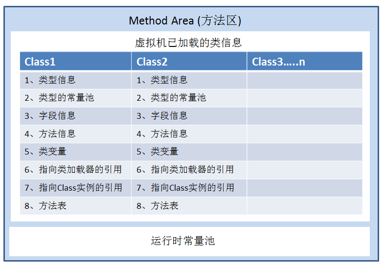
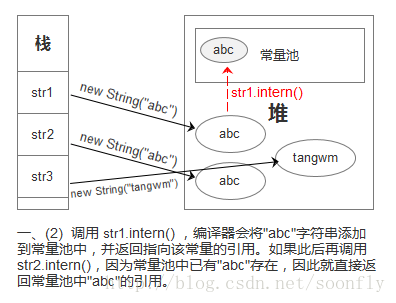
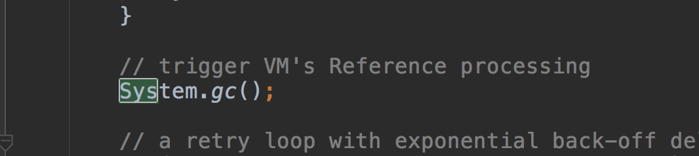
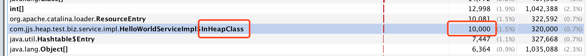
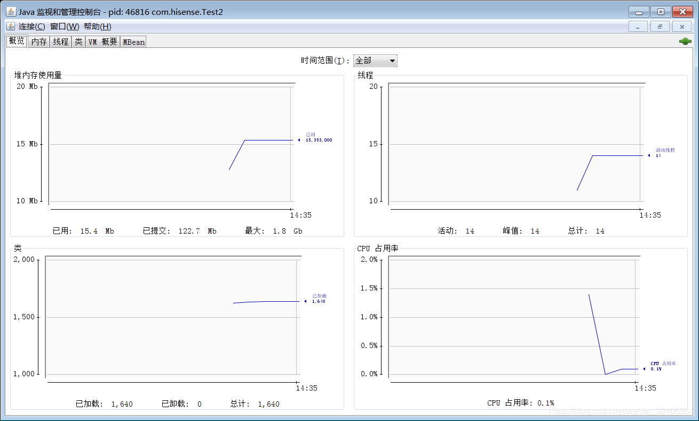
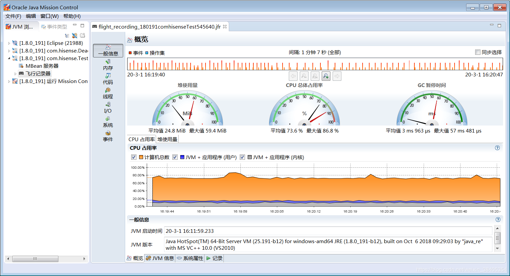

# 1_介绍

### 1.1_什么是JVM

**定义**：java virtual meachine -java运行时环境（java二进制字节码的运行环境）。JVM是运行在操作系统之上的，它与硬件没有直接的交互
**好处：**

1. 一次编写到处运行
2. 自动内存管理，垃圾回收
3. 数组下标越界检查
4. 多态

**比较：**

1.2_学习JVM有什么用？

- 面试
- 理解底层原理
- 中高级程序员必备技能

1.3_常见的JVM

[](http://47.98.150.21/upload/2020/3/image-5dd332273c7c4966b4e35718bf60d305.png)

字节码文件class以CA FE BACE开头

查看二进制码的软件是Binary Viewer

# 2_类装载子系统

### 2.0_概述

类的使用流程：

- 是否加载了该类
  - 没有加载：使用类加载器加载该类
  - 加载了：链接–初始化—调用main方法

归纳为有三个阶段：

1. 加载：从文件系统或者网络中查找并加载类的二进制数据class到java虚拟机中
2. 连接：
   1. 验证 : 确保被加载的类的正确性
   2. 准备：为类的**静态变量**分配内存，并将其初始化为**默认值**，但是到达初始化之前类变量都没有初始化为真正的初始值。（这里不包含final修饰的static，因为final在编译时候就会分配了，准备阶段会显示初始化。）（这里不会为实例变量分配初始化，类变量会分配在方法区中，而实例变量会随着对象一起分配到java堆中）
   3. 解析：**把类中的符号引用转换为直接引用**，就是在类型的常量池中寻找类、接口、字段和方法的符号引用，把这些符号引用替换成直接引用的过程。符号引用就是一组符号来描述所引用的目标，符号引用的字面量明确规定在<<JAVA规范>>的class文件格式中。直接引用就是直接指向目标的指针、相对偏移或一个间接定位到目标的句柄。
3. 初始化：为类的静态变量赋予正确的初始值。为新的对象分配内存，为实例变量赋默认值，为实例变量赋正确的初始值。初始化阶段就是指向类构造器方法`<clinit>()`的过程，此方法不需定义，是javac编译器自动收集类中的所有类变量的赋值动作和静态代码块中的语句合并而来。`<clinit>()`不同于类的构造器，若该类具有父类，JVM会保证子类的`<clinit>`执行前，父类的`<clinit>`已经执行完毕。JVM必须保证一个类的`<clinit>()`方法在多线程下被同步加锁。

说明：

- 在java代码中，类的加载、连接和初始化过程都是在程序运行期间完成的。（类从磁盘加载到内存中经历的三个阶段）
- **类从磁盘上加载到内存中要经历五个阶段：加载、连接、初始化、使用、卸载**

### 2.1_类加载

类加载定义：将类的.class文件中的二进制数据（字节流）读入到内存中，将其放在运行时数据区的方法区内，然后在内存中创建一个java.lang.Class对象（规范并未说明Class对象位于哪里，HotSpot虚拟机将其放在**方法区**中）用来封装内在方法区内的数据结构。

注：

- class文件在文件开头有特定的文件标示
- ClassLoader只负责class文件的加载，至于它是否可以运行，则由Execution Engine决定
- 加载.class文件的方式
  （1）从本地系统中直接加载
  （2）通过网络下载.class文件
  （3）从zip，jar等归档文件中加载.class文件
  （4）从专用数据库中提取.class文件
  （5）将java源文件动态编译为.class文件

#### 2.1.1_类装载器的分类：

- ① 启动类加载器/根加载器/引导类加载器（Bootstrap）：C++编写。默认加载路径`$JAVAHOME/$jre/lib/rt.jar`。里面有如rt.jar/sun/misc /Launcher.class，Object.class等。该加载器没有父加载器，它负责加载虚拟机中的核心类库。根类加载器从系统属性sun.boot.class.path所指定的目录中加载类库。类加载器的实现依赖于底层操作系统，属于虚拟机的实现的一部分，它并没有集成java.lang.ClassLoader类。出于安全考虑，根加载器只加载包名为java，javax，sun等开头的类。
- ② 扩展类加载器（Extension）：Java编写。默认加载路径`JDK安装目录/jre/lib/ext/*.jar`（可通过`Djava.ext.dirs`系统属性重新指定）。扩展类加载器是java.lang.ClassLoader的子类。
- ③ 应用程序类加载器（AppClassLoader，也叫系统类加载器）：Java编写。加载当前应用的classpath的所有类。它的父加载器为扩展类加载器，默认加载路径为：`环境变量$classpath`(可以通过`Djava.class.path`重新指定)。他是用户自定义的类加载器的默认父加载器。系统类加载器是java.lang.ClassLoader的子类。可以通过`ClassLoader.getSystemClassLoader()`获取到应用类加载器。
- ④用户自定义加载器：Java.lang.ClassLoader的子类，用户可以定制类的加载方式。默认加载路径`\$CLASSPATH`

层次为：根类加载器–>扩展类加载器–>系统应用类加载器–>自定义类加载器

获取类加载器方法：

```JAVA
//通过java对象.object.getClass().getClassLoader();获取该类的载器
Object object=new Object();
object.getClass().getClassLoader();//null。Bootstrap根加载器是c++写的，java查不出来
object.getClass().getClassLoader().getParent();//报错，根加载器是最初级的了

//-----------------------------------------
Object object2=new MyTest();//自己写的类
System.out.println(object2.getClass().getClassLoader(););
//自定义类默认的加载器是应用加载器AppClassloader//sun.misc.launcher$AppClassLoader$18b4aac2。位于rt.jar包中

ClassLoader systemClassLoader = ClassLoader.getSystemClassLoader();//获取系统加载器
System.out.println(systemClassLoader);//sun.misc.Launcher$AppClassLoader@18b4aac2
System.out.println(systemClassLoader.getParent());//sun.misc.Launcher$ExtClassLoader@1b6d3586
System.out.println(systemClassLoader.getParent().getParent());//null


//获取根加载器所能加载的路径
URL[] urLs = Launcher.getBootstrapClassPath().getURLs();
for ( URL element :urLs) {
    System.out.println(element.toExternalForm());
}
/*
file:/E:/Java/jdk1.8.0_231/jre/lib/resources.jar
file:/E:/Java/jdk1.8.0_231/jre/lib/rt.jar
file:/E:/Java/jdk1.8.0_231/jre/lib/sunrsasign.jar
file:/E:/Java/jdk1.8.0_231/jre/lib/jsse.jar
file:/E:/Java/jdk1.8.0_231/jre/lib/jce.jar
file:/E:/Java/jdk1.8.0_231/jre/lib/charsets.jar
file:/E:/Java/jdk1.8.0_231/jre/lib/jfr.jar
file:/E:/Java/jdk1.8.0_231/jre/classes
*/

System.out.println(System.getProperty("sun.boot.class.path"));//获取根加载器路径
System.out.println(System.getProperty("java.ext.dirs"));//获取扩展类加载器路径
E:\Java\jdk1.8.0_231\jre\lib\ext;C:\WINDOWS\Sun\Java\lib\ext
System.out.println(System.getProperty("java.class.path"));//获取应用类加载器路径
123456789101112131415161718192021222324252627282930313233343536
```

类加载器的加载时机：类加载器并不需要等到某个类被“首次主动使用”时再加载它：JVM规范允许类加载器在预料某个类将要被使用时就预先加载它，如果在预先加载的过程中遇到了.class文件缺失或存在错误，类加载器必须在**程序首次主动**使用该类才报告错误（LinkageError错误），如果这个类没有被程序主动使用，那么类加载器就不会报告错误。

#### 2.1.2_自定义加载器

```
为什么需要自定义类加载器：

- 隔离加载类
- 修改类加载的方式
- 扩展加载源
- 防止源码泄漏
    
使用方法：
- 继承抽象了java.lang.ClassLoader
- 在JDK1.2之前，需要重写loadClass()；JDK1.2之后，不需要重写loadClass()了，建议重写findClass()
- 如果没有太多复杂的需求，可以海子街继承URLCloassLoader类，就可以避免自己编写findClass()及其获取字节码流的方式，使自定义类加载器编写更加简洁。
可以看test16

JVM中表示两个class对象是否为同一个类存在两个必要条件：
- 类的完整类名必须一致，包括包名
- 加载这个类的ClassLoader(指CLassLoader实例对象)必须相同
换句话说，在JVM中，即使这两个类对象（class对象）来源同一个class文件，被同一个虚拟机所加载，但只要加载它们的ClassLoader实例对象不同，那么这两个类对象也是不相等的。
1234567891011121314151617
```

###### 类加载器深入剖析：

- Java虚拟机与程序的生命周期
- 在如下几种情况下，java虚拟机将结束生命周期
  （1）执行了System.exit()方法
  （2）程序正常执行结束
  （3）程序在执行过程中遇到了异常或错误而异常终止
  （4）由于操作系统出现错误而导致虚拟机进程终止

获取类加载器的途径：

（1）clazz.getClassLoader(); --获取当前类的加载器
（2）Thread.currentThread().getContextClassLoader(); --获取当前线程上下文的加载器
（3）ClassLoader.getSystemClassLoader(); --获取系统的加载器
（4）DriverManager.getCallerClassLoader(); --获取调用者的加载器

ClassLoader源码分析与实例剖析–
ClassLoader是一个负责加载class的对象，ClassLoader类是一个抽象类，需要给出类的二进制名称，ClassLoader尝试定位或者产生一个class的数据，一个典型的策略是把二进制名字转换成文件名然后到文件系统中找到该文件。

#### 2.1.3_双亲委托(/派)机制


类加载器用来把类加载到java虚拟机中。从JDK1.2版本开始，类的加载过程采用父亲委托机制，这种机制能更好地保证Java平台的安全。在此委托机制中，除了java虚拟机自带的根类加载器以外，其余的类加载器都有且只有一个父加载器。当java程序请求加载器loader1加载Sample类时，loader1首先委托自己的父加载器去加载Sample类，若父加载器能加载，则有父加载器完成加载任务，否则才由加载器loader1本身加载Sample类。

当一个类收到了类加载请求，他首先不会尝试自己去加载这个类，而是把这个请求委派给父类去完成，每一个层次类加载器都是如此，因此所有的加载请求都应该传送到启动类加载其中，只有当父类加载器反馈自己无法完成这个请求的时候（在它的加载路径下没有找到所需加载的Class），子类加载器才会尝试自己去加载。

> 若有一个类能够成功加载Test类，那么这个类加载器被称为**定义类加载器**，所有能成功返回Class对象引用的类加载器（包括定义类加载器）称为**初始类加载器**。
>
> 比如一个自定义类，可以由自定义类加载器和系统加载器加载，但是类路径下没有class文件，所以系统加载器加载不到，只有自定义加载器能加载到。此时，系统加载器和自定义加载器都是定义类加载器；而自定义加载器才是初试类加载器。详情可以看Test16

采用双亲委派的一个好处是比如加载位于 rt.jar 包中的类 java.lang.Object，不管是哪个加载器加载这个类，最终都是委托给顶层的启动类加载器进行加载，这样就保证了使用不同的类加载器最终得到的都是同样一个 Object对象。

类加载器双亲委托模型的好处：
（1）可以确保Java和核心库的安全：所有的Java应用都会引用java.lang中的类，也就是说在运行期java.lang中的类会被加载到虚拟机中，如果这个加载过程如果是由自己的类加载器所加载，那么很可能就会在JVM中存在多个版本的java.lang中的类，而且这些类是相互不可见的（命名空间的作用）。借助于双亲委托机制，Java核心类库中的类的加载工作都是由启动根加载器去加载，从而确保了Java应用所使用的的都是同一个版本的Java核心类库，他们之间是相互兼容的；
（2）确保Java核心类库中的类不会被自定义的类所替代；
（3）不同的类加载器可以为相同名称的类（binary name）创建额外的命名空间。相同名称的类可以并存在Java虚拟机中，只需要用不同的类加载器去加载即可。相当于在Java虚拟机内部建立了一个又一个相互隔离的Java类空间。

> 如果自定义了一个String类，会因为先加载到系统的，而无法使用main方法
>
> 先找到先使用，后面的不看

沙箱安全机制：自定义String类，但是在加载自定义String类的时候回率先使用引导类加载器加载，而引导类加载器在加载的过程中会先加载jdk自带的文件（rt.jar包中java/lang/String.class），报错信息说没有main方法就是因为加载的是rt.jar包中的String类，这样可以保证对java核心源代码的保护，这就是沙箱安全。

#### 2.1.4_命名空间

- 每个类加载器都有自己的命名空间，**命名空间由该加载器及所有父加载器所加载的类构成**；
- 在同一个命名空间中，不会出现类的完整名字（包括类的包名）相同的两个类；
- 在不同的命名空间中，有可能会出现类的完整名字（包括类的包名）相同的两个类；
- 同一命名空间内的类是互相可见的，**非同一命名空间内的类是不可见的**；
- 子加载器可以见到父加载器加载的类，**父加载器也不**
- **能见到子加载器加载的类**。

### 2.2_链接

类被加载后，就进入连接阶段。连接阶段就是将已经读入到内存的类的二进制数据合并到虚拟机的运行时环境中去。

- 类的连接-验证
  1）类文件的结构检查
  2）语义检查
  3）字节码验证
  4）二进制兼容性的验证
- 类的连接-准备
  在准备阶段，java虚拟机为类的静态变量分配内存，并设置默认的初始值。例如对于以下Sample类，在准备阶段，将为int类型的静态变量a分配4个字节的内存空间，并且赋予默认值0，为long类型的静态变量b分配8个字节的内存空间，并且赋予默认值0；

```JAVA
public class Sample{
    private static int a=1;
    public  static long b;
    public  static long c;
    static { b=2; }
}
123456
```

### 2.3_初始化

在初始化阶段，Java虚拟机执行类的初始化语句，为类的静态变量赋予初始值。在程序中，静态变量的初始化有两种途径：（1）在静态变量的声明处进行初始化；（2）在静态代码块中进行初始化。
类的初始化步骤：
（1）假如这个类还没有被加载和连接，那就先进行加载和连接
（2）假如类存在直接父类，并且这个父类还没有被初始化，那就先初始化直接父类
（3）假如类中存在初始化语句，那就依次执行这些初始化语句
·当java虚拟机初始化一个类时，要求它的所有父类都已经被初始化，但是这条规则不适用于接口。因此，一个父接口并不会因为它的子接口或者实现类的初始化而初始化。只有当程序首次使用特定的接口的静态变量时，才会导致该接口的初始化。
·调用ClassLoader类的loadClass方法加载一个类，并不是对类的主动使用，不会导致类的初始化。

Java程序对类的使用方式可分为两种
（1）主动使用
（2）被动使用

所有的Java虚拟机实现必须在每个类或接口被Java程序“首次主动使用”时才能初始化他们

- 主动使用（七种）
  （1）创建类的实例
  （2）访问某个类或接口的静态变量( getstatic（助记符）)，或者对该静态变量赋值 putstatic
  （3）调用类的静态方法 invokestatic
  （4）反射（Class.forName(“com.test.Test”)）
  （5）初始化一个类的子类
  （6）Java虚拟机启动时被标明启动类的类
  （7）JDK1.7开始提供的动态语言支持（了解）

- 被动使用

  除了上面七种情况外，其他使用java类的方式都被看做是对类的被动使用，都不会导致类的初始化。如

  - 当访问一个静态域时，只有真正声明这个域的类才会被初始化。如：通过子类引用父类的静态变量，不会导致子类初始化
  - 通过数字定义类引用，不会触发此类的初始化
  - 引用常量不会触发此类的初始化（常量在链接阶段就存入调用类的常量池中了）

# 3_内存结构


线程：是一个程序里的运行单元，JVM允许一个应用有多个线程并行地执行。

在Hotspot JVM里，每个线程都与操作系统的本地线程直接映射。当一个java线程准备好执行以后，此时一个操作系统的本地线程也同时创建，java线程执行终止后，本地线程也会回收。

### 3.0 预备知识：javap工具与JVM参数设置

反编译工作javap：解析class文件

```
        助记符 ldc：表示将int、float或者String类型的常量值从常量池中推送至栈顶
        助记符 bipush：表示将单字节（-128-127）的常量值推送到栈顶
        助记符 sipush：表示将一个短整型值（-32768-32369）推送至栈顶
        助记符 iconst_1：表示将int型的1推送至栈顶（iconst_m1到iconst_5）
        当int取值-1~5采用iconst指令，
        取值-128~127采用bipush指令，
        取值-32768~32767采用sipush指令，
        取值-2147483648~2147483647采用 ldc 指令。
        
        将一个局部变量加载到操纵栈的指令包括：iload、iload_、lload…
将一个数值从操作数栈存储到局部变量表的指令包括：istore、istore_、lstore…
        
        偏移地址   操作指令  java源代码
12345678910111213
```

JVM参数设置

| 说明                   | 参数                                                         |
| ---------------------- | ------------------------------------------------------------ |
| 堆初始大小             | -Xms                                                         |
| 堆最大大小             | -Xmx 或 -XX:MaxHeapSize=size                                 |
| 新生代大小             | -Xmn 或 (-XX:NewSize=size + -XX:MaxNewSize=size )            |
| 幸存区比例（动态调整） | -XX:InitialSurvivorRatio=ratio 和 -XX:+UseAdaptiveSizePolicy |
| 幸存区比例             | -XX:SurvivorRatio=ratio                                      |
| 晋升阈值               | -XX:MaxTenuringThreshold=threshold                           |
| GC详情                 | -XX:+PrintTenuringDistribution                               |
| FullGC前先MinorGC      | -XX:+ScavengeBeforeFullGC                                    |
|                        | -XX:+PrintGCDetails                                          |

https://docs.oracle.com/javase/8/docs/technotes/tools/windows/index.html

虚拟机设置官方文档：https://docs.oracle.com/javase/8/docs/technotes/tools/unix/java.html

https://www.oracle.com/technetwork/java/javase/tech/vmoptions-jsp-140102.html

https://docs.oracle.com/javase/specs/jvms/se8/html/index.html

https://docs.oracle.com/javase/specs/index.html

https://docs.oracle.com/javase/8/

### 3.1_程序计数器

- **定义：** Program Counter Register程序计数器（PC寄存器），就是一个指针，指向方法区中的方法字节码（用来存储指向下一条指令的地址，也即将要执行的指令代码，这样线程切换后就可以知道从哪里开始执行了），由执行引擎读取下一条指令，是一个非常小的内存空间，几乎可以忽略不记。。
- **作用：** 记住下一条jvm指令的执行地址，用以完成分支、循环、跳转、异常处理、线程恢复等基础功能。。
- 线程私有
- 程序计数器是内存中唯一一个不会出现内存溢出(OutOfMemory=OOM)的区域
- 场景：现实中程序往往是多线程协作完成任务的。JVM的多线程是通过CPU时间片轮转来实现的，某个线程在执行的过程中可能会因为时间片耗尽而挂起。当它再次获取时间片时，需要从挂起的地方继续执行。
- **-Xss设置栈内存大小，一般-Xss=1M**。

### 3.2_JVM栈

**定义：** Java Virtual Mechine Stacks(java虚拟机栈)栈也叫栈内存，主管Java程序的运行。

- 线程私有：在线程创建时创建，它的生命期是跟随线程的生命期，线程结束栈内存也就释放，
- **对于栈来说不存在垃圾回收问题**，只要线程一结束该栈就Over。
- JVM栈包括：
  - 局部变量（Local Variables）：输入参数和输出参数以及方法内的变量；8种基本类型的变量+对象的引用变量。栈里存放的是对象的引用ref，而对象实际上是存在堆里面的，引用ref指向堆里对象。实际上引用还指向了class文件，所以ref有两种指向情况。
    - ref先执行了两个指针，两个指针又分别指向对象数据+对象所属的类型（元数据class信息，元数据一个类只有一份，在方法区中）。
    - ref第一部分指向数据本身，第二部分是元数据的指针
  - 栈操作（操作数栈Operand Stack）：记录出栈、入栈的操作；
  - 栈帧数据（Frame Data）：包括类文件、方法等等。
- 栈帧：栈中的数据都是以栈帧（Stack Frame）的格式存在，栈帧是一个内存区块，是一个数据集，是一个有关方法(Method)和运行期数据的数据集。每个方法执行的同时都会创建一个栈帧，用于存储局部变量表、操作数栈、动态链接、方法出口等信息，每一个方法从调用直至执行完毕的过程，就对应着一个栈帧在虚拟机中入栈到出栈的过程。每个线程都只有一个**活动栈帧**，对应着线程当前执行的**方法**。活动栈帧即栈顶的帧。(在IDEA的Frames窗口中可以查看调用的帧)
- 栈内存溢出：栈帧过多，栈被撑破了（递归）、栈帧过大（交叉引用）

**栈运行原理：**

```
当一个方法A被调用时就产生了一个栈帧 F1，并被压入到栈中，
A方法又调用了 B方法，于是产生栈帧 F2 也被压入栈，
B方法又调用了 C方法，于是产生栈帧 F3 也被压入栈，
……
执行完毕后，先弹出F3栈帧，再弹出F2栈帧，再弹出F1栈帧……
12345
```

遵循“先进后出”/“后进先出”原则。

栈的大小和具体JVM的实现有关，通常在256K~756K之间,与等于1Mb左右。

**问题：**

- 线程的局部变量是否线程安全？
  **答：** 不一定。方法内的局部变量且没有逃离方法的作用访问时，是线程安全的。如果局部变量引用了对象，由于对象存在于堆中，一般其他线程可以访问修改，需要考虑线程安全。线程私有的，就不用考虑线程安全。是static的，就得考虑线程安全。

### 3.3_本地方法栈

本地方法栈：JAVA虚拟机调用本地方法时，给本地方法分配的内存空间。

本地方法native method：不是由java编写的代码，如C写的与操作系统底层打交道的方法。如Object类中的`protected native Object clone();`

本地方法栈类似于虚拟机栈，也是线程私有。

不同点：本地方法栈服务的对象是jvm运行的native方法，而虚拟机栈服务的是jvm执行的java方法。

> 本地接口的作用是融合不同的编程语言为 Java 所用，它的初衷是融合 C/C++程序，Java 诞生的时候是 C/C++横行的时候，要想立足，必须有调用 C/C++程序，于是就在内存中专门开辟了一块区域处理标记为native的代码，它的具体做法是 Native Method Stack中登记 native方法，在Execution Engine 执行时加载native libraies。
>
> 目前该方法使用的越来越少了，除非是与硬件有关的应用，比如通过Java程序驱动打印机或者Java系统管理生产设备，在企业级应用中已经比较少见。因为现在的异构领域间的通信很发达，比如可以使用 Socket通信，也可以使用Web Service等等，不多做介绍。

### 3.4_堆

**定义：** Heap，通过new关键字创建的对象，都存放在堆内存中。

**特点**

- 线程共享，堆中的对象都存在线程安全的问题。
- 垃圾回收，垃圾回收机制重点区域。

根据垃圾回收的划分，将堆划分为：

- 新生代Young Generation
  - Eden伊甸园
  - 幸存区Survivor From
  - 幸存区Survivor To
- 老年代Tenure generation
- （Permanent永久区）

```JAVA
//演示堆内存溢出
public class Demo{
    public static void main(String[] args){
        int i=0;
        try{
            List<String> list=new ArrayList<>();
            String a="hello";
            while(true){
                list.add(a);//list对象始终被关联，无法被回收，死循环不断将list规模变大，最终大于堆内存大小，内存溢出。
                a=a+a;
                i++;
            }
        }catch(Throwable e){
            e.printStackTrace();
            System.out.println(i);
        }
    }
}
123456789101112131415161718
//对象什么时候释放：
public void method(){
    Object obj= new Object();
}
生成了2部分的内存区域：1：obj这个引用变量，因为是方法内的变量，放到JVM栈里面（引用占4个字节）。2：真正Objectclass的实例对象放到Heap里面。（空对象栈8个字节）
方法结束后，对应栈中的变量马上回收，但是对重的对象要等到GC来回收
123456
```

#### 堆内存诊断

- jps工具
  - 查看系统有哪些进程。`jps`
- jmap工具
  - 查看堆内存使用情况 `jmap -heap 【进程号】`
- jconsole工具
  - 图形界面，多功能检测工具，连续监测。

有下面程序：

```java
public class Demo1 {
    public static  void main(String[] args) throws InterruptedException {
        System.out.println("1....");
        Thread.sleep(30000);
        byte[] array =  new byte[1024 * 1024 * 10];//10M
        System.out.println("2....");
        Thread.sleep(30000);
        array = null;//array没有引用，可以被回收了
        System.gc();
        System.out.println("3...");
        Thread.sleep(1000000L);
    }
}
12345678910111213
```

运行上面代码，首先在终端输入jps得到Demo进程PID，根据PID再通过`jmap -heap PID`每次查看进程占用内存情况：

```java
D:\openSourceProject\jvm1>jps
8916 Launcher
9876 RemoteMavenServer36
11656
13976 Demo1 //这个就是我们的进程号
13756 Jps
//按进程号查看堆情况
D:\openSourceProject\jvm1>jmap -heap 13976
Attaching to process ID 13976, please wait...
Debugger attached successfully.
Server compiler detected.
JVM version is 25.221-b11

using thread-local object allocation.
Parallel GC with 8 thread(s)

Heap Configuration:
   MinHeapFreeRatio         = 0
   MaxHeapFreeRatio         = 100
   MaxHeapSize              = 4276092928 (4078.0MB)
   NewSize                  = 89128960 (85.0MB)
   MaxNewSize               = 1425014784 (1359.0MB)
   OldSize                  = 179306496 (171.0MB)
   NewRatio                 = 2
   SurvivorRatio            = 8
   MetaspaceSize            = 21807104 (20.796875MB)
   CompressedClassSpaceSize = 1073741824 (1024.0MB)
   MaxMetaspaceSize         = 17592186044415 MB
   G1HeapRegionSize         = 0 (0.0MB)

Heap Usage:
PS Young Generation
Eden Space:
   capacity = 67108864 (64.0MB)
   used     = 6711104 (6.40020751953125MB)//6M
   free     = 60397760 (57.59979248046875MB)
   10.000324249267578% used
From Space:
   capacity = 11010048 (10.5MB)
   used     = 0 (0.0MB)
   free     = 11010048 (10.5MB)
   0.0% used
To Space:
   capacity = 11010048 (10.5MB)
   used     = 0 (0.0MB)
   free     = 11010048 (10.5MB)
   0.0% used
PS Old Generation
   capacity = 179306496 (171.0MB)
   used     = 0 (0.0MB)
   free     = 179306496 (171.0MB)
   0.0% used

3175 interned Strings occupying 260400 bytes.
//再次输入
D:\openSourceProject\jvm1>jmap -heap 13976//每次都得重新输入
Attaching to process ID 13976, please wait...
Debugger attached successfully.
Server compiler detected.
JVM version is 25.221-b11

using thread-local object allocation.
Parallel GC with 8 thread(s)

Heap Configuration:
   MinHeapFreeRatio         = 0
   MaxHeapFreeRatio         = 100
   MaxHeapSize              = 4276092928 (4078.0MB)
   NewSize                  = 89128960 (85.0MB)
   MaxNewSize               = 1425014784 (1359.0MB)
   OldSize                  = 179306496 (171.0MB)
   NewRatio                 = 2
   SurvivorRatio            = 8
   MetaspaceSize            = 21807104 (20.796875MB)
   CompressedClassSpaceSize = 1073741824 (1024.0MB)
   MaxMetaspaceSize         = 17592186044415 MB
   G1HeapRegionSize         = 0 (0.0MB)

Heap Usage:
PS Young Generation
Eden Space:
   capacity = 67108864 (64.0MB)
   used     = 17196880 (16.400222778320312MB)//16M=6+10
   free     = 49911984 (47.59977722167969MB)
   25.62534809112549% used
From Space:
   capacity = 11010048 (10.5MB)
   used     = 0 (0.0MB)
   free     = 11010048 (10.5MB)
   0.0% used
To Space:
   capacity = 11010048 (10.5MB)
   used     = 0 (0.0MB)
   free     = 11010048 (10.5MB)
   0.0% used
PS Old Generation
   capacity = 179306496 (171.0MB)
   used     = 0 (0.0MB)
   free     = 179306496 (171.0MB)
   0.0% used

3176 interned Strings occupying 260456 bytes.

D:\openSourceProject\jvm1>jmap -heap 13976
Attaching to process ID 13976, please wait...
Debugger attached successfully.
Server compiler detected.
JVM version is 25.221-b11

using thread-local object allocation.
Parallel GC with 8 thread(s)

Heap Configuration:
   MinHeapFreeRatio         = 0
   MaxHeapFreeRatio         = 100
   MaxHeapSize              = 4276092928 (4078.0MB)
   NewSize                  = 89128960 (85.0MB)
   MaxNewSize               = 1425014784 (1359.0MB)
   OldSize                  = 179306496 (171.0MB)
   NewRatio                 = 2
   SurvivorRatio            = 8
   MetaspaceSize            = 21807104 (20.796875MB)
   CompressedClassSpaceSize = 1073741824 (1024.0MB)
   MaxMetaspaceSize         = 17592186044415 MB
   G1HeapRegionSize         = 0 (0.0MB)

Heap Usage:
PS Young Generation
Eden Space:
   capacity = 67108864 (64.0MB)
   used     = 1342200 (1.2800216674804688MB)//1M
   free     = 65766664 (62.71997833251953MB)
   2.0000338554382324% used
From Space:
   capacity = 11010048 (10.5MB)
   used     = 0 (0.0MB)
   free     = 11010048 (10.5MB)
   0.0% used
To Space:
   capacity = 11010048 (10.5MB)
   used     = 0 (0.0MB)
   free     = 11010048 (10.5MB)
   0.0% used
PS Old Generation
   capacity = 179306496 (171.0MB)
   used     = 1106008 (1.0547714233398438MB)
   free     = 178200488 (169.94522857666016MB)
   0.6168253937659905% used

3162 interned Strings occupying 259464 bytes.
123456789101112131415161718192021222324252627282930313233343536373839404142434445464748495051525354555657585960616263646566676869707172737475767778798081828384858687888990919293949596979899100101102103104105106107108109110111112113114115116117118119120121122123124125126127128129130131132133134135136137138139140141142143144145146147148149150
```

**jconsole使用** 控制台输入jconsole。图中竖条是代表控制台有输出？

[](http://47.98.150.21/upload/2020/3/image-50bd0d32512e4654a6e0e307178e54fd.png)

可明显看出内存变化。

**一个简单的案例**

- 执行多次垃圾回收后，内存占用依然很高
  - 1.控制台输入jvistualvm，在左边选择对应进程，右面点“堆dump”。
  - 2.点击“查找”，点击第一条占用内存最大的记录。
  - 3.找到问题所在，list中有过多大对象student，无法被清除。

```java
public class Demo2 {
    public static  void main(String[] args) throws InterruptedException {
        List<student> list = new ArrayList<>();
        for (int i = 0; i < 200;i++){
            list.add(new student());
        }
        Thread.sleep(10000000000L);
    }
}

class student{
    private byte[] big = new byte[1024 * 1024];
}
12345678910111213
```

### 3.5_方法区

方法区Mthod Area：所有线程共享的一块区域，存储了每个类class结构的信息，包括：



方法区是GC的非主要工作区域，java虚拟机规范表示可以不要求虚拟机在这区实现GC，这区GC的性价比一般比较低；在堆中，尤其是新生代，常规应用进行一次GC一般可以回收70%~95%的空间，而方法区的GC效率远小于此。当前的商业JVM都有实现方法区的GC，主要回收两部分：废弃常量和无用类。

类回收需要满足如下3个条件：

- 该类所有的实例都已经被GC，也就是JVM中不存在该Class的任何实例
- 加载该类的ClassLoader已经被GC
- 该类对应的java.lang.Class对象没有在任何地方被引用，如：不能再任何地方通过反射访问该类的方法

在大量使用反射、动态代理、CGLib等字节码框架、动态生成JSP以及OSGi这类频繁自定义ClassLoader的场景都需要JVM具备类下载的支持以保证方法区不会溢出。

从JDK1.8开始就没有永久代了

```
	实际而言，方法区（Method Area）和堆一样，是各个线程共享的内存区域，它用于存储虚拟机加载的：类信息+普通常量+静态常量+编译器编译后的代码等等，虽然JVM规范将方法区描述为堆的一个逻辑部分，但它却还有一个别名叫做Non-Heap(非堆)，目的就是要和堆分开。
	
	对于HotSpot虚拟机，很多开发者习惯将方法区称之为“永久代(Parmanent Gen)” ，但严格本质上说两者不同，或者说使用永久代来实现方法区而已，永久代是方法区(相当于是一个接口interface)的一个实现，jdk1.7的版本中，已经将原本放在永久代的字符串常量池移走。
	
永久区(java7之前有)
	永久存储区是一个常驻内存区域，用于存放JDK自身所携带的 Class,Interface 的元数据，也就是说它存储的是运行环境必须的类信息，被装载进此区域的数据是不会被垃圾回收器回收掉的，关闭 JVM 才会释放此区域所占用的内存。
	永久代 Permanent Generation，从JDK1.8彻底废弃，使用元空间 meta space
1234567
```

下图演示了栈帧里的局部变量指向了堆与方法区


#### 运行时常量池

- Class文件的常量池与方法区的运行时常量池：我们写的每一个Java类被编译后，就会形成一份class文件；每一个Class文件中，都维护着一个常量池（这个保存在类文件里面，不要与方法区的运行时常量池搞混）。这个常量池的内容，在类加载的时候，被复制到方法区的运行时常量池 ；
- class文件中除了包含类的版本、字段、方法、接口等描述信息外，还有一项信息就是常量池(constant pool )，用于存放编译期生成的各种字面量(Literal)和符号引用(Symbolic References)
  - 字面量包括：1.文本字符串 2.八种基本类型的值 3.被声明为final的常量等;
  - 符号引用包括：1.类的全限定名，2.字段名和属性，3.方法名和属性。

> jvm在执行某个类的时候，必须经过加载、连接、初始化，而连接又包括验证、准备、解析三个阶段。而当类加载到内存中后，【jvm就会将class常量池中的内容存放到运行时常量池中，运行时常量池存在于内存中，也就是class常量池被加载到内存之后的版本】，不同之处是：它的字面量可以动态的添加(String#intern()),符号引用可以被解析为直接引用（里面的符号地址变为真实地址）。
>
> 运行时常量池是在类加载完成之后，将每个class常量池中的符号引用值转存到运行时常量池中，也就是说，【每个class都有一个运行时常量池】，类在解析之后，将符号引用替换成直接引用，与全局常量池中的引用值保持一致。解析的过程会去查询全局字符串池，也就是我们下面所说的StringTable，以保证运行时常量池所引用的字符串与全局字符串池中所引用的是一致的。
>
> 运行时常量池相对于CLass文件常量池的另外一个重要特征是具备动态性，Java语言并不要求常量一定只有编译期才能产生，也就是并非预置入class文件中常量池的内容才能进入方法区运行时常量池，运行期间也可能将新的常量放入运行时常量池中，这种特性被开发人员利用比较多的就是String类的intern()方法。

- 运行时常量池：

```JAVA
/**1.8 以前会导致永久代内存溢出
 * 演示永久代内存溢出  java.lang.OutOfMemoryError: PermGen space
 * -XX:MaxPermSize=8m
 */
public class Demo1_8 extends ClassLoader {//可以用来加载类的二进制字节码
    public static void main(String[] args) {
        int j = 0;
        try {
            Demo1_8 test = new Demo1_8();
            for (int i = 0; i < 20000; i++, j++) {
                ClassWriter cw = new ClassWriter(0);//ClassWriter作用是生成类的二进制字节码
                cw.visit(Opcodes.V1_6, Opcodes.ACC_PUBLIC, "Class" + i, null, "java/lang/Object", null);//参数：类版本号、类的访问修饰符、类的名字、包名类的父类、类要实现的接口
                byte[] code = cw.toByteArray();//返回byte数组
                test.defineClass("Class" + i, code, 0, code.length);//触发类的加载//即生成了Class对象
            }
        } finally {
            System.out.println(j);
        }
    }
}
1234567891011121314151617181920
/**1.8之后会导致元空间内存溢出
 * 演示元空间内存溢出 java.lang.OutOfMemoryError: Metaspace 元空间
 * -XX:MaxMetaspaceSize=8m
 */
public class Demo1_8 extends ClassLoader { // 可以用来加载类的二进制字节码
    public static void main(String[] args) {
        int j = 0;
        try {
            Demo1_8 test = new Demo1_8();
            for (int i = 0; i < 10000; i++, j++) {
                // ClassWriter 作用是生成类的二进制字节码
                ClassWriter cw = new ClassWriter(0);
                // 版本号， public， 类名, 包名, 父类， 接口
                cw.visit(Opcodes.V1_8, Opcodes.ACC_PUBLIC, "Class" + i, null, "java/lang/Object", null);
                // 返回 byte[]
                byte[] code = cw.toByteArray();
                // 执行了类的加载
                test.defineClass("Class" + i, code, 0, code.length); // Class 对象
            }
        } finally {
            System.out.println(j);
        }
    }
}
123456789101112131415161718192021222324
```

#### 字段信息

- 声明的顺序
- 修饰符
- 类型
- 名字

#### 方法信息

- 声明的顺序
- 修饰符
- 返回值类型
- 名字
- 参数列表（有序保存）
- 异常表（方法抛出的异常）
- 方法字节码（native、abstract方法除外，）
- 操作数栈和局部变量表大小

#### 类变量(即static变量）

非final类变量

在java虚拟机使用一个类之前，它必须在方法区中为每个非final类变量分配空间。非final类变量存储在定义它的类中；

final类变量（不存储在这里）

由于final的不可改变性，因此，final类变量的值在编译期间，就被确定了，因此被保存在类的常量池里面，然后在加载类的时候，复制进方法区的运行时常量池里面 ；final类变量存储在运行时常量池里面，每一个使用它的类保存着一个对其的引用；

#### 对类加载器的引用

jvm必须知道一个类型是由启动加载器加载的还是由用户类加载器加载的。如果一个类型是由用户类加载器加载的，那么jvm会将这个类加载器的一个引用作为类型信息的一部分保存在方法区中。

#### 对Class类的引用

jvm为每个加载的类都创建一个java.lang.Class的实例（**存储在堆上**）。而jvm必须以某种方式把Class的这个实例和存储在方法区中的类型数据（**类的元数据**）联系起来， 因此，类的元数据里面保存了一个Class对象的引用；

#### 方法表

为了提高访问效率，必须仔细的设计存储在方法区中的数据信息结构。除了以上讨论的结构，jvm的实现者还可以添加一些其他的数据结构，如方法表。jvm对每个加载的非虚拟类的类型信息中都添加了一个方法表，方法表是一组对类实例方法的直接引用(包括从父类继承的方法。jvm可以通过方法表快速激活实例方法。(译者：这里的方法表与C++中的虚拟函数表一样，但java方法全都 是virtual的，自然也不用虚拟二字了。正像java宣称没有 指针了，其实java里全是指针。更安全只是加了更完备的检查机制，但这都是以牺牲效率为代价的,个人认为java的设计者 始终是把安全放在效率之上的，所有java才更适合于网络开发)

### `字符串对象.intern()`

- 作用：将指定字符串尝试放入`StringTable`

```JAVA
此外String对象调用intern()方法时，会先在StringTable中查找是否存在于该对象相同的字符串，若存在直接返回String table中字符串的引用，若不存在则在StringTable中创建一个与该对象相同的字符串。


String s1 = "ma";
String s2 = "in";
String s3 = s1 +s2;
s3.intern();//main String，java等属于关键词，在一开始就在StringTable中存在了，所以s3.intern没能插入进去。
String s4 = "ma" + "in";
System.out.println(s3 == s4);//false
123456789
```

javap -v hello.class

- v 显示反编译后的详细信息

常量池中的字符串仅是符号，第一次用到时才变为对象。利用串池的机制，来避免重复创建字符串对象

#### 字符串常量池

一、new String都是在堆上创建字符串对象。当调用 intern() 方法时，编译器会将字符串添加到常量池中（stringTable维护），并返回指向该常量的引用。




```java
String s = new String("abc");//字符串常量池中有abc,堆中也有
String s1 = "abc";
String s2 = new String("abc");
System.out.println(s == s1.intern());//false
System.out.println(s == s2.intern());//false
System.out.println(s1 == s.intern());//true
System.out.println(s1 == s2.intern());//true
1234567
```

二、通过字面量赋值创建字符串（如：String str=”twm”）时，会先在常量池中查找是否存在相同的字符串，若存在，则将栈中的引用直接指向该字符串；若不存在，则在常量池中生成一个字符串，再将栈中的引用指向该字符串。


三、常量字符串的“+”操作，编译阶段直接会合成为一个字符串。如string str=”JA”+”VA”，在编译阶段会直接合并成语句String str=”JAVA”，于是会去常量池中查找是否存在”JAVA”,从而进行创建或引用。

四、对于final字段，编译期直接进行了常量替换（而对于非final字段则是在运行期进行赋值处理的）。
final String str1=”ja”;
final String str2=”va”;
String str3=str1+str2;
在编译时，直接替换成了String str3=”ja”+”va”，根据第三条规则，再次替换成String str3=”JAVA”

```java
String s1 = “abc”;
final String s2 = “a”;
final String s3 = “bc”;
String s4 = s2 + s3;
System.out.println(s1 == s4);
A：true，因为final变量在编译后会直接替换成对应的值，所以实际上等于s4=”a”+”bc”，而这种情况下，编译器会直接合并为s4=”abc”，所以最终s1==s4。
123456
```

五、常量字符串和变量拼接时（如：String str3=baseStr + “01”;）会调用stringBuilder.append()在堆上创建新的对象。

六、JDK 1.7后，intern方法还是会先去查询常量池中是否有已经存在，如果存在，则返回常量池中的引用，这一点与之前没有区别，

区别在于，如果在常量池找不到对应的字符串，则不会再将字符串拷贝到常量池，而只是在常量池中生成一个对原字符串的引用。简单的说，就是往常量池放的东西变了：原来在常量池中找不到时，复制一个副本放到常量池，1.7后则是将在堆上的地址引用复制到常量池。


> 调用intern()
>
> - 如果常量池中已经有了该字符串str1，那直接返回常量池中str1的引用
> - 如果常量池中没有该字符串str1，
>   - JDK6会把字符串复制到常量池中，相当于常量池中是一个副本str2，并且返回的是该副本的引用str2，而该字符串str1还是指向堆中；
>   - JDK7会把堆中字符串str1的引用写到常量池中str1，而不是复制，当新的变量被赋值该字符串str1时，直接指向的是该引用str1。

举例说明：

```java
String str2 = new String("str")+new String("01");
str2.intern();//JDK6：复制一份，返回该副本引用，但str2还是指向堆中的。JDK7：在常量池中生成一个引用指向堆中。

String str1 = "str01";//JDK6：常量池中的副本。JDK7：这个引用从字符串常量池中指向堆中
System.out.println(str2==str1);//JDK6：false。JDK7：true
12345
```

在JDK 1.7下，当执行str2.intern();时，因为常量池中没有“str01”这个字符串，所以会在常量池中生成一个对堆中的“str01”的**引用**(注意这里是引用 ，就是这个区别于JDK 1.6的地方。在JDK1.6下是生成原字符串的拷贝)，而在进行String str1 = “str01”;字面量赋值的时候，常量池中已经存在一个引用，所以直接返回了该引用，因此str1和str2都指向堆中的同一个字符串，返回true。

```java
String str2 = new String("str")+new String("01");//JDK6：堆//JDK7:堆
String str1 = "str01";//JDK6: 常量池//JDK7：常量池

str2.intern();//JDK6：尝试复制，常量池已经有了，没有复制，返回了常量池中的引用，但str2还是指向堆中的//JDK7：尝试提供堆中的引用给常量池，常量池已经有自己的了，无需引用堆中你的了
System.out.println(str2==str1);//JDK6：false//JDK7：false//都是堆中一份，常量池中一份
12345
```

将中间两行调换位置以后，因为在进行字面量赋值（String str1 = “str01″）的时候，常量池中不存在，所以str1指向的常量池中的位置，而str2指向的是堆中的对象，再进行intern方法时，对str1和str2已经没有影响了，所以返回false。

```java
String s = new String("1");//堆中，同时常量池中也有1了
s.intern();// JDK6，复制，复制失败 //JDK7：常量池中已经有了，无需复制
String s2 = "1";
System.out.println(s == s2);// JDK6和7都是false

String s3 = new String("1") + new String("1");//堆中有11，常量池中没有11
s3.intern();//JDK6复制成功//JDK7引用成功
String s4 = "11";

System.out.println(s3 == s4);//JDK6：false  JDK7：true
12345678910
```

再分别调整上面代码2.3行、7.8行的顺序：

```java
String s = new String("1");//堆中，同时常量池中也有1了
String s2 = "1";//指向上一句在常量池中创建好的常量，但不是堆中的常量
s.intern();

System.out.println(s == s2);//JDK6:false  JDK7:false

 
String s3 = new String("1") + new String("1");//堆中有11，常量池中没有11
String s4 = "11";//常量池中也自己的有11了
s3.intern();//JDK6复制失败//JDK7引用失败

System.out.println(s3 == s4);//JDK6:false  JDK7:false
123456789101112
```

##### JDK6


在JDK1.6中所有的输出结果都是 false，因为JDK1.6以及以前版本中，常量池是放在 Perm 区（属于方法区）中的，熟悉JVM的话应该知道这是和堆区完全分开的。

使用引号声明的字符串都是会直接在字符串常量池中生成的，而 new 出来的 String 对象是放在堆空间中的。所以两者的内存地址肯定是不相同的，即使调用了intern()方法也是不影响的。

intern()方法在JDK1.6中的作用是：比如String s = new String(“SEU_Calvin”)，再调用s.intern()，此时返回值还是字符串"SEU_Calvin"，表面上看起来好像这个方法没什么用处。但实际上，在JDK1.6中它做了个小动作：检查字符串池里是否存在"SEU_Calvin"这么一个字符串，如果存在，就返回池里的字符串；如果不存在，该方法会把"SEU_Calvin"添加到字符串池中，然后再返回它的引用。然而在JDK1.7中却不是这样的，后面会讨论。

##### JDK7

针对JDK1.7以及以上的版本，我们将上面两段代码分开讨论。先看第一段代码的情况：

**

```JAVA
String s = new String("1");//生成了常量池中的“1” 和堆空间中的字符串对象
s.intern();// s对象去常量池中寻找后发现"1"已经存在于常量池中了。
String s2 = "1";//生成一个s2的引用指向常量池中的“1”对象。
System.out.println(s == s2);// JDK6和7都是false

String s3 = new String("1") + new String("1");//在字符串常量池中生成“1” ，并在堆空间中生成s3引用指向的对象（内容为"11"）。注意此时常量池中是没有 “11”对象的。
s3.intern();//将 s3中的“11”字符串放入 String 常量池中，此时常量池中不存在“11”字符串，JDK1.6的做法是直接在常量池中生成一个 "11" 的对象。
//但是在JDK1.7中，常量池中不需要再存储一份对象了，可以直接存储堆中的引用。这份引用直接指向 s3 引用的对象，也就是说s3.intern() ==s3会返回true。
String s4 = "11";//直接去常量池中创建，但是发现已经有这个对象了，此时也就是指向 s3 引用对象的一个引用。因此s3 == s4返回了true。

System.out.println(s3 == s4);//JDK6：false  JDK7：true
1234567891011
```

下面继续分析第二段代码：


再把第二段代码贴一下便于查看：

```java
String s = new String("1");//生成了常量池中的“1” 和堆空间中的字符串对象。
String s2 = "1";//这行代码是生成一个s2的引用指向常量池中的“1”对象，但是发现已经存在了，那么就直接指向了它。
s.intern();//这一行在这里就没什么实际作用了。因为"1"已经存在了。

System.out.println(s == s2);// 引用地址不同//JDK6:false  JDK7:false

 
String s3 = new String("1") + new String("1");//在字符串常量池中生成“1” ，并在堆空间中生成s3引用指向的对象（内容为"11"）。注意此时常量池中是没有 “11”对象的。
String s4 = "11";//直接去生成常量池中的"11"。
s3.intern();//这一行在这里就没什么实际作用了。因为"11"已经存在了。

System.out.println(s3 == s4);//引用地址不同//JDK6:false  JDK7:false
123456789101112
String str1 = new String("SEU") + new String("Calvin");

System.out.println(str1.intern() == str1);//JDK6:false//JDK7：true

System.out.println(str1 == "SEUCalvin");//JDK6：false//JDK7：true
12345
String str2 = "SEUCalvin";//新加的一行代码，其余不变

String str1 = new String("SEU")+ new String("Calvin");

System.out.println(str1.intern() == str1);//JDK6:false//JDK7:false

System.out.println(str1 == "SEUCalvin");//JDK6：false//JDK7:false
1234567
```

也很简单啦，str2先在常量池中创建了“SEUCalvin”，那么str1.intern()当然就直接指向了str2，你可以去验证它们两个是返回的true。后面的"SEUCalvin"也一样指向str2。所以谁都不搭理在堆空间中的str1了，所以都返回了false。

# new String()究竟创建几个对象?

## 1. 由来

遇到一个Java面试题，是关于`String`的，自己对`String`还有点研究？下面是题目的描述：

> 在Java中，`new String("hello")`这样的创建方式，到底创建了几个`String`对象？

题目下答案，各说纷纭，有说1个的，有说2个的。我觉得都对，但也都不对，因为要加上一定的条件，下面来分析下！

## 2. 解答

### 2.1. 分析

题目中的`String`创建方式，是调用`String`的有参构造函数，而这个有参构造函数的源码则是这样的`public String(String original)`，这就是说，我们可以把代码转换为下面这种：

```java
String temp = "hello";  // 在常量池中
String str = new String(temp); // 在堆上
12
```

这段代码就创建了2个`String`对象，`temp`指向在常量池中的，`str`指向堆上的，而`str`内部的`char value[]`则指向常量池中的`char value[]`，所以这里的答案是2个对象。(这里不再详述内部过程，之前的文章有写，参考[深入浅出Java String](https://kevinsss.github.io/blog/2016/11/10/shen-ru-qian-chu-java-string-shang/))

那之前我为什么说答案是1个的也对呢，假如就只有这一句`String str = new String("hello")`代码，并且此时的常量池的没有`"hello"`这个String，那么答案是两个;如果此时常量池中，已经存在了`"hello"`，那么此时就只创建堆上`str`，而不会创建常量池中`temp`,(注意这里都是引用)，所以此时答案就是1个。

https://blog.csdn.net/w605283073/article/details/72753494

《深入理解java虚拟机》第二版 57页

对String.intern()返回引用的测试代码如下：

```java
String str1 = new StringBuilder("计算机").append("软件").toString();
// String str3= new StringBuilder("计算机软件").toString();
System.out.println(str1.intern() == str1);//JDK6:false//JDK7:true

String str2 = new StringBuilder("Java(TM) SE ").append("Runtime Environment").toString();
;//堆中有，问题是常量池中在intern之前是否有拼接完的字符串
System.out.println(str2.intern() == str2);//JDK6:false//JDK7:false
//jdk6因为是复制，所以不可能相等，问题是jdk7可能是引用，按理说应该是true，为什么是false
//这个因为jdk源码中已经有了这个拼接完的字符串，在标注版本的时候定义过了
123456789
```

可能很多人觉得这个结果很奇怪，在这里我们进行深入地探究。

因为JDK1.6中，intern（）方法会把首次遇到的字符串实例复制到永久代中，返回的也是永久代中这个字符串的实例的引用，而StringBulder创建的字符串实例在Java堆上，所以必然不是同一个引用，将返回false。

在JDK1.7中，intern（）的实现不会在复制实例，只是在常量池中记录首次出现的实例引用，因此返回的是引用和由StringBuilder.toString()创建的那个字符串实例是同一个。

str2的比较返回false因为"java"这个字符串在执行StringBuilder.toString()之前已经出现过，字符串常量池中已经有它的引用了，不符合“首次出现”的原则，而“计算机软件”这个字符串是首次出现，因此返回true。

那么就有疑问了，这个“java”字符串在哪里出现过呢？显然并不是直接出现在这个类里面。

我们分别打开String 、StringBuilder和System类的源码看看有啥发现，

其中在**System类里**发现

有java版本的字符串

因此sun.misc.Version 类会在JDK类库的初始化过程中被加载并初始化，而在初始化时它需要对静态常量字段根据指定的常量值（ConstantValue）做默认初始化，此时被 sun.misc.Version.launcher 静态常量字段所引用的"java"字符串字面量就被intern到HotSpot VM的字符串常量池——StringTable里了。

因此我们修改一下代码：

1. `String str2 = new StringBuilder("Java(TM) SE ").append("Runtime Environment").toString();`
2. `System.out.println(str2.intern() == str2)`

发现结果还是false

从而更加证实了我们的猜测。

再遇到类似问题的时候，希望大家可以多从源码角度去追本溯源，能够多分享出来。

https://www.cnblogs.com/clamp7724/p/11751278.html

字符串常量池：String table又称为String pool，

- 字符串常量池在Java内存区域的哪个位置
  - 在JDK6.0及之前版本，字符串常量池是放在【Perm Gen区(也就是方法区)】中；
  - 在JDK7.0版本，字符串常量池被移到了【堆】中了。至于为什么移到堆内，大概是由于方法区的内存空间太小了。但是字符串常量池与堆对象还是不一样
- 字符串常量池放的是什么：
  - 在JDK6.0及之前版本中，String Pool里放的都是字符串常量
  - 在JDK7.0中，由于String#intern()发生了改变，因此String Pool中也可以存放放于堆内的字符串对象的引用
- intern的作用
  - 在JDK6中，str.intern()的作用是复制
  - 在JDK8中，str.intern()的作用是移动到
- StringTable还存在一个hash表的特性∶里面不存在相同的两个字符串。
- main String，java等属于关键词，在一开始就在StringTable中存在了，所以str.intern没能插入进去。

```JAVA
String s1 = "ha";
String s2 = "ha";
String s3 = s1 +s2;//s3本质调用了 new StringBuilder.append("a").append("b").toString(); 声明了新的引用变量，开辟了新的空间，所以指向的是堆中的对象地址而不是StringTable中的字符串了。
String s4 = "ha" + "ha";//因为是两个常量拼接，在编译时就会直接变成"haha"进行处理，进入StringTable
String s5 = "haha";//因为也是常量，会先在StringTable中查找，找到后s5指向了StringTable中的"haha"
String s6 = new String("haha");
System.out.println(s3 == s4);//false
System.out.println(s4 == s5);//true
System.out.println(s5 == s6);//false
123456789
```

##### 串常量池的位置

```JAVA
JVM1.6的时候StringTable在常量池。

JVM1.8后，StringTable在堆区
    验证：串常量池的位置
//运行如下代码探究常量池的位置  
public static void main(String[] args) throws Throwable {  
        List<String> list = new ArrayList<String>();  
        int i=0;  
        while(true){  
            list.add(String.valueOf(i++).intern());  
        }  
    }  
/*
用jdk1.6运行后会报错，永久代这个区域内存溢出会报：
Exception in thread “main” java.lang.OutOfMemoryError:PermGen space的内存溢出异常，表示永久代内存溢出。
jdk1.7 和1.8Exception in thread “main” java.lang.OutOfMemoryError: Java heap space说明1.6在永久带，1.7以后移动到了heap中
98%的垃圾回收，但只有2%的堆被重置
*/
123456789101112131415161718
```

##### 串常量垃圾回收

```JAVA
package JVMtest;
/*
* 演示stringTable垃圾回收
* -Xmx10m -XX:+PrintStringTableStatistics -XX:+PrintGCDetails -verbose:gc
* 打印字符串表的统计信息
* 打印垃圾回收的详细信息
* */
public class StringTable {
    public static void main(String[] args) {
        int i=0;
        try {
            for(int j=0;j<100;j++){//ctrl+alt+t快捷键try catch
                String.valueOf(j).intern();//这句话注释与打开
                i++;
            }
        } catch (Exception e) {
            e.printStackTrace();
        } finally {
            System.out.println(i);
        }
    }
}
//输出信息如下：

100
Heap//堆
 PSYoungGen      total 2560K, used 1644K [0x00000000ffd00000, 0x0000000100000000, 0x0000000100000000)
  eden space 2048K, 80% used [0x00000000ffd00000,0x00000000ffe9b3f0,0x00000000fff00000)
  from space 512K, 0% used [0x00000000fff80000,0x00000000fff80000,0x0000000100000000)
  to   space 512K, 0% used [0x00000000fff00000,0x00000000fff00000,0x00000000fff80000)
 ParOldGen       total 7168K, used 0K [0x00000000ff600000, 0x00000000ffd00000, 0x00000000ffd00000)
  object space 7168K, 0% used [0x00000000ff600000,0x00000000ff600000,0x00000000ffd00000)
 Metaspace       used 3144K, capacity 4496K, committed 4864K, reserved 1056768K
  class space    used 343K, capacity 388K, committed 512K, reserved 1048576K
SymbolTable statistics://符号表
Number of buckets       :     20011 =    160088 bytes, avg   8.000
Number of entries       :     13114 =    314736 bytes, avg  24.000
Number of literals      :     13114 =    562744 bytes, avg  42.912
Total footprint         :           =   1037568 bytes
Average bucket size     :     0.655
Variance of bucket size :     0.655
Std. dev. of bucket size:     0.810
Maximum bucket size     :         6
StringTable statistics://串常量分析
Number of buckets       :     60013 =    480104 bytes, avg   8.000//桶个数60013
Number of entries       :      1839 =     44136 bytes, avg  24.000//键值对个数1839
Number of literals      :      1839 =    161288 bytes, avg  87.704//字符串常量个数//什么都没做就有1000+了//注释了for之后显示1739
Total footprint         :           =    685528 bytes
Average bucket size     :     0.031
Variance of bucket size :     0.031
Std. dev. of bucket size:     0.175
Maximum bucket size     :         3

Process finished with exit code 0

//for改为10000后，//字符串常量并没有变为10000多个，而是满了之后就垃圾回收了。证明了StringTable也会发生垃圾回收
[GC (Allocation Failure) [PSYoungGen: 2048K->488K(2560K)] 2048K->636K(9728K), 0.0012292 secs] [Times: user=0.00 sys=0.00, real=0.00 secs] 
10000
StringTable statistics:
Number of buckets       :     60013 =    480104 bytes, avg   8.000
Number of entries       :      3174 =     76176 bytes, avg  24.000
Number of literals      :      3174 =    225688 bytes, avg  71.105
Total footprint         :           =    781968 bytes
123456789101112131415161718192021222324252627282930313233343536373839404142434445464748495051525354555657585960616263
```

##### 串常量池性能调优

- 调整：`XX:+StringTableSize=桶个数`。将StringTable中的桶个数设为2000。 hash表桶的数量越多（数组部分长度越长），数据越分散，hashcode撞车的概率越小，速度越快。 默认值是6万多
- 考虑将字符串对象是否入池

```JAVA
-Xms500m 设置堆内存为500mb
    -Xmx500m -XX:+PrintStringTableStatistics -XX:+StringTableSize=20000
    限制了桶大小为2W。
    变慢了
    往StringTable里放一个字符串，就要去哈希表里查找有没有。有就不能放进去。
 public static void main(String[] args) {
        try {
            BufferedReader reader = new BufferedReader(new InputStreamReader(new FileInputStream(new File("f:\\test.txt"))));
            String line = null;
            long start = System.nanoTime();
            while (true) {
                line = reader.readLine();
                if (line == null) {
                    break;
                }
                line.intern();
            }
            System.out.println("cost:" + (System.nanoTime() - start) / 1000000);
        } catch (FileNotFoundException e) {
            e.printStackTrace();
        } catch (IOException e) {
            e.printStackTrace();
        }
    }

//通过读取文件将文件中的每一行逐行加入到StringTable中,修改桶的大小来测试所需要的时间（文件为8145行）

123456789101112131415161718192021222324252627
```

| `StringTableSize` | Time   |
| ----------------- | ------ |
| 128               | 172 ms |
| 1024              | 116 ms |
| 4096              | 87 ms  |

#### 3.6_直接内存

在JAVA中，JVM内存指的是堆内存。

机器内存中，不属于堆内存的部分即为堆外内存。

堆外内存也被称为直接内存。

内存对象分配在Java虚拟机的堆以外的内存，这些内存直接受操作系统管理（而不是虚拟机），这样做的结果就是能够在一定程度上减少垃圾回收对应用程序造成的影响。使用未公开的Unsafe和NIO包下ByteBuffer来创建堆外内存。

堆内内存是属于jvm的，由jvm进行分配和管理，属于"用户态"，而堆外内存是由操作系统管理的，属于"内核态"。

在jdk1.4中新加入了NIO类，他可以调用native函数库直接分配堆外内存，然后通过java堆中的DirectByteBuffer对象来指向这块内存，进行内存分配等工作。

直接内存并不是虚拟机运行时数据区的一部分，也不是Java 虚拟机规范中定义的内存区域。在JDK1.4 中新加入了NIO(New Input/Output)类，引入了一种基于通道(Channel)与缓冲区（Buffer）的I/O 方式，它可以使用native 函数库直接分配堆外内存，然后通过一个存储在Java堆中的DirectByteBuffer 对象作为这块内存的引用进行操作。这样能在一些场景中显著提高性能，因为避免了在Java堆和Native堆中来回复制数据。

JAVA通过调用ByteBuffer.allocateDirect及 MappedByteBuffer 来进行内存分配。不过JVM对Direct Memory可申请的大小也有限制，可用-XX:MaxDirectMemorySize=1M设置，这部分内存不受JVM垃圾回收管理。

- 堆外内存：Direct Memory，也叫堆外内存。这部分内存不是由jvm管理和回收的。需要我们手动的回收。
- 常见于 NIO 操作时，用于数据缓冲区
- 分配回收成本较高，但读写性能高
- 不受 JVM 内存回收管理

为什么使用堆外内存：

- 1、减少了垃圾回收：使用堆外内存的话，堆外内存是直接受操作系统管理( 而不是虚拟机 )。这样做的结果就是能保持一个较小的堆内内存，以减少垃圾收集对应用的影响。
- 2、提升复制速度(io效率)：堆内内存由JVM管理，属于“用户态”；而堆外内存由OS管理，属于“内核态”。如果从堆内向磁盘写数据时，数据会被先复制到堆外内存，即内核缓冲区，然后再由OS写入磁盘，使用堆外内存避免了这个操作。（不需要经过对内）

堆外内存申请：

- JDK的`ByteBuffer`类提供了一个接口`allocateDirect(int capacity)`进行堆外内存的申请，底层通过`unsafe.allocateMemory(size)`实现。Netty、Mina等框架提供的接口也是基于ByteBuffer封装的。

堆外内存释放：

- `unsafe.allocateMemory(size)`最底层是通过`malloc`方法申请的，但是这块内存需要进行手动释放，JVM并不会进行回收，幸好`Unsafe`提供了另一个接口`freeMemory`可以对申请的堆外内存进行释放。

当初始化一块堆外内存时，对象的引用关系如下：


《JAVA对象引用》叫告诉了我们有ReferenceQueue引用监视器。

当一个 DirectByteBuffer初始化的时候，都会创建cleaner对象（ 继承PhantomReference）并把 其注册进ReferenceQueue中。

当DirectByteBuffer=null的时候，如果引用在放入PhantomReference过程中，JVM就会调用cleaner.clean 并放弃通知ReferenceQueue。

其中`first`是`Cleaner`类的静态变量，`Cleaner`对象在初始化时会被添加到`Clenear`链表中，和`first`形成引用关系，`ReferenceQueue`是用来保存需要回收的`Cleaner`对象。

如果该`DirectByteBuffer`对象在一次GC中被回收了


此时，只有`Cleaner`对象唯一保存了堆外内存的数据（开始地址、大小和容量），在下一次FGC时，把该`Cleaner`对象放入到`ReferenceQueue`中，并触发`clean`方法。

`Cleaner`对象的`clean`方法主要有两个作用：
1、把自身从`Cleaner`链表删除，从而在下次GC时能够被回收
2、释放堆外内存

如果JVM一直没有执行FGC的话，无效的`Cleaner`对象就无法放入到ReferenceQueue中，从而堆外内存也一直得不到释放，内存岂不是会爆？

其实在初始化`DirectByteBuffer`对象时，如果当前堆外内存的条件很苛刻时，会主动调用`System.gc()`强制执行FGC。

### Unsafe类操作堆外内存

sun.misc.Unsafe提供了一组方法来进行堆外内存的分配，重新分配，以及释放。

1. public native long allocateMemory(long size); —— 分配一块内存空间。
2. public native long reallocateMemory(long address, long size); —— 重新分配一块内存，把数据从address指向的缓存中拷贝到新的内存块。
3. public native void freeMemory(long address); —— 释放内存。

参考：[Unsafe类操作JAVA内存](https://link.jianshu.com/?t=http%3A%2F%2Fwww.360doc.com%2Fcontent%2F15%2F0213%2F18%2F11962419_448404856.shtml)

```csharp
public static void main(String[] args) {
    Unsafe unsafe = new Unsafe();
    unsafe.allocateMemory(1024);
}
1234
```

然而Unsafe类的构造器是私有的，报错。

而且，allocateMemory方法也不是静态的，不能通过Unsafe.allocateMemory调用。

幸运的是可以通过Unsafe.getUnsafe()取得Unsafe的实例。

```csharp
public class UnsafeTest {

    public static void main(String[] args) {
        Unsafe unsafe = Unsafe.getUnsafe();
        unsafe.allocateMemory(1024);
        unsafe.reallocateMemory(1024, 1024);
        unsafe.freeMemory(1024);
    }
}
123456789
```

此外，也可以通过反射获取unsafe对象实例

参考：[危险代码：如何使用Unsafe操作内存中的Java类和对象](https://link.jianshu.com/?t=http%3A%2F%2Fwww.importnew.com%2F7844.html)

### NIO类操作堆外内存

用NIO包下的ByteBuffer分配直接内存则相对简单。

```java
public class TestDirectByteBuffer {
    public static void main(String[] args) throws Exception {
        ByteBuffer buffer = ByteBuffer.allocateDirect(10 * 1024 * 1024);
    }
}
12345
```

然而运行时报错了。

> java(51146,0x7000023ed000) malloc: *** error for object 0x400: pointer being realloc’d was not allocated
> *** set a breakpoint in malloc_error_break to debug


错误信息

参考：[JAVA堆外内存](https://link.jianshu.com/?t=http%3A%2F%2Fwww.cnblogs.com%2Fmoonandstar08%2Fp%2F5107648.html)

然而在小伙伴的电脑上跑这段的代码是可以成功运行的。

#### 二：堆外内存垃圾回收

对于内存，除了关注怎么分配，还需要关注如何释放。

从JAVA出发，习惯性思维是堆外内存是否有垃圾回收机制。

考虑堆外内存的垃圾回收机制，需要了解以下两个问题：

1. 堆外内存会溢出么？
2. 什么时候会触发堆外内存回收？

问题一

通过修改JVM参数：-XX:MaxDirectMemorySize=40M，将最大堆外内存设置为40M。

既然堆外内存有限，则必然会发生内存溢出。

为模拟内存溢出，可以设置JVM参数：-XX:+DisableExplicitGC，禁止代码中显式调用System.gc()。

可以看到出现OOM。

得到的结论是，堆外内存会溢出，并且其垃圾回收依赖于代码显式调用System.gc()。

参考：[JAVA堆外内存](https://link.jianshu.com/?t=http%3A%2F%2Fwww.cnblogs.com%2Fmoonandstar08%2Fp%2F5107648.html)

问题二

关于堆外内存垃圾回收的时机，首先考虑堆外内存的分配过程。

JVM在堆内只保存堆外内存的引用，用DirectByteBuffer对象来表示。

每个DirectByteBuffer对象在初始化时，都会创建一个对应的Cleaner对象。

这个Cleaner对象会在合适的时候执行unsafe.freeMemory(address)，从而回收这块堆外内存。

当DirectByteBuffer对象在某次YGC中被回收，只有Cleaner对象知道堆外内存的地址。

当下一次FGC执行时，Cleaner对象会将自身Cleaner链表上删除，并触发clean方法清理堆外内存。

此时，堆外内存将被回收，Cleaner对象也将在下次YGC时被回收。

如果JVM一直没有执行FGC的话，无法触发Cleaner对象执行clean方法，从而堆外内存也一直得不到释放。

其实，在ByteBuffer.allocateDirect方式中，会主动调用System.gc()强制执行FGC。

JVM觉得有需要时，就会真正执行GC操作。



显式调用

参考：[堆外内存的回收机制分析—占小狼](https://www.jianshu.com/p/35cf0f348275)

#### 三：为什么用堆外内存？

堆外内存的使用场景非常巧妙。

第三方堆外缓存管理包ohc(**o**ff-**h**eap-**c**ache)给出了详细的解释。

摘了其中一段。

> When using a very huge number of objects in a very large heap, Virtual machines will suffer from increased GC pressure since it basically has to inspect each and every object whether it can be collected and has to access all memory pages. A cache shall keep a hot set of objects accessible for fast access (e.g. omit disk or network roundtrips). The only solution is to use native memory - and there you will end up with the choice either to use some native code (C/C++) via JNI or use direct memory access.

大概的意思如下：

考虑使用缓存时，本地缓存是最快速的，但会给虚拟机带来GC压力。

使用硬盘或者分布式缓存的响应时间会比较长，这时候「堆外缓存」会是一个比较好的选择。

参考：[OHC - An off-heap-cache — Github](https://link.jianshu.com/?t=https%3A%2F%2Fgithub.com%2Fsnazy%2Fohc)

#### 四：如何用堆外内存？

在第一章中介绍了两种分配堆外内存的方法，Unsafe和NIO。

对于两种方法只是停留在分配和回收的阶段，距离真正使用的目标还很遥远。

在第三章中提到堆外内存的使用场景之一是缓存。

那是否有一个包，支持分配堆外内存，又支持KV操作，还无需关心GC。

答案当然是有的。

有一个很知名的包，**Ehcache**。

Ehcache被广泛用于Spring，Hibernate缓存，并且支持堆内缓存，堆外缓存，磁盘缓存，分布式缓存。

此外，Ehcache还支持多种缓存策略。

其仓库坐标如下：

```xml
<dependency>
    <groupId>org.ehcache</groupId>
    <artifactId>ehcache</artifactId>
    <version>3.4.0</version>
</dependency>
12345
```

接下来就是写代码进行验证：

```java
public class HelloHeapServiceImpl implements HelloHeapService {

    private static Map<String, InHeapClass> inHeapCache = Maps.newHashMap();

    private static Cache<String, OffHeapClass> offHeapCache;

    static {
        ResourcePools resourcePools = ResourcePoolsBuilder.newResourcePoolsBuilder()
                .offheap(1, MemoryUnit.MB)
                .build();

        CacheConfiguration<String, OffHeapClass> configuration = CacheConfigurationBuilder
                .newCacheConfigurationBuilder(String.class, OffHeapClass.class, resourcePools)
                .build();

        offHeapCache = CacheManagerBuilder.newCacheManagerBuilder()
                .withCache("cacher", configuration)
                .build(true)
                .getCache("cacher", String.class, OffHeapClass.class);


        for (int i = 1; i < 10001; i++) {
            inHeapCache.put("InHeapKey" + i, new InHeapClass("InHeapKey" + i, "InHeapValue" + i));
            offHeapCache.put("OffHeapKey" + i, new OffHeapClass("OffHeapKey" + i, "OffHeapValue" + i));
        }
    }

    @Data
    @AllArgsConstructor
    private static class InHeapClass implements Serializable {
        private String key;
        private String value;
    }

    @Data
    @AllArgsConstructor
    private static class OffHeapClass implements Serializable {
        private String key;
        private String value;
    }

    @Override
    public void helloHeap() {
        System.out.println(JSON.toJSONString(inHeapCache.get("InHeapKey1")));
        System.out.println(JSON.toJSONString(offHeapCache.get("OffHeapKey1")));
        Iterator iterator = offHeapCache.iterator();
        int sum = 0;
        while (iterator.hasNext()) {
            System.out.println(JSON.toJSONString(iterator.next()));
            sum++;
        }
        System.out.println(sum);
    }
}
123456789101112131415161718192021222324252627282930313233343536373839404142434445464748495051525354
```

其中`.offheap(1, MemoryUnit.MB)`表示分配的是堆外缓存。

Demo很简单，主要做了以下几步操作：

1. 新建了一个Map，作为堆内缓存。
2. 用Ehcache新建了一个堆外缓存，缓存大小为1MB。
3. 在两种缓存中，都放入10000个对象。
4. helloHeap方法做get测试，并统计堆外内存数量，验证先插入的对象是否被淘汰。

使用Java VisualVM工具Dump一个内存镜像。

Java VisualVM是JDK自带的工具。

工具位置如下：

/Library/Java/JavaVirtualMachines/jdk1.7.0_71.jdk/Contents/Home/bin/jvisualvm

也可以使用JProfiler工具。

打开镜像，堆里有10000个InHeapClass，却没有OffHeapClass，表示堆外缓存中的对象的确没有占用JVM内存。



内存镜像

接着测试helloHeap方法。

输出：

> {“key”:“InHeapKey1”,“value”:“InHeapValue1”}
> null
> ……(此处有大量输出)
> 5887

输出表示堆外内存启用了淘汰机制，插入10000个对象，最后只剩下5887个对象。

如果堆外缓存总量不超过最大限制，则可以顺利get到缓存内容。

**总体而言，使用堆外内存可以减少GC的压力，从而减少GC对业务的影响。**

```JAVA
import java.nio.ByteBuffer;

/**
 * 直接内存 与  堆内存的比较
 */
public class ByteBufferCompare {

    public static void main(String[] args) {
        allocateCompare();   //分配比较
        operateCompare();    //读写比较
    }

    /**
     * 直接内存 和 堆内存的 分配空间比较
     * 结论： 在数据量提升时，直接内存相比非直接内的申请，有很严重的性能问题
     */
    public static void allocateCompare(){
        int time = 10000000;    //操作次数                           


        long st = System.currentTimeMillis();
        for (int i = 0; i < time; i++) {
            //ByteBuffer.allocate(int capacity)   分配一个新的字节缓冲区。
            ByteBuffer buffer = ByteBuffer.allocate(2);  //非直接内存分配申请     
        }
        long et = System.currentTimeMillis();

        System.out.println("在进行"+time+"次分配操作时，堆内存 分配耗时:" + (et-st) +"ms" );

        long st_heap = System.currentTimeMillis();
        for (int i = 0; i < time; i++) {
            //ByteBuffer.allocateDirect(int capacity) 分配新的直接字节缓冲区。
            ByteBuffer buffer = ByteBuffer.allocateDirect(2); //直接内存分配申请
        }
        long et_direct = System.currentTimeMillis();

        System.out.println("在进行"+time+"次分配操作时，直接内存 分配耗时:" + (et_direct-st_heap) +"ms" );
    }

    /**
     * 直接内存 和 堆内存的 读写性能比较
     * 结论：直接内存在直接的IO 操作上，在频繁的读写时 会有显著的性能提升
     */
    public static void operateCompare(){
        int time = 1000000000;

        ByteBuffer buffer = ByteBuffer.allocate(2*time);  
        long st = System.currentTimeMillis();
        for (int i = 0; i < time; i++) {

            //  putChar(char value) 用来写入 char 值的相对 put 方法
            buffer.putChar('a');
        }
        buffer.flip();
        for (int i = 0; i < time; i++) {
            buffer.getChar();
        }
        long et = System.currentTimeMillis();

        System.out.println("在进行"+time+"次读写操作时，非直接内存读写耗时：" + (et-st) +"ms");

        ByteBuffer buffer_d = ByteBuffer.allocateDirect(2*time);
        long st_direct = System.currentTimeMillis();
        for (int i = 0; i < time; i++) {

            //  putChar(char value) 用来写入 char 值的相对 put 方法
            buffer_d.putChar('a');
        }
        buffer_d.flip();
        for (int i = 0; i < time; i++) {
            buffer_d.getChar();
        }
        long et_direct = System.currentTimeMillis();

        System.out.println("在进行"+time+"次读写操作时，直接内存读写耗时:" + (et_direct - st_direct) +"ms");
    }
}
1234567891011121314151617181920212223242526272829303132333435363738394041424344454647484950515253545556575859606162636465666768697071727374757677
```

原来的方案：

- CPU：用户态java→内核态system→用户态java
- 内存：磁盘文件放到系统内存中的系统缓冲区，然后再从系统缓存区转到java堆内存的java缓冲区byte[]

新方案：

增加了直接内存区域。

直接将磁盘文件放到直接内存中，不经过系统内存，而是新画出了一个直接内存区，java代码可以直接访问，系统也可以访问它。可以通过代码`import java.nio.ByteBuffer; ByteBuffer.allocate(内存大小)`申请直接内存区

分配和回收原理

```JAVA
package MM;

import java.nio.ByteBuffer;
//可以这样申请堆外内存 
public class Buffer {

    public static void main(String[] args) {

        while(true) {
            ByteBuffer.allocate(10*1024*1024);
        }
    }
}//运行结果:控制台无任何输出，也未结束。
//可以看到我们一直在申请内存，却一直没有内存溢出。直接内存被释放了。到底堆外内存(直接内存)是怎么释放的呢？（直接内存也会导致内存溢出）
//---------程序2------------
public class test {

    public static void main(String[] args) {

        ByteBuffer byteBuffer=ByteBuffer.allocateDirect(_1Gb);
        System.out.println("分配完毕");
        System.in.read();
        System.out.println("开始释放");
        byteBuffer=null;//后台显示释放成功
        System.gc();
        System.in.read();
    }
}
//-----------程序3---------
public class test {

    Static int _1Gb=1024*1024*1024;

    public static void main(String[] args) {

        Unsafe unsafe=getUnsafe();
        long base=unsafe.allocateMemoy(_1Gb);
        unsafe.setMemory(base,_1Gb,(byte)0);
        System.in.read();
        unsafe.freeMemory(base);
        System.in.read();
    }
    public static Unsafe getUnsafe(){
        try {
            Field f=Unsafe.class.getDeclaredField("theUnsafe");
            f.setAccessible(true);
            Unsafe unsafe=(Unsafe) f.get(null);
            return unsafe
        } catch (NoSuchFieldException e) {
            e.printStackTrace();
        }
    }
}

/*
NIO申请直接内存总结：

我们用NIO类申请的内存不受JVM的管理，但是其实是由jvm进行回收的，并不像unsave那样要我们自己对内存进行管理。这时候系统是不断回收直接内存的，由NIO申请的直接内存是需要System.gc()来进行内存回收的。系统会帮助我们回收直接内存的。

不过为了提高gc的利用率，我们可能会在代码中加入-XX:+DisableExplicit禁止代码中显示调用gc(System.gc)。采取并行gc，就是由jvm来自动管理内存回收，而jvm主要是管理堆内内存，也就是当对堆内对象回收的时候，才有可能回收直接内存，这种不对称性很有可能产生直接内存内存泄漏。

需要注意的是当我们没有指向堆外内存的引用的时候，也会把直接内存回收，这也是上面我们内存没有泄漏的原因。

采用直接内存的优点：

1：对于频繁的io操作，我们需要不断把内存中的对象复制到直接内存。然后由操作系统直接写入磁盘或者读出磁盘。

这时候用到直接内存就减少了堆的内外内存来回复制的操作。

2：我们在运行程序的过程中可能需要新建大量对象，对于一些声明周期比较短的对象，可以采用对象池的方式。但

是对于一些生命周期较长的对象来说，不需要频繁调用gc，为了节省gc的开销，直接内存是必备之选。

3：扩大程序运行的内存，由于jvm申请的内存有限，这时候可以通过堆外内存来扩大内存。

*/
12345678910111213141516171819202122232425262728293031323334353637383940414243444546474849505152535455565758596061626364656667686970717273747576
```

使用了 Unsafe 对象完成直接内存的分配回收，并且回收需要主动调用 freeMemory 方法 ByteBuffer 的实现类内部，使用了 Cleaner （虚引用）来监测 ByteBuffer 对象，一旦
ByteBuffer 对象被垃圾回收，那么就会由 ReferenceHandler 线程通过 Cleaner 的 clean 方法调用 freeMemory 来释放直接内存

## 4_垃圾回收

如何判断对象可以回收：

- 1 引用计数法：对象没有一个引用计算器，就+1。缺陷：循环引用。如AB对象互相引用，但没有其他对象引用AB对象时，AB对象本该回收却不能回收
- 2 可达性分析（根搜索）算法：从根对象的点作为起始进行向下搜索，当一个对象到根对象没有任何引用链相连，则证明此对象是不可用的 。
  - 根对象GC Root：肯定不能被垃圾回收的对象。然后扫描堆中所有对象，判断是否被根对象直接或间接引用，如果引用了就不能回收。如果没有被直接/间接引用，就可以当做垃圾回收。
  - GC roots包括：
    - 在VM栈（帧的本地变量）中的引用
    - 方法区的静态引用
    - JNI（即一般说的Native方法）中的引用

哪些对象可以作为 GC Root ?

- Memory Analyzer (MAT)堆分析工具：需要先使用jmap分析出堆内存，拿到快照，再由MAT进行分析。

  ```
  jmap -dump:format=b,live,file=1.bin 【进程号】
  ```

  。把bin文件导入MAT后，可以通过java Basics–GC Roots查看根对象。

  - dump：要把当前堆内存情况存储为一个文件
  - format=b：转出文件的格式，b表示二进制
  - live：只关心存活的，不关心垃圾回收的。自动在进行快照前会进行一次垃圾回收。
  - file=1.bin：文件名

### 四种引用

https://www.jianshu.com/p/825cca41d962

我们希望能描述这样一类对象：当内存空间还足够时，则能保留在内存之中；如果内存空间在进行垃圾收集后还是非常紧张，则可以抛弃这些对象。 很多系统的缓存功能都符合这样的应用场景。

我们把引用分为4种，用法如下

- Strong：默认通过Object o=new Object();这种方式赋值的引用
- Soft、Weak、Phantom：这三种则都是继承Refrence。如`SoftReference<byte[]> cacheRef = new SoftReference<>(4*1024*1024);`

说明：

- 强引用Strong：只有所有 GC Roots 对象都不通过【强引用】引用该对象，该对象才能被垃圾回收。我们平时new的对象都是强引用。强引用是使用最普遍的引用。如果一个对象具有强引用，那垃圾收器绝不会回收它。当内存空间不足，Java虚拟机宁愿抛出`OutOfMemoryError`错误，使程序异常终止，也不会靠随意回收具有强引用 对象来解决内存不足的问题。
- 软引用（SoftReference）：仅有软引用引用该对象时，在垃圾回收后，内存仍不足时会再次触发垃圾回收，回收软引用对象可以配合引用队列来释放软引用自身。软引用是用来描述一些还有用但并非必须的对象。软引用可用来实现内存敏感的高速缓存。软引用可以和一个引用队列（ReferenceQueue）联合使用，如果软引用所引用的对象被垃圾回收，JAVA虚拟机就会把这个软引用加入到与之关联的引用队列中。
- 弱引用（WeakReference）：仅有弱引用引用该对象时（没有任何强引用关联他），在垃圾回收时，无论内存是否充足，都会回收弱引用对象。不过，由于垃圾回收器是一个优先级很低的线程， 因此不一定会很快发现那些只具有弱引用的对象。可以配合引用队列来释放弱引用自身。
- 虚引用（PhantomReference）：必须配合引用队列使用，主要配合 ByteBuffer 使用，被引用对象回收时，会将虚引用入队，由 Reference Handler 线程调用虚引用相关方法释放直接内存。
  "虚引用"顾名思义，就是形同虚设，与其他几种引用都不同，虚引用并不会决定对象的生命周期。如果一个对象仅持有虚引用，那么它就和没有任何引用一样，在任何时候都可能被垃圾回收。
  虚引用主要用来跟踪对象被垃圾回收的活动。虚引用与软引用和弱引用的一个区别在于：虚引用必须和引用队列（ReferenceQueue）联合使用。当垃圾回收器准备回收一个对象时，如果发现它还有虚引用，就会在回收对象的内存之前，把这个虚引用加入到与之关联的引用队列中。程序可以通过判断引用队列中是否已经加入了虚引用，来了解被引用的对象是否将要被垃圾回收。程序如果发现某个虚引用已经被加入到引用队列，那么就可以在所引用的对象的内存被回收之前采取必要的行动。
- 终结器引用（FinalReference）：无需手动编码，但其内部配合引用队列使用，在垃圾回收时，终结器引用入队（被引用对象暂时没有被回收），再由 Finalizer 线程通过终结器引用找到被引用对象并调用它的 finalize 方法，第二次 GC 时才能回收被引用对象

在Full GC时会对Reference类型的引用进行特殊处理

- Soft：内存不够时一定被GC，长期不用也会被GC
- Weak：一定被GC，当做标记为dead，会在ReferenceQueue中通知。
- Phantom：本来就没引用，当从jvm堆中释放时会通知。

软引用

```JAVA
package JVMtest;

import java.lang.ref.SoftReference;
import java.util.ArrayList;
// -Xmx20m -XX:+PrintGCDetails -verbose:gc
public class Ref {
    private static final int _4MB=4*1024*1024;

    public static void main(String[] args) {
        ArrayList<byte[]> list = new ArrayList<>();//强引用
        for (int i=0;i<5;i++){
            list.add(new byte[_4MB]);
        }
    }

    public static void soft(){

        ArrayList<SoftReference<Byte[]>> list = new ArrayList<>();//软引用
        for (int i = 0; i < 5; i++) {
            SoftReference<Byte[]> ref=new SoftReference<>(new Byte[_4MB]);
            System.out.println(ref.get());//正常显示
            list.add(ref);
            System.out.println(list.size());

        }//内存不够进行了垃圾回收，软引用垃圾回收后内容扔不足就会把软引用扔掉
        System.out.println("循环结束"+list.size());
        for (SoftReference<Byte[]> ref:list) {
            System.out.println(ref.get());//前4个都变为null
        }
    }
}
/*
[Ljava.lang.Byte;@1b6d3586
1
[Ljava.lang.Byte;@4554617c
2
[Ljava.lang.Byte;@74a14482
3
[Ljava.lang.Byte;@1540e19d
4
[Ljava.lang.Byte;@677327b6
5
循环结束：5
null
null
null
null
[Ljava.lang.Byte;@677327b6
*/

Ljava.lang.Byte;@1b6d3586
1
[Ljava.lang.Byte;@4554617c
2
[Ljava.lang.Byte;@74a14482
3
[GC (Allocation Failure) [PSYoungGen: 1819K->488K(6144K)] 14107K->12968K(19968K), 0.0020269 secs] [Times: user=0.00 sys=0.00, real=0.00 secs] //调用了一次新生代垃圾回收，从1.8M回收到了0.4M
[Ljava.lang.Byte;@1540e19d
4
[GC (Allocation Failure) --[PSYoungGen: 4696K->4696K(6144K)] 17176K->17216K(19968K), 0.0023349 secs] [Times: user=0.08 sys=0.00, real=0.00 secs] //一次新生代垃圾回收，没回收多少
[Full GC (Ergonomics) [PSYoungGen: 4696K->4536K(6144K)] [ParOldGen: 12520K->12472K(13824K)] 17216K->17008K(19968K), [Metaspace: 3225K->3225K(1056768K)], 0.0069859 secs] [Times: user=0.00 sys=0.00, real=0.00 secs] //一次FULL垃圾回收，还是没回收多少
[GC (Allocation Failure) --[PSYoungGen: 4536K->4536K(6144K)] 17008K->17008K(19968K), 0.0045728 secs] [Times: user=0.00 sys=0.00, real=0.01 secs] //触发软连接垃圾回收
[Full GC (Allocation Failure) [PSYoungGen: 4536K->0K(6144K)] [ParOldGen: 12472K->606K(8704K)] 17008K->606K(14848K), [Metaspace: 3225K->3225K(1056768K)], 0.0054783 secs] [Times: user=0.08 sys=0.00, real=0.00 secs] //再一次FULL垃圾回收，回收了4M
[Ljava.lang.Byte;@677327b6
5
循环结束：5
null
null
null
null
[Ljava.lang.Byte;@677327b6
1234567891011121314151617181920212223242526272829303132333435363738394041424344454647484950515253545556575859606162636465666768697071
```

引用队列

```JAVA
 总结：
 软引用的list中有的为null了，但还没从list中清除掉。
 可以配合引用队列清楚。
 ArrayList<SoftReference<Byte[]>> list = new ArrayList<>();
 
 ReferenceQueue<byte[]> queue=new  ReferenceQueue<>();//创建引用队列
 
 SoftReference<Byte[]> ref=new SoftReference<>(new Byte[_4MB],queue);//关联引用队列
 //当软引用所关联的的byte[]回收时，软引用自身就会被加入到queue中去。遍历时，就先到queue中查找，
 Reference<?extends byte[]> poll=queue.poll();//每次取一个
while(poll!=null){
    list.remove(poll);
    poll=queue.poll()
}
1234567891011121314
```

弱引用

```JAVA
package JVMtest;

import java.lang.ref.WeakReference;
import java.util.ArrayList;
import java.util.List;
// 演示弱引用
// -Xmx20m -XX:+PrintGCDetails -verbose:gc
public class Weak {
    private static final int _4MB=4*1024*1024;

    public static void main(String[] args) {
        List<WeakReference<byte[]>> list= new ArrayList<>();//弱引用
        for (int i = 0; i < 5; i++) {
            WeakReference<byte[]> ref=new WeakReference<>(new byte[_4MB]);
            list.add(ref);
            System.out.println("第"+(i+1)+"次循环");
            for ( WeakReference<byte[]> w:list) {
                System.out.println(w.get()+"");
            }
            System.out.println();
        }
        System.out.println("循环结束："+list.size());
    }
}


第1次循环//一个数组
[B@1b6d3586

第2次循环
[B@1b6d3586
[B@4554617c

第3次循环
[B@1b6d3586
[B@4554617c
[B@74a14482

[GC (Allocation Failure) [PSYoungGen: 1819K->488K(6144K)] 14107K->13016K(19968K), 0.0011633 secs] [Times: user=0.00 sys=0.00, real=0.00 secs] //触发了一次GC
第4次循环//虽然GC了，但还存活
[B@1b6d3586
[B@4554617c
[B@74a14482
[B@1540e19d

[GC (Allocation Failure) [PSYoungGen: 4696K->488K(6144K)] 17224K->13016K(19968K), 0.0006622 secs] [Times: user=0.00 sys=0.00, real=0.00 secs] //又一次GC
第5次循环
[B@1b6d3586
[B@4554617c
[B@74a14482
null //内存不够了，刚才GC清理了这个
[B@677327b6

循环结束：5
 //FULL GC
12345678910111213141516171819202122232425262728293031323334353637383940414243444546474849505152535455
```

### 垃圾回收算法

- 标记、清除Mark-Sweep
- 标记、整理Mark-Compact
- 复制Coping
- 分代Generational

##### 1 标记+清除

标记：哪些对象可以当成垃圾（不被GC Root间接引用的）+清除（是否标记的那些空间）。没有需要就标记为不需要了。

缺点：效率不高，两个过程效率都不高。会造成内存碎片。空闲的区域都是小碎片，放不了大的对象。空间碎片太多可能会导致后续事宜中无法找到足够的连续内存而提前触发另一次垃圾搜集动作。


红色的对象应该被回收

##### 2 标记+整理

清除碎片的过程中会把后面的对象往前移到可用的内存

定义：Mark Compact 没有内存碎片
缺点：速度慢

##### 3 复制

将可用内存划分为两块（两块Survivor区），每次只使用其中的一块，当半区内存用完了，仅将还存活的对象复制到另外一块上面，然后就把原来半块内存空间一次性清除掉，整理过程。即新生代和老年代。不会有内存碎片
缺点：需要占用双倍内存空间，在对象存活率较高的时候，效率有所下降。如果不想浪费50%的空间，就需要有额外的空间进行分配担保用于应付半区内存中所有对象都100%存活的极端情况，所以在老年代一般不能直接选用这种算法。

### 分代垃圾回收机制

https://blog.csdn.net/hollis_chuang/article/details/91349868

分为：新生代+老年代

- 新生代：伊甸园Eden+幸存区From+幸存区To。Oracle Hotspot虚拟机默认比例是8:1:1。每次只有10%的内存是浪费的
- 老年代：经历N次垃圾回收都存活的对象

思想：需要长时间使用的对象放到老年区。永远就可以丢弃的对象放到新生区中。

- 对象首先分配在伊甸园区域
- 新生代空间(伊甸园)不足时，触发 minor gc，伊甸园和 from 中存活的对象使用 copy 复制到 to 中，存活的对象年龄+1，交换 from与to标识。当对象寿命超过阈值时，会晋升至老年代，最大寿命是15（4bit）。当To区也满的时候也会放到老年代。
  - minor gc 会引发 stop the world，暂停其它用户的线程，等垃圾回收结束，用户线程才恢复运行。
- 当老年代空间不足，会先尝试触发 minor gc，如果之后空间仍不足，那么触发 full gc，对新生代和老年代全部区域做一次垃圾清理。STW(Stop the World)的时间更长
- 老年区Full GC后还是不能保存对象，就触发内存不足OOM异常“OutOfMemoryError”。

GC的时机：

- Scavenge GC(Minor GC)
  - 触发时机：新对象生成时，Eden空间满了
  - 理论上Eden区大多数对象会在Scavenge GC回收，复制算法的执行效率会很高，Scavenge GC时机比较短
- Full GC
  - 对整个JVM进行整理，包括Young、Old和（Perm[JVM1.6之前]）
  - 主要的触发时机：Old满了、Perm满了、system.gc()
  - 效率很低，尽量减少Full GC

```java
package JVMtest;

import java.util.ArrayList;

public class GC {
    private static final int _7MB=7*1024*1024;
    // -Xms20M -Xmx20M -Xmn10M -XX:+UseSerialGC -XX:+PrintGCDetails -verbose:gc
    //堆初始大小  堆最大大小20m  新生代大小10m
    public static void main(String[] args) {
        ArrayList<byte[]> list = new ArrayList<>();
        list.add(new byte[_7MB]);
    }
}

//下面的结果是main中什么都什么时的结果
Heap //堆 8M伊甸园，1From+1To
//新生代 9M,不计入幸存区
 def new generation   total 9216K, used 1814K [0x00000000fec00000, 0x00000000ff600000, 0x00000000ff600000)
  eden space 8192K,  22% used [0x00000000fec00000, 0x00000000fedc5868, 0x00000000ff400000)//伊甸园初试时候就有一些必要的类
  from space 1024K,   0% use d [0x00000000ff400000, 0x00000000ff400000, 0x00000000ff500000)
  to   space 1024K,   0% used [0x00000000ff500000, 0x00000000ff500000, 0x00000000ff600000)
 //老年代
 tenured generation   total 10240K, used 0K [0x00000000ff600000, 0x0000000100000000, 0x0000000100000000)
   the space 10240K,   0% used [0x00000000ff600000, 0x00000000ff600000, 0x00000000ff600200, 0x0000000100000000)
 //元空间
 Metaspace       used 3116K, capacity 4496K, committed 4864K, reserved 1056768K
  class space    used 337K, capacity 388K, committed 512K, reserved 1048576K
//-------第二次运行--------添加了7M------
 //触发了一次minor GC 
//数字代表：[DefNew:回收前K->(总K),耗时]堆回收前->堆回收后(堆总大小),堆耗时
[GC (Allocation Failure) [DefNew: 1649K->594K(9216K), 0.0043403 secs] 1649K->594K(19456K), 0.0055600 secs] [Times: user=0.02 sys=0.00, real=0.00 secs] 
Heap
 def new generation   total 9216K, used 8336K [0x00000000fec00000, 0x00000000ff600000, 0x00000000ff600000)
  eden space 8192K,  94% used [0x00000000fec00000, 0x00000000ff38f7b8, 0x00000000ff400000)
//放入To后，From和To交换了，所以这里的from是原来的To
  from space 1024K,  58% used [0x00000000ff500000, 0x00000000ff594980, 0x00000000ff600000)
  to   space 1024K,   0% used [0x00000000ff400000, 0x00000000ff400000, 0x00000000ff500000)
 tenured generation   total 10240K, used 0K [0x00000000ff600000, 0x0000000100000000, 0x0000000100000000)
   the space 10240K,   0% used [0x00000000ff600000, 0x00000000ff600000, 0x00000000ff600200, 0x0000000100000000)
 Metaspace       used 3214K, capacity 4496K, committed 4864K, reserved 1056768K
  class space    used 348K, capacity 388K, committed 512K, reserved 1048576K


12345678910111213141516171819202122232425262728293031323334353637383940414243
```

大对象直接晋升到老年代：通过控制`_XX:+PretenureSizeThreshold=,-XX:UserSerialGC`

MaxTenuringThreshold的作用：在可以自动调节晋升到老年代的GC中，设置该阈值的最大值。该参数默认值位15，CMS中默认值为6，G1中默认值为15。`-XX:MaxTenuringThreshold=,-XX:PrintTenuringDistribution`

经历多次GC后，存活的对象会在From和To之间来回存放，而这里面的一个前提则是这两个空间有足够的大小来存放这些数据，在GC算法中，会计算每个对象年龄的大小，如果达到某个年龄后发现总大小已经大于了幸存区空间的50%，那么这是就需要调整阈值，不能再继续等到默认的15次GC后才晋升。因为这样会导致幸存区空间不足，所以需要调整阈值，让这些存活对象尽快完成晋升。

### 垃圾回收器回收时间

- 串行：垃圾回收时，其他线程都暂停。单线程堆内存较小，适合个人电脑。串行垃圾回收器在进行垃圾回收时，它会持有所有应用程序的线程，冻结所有应用程序线程，使用单个垃圾回收线程来进行垃圾回收工作。

  串行垃圾回收器是为单线程环境而设计的，如果你的程序不需要多线程，启动串行垃圾回收。

- 吞吐量优先：多线程堆内存较大，多核 cpu 。让单位时间内，STW(gc时需要暂停其他线程) 的时间最短。首先所有线程都暂停，然后多个回收线程同时进行，默认情况下回收线程==CPU个数，所以垃圾回收时候的CPU利用率很高100%。 0.2 +0.2 = 0.4，垃圾回收时间占比最低，这样就称吞吐量高

- 响应时间优先：多线程。堆内存较大，多核 cpu。尽可能让单次 STW 的时间最短 0.1 +0.1+ 0.1+ 0.1+ 0.1 = 0.5

因为垃圾回收要移动对象的地址，所以需要停下其他线程

1_串行
`-XX:+UseSerialGC 相当于 Serial + SerialOld`。复制+标记整理

```
-XX:+UseParallelGC ~ -XX:+UseParallelOldGC（默认）
-XX:GCTimeRatio=ratio调整垃圾回收与总时间的占比1/1+ration
-XX:MaxGCPauseMillis=ms
-XX:ParallelGCThreads=n
开启一个另一个就自动开启了。
多个垃圾回收同时进行。个数等于CPU个数。垃圾回收时候CPU利用率是100%。可以指定GC线程数。调整新生代的大小。
-XX:+UserAdaptiveSizePolicy动态调整新生代大小，伊甸园和幸存区比例，晋升阈值
1234567
```

3_响应时间优先

```java
-XX:+UseConcMarkSweepGC ~ -XX:+UseParNewGC ~ SerialOld
-XX:ParallelGCThreads=n ~ -XX:ConcGCThreads=threads
-XX:CMSInitiatingOccupancyFraction=percent
-XX:+CMSScavengeBeforeRemark

并发的，而不是并行的。 用户进程与垃圾回收进程是并发的，都会抢占CPU。
123456
```

Hotspot JVM提供多种垃圾回收器，我们需要根据具体应该的需要采用不同的回收器

垃圾回收器的并行和并发：

- 并行Parallel：指多个收集器的线程同时工作，但是用户线程处于等待状态
- 并发concurrent：指收集器在工作的时候，可以运行用户线程工作。
  - 并发不代表解决了GC停顿的问题，在关键的步骤还是要停顿。比如在收集器标记垃圾的时候。但在清除垃圾的时候，用户线程可以和GC线程并发执行。

Serial收集器：

- 单线程收集器，手机时会暂停所有工作现在（Stop The World，简称STW），使用复制手机算法，虚拟机运行在Client模式时的默认新生代收集器。
- 最早的收集器，单线程进行GC
- New和Old Generation都可以使用
- 在新生代，采用复制算法；在老年代，采用标记整理算法
- 因为是单线程GC，没有多线程切换的额外开销，简单实用
- Hotspot Client模式缺省的收集器

ParNew收集器

- ParNew收集器就是Serial的多线程版本，除了使用多个收集线程外，其余行为包括算法、STW、对象分配原则、回收策略等都与Serial收集器一模一样
- 对应的这种收集器是虚拟机运行在Server模式的默认新生代收集器，在单CPU的环境中，ParNew收集器并不会比Serial收集器有更好的效果
- 使用复制算法（因为针对新生代）
- 可以通过`-XX:ParrallelGCThreads=`来控制GC线程数的多少。
- Server模式下新生代的缺省收集器

Parallel Scavenge收集器

- 多线程收集器，使用复制算法，但它的对象分配规则与回收策略都与ParNew收集器有所不同，它是以吞吐量最大化（即GC时间占总运行时间最小）为目标的收集器实现，它允许较长时间的STW换取总吞吐量最大化。

Serial Old收集器

- 单线程收集器，使用标记整理算法，是老年代的收集器

Parallel Old收集器

- 老年代版本吞吐量优先收集器，Parallel Scavenge在老年代的实现
- 使用多线程和标记整理算法，
- JVM1.6提供，在此之前，新生代使用了PS收集器的话，老年代除Serial Old外别无选择，因为PS无法与CMS收集器配合工作。
- Parallel Scavenge+Parallel Old=高吞吐量，但GC停顿可能不理想

CMS(Concurrent Mark Sweep)收集器

- CMS是一种以最短停顿时间为目标的收集器，非常适合Web应用
- 使用CMS并不能达到GC效率最高（总体GC时间最小），但它尽可能降低GC服务的停顿时间，
- CMS收集器使用的是标记清除算法。会带来碎片问题，碎发过多的时候回容易频繁触发Full GC
- 只针对老年区，一般结合ParNew使用
- Concurrent，GC线程和用户线程并发工作（尽量并发）
- 只有在多CPU环境下才有意义，CMS在并发清理的过程中，用户线程还在跑。这时候需要预留一部分空间给用户线程
- CMS以牺牲CPU资源的代价来减少用户线程的停顿。当CPU个数少于4的时候，有可能对吞吐量影响非常大
- 使用-XX:+UseConcMarkSweepGC打开

Java内存泄露的经典原因：

- 对象定义在错误的范围（Wrong Scope）
- 异常处理不当
- 集合数据管理不当

对象定义在错误的范围：

```JAVA
//如果Foo实例对象的声明较长，会导致临时性内存泄露（这里的names变量其实只有临时作用）
class Foo{
    private String[] names;
    public void doIt(int length){
        if(names=null || names.length<length){
            names=new String[length];
        }
        popolate(names);
        print(names);
    }//names只在doIt这个方法中使用，没必要定义在外面，定义在外面的话Foo对象存在还会占用空间。
}
//JVM喜欢生命周期短的对象，这样做已经足够高效：将成员变量转换成局部变量
class Foo{
    public void doIt(int length){
    String[] names=new String([length]);
    populate(names);
    print(names);
    }
}
12345678910111213141516171819
```

异常处理不当：

```JAVA
//错误的用法
数据库连接的关闭close应该放到finally中
12
```

集合数据管理不当：

```JAVA
当使用Array-based的数据结构（ArrayList，HashMap等）时，尽量减少resize
    比如new ArrayList时，尽量估算size，在创建的时候确定size
    减少resize可以避免没有必要的aray copying，gc碎片等问题
如果一个List只需要顺序访问，不需要随机访问，用LinkedList代替ArrayList，LinkedList是链表，不需要resize
1234
//-verbose:gc输出详细垃圾回收日志//回收前和回收后情况
//-Xms20M堆初始大小
//-Xmx20M堆最大大小
//-Xmn10M堆新生代大小
//-XX:+PrintGCDetails//各个堆信息
//-XX:SurvivorRatio=8//Eden8:1:1
int size=1024*1024;//1M
byte[] myAlloc1=new byte[2*size];
byte[] myAlloc2=new byte[2*size];
byte[] myAlloc3=new byte[2*size];
byte[] myAlloc4=new byte[2*size];
1234567891011
```

### 4 G1垃圾回收器

定义：Garbage First

- 2004 论文发布
- 2009 JDK 6u14 体验
- 2012 JDK 7u4 官方支持
- 2017 JDK 9 默认

适用场景：

- 同时注重吞吐量（Throughput）和低延迟（Low latency），默认的暂停目标是 200 ms
- 超大堆内存，会将堆划分为多个大小相等的 Region
- 整体上是标记+整理算法，两个区域之间是复制算法

相关 JVM 参数：

- -XX:+UseG1GC
- -XX:G1HeapRegionSize=size
- -XX:MaxGCPauseMillis=time

G1 垃圾回收阶段

- Young Collection ：会 STW，分为很多区：E+S+O

- Young Collection + ConcurrentMark：初始标记：根对象。并发标记：从根对象出发找到的对象。
  在 Young GC 时会进行 GC Root 的初始标记
  老年代占用堆空间比例达到阈值时，进行并发标记（不会 STW），由下面的 JVM 参数决

- Mixed Collection
  会对 E、S、O 进行全面垃圾回收最终标记（Remark）会 STW 拷贝存活（Evacuation）会 STW
  -XX:MaxGCPauseMillis=ms

  

1. Full GC
   1.SerialGC(串行GC)
   新生代内存不足发生的垃圾收集 - minor gc
   老年代内存不足发生的垃圾收集 - full gc
   2.ParallelGC(并行GC)
   新生代内存不足发生的垃圾收集 - minor gc
   老年代内存不足发生的垃圾收集 - full gc
   3.CMS(并发标记-清除)
   新生代内存不足发生的垃圾收集 - minor gc
   老年代内存不足（看情况）
   4.G1(垃圾优先算法)
   新生代内存不足发生的垃圾收集 - minor gc
   老年代内存不足（看情况）
   当老年代占堆内存的达到45%，发送minor gc
   当产生的垃圾的速度比回收速度快，并发收集失败，
   转换成串行的垃圾回收，就发生–full gc
   更多
2. Young Collection 跨代引用
   新生代回收的跨代引用（老年代引用新生代）问题

卡表与 Remembered Set
在引用变更时通过 post-write barrier + dirty card queue
concurrent refinement threads 更新 Remembered Set

1. Remark
   pre-write barrier + satb_mark_queue
2. JDK 8u20 字符串去重
   优点：节省大量内存
   缺点：略微多占用了 cpu 时间，新生代回收时间略微增加
   -XX:+UseStringDeduplication

将所有新分配的字符串放入一个队列
当新生代回收时，G1并发检查是否有字符串重复
如果它们值一样，让它们引用同一个 char[]
注意，与 String.intern() 不一样
String.intern() 关注的是字符串对象
而字符串去重关注的是 char[]
在 JVM 内部，使用了不同的字符串表
9) JDK 8u40 并发标记类卸载
所有对象都经过并发标记后，就能知道哪些类不再被使用，当一个类加载器的所有类都不再使用，则卸
载它所加载的所有类 -XX:+ClassUnloadingWithConcurrentMark 默认启用
10) JDK 8u60 回收巨型对象
一个对象大于 region 的一半时，称之为巨型对象
G1 不会对巨型对象进行拷贝
回收时被优先考虑
G1 会跟踪老年代所有 incoming 引用，这样老年代 incoming 引用为0 的巨型对象就可以在新生
代垃圾回收时处理掉
11) JDK 9 并发标记起始时间的调整
并发标记必须在堆空间占满前完成，否则退化为 FullGC
JDK 9 之前需要使用 -XX:InitiatingHeapOccupancyPercent
JDK 9 可以动态调整
-XX:InitiatingHeapOccupancyPercent 用来设置初始值
进行数据采样并动态调整
总会添加一个安全的空档空间
12) JDK 9 更高效的回收
250+增强
180+bug修复
https://docs.oracle.com/en/java/javase/12/gctuning

调优

确定目标
【低延迟】还是【高吞吐量】，选择合适的回收器
CMS，G1，ZGC
ParallelGC
Zing

最快的 GC
答案是不发生 GC
查看 FullGC 前后的内存占用，考虑下面几个问题
数据是不是太多？
resultSet = statement.executeQuery(“select * from 大表 limit n”)
数据表示是否太臃肿？
对象图
对象大小 16 Integer 24 int 4
是否存在内存泄漏？
static Map map =
软
弱
第三方缓存实现

新生代调优
新生代的特点
所有的 new 操作的内存分配非常廉价
TLAB thread-local allocation buffer
死亡对象的回收代价是零
大部分对象用过即死
Minor GC 的时间远远低于 Full GC
越大越好吗？
-Xmn Sets the initial and maximum size (in bytes) of the heap for the young generation (nursery).
GC is performed in this region more often than in other regions. If the size for the young
generation is too small, then a lot of minor garbage collections are performed. If the size is too
large, then only full garbage collections are performed, which can take a long time to complete.
Oracle recommends that you keep the size for the young generation greater than 25% and less
than 50% of the overall heap size.
新生代能容纳所有【并发量 * (请求-响应)】的数据
幸存区大到能保留【当前活跃对象+需要晋升对象】
晋升阈值配置得当，让长时间存活对象尽快晋升
-XX:MaxTenuringThreshold=threshold
-XX:+PrintTenuringDistribution
Desired survivor size 48286924 bytes, new threshold 10 (max 10)

age 1: 28992024 bytes, 28992024 total
age 2: 1366864 bytes, 30358888 total
age 3: 1425912 bytes, 31784800 total
老年代调优
以 CMS 为例
CMS 的老年代内存越大越好
先尝试不做调优，如果没有 Full GC 那么已经…，否则先尝试调优新生代
观察发生 Full GC 时老年代内存占用，将老年代内存预设调大 1/4 ~ 1/3
-XX:CMSInitiatingOccupancyFraction=percent
案例1 Full GC 和 Minor GC频繁
案例2 请求高峰期发生 Full GC，单次暂停时间特别长 （CMS）
案例3 老年代充裕情况下，发生 Full GC （CMS jdk1.7）

## 5_字节码

java虚拟机不和包括java在内的任何语言绑定，它只与“Class”特定的二进制文件格式关联，Class文件中包含Java虚拟机指令集和符号表以及若干其他辅助信息。本文将以字节码的角度来研究Java虚拟机。

字节码

- Java跨平台的原因是JVM不跨平台
- 首先编写一个简单的java代码，一次为例进行讲解

测试1

```JAVA
package JVMtest;

public class MyTest1{
    private int a=1;
    public int getA(){
        return a;
    }
    public void setA(int a){
        this.a=a;
    }
}
1234567891011
```

编译生成MyTest1.class文件
使用反编译命令：javap MyTest1 ，对文件进行反编译，生成以下数据

```JAVA
Compiled from "MyTest1.java"
public class JVMtest.MyTest1 {
  public JVMtest.MyTest1();
  public int getA();
  public void setA(int);
}
123456
```

增加参数，使用反编译命令：javap -c MyTest1，生成以下数据

```JAVA
Compiled from "MyTest1.java"
public class JVMtest.MyTest1 {
  public JVMtest.MyTest1();
    Code:
       0: aload_0
       1: invokespecial #1                  // Method java/lang/Object."<init>":()V
       4: aload_0
       5: iconst_1
       6: putfield      #2                  // Field a:I
       9: return

  public int getA();
    Code:
       0: aload_0
       1: getfield      #2                  // Field a:I
       4: ireturn

  public void setA(int);
    Code:
       0: aload_0
       1: iload_1
       2: putfield      #2                  // Field a:I
       5: return
}
123456789101112131415161718192021222324
```

使用反编译命令：`javap -verbose MyTest1.class`，生成以下数据

```java
javap -verbose MyTest1.class
Classfile /F:/JVMtest/out/production/JVMtest/JVMtest/MyTest1.class
  Last modified 2020-3-30; size 461 bytes
  MD5 checksum f4687563763f0dcca1cd899030c582fb
  Compiled from "MyTest1.java"
public class JVMtest.MyTest1
  minor version: 0
  major version: 52
  flags: ACC_PUBLIC, ACC_SUPER
Constant pool:
   #1 = Methodref          #4.#20         // java/lang/Object."<init>":()V
   #2 = Fieldref           #3.#21         // JVMtest/MyTest1.a:I
   #3 = Class              #22            // JVMtest/MyTest1
   #4 = Class              #23            // java/lang/Object
   #5 = Utf8               a
   #6 = Utf8               I
   #7 = Utf8               <init>
   #8 = Utf8               ()V
   #9 = Utf8               Code
  #10 = Utf8               LineNumberTable
  #11 = Utf8               LocalVariableTable
  #12 = Utf8               this
  #13 = Utf8               LJVMtest/MyTest1;
  #14 = Utf8               getA
  #15 = Utf8               ()I
  #16 = Utf8               setA
  #17 = Utf8               (I)V
  #18 = Utf8               SourceFile
  #19 = Utf8               MyTest1.java
  #20 = NameAndType        #7:#8          // "<init>":()V
  #21 = NameAndType        #5:#6          // a:I
  #22 = Utf8               JVMtest/MyTest1
  #23 = Utf8               java/lang/Object
{
  public JVMtest.MyTest1();
    descriptor: ()V
    flags: ACC_PUBLIC
    Code:
      stack=2, locals=1, args_size=1
         0: aload_0
         1: invokespecial #1                  // Method java/lang/Object."<init>":()V
         4: aload_0
         5: iconst_1
         6: putfield      #2                  // Field a:I
         9: return
      LineNumberTable:
        line 3: 0
        line 4: 4
      LocalVariableTable:
        Start  Length  Slot  Name   Signature
            0      10     0  this   LJVMtest/MyTest1;

  public int getA();
    descriptor: ()I
    flags: ACC_PUBLIC
    Code:
      stack=1, locals=1, args_size=1
         0: aload_0
         1: getfield      #2                  // Field a:I
         4: ireturn
      LineNumberTable:
        line 6: 0
      LocalVariableTable:
        Start  Length  Slot  Name   Signature
            0       5     0  this   LJVMtest/MyTest1;

  public void setA(int);
    descriptor: (I)V
    flags: ACC_PUBLIC
    Code:
      stack=2, locals=2, args_size=2
         0: aload_0
         1: iload_1
         2: putfield      #2                  // Field a:I
         5: return
      LineNumberTable:
        line 9: 0
        line 10: 5
      LocalVariableTable:
        Start  Length  Slot  Name   Signature
            0       6     0  this   LJVMtest/MyTest1;
            0       6     1     a   I
}
SourceFile: "MyTest1.java"
123456789101112131415161718192021222324252627282930313233343536373839404142434445464748495051525354555657585960616263646566676869707172737475767778798081828384
```

### 字节码分析

使用UltraEdit打开MyTest1.class二进制文件：


#### 字节码–常量池分析

```java
网站：http://www.ab126.com/GOJU/1711.HTML
经测试，将16进制转换为ASCII后如下，刚好是javap -verbose生成Constant pool的结果
#1 = Methodref          #4.#20         // java/lang/Object."<init>":()V
#2 = Fieldref           #3.#21         // JVMtest/MyTest1.a:I
#3 = Class              #22            // JVMtest/MyTest1
#4 = Class              #23            // java/lang/Object

#5, 61 == a
#6, 49 == I
#7, 3C 69 6E 69 74 3E == <init>
#8, 28 29 56 == ()V代表无参返回值void
#9, 43 6F 64 65 == Code
#10, 4C 69 6E 65 4E 75 6D 62 65 72 54 61 62 6C 65 == LineNumberTable
#11, 4C 6F 63 61 6C 56 61 72 69 61 62 6C 65 54 61 62 6C 65 == LocalVariableTable
#12, 74 68 69 73 == this
#13, 4C 4A 56 4D 74 65 73 74 2F 4D 79 54 65 73 74 31 3B == LJVMtest/MyTest1;
#14, 67 65 74 41 == getA
#15, 28 29 49 == ()I代表无参返回值为int
#16, 73 65 74 41 == setA
#17, 28 49 29 56 == (I)V代表参数为int，返回值void
#18, 53 6F 75 72 63 65 46 69 6C 65 == SourceFile
#19, 4D 79 54 65 73 74 31 2E 6A 61 76 61 == MyTest1.java
##20,名称#7和类型#8
##21,名称#5和类型#6
#22, 4A 56 4D 74 65 73 74 2F 4D 79 54 65 73 74 31 == JVMtest/MyTest1
#23, 6A 61 76 61 2F 6C 61 6E 67 2F 4F 62 6A 65 63 74 ==java/lang/Object
1234567891011121314151617181920212223242526
```

1.使用javap -verbose MyTest 命令分析一个字节码文件时，将会分析该字节码文件的魔数，版本号，常量池，类信息，类的构造方法，类中的方法信息，类变量与成员变量的信息。

##### 魔数

2.魔数：所有的.class文件的前四个字节都是魔数，魔数值为固定值：0xCAFEBABE（咖啡宝贝）

##### 版本号

3.版本号：魔数后面4个字节是版本信息，前两个字节表示minor version（次版本号），后两个字节表示major version（主版本号），十六进制34=十进制52。所以该文件的版本号为1.8.0。低版本的编译器编译的字节码可以在高版本的JVM下运行，反过来则不行。

##### 常量池

4.常量池（constant pool）：版本号之后的就是常量池入口，一个java类定义的很多信息都是由常量池来维护和描述的，可以将常量池看作是class文件的资源仓库，包括java类定义的方法和变量信息，常量池中主要存储两类常量：字面量和符号引用。字面量如文本字符串、java中生命的final常量值等，符号引用如类和接口的全局限定名，字段的名称和描述符，方法的名称和描述符等。
5.常量池的整体结构：Java类对应的常量池主要由**常量池数量和常量池数组**两部分共同构成，常量池数量紧跟在主版本号后面，**常量池数量占据两个字节**，而常量池数组在常量池数量之后。常量池数组与一般数组不同的是，常量池数组中元素的类型、结构都是不同的，长度当然也就不同，但是每一种元素的第一个数据都是一个**u1类型标志位，占据一个字节**，JVM在解析常量池时，就会根据这个u1类型的来获取对应的元素的具体类型。 值得注意的是，常量池数组中元素的个数=常量池数-1,（其中0暂时不使用）。目的是满足某些常量池索引值的数据在特定的情况下需要表达不引用任何常量池的含义。根本原因在于索引为0也是一个常量，它是JVM的保留常量，它不位于常量表中。这个常量就对应null，所以常量池的索引从1而非0开始。


> 以前面的#1为例，第1字节u1=10，23字节u2代表类，45字节u2代表名字和类型
>
> - u2的23字节又指向了#4，第二个u2的56字节指向#20
>   - \#4的u1=7是类名指向#23(字符串java/lang/Object)，
>   - \#20的u1=12是又分为
>     - 方法名称（指向#7字符串""）+
>     - 方法描述符（指向#8字符串()V，代表无参返回值void）。
>     - \#20最终为`"<init>":()V`
>
> 所以#1最终为`java/lang/Object."<init>":()V`，其中`.`为U的分割号
>
> 总结：最后都会指向字符串
>
> 此外分析#2最后的结果为`JVMtest/MyTest1.a:I`，代表是一个属性a，类型为int
>
> 所以上图的MethodRef代表着一个方法，FieldRef代表是一个属性，其余的是一些基本类型为utf8字符串

6.在JVM规范中，每个变量/字段都有描述信息，主要的作用是描述字段的数据类型，方法的参数列表（包括数量、类型和顺序）与返回值。根据描述符规则，基本数据类型和代表无返回值的void类型都用一个大写字符来表示，而对象类型使用字符L+对象的全限定名称来表示。为了压缩字节码文件的体积，对于基本数据类型，JVM都只使用一个大写字母来表示。如下所示:B-byte，C-char，D-double，F-float，I-int，J-long，S-short，Z-boolean，V-void，L-对象类型，如Ljava/lang/String;
对于数组类型来说，每一个维度使用一个前置的[ 来表示，如int[]表示为[I ，String [][]被记录为[[Ljava/lang/String;
7.用描述符描述方法的时候，用先参数列表后返回值的方式来描述。参数列表按照参数的严格顺序放在一组（）之内，如方法String getNameByID(int id ,String name)转换成(I,Ljava/lang/String;)Ljava/lang/String;
Java字节码整体结构：


Class字节码中有两种数据类型：
（1）字节数据直接量：这是基本的数据类型。共细分为u1、u2、u4、u8四种，分别代表连续的1个字节、2个字节、4个字节、8个字节组成的整体数据。
（2）表/数组：表是由多个基本数据或其他表，按照既定顺序组成的大的数据集合。表是有结构的，它的结构体：组成表的成分所在的位置和顺序都是已经严格定义好的。

##### Access Falgs：

2个字节，访问标志信息包括了该class文件是类还是接口，是否被定义成public，是否是abstract，如果是类，是否被定义成final。


- 0x0021是0x0020和0x0001的并集，表示ACC_PUBLIC和ACC_SUPER。（我们的字节码文件正是21，可以调用父类方法）
- 0x0002:private

##### 类名

2个字节，对应常量池#3

##### 父类名

2个字节，对应常量池#4

##### 接口

u2接口数量+u2接口名。我们的是0000，没有接口。

##### 字段表Fields

u2+每字段结构*个数

字段表用于描述类和接口中声明的变量。这里的字段包含了类级别变量和实例变量，但是不包括方法内部声明的局部变量。

每字段结构

| 类型           | 名称             | 数量             |
| -------------- | ---------------- | ---------------- |
| u2             | access-flags     | 1                |
| u2             | names-index      | 1                |
| u2             | descriptor-index | 1                |
| u2             | attributes-count | 1                |
| attribute-info | attributes       | attributes-count |

- 成员个数：00 01代表有一个成员
- 第一个成员：
  - 成员属性access-flags：00 02：代表private
  - 成员名称names-index：00 05：代表#5（a）
  - 成员类型descriptor-index：00 06：代表#6（I即int）
  - 属性个数attributes-count：00 00

##### 方法

方法个数（2字节）+每方法结构*个数（我们的class为3个get+set+构造器）

每方法的结构：

| 类型           | 名称             | 数量             |
| -------------- | ---------------- | ---------------- |
| u2             | access-flags     | 1                |
| u2             | names-index      | 1                |
| u2             | descriptor-index | 1                |
| u2             | attributes-count | 1                |
| attribute-info | attributes       | attributes-count |

方法个数：00 03：3个方法set+get+构造器

- 方法1：
  - 访问权限access-flags：00 01：代表PUBLIC
  - 方法名names-index：00 07：#7（构造器`<init>`）
  - 方法修饰符descriptor-index：00 08：#8（`()V`）
  - 方法属性个数attributes-count：00 01：1个
  - 第一个属性attribute_info：
    - 属性名attribute_name_index：00 09：#9（方法的属性Code，方法总是有Code这个属性）
    - 属性长度attribute_length：00 00 00 38：56个字节，56个字节后是第二个方法
    - info[56]
      - 操作数最大深度max-stack：00 02
      - 局部变量数量max_locals：00 01
      - 方法字节长度code_length：00 00 00 0A：10
      - 往后00 00 00 0A个字节：方法运行时候的字节码：2A B7 00 01 2A 04 B5 00 02 B1，对应jclassLib中的ByteCode信息（init方法）：`0 aload_0【2A：索引为0推送到栈顶】 1 invokespecial #1 <java/lang/Object.<init>>【B7：调用父类构造方法00 01：#1】 4 aload_0【2A】 5 iconst_1【04】 6 putfield #2 <JVMtest/MyTest1.a>【B5 /00 02】 9 return`
      - 异常表00 00
      - Code属性个数：00 02（LineNumberTable和LocalVaribaleTable）
      - 00 0A：#10：LineNumberTable，字节码与源代码的行号对应
      - 00 00 00 0A：往后10个字节
      - 00 02 /00 00 00 03 /00 04 00 04
      - 00 0B：#11：LocalVaribaleTable
      - 00 00 00 0C往后12字节是LocalVaribaleTable
      - 00 01局部变量个数/ 00 00局部变量起始位置. 00 0A结束位置 /00索引 /0C局部变量对应#10this /00 0D局部变量的描述#13/ 00 00检查
      - 对应java里非静态方法，至少有一个局部变量this
- 方法2：…省略
- 方法3：…省略

方法中的每个属性都是一个attribute_info结构：

（1）JVM预定义了部分attribute，但是编译器自己也可以实现自己的attribute写入class文件里，供运行时使用；
（2）不同的attribute通过attribute_name_index来区分。

attribute_info格式:

```JAVA
attribute_info{
    u2 attribute_name_index;//eg.Code
    u4 attribute_length;
    u1 info[attribute_length]
}
12345
```

Code结构：

attribute_name_index值为code，则为Code结构

Code的作用是保存该方法的结构，所对应的的字节码

```java
Code_attribute{//info
    //u2 attribute-name-index;
    //u4 attibute-length;
    u2 max-stack;
    u2 max-locals;
    u4 code-length;
    u1 code[code-length];//往后code-length个字节是ByteCode
    u2 exception-table-length;
    {
        u2 start-pc;
        u2 end-pc;
        u2 handler-pc;
        u2 catch-type;
    }exception-table[exception-table-length];
    u2 attibute-count;
    attribute-info attributes[attibutes-count];
}
1234567891011121314151617
```

构造器的Code结构组成：

- attribute_length：表示attribute所包含的字节数，不包含attribute_name_index和attribute_length字段
- max_stacks：表示这个方法运行的任何时刻所能达到的操作数栈的最大深度
- max_locals：表示方法执行期间创建的局部变量的数目，包含用来表示传入的参数的局部变量
- code_length：表示该方法所包含的字节码的字节数以及具体的指令码。具体的字节码是指该方法被调用时，虚拟机所执行的字节码
- exception_table：存放处理异常的信息，每个exception_table表，是由start_pc、end_pc、hangder_pc、catch_type组成
  - start_pc、end_pc：表示在code数组中从start_pc到end_pc（包含start_pc，不包含end_pc）的指令抛出的异常会由这个表项来处理
  - hangder_pc：表示处理异常的代码的开始处。
  - catch_type：表示会被处理的异常类型，它指向常量池中的一个异常类。当catch_type=0时，表示处理所有的异常。

附加方法其他属性：

LineNumbeTable_attribute:

```JAVA
LineNumberTable_attribute{
    u2 attribute-name-index;
    u4 attribute-length;
    u2 line-number-table-length;
    {u2 start-pc;
     u2 line-number;
    }line-number-table[line-number-table-length];
}
12345678
```

这个属性表示code数组中，字节码与java代码行数之间的关系，可以在调试的时候定位代码执行的行数。

LocalVariableTable ：结构类似于 LineNumbeTable_attribute
对于Java中的任何一个非静态方法，至少会有一个局部变量，就是this。

```JAVA
public JVMtest.MyTest1();
    descriptor: ()V
    flags: ACC_PUBLIC
    Code:
      stack=2, locals=1, args_size=1
         0: aload_0
         1: invokespecial #1                  // Method java/lang/Object."<init>":()V
         4: aload_0
         5: iconst_1
         6: putfield      #2                  // Field a:I
         9: return
      LineNumberTable:
        line 3: 0
        line 4: 4
      LocalVariableTable:
        Start  Length  Slot  Name   Signature
            0      10     0  this   LJVMtest/MyTest1;

  public int getA();
    descriptor: ()I
    flags: ACC_PUBLIC
    Code:
      stack=1, locals=1, args_size=1
         0: aload_0
         1: getfield      #2                  // Field a:I
         4: ireturn
      LineNumberTable:
        line 6: 0
      LocalVariableTable:
        Start  Length  Slot  Name   Signature
            0       5     0  this   LJVMtest/MyTest1;

  public void setA(int);
    descriptor: (I)V
    flags: ACC_PUBLIC
    Code:
      stack=2, locals=2, args_size=2
         0: aload_0
         1: iload_1
         2: putfield      #2                  // Field a:I
         5: return
      LineNumberTable:
        line 9: 0
        line 10: 5
      LocalVariableTable:
        Start  Length  Slot  Name   Signature
            0       6     0  this   LJVMtest/MyTest1;
            0       6     1     a   I
}

1234567891011121314151617181920212223242526272829303132333435363738394041424344454647484950
```

字节码查看工具：jclasslib
http://github.com/ingokegel/jclasslib

测试2 ------- 反编译分析MyTest2.class
static变量会导致出现static代码块

```JAVA
public class MyTest2{
    String str="Welcome";
    private int x=5;
    public static Integer in=5;
    public static void main(String[] args){
        MyTest2  myTest2=new MyTest2();
        myTest2.setX(8);
        in=20;
    }
    private synchronized void setX(int x){
        thisx=x;
    }
}
12345678910111213
```

javap -verbose -p Abc -p:将private修饰的方法显示出来
synchronized关键字：
moniterenter
monitorexit

测试3

```JAVA
public class MyTest3{
    public void test(){
        try{
            InputStream is=new FileInputStream("test.txt");
            ServerSocket ss=new ServerSocket(9999);
            ss.accept();

        }catch(FileNotFoundException e){

        }catch(IOException e){

        }catch(Exception e){

        }finally{
            System.out.println("finally");
        }
    }
}
123456789101112131415161718
```

Java字节码对于异常的处理方式：

1.统一采用异常表的方式来对异常进行处理；
2.在jdk1.4.2之前的版本中，并不是使用异常表的方式对异常进行处理的，而是采用特定的指令方式；
3.当异常处理存在finally语句块时，现代化的JVM采取的处理方式是将finally语句内的字节码拼接到每个catch语句块后面。也就是说，程序中存在多少个catch，就存在多少个finally块的内容。
栈帧（stack frame）：
用于帮助虚拟机执行方法调用和方法执行的数据结构
栈帧本身是一种数据结构，封装了方法的局部变量表，动态链接信息，方法的返回地址以及操作数栈等信息。
符号引用：符号引用以一组符号来描述所引用的目标。符号引用可以是任何形式的字面量，只要使用时能无歧义地定位到目标即可，符号引用和虚拟机的布局无关。（在编译的时候一个每个java类都会被编译成一个class文件，但在编译的时候虚拟机并不知道所引用类的地址，多以就用符号引用来代替，而在这个解析阶段就是为了把这个符号引用转化成为真正的地址的阶段。）
直接引用：（1）直接指向目标的指针（指向对象，类变量和类方法的指针）（2）相对偏移量。（指向实例的变量，方法的指针）（3）一个间接定位到对象的句柄。
有些符号引用在加载阶段或者或是第一次使用时，转换为直接引用，这种转换叫做静态解析；另外一些符号引用则是在运行期转换为直接引用，这种转换叫做动态链接。
助记符：
1.invokeinterface：调用接口的方法，在运行期决定调用该接口的哪个对象的特定方法。
2.invokestatic：调用静态方法
3.invokespecial：调用私有方法， 构造方法（），父类的方法
4.invokevirtual：调用虚方法，运行期动态查找的过程
5.invokedynamic：动态调用方法

测试4

```java
public class MyTest4{
    public static void test(){
            System.out.println("static test");
    }
    public static void main(Stirng[] args){
        test();             //invokestatic
    }
}
12345678
```

静态解析的四种场：静态方法、父类方法、构造方法、私有方法。以上四种方法称为非虚方法，在类加载阶段将符号引用转换为直接引用。

73没看

字节码结束龙JVM笔记

# 张龙类的加载过程代码：

- 测试1：

```java
/**
        对于静态字段来说，只有直接定义了该字段的类才会被初始化
        当一个类在初始化时，要求父类全部都已经初始化完毕
        -XX:+TraceClassLoading，用于追踪类的加载信息并打印出来

        -XX:+<option>，表示开启option选项
        -XX:-<option>，表示关闭option选项
        -XX:<option>=value，表示将option的值设置为value
*/
public class MyTest{
    public static void main(String[] args){
        System.out.println(MyChild.str);  //输出：MyParent static block 、 hello world   （因为对MyChild不是主动使用）
       //对parent的主动使用，因为没有使用到child中的str2，所以child的静态代码块没有执行。子类引用不算主动使用
        System.out.println(MyChild.str2);  //输出：MyParent static block  、MyChild static block、welcome
        
 /* 输出
MyParent static block
hello world
MyChild static block
welcome
  */
    }
}
class MyParent{
    public static String str="hello world";
    static {
        System.out.println("MyParent static block");
    }
}
class MyChild extends MyParent{
    public static String str2="welcome";
    static {
        System.out.println("MyChild static block");
    }
}
1234567891011121314151617181920212223242526272829303132333435
```

- 测试2：

```java
/** javap -c 类
        常量在编译阶段会存入到调用这个常量的方法所在的类的常量池中
        本质上，调用类并没有直接调用到定义final常量的类，因此并不会触发定义常量的类的初始化
        注意：这里指的是将常量存到MyTest2的常量池中，之后MyTest2和MyParent就没有任何关系了。
        甚至我们可以将MyParent2的class文件删除

        助记符 ldc：表示将int、float或者String类型的常量值从常量池中推送至栈顶
        助记符 bipush：表示将单字节（-128-127）的常量值推送到栈顶
        助记符 sipush：表示将一个短整型值（-32768-32369）推送至栈顶
        助记符 iconst_1：表示将int型的1推送至栈顶（iconst_m1到iconst_5）
*/
public class MyTest2{
    public static void main(String[] args){
        System.out.println(MyParent2.str);    //输出 hello world
        System.out.println(MyParent2.s);  
        System.out.println(MyParent2.i);  
        System.out.println(MyParent2.j);  
  /*
hello world
7
129
1
   */
    }
}
class MyParent2{
    public static final String str="hello world";
    public static final short s=7;
    public static final int i=129;
    public static final int j=1;
    static {
        System.out.println("MyParent static block");
    }
}
12345678910111213141516171819202122232425262728293031323334
```

- 测试3

```java
/**
但是常量也有例外：
当一个常量的值并非编译期间可以确定的，那么其值就不会放到调用类的常量池中
这时在程序运行时，会导致主动使用这个常量所在的类，显然会导致这个类被初始化
*/
public class MyTest3{
    public static void main(String[] args){
        System.out.println(MyParent3.str);  
        /*  输出
        MyParent static block //触发了类的初始化
        kjqhdun-baoje21w-jxqioj1-2jwejc9029
        */
    }
}
class MyParent3{
    public static final String str=UUID.randomUUID().toString();
    static {
        System.out.println("MyParent static block");
    }
}
1234567891011121314151617181920
```

- 测试4

```java
/**
对于数组实例来说，其类型是由JVM在运行期动态生成的，表示为 [L com.hisense.classloader.MyParent4 这种形式。
对于数组来说，JavaDoc经构成数据的元素成为Component，实际上是将数组降低一个维度后的类型。
一维/二维数组的getSuperClass都是Object

助记符：anewarray：表示创建一个引用类型（如类、接口）的数组，并将其引用值压入栈顶
助记符：newarray：表示创建一个指定原始类型（int boolean float double）d的数组，并将其引用值压入栈顶
    */
public class MyTest4{
    public static void main(String[] args){
        MyParent4[] myParent4s=new MyParent4[1];    //不是主动使用
        System.out.println("--------");
        MyParent4 myParent4=new MyParent4();        //创建类的实例，属于主动使用，会导致类的初始化

        System.out.println(myParent4s.getClass());  //输出 [L com.hisense.classloader.MyParent4
        System.out.println(myParent4s.getClass().getSuperClass());    //输出Object

        int[] i=new int[1];
        System.out.println(i.getClass());          //输出 [ I
        System.out.println(i.getClass().getSuperClass());    //输出Object
    }
    /*
------------
MyParent static block
class [LJVMtest.MyParent4;
class java.lang.Object
class [I
class java.lang.Object
    */
}
class MyParent4{
    static {
        System.out.println("MyParent static block");
    }
}
1234567891011121314151617181920212223242526272829303132333435
```

- 测试5

```JAVA
/**
        当一个接口在初始化时，并不要求其父接口都完成了初始化
        只有在真正使用到父接口的时候（如引用接口中定义的常量），才会初始化
*/
public class MyTest5{
    public static void main(String[] args){
         public static void main(String[] args){
            System.out.println(MyChild5.b)
         }
    }
}
interfacce MParent5{
    public static Thread thread=new thread(){
        System.out.println(" MParent5 invoke")
    };
}
interface MyChild5 extends MParent5{     //接口属性默认是 public static final
    public static int b=6;
}
12345678910111213141516171819
```

- 测试6

```JAVA
/**
 准备阶段和初始化的顺序问题
*/
public class MyTest6{
    public static void main(String[] args){
         public static void main(String[] args){
            Singleton Singleton=Singleton.getInstance();
            System.out.println(Singleton.counter1);     //输出1，1
            System.out.println(Singleton.counter2);
         }
    }
}
class Singleton{
    public static int counter1;
    public static int counter2=0;  
    private static Singleton singleton=new Singleton();
    
    private Singleton(){
        counter1++;
        counter2++;
    }
    
    // public static int counter2=0;       //   若改变此赋值语句的位置，输出  1，0
    public static Singleton getInstance(){
        return singleton;
    }
}
123456789101112131415161718192021222324252627
```

java编译器在它编译的每一个类都至少生成一个实例化的方法，在java的class文件中，这个实例化方法被称为`<init>`。针对源代码中每一个类的构造方法，java编译器都会产生一个“`<init>`”方法。

测试7

```JAVA
/** //类加载器测试
 java.lang.String是由根加载器加载，在rt.jar包下
*/
public class MyTest7{
    public static void main(String[] args){
         public static void main(String[] args){
            Class<?> clazz=Class.forName("java.lang.String");
            System.out.println(clazz.getClassLoader());  //返回null
            
            Class<?> clazz2=Class.forName("C");
           System.out.println(clazz2.getClassLoader());  //输出sun.misc.Launcher$AppClassLoader@18b4aac2  其中AppClassLoader:系统应用类加载器
         }
    }
}
class C{
}
12345678910111213141516
```

- 测试8

```JAVA
/**
    调用ClassLoader的loaderClass方法加载一个类，并不是对类的主动使用，不会导致类的初始化
*/
public class MyTest8{
    public static void main(String[] args){
        ClassLoader loader=ClassLoader.getSystemClassLoader();
        Class<?> clazz1=loader.loadClass("CL"); //不会初始化
        System.out.println(clazz1);
        System.out.println("-------------------");

        Class<?> clazz=Class.forName("CL");
        System.out.println(clazz);  //反射初始化
        
/*
class another.CL
-------------------
FinalTest static block
class another.CL
 */
    }
}

class CL{
    static {
        System.out.println("FinalTest static block");
    }
}
123456789101112131415161718192021222324252627
```

- 测试9-12忽略
- 测试13

```JAVA
/**
    输出AppClassLoader、ExtClassLoader、null
*/
public class MyTest13{
    public static void main(String[] args){
         public static void main(String[] args){
            ClassLoader loader=ClassLoader.getSystemClassLoader();
            System.out.println(loader);
            
            while(loader!=null){
                loader=loader.getParent();
                 System.out.println(loader);
            }
         }
    }
}
12345678910111213141516
```

- 测试14

```java
public class MyTest14{
    public static void main(String[] args){
         public static void main(String[] args){
            ClassLoader loader=Thread.currentThread().getContextClassLoader();
            System.out.println(loader);         //输出AppClassLoader
            //下面这段没整明白什么用，先记录下来
            String resourceName="com/hisense/MyTest13.class";
            Enumeration<URL> urls=loader.getResources(resourceName);
            whilr(urls.hasMoreElements()){
                URL url=urls.nextElement();
                System.out.println(url);
            }
         }
    }
}
123456789101112131415
```

测试15

```java
/**
    对于数组，它对应的class对象不是由类加载器加载，而是由JVM在运行期动态的创建。然而对于数组类的类加载器来说，它返回的类加载器和数组内元素的类加载器是一样的。如果数组类元素是原生类，那么数组是没有类加载器的。
*/
public class MyTest15{
    public static void main(String[] args){
            String[] strings=new String[2];
            System.out.println(strings.getClass());
            System.out.println(strings.getClass().getClassLoader());    //输出null
            
            MyTest15[] mytest15=new MyTest15[2];
            System.out.println(mytest15.getClass().getClassLoader());   //输出应用类加载器
            
            int[] arr=new int[2];
            System.out.println(arr.getClass().getClassLoader());        //输出null，此null非彼null
    }
}
12345678910111213141516
```

并行类加载器可支持并发加载，需要在类初始化期间调用ClassLoader.registerAaParallelCapable()方法进行注册。ClassLoader类默认支持并发加载，但是其子类必须在初始化期间进行注册。

loadClass()包含如下方法

- findLoadedClass(String);//检查是否已经被加载
- loadClass();
- findClass();//我们重写的
- 测试16

```java
/**
    创建自定义加载器，继承ClassLoader
*/
public class MyTest16 extends ClassLoader{
    private String classLoaderName;
    private String path；
    private final String fileExtension=".class";
    
    public MyTest16(String classLoaderName){
        super();        //将系统类当做该类的父加载器
        this.classLoaderName=classLoaderName;
    }
    public MyTest16(ClassLoader parent,String classLoaderName){
        super(parent);      //显式指定该类的父加载器
        this.classLoaderName=classLoaderName;
    }
    
   public MyTest16(ClassLoader parent){
        super(parent);      //显式指定该类的父加载器
    }
    
    public void setPath(String path){//指定加载的路径（系统加载器路径为out目录）
        this.path=path;
    }
    @Override
    protect Class<?> findClass(String className){
        System.out.println("calssName="+className);
        className=className.replace(".",File.separator);
        byte[] data=loadClassData(className);
        return defineClass(className,data,0,data.length); //define方法为父类方法
    }
    
    private byte[] loadClassData(String name){
        InputStream is=null;
        byte[] data=null;
        ByteArrayOutputStream baos=null;
        try{
            is=new FileInputStream(new File(this.path+name+this.fileExtension));
            baos=new ByteArrayOutputStream();
            int ch;
            while(-1!=(ch=is.read())){
                baos.write(ch);
            }
            data=baos.toByteArray();
            
        }catch(Exception e){
        }finally{
            is.close();
            baos.close();
             return data;
        }
    }
    public static void test(ClassLoader classLoader){
        Class<?> clazz=classLoader.loadClass("com.hisense.MyTest1");  //loader不一样，但是类一样
        //loadClass()是父类方法，在方法内部调用findClass
        System.out.println(clazz.hashCode());
        Object  object=clazz.newInstance();
        System.out.println(object);
    }
    public static void main(String[] args){
        //父亲是系统类加载器，根据父类委托机制，MyTest1由系统类加载器加载了
        MyTest16 loader1=new MyTest16("loader1");       
        test(loader1);
        
        //仍然是系统类加载器进行加载的，因为路径正好是classpath
        MyTest16 loader2=new MyTest16("loader2");  //如果都是由系统加载器加载的，那么class就一样
        loader2.path="D:\Eclipse\workspace\HiATMP-DDMS\target\classes\";
        test(loader2);
        
         //自定义的类加载器被执行，findClass方法下的输出被打印。前提是当前classpath下不存在MyTest1.class，MyTest16的父加载器-系统类加载器会尝试从classpath中寻找MyTest1。
        MyTest16 loader3=new MyTest16("loader3");  
        loader3.path="C:\Users\weichengjie\Desktop\";//
        test(loader3);
        
        //与3同时存在，输出两个class的hash不一致，findClass方法下的输出均被打印，原因是类加载器的命名空间问题。
        MyTest16 loader4=new MyTest16("loader4");  
        loader4.path="C:\Users\weichengjie\Desktop\";
        test(loader4);
        
        //将loader3作为父加载器
        MyTest16 loader5=new MyTest16(loader3,"loader3");  
        loader3.path="C:\Users\weichengjie\Desktop\";
        test(loader5);
    }
}
12345678910111213141516171819202122232425262728293031323334353637383940414243444546474849505152535455565758596061626364656667686970717273747576777879808182838485
```

类的卸载

- 当一个类被加载、连接和初始化之后，它的生命周期就开始了。当此类的Class对象不再被引用，即不可触及时，Class对象就会结束生命周期，类在方法区内的数据也会被卸载。
- 一个类何时结束生命周期，取决于代表它的Class对象何时结束生命周期。
- 由Java虚拟机自带的类加载器所加载的类，在虚拟机的生命周期中，始终不会被卸载。Java虚拟机本身会始终引用这些加载器，而这些类加载器则会始终引用他们所加载的类的Class对象，因此这些Class对象是可触及的。
- 由用户自定义的类加载器所加载的类是可以被卸载的。

```java
/**
    自定义类加载器加载类的卸载
    -XX：+TraceClassUnloading
*/
   public static void main(String[] args){
        MyTest16 loader2=new MyTest16("loader2");  
        loader2.path="D:\Eclipse\workspace\HiATMP-DDMS\target\classes\";
        test(loader2);
        loader2=null;
        System.gc();   //让系统去显式执行垃圾回收
        
        输出的两个对象hashcode值不同，因为前面加载的已经被卸载了
        loader2=new MyTest16("loader6"); //  
        test(loader2);
   }
123456789101112131415
```

`gvisualvm`命令 查看当前java进程(`gvisualvm`在jdk/bin下面)

- 测试17

```java
/**
    创建自定义加载器，继承ClassLoader
*/
class MyCat{
    public MyCat(){
        System.out.println("MyCat is loaded..."+this.getClass().getClassLoader());
    }
}

class MySample{
    public MySample(){
        System.out.println("MySample is loaded..."+this.getClass().getClassLoader());
        new MyCat();
    }
}

public class MyTest17 extends ClassLoader{
    private String classLoaderName;
    private String path；
    private final String fileExtension=".class";
    
    public MyTest17(String classLoaderName){
        super();        //将系统类当做该类的父加载器
        this.classLoaderName=classLoaderName;
    }
    public MyTest17(ClassLoader parent,String classLoaderName){
        super(parent);      //显式指定该类的父加载器
        this.classLoaderName=classLoaderName;
    }
    
    public void setPath(String path){
        this.path=path;
    }
    @Override
    protect Class<?> findClass(String className){
        System.out.println("calssName="+className);
        className=className.replace(".",File.separator);
        byte[] data=loadClassData(className);
        return defineClass(className,data,0,data.length); //define方法为父类方法
    }//系统加载器就能加载类了，所以可能不通过我们自定义的类加载器。
    
    private byte[] loadClassData(String name){
        InputStream is=null;
        byte[] data=null;
        ByteArrayOutputStream baos=null;
        try{
            is=new FileInputStream(new File(this.path+name+this.fileExtension));
            baos=new ByteArrayOutputStream();
            int ch;
            while(-1!=(ch=is.read())){
                baos.write(ch);
            }
            data=baos.toByteArray();
        }catch(Exception e){
        }finally{
            is.close();
            baos.close();
             return data;
        }
    }
    public static void main(String[] args){
        MyTest17 loader1=new MyTest17("loader1");
        Class<?> clazz=loader1.loadClass("com.hisense.MySample");  
        System.out.println(clazz.hashCode());
        //如果注释掉该行，就并不会实例化MySample对象，不会加载MyCat（可能预先加载）
        Object  object=clazz.newInstance(); //加载和实例化了MySample和MyCat
    }
}
1234567891011121314151617181920212223242526272829303132333435363738394041424344454647484950515253545556575859606162636465666768
```

测试17_1

```java
public class MyTest17_1 extends ClassLoader{
    private String classLoaderName;
    private String path；
    private final String fileExtension=".class";
    
    public MyTest17_1(String classLoaderName){
        super();        //将系统类当做该类的父加载器
        this.classLoaderName=classLoaderName;
    }
    public MyTest17_1(ClassLoader parent,String classLoaderName){
        super(parent);      //显式指定该类的父加载器
        this.classLoaderName=classLoaderName;
    }
    
    public void setPath(String path){
        this.path=path;
    }
    @Override
    protect Class<?> findClass(String className){
        System.out.println("calssName="+className);
        className=className.replace(".",File.separator);
        byte[] data=loadClassData(className);
        return defineClass(className,data,0,data.length); //define方法为父类方法
    }
    
    private byte[] loadClassData(String name){
        InputStream is=null;
        byte[] data=null;
        ByteArrayOutputStream baos=null;
        try{
            is=new FileInputStream(new File(this.path+name+this.fileExtension));
            baos=new ByteArrayOutputStream();
            int ch;
            while(-1!=(ch=is.read())){
                baos.write(ch);
            }
            data=baos.toByteArray();
        }catch(Exception e){
        }finally{
            is.close();
            baos.close();
             return data;
        }
    }
    public static void main(String[] args){
        MyTest17_1 loader1=new MyTest17_1("loader1");
        loader1.path="C:\Users\weichengjie\Desktop";
        Class<?> clazz=loader1.loadClass("com.hisense.MySample");  
        System.out.println(clazz.hashCode());
        //MyCat是由加载MySample的加载器去加载的：
        如果只删除classpath下的MyCat，则会报错，NoClassDefFoundError；
        如果只删除calsspath下的MySample，则由自定义加载器加载桌面上的MySample，由系统应用加载器加载MyCat。
        Object  object=clazz.newInstance(); 
    }
    
}
1234567891011121314151617181920212223242526272829303132333435363738394041424344454647484950515253545556
```

测试17_1_1

```java
//修改MyCat和MySample
class MyCat{
    public MyCat(){
        System.out.println("MyCat is loaded..."+this.getClass().getClassLoader());
        System.out.println("from MyCat: "+MySample.class);
    }
}

class MySample{
    public MySample(){
        System.out.println("MySample is loaded..."+this.getClass().getClassLoader());
        new MyCat();
        System.out.println("from MySample :"+ MyCat.class);
    }
}

public class MyTest17_1 {
        public static void main(String[] args){
        //修改MyCat后，仍然删除classpath下的MySample，留下MyCat，程序报错
        //因为命名空间，父加载器找不到子加载器所加载的类，因此MyCat找不到        
        //MySample。
        MyTest17_1 loader1=new MyTest17_1("loader1");
        loader1.path="C:\Users\weichengjie\Desktop";
        Class<?> clazz=loader1.loadClass("com.hisense.MySample");  
        System.out.println(clazz.hashCode());
        Object  object=clazz.newInstance(); 
    }
}
12345678910111213141516171819202122232425262728
```

关于命名空间重要说明：

1. 子加载器所加载的类能够访问父加载器所加载的类；
2. 而父加载器所加载的类无法访问子加载器所加载的类。

加载路径：

测试18

```java
public class MyTest18{
    public static void main(String[] args){
        System.out.println(System.getProperty("sun.boot.class.path"));//根加载器路径
        System.out.println(System.getProperty("java.ext.dirs"));//扩展类加载器路径
        System.out.println(System.getProperty("java.class.path"));//应用类加载器路径
    }
}
1234567
```

- 测试18_1

```java
public class MyTest18_1{
    public static void main(String[] args){
        MyTest16 loader1=new MyTest16("loader1");
        loader1.setPath("C:\Users\weichengjie\Desktop");
        
        //把MyTest1.class文件放入到根类加载器路径中，则由根类加载器加载MyTest1
        Class<?> clazz= loader1.loadClass("MyTest1");
        
        System.out.println("clazz:"+clazz.hashCode());
        System.out.println("class loader:"+clazz.getClassLoader());
        
    }
}
12345678910111213
```

- 测试19

```java
/**
    各加载器的路径是可以修改的，修改后会导致运行失败，ClassNotFoundExeception
*/
public class MyTest19{
    public static void main(String[] args){
        AESKeyGenerator aesKeyGenerator=new AESKeyGenerator();
        System.out.println(aesKeyGenerator.getClass().getClassLoader());//输出扩展类加载器
        System.out.println(MyTest19.class.getClassLoader());//输出应用类加载器
    }
}
12345678910
```

- 测试20

```java
 class Person{
    private Person person;
    public setPerson(Object object){
        this.person=(Person)object;
    }
 }
 
 public class MyTest20{
    public static void main(String[] args){
        MyTest16 loader1=new MyTest16("loader1");
        MyTest16 loader2=new MyTest16("loader2");
        
        Class<?> clazz1=load1.loadClass("Person");
        Class<?> clazz2=load1.loadClass("Person");
        //clazz1和clazz均由应用类加载器加载的，第二次不会重新加载，结果为true
        System.out.println(clazz1==clazz2);
        
        Object object1=clazz1.getInstance();
        Object object2=clazz2.getInstance();
        
        Method method=clazz1.getMethod("setPerson",Object.class);
        method.invoke(object1,object2);
        
    }
 }
12345678910111213141516171819202122232425
```

- 测试21

```java
 public class MyTest21{
    public static void main(String[] args){
        MyTest16 loader1=new MyTest16("loader1");
        MyTest16 loader2=new MyTest16("loader2");
        loader1.setPath("C:\Users\weichengjie\Desktop");
        loader2.setPath("C:\Users\weichengjie\Desktop");
        //删掉classpath下的Person类
        Class<?> clazz1=load1.loadClass("Person");
        Class<?> clazz2=load1.loadClass("Person");
        //clazz1和clazz由loader1和loader2加载，结果为false
        System.out.println(clazz1==clazz2);
        
        Object object1=clazz1.getInstance();
        Object object2=clazz2.getInstance();
        
        Method method=clazz1.getMethod("setPerson",Object.class);
        //此处报错，loader1和loader2所处不用的命名空间
        method.invoke(object1,object2);
    }
 }
1234567891011121314151617181920
```

- 测试22

```java
 public class MyTest22{
    static{
        System.out.println("MyTest22 init...");
    }
    public static void main(String[] args){
        System.out.println(MyTest22.class.getClassLoader());
        
        System.out.println(MyTest1.class.getClassLoader());
    }
 }
12345678910
```

扩展类加载器只加载jar包，需要把class文件打成jar

- 测试23

```java
/*
    在运行期，一个Java类是由该类的完全限定名（binary name）和用于加载该类的定义类加载器所共同决定的。如果同样名字（完全相同限定名）是由两个不同的加载器所加载，那么这些类就是不同的，即便.class文件字节码相同，并且从相同的位置加载亦如此。
    在oracle的hotspot，系统属性sun.boot.class.path如果修改错了，则运行会出错：
    Error occurred during initialization of VM
    java/lang/NoClassDeFoundError: java/lang/Object
*/
 public class MyTest23{
    public static void main(String[] args){
        System.out.println(System.getProperty("sun.boot.class.path"));
        System.out.println(System.getProperty("java.ext.dirs"));
        System.out.println(System.getProperty("java.calss.path"));
        
        System.out.println(ClassLoader.class.getClassLoader);
        System.out.println(Launcher.class.getClassLoader);
        
        //下面的系统属性指定系统类加载器，默认是AppClassLoader
        System.out.println(System.getProperty("java.system.class.loader"));
    }
 }
12345678910111213141516171819
```

- 类加载器本身也是类加载器，类加载器又是谁加载的呢？？（先有鸡还是现有蛋）
  类加载器是由启动类加载器去加载的，启动类加载器是C++写的，内嵌在JVM中。
- 内嵌于JVM中的启动类加载器会加载java.lang.ClassLoader以及其他的Java平台类。当JVM启动时，一块特殊的机器码会运行，它会加载扩展类加载器以及系统类加载器，这块特殊的机器码叫做启动类加载器。
- 启动类加载器并不是java类，其他的加载器都是java类。
- 启动类加载器是特定于平台的机器指令，它负责开启整个加载过程。

OpenJDK

grepcode.com:源码分析
Launcher类

Class.forName(String name, boolean initialize, ClassLoader loader);

—利用给定的加载器，返回字符串对应的Class对象。当initialize为true时，会对该类进行初始化（该类之前未初始化），默认为true。
Class.forName(“Foo”) 等同于== Class.forName(“Foo”,true,this.getClass.getClassLoader());

```java
public static Class<?> forName(String name, boolean initialize, ClassLoader loader)
    throws ClassNotFoundException{
    if (loader == null) {
        SecurityManager sm = System.getSecurityManager();
        if (sm != null) {
            ClassLoader ccl = ClassLoader.getCallerClassLoader();  //获取调用者类的ClassLoader
            if (ccl != null) {
                sm.checkPermission(
                    SecurityConstants.GET_CLASSLOADER_PERMISSION);
            }
        }
    }
    return forName0(name, initialize, loader);  //forName0 是一个native方法
}
1234567891011121314
```

#### 上下文类加载器 Thread.getContextClassLoader()

```java
 public class MyTest24{
    public static void main(String[] args){
        System.out.println(Thread.currentThread().getContextClassLoader());
        //
        System.out.println(Thread.class.getClassLoader());
    }
 }
1234567
```

**当前类加载器(Current ClassLoader)**
每个类都会尝试使用自己的类加载器去加载依赖的类。
如果ClassX引用ClassY，那么ClassX的类加载器会尝试加载ClassY。（前提是ClassY尚未被加载）
**线程上下文类加载器(Context ClassLoader)**
线程上下文加载器 @ jdk1.2
线程Thread类中的 getContextClassLoader() 与 setContextClassLoader(ClassLoader loader)
如果没有通过setContextClassLoader()方法设置，线程将继承父线程的上下文类加载器，java应用运行时的初始线程的上下文类加载器是系统类加载器。该线程中运行的代码可以通过该类加载器加载类和资源。
**线程上下文类加载器的作用：**
父ClassLoader可以使用当前线程Thread.currentThread().getContextClassLoader()所制定的ClassLoader加载的类，这就改变了父加载器加载的类无法使用子加载器或是其他没有父子关系的ClassLoader加载的类的情况，即改变了双亲委托模型。
· 线程上下文类加载器就是当前线程的Current ClassLoader。
在双亲委托模型下，类加载是由下至上的，即下层的类加载器会委托父加载器进行加载。但是有些接口是Java核心库所提供的的（如JDBC），Java核心库是由启动类记载器去加载的，而这些接口的实现却来自不同的jar包（厂商提供），Java的启动类加载器是不会加载其他来源的jar包，这样传统的双亲委托模型就无法满足要求。通过给当前线程设置上下文类加载器，就可以由设置的上下文类加载器来实现对于接口实现类的加载。

- 测试25

```java
 public class MyTest25 implement Runable{
    private Thread thread；
    public MyTest25(){
        thread =new Thread(this);
        thread.start();
    }
    
    public void run(){
        ClassLoader classLoader=this.thread.getContextLoader();
        this.setContextLoader(classLoader);
        
        System.out.println("Class:"+classLoader.getClass());
        System.out.println("Parent:"+classLoader.getParent().getClass());
    }
    
    public static void main(String[] args){
        new MyTest25();
    }
 }
 
1234567891011121314151617181920
        ClassLoader contextClassLoader = Thread.currentThread().getContextClassLoader();
        try {
            Thread.currentThread().setContextClassLoader(targetTccl);
            myMethod();//调用了Thread.currentThead().getContextClassLoader();
        } finally {
            Thread.currentThread().setContextClassLoader(contextClassLoader);
        }
        //如果一个类由类加载器A加载，那么这个类的依赖类也是由相同的类加载器加载（如果没被加载过）
        //ContextClassLoader的作用就是为了破坏java的类加载委托机制。
        //当高层提供了统一的接口让底层实现，同时又要被高层加载（或实例化）底层类时，
        //就必须通过线程上下文类加载器来帮助高层的classloader找到并加载类
1234567891011
```

线程上下文类加载器的一般使用模式：**获取-使用-还原**
伪代码：
ClassLoader classLoader=Thread.currentThread().getContextLoader();
try{
Thread.currentThread().setContextLoader(targetTccl);
myMethod();
}finally{
Thread.currentThread().setContextLoader(classLoader);
}

—在myMethod中调用Thread.currentThread().getContextLoader()做某些事情
—ContextClassLoader的目的就是为了破坏类加载委托机制
—使用线程上下文类加载器就可以成功的加载到当前的类的加载器无法加载到的类。
—当高层提供了统一的接口让底层去实现，同时又要在高层加载（或实例化）底层的类时，就必须通过上下文类加载器来帮助高层的ClassLoader找到并加载该类。

SPI：Service Provide Interface 服务提供者接口

双亲委托机制在父类加载器加载的类中访问子类加载器加载的类时会出现问题，比如JDBC。JDBC中规定，Driver(数据库驱动)必须向DriverManage注册自己，而DriverManage是BootStrapClassloader加载的，所以DriverManage 中是无法加载到具体的Driver。
此时，服务提供者可以将配置文件放到资源目录的META-INF/services下，高层的接口通过SPI的方式，读取META-INF/services下文件中的类名。
**SPI的具体约定**为：当服务的提供者提供了服务接口的一种实现之后，在jar包的META-INF/services/目录里同时创建一个以服务接口命名的文件。该文件里就是实现该服务接口的具体实现类。当外部程序装配这个模块的时候，就能通过该jar包META-INF/services里的配置文件找到具体的实现类，并装载实例化，完成模块的注入。基于这一个约定就能很好的找到服务接口的实现类，而不需要在代码里指定。jdk提供服务实现查找的一个工具类：java.util.ServiceLoader

- 测试27—JDBC案例分析

```java
//跟踪代码
 public class MyTest27{
    public static void main(String[] args){
        //Class.forName("com.mysql.jdbc.Driver");//由于ServiceLoader机制的存在，此行可以注释掉不影响
        Connection connection=DriverManager.getConnection(
  "jdbc:mysql://localhost:3306//mydb","user","password");
        
    }
 }
123456789
```

- 当调用DriverManager的静态方法是，会造成类的初始化

```
    //类初始化时会运行静态代码块
    static {
        loadInitialDrivers();
        println("JDBC DriverManager initialized");
    }
    private static void loadInitialDrivers() {
       String drivers;
        try {
            drivers = AccessController.doPrivileged(new PrivilegedAction<String>() {
                public String run() {
                    return System.getProperty("jdbc.drivers");
                }
            });
        } catch (Exception ex) {
            drivers = null;
        }
        AccessController.doPrivileged(new PrivilegedAction<Void>() {
            public Void run() {
                ServiceLoader<Driver> loadedDrivers = ServiceLoader.load(Driver.class);
                Iterator<Driver> driversIterator = loadedDrivers.iterator();
                try{
                    while(driversIterator.hasNext()) {
                        driversIterator.next();
                    }
                } catch(Throwable t) {
                }
                return null;
            }
        });
        println("DriverManager.initialize: jdbc.drivers = " + drivers);
        if (drivers == null || drivers.equals("")) {
            return;
        }
        String[] driversList = drivers.split(":");
        println("number of Drivers:" + driversList.length);
        for (String aDriver : driversList) {
            try {
                println("DriverManager.Initialize: loading " + aDriver);
                Class.forName(aDriver, true, ClassLoader.getSystemClassLoader());
            } catch (Exception ex) {
                println("DriverManager.Initialize: load failed: " + ex);
            }
        }
    }
1234567891011121314151617181920212223242526272829303132333435363738394041424344
```

在loadInitialDrivers()方法的代码中，可以发现DriverManager加载Driver的包括两部分：
1.通过System.getProperty(“jdbc.drivers”)进行获取，使用系统类加载器进行加载。但是系统参数"jdbc.drivers"为null，因此不会进行Driver的加载；
2.通过SPI的方式，读取META-INF/services文件夹下的类名，使用当前线程类加载器进行加载。

ServiceLoader

ServiceLoader是由BootStrap Classloader加载的，所以类中引用的其它类也会由BootStrap 尝试去加载。

```java
  public static <S> ServiceLoader<S> load(Class<S> service) {
        //ServiceLoader中会尝试用BootStrap 加载具体的Mysql Driver，
        //但ServiceLoader中是不可见的，这样就无法加载。
        //所以取出当前线程的上下文类加载器即appCL，用于后面加载具体的Mysql Driver
        ClassLoader cl = Thread.currentThread().getContextClassLoader();
        return ServiceLoader.load(service, cl);
    }
    
 public static <S> ServiceLoader<S> load(Class<S> service,ClassLoader loader)
    {
        return new ServiceLoader<>(service, loader);
    }

private ServiceLoader(Class<S> svc, ClassLoader cl) {
        service = Objects.requireNonNull(svc, "Service interface cannot be null");
    
        //loader 为ServiceLoader的私有常量，在后面加载具体实现类时会用该加载器进行加载。
        // loader 在构造方法内赋了值，即为上文取到的线程上下文类加载器。
        loader = (cl == null) ? ClassLoader.getSystemClassLoader() : cl
        acc = (System.getSecurityManager() != null) ? AccessController.getContext() : null;
        reload();
    }
    
public void reload() {
        providers.clear();
        lookupIterator = new LazyIterator(service, loader);
    }
//LazyIterator是一个ServiceLoader的私有内部类
12345678910111213141516171819202122232425262728
```

DriverManager初始化完毕，我们再来看一下mysql提供的Driver类内部的情况

- ↓ com.mysql.jdbc.Driver是java.sql.Driver的具体实现类，在初始化时会向DriverManager注册自己。就是将自身加入到一个名为registeredDrivers的静态成员CopyOnWriteArrayList中。但是实际中，Driver已经在初始化的过程总使用SPI的方式将其进行了注册。

```
static 
    { 
        try { 
        //会向DriverManager注册自己，注册时会先完成DriverManager的加载和初始化
        DriverManager.registerDriver(new Driver());
        } catch (SQLException var1) { 
            throw new RuntimeException("Can't register driver!");    
          }
   }
123456789
```

到此为止，DriverManager类在初始化的过程中，已经使用SPI的方式将mysql提供的Driver加载完毕。
最后再来看看DriverManager调用DriverManager.getConnection( “URL”,“user”,“password”)的内容：
//使用了mysql提供的具体方法获取连接。

```java
public static Connection getConnection(String url,tring user, String password) throws SQLException {
        //将用户名和密码加入到Properties中
        java.util.Properties info = new java.util.Properties();
        if (user != null) {
            info.put("user", user);
        }
        if (password != null) {
            info.put("password", password);
        }
        return (getConnection(url, info, Reflection.getCallerClass()));
    }
private static Connection getConnection(String url, java.util.Properties info, Class<?> caller) throws SQLException {
        ClassLoader callerCL = caller != null ? caller.getClassLoader() : null;
        synchronized(DriverManager.class) {
            if (callerCL == null) {
                callerCL = Thread.currentThread().getContextClassLoader();
            }
        }
        if(url == null) {
            throw new SQLException("The url cannot be null", "08001");、
        }
        println("DriverManager.getConnection(\"" + url + "\")");
        SQLException reason = null;
        
        //遍历注册到registeredDrivers的Driver类
        for(DriverInfo aDriver : registeredDrivers) {
            //检查Driver类的有效性
            if(isDriverAllowed(aDriver.driver, callerCL)) {
                try {
                    println("    trying " + aDriver.driver.getClass().getName());
                    //调用com.myql.jdbc.Driver.connect(...)方法获取连接
                    Connection con = aDriver.driver.connect(url, info);
                    if (con != null) {
                        println("getConnection returning " + 
aDriver.driver.getClass().getName());
                        return (con);
                    }
                } catch (SQLException ex) {
                    if (reason == null) {
                        reason = ex;
                    }
                }
            } else {
                println("    skipping: " + aDriver.getClass().getName());
            }
        }
        if (reason != null)    {
            println("getConnection failed: " + reason);
            throw reason;
        }
        println("getConnection: no suitable driver found for "+ url);
        throw new SQLException("No suitable driver found for "+ url, "08001");
    }
}
private static boolean isDriverAllowed(Driver driver, ClassLoader 
classLoader) {
        boolean result = false;
        if(driver != null) {
            Class<?> aClass = null;
            try {
                //传入的classloader为调用getConnection的当前类加载器，从而寻找driver的class对象  
                aClass =  Class.forName(driver.getClass().getName(), true, classLoader);
            } catch (Exception ex) {
                result = false;
            }
            
            //注意，只有同一个类加载器的Class使用==比较时才会相等，此处就是校验用户注册Driver时该Driver所属的类加载器和调用的类加载器是否是同一个
            //driver.getClass()拿到的就是当初执行Class.forName("com.mysql.jdbc.Driver")时的应用AppClassLoader
             result = ( aClass == driver.getClass() ) ? true : false;
        }
        return result;
    }
123456789101112131415161718192021222324252627282930313233343536373839404142434445464748495051525354555657585960616263646566676869707172
```

- 测试26

```java
/*
 public class MyTest26{
    public static void main(String[] args){
    
    //一旦加入下面此行，将使用ExtClassLoader去加载Driver.class， ExtClassLoader不会去加载classpath，因此无法找到MySql的相关驱动。
 //Thread.getCurrentThread().setContextClassLoader(MyTest26.class.getClassLoader().parent());    
 
        ServiceLoader服务提供者，加载实现的服务
        ServiceLoader<Driver> loader=ServiceLoader.load(Driver.class);
        Iterator<Driver> iterator=loader.iterator();
        while(iterator.hasNext()){
            Driver driver=iterator.next();
            System.out.println("driver:"+driver.class+
                                ",loader"+driver.class.getClassLoader());
        }
        System.out.println("当前上下文加载器"
                    +Thread.currentThread().getContextClassLoader());
        System.out.println("ServiceLoader的加载器"
                    +ServiceLoader.class.getClassLoader());
    }
 }     
*/
12345678910111213141516171819202122
```

------

完结

# 张龙内存机制

字节码先看完了45

指针碰撞（前提是堆内的空间通过一个指针进行分割，一侧是已经被占用的空间，另一侧是未被占用的空间）：当未被占用的空间被放置一个对象之后，指针就发生偏移。
空闲列表（前提是堆内存空间中已被使用或未被使用的空间是交织在一起的）：这时，虚拟机就需要一个列表来记录哪些空间是可以使用的，哪些空间是已被使用的，接下来找出可以容纳下新创建对象的且未被使用的空间，在此空间存放对象，同时修改列表上的记录）。

对象在内存中的布局：

- 对象头
- 实例数据（类中所声明的各项信息）
- 对齐填充（可选）

对象引用访问的两种方式：

- 句柄
- 直接指针

```JAVA
/**
修改文件运行的jvm参数：
-Xms5m -Xmx5m -XX:+HeapDumpOnOutOfMemoryError
打印堆转储的信息
*/
public class Test1{
    public static void main(String[] args){
        List<Test1> list=new ArrayList();
        for(;;) {
            list.add(new Test1());
            //System.gc();  //主动建议垃圾回收器进行垃圾回收
        }
    }
}
运行结果：
java.lang.OutOfMemoryError: Java heap space
Dumping heap to java_pid16280.hprof ... 
Heap dump file created [9178675 bytes in 0.152 secs]
Exception in thread "main" java.lang.OutOfMemoryError: Java heap space
       at java.util.Arrays.copyOf(<u>Arrays.java:3210</u>)
       at java.util.Arrays.copyOf(<u>Arrays.java:3181</u>)
       at java.util.ArrayList.grow(<u>ArrayList.java:265</u>)
       at java.util.ArrayList.ensureExplicitCapacity(<u>ArrayList.java:239</u>)
       at java.util.ArrayList.ensureCapacityInternal(<u>ArrayList.java:231</u>)
       at java.util.ArrayList.add(<u>ArrayList.java:462</u>)
       at com.hisense.Test1.main(<u>Test1.java:11</u>)
       java_pid51776.hprof是一个转储文件
123456789101112131415161718192021222324252627
```

在windows终端中输入`jvisualvm`，直接打开软件， java_pid16280.hprof转储文件（在项目根目录下），装入时候需要选择格式`堆dump`。类似下图。


```JAVA
  基本信息:
    生成的日期: Wed Apr 01 20:19:16 CST 2020
    文件: F:\JVMtest\java_pid16280.hprof
    文件大小: 8.9 MB
    字节总数: 6,422,862
    类总数: 582
    实例总数: 248,038
    类加载器: 2

    在出现 OutOfMemoryError 异常错误时进行了堆转储
    导致 OutOfMemoryError 异常错误的线程: main//这里表明了导致超存的线程是main线程

  环境:...
  系统属性:...
  堆转储上的线程:
  
"Finalizer" daemon prio=8 tid=3 WAITING
    at java.lang.Object.wait(Native Method)
...

  
"main" prio=5 tid=1 RUNNABLE
    at java.lang.OutOfMemoryError.<init>(Out
...
       Local Variable: JVMtest.OutOfMemory#64664
    at JVMtest.OutOfMemory.main(OutOfMemory.java:10)
       Local Variable: java.util.ArrayList#3

  
"Signal Dispatcher" daemon prio=9 tid=4 RUNNABLE
123456789101112131415161718192021222324252627282930
```


OutOfMemoryError：由于内存空间不足，导致虚拟机无法为对象分配内存，垃圾回收期也不能进行回收，抛出错误。OutOfMemoryError继承了VirtualMachineError

修改设置的VM内存大小，然后运行程序，可以在VisualVM中查看进程情况。

虚拟机栈：

```JAVA
/**
 * 演示虚拟机栈溢出，StackOverFlow//递归
 * 设置虚拟机栈的大小，-Xss100k //StackSize//最少160k
 */
public class Test2 {
       private int length;
       public int getLength() {
             return length;
       }
       public void test() {
             length+=1;
             try{
                    test();
                    Thread.sleep(300);
             }catch(Exception e) {
                    e.printStackTrace();
             }
       }
       public static void main(String[] args) {
             Test2 t2=new Test2();
             try {
                    t2.test();
             }catch(Throwable ex) {
                    System.out.println(t2.getLength());
                    ex.printStackTrace();
             }
       }
}
//要想在jvisualVM中看到状态，需要改得大一些，让他运行时间长一些。点击进程后，点击监视
运行结果：
987

java.lang.StackOverflowError
       at com.hisense.Test2.test(<u>Test2.java:13</u>)
       at com.hisense.Test2.test(<u>Test2.java:14</u>)
       at com.hisense.Test2.test(<u>Test2.java:14</u>)
       at com.hisense.Test2.test(<u>Test2.java:14</u>)
       ................
1234567891011121314151617181920212223242526272829303132333435363738
```

使用jvisualvm工具dump主线程





线程死锁检测和与分析工具深度解析：

```JAVA
package JVMtest;

public class DeadThread{
    public static void main(String[] args) {
        new Thread(new Runnable() {
            @Override
            public void run() {
                A.method();
            }
        },"A-Thread").start();
        new Thread(new Runnable() {
            @Override
            public void run() {
                B.method();
            }
        },"B-Thread").start();
        //Thread.sleep(40000);
    }//为什么在jconsole中看不到main进程：因为执行完两个线程后，main就结束了，是那两个线程还在执行而已
}

class A {
    public static synchronized void method(){
        try {
            Thread.sleep(1000);//等待一会另外一个线程也拿到锁了
        } catch (InterruptedException e) {e.printStackTrace();}
        B.method();
    }
}

class B {
    public static synchronized void method(){
        try {
            Thread.sleep(1000);
        } catch (InterruptedException e) {e.printStackTrace();}
        A.method();
    }
}
12345678910111213141516171819202122232425262728293031323334353637
```

jconsole也可以查看线程使用情况，可以jdk内置的。他是分进程查看的。

使用jconsole工具查看死锁线程：线程/点击指定的线程，可以查看总组阻止数（阻止了多少别人的线程），等待数（等待别人的线程）。还会看到A-Thread持有锁，所以B线程阻塞。点击下面的检测死锁还可以直接检测出来死锁

```java
jconsole输出内容：线程
名称: A-Thread
状态: java.lang.Class@2b12cf6上的BLOCKED, 拥有者: B-Thread//2b这个类阻塞了，他的持有者是B线程
总阻止数: 1, 总等待数: 1

堆栈跟踪: 
JVMtest.B.method(DeadThread.java:33)
JVMtest.A.method(DeadThread.java:26)
   - 已锁定 java.lang.Class@41fc54c4//A线程持有了41class，B线程拿不到
JVMtest.DeadThread$1.run(DeadThread.java:8)
java.lang.Thread.run(Thread.java:748)

--------------------------------------------
名称: B-Thread
状态: java.lang.Class@41fc54c4上的BLOCKED, 拥有者: A-Thread
总阻止数: 1, 总等待数: 1

堆栈跟踪: 
JVMtest.A.method(DeadThread.java:24)
JVMtest.B.method(DeadThread.java:35)
   - 已锁定 java.lang.Class@2b12cf6
JVMtest.DeadThread$2.run(DeadThread.java:14)
java.lang.Thread.run(Thread.java:748)
1234567891011121314151617181920212223
```

再使用jvisualvm工具查看线程：

```java
jvisualVM直接会提示：检测到死锁！生成一个线程 Dump 以获取更多信息。
点击右侧线程dump，可以看到如下内容：//与jconsole输出内容相似
"B-Thread" #13 prio=5 os_prio=0 tid=0x000000001f12c000 nid=0x430c waiting for monitor entry [0x00000000200ee000]
   java.lang.Thread.State: BLOCKED (on object monitor)
        at JVMtest.A.method(DeadThread.java:23)
        - waiting to lock <0x000000076bf16508> (a java.lang.Class for JVMtest.A)
        at JVMtest.B.method(DeadThread.java:37)
        - locked <0x000000076c1a09c8> (a java.lang.Class for JVMtest.B)
        at JVMtest.DeadThread$2.run(DeadThread.java:14)
        at java.lang.Thread.run(Thread.java:748)

   Locked ownable synchronizers:
        - None
-----------------
"A-Thread" #12 prio=5 os_prio=0 tid=0x000000001f129000 nid=0x3018 waiting for monitor entry [0x000000001ffef000]
   java.lang.Thread.State: BLOCKED (on object monitor)
        at JVMtest.B.method(DeadThread.java:33)
        - waiting to lock <0x000000076c1a09c8> (a java.lang.Class for JVMtest.B)
        at JVMtest.A.method(DeadThread.java:27)
        - locked <0x000000076bf16508> (a java.lang.Class for JVMtest.A)
        at JVMtest.DeadThread$1.run(DeadThread.java:8)
        at java.lang.Thread.run(Thread.java:748)

   Locked ownable synchronizers:
        - None

----------------------------
Found one Java-level deadlock:
=============================
"B-Thread":
  waiting to lock monitor 0x000000001d1c2188 (object 0x000000076bf16508, a java.lang.Class),
  which is held by "A-Thread"
"A-Thread":
  waiting to lock monitor 0x000000001d1c0b88 (object 0x000000076c1a09c8, a java.lang.Class),
  which is held by "B-Thread"

Java stack information for the threads listed above:
===================================================
"B-Thread":
        at JVMtest.A.method(DeadThread.java:23)
        - waiting to lock <0x000000076bf16508> (a java.lang.Class for JVMtest.A)
        at JVMtest.B.method(DeadThread.java:37)
        - locked <0x000000076c1a09c8> (a java.lang.Class for JVMtest.B)
        at JVMtest.DeadThread$2.run(DeadThread.java:14)
        at java.lang.Thread.run(Thread.java:748)
"A-Thread":
        at JVMtest.B.method(DeadThread.java:33)
        - waiting to lock <0x000000076c1a09c8> (a java.lang.Class for JVMtest.B)
        at JVMtest.A.method(DeadThread.java:27)
        - locked <0x000000076bf16508> (a java.lang.Class for JVMtest.A)
        at JVMtest.DeadThread$1.run(DeadThread.java:8)
        at java.lang.Thread.run(Thread.java:748)

Found 1 deadlock.

12345678910111213141516171819202122232425262728293031323334353637383940414243444546474849505152535455
```

元空间深度解析：

```JAVA
/**
 * 方法区产生内存溢出错误
 * ：jdk8中引入元空间，默认的初始大小为21m，如果超过21m，元空间虚拟机会进行垃圾回收，如果还不够就进行空间扩容，扩容的上限为物理内存的上限。
 * 本次测试使用cglib进行元空间内存错误演示。
 * 启动时，修改vm参数: -XX:MaxMetaspaceSize=10m。
 */
public class Test4 {
       public static void main(String[] args) {
             //程序在运行过程中，会不断的创建Test.class的子类，并放置到元空间中
             for(;;) {
                    Enhancer enhancer=new Enhancer();
                    enhancer.setSuperclass(Test4.class);
                    enhancer.setUseCache(false);
                    enhancer.setCallback((MethodInterceptor)(obj,method,arg1,proxy)-> 
                                        proxy.invokeSuper(obj, arg1));
                    System.out.println("hello world");
                    enhancer.create();
             }
       }
}

程序运行结果报错：
java.lang.OutOfMemoryError: Metaspace     元空间内存溢出
1234567891011121314151617181920212223
```

使用jvisualvm工具观察元空间的变化

元空间相关文章：
Java永久代去哪了？https://www.infoq.cn/article/Java-PERMGEN-Removed/
-XX:MaxMetaspaceSize
‑XX:MinMetaspaceFreeRatio
‑XX:MaxMetaspaceFreeRatio

JDK自带的工具：

- jconsole
- jvisualvm

jmap -clstats PID ：打印【类加载器】数据

```
> jmap -clstats 13548
Attaching to process ID 13548, please wait...
Debugger attached successfully.
Server compiler detected.
JVM version is 25.231-b11
finding class loader instances ..done.
computing per loader stat ..done.
please wait.. computing liveness........done.
class_loader    classes bytes   parent_loader   alive?  type

<bootstrap>     606     1135618   null          live    <internal>
0x000000076ba901b0      0       0         null          live    sun/misc/Launcher$ExtClassLoader@0x00000007c000fd00
0x000000076baa4740      8       8615    0x000000076ba901b0      live    sun/misc/Launcher$AppClassLoader@0x00000007c000f958
0x000000076c3710a8      0       0       0x000000076baa4740      live    java/util/ResourceBundle$RBClassLoader@0x00000007c00650a8

total = 4       614     1144233     N/A         alive=4, dead=0     N/A
12345678910111213141516
```

jmap -heap PID 打印堆空间数据

```
C:\Users\HAN>jmap -heap 13548
Attaching to process ID 13548, please wait...
Debugger attached successfully.
Server compiler detected.
JVM version is 25.231-b11

using thread-local object allocation.
Parallel GC with 8 thread(s)

Heap Configuration:
   MaxHeapSize              = 4246732800 (4050.0MB)
   OldSize                  = 177733632 (169.5MB)
   MetaspaceSize            = 21807104 (20.796875MB)
   ...

Heap Usage:...
PS Young Generation
Eden Space:
   capacity = 66584576 (63.5MB)
   used     = 10654120 (10.160560607910156MB)
   free     = 55930456 (53.339439392089844MB)
   16.00088284710261% used
From Space:...
To Space:...
PS Old Generation...

3164 interned Strings occupying 259664 bytes.
123456789101112131415161718192021222324252627
```

jstat -gc LVMID 用来打印元空间的信息

```
C:\Users\HAN>jstat -gc 13548
 S0C    S1C    S0U    S1U      EC       EU        OC         OU       MC     MU    CCSC   CCSU   YGC     YGCT    FGC    FGCT     GCT
10752.0 10752.0  0.0    0.0   65024.0  10404.4   173568.0     0.0     4480.0 776.7  384.0   76.6       0    0.000   0      0.000    0.000
123
```

其中：MC: Current Metaspace Capacity (KB); MU: Metaspace Utilization (KB)
如果使用cgilib不断在运行期生成class，则MC和MU会不断的增加，如下图：


jps ：查看 Java 进程的启动类、传入参数和 Java 虚拟机参数等信息

```
C:\Users\HAN>jps
1384
13548 DeadThread
7148 Launcher
7340 Jps

C:\Users\HAN>jps -l
1384
2360 sun.tools.jps.Jps
13548 JVMtest.DeadThread
7148 org.jetbrains.jps.cmdline.Launcher
1234567891011
```

jcmd PID GC.class_stats 从jdk1.7出现的新命令，用来连接到运行的JVM并输出详尽的类元数据的柱状图。

jcmd -l

```
C:\Users\HAN>jcmd -l
1328 sun.tools.jcmd.JCmd -l
1384
13548 JVMtest.DeadThread
7148 org.jetbrains.jps.cmdline.Launcher
....
123456
```

jcmd pid VM.flags ：查看虚拟机启动参数

```
C:\Users\HAN>jcmd 13548 VM.flags
13548:
-XX:CICompilerCount=4 -XX:InitialHeapSize=266338304 -XX:MaxHeapSize=4246732800 -XX:MaxNewSize=1415577600 -XX:MinHeapDeltaBytes=524288 -XX:NewSize=88604672 -XX:OldSize=177733632 -XX:+UseCompressedClassPointers -XX:+UseCompressedOops -XX:+UseFastUnorderedTimeStamps -XX:-UseLargePagesIndividualAllocation -XX:+UseParallelGC
123
```

jcmd pid help 列出当前的java进程可以进行的操作

jcmd pid help JFR.dump ：查看具体命令的选项.

```
C:\Users\HAN>jcmd 13548 help
13548:
The following commands are available:
JFR.stop
JFR.start
JFR.dump
...

For more information about a specific command use 'help <command>'.
123456789
```

jcmd pid ProfCounter.print : 查看当前进程性能相关的参数

jcmd pid VM.uptime : 查看jvm的启动时长

jcmd pid GC.class_histogram ：查看系统中类的统计信息

jcmd pid Thread.print : 查看线程堆栈信息

jcmd pid GC.heap_dump C:\Users\Administrator\Desktop 导出heap dump文件，可以使用jvisualvm查看

jcmd pid VM.system_properties ： 查看JVM的属性信息

jcmd pid VM.version : 查看目标JVM进程的版本信息

jcmd pid VM.command_line : 查看JVM启动的命令行参数信息

jstack : 查看或者导出java应用程序中线程的堆栈信息

另外一个图形化界面工具 jmc(Java Mission Control)

JMC中有一个Java飞行记录器（JFR）：Java Flight Recorder（其中MBean与飞行记录器很有用）




jhat：利用web打开转储文件。

## 参考

- 类加载：https://blog.csdn.net/weixin_38405354/article/details/100042169
- 字节码：https://blog.csdn.net/weixin_38405354/article/details/100041386
- 内存机制：https://blog.csdn.net/weixin_38405354/article/details/104712746
- https://note.youdao.com/ynoteshare1/index.html?id=9ff70d936a330dcd9d42ecb427602975&type=notebook